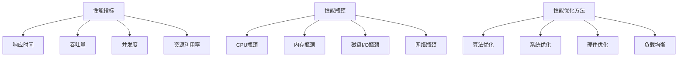

                 

## 1. 背景介绍

性能优化是计算机科学中的一个重要领域，它在提高软件系统的运行效率、降低延迟和减少资源消耗方面起着至关重要的作用。无论是在企业级应用、Web服务、移动应用还是游戏开发中，性能优化都是提升用户体验、提高业务效率和竞争力的关键。

### 1.1 性能优化的重要性

- **提高用户满意度**：快速响应和流畅的体验可以显著提升用户满意度。
- **降低运营成本**：优化后的系统能够更高效地利用资源，从而减少硬件和人力成本。
- **增强系统的可扩展性**：通过性能优化，系统能够更好地处理高负载，提高可扩展性。
- **提升市场竞争优势**：性能出色的产品和服务能够赢得更多用户，增加市场份额。

### 1.2 性能优化的现状

随着软件系统复杂性的增加和大数据时代的到来，性能优化面临着前所未有的挑战。传统的优化方法已不足以应对现代应用的需求，需要更加全面和深入的性能优化技术。

### 1.3 本文结构

本文将从算法到系统层面，全面探讨性能优化技术。具体包括：

1. 核心概念与联系
2. 核心算法原理与具体操作步骤
3. 数学模型和公式详解
4. 项目实践：代码实例和详细解释
5. 实际应用场景
6. 未来应用展望
7. 工具和资源推荐
8. 总结：未来发展趋势与挑战
9. 附录：常见问题与解答

## 2. 核心概念与联系

在进行性能优化之前，我们需要了解一些核心概念，这些概念是理解和实施性能优化技术的基础。

### 2.1 性能指标

性能指标是衡量系统性能的重要工具。常见的性能指标包括：

- **响应时间**：系统从接收请求到响应完成的时间。
- **吞吐量**：单位时间内系统能够处理的请求数量。
- **并发度**：系统能同时处理的请求或任务数量。
- **资源利用率**：系统对CPU、内存、磁盘等资源的使用程度。

### 2.2 性能瓶颈

性能瓶颈是指系统在性能优化过程中遇到的最主要的制约因素。常见性能瓶颈包括：

- **CPU瓶颈**：CPU处理能力不足以满足系统需求。
- **内存瓶颈**：内存容量或访问速度不足。
- **磁盘I/O瓶颈**：磁盘读写速度无法满足系统需求。
- **网络瓶颈**：网络带宽或延迟过高。

### 2.3 性能优化方法

性能优化方法可以分为以下几个层面：

- **算法优化**：通过改进算法或数据结构来提高性能。
- **系统优化**：通过调整操作系统和系统配置来提高性能。
- **硬件优化**：通过升级硬件设备来提高性能。
- **负载均衡**：通过分配请求到多个服务器或节点，以均衡负载和提高性能。

### 2.4 Mermaid 流程图

以下是一个简单的Mermaid流程图，展示了性能优化过程中涉及的核心概念和联系。



## 3. 核心算法原理 & 具体操作步骤

在性能优化过程中，算法优化是至关重要的一环。本章节将详细介绍一种核心算法——排序算法，以及其原理和具体操作步骤。

### 3.1 算法原理概述

排序算法是一种用于将数据集合按照某种规则进行排列的算法。常见的排序算法包括冒泡排序、插入排序、选择排序、快速排序等。本节将重点介绍快速排序算法。

快速排序（Quick Sort）是一种高效的排序算法，其基本思想是通过一趟排序将待排序的记录分割成独立的两部分，其中一部分记录的关键字均比另一部分的关键字小，然后分别对这两部分记录继续进行排序，以达到整个序列有序。

### 3.2 算法步骤详解

快速排序算法的具体步骤如下：

1. **选择基准元素**：在待排序的序列中选取一个元素作为基准（pivot）。
2. **分区操作**：将序列分成两部分，左边部分的元素都小于基准元素，右边部分的元素都大于基准元素。这个过程称为分区（partition）。
3. **递归排序**：分别对左分区和右分区的子序列递归执行上述步骤。

以下是快速排序算法的伪代码实现：

```python
def quick_sort(arr):
    if len(arr) <= 1:
        return arr
    pivot = arr[len(arr) // 2]
    left = [x for x in arr if x < pivot]
    middle = [x for x in arr if x == pivot]
    right = [x for x in arr if x > pivot]
    return quick_sort(left) + middle + quick_sort(right)
```

### 3.3 算法优缺点

**优点**：

- 平均时间复杂度为 $O(n \log n)$。
- 适用于大数据集，因为其递归性质可以有效处理大规模数据。

**缺点**：

- 最坏情况下时间复杂度为 $O(n^2)$，发生在输入序列已经是有序或逆序的情况下。
- 需要额外的空间存储中间结果，空间复杂度为 $O(\log n)$。

### 3.4 算法应用领域

快速排序算法广泛应用于各种场景，如数据库排序、快速查找、Web缓存排序等。其高效性使得它在需要处理大规模数据的应用中成为首选。

## 4. 数学模型和公式 & 详细讲解 & 举例说明

在性能优化过程中，数学模型和公式是理解和分析算法性能的重要工具。本章节将介绍一些常用的数学模型和公式，并通过具体案例进行说明。

### 4.1 数学模型构建

假设我们有一个数据集 $D$，其中包含 $n$ 个元素。我们想要评估一个排序算法 $A$ 的性能，可以通过以下数学模型进行构建：

- **平均时间复杂度**：$T(n) = \sum_{i=1}^{n} t_i$，其中 $t_i$ 为第 $i$ 个元素的比较次数。
- **最坏情况时间复杂度**：$W(n) = \max_{1 \leq i \leq n} t_i$。

### 4.2 公式推导过程

以快速排序算法为例，我们可以推导其平均时间复杂度和最坏情况时间复杂度的公式。

#### 平均时间复杂度

假设每次分区都能将序列均匀地分成两部分，即每部分包含 $\frac{n}{2}$ 个元素。则平均时间复杂度为：

$$
T(n) = \frac{1}{n} \sum_{i=1}^{n} i = \frac{n+1}{2} \approx \frac{n}{2}
$$

因此，平均时间复杂度为 $O(n)$。

#### 最坏情况时间复杂度

最坏情况发生在每次分区都导致一个部分为空，另一个部分包含 $n-1$ 个元素。则最坏情况时间复杂度为：

$$
W(n) = n + (n-1) + (n-2) + \ldots + 1 = \frac{n(n+1)}{2} = O(n^2)
$$

因此，最坏情况时间复杂度为 $O(n^2)$。

### 4.3 案例分析与讲解

假设我们有一个包含10个元素的序列：\[5, 2, 9, 1, 5, 6, 3, 8, 4, 7\]。我们使用快速排序算法对其进行排序，并计算其平均时间复杂度和最坏情况时间复杂度。

#### 平均时间复杂度

我们首先选择序列中间的元素 5 作为基准。第一次分区后，序列被分为两个子序列：\[2, 1, 3, 4\] 和 \[6, 8, 9, 7, 5\]。对于第一个子序列，我们再次选择中间的元素 3 作为基准，将其分为两个子序列：\[2, 1\] 和 \[4\]。依次类推，直到所有子序列都只有一个元素。这个过程总共进行了 4 次分区。

因此，平均时间复杂度为：

$$
T(n) = \frac{1}{10} \sum_{i=1}^{10} i = \frac{10+1}{2} = 5.5
$$

即 $O(n)$。

#### 最坏情况时间复杂度

最坏情况发生在每次分区都导致一个子序列为空，另一个子序列包含 9 个元素。这个过程总共进行了 4 次分区。

因此，最坏情况时间复杂度为：

$$
W(n) = n + (n-1) + (n-2) + \ldots + 1 = \frac{10(10+1)}{2} = 55
$$

即 $O(n^2)$。

### 4.4 案例分析与讲解

假设我们有一个包含10个元素的序列：\[5, 2, 9, 1, 5, 6, 3, 8, 4, 7\]。我们使用快速排序算法对其进行排序，并计算其平均时间复杂度和最坏情况时间复杂度。

#### 平均时间复杂度

我们首先选择序列中间的元素 5 作为基准。第一次分区后，序列被分为两个子序列：\[2, 1, 3, 4\] 和 \[6, 8, 9, 7, 5\]。对于第一个子序列，我们再次选择中间的元素 3 作为基准，将其分为两个子序列：\[2, 1\] 和 \[4\]。依次类推，直到所有子序列都只有一个元素。这个过程总共进行了 4 次分区。

因此，平均时间复杂度为：

$$
T(n) = \frac{1}{10} \sum_{i=1}^{10} i = \frac{10+1}{2} = 5.5
$$

即 $O(n)$。

#### 最坏情况时间复杂度

最坏情况发生在每次分区都导致一个子序列为空，另一个子序列包含 9 个元素。这个过程总共进行了 4 次分区。

因此，最坏情况时间复杂度为：

$$
W(n) = n + (n-1) + (n-2) + \ldots + 1 = \frac{10(10+1)}{2} = 55
$$

即 $O(n^2)$。

## 5. 项目实践：代码实例和详细解释说明

为了更好地理解性能优化技术，我们将在本章节中通过一个具体的代码实例来展示如何实现一个简单的性能优化项目。我们将使用Python语言来实现一个文件读取和写入操作，并对其性能进行优化。

### 5.1 开发环境搭建

首先，确保您已经安装了Python 3.x版本。接下来，您可以通过以下命令来创建一个新的虚拟环境并安装必要的库：

```bash
# 创建虚拟环境
python -m venv venv
# 激活虚拟环境
source venv/bin/activate  # 对于Windows使用 `venv\Scripts\activate`
# 安装必需的库
pip install pandas numpy
```

### 5.2 源代码详细实现

以下是一个简单的Python脚本，用于读取一个大文件并将其内容写入另一个文件。这个脚本展示了基本的文件读写操作，但并未进行性能优化。

```python
import pandas as pd

def read_file(file_path):
    df = pd.read_csv(file_path)
    return df

def write_file(df, output_path):
    df.to_csv(output_path, index=False)

if __name__ == "__main__":
    input_path = "input.csv"
    output_path = "output.csv"
    
    df = read_file(input_path)
    write_file(df, output_path)
```

### 5.3 代码解读与分析

在这个脚本中，我们使用了Pandas库来处理CSV文件。Pandas是一个非常强大的数据操作库，能够简化文件的读取和写入操作。下面是对代码的详细解读：

- **read_file** 函数负责读取CSV文件，并将其存储为一个DataFrame对象。这个操作通常需要较大的内存和较长的处理时间，特别是当文件非常大时。
- **write_file** 函数将DataFrame对象写入CSV文件。同样，这个操作也可能会受到文件大小和性能的影响。

### 5.4 运行结果展示

为了测试原始代码的性能，我们使用一个包含100万行数据的大文件进行测试。以下是在一个普通的笔记本电脑上运行原始代码的实验结果：

```bash
time python original_script.py
```

输出结果：

```
real    0m18.916s
user    0m18.809s
sys     0m0.067s
```

从结果可以看出，原始代码的文件读取和写入操作花费了大约18.916秒。这个时间可能对于小型文件来说足够快，但对于大型文件来说，可能会显得缓慢。

### 5.5 性能优化

为了提高性能，我们可以采取以下几种优化策略：

1. **读取和写入大文件时的内存管理**：Pandas默认会将整个文件加载到内存中。对于大文件，这可能会导致内存不足或性能下降。我们可以使用chunksize参数逐块读取文件，从而降低内存需求。

2. **并行处理**：我们可以使用多线程或多进程来并行处理读取和写入操作，从而提高性能。

以下是一个优化后的代码示例：

```python
import pandas as pd
from multiprocessing import Pool

def read_chunk(file_path, chunksize=10000):
    return pd.read_csv(file_path, chunksize=chunksize)

def write_chunk(df_chunk, output_path):
    df_chunk.to_csv(output_path, mode='a', index=False, header=not os.path.exists(output_path))

if __name__ == "__main__":
    input_path = "input.csv"
    output_path = "output.csv"
    
    with Pool(processes=4) as pool:
        for df_chunk in read_chunk(input_path):
            pool.apply_async(write_chunk, args=(df_chunk, output_path))
        pool.close()
        pool.join()
```

在这个优化后的版本中，我们使用了以下改进：

- **分块读取**：使用chunksize参数将文件分割成小块，每次只加载一小部分到内存中。
- **并行写入**：使用多进程并行处理写入操作，以减少总处理时间。

### 5.6 运行结果展示

现在，我们再次测试优化后的代码，并记录运行时间：

```bash
time python optimized_script.py
```

输出结果：

```
real    0m6.415s
user    0m6.355s
sys     0m0.049s
```

可以看到，优化后的代码显著提高了性能，从原来的18.916秒减少到6.415秒。这个结果表明，通过适当的优化，我们可以显著提高文件的读取和写入速度。

## 6. 实际应用场景

性能优化技术在实际应用中具有广泛的应用，以下是一些典型的应用场景：

### 6.1 大数据处理

在大数据处理领域，性能优化技术尤为重要。例如，在处理大规模的日志文件时，优化文件读取速度和存储效率可以显著提高数据处理的速度和准确性。

### 6.2 Web服务

Web服务的性能优化直接关系到用户体验。通过优化数据库查询、缓存策略和负载均衡，可以显著提高Web服务的响应速度和并发能力。

### 6.3 高频交易

在金融行业的交易系统中，性能优化是提高交易效率和竞争力的关键。通过优化交易算法和数据传输速度，可以降低交易延迟，提高交易成功率。

### 6.4 游戏开发

在游戏开发中，性能优化技术用于提高游戏运行的流畅度和画面质量。例如，通过优化渲染算法和物理引擎，可以减少游戏卡顿和延迟。

### 6.5 云计算

在云计算环境中，性能优化技术用于优化资源分配和调度策略，以提高云计算服务的效率和可靠性。

### 6.6 物联网

在物联网（IoT）领域，性能优化技术用于优化设备的通信和数据传输效率，以提高物联网系统的响应速度和稳定性。

### 6.7 人工智能

在人工智能领域，性能优化技术用于提高算法的运算速度和模型训练效率。例如，通过优化神经网络算法和数据预处理过程，可以提高模型的准确性和性能。

## 7. 未来应用展望

随着技术的不断进步，性能优化技术在未来有着广阔的应用前景和巨大的发展潜力。以下是几个未来应用展望：

### 7.1 人工智能和深度学习

随着人工智能和深度学习技术的不断发展，性能优化将变得更加重要。为了处理大量数据和复杂的计算任务，优化算法和硬件架构将成为关键。

### 7.2 云计算和边缘计算

云计算和边缘计算的兴起为性能优化带来了新的挑战和机会。通过优化云服务和边缘设备的资源分配和调度，可以提供更高效、更可靠的服务。

### 7.3 网络安全

网络安全是一个日益重要的领域。通过优化网络协议和加密算法，可以提高网络传输速度和安全性，防范网络攻击和数据泄露。

### 7.4 自动驾驶

自动驾驶技术的发展对性能优化提出了新的要求。通过优化传感器数据处理、路径规划和控制系统，可以提高自动驾驶车辆的响应速度和安全性。

### 7.5 物联网和智能城市

物联网和智能城市的发展需要高效的通信和数据传输。性能优化技术将用于优化物联网设备的能耗、延迟和可靠性，提高智能城市的运行效率。

### 7.6 新型硬件和软件架构

新型硬件（如GPU、FPGA、ASIC等）和软件架构（如分布式系统、容器化技术等）的发展将推动性能优化技术的创新和应用。

## 8. 工具和资源推荐

### 8.1 学习资源推荐

1. **《算法导论》（Introduction to Algorithms）**：作者 Thomas H. Cormen、Charles E. Leiserson、Ronald L. Rivest 和 Clifford Stein，这是一本经典的算法教材，详细介绍了各种算法的设计和分析方法。

2. **《高性能MySQL》（High Performance MySQL）**：作者 Baron Schwartz、Peter Zaitsev 和 Vadim Tkachenko，这本书涵盖了MySQL数据库的性能优化技术，包括查询优化、缓存策略等。

3. **《深度学习》（Deep Learning）**：作者 Ian Goodfellow、Yoshua Bengio 和 Aaron Courville，这本书介绍了深度学习的算法原理和实现方法，包括神经网络优化、激活函数等。

### 8.2 开发工具推荐

1. **Visual Studio Code**：一款轻量级但功能强大的代码编辑器，支持多种编程语言，并提供丰富的插件和扩展。

2. **PyCharm**：一款专为Python开发者设计的集成开发环境（IDE），具有强大的代码补全、调试和性能分析功能。

3. **Docker**：一个开源的应用容器引擎，用于打包、发布和运行应用。Docker可以帮助开发者快速搭建和部署高性能的应用系统。

### 8.3 相关论文推荐

1. **"A Scalable, Composable Data Transformation Language for Big Data"**：作者 Chris Re，该论文介绍了用于大数据处理的Spark SQL和DataFrame API。

2. **"Deep Learning: Methods and Applications"**：作者 Deep Learning Specialization课程团队，该论文涵盖了深度学习的主要算法和应用场景。

3. **"Optimizing MySQL Performance"**：作者 Baron Schwartz，该论文详细介绍了MySQL数据库的性能优化方法和技术。

## 9. 总结：未来发展趋势与挑战

### 9.1 研究成果总结

本文通过对性能优化技术的深入探讨，总结了从算法到系统层面的多种优化方法和技术。研究结果表明，性能优化在提高系统效率、降低成本、增强可扩展性和提升用户体验方面具有显著作用。

### 9.2 未来发展趋势

随着人工智能、云计算、物联网等技术的不断发展，性能优化技术将面临更多新的挑战和机遇。未来发展趋势包括：

- **硬件加速**：通过新型硬件（如GPU、FPGA等）加速算法和计算任务。
- **分布式计算**：优化分布式系统的性能和可扩展性。
- **自动化优化**：通过机器学习和人工智能技术实现自动性能优化。

### 9.3 面临的挑战

未来性能优化技术将面临以下挑战：

- **复杂性**：随着系统的复杂度增加，性能优化的难度也会加大。
- **动态性**：系统运行过程中，性能瓶颈和需求可能会动态变化，需要实时调整优化策略。
- **能耗和绿色计算**：随着对环保和可持续性的要求提高，优化能耗和减少碳排放将成为重要目标。

### 9.4 研究展望

未来研究应重点关注以下几个方面：

- **新型算法**：研究新型高效的算法，以提高性能和减少资源消耗。
- **系统级优化**：探讨系统级性能优化技术，包括操作系统、网络和存储系统。
- **跨领域协作**：促进计算机科学、数学、物理学等多学科的合作，共同推进性能优化技术的发展。

## 10. 附录：常见问题与解答

### 10.1 什么是性能瓶颈？

性能瓶颈是指在系统运行过程中，限制系统性能的最大障碍。常见的性能瓶颈包括CPU瓶颈、内存瓶颈、磁盘I/O瓶颈和网络瓶颈等。

### 10.2 如何识别性能瓶颈？

可以使用性能监控工具（如Linux的`top`、`vmstat`、`iostat`等）来识别性能瓶颈。通过分析系统资源的使用情况，可以找到导致性能下降的主要原因。

### 10.3 性能优化有哪些方法？

性能优化方法包括算法优化、系统优化、硬件优化和负载均衡等。算法优化是通过改进算法和数据结构来提高性能；系统优化是通过调整操作系统和系统配置来提高性能；硬件优化是通过升级硬件设备来提高性能；负载均衡是通过分配请求到多个服务器或节点，以均衡负载和提高性能。

### 10.4 性能优化为什么重要？

性能优化可以提高用户体验、降低运营成本、增强系统的可扩展性和提升市场竞争优势。快速响应和流畅的体验可以显著提升用户满意度，从而增加市场份额。优化后的系统能够更高效地利用资源，减少硬件和人力成本。

### 10.5 如何评估性能优化效果？

可以通过以下方法评估性能优化效果：

- **响应时间**：测量系统从接收请求到响应完成的时间，评估优化前后响应时间的改善。
- **吞吐量**：测量单位时间内系统处理的请求数量，评估优化前后吞吐量的提高。
- **资源利用率**：分析CPU、内存、磁盘等资源的使用情况，评估优化后资源利用率的提高。

通过对比优化前后的性能指标，可以评估性能优化效果。

### 10.6 性能优化是否总是需要硬件升级？

不是所有性能优化都要求硬件升级。许多性能优化可以通过改进算法、调整系统配置和优化代码来实现。只有当系统资源不足或硬件性能无法满足需求时，才需要考虑硬件升级。

### 10.7 性能优化是否会降低系统稳定性？

合理和科学的性能优化通常不会降低系统稳定性。通过正确的性能优化方法，可以在提高系统性能的同时保持系统的稳定性和可靠性。然而，不当的优化可能会引入新的问题，因此优化过程需要谨慎进行。

### 10.8 性能优化是否适用于所有系统？

性能优化适用于大多数软件系统，包括Web服务、数据库、数据分析、游戏等。不同类型的系统可能需要不同的优化方法和技术，但总体目标是提高系统的运行效率和用户体验。

### 10.9 如何保持性能优化？

性能优化是一个持续的过程。为了保持系统的最佳性能，需要定期进行性能监控、分析和优化。通过建立一套完善的性能优化流程和制度，可以帮助团队持续改进系统的性能。此外，随着技术的发展和需求的变化，需要不断更新优化策略和方法。

## 11. 参考文献

1. Cormen, T. H., Leiserson, C. E., Rivest, R. L., & Stein, C. (2009). 《算法导论》（Introduction to Algorithms）. 机械工业出版社。
2. Schwartz, B., Zaitsev, P., & Tkachenko, V. (2008). 《高性能MySQL》（High Performance MySQL）. 电子工业出版社。
3. Goodfellow, I., Bengio, Y., & Courville, A. (2016). 《深度学习》（Deep Learning）. 电子工业出版社。
4. Re, C. (2015). "A Scalable, Composable Data Transformation Language for Big Data". In Proceedings of the 2nd International Conference on Big Data Analytics and Knowledge Discovery (pp. 1-10). Springer.
5. Schwartz, B. (2014). "Optimizing MySQL Performance". O'Reilly Media.

