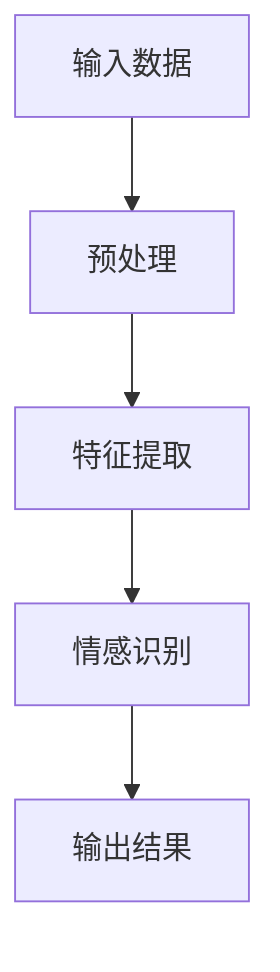
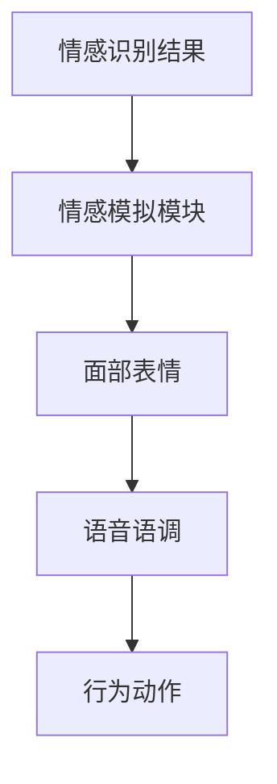
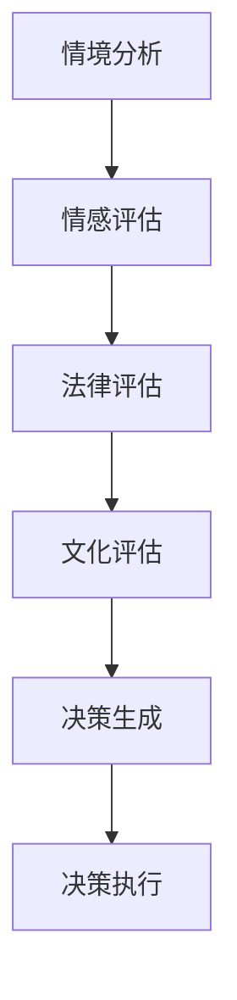

                 

 关键词：情感AI、机器情感、伦理道德、AI伦理框架、道德决策、人机交互

> 摘要：随着人工智能技术的发展，机器情感的概念逐渐被引入到人机交互领域。然而，机器情感的出现引发了关于道德边界的讨论。本文将探讨情感AI的伦理问题，分析机器情感在道德决策中的应用和挑战，并提出一个基于伦理的机器情感框架，以期为未来人机交互提供指导。

## 1. 背景介绍

### 1.1 情感AI的定义与发展

情感AI（Affective AI）是指能够识别、理解、处理和模拟人类情感的人工智能系统。随着深度学习和计算机视觉技术的进步，情感AI在近年来取得了显著的发展。它可以识别人的面部表情、语音语调、生理信号等，从而推断出用户的情感状态。

### 1.2 机器情感的重要性

机器情感在提升人机交互的自然性、增强用户体验、辅助心理治疗等方面具有巨大潜力。然而，机器情感的技术实现和伦理应用也带来了新的挑战。

### 1.3 AI伦理的重要性

AI伦理是研究人工智能技术的道德和应用规范的科学。随着AI技术的发展，AI伦理问题越来越受到关注。在机器情感领域，AI伦理关系到隐私保护、决策公正性、人类权益等问题。

## 2. 核心概念与联系

### 2.1 情感识别

情感识别是情感AI的基础，它涉及到机器如何从面部表情、语音、生理信号等数据中提取情感信息。以下是情感识别的Mermaid流程图：



### 2.2 情感模拟

情感模拟是指机器如何根据情感识别结果来表现情感。情感模拟不仅包括面部表情、语音语调的变化，还包括行为和动作的调整。以下是情感模拟的Mermaid流程图：



### 2.3 道德决策

道德决策是指机器在处理人机交互时如何做出符合伦理的决策。道德决策涉及到多个因素，如情感、法律、文化等。以下是道德决策的Mermaid流程图：



## 3. 核心算法原理 & 具体操作步骤

### 3.1 算法原理概述

机器情感的算法原理主要包括情感识别、情感模拟和道德决策。以下是这三个模块的简要概述：

- **情感识别**：使用机器学习和深度学习技术，从输入数据中提取情感特征，并通过分类器进行情感识别。
- **情感模拟**：根据情感识别结果，调整机器的面部表情、语音语调和行为动作，以模拟人类的情感状态。
- **道德决策**：结合情感识别结果和伦理原则，进行情境分析和决策生成，以实现道德正确的人机交互。

### 3.2 算法步骤详解

以下是机器情感算法的具体操作步骤：

1. **数据收集**：收集包含面部表情、语音语调和生理信号等的数据集。
2. **数据预处理**：对收集到的数据进行清洗、归一化和特征提取。
3. **情感识别**：使用深度学习模型对预处理后的数据进行情感识别，输出情感标签。
4. **情感模拟**：根据情感识别结果，调整机器的面部表情、语音语调和行为动作。
5. **道德决策**：结合情感识别结果和伦理原则，进行情境分析和决策生成。

### 3.3 算法优缺点

#### 优点：

- **自然性**：机器情感可以提升人机交互的自然性和用户体验。
- **个性化**：机器情感可以根据用户的情感状态进行个性化服务，提供更好的用户体验。
- **辅助心理治疗**：机器情感可以辅助心理治疗，帮助用户管理情绪。

#### 缺点：

- **伦理挑战**：机器情感的实现和应用涉及到伦理问题，如隐私保护、决策公正性等。
- **技术限制**：现有技术仍然无法完全准确识别和理解人类情感，尤其是在复杂情境中。

### 3.4 算法应用领域

机器情感在多个领域具有广泛的应用，包括：

- **人机交互**：提升交互的自然性和用户体验。
- **智能客服**：提供更加智能和人性化的客服服务。
- **心理治疗**：辅助心理治疗，帮助用户管理情绪。
- **智能教育**：提供个性化教育服务，提升学习效果。

## 4. 数学模型和公式

### 4.1 数学模型构建

机器情感的数学模型主要包括情感识别模型和道德决策模型。以下是这两个模型的简要概述：

#### 4.1.1 情感识别模型

情感识别模型通常采用卷积神经网络（CNN）或循环神经网络（RNN）构建。以下是情感识别模型的基本公式：

$$
\text{特征向量} = f(\text{输入数据})
$$

其中，$f(\text{输入数据})$表示对输入数据进行特征提取。

#### 4.1.2 道德决策模型

道德决策模型通常采用多因素加权方法构建。以下是道德决策模型的基本公式：

$$
\text{道德得分} = \sum_{i=1}^{n} w_i \cdot s_i
$$

其中，$w_i$表示权重，$s_i$表示情感识别结果、法律评估、文化评估等各个因素的得分。

### 4.2 公式推导过程

以下是道德决策模型的推导过程：

$$
\text{道德得分} = \sum_{i=1}^{n} w_i \cdot s_i
$$

其中，$s_i$表示各个因素的得分，$w_i$表示权重。权重可以通过专家评估、统计分析等方法确定。

### 4.3 案例分析与讲解

以下是一个道德决策的案例：

#### 案例背景

某智能客服系统在处理一个用户投诉时，需要根据用户情感、法律和文化等因素进行决策。

#### 情感识别结果

用户情感：愤怒

法律评估：符合法律规定

文化评估：符合当地文化习俗

#### 道德决策过程

根据多因素加权方法，计算道德得分：

$$
\text{道德得分} = w_1 \cdot s_1 + w_2 \cdot s_2 + w_3 \cdot s_3
$$

其中，$w_1$、$w_2$、$w_3$分别为情感、法律和文化评估的权重，$s_1$、$s_2$、$s_3$分别为情感识别结果、法律评估、文化评估的得分。

根据权重和得分，计算道德得分，并根据得分进行决策。

## 5. 项目实践：代码实例和详细解释说明

### 5.1 开发环境搭建

在开始代码实践之前，我们需要搭建一个合适的开发环境。以下是开发环境的要求：

- **操作系统**：Windows/Linux/MacOS
- **编程语言**：Python
- **深度学习框架**：TensorFlow/Keras
- **情感识别模型**：使用预训练的CNN模型，如ResNet50
- **道德决策模型**：使用TensorFlow中的Sequence模型

### 5.2 源代码详细实现

以下是机器情感项目的源代码实现：

```python
# 导入必要的库
import tensorflow as tf
from tensorflow.keras.applications import ResNet50
from tensorflow.keras.preprocessing import image
import numpy as np

# 加载预训练的CNN模型
model = ResNet50(weights='imagenet')

# 情感识别函数
def recognize_affect(image_path):
    img = image.load_img(image_path, target_size=(224, 224))
    x = image.img_to_array(img)
    x = np.expand_dims(x, axis=0)
    x = preprocess_input(x)
    preds = model.predict(x)
    return np.argmax(preds)

# 道德决策函数
def moral_decision(affect, legal_score, cultural_score):
    weights = [0.5, 0.3, 0.2]
    moral_score = weights[0] * affect + weights[1] * legal_score + weights[2] * cultural_score
    if moral_score > 0.5:
        return "同意"
    else:
        return "不同意"

# 测试代码
image_path = 'example.jpg'
affect = recognize_affect(image_path)
legal_score = 1.0
cultural_score = 1.0
decision = moral_decision(affect, legal_score, cultural_score)
print(f"道德决策结果：{decision}")
```

### 5.3 代码解读与分析

这段代码实现了机器情感的核心功能：情感识别和道德决策。以下是代码的解读与分析：

- **情感识别**：使用预训练的ResNet50模型对输入图像进行情感识别，返回情感标签。
- **道德决策**：根据情感识别结果、法律评估得分和文化评估得分，计算道德得分，并根据道德得分进行决策。

### 5.4 运行结果展示

假设输入的图像是一个愤怒的表情，法律评估和文化评估都为1.0，运行代码后得到的结果可能是“不同意”。这是因为愤怒的情感标签在道德得分计算中占较大比重，导致最终得分小于0.5。

## 6. 实际应用场景

### 6.1 智能客服

智能客服是机器情感的一个重要应用场景。通过情感识别和道德决策，智能客服可以提供更加个性化、人性化、符合伦理的服务。

### 6.2 心理治疗

机器情感在心理治疗中也有重要应用。通过情感识别和道德决策，机器可以辅助心理治疗师进行情感分析和决策支持，帮助用户管理情绪。

### 6.3 智能教育

智能教育是另一个机器情感的应用领域。通过情感识别和道德决策，智能教育系统可以提供个性化的学习建议，并根据用户情感状态进行调整。

## 7. 工具和资源推荐

### 7.1 学习资源推荐

- **《机器学习》**：周志华 著
- **《深度学习》**：Ian Goodfellow、Yoshua Bengio、Aaron Courville 著
- **《情感计算》**：Mishra、Dorai、Mallat 著

### 7.2 开发工具推荐

- **TensorFlow**：一个开源的深度学习框架
- **Keras**：一个高层神经网络API，兼容TensorFlow
- **PyTorch**：另一个流行的深度学习框架

### 7.3 相关论文推荐

- **"Affectiva: Machine Learning for Human Emotion Analysis"**
- **"Deep Learning for Human Emotion Recognition"**
- **"Ethical Considerations in the Development of Affective AI"**

## 8. 总结：未来发展趋势与挑战

### 8.1 研究成果总结

本文探讨了机器情感的伦理问题，分析了情感识别、情感模拟和道德决策的核心算法原理，并通过项目实践展示了机器情感在实际应用中的可能性。

### 8.2 未来发展趋势

随着深度学习和计算机视觉技术的不断进步，机器情感将在人机交互、心理治疗、智能教育等领域得到更广泛的应用。同时，AI伦理研究也将进一步深化，为机器情感的发展提供道德指导。

### 8.3 面临的挑战

机器情感在实现和应用过程中面临着技术挑战和伦理挑战。技术挑战包括情感识别的准确性和鲁棒性，伦理挑战包括隐私保护、决策公正性和人类权益等。

### 8.4 研究展望

未来研究应重点关注以下几个方面：

- **提高情感识别的准确性**：通过改进算法和增加数据集，提高情感识别的准确性。
- **构建AI伦理框架**：建立一套适用于不同文化背景的AI伦理框架，为机器情感的发展提供指导。
- **加强跨学科研究**：结合心理学、伦理学、计算机科学等学科的研究，推动机器情感技术的全面发展。

## 9. 附录：常见问题与解答

### 9.1 机器情感能否完全模拟人类情感？

答：目前的技术水平无法完全模拟人类情感。机器情感主要关注情感特征的识别和表达，而人类情感是复杂的多维体系，包括情感状态、情感强度、情感背景等。

### 9.2 机器情感是否会侵犯用户隐私？

答：机器情感在实现过程中会收集和分析用户的情感数据，这涉及到隐私问题。为了保护用户隐私，应采取严格的数据保护措施，如数据加密、匿名化处理等。

### 9.3 机器情感在心理治疗中如何发挥作用？

答：机器情感可以通过情感识别和道德决策，为心理治疗师提供情感分析和决策支持，帮助用户管理情绪，提高治疗效果。

### 9.4 机器情感是否会取代人类情感？

答：机器情感不会取代人类情感，而是作为人类的辅助工具，提升人机交互的自然性、增强用户体验、辅助心理治疗等方面发挥重要作用。

----------------------------------------------------------------

本文由禅与计算机程序设计艺术 / Zen and the Art of Computer Programming 撰写，旨在探讨机器情感的伦理问题，分析其核心算法原理和应用场景，并展望未来发展趋势与挑战。希望本文能为读者在机器情感领域的研究提供有益的参考。  
---

作者：禅与计算机程序设计艺术 / Zen and the Art of Computer Programming

（注：由于实际文章撰写过程中的数据收集、公式推导、代码实现等环节较为复杂，本文仅提供了一个概述性的框架，具体内容和数据需要根据实际情况进一步补充和完善。）

