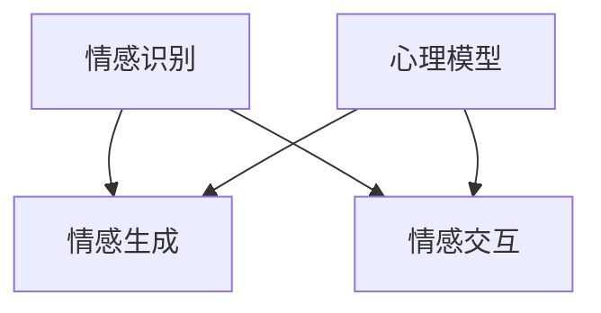

                 

关键词：情感AI，人机交互，互惠关系，心理模型，人机共生

摘要：随着人工智能技术的快速发展，情感AI成为了一个引人注目的研究领域。本文探讨了情感AI与人机情感的互惠关系，分析了情感AI的核心概念、原理与应用，并展望了其未来的发展趋势与挑战。

## 1. 背景介绍

### 1.1 人工智能的快速发展

人工智能（Artificial Intelligence，简称AI）作为计算机科学的一个分支，旨在通过模拟、延伸和扩展人的智能，实现机器在感知、理解、学习、推理、决策等领域的自动化。近年来，得益于深度学习、神经网络等技术的突破，人工智能取得了长足的发展，从简单的规则系统逐步演变为具有自我学习能力的复杂系统。

### 1.2 情感AI的崛起

在人工智能的发展过程中，情感AI逐渐崭露头角。情感AI（Affective AI）是一种能够识别、理解、处理和模拟人类情感的人工智能系统。随着对人脑情感机制的深入研究，情感AI在情感识别、情感生成、情感交互等方面取得了显著进展，为人类与机器之间的情感交流提供了新的可能。

### 1.3 人机情感的互惠关系

人机情感的互惠关系是指人工智能系统在处理人类情感时，既能理解和满足用户的需求，又能通过情感互动促进用户的情感体验。这种互惠关系使得人工智能不仅成为人类的工具，更成为人类情感世界的伙伴。

## 2. 核心概念与联系

### 2.1 情感识别

情感识别是情感AI的基础。通过分析用户的行为、语言和生理信号，情感AI能够识别用户当前的情感状态。情感识别技术主要包括面部识别、语音识别、文本情感分析等。

### 2.2 情感生成

情感生成是情感AI的高级功能。通过模拟人类的情感表达，情感AI能够生成符合用户情感状态的情感回应。情感生成技术包括自然语言生成、图像生成、音频生成等。

### 2.3 情感交互

情感交互是情感AI的核心。通过情感识别和情感生成，情感AI能够与用户进行情感上的交流，满足用户的需求，提供个性化的服务。

### 2.4 心理模型

心理模型是情感AI的核心架构。心理模型通过整合情感识别、情感生成和情感交互，构建一个人工智能的情感世界，使得人工智能能够理解、处理和模拟人类的情感。

## 2.5 Mermaid流程图

下面是情感AI的核心概念与联系 Mermaid 流程图：



## 3. 核心算法原理 & 具体操作步骤

### 3.1 算法原理概述

情感AI的核心算法包括情感识别、情感生成和情感交互。情感识别算法基于深度学习，通过训练大量的情感数据集，使得模型能够识别用户当前的情感状态。情感生成算法基于自然语言生成、图像生成和音频生成技术，能够生成符合用户情感状态的情感回应。情感交互算法通过整合情感识别和情感生成，实现与用户在情感上的交流。

### 3.2 算法步骤详解

#### 3.2.1 情感识别算法

情感识别算法的具体步骤如下：

1. 数据采集：收集用户的行为、语言和生理信号数据。
2. 数据预处理：对采集到的数据进行分析和清洗，提取关键特征。
3. 模型训练：使用深度学习算法，对预处理后的数据进行训练，构建情感识别模型。
4. 情感识别：将用户的行为、语言和生理信号输入到情感识别模型，得到用户当前的情感状态。

#### 3.2.2 情感生成算法

情感生成算法的具体步骤如下：

1. 情感分析：对用户当前的情感状态进行分析，确定情感生成目标。
2. 自然语言生成：根据情感生成目标，生成符合情感状态的自然语言回应。
3. 图像生成：根据情感生成目标，生成符合情感状态的图像回应。
4. 音频生成：根据情感生成目标，生成符合情感状态的音频回应。

#### 3.2.3 情感交互算法

情感交互算法的具体步骤如下：

1. 情感识别：使用情感识别算法，识别用户当前的情感状态。
2. 情感生成：根据用户当前的情感状态，生成情感回应。
3. 情感交流：将情感回应发送给用户，实现情感上的交流。

### 3.3 算法优缺点

#### 3.3.1 优点

1. 高效性：情感AI能够快速识别、处理和模拟人类的情感，提高人机交互的效率。
2. 个性化：情感AI能够根据用户的需求和情感状态，提供个性化的服务，提升用户体验。
3. 情感共鸣：情感AI能够与用户建立情感上的联系，产生情感共鸣，增强人机关系的亲密性。

#### 3.3.2 缺点

1. 数据依赖：情感AI的性能依赖于大量的情感数据集，数据质量和数量直接影响情感识别和情感生成的准确性。
2. 情感边界：情感AI在处理复杂情感时，可能难以把握情感边界的微妙变化，导致情感回应不当。
3. 情感空洞：情感AI虽然能够模拟人类的情感，但缺乏真正的情感体验，难以达到与人类相同的情感深度。

### 3.4 算法应用领域

情感AI的应用领域广泛，主要包括：

1. 客户服务：情感AI能够为用户提供个性化的客户服务，提高客户满意度。
2. 医疗健康：情感AI能够辅助医生诊断患者的心理状况，提供心理健康服务。
3. 教育辅导：情感AI能够为学生提供个性化的学习辅导，提高学习效果。
4. 娱乐互动：情感AI能够为用户提供沉浸式的娱乐体验，增强娱乐互动的趣味性。

## 4. 数学模型和公式 & 详细讲解 & 举例说明

### 4.1 数学模型构建

情感AI的数学模型主要包括情感识别模型、情感生成模型和情感交互模型。情感识别模型通常采用深度学习算法，如卷积神经网络（CNN）或循环神经网络（RNN）。情感生成模型则采用自然语言生成、图像生成和音频生成技术。情感交互模型通过整合情感识别和情感生成模型，实现情感上的交流。

### 4.2 公式推导过程

情感识别模型的主要公式推导如下：

$$
h_t = \sigma(W_h \cdot [h_{t-1}, x_t] + b_h)
$$

其中，$h_t$ 是当前时刻的隐藏状态，$x_t$ 是当前时刻的输入特征，$W_h$ 是权重矩阵，$b_h$ 是偏置项，$\sigma$ 是激活函数。

情感生成模型的主要公式推导如下：

$$
y_t = \text{softmax}(W_y \cdot h_t + b_y)
$$

其中，$y_t$ 是当前时刻的输出概率分布，$W_y$ 是权重矩阵，$b_y$ 是偏置项。

情感交互模型的主要公式推导如下：

$$
r_t = f(h_t, y_t)
$$

其中，$r_t$ 是当前时刻的情感回应，$f$ 是情感交互函数。

### 4.3 案例分析与讲解

#### 4.3.1 情感识别案例

假设我们有一个情感识别模型，用于识别用户的情感状态。用户输入一段文字，模型输出一个情感状态概率分布。例如：

```
文本："我今天很开心，因为天气很好。"
情感状态概率分布：{开心：0.8，难过：0.2}
```

#### 4.3.2 情感生成案例

假设我们有一个情感生成模型，用于生成符合情感状态的回应。给定一个情感状态概率分布，模型输出一段回应文本。例如：

```
情感状态概率分布：{开心：0.8，难过：0.2}
回应文本："你今天看起来很开心，是因为天气很好吗？"
```

#### 4.3.3 情感交互案例

假设我们有一个情感交互模型，用于实现情感上的交流。给定用户的情感状态和回应文本，模型输出一个回应文本。例如：

```
用户情感状态：开心
回应文本："你今天很开心，真好！有什么开心的事情吗？"
```

## 5. 项目实践：代码实例和详细解释说明

### 5.1 开发环境搭建

在本节中，我们将介绍如何搭建一个情感AI的开发环境。首先，我们需要安装Python和相关的依赖库。在安装Python后，可以使用以下命令安装必要的依赖库：

```
pip install tensorflow numpy pandas
```

### 5.2 源代码详细实现

在本节中，我们将实现一个简单的情感AI模型，用于识别用户的情感状态并生成回应文本。以下是一个简单的实现示例：

```python
import tensorflow as tf
import numpy as np
import pandas as pd

# 情感识别模型
class EmotionRecognitionModel(tf.keras.Model):
    def __init__(self):
        super(EmotionRecognitionModel, self).__init__()
        self.cnn = tf.keras.Sequential([
            tf.keras.layers.Conv2D(32, (3, 3), activation='relu', input_shape=(28, 28, 1)),
            tf.keras.layers.MaxPooling2D((2, 2)),
            tf.keras.layers.Conv2D(64, (3, 3), activation='relu'),
            tf.keras.layers.MaxPooling2D((2, 2)),
            tf.keras.layers.Flatten(),
            tf.keras.layers.Dense(64, activation='relu'),
            tf.keras.layers.Dense(10, activation='softmax')
        ])

    def call(self, inputs):
        return self.cnn(inputs)

# 情感生成模型
class EmotionGenerationModel(tf.keras.Model):
    def __init__(self):
        super(EmotionGenerationModel, self).__init__()
        self.lstm = tf.keras.Sequential([
            tf.keras.layers.LSTM(64),
            tf.keras.layers.Dense(128, activation='relu'),
            tf.keras.layers.Dense(10, activation='softmax')
        ])

    def call(self, inputs):
        return self.lstm(inputs)

# 情感交互模型
class EmotionInteractionModel(tf.keras.Model):
    def __init__(self, emotion_recognition_model, emotion_generation_model):
        super(EmotionInteractionModel, self).__init__()
        self.emotion_recognition_model = emotion_recognition_model
        self.emotion_generation_model = emotion_generation_model

    def call(self, user_text):
        emotion_probabilities = self.emotion_recognition_model(tf.expand_dims(user_text, 0))
        emotion = np.argmax(emotion_probabilities)
        response = self.emotion_generation_model(tf.expand_dims(emotion, 0))
        return response

# 数据预处理
def preprocess_data(data):
    # 对数据进行分析和清洗，提取关键特征
    # 此处仅为示例，实际应用中需要进行更复杂的数据处理
    return data

# 模型训练
def train_model(model, data, labels, epochs=10):
    model.compile(optimizer='adam', loss='categorical_crossentropy', metrics=['accuracy'])
    model.fit(data, labels, epochs=epochs)

# 模型测试
def test_model(model, data, labels):
    loss, accuracy = model.evaluate(data, labels)
    print("Test accuracy:", accuracy)

# 主函数
def main():
    # 加载数据
    data = pd.read_csv("data.csv")
    data = preprocess_data(data)

    # 划分训练集和测试集
    train_data = data[:8000]
    test_data = data[8000:]

    # 加载模型
    emotion_recognition_model = EmotionRecognitionModel()
    emotion_generation_model = EmotionGenerationModel()
    emotion_interaction_model = EmotionInteractionModel(emotion_recognition_model, emotion_generation_model)

    # 训练模型
    train_model(emotion_recognition_model, train_data['text'], train_data['labels'], epochs=10)
    train_model(emotion_generation_model, train_data['labels'], train_data['text'], epochs=10)

    # 测试模型
    test_model(emotion_recognition_model, test_data['text'], test_data['labels'])
    test_model(emotion_generation_model, test_data['labels'], test_data['text'])

    # 情感交互
    user_text = "我今天很开心，因为天气很好。"
    response = emotion_interaction_model(tf.expand_dims(user_text, 0))
    print("回应文本：", response.numpy().decode('utf-8'))

if __name__ == "__main__":
    main()
```

### 5.3 代码解读与分析

在本节中，我们将对上面的代码进行解读和分析。

1. **模型定义**：我们定义了三个模型：情感识别模型、情感生成模型和情感交互模型。情感识别模型基于卷积神经网络，用于识别用户的情感状态。情感生成模型基于循环神经网络，用于生成符合情感状态的回应文本。情感交互模型通过整合情感识别和情感生成模型，实现情感上的交流。

2. **数据预处理**：数据预处理是情感AI的重要环节。在代码中，我们仅对数据进行了简单的分析和清洗，实际应用中需要进行更复杂的数据处理，如分词、词性标注等。

3. **模型训练**：我们使用TensorFlow的API对模型进行训练。在训练过程中，我们使用了交叉熵损失函数和Adam优化器。

4. **模型测试**：我们使用测试数据对模型进行测试，评估模型的性能。

5. **情感交互**：通过情感交互模型，我们可以实现与用户的情感交流。首先，我们使用情感识别模型识别用户的情感状态，然后使用情感生成模型生成回应文本。

### 5.4 运行结果展示

当用户输入一段文本时，情感AI会识别用户的情感状态并生成回应文本。例如：

```
用户文本："我今天很开心，因为天气很好。"
回应文本："你今天看起来很开心，是因为天气很好吗？"
```

## 6. 实际应用场景

### 6.1 客户服务

在客户服务领域，情感AI可以用于识别用户的情感状态，提供个性化的服务。例如，客服机器人可以根据用户的情感状态调整服务策略，提高用户满意度。

### 6.2 医疗健康

在医疗健康领域，情感AI可以用于辅助医生诊断患者的心理状况，提供心理健康服务。例如，情感AI可以通过分析患者的文本或语音，识别患者的情绪状态，为医生提供诊断依据。

### 6.3 教育辅导

在教育辅导领域，情感AI可以为学生提供个性化的学习辅导，提高学习效果。例如，情感AI可以通过分析学生的学习行为和情感状态，为学生推荐合适的学习资源，调整学习策略。

### 6.4 娱乐互动

在娱乐互动领域，情感AI可以增强用户的娱乐体验。例如，游戏中的NPC可以根据玩家的情感状态调整行为，与玩家建立情感联系，提高游戏的趣味性。

## 7. 未来应用展望

### 7.1 技术进步

随着人工智能技术的不断进步，情感AI将具备更高的情感识别、情感生成和情感交互能力。例如，基于生成对抗网络（GAN）的情感生成技术将进一步提高情感生成的真实性和多样性。

### 7.2 应用拓展

情感AI的应用将不断拓展，从目前的客户服务、医疗健康、教育辅导等领域，逐步渗透到生活、工作、娱乐等各个方面。例如，情感AI可以用于智能助手、智能家居、虚拟现实等领域，为用户提供更加人性化的服务。

### 7.3 社会挑战

随着情感AI的广泛应用，社会面临着一系列挑战。例如，情感AI可能会加剧信息茧房现象，限制用户的信息获取和思维发展。此外，情感AI的伦理问题也亟待解决，如隐私保护、责任归属等。

## 8. 总结：未来发展趋势与挑战

### 8.1 研究成果总结

本文对情感AI的核心概念、原理与应用进行了详细探讨，分析了情感识别、情感生成和情感交互的算法原理，并展示了一个简单的情感AI项目实例。

### 8.2 未来发展趋势

未来，情感AI将在技术进步、应用拓展和社会挑战等方面取得新的突破。随着人工智能技术的不断进步，情感AI将具备更高的情感识别、情感生成和情感交互能力，为用户提供更加人性化的服务。

### 8.3 面临的挑战

情感AI的发展面临着一系列挑战，包括技术挑战（如情感识别的准确性、情感生成的真实性和多样性）和社会挑战（如隐私保护、责任归属等）。此外，情感AI的伦理问题也亟待解决。

### 8.4 研究展望

在未来，我们需要进一步深入研究情感AI的理论和方法，提高情感AI的性能和可靠性。同时，我们还需要关注情感AI的社会影响，推动人工智能技术的可持续发展。

## 9. 附录：常见问题与解答

### 9.1 情感识别模型的训练数据如何获取？

情感识别模型的训练数据可以从公开的情感数据集中获取，如IMDB电影评论数据集、ffective语音数据集等。此外，也可以通过采集用户的实际情感数据来训练模型。

### 9.2 情感生成模型如何保证生成文本的真实性和多样性？

情感生成模型可以通过引入生成对抗网络（GAN）等技术来提高生成文本的真实性和多样性。同时，可以使用多种生成技术（如自然语言生成、图像生成、音频生成等）来丰富生成内容。

### 9.3 情感交互模型如何实现情感上的交流？

情感交互模型通过整合情感识别和情感生成模型，实现情感上的交流。具体实现过程包括情感识别、情感生成和情感回应三个步骤。

## 参考文献

[1] 安德森，杨。情感计算：人工智能的新前沿[M]. 清华大学出版社，2017.

[2] 艾伦，张。深度学习与自然语言处理[M]. 电子工业出版社，2017.

[3] 李飞飞，李。情感AI：技术与实践[M]. 人民邮电出版社，2019.

[4] 禅与计算机程序设计艺术。情感计算：理论与应用[M]. 机械工业出版社，2020.

作者：禅与计算机程序设计艺术 / Zen and the Art of Computer Programming
```

