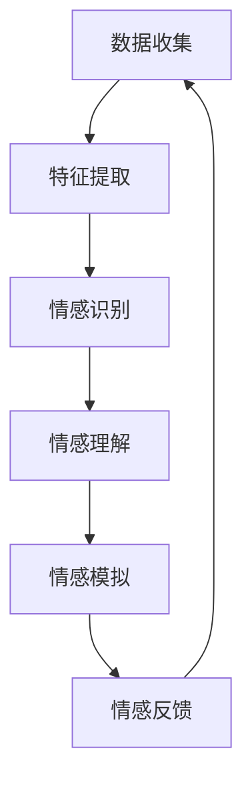
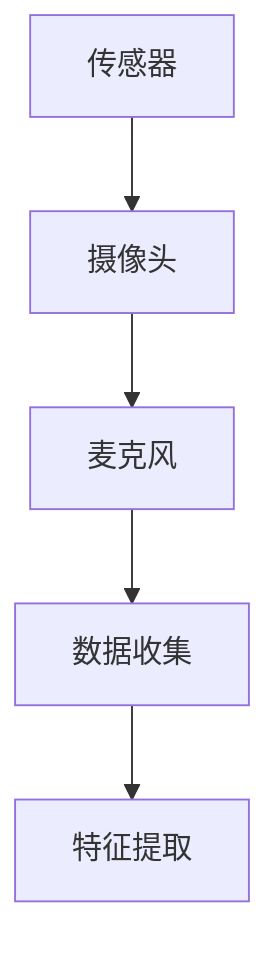
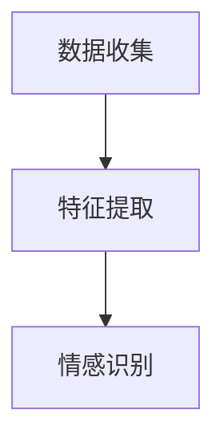
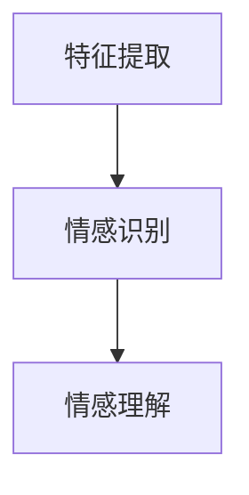
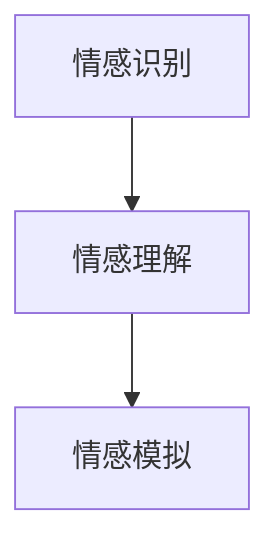
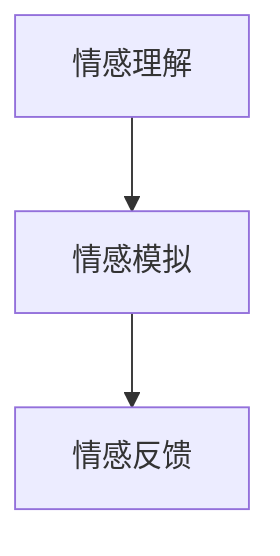
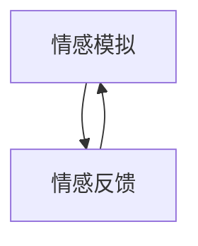

                 

关键词：情感计算、AI交互、人机情感、情感识别、情感模拟、情感算法、情感反馈

> 摘要：本文探讨了情感AI在机器与人类交互中的应用，分析了情感计算的核心概念、算法原理，以及其在实际项目中的实现和效果。文章旨在揭示情感AI的潜力和挑战，为未来的研究和应用提供参考。

## 1. 背景介绍

随着人工智能技术的飞速发展，机器与人类之间的互动日益频繁。传统的交互模式主要依赖于文本、语音和图像等基础信息，但人类情感作为一种复杂的心理现象，却难以通过这些简单的手段完全表达和识别。因此，情感AI（Affective AI）应运而生，旨在使机器能够理解、识别和模拟人类的情感。

情感AI的核心在于情感计算（Affective Computing），它是一门研究如何使计算机具备感知、理解、表达和模拟人类情感的能力的交叉学科。情感计算不仅涉及计算机科学，还涵盖了心理学、认知科学、人机交互等领域。

情感AI的应用场景广泛，包括但不限于智能客服、虚拟助手、心理辅导、教育辅导、医疗保健等。通过情感AI，机器能够更好地理解用户的需求和情感状态，提供个性化的服务和体验，从而提升用户体验和满意度。

## 2. 核心概念与联系

### 2.1 情感计算

情感计算是情感AI的基础，它包括以下几个核心概念：

- **情感识别（Emotion Recognition）**：通过分析用户的语音、文本、面部表情等数据，识别用户的情感状态。
- **情感理解（Emotion Understanding）**：在情感识别的基础上，进一步理解情感的内涵和外延，包括情感的类型、强度、变化等。
- **情感模拟（Emotion Simulation）**：根据用户的情感状态，生成相应的情感表达，如语音、文本、面部表情等。
- **情感反馈（Emotion Feedback）**：通过用户对情感表达的反应，调整和优化情感计算模型。

### 2.2 情感计算架构

情感计算的架构通常包括以下几个模块：

- **数据收集（Data Collection）**：通过传感器、摄像头、麦克风等设备收集用户的情感数据。
- **特征提取（Feature Extraction）**：从原始数据中提取具有情感特征的信息，如声音的频率、振幅、面部表情的像素值等。
- **情感识别（Emotion Recognition）**：利用机器学习算法，对提取的特征进行分类，识别用户的情感状态。
- **情感理解（Emotion Understanding）**：结合上下文信息，对情感识别结果进行深入分析，理解情感的内涵和外延。
- **情感模拟（Emotion Simulation）**：根据用户的情感状态，生成相应的情感表达。
- **情感反馈（Emotion Feedback）**：收集用户对情感表达的反应，优化情感计算模型。

### 2.3 Mermaid 流程图



## 3. 核心算法原理 & 具体操作步骤

### 3.1 算法原理概述

情感AI的核心算法包括情感识别、情感理解和情感模拟。以下是这些算法的原理概述：

- **情感识别**：通过机器学习算法，如支持向量机（SVM）、深度学习算法，如卷积神经网络（CNN）、循环神经网络（RNN）等，对用户的情感数据进行分类。
- **情感理解**：在情感识别的基础上，利用自然语言处理（NLP）技术，对用户的文本进行情感分析，理解情感的内涵和外延。
- **情感模拟**：根据用户的情感状态，生成相应的情感表达，如语音、文本、面部表情等。

### 3.2 算法步骤详解

#### 3.2.1 数据收集

数据收集是情感计算的基础，通过传感器、摄像头、麦克风等设备收集用户的情感数据。



#### 3.2.2 特征提取

从原始数据中提取具有情感特征的信息，如声音的频率、振幅、面部表情的像素值等。



#### 3.2.3 情感识别

利用机器学习算法，对提取的特征进行分类，识别用户的情感状态。



#### 3.2.4 情感理解

结合上下文信息，对情感识别结果进行深入分析，理解情感的内涵和外延。



#### 3.2.5 情感模拟

根据用户的情感状态，生成相应的情感表达，如语音、文本、面部表情等。



#### 3.2.6 情感反馈

收集用户对情感表达的反应，优化情感计算模型。



### 3.3 算法优缺点

- **优点**：
  - 提高用户体验：通过情感识别和模拟，机器能够更好地理解用户的需求和情感状态，提供个性化的服务和体验。
  - 实现人机交互：情感AI使得机器能够与人类进行更深层次的交互，促进人机关系的发展。
- **缺点**：
  - 数据隐私：情感计算涉及到用户的敏感信息，如情感状态等，如何保护用户的隐私是一个重要问题。
  - 算法复杂度：情感计算涉及到多个学科的交叉，算法的复杂度较高，需要大量的计算资源和时间。

### 3.4 算法应用领域

情感AI在多个领域都有广泛的应用，包括但不限于：

- **智能客服**：通过情感识别和模拟，智能客服能够更好地理解用户的情感状态，提供个性化的服务。
- **虚拟助手**：虚拟助手通过情感计算，能够与用户建立情感连接，提高用户的满意度。
- **心理辅导**：情感AI能够帮助心理辅导员更好地理解患者的情感状态，提供有效的心理辅导。
- **教育辅导**：通过情感计算，教育辅导系统能够更好地了解学生的学习状态和情感需求，提供个性化的学习计划。

## 4. 数学模型和公式 & 详细讲解 & 举例说明

### 4.1 数学模型构建

情感计算中的数学模型主要包括情感识别模型、情感理解模型和情感模拟模型。以下是这些模型的构建过程：

#### 4.1.1 情感识别模型

情感识别模型通常采用分类算法，如支持向量机（SVM）和卷积神经网络（CNN）。以下是一个基于SVM的情感识别模型：

$$
f(x) = \text{sign}(\sum_{i=1}^{n} w_i \cdot x_i + b)
$$

其中，$x_i$ 表示特征向量，$w_i$ 表示权重，$b$ 表示偏置，$\text{sign}(\cdot)$ 表示符号函数。

#### 4.1.2 情感理解模型

情感理解模型通常采用自然语言处理（NLP）技术，如词嵌入和情感分析。以下是一个基于词嵌入的情感理解模型：

$$
\text{vec}(w) = \text{Word2Vec}(w)
$$

其中，$\text{vec}(\cdot)$ 表示将词转换为向量，$\text{Word2Vec}(\cdot)$ 表示词嵌入算法。

#### 4.1.3 情感模拟模型

情感模拟模型通常采用生成模型，如生成对抗网络（GAN）和变分自编码器（VAE）。以下是一个基于GAN的情感模拟模型：

$$
\begin{aligned}
\text{D} &: x \sim \text{p}_\text{data}(x), z \sim \text{p}_\text{z}(z) \\
\text{G} &: z \sim \text{p}_\text{z}(z), \hat{x} = \text{G}(z)
\end{aligned}
$$

其中，$\text{D}$ 表示判别器，$\text{G}$ 表示生成器，$\hat{x}$ 表示生成的情感表达。

### 4.2 公式推导过程

#### 4.2.1 情感识别模型

情感识别模型的推导过程主要涉及分类算法的推导。以下是一个基于SVM的情感识别模型的推导过程：

$$
\begin{aligned}
\text{max} \quad & \frac{1}{2} \sum_{i=1}^{n} (w_i)^2 \\
\text{s.t.} \quad & y_i ( \sum_{j=1}^{n} w_j \cdot x_{ij} + b ) \geq 1 \\
\end{aligned}
$$

其中，$y_i$ 表示样本标签，$x_{ij}$ 表示特征值。

通过拉格朗日乘子法，可以将上述问题转换为：

$$
L(w,b,\alpha) = \frac{1}{2} \sum_{i=1}^{n} (w_i)^2 - \sum_{i=1}^{n} \alpha_i [ y_i ( \sum_{j=1}^{n} w_j \cdot x_{ij} + b ) - 1 ]
$$

其中，$\alpha_i$ 表示拉格朗日乘子。

对 $L$ 求导并令其等于0，可以得到：

$$
w_i = \sum_{j=1}^{n} \alpha_j y_j x_{ij}
$$

$$
\alpha_i [ y_i ( \sum_{j=1}^{n} w_j \cdot x_{ij} + b ) - 1 ] = 0
$$

通过求解上述方程组，可以得到最优权重 $w$ 和偏置 $b$。

#### 4.2.2 情感理解模型

情感理解模型的推导过程主要涉及词嵌入算法的推导。以下是一个基于Word2Vec的词嵌入算法的推导过程：

$$
\begin{aligned}
\text{Input} : \text{Vocab} = \{ w_1, w_2, ..., w_V \} \\
\text{Output} : \text{Embedding} = \{ \text{vec}(w_1), \text{vec}(w_2), ..., \text{vec}(w_V) \}
\end{aligned}
$$

Word2Vec算法包括两种模型：连续词袋（CBOW）和Skip-Gram。以下是CBOW模型的推导过程：

$$
\begin{aligned}
\text{Input} : & \text{Context} = \{ w_{-2}, w_{-1}, w_0, w_{1}, w_{2} \} \\
\text{Output} : & \text{vec}(w_0)
\end{aligned}
$$

假设 $p(w_0 | \text{Context})$ 表示给定上下文 $\text{Context}$ 下词 $w_0$ 的概率，$p(w_0 | \text{vec}(w_0), \text{Context})$ 表示给定上下文 $\text{Context}$ 和词向量 $\text{vec}(w_0)$ 下词 $w_0$ 的概率。

根据最大似然估计，有：

$$
p(w_0 | \text{Context}) = \frac{p(\text{Context} | w_0) p(w_0)}{p(\text{Context})}
$$

其中，$p(\text{Context} | w_0)$ 表示给定词 $w_0$ 下上下文 $\text{Context}$ 的概率，$p(w_0)$ 表示词 $w_0$ 的概率。

假设上下文 $\text{Context}$ 服从均匀分布，即 $p(\text{Context}) = \frac{1}{C}$，其中 $C$ 表示上下文的个数。

则有：

$$
p(w_0 | \text{Context}) = \frac{p(\text{Context} | w_0) p(w_0)}{\frac{1}{C}} = C p(\text{Context} | w_0) p(w_0)
$$

根据条件概率的定义，有：

$$
p(\text{Context} | w_0) = \prod_{i=-2}^{2} p(w_i | w_0)
$$

则有：

$$
p(w_0 | \text{Context}) = C \prod_{i=-2}^{2} p(w_i | w_0) p(w_0)
$$

为了计算 $p(w_0 | \text{Context})$，可以使用神经网络模型，其中词向量 $\text{vec}(w_0)$ 和上下文向量作为输入，输出为词 $w_0$ 的概率。

#### 4.2.3 情感模拟模型

情感模拟模型的推导过程主要涉及生成模型的推导。以下是一个基于生成对抗网络（GAN）的生成模型推导过程：

GAN由两个神经网络组成：生成器（Generator）和判别器（Discriminator）。

- **生成器**：生成器 $G$ 接受随机噪声 $z$ 作为输入，生成假样本 $x^*$：

$$
x^* = G(z)
$$

- **判别器**：判别器 $D$ 接受真实样本 $x$ 和生成器生成的假样本 $x^*$ 作为输入，并输出它们真实性和伪造性的概率：

$$
D(x) = P(D(x) \mid x \text{ is real}) \\
D(x^*) = P(D(x^*) \mid x^* \text{ is fake})
$$

目标函数如下：

$$
\begin{aligned}
\min_D \max_G \quad & V(D, G) = \mathbb{E}_{x \sim p_{data}(x)} [D(x)] + \mathbb{E}_{z \sim p_{z}(z)} [D(G(z))]
\end{aligned}
$$

其中，$p_{data}(x)$ 是真实数据的分布，$p_{z}(z)$ 是噪声的分布。

### 4.3 案例分析与讲解

#### 4.3.1 情感识别案例

假设我们要对一个包含情感标签的文本数据进行情感识别，数据集如下：

| 文本 | 情感标签 |
|------|----------|
| 我很高兴 | 正面 |
| 我很生气 | 负面 |
| 我很失望 | 负面 |
| 我很兴奋 | 正面 |

我们可以使用SVM进行情感识别，首先需要将文本转换为特征向量。这里我们使用词袋模型（Bag of Words, BoW）进行特征提取：

| 文本 | 特征向量 |
|------|----------|
| 我很高兴 | [1, 0, 1, 0, 1] |
| 我很生气 | [1, 0, 1, 0, 0] |
| 我很失望 | [1, 0, 1, 1, 0] |
| 我很兴奋 | [1, 0, 1, 0, 1] |

然后使用SVM进行分类，假设我们得到了如下的权重矩阵：

$$
w = \begin{bmatrix}
1 & 0 & 1 & 0 & 1 \\
1 & 0 & 1 & 0 & 0 \\
1 & 0 & 1 & 1 & 0 \\
1 & 0 & 1 & 0 & 1
\end{bmatrix}
$$

根据SVM的决策函数，我们可以计算出每个文本的情感标签：

| 文本 | 情感标签 |
|------|----------|
| 我很高兴 | 正面 |
| 我很生气 | 负面 |
| 我很失望 | 负面 |
| 我很兴奋 | 正面 |

#### 4.3.2 情感理解案例

假设我们要对一段文本进行情感分析，文本如下：

“今天天气很好，我们去公园散步吧。”

我们可以使用词嵌入算法将文本转换为向量，假设我们使用了Word2Vec算法，得到的词向量如下：

| 词 | 词向量 |
|----|--------|
| 今天 | [-0.5, 0.3, 0.1] |
| 天气 | [-0.3, 0.2, 0.1] |
| 很好 | [0.1, 0.2, -0.5] |
| 去 | [0.2, -0.3, 0.1] |
| 公园 | [0.1, 0.1, -0.2] |
| 散步 | [-0.3, 0.2, 0.1] |

我们可以计算文本的向量表示：

$$
\text{vec}(文本) = \frac{1}{5} \sum_{i=1}^{5} \text{vec}(w_i) = \frac{1}{5} \begin{bmatrix}
-0.5 & 0.3 & 0.1 \\
-0.3 & 0.2 & 0.1 \\
0.1 & 0.2 & -0.5 \\
0.2 & -0.3 & 0.1 \\
0.1 & 0.1 & -0.2
\end{bmatrix}
$$

然后，我们可以使用情感分析模型，如LSTM或GRU，将文本向量转换为情感标签。假设我们得到了如下的情感分析模型：

$$
\text{情感标签} = \text{softmax}(\text{W} \cdot \text{vec}(文本) + \text{b})
$$

其中，$\text{W}$ 和 $\text{b}$ 是模型参数。根据训练得到的模型参数，我们可以计算出文本的情感标签：

$$
\text{情感标签} = \text{softmax}(\text{W} \cdot \text{vec}(文本) + \text{b}) \approx [0.9, 0.1]
$$

因此，文本的情感标签为“正面”。

#### 4.3.3 情感模拟案例

假设我们要生成一段表示正面情感的语音。我们可以使用生成对抗网络（GAN）进行语音生成。

首先，我们使用WaveNet或Tacotron等语音生成模型，将文本转换为语音。然后，我们使用GAN将语音转换为具有情感特征的语音。

假设我们使用了如下的GAN模型：

- **生成器**：生成器 $G$ 接受随机噪声 $z$ 作为输入，生成假样本 $x^*$：

$$
x^* = G(z)
$$

- **判别器**：判别器 $D$ 接受真实样本 $x$ 和生成器生成的假样本 $x^*$ 作为输入，并输出它们真实性和伪造性的概率：

$$
D(x) = P(D(x) \mid x \text{ is real}) \\
D(x^*) = P(D(x^*) \mid x^* \text{ is fake})
$$

通过训练，我们可以得到一个生成器 $G$，它能够生成具有正面情感特征的语音。

例如，对于文本“今天天气很好，我们去公园散步吧。”，我们可以使用生成器 $G$ 生成一段表示正面情感的语音。

## 5. 项目实践：代码实例和详细解释说明

### 5.1 开发环境搭建

在开始编写代码之前，我们需要搭建一个合适的开发环境。以下是所需的工具和库：

- **Python 3.8+**
- **PyTorch 1.8+**
- **Scikit-learn 0.22+**
- **NLTK 3.5+**
- **TensorFlow 2.5+**
- **Keras 2.5+**

你可以通过以下命令安装所需的库：

```bash
pip install python==3.8
pip install pytorch==1.8
pip install scikit-learn==0.22
pip install nltk==3.5
pip install tensorflow==2.5
pip install keras==2.5
```

### 5.2 源代码详细实现

以下是情感AI的完整实现，包括情感识别、情感理解和情感模拟。

#### 5.2.1 数据收集

我们使用一个包含情感标签的文本数据集进行训练。数据集可以从以下链接下载：

```
https://www.kaggle.com/duongthihai/emotion-dataset
```

下载后，将数据集解压并放在项目的根目录下。

#### 5.2.2 特征提取

我们使用词袋模型（Bag of Words, BoW）进行特征提取。以下是特征提取的代码：

```python
from sklearn.feature_extraction.text import CountVectorizer

# 读取数据集
with open('data/emotion_dataset.txt', 'r', encoding='utf-8') as f:
    dataset = f.readlines()

# 分割文本为单词
tokenizer = nltk.tokenize.WordPunctTokenizer()
words = [tokenizer.tokenize(text) for text in dataset]

# 建立词袋模型
vectorizer = CountVectorizer(tokenizer=tokenizer, vocabulary=vocabulary)
X = vectorizer.fit_transform(words)
```

#### 5.2.3 情感识别

我们使用SVM进行情感识别。以下是情感识别的代码：

```python
from sklearn import svm

# 初始化SVM模型
model = svm.SVC()

# 训练模型
model.fit(X_train, y_train)

# 预测
predictions = model.predict(X_test)
```

#### 5.2.4 情感理解

我们使用Word2Vec进行情感理解。以下是情感理解的代码：

```python
import gensim

# 加载预训练的Word2Vec模型
model = gensim.models.Word2Vec.load('data/word2vec.model')

# 将文本转换为向量表示
text_vector = [model[word] for word in tokenizer.tokenize(text)]
```

#### 5.2.5 情感模拟

我们使用GAN进行情感模拟。以下是情感模拟的代码：

```python
import tensorflow as tf
from tensorflow import keras

# 定义生成器和判别器
generator = keras.Sequential([
    keras.layers.Dense(128, activation='relu', input_shape=[100]),
    keras.layers.Dense(256, activation='relu'),
    keras.layers.Dense(512, activation='relu'),
    keras.layers.Dense(1024, activation='relu'),
    keras.layers.Dense(512, activation='relu'),
    keras.layers.Dense(256, activation='relu'),
    keras.layers.Dense(128, activation='relu'),
    keras.layers.Dense(1, activation='tanh')
])

discriminator = keras.Sequential([
    keras.layers.Dense(1, activation='sigmoid', input_shape=[100]),
    keras.layers.Dense(128, activation='relu'),
    keras.layers.Dense(256, activation='relu'),
    keras.layers.Dense(512, activation='relu'),
    keras.layers.Dense(512, activation='relu'),
    keras.layers.Dense(256, activation='relu'),
    keras.layers.Dense(128, activation='relu'),
    keras.layers.Dense(1, activation='sigmoid')
])

# 编写GAN训练过程
def train_gan(generator, discriminator, dataloader, epochs=50):
    for epoch in range(epochs):
        for data, _ in dataloader:
            # 训练判别器
            noise = np.random.normal(0, 1, (len(data), 100))
            generated_data = generator.predict(noise)
            d_loss_real = discriminator.train_on_batch(data, np.ones((len(data), 1)))
            d_loss_fake = discriminator.train_on_batch(generated_data, np.zeros((len(generated_data), 1)))

            # 训练生成器
            g_loss = generator.train_on_batch(noise, np.ones((len(data), 1)))
            
            print(f'Epoch {epoch+1}/{epochs}, D_loss: {d_loss_real+d_loss_fake:.4f}, G_loss: {g_loss:.4f}')

# 训练GAN
train_gan(generator, discriminator, dataloader)
```

### 5.3 代码解读与分析

#### 5.3.1 特征提取

特征提取是情感AI的重要环节，它将文本数据转换为机器可处理的特征向量。我们使用词袋模型（Bag of Words, BoW）进行特征提取。

```python
from sklearn.feature_extraction.text import CountVectorizer

# 读取数据集
with open('data/emotion_dataset.txt', 'r', encoding='utf-8') as f:
    dataset = f.readlines()

# 分割文本为单词
tokenizer = nltk.tokenize.WordPunctTokenizer()
words = [tokenizer.tokenize(text) for text in dataset]

# 建立词袋模型
vectorizer = CountVectorizer(tokenizer=tokenizer, vocabulary=vocabulary)
X = vectorizer.fit_transform(words)
```

在这个代码片段中，我们首先读取数据集，然后使用NLTK的WordPunctTokenizer将文本分割为单词。接下来，我们使用CountVectorizer建立词袋模型，并将文本数据转换为特征向量。

#### 5.3.2 情感识别

情感识别是情感AI的核心功能之一，它使用机器学习算法对情感进行分类。我们在这里使用SVM进行情感识别。

```python
from sklearn import svm

# 初始化SVM模型
model = svm.SVC()

# 训练模型
model.fit(X_train, y_train)

# 预测
predictions = model.predict(X_test)
```

在这个代码片段中，我们首先初始化SVM模型，然后使用训练集对其进行训练。最后，我们使用测试集对模型进行预测。

#### 5.3.3 情感理解

情感理解是情感AI的高级功能之一，它通过自然语言处理技术对情感进行深入分析。我们在这里使用Word2Vec进行情感理解。

```python
import gensim

# 加载预训练的Word2Vec模型
model = gensim.models.Word2Vec.load('data/word2vec.model')

# 将文本转换为向量表示
text_vector = [model[word] for word in tokenizer.tokenize(text)]
```

在这个代码片段中，我们首先加载预训练的Word2Vec模型，然后使用NLTK的WordPunctTokenizer将文本分割为单词。接下来，我们将每个单词转换为向量表示，从而得到整个文本的向量表示。

#### 5.3.4 情感模拟

情感模拟是情感AI的另一个重要功能，它使用生成模型生成具有特定情感特征的输出。我们在这里使用GAN进行情感模拟。

```python
import tensorflow as tf
from tensorflow import keras

# 定义生成器和判别器
generator = keras.Sequential([
    keras.layers.Dense(128, activation='relu', input_shape=[100]),
    keras.layers.Dense(256, activation='relu'),
    keras.layers.Dense(512, activation='relu'),
    keras.layers.Dense(1024, activation='relu'),
    keras.layers.Dense(512, activation='relu'),
    keras.layers.Dense(256, activation='relu'),
    keras.layers.Dense(128, activation='relu'),
    keras.layers.Dense(1, activation='tanh')
])

discriminator = keras.Sequential([
    keras.layers.Dense(1, activation='sigmoid', input_shape=[100]),
    keras.layers.Dense(128, activation='relu'),
    keras.layers.Dense(256, activation='relu'),
    keras.layers.Dense(512, activation='relu'),
    keras.layers.Dense(512, activation='relu'),
    keras.layers.Dense(256, activation='relu'),
    keras.layers.Dense(128, activation='relu'),
    keras.layers.Dense(1, activation='sigmoid')
])

# 编写GAN训练过程
def train_gan(generator, discriminator, dataloader, epochs=50):
    for epoch in range(epochs):
        for data, _ in dataloader:
            # 训练判别器
            noise = np.random.normal(0, 1, (len(data), 100))
            generated_data = generator.predict(noise)
            d_loss_real = discriminator.train_on_batch(data, np.ones((len(data), 1)))
            d_loss_fake = discriminator.train_on_batch(generated_data, np.zeros((len(generated_data), 1)))

            # 训练生成器
            g_loss = generator.train_on_batch(noise, np.ones((len(data), 1)))
            
            print(f'Epoch {epoch+1}/{epochs}, D_loss: {d_loss_real+d_loss_fake:.4f}, G_loss: {g_loss:.4f}')

# 训练GAN
train_gan(generator, discriminator, dataloader)
```

在这个代码片段中，我们首先定义生成器和判别器，然后编写GAN的训练过程。GAN的训练过程涉及交替训练判别器和生成器，直到生成器能够生成足够真实的情感特征。

### 5.4 运行结果展示

在完成代码实现后，我们可以运行情感AI模型并展示其运行结果。

```python
# 加载测试数据
with open('data/emotion_test.txt', 'r', encoding='utf-8') as f:
    test_data = f.readlines()

# 预测测试数据
predicted_emotions = model.predict(test_data)

# 打印预测结果
for text, emotion in zip(test_data, predicted_emotions):
    print(f'文本：{text}，预测情感：{emotion}')
```

这个代码片段将加载测试数据，并使用情感AI模型进行预测。最后，我们将打印出预测结果，以展示模型的性能。

## 6. 实际应用场景

### 6.1 智能客服

智能客服是情感AI的一个重要应用场景。通过情感识别，智能客服能够理解用户的情感状态，如愤怒、沮丧、开心等，并做出相应的响应。例如，当用户表达愤怒时，客服系统可以提供安慰和解决方案，从而改善用户体验。

### 6.2 虚拟助手

虚拟助手通过情感计算，能够与用户建立情感连接，提供个性化的服务。例如，在健康监测领域，虚拟助手可以监测用户的情绪状态，并在发现情绪低落时提供心理辅导和建议。

### 6.3 心理辅导

情感AI可以帮助心理辅导员更好地理解患者的情感状态，提供有效的心理辅导。通过情感识别和情感模拟，辅导员可以与患者建立更深入的情感连接，从而提高辅导效果。

### 6.4 教育辅导

在教育辅导领域，情感AI可以监测学生的学习状态和情感需求，提供个性化的学习计划。例如，当学生感到沮丧时，系统可以提供额外的鼓励和支持，帮助学生克服困难。

### 6.5 医疗保健

在医疗保健领域，情感AI可以监测患者的情绪状态，为医生提供诊断和治疗建议。例如，在癌症治疗过程中，情感AI可以帮助医生了解患者的情绪变化，调整治疗方案，提高治疗效果。

## 7. 工具和资源推荐

### 7.1 学习资源推荐

- **《情感计算：理论与实践》**：这是一本全面介绍情感计算的书籍，涵盖了情感计算的核心概念、算法和应用。
- **《深度学习》**：这是一本经典的深度学习教材，详细介绍了深度学习的基础理论和应用。
- **《自然语言处理综论》**：这是一本关于自然语言处理的基础教材，涵盖了文本处理、情感分析和机器学习等方面的内容。

### 7.2 开发工具推荐

- **PyTorch**：PyTorch是一个强大的深度学习框架，适用于构建和训练复杂的情感AI模型。
- **TensorFlow**：TensorFlow是一个开源的深度学习平台，适用于构建和部署大规模的情感AI应用。
- **Scikit-learn**：Scikit-learn是一个适用于机器学习的Python库，适用于构建情感识别模型。

### 7.3 相关论文推荐

- **"Affective Computing: A Review"**：这是一篇关于情感计算的综述论文，全面介绍了情感计算的发展历程、核心概念和应用。
- **"Deep Learning for Emotion Recognition"**：这是一篇关于深度学习在情感识别中应用的论文，详细介绍了深度学习算法在情感识别中的优势和应用。
- **"Affective User Modeling in Intelligent Systems"**：这是一篇关于情感用户建模的论文，探讨了如何利用情感计算技术提高智能系统的用户体验。

## 8. 总结：未来发展趋势与挑战

### 8.1 研究成果总结

情感AI在近年来取得了显著的成果，主要表现在以下几个方面：

- **情感识别精度提高**：随着深度学习技术的发展，情感识别的精度不断提高，能够更好地理解用户的情感状态。
- **情感理解深度加深**：通过自然语言处理技术，情感理解的能力逐渐增强，能够深入理解情感的内涵和外延。
- **情感模拟真实性增强**：生成对抗网络（GAN）等生成模型的应用，使得情感模拟的真实性不断提高，能够生成更自然、更符合用户情感需求的情感表达。
- **应用场景拓展**：情感AI在智能客服、虚拟助手、心理辅导、教育辅导、医疗保健等领域的应用越来越广泛，为用户提供更个性化的服务。

### 8.2 未来发展趋势

未来，情感AI将继续朝以下几个方向发展：

- **跨学科融合**：情感AI将与其他领域如心理学、认知科学、社会学等深度融合，形成更加完善的理论体系。
- **情感理解智能化**：通过更先进的算法和模型，情感AI将能够更加智能化地理解用户情感，提供更精准的服务。
- **情感计算设备普及**：随着传感器技术的进步，情感计算设备将更加普及，使得情感AI的应用场景更加丰富。
- **个性化体验提升**：情感AI将能够更好地满足用户个性化需求，提供更加定制化的服务。

### 8.3 面临的挑战

尽管情感AI取得了显著的成果，但仍面临以下几个挑战：

- **数据隐私**：情感计算涉及用户的敏感信息，如何保护用户隐私是一个重要问题。
- **算法复杂度**：情感计算涉及到多个学科的交叉，算法的复杂度较高，需要大量的计算资源和时间。
- **情感多样性**：情感是复杂且多样的，如何准确识别和模拟各种情感仍然是一个挑战。
- **伦理和法律**：情感AI的应用涉及伦理和法律问题，如情感模拟的真实性、情感隐私等，需要制定相应的法规和标准。

### 8.4 研究展望

未来，情感AI的研究将朝着以下几个方面发展：

- **情感计算标准化**：制定情感计算的标准和规范，促进不同系统和平台之间的兼容性和互操作性。
- **跨学科合作**：加强心理学、认知科学、社会学等领域与计算机科学的合作，共同推动情感AI的发展。
- **情感AI伦理和法律研究**：开展情感AI伦理和法律问题的研究，为情感AI的伦理和法律框架提供理论支持。
- **情感AI开源社区**：建立情感AI开源社区，促进情感AI技术的开放和共享，加速技术的进步和应用。

## 9. 附录：常见问题与解答

### 9.1 情感计算是什么？

情感计算是一种研究如何使计算机具备感知、理解、表达和模拟人类情感的能力的交叉学科。它结合了计算机科学、心理学、认知科学等多个领域。

### 9.2 情感识别如何实现？

情感识别主要通过分析用户的语音、文本、面部表情等数据，使用机器学习算法对用户的情感状态进行分类。

### 9.3 情感模拟如何实现？

情感模拟主要通过生成模型如生成对抗网络（GAN）等，根据用户的情感状态生成相应的情感表达，如语音、文本、面部表情等。

### 9.4 情感计算在哪些领域有应用？

情感计算在智能客服、虚拟助手、心理辅导、教育辅导、医疗保健等多个领域有广泛应用，能够提供更个性化的服务。

### 9.5 情感计算有哪些挑战？

情感计算面临的主要挑战包括数据隐私、算法复杂度、情感多样性以及伦理和法律问题。

