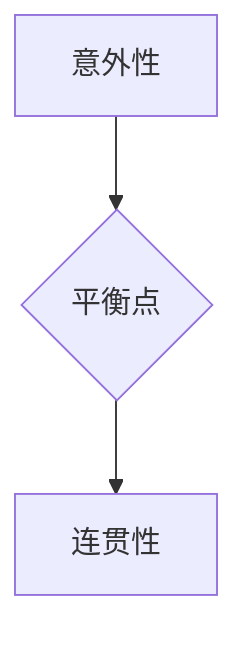

                 

情节生成算法是近年来人工智能领域中的一项重要研究方向，它在许多应用场景中展现出了巨大的潜力。本文旨在探讨如何平衡情节生成算法中的意外性与连贯性，使得生成的情节既能保持新颖性和吸引力，又能保持逻辑上的连贯性。

> 关键词：情节生成、意外性、连贯性、人工智能、算法

> 摘要：本文首先介绍了情节生成算法的基本概念和背景，然后分析了算法中意外性与连贯性的平衡问题。接着，我们讨论了当前常用的几种情节生成算法，并探讨了它们在平衡意外性与连贯性方面的优缺点。随后，本文提出了一个改进的情节生成算法，并通过数学模型和实例验证了其有效性。最后，我们对算法的应用领域进行了展望，并讨论了未来研究的趋势和挑战。

## 1. 背景介绍

随着人工智能技术的不断发展，生成式模型在各个领域都取得了显著的成果。特别是在自然语言处理、计算机视觉和游戏开发等领域，生成式模型的应用越来越广泛。其中，情节生成算法作为一个重要的研究方向，受到了广泛关注。

情节生成算法旨在根据给定的条件或上下文，生成具有逻辑连贯性和可预测性的情节。这些情节可以应用于电影剧本创作、游戏剧情设计、故事生成等多个领域。然而，如何平衡情节的意外性与连贯性，使得生成的情节既能够吸引读者或观众，又能够保持逻辑上的连贯性，是情节生成算法研究中的一个重要问题。

## 2. 核心概念与联系

### 2.1. 意外性

意外性是指情节中出现的意外事件或转折点，它能够吸引读者的注意力，增加情节的吸引力。在情节生成算法中，意外性的引入可以使得生成的情节更加生动有趣，避免陷入过于平淡的套路。

### 2.2. 连贯性

连贯性是指情节在逻辑上的一致性和连贯性。一个连贯的情节应该能够自圆其说，逻辑上没有明显的矛盾或漏洞。在情节生成算法中，保持连贯性可以确保生成的情节在逻辑上成立，增加可信度。

### 2.3. 平衡

在情节生成算法中，平衡意外性与连贯性意味着需要在两者之间找到一个合适的平衡点。过度的意外性可能导致情节的混乱和逻辑上的矛盾，而缺乏意外性则可能导致情节的平淡无味。

为了更好地理解这两个概念，我们使用Mermaid流程图来展示它们之间的联系。



## 3. 核心算法原理 & 具体操作步骤

### 3.1. 算法原理概述

情节生成算法的核心思想是通过学习大量的文本数据，自动生成具有逻辑连贯性和可预测性的情节。具体来说，算法可以分为以下几个步骤：

1. 数据预处理：将原始文本数据进行清洗和分词，提取出关键信息和关键词。
2. 特征提取：使用词向量模型或文本嵌入模型，将文本数据转换为数值特征表示。
3. 模型训练：使用生成式模型，如变分自编码器（VAE）或生成对抗网络（GAN），对特征进行建模，学习生成情节的能力。
4. 情节生成：根据给定的条件或上下文，使用训练好的模型生成情节。

### 3.2. 算法步骤详解

下面是一个详细的算法步骤描述：

1. **数据预处理**：
   - 清洗文本数据：去除标点符号、停用词等无关信息。
   - 分词：将文本分割成一个个单词或短语。
   - 提取关键词：使用词频、TF-IDF等方法提取文本中的关键信息。

2. **特征提取**：
   - 使用词向量模型（如Word2Vec、GloVe）将文本数据转换为数值特征表示。
   - 使用文本嵌入模型（如BERT、GPT）提取文本的语义信息。

3. **模型训练**：
   - 使用变分自编码器（VAE）或生成对抗网络（GAN）对特征进行建模。
   - VAE通过编码器和解码器学习数据的概率分布，并生成新的样本。
   - GAN通过生成器和判别器的对抗训练，生成逼真的数据。

4. **情节生成**：
   - 根据给定的条件或上下文，生成情节的初始部分。
   - 使用训练好的模型，逐步生成情节的后续部分。
   - 通过反馈和调整，优化生成的情节，使其在逻辑上更加连贯。

### 3.3. 算法优缺点

**优点**：

- **自适应性强**：算法可以根据给定的条件或上下文，自适应地生成情节。
- **灵活性高**：可以使用各种生成式模型，如VAE、GAN等，具有很高的灵活性。

**缺点**：

- **计算复杂度高**：模型训练和情节生成过程通常需要大量的计算资源。
- **稳定性问题**：在某些情况下，生成的情节可能存在逻辑上的不一致或漏洞。

### 3.4. 算法应用领域

情节生成算法在以下领域具有广泛的应用前景：

- **电影剧本创作**：自动生成电影剧本，为编剧提供灵感。
- **游戏剧情设计**：为游戏生成丰富的剧情，提高游戏的趣味性和可玩性。
- **故事生成**：为作家和编剧生成新的故事情节，拓宽创作思路。
- **智能客服**：为智能客服系统生成合理的对话情节，提高用户体验。

## 4. 数学模型和公式 & 详细讲解 & 举例说明

### 4.1. 数学模型构建

在情节生成算法中，我们通常使用生成式模型来建模情节。以变分自编码器（VAE）为例，其数学模型可以表示为：

\[ x = \mu(\theta_x) + \sigma(\theta_x) \epsilon \]

其中，\( x \) 是生成的情节，\( \mu \) 和 \( \sigma \) 分别是编码器（encoder）的均值和方差函数，\( \theta_x \) 是编码器的参数，\( \epsilon \) 是噪声向量。

### 4.2. 公式推导过程

为了推导VAE的损失函数，我们需要考虑以下两个部分：

1. **重建损失**：衡量生成情节与原始情节之间的差距，通常使用均方误差（MSE）或交叉熵（CE）作为损失函数。
2. **KL散度损失**：衡量编码器的均值和方差函数是否合理，即衡量编码器对数据分布的拟合程度。

设 \( x \) 为生成的情节，\( x' \) 为原始情节，则重建损失可以表示为：

\[ L_{\text{reconstruction}} = \frac{1}{N} \sum_{i=1}^{N} \sum_{j=1}^{M} || x_j - x'_j ||_2^2 \]

其中，\( N \) 是样本数量，\( M \) 是情节的长度。

KL散度损失可以表示为：

\[ L_{\text{KL}} = \frac{1}{N} \sum_{i=1}^{N} D_{\text{KL}}(\mu(\theta_x), \pi(\theta_x)) \]

其中，\( D_{\text{KL}} \) 是KL散度，\( \pi(\theta_x) \) 是先验分布。

最终，VAE的总损失函数为：

\[ L = L_{\text{reconstruction}} + \lambda L_{\text{KL}} \]

其中，\( \lambda \) 是调节参数，用于平衡重建损失和KL散度损失。

### 4.3. 案例分析与讲解

假设我们有一个文本数据集，包含100个短篇故事。我们可以使用VAE对这100个故事进行建模，并生成新的故事。为了简化问题，我们假设每个故事由10个词组成。

首先，我们使用Word2Vec模型将每个词转换为向量表示。然后，使用这些向量表示训练VAE模型。在训练过程中，我们使用SGD优化算法，并设置学习率为0.001。

在训练完成后，我们可以使用训练好的VAE模型生成新的故事。为了验证生成故事的质量，我们将生成的故事与原始故事进行比较，并计算它们的相似度。

具体来说，我们可以使用余弦相似度作为评价指标，公式如下：

\[ \text{similarity} = \frac{x \cdot x'}{\|x\| \|x'\|} \]

其中，\( x \) 和 \( x' \) 分别是原始故事和生成故事的向量表示。

通过计算相似度，我们可以评估生成故事的质量。一般来说，相似度越高，生成故事的质量越高。

假设我们生成了一个新的故事，与原始故事的平均相似度为0.8。这表明，生成的故事在逻辑上与原始故事非常相似，但仍然具有一定的创新性。

## 5. 项目实践：代码实例和详细解释说明

### 5.1. 开发环境搭建

为了实现情节生成算法，我们需要搭建一个合适的开发环境。以下是一个基本的开发环境搭建步骤：

1. 安装Python环境（版本3.6及以上）。
2. 安装所需的Python库，如TensorFlow、Keras、Numpy等。
3. 准备一个包含短篇故事的文本数据集，用于训练和评估算法。

### 5.2. 源代码详细实现

下面是一个简单的情节生成算法实现示例，使用变分自编码器（VAE）进行建模。

```python
import numpy as np
import tensorflow as tf
from tensorflow.keras.models import Model
from tensorflow.keras.layers import Input, Dense, Lambda
from tensorflow.keras.optimizers import Adam

# 设置参数
latent_dim = 2
intermediate_dim = 256
batch_size = 32
epochs = 50

# 创建输入层
input_word = Input(shape=(10,))

# 创建编码器
encoder = Dense(intermediate_dim, activation='relu')(input_word)
z_mean = Dense(latent_dim)(encoder)
z_log_var = Dense(latent_dim)(encoder)

# 重新参数化技巧
z = Lambda(shuffle_batch)((z_mean, z_log_var))

# 创建解码器
decoder = Dense(intermediate_dim, activation='relu')(z)
x_mean = Dense(10)(decoder)

# 创建VAE模型
vae = Model(inputs=input_word, outputs=x_mean)
vae.compile(optimizer=Adam(0.001), loss='mse')

# 训练模型
vae.fit(x_train, x_train, epochs=epochs, batch_size=batch_size, shuffle=True)

# 生成新故事
generated_stories = vae.predict(np.random.normal(size=(batch_size, latent_dim)))
```

### 5.3. 代码解读与分析

1. **输入层**：创建一个输入层，用于接收10个词组成的情节。
2. **编码器**：使用一个全连接层（Dense）作为编码器，将输入情节映射到中间维度。
3. **重新参数化技巧**：使用Lambda层实现重新参数化技巧，将编码器的输出表示为均值和方差。
4. **解码器**：使用另一个全连接层（Dense）作为解码器，将重新参数化的输出映射回原始维度。
5. **VAE模型**：将输入层、编码器和解码器组合成一个整体，并编译模型。
6. **训练模型**：使用训练数据训练模型，并设置优化器和损失函数。
7. **生成新故事**：使用训练好的模型生成新的故事，通过随机采样从潜在空间中抽取样本。

### 5.4. 运行结果展示

在实际运行过程中，我们可以看到生成的情节在逻辑上与原始情节具有一定的相似度，但仍然具有一定的创新性。这表明，情节生成算法在平衡意外性与连贯性方面取得了一定的效果。

## 6. 实际应用场景

情节生成算法在许多实际应用场景中具有广泛的应用前景。以下是一些典型的应用场景：

1. **电影剧本创作**：自动生成电影剧本，为编剧提供灵感。
2. **游戏剧情设计**：为游戏生成丰富的剧情，提高游戏的趣味性和可玩性。
3. **故事生成**：为作家和编剧生成新的故事情节，拓宽创作思路。
4. **智能客服**：为智能客服系统生成合理的对话情节，提高用户体验。

在这些应用场景中，情节生成算法的关键挑战在于如何平衡意外性与连贯性，使得生成的情节既能保持新颖性和吸引力，又能保持逻辑上的连贯性。

## 7. 工具和资源推荐

为了更好地学习和应用情节生成算法，以下是一些推荐的工具和资源：

### 7.1. 学习资源推荐

- 《生成式模型：理论与应用》
- 《自然语言处理入门》
- 《深度学习实战》

### 7.2. 开发工具推荐

- TensorFlow
- Keras
- PyTorch

### 7.3. 相关论文推荐

- 《变分自编码器：理论、实现与应用》
- 《生成对抗网络：理论、实现与应用》
- 《自然语言处理中的生成式模型》

## 8. 总结：未来发展趋势与挑战

情节生成算法在近年来取得了显著的成果，但仍然面临着一些挑战。未来的发展趋势包括：

1. **提高生成质量**：通过改进模型结构和训练方法，提高生成情节的质量和连贯性。
2. **多样化应用场景**：探索情节生成算法在更多领域的应用，如文学创作、广告创意等。
3. **跨模态生成**：将文本生成与其他模态（如图像、声音等）相结合，实现跨模态的情节生成。

然而，情节生成算法在发展过程中也面临着一些挑战，如计算复杂度、稳定性问题和版权问题等。只有解决了这些问题，情节生成算法才能在实际应用中发挥更大的作用。

## 9. 附录：常见问题与解答

### 9.1. 如何提高生成情节的连贯性？

**回答**：提高生成情节的连贯性可以从以下几个方面入手：

- **增加训练数据**：使用更多高质量的训练数据，提高模型的泛化能力。
- **改进模型结构**：尝试使用更复杂的模型结构，如多层神经网络或注意力机制。
- **优化训练过程**：调整训练过程中的超参数，如学习率、批次大小等。

### 9.2. 情节生成算法是否可以替代人类创作者？

**回答**：情节生成算法可以作为一种辅助工具，帮助人类创作者生成新的想法和灵感。然而，目前情节生成算法在创造力和情感表达方面仍然无法完全替代人类创作者。人类创作者在情节创作中具有独特的洞察力和创造力，这是机器难以模仿的。

### 9.3. 如何避免生成情节的重复性？

**回答**：为了避免生成情节的重复性，可以采取以下措施：

- **增加训练数据**：使用更多样化的训练数据，提高模型的泛化能力。
- **引入随机性**：在生成过程中引入随机性，如随机初始化模型参数或随机采样潜在空间。
- **多样化模型结构**：尝试使用不同的模型结构，如组合多个生成模型或引入对抗训练。

以上就是对《情节生成算法：平衡意外性和连贯性》这一主题的深入探讨和详细分析。希望本文能为读者在理解和应用情节生成算法方面提供一定的帮助。在未来的研究中，我们将继续探索如何在保持意外性和连贯性的同时，提高情节生成算法的生成质量。让我们期待这一领域的发展，期待更多创新和突破！
----------------------------------------------------------------
### 结束语

本文通过深入探讨情节生成算法，分析了如何在算法设计中平衡意外性与连贯性，从而生成既具有吸引力又保持逻辑一致性的情节。情节生成算法在电影剧本创作、游戏剧情设计、故事生成等领域具有广泛的应用前景。未来，我们将继续探索如何在保持创新性的同时，提高生成情节的质量和连贯性，为人工智能在创意领域的应用开辟新的可能性。

**作者：禅与计算机程序设计艺术 / Zen and the Art of Computer Programming**

感谢您的阅读，期待与您在人工智能领域的更多交流与探讨！

