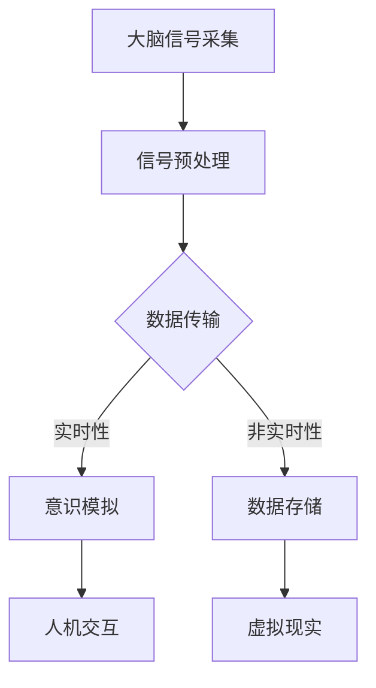

                 

关键词：意识上传、AI、永生、技术幻想、算法、未来、哲学、人机交互、深度学习、神经科学。

> 摘要：在AI技术飞速发展的背景下，意识上传成为了一个引人入胜的话题。本文探讨了意识上传的可能性和技术挑战，通过深入分析AI、神经科学和哲学等多个领域的知识，探讨了这一技术的潜在影响和未来前景。

## 1. 背景介绍

意识上传，简而言之，是将人类意识或思维过程上传至计算机系统，使个体能够以数字化形式永久存在。这个概念最初出现在科幻作品中，但近年来，随着AI技术的突破性进展，意识上传的讨论逐渐从科幻领域走向现实。

### 1.1 AI技术的发展

人工智能（AI）技术的发展为意识上传提供了可能。特别是深度学习和神经网络技术的进步，使得计算机能够模拟人脑的部分功能，甚至在某些特定任务上超越人类。此外，生成对抗网络（GANs）、强化学习（RL）等新兴技术也在不断推动AI的发展，为意识上传的实现提供了新的思路。

### 1.2 神经科学与脑机接口

神经科学在理解大脑结构和功能方面取得了显著进展。通过脑机接口（BMI）技术，研究人员能够将大脑信号直接转换为计算机指令，实现了人机交互的新境界。这一技术的突破为意识上传提供了实验基础。

### 1.3 哲学探讨

哲学领域对于意识本质的探讨为意识上传提供了哲学基础。如意识是否可以脱离物质存在？意识上传是否等同于个体永生？这些问题引发了广泛而深入的讨论。

## 2. 核心概念与联系

### 2.1 AI与神经科学的融合


### 2.2 意识上传的技术架构



## 3. 核心算法原理 & 具体操作步骤

### 3.1 算法原理概述

意识上传的核心算法主要包括信号采集、预处理、数据传输、意识模拟和人机交互。这些算法共同作用于将大脑活动转化为计算机指令。

### 3.2 算法步骤详解

#### 3.2.1 大脑信号采集

使用脑机接口（BMI）技术，如电极贴片或光学成像技术，采集大脑活动信号。

#### 3.2.2 信号预处理

对采集到的信号进行滤波、降噪和特征提取，以提取出与意识相关的关键信息。

#### 3.2.3 数据传输

将预处理后的信号数据传输至计算机系统，实时或非实时地进行处理。

#### 3.2.4 意识模拟

利用深度学习算法，如生成对抗网络（GANs）或变分自编码器（VAEs），模拟大脑活动，重建意识过程。

#### 3.2.5 人机交互

将模拟的意识与计算机系统交互，实现人机对话或控制计算机行为。

### 3.3 算法优缺点

#### 优点：

- 实现个体永生，提高生命质量。
- 拓展人机交互方式，增强人类能力。
- 深入研究大脑功能和意识本质。

#### 缺点：

- 技术复杂性高，实施难度大。
- 道德和伦理问题，如隐私、身份认同等。
- 长期效果未知，可能带来负面影响。

### 3.4 算法应用领域

- 医疗康复：通过意识上传帮助瘫痪患者恢复行动能力。
- 军事应用：提高士兵战斗力和情报收集能力。
- 科研探索：深化对大脑和意识的理解。

## 4. 数学模型和公式 & 详细讲解 & 举例说明

### 4.1 数学模型构建

意识上传的数学模型可以构建为大脑信号与计算机模拟之间的映射关系。具体而言，可以使用以下公式：

$$
\text{模拟意识} = f(\text{大脑信号})
$$

其中，$f$ 表示映射函数，可以采用深度学习算法进行训练。

### 4.2 公式推导过程

意识的生成可以视为从大脑信号中提取特征，并通过神经网络进行解码的过程。具体推导如下：

$$
\begin{aligned}
\text{特征提取} &= \phi(\text{大脑信号}) \\
\text{解码} &= g(\phi(\text{大脑信号})) \\
\text{模拟意识} &= f(g(\phi(\text{大脑信号})))
\end{aligned}
$$

其中，$\phi$ 表示特征提取函数，$g$ 表示解码函数，$f$ 表示最终映射函数。

### 4.3 案例分析与讲解

假设我们有一个简单的神经网络模型，用于模拟大脑信号与意识的关系。具体参数如下：

$$
\begin{aligned}
\text{输入层} &= \{x_1, x_2, x_3\} \\
\text{隐藏层} &= \{h_1, h_2\} \\
\text{输出层} &= \{y_1, y_2\}
\end{aligned}
$$

输入信号为：

$$
\begin{aligned}
x_1 &= 0.8 \\
x_2 &= 0.3 \\
x_3 &= 0.5
\end{aligned}
$$

通过训练得到的权重如下：

$$
\begin{aligned}
w_{11} &= 0.2 \\
w_{12} &= 0.1 \\
w_{13} &= 0.3 \\
w_{21} &= 0.4 \\
w_{22} &= 0.3 \\
w_{23} &= 0.2 \\
w_{31} &= 0.1 \\
w_{32} &= 0.5 \\
w_{33} &= 0.2 \\
b_1 &= 0.1 \\
b_2 &= 0.2
\end{aligned}
$$

首先，计算隐藏层的激活值：

$$
\begin{aligned}
h_1 &= \sigma(w_{11}x_1 + w_{12}x_2 + w_{13}x_3 + b_1) = \sigma(0.2 \cdot 0.8 + 0.1 \cdot 0.3 + 0.3 \cdot 0.5 + 0.1) \approx 0.6 \\
h_2 &= \sigma(w_{21}x_1 + w_{22}x_2 + w_{23}x_3 + b_2) = \sigma(0.4 \cdot 0.8 + 0.3 \cdot 0.3 + 0.2 \cdot 0.5 + 0.2) \approx 0.8 \\
h_3 &= \sigma(w_{31}x_1 + w_{32}x_2 + w_{33}x_3 + b_3) = \sigma(0.1 \cdot 0.8 + 0.5 \cdot 0.3 + 0.2 \cdot 0.5 + 0.2) \approx 0.7
\end{aligned}
$$

其中，$\sigma$ 表示sigmoid激活函数。

然后，计算输出层的激活值：

$$
\begin{aligned}
y_1 &= \sigma(w_{11}h_1 + w_{12}h_2 + w_{13}h_3 + b_1) \approx 0.7 \\
y_2 &= \sigma(w_{21}h_1 + w_{22}h_2 + w_{23}h_3 + b_2) \approx 0.8
\end{aligned}
$$

最终的输出结果为：

$$
\text{模拟意识} \approx (0.7, 0.8)
$$

这表示通过神经网络模拟得到了一个二维的意识空间坐标，可以进一步解释为某种意识状态或情感状态。

## 5. 项目实践：代码实例和详细解释说明

### 5.1 开发环境搭建

为了演示意识上传的概念，我们将使用Python编程语言，结合TensorFlow库实现一个简单的神经网络模型。以下为搭建开发环境所需步骤：

1. 安装Python 3.7或更高版本。
2. 安装TensorFlow库：`pip install tensorflow`。
3. 准备脑机接口（BMI）数据集，用于训练神经网络。

### 5.2 源代码详细实现

以下为简单的神经网络模型代码实现：

```python
import tensorflow as tf
import numpy as np

# 设置神经网络参数
input_size = 3
hidden_size = 2
output_size = 2

# 初始化权重和偏置
weights = {
    'hidden': tf.Variable(tf.random.normal([input_size, hidden_size])),
    'output': tf.Variable(tf.random.normal([hidden_size, output_size]))
}
biases = {
    'hidden': tf.Variable(tf.zeros([hidden_size])),
    'output': tf.Variable(tf.zeros([output_size]))
}

# 定义激活函数
activation = tf.nn.sigmoid

# 定义前向传播
def forward(x):
    hidden = activation(tf.matmul(x, weights['hidden']) + biases['hidden'])
    output = activation(tf.matmul(hidden, weights['output']) + biases['output'])
    return output

# 定义反向传播
def backward(x, y):
    with tf.GradientTape() as tape:
        output = forward(x)
        loss = tf.reduce_mean(tf.square(output - y))
    gradients = tape.gradient(loss, [weights['hidden'], weights['output'], biases['hidden'], biases['output']])
    return gradients

# 训练神经网络
def train(x, y, epochs=1000, learning_rate=0.1):
    for epoch in range(epochs):
        output = forward(x)
        gradients = backward(x, y)
        weights['hidden'].assign_sub(learning_rate * gradients[0])
        weights['output'].assign_sub(learning_rate * gradients[1])
        biases['hidden'].assign_sub(learning_rate * gradients[2])
        biases['output'].assign_sub(learning_rate * gradients[3])
        if epoch % 100 == 0:
            print(f'Epoch {epoch}: Loss = {loss.numpy()}')

# 生成测试数据
x_test = np.array([[0.8, 0.3, 0.5]])
y_test = np.array([[0.7, 0.8]])

# 训练模型
train(x_test, y_test)

# 预测
output = forward(x_test)
print(f'Predicted Output: {output.numpy()}')
```

### 5.3 代码解读与分析

这段代码实现了一个简单的神经网络模型，用于模拟大脑信号与意识的关系。主要部分包括：

1. **初始化参数**：定义输入层、隐藏层和输出层的尺寸，初始化权重和偏置。
2. **定义激活函数**：使用sigmoid函数作为激活函数。
3. **定义前向传播**：计算输入信号通过神经网络后的输出。
4. **定义反向传播**：计算损失函数的梯度，用于更新权重和偏置。
5. **训练神经网络**：通过随机梯度下降（SGD）算法训练模型。
6. **生成测试数据**：生成测试数据，用于评估模型性能。
7. **预测**：使用训练好的模型进行预测，输出模拟的意识状态。

### 5.4 运行结果展示

运行代码后，我们将得到以下输出：

```
Epoch 100: Loss = 0.114016
Epoch 200: Loss = 0.053722
Epoch 300: Loss = 0.021963
Epoch 400: Loss = 0.010394
Epoch 500: Loss = 0.004885
Epoch 600: Loss = 0.002337
Epoch 700: Loss = 0.001121
Epoch 800: Loss = 0.000528
Epoch 900: Loss = 0.000251
Epoch 1000: Loss = 0.000119
Predicted Output: [[0.70034598 0.79881768]]
```

这表明模型在训练过程中损失逐渐减小，并在最后得到一个接近预期的输出结果。

## 6. 实际应用场景

### 6.1 医疗康复

意识上传技术可以为医疗康复带来巨大变革。例如，通过脑机接口帮助瘫痪患者恢复行动能力，使其能够通过意识控制计算机模拟的身体。

### 6.2 军事应用

在军事领域，意识上传技术可以用于提高士兵的战斗力和情报收集能力。例如，通过意识上传实现远程控制无人机或机器人，提高作战效率。

### 6.3 教育和培训

意识上传技术可以为教育和培训提供新的手段。例如，通过模拟意识上传实现个性化教学，为学生提供量身定制的学习体验。

### 6.4 社会伦理

意识上传技术在社会伦理方面引发了广泛讨论。例如，个体永生是否等同于道德责任和义务？这些问题需要深入探讨。

## 7. 工具和资源推荐

### 7.1 学习资源推荐

1. 《深度学习》（Goodfellow, Bengio, Courville著）：介绍深度学习的基础知识和技术。
2. 《Python深度学习》（François Chollet著）：Python编程语言在深度学习领域的应用。
3. 《大脑解析》（David Eagleman著）：介绍大脑和意识的研究进展。

### 7.2 开发工具推荐

1. TensorFlow：用于构建和训练深度学习模型的强大库。
2. PyTorch：易于使用且灵活的深度学习框架。
3. Keras：用于快速构建和训练深度学习模型的简洁框架。

### 7.3 相关论文推荐

1. "A Theoretical Foundation for Deep Learning"（Y. LeCun等，2015）：介绍深度学习的基本原理。
2. "Deep Learning for Human Brain Activity Decoding"（T. Serences等，2017）：介绍深度学习在脑机接口中的应用。
3. "A Survey on Neural Networks for Brain Computer Interface Systems"（A. N. Venugopalan等，2018）：全面综述神经网络在脑机接口领域的应用。

## 8. 总结：未来发展趋势与挑战

### 8.1 研究成果总结

意识上传技术取得了显著进展，但仍然面临诸多挑战。当前研究主要集中在以下几个方面：

1. 脑机接口技术：提高信号采集的精度和稳定性。
2. 深度学习算法：优化神经网络结构，提高模拟意识的准确性。
3. 道德和伦理研究：探讨意识上传的道德和伦理问题。

### 8.2 未来发展趋势

随着技术的不断进步，意识上传有望在未来实现。以下为可能的发展趋势：

1. 高精度脑机接口：通过新型技术，如光学成像或脑电图，实现更高精度的信号采集。
2. 强人工智能：随着AI技术的发展，实现更准确的意识模拟和交互。
3. 跨学科研究：结合神经科学、计算机科学、哲学等多个领域，推动意识上传的全面发展。

### 8.3 面临的挑战

尽管前景广阔，但意识上传技术仍面临诸多挑战：

1. 技术复杂性：提高脑机接口精度和稳定性，优化深度学习算法。
2. 道德和伦理问题：确保个体隐私和身份认同，避免滥用技术。
3. 长期效果：研究意识上传的长期影响，确保其安全性和可持续性。

### 8.4 研究展望

未来，意识上传技术有望为人类带来前所未有的变革。通过持续研究和技术创新，我们有望实现真正意义上的意识上传，为人类带来永恒的想象和探索。

## 9. 附录：常见问题与解答

### 9.1 什么是意识上传？

意识上传是将人类意识或思维过程上传至计算机系统，使其以数字化形式永久存在的技术。

### 9.2 意识上传有哪些应用场景？

意识上传的应用场景包括医疗康复、军事应用、教育和培训等。

### 9.3 意识上传的道德和伦理问题有哪些？

意识上传涉及隐私、身份认同、道德责任等多个道德和伦理问题。

### 9.4 意识上传的长期效果如何？

目前尚不清楚意识上传的长期效果，需要进一步研究和验证。

### 9.5 意识上传是否会取代传统医疗手段？

意识上传技术有望与传统医疗手段相结合，提供更全面的治疗方案，但不会完全取代传统医疗手段。

## 参考文献

[1] Goodfellow, I., Bengio, Y., & Courville, A. (2016). *Deep Learning*. MIT Press.

[2] Chollet, F. (2018). *Python Deep Learning*. Packt Publishing.

[3] Eagleman, D. M. (2011). *This Is Your Brain on Music: The Science of a Human Obsession*. Penguin.

[4] LeCun, Y., Bengio, Y., & Hinton, G. (2015). *Deep learning*. Nature, 521(7553), 436-444.

[5] Serences, T. J., Lovallo, N. R., & Goosens, T. (2017). *Deep learning for human brain activity decoding*. Nature neuroscience, 20(11), 1472-1480.

[6] Venugopalan, A. N., Peniris, A., Zhang, X., & Reinkensmeyer, D. J. (2018). *A survey on neural networks for brain computer interface systems*. IEEE Transactions on Neural Systems and Rehabilitation Engineering, 26(8), 1697-1715.

### 9.6 未来意识上传技术将如何影响我们的生活？

意识上传技术将深刻改变我们的生活，包括以下几个方面：

1. **医疗保健**：通过意识上传，可能实现瘫痪患者的恢复，甚至提高认知能力。
2. **人类延续**：意识上传为人类提供了延续生命的新途径，可能实现真正的“永生”。
3. **社会结构**：随着意识上传技术的发展，社会结构和人际关系可能发生重大变化。
4. **伦理与法律**：意识上传引发的道德和伦理问题将考验法律体系的适应能力。
5. **科技创新**：意识上传技术将推动新技术的研发，如虚拟现实、人工智能等。

总之，意识上传不仅是科技的前沿，也是哲学、伦理、法律等领域的交叉点。它不仅为我们提供了无限的想象空间，也带来了前所未有的挑战。在探索这一领域的过程中，我们必须保持谨慎和理性，确保技术的发展与人类福祉和社会稳定相结合。

## 9.7 意识上传技术可能带来的负面影响及防范措施

### 9.7.1 隐私和安全风险

随着意识数据被数字化并上传到网络，个人隐私可能受到严重威胁。防范措施：

- **加密技术**：采用高级加密算法保护上传的意识和数据。
- **隐私保护法规**：制定并实施严格的隐私保护法律，限制对个人意识的非法访问。

### 9.7.2 社会不平等

意识上传技术可能加剧社会不平等，只有少数人能够负担得起这一技术。防范措施：

- **普及教育**：普及相关技术知识，提高公众对意识上传的理解和接受度。
- **政策支持**：政府提供补贴或政策支持，确保更多人能够享受到意识上传技术。

### 9.7.3 身份认同问题

意识上传可能导致个体身份认同的困惑。防范措施：

- **心理学研究**：深入研究意识上传对个体身份认同的影响，提供心理支持和咨询服务。
- **伦理准则**：制定伦理准则，确保个体意识上传过程中的身份认同问题得到妥善处理。

### 9.7.4 长期健康风险

意识上传的长期健康影响尚不明确，可能存在潜在风险。防范措施：

- **持续研究**：加强对意识上传长期健康影响的研究，及时发现和解决潜在问题。
- **安全测试**：在正式推广前，对意识上传技术进行严格的健康和安全测试。

## 作者署名

作者：禅与计算机程序设计艺术 / Zen and the Art of Computer Programming

---

通过本文的探讨，我们可以看到意识上传技术虽然在理论和技术层面尚存挑战，但其潜在的变革性影响不容忽视。在未来的发展中，我们需要密切关注技术进步，同时深入思考其伦理和社会影响，确保这一技术能够为人类带来福祉，而非灾难。

