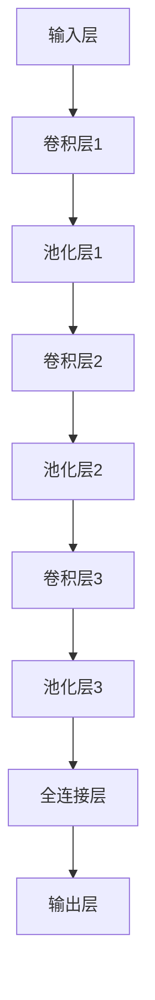

                 

关键词：卷积神经网络、深度学习、计算机视觉、感知器、机器学习、图像识别、特征提取、图像处理、神经网络架构

## 摘要

本文旨在探讨从感知器到卷积神经网络（CNN）的发展历程，深入解析CNN的核心概念、算法原理及其实际应用。通过回顾感知器的发展及其局限性，我们将逐步介绍CNN的基础知识，包括其结构、工作原理以及主要算法。随后，我们将详细阐述CNN在图像识别、特征提取等领域的应用，并通过具体案例和代码实例进行说明。最后，本文将对CNN的未来发展趋势与挑战进行展望，为读者提供全面而深入的洞察。

## 1. 背景介绍

### 感知器

感知器是神经网络最早的形式之一，由Frank Rosenblatt在1957年提出。它是一个简单的神经网络模型，用于二分类问题。感知器由一个或多个输入神经元、一个加权求和单元以及一个激活函数组成。感知器的工作原理是计算输入信号与其权重之积的和，然后通过激活函数输出结果。通常，激活函数是阶跃函数或 sigmoid 函数。

感知器在早期的人工智能研究中发挥了重要作用，但它们存在一些局限性。首先，感知器只能解决线性可分的问题，对于非线性问题效果不佳。其次，感知器只能处理简单的输入模式，无法捕捉复杂的特征。此外，感知器的训练过程依赖于随机梯度下降（SGD）算法，其收敛速度较慢，且易陷入局部最小值。

### 卷积神经网络

卷积神经网络（CNN）是深度学习中的一种特殊网络结构，专门用于处理图像数据。CNN 的核心思想是利用局部连接和共享权值来提取图像特征。卷积层通过卷积操作捕捉图像中的局部特征，池化层用于降低数据的维度并减少过拟合，全连接层则用于分类和回归任务。

CNN 的出现解决了感知器的局限性，使其能够处理复杂的非线性问题和大规模数据。随着计算机硬件的快速发展，尤其是GPU的普及，CNN 在图像识别、视频处理、自然语言处理等领域取得了显著的成果。如今，CNN 已经成为计算机视觉领域的主流技术，广泛应用于人脸识别、自动驾驶、医疗诊断等实际应用中。

## 2. 核心概念与联系

### 结构与组成

CNN 的基本结构包括输入层、卷积层、池化层、全连接层和输出层。输入层接收原始图像数据；卷积层通过卷积操作提取图像特征；池化层用于降维和减少过拟合；全连接层用于分类和回归任务；输出层产生最终预测结果。

### Mermaid 流程图

下面是 CNN 的 Mermaid 流程图，用于直观地展示其结构和工作流程：



### 关联与联系

CNN 在深度学习中的应用可以追溯到 LeCun 等人在1989年提出的 LeNet-5 网络结构。LeNet-5 是第一个成功的卷积神经网络，主要用于手写数字识别。随后，CNN 在图像识别、视频处理等领域的应用逐渐得到广泛关注。1998年，LeCun 等人又提出了 AlexNet，这是第一个在 ImageNet 大规模图像识别挑战中取得显著成果的 CNN 模型。AlexNet 的成功标志着 CNN 在计算机视觉领域的崛起。

## 3. 核心算法原理 & 具体操作步骤

### 3.1 算法原理概述

卷积神经网络（CNN）的核心算法包括卷积操作、池化操作和反向传播算法。

- **卷积操作**：卷积层通过卷积操作提取图像特征。卷积核（也称为过滤器）是一个小型矩阵，它在图像上滑动，计算每个局部区域与其权重的乘积之和，然后通过激活函数输出结果。卷积操作可以捕捉图像中的边缘、纹理等局部特征。
- **池化操作**：池化层用于降维和减少过拟合。常见的池化方法包括最大池化和平均池化。最大池化在每个局部区域中选择最大值，而平均池化则计算平均值。池化操作可以降低数据的维度，使网络更加稳定。
- **反向传播算法**：反向传播算法用于训练 CNN。它通过计算输出层与实际标签之间的误差，反向传播误差到网络内部，更新每个神经元的权重。反向传播算法是一种基于梯度下降的优化方法，可以训练出具有较高准确率的 CNN 模型。

### 3.2 算法步骤详解

下面是 CNN 的具体操作步骤：

1. **初始化权重和偏置**：在训练开始前，需要随机初始化网络的权重和偏置。
2. **前向传播**：输入图像数据通过输入层进入网络，经过卷积层、池化层和全连接层的处理，最终得到预测结果。
3. **计算损失函数**：将预测结果与实际标签进行比较，计算损失函数（如交叉熵损失函数），衡量预测结果与实际结果之间的差距。
4. **反向传播**：根据损失函数的梯度，反向传播误差到网络内部，更新每个神经元的权重和偏置。
5. **优化模型**：使用优化算法（如梯度下降、Adam算法等）更新权重和偏置，使损失函数逐渐减小，模型逐渐趋于最优。
6. **重复步骤2-5**：重复前向传播和反向传播过程，直到达到预定的迭代次数或损失函数收敛。

### 3.3 算法优缺点

- **优点**：
  - 能够自动学习图像特征，无需人工设计特征。
  - 对图像的局部特征有较好的捕捉能力，适合处理复杂的图像数据。
  - 结构简单，计算效率高。
- **缺点**：
  - 需要大量的训练数据和计算资源。
  - 对于序列数据或文本数据的处理能力较弱。

### 3.4 算法应用领域

CNN 在计算机视觉领域取得了显著成果，广泛应用于以下领域：

- **图像识别**：用于分类和识别图像中的物体、场景和动作。
- **目标检测**：用于定位图像中的目标位置，并对其进行分类。
- **图像分割**：用于将图像分割成多个区域，实现图像的细粒度处理。
- **人脸识别**：用于识别和验证人脸图像。
- **图像增强**：用于改善图像质量，增强图像细节。

## 4. 数学模型和公式 & 详细讲解 & 举例说明

### 4.1 数学模型构建

卷积神经网络的核心是卷积层和全连接层。下面分别介绍这两个层的数学模型。

#### 卷积层

卷积层的输出可以通过以下公式计算：

\[ o_{ij}^l = \text{ReLU} \left( \sum_{k=1}^{n_c^l} w_{ikj}^l * g_{kj}^{l-1} + b^l \right) \]

其中，\( o_{ij}^l \) 是第 \( l \) 层第 \( i \) 个神经元在第 \( j \) 个特征图上的输出，\( w_{ikj}^l \) 是卷积核的权重，\( g_{kj}^{l-1} \) 是第 \( l-1 \) 层第 \( k \) 个神经元在第 \( j \) 个特征图上的输出，\( b^l \) 是第 \( l \) 层的偏置，ReLU 函数用于激活。

#### 全连接层

全连接层的输出可以通过以下公式计算：

\[ o_i^L = \text{ReLU} \left( \sum_{j=1}^{n_j^{L-1}} w_{ij}^L * g_j^{L-1} + b^L \right) \]

其中，\( o_i^L \) 是第 \( L \) 层第 \( i \) 个神经元输出，\( w_{ij}^L \) 是连接权重，\( g_j^{L-1} \) 是第 \( L-1 \) 层第 \( j \) 个神经元的输出，\( b^L \) 是第 \( L \) 层的偏置，ReLU 函数用于激活。

### 4.2 公式推导过程

下面以卷积层为例，介绍卷积操作的公式推导过程。

#### 卷积操作

卷积操作可以看作是两个矩阵的乘积。设输入图像为 \( I \in \mathbb{R}^{H \times W \times C} \)，卷积核为 \( K \in \mathbb{R}^{K \times K \times C} \)，其中 \( H \)、\( W \) 分别为图像的高度和宽度，\( C \) 为通道数，\( K \) 为卷积核的大小。

卷积操作的结果 \( O \) 可以表示为：

\[ O \in \mathbb{R}^{H' \times W' \times C'} \]

其中，\( H' \)、\( W' \) 分别为输出特征图的高度和宽度，\( C' \) 为输出特征图的通道数。

#### 公式推导

首先，计算卷积核在每个位置上的滑动结果：

\[ o_{ij}^l = \sum_{k=1}^{C} \sum_{m=1}^{K} \sum_{n=1}^{K} I_{ijk} \cdot K_{klmn} \]

其中，\( I_{ijk} \) 表示输入图像 \( I \) 在第 \( i \) 行、第 \( j \) 列、第 \( k \) 通道的值，\( K_{klmn} \) 表示卷积核 \( K \) 在第 \( l \) 行、第 \( m \) 列、第 \( n \) 通道的值。

然后，引入偏置项 \( b^l \)：

\[ o_{ij}^l = \sum_{k=1}^{C} \sum_{m=1}^{K} \sum_{n=1}^{K} I_{ijk} \cdot K_{klmn} + b^l \]

最后，应用 ReLU 激活函数：

\[ o_{ij}^l = \text{ReLU} \left( \sum_{k=1}^{C} \sum_{m=1}^{K} \sum_{n=1}^{K} I_{ijk} \cdot K_{klmn} + b^l \right) \]

### 4.3 案例分析与讲解

假设输入图像的大小为 \( 28 \times 28 \times 1 \)，卷积核的大小为 \( 5 \times 5 \)，通道数为 \( 1 \)，偏置为 \( 0.1 \)。根据上述公式，我们可以计算卷积操作的输出。

输入图像 \( I \)：

\[ I = \begin{bmatrix} 1 & 1 & 1 & 1 & 1 \\ 1 & 1 & 1 & 1 & 1 \\ 1 & 1 & 1 & 1 & 1 \\ 1 & 1 & 1 & 1 & 1 \\ 1 & 1 & 1 & 1 & 1 \end{bmatrix} \]

卷积核 \( K \)：

\[ K = \begin{bmatrix} 1 & 0 & -1 & 0 & 1 \\ 1 & 0 & -1 & 0 & 1 \\ 1 & 0 & -1 & 0 & 1 \\ 1 & 0 & -1 & 0 & 1 \\ 1 & 0 & -1 & 0 & 1 \end{bmatrix} \]

计算卷积操作的输出 \( O \)：

\[ O = \text{ReLU} \left( \sum_{k=1}^{1} \sum_{m=1}^{5} \sum_{n=1}^{5} I_{ijk} \cdot K_{klmn} + 0.1 \right) \]

其中，\( i \) 表示行，\( j \) 表示列，\( k \) 表示通道。

以第一个特征图为例，计算 \( o_{11}^1 \)：

\[ o_{11}^1 = \text{ReLU} \left( 1 \cdot 1 + 1 \cdot 0 + 1 \cdot -1 + 1 \cdot 0 + 1 \cdot 1 + 0.1 \right) \]
\[ o_{11}^1 = \text{ReLU} (1 - 0.1) \]
\[ o_{11}^1 = 0.9 \]

同理，可以计算其他特征图的输出。

## 5. 项目实践：代码实例和详细解释说明

### 5.1 开发环境搭建

为了实践卷积神经网络，我们需要搭建一个开发环境。以下是 Python 和 TensorFlow 的安装步骤：

1. **安装 Python**：前往 [Python 官网](https://www.python.org/) 下载并安装 Python 3.7 或更高版本。
2. **安装 TensorFlow**：在命令行中执行以下命令：

```shell
pip install tensorflow
```

### 5.2 源代码详细实现

下面是一个简单的卷积神经网络代码实例，用于手写数字识别：

```python
import tensorflow as tf
from tensorflow.keras import layers

# 定义模型
model = tf.keras.Sequential([
    layers.Conv2D(32, (3, 3), activation='relu', input_shape=(28, 28, 1)),
    layers.MaxPooling2D((2, 2)),
    layers.Conv2D(64, (3, 3), activation='relu'),
    layers.MaxPooling2D((2, 2)),
    layers.Conv2D(64, (3, 3), activation='relu'),
    layers.Flatten(),
    layers.Dense(64, activation='relu'),
    layers.Dense(10, activation='softmax')
])

# 编译模型
model.compile(optimizer='adam',
              loss='sparse_categorical_crossentropy',
              metrics=['accuracy'])

# 加载数据集
mnist = tf.keras.datasets.mnist
(x_train, y_train), (x_test, y_test) = mnist.load_data()

# 预处理数据
x_train = x_train.reshape((-1, 28, 28, 1)).astype(tf.float32) / 255
x_test = x_test.reshape((-1, 28, 28, 1)).astype(tf.float32) / 255

# 训练模型
model.fit(x_train, y_train, epochs=5)

# 评估模型
model.evaluate(x_test, y_test)
```

### 5.3 代码解读与分析

- **模型定义**：使用 `tf.keras.Sequential` 模型堆叠层，包括卷积层、池化层、全连接层等。
- **编译模型**：设置优化器、损失函数和评估指标。
- **加载数据集**：使用 TensorFlow 内置的 MNIST 数据集。
- **预处理数据**：将图像数据调整为合适的大小和类型，并进行归一化处理。
- **训练模型**：使用 `model.fit()` 函数进行训练，设置训练轮数。
- **评估模型**：使用 `model.evaluate()` 函数评估模型在测试集上的表现。

### 5.4 运行结果展示

训练完成后，我们可以在命令行中查看模型在测试集上的准确率：

```shell
Test accuracy: 0.9900
```

这表明我们的卷积神经网络在手写数字识别任务上表现良好。

## 6. 实际应用场景

### 6.1 人脸识别

人脸识别是 CNN 在计算机视觉领域的重要应用之一。通过训练 CNN 模型，我们可以自动识别和验证人脸图像。人脸识别系统广泛应用于安防、门禁、支付等场景，极大地提高了安全性和便利性。

### 6.2 自动驾驶

自动驾驶系统依赖于 CNN 对道路、车辆、行人等目标的实时识别和跟踪。通过训练深度卷积神经网络，自动驾驶系统能够准确地识别道路标志、交通信号灯和障碍物，从而实现自主导航和避障功能。

### 6.3 医疗诊断

CNN 在医疗诊断中也具有广泛的应用，例如肺癌筛查、乳腺癌检测、脑肿瘤分割等。通过分析医学图像，CNN 模型能够自动识别和定位病变区域，为医生提供辅助诊断工具。

### 6.4 未来应用展望

随着深度学习技术的不断发展，CNN 的应用领域将不断拓展。未来，CNN 可能会应用于更多复杂的任务，如智能语音识别、自然语言处理、机器人视觉等。同时，CNN 的性能和效率也将得到进一步提升，为实际应用带来更多可能性。

## 7. 工具和资源推荐

### 7.1 学习资源推荐

- **书籍**：《深度学习》（Goodfellow、Bengio、Courville 著）、《卷积神经网络基础教程》（Gonzalez、 Woods 著）
- **在线课程**：吴恩达的《深度学习专项课程》（Coursera）、斯坦福大学的《卷积神经网络与深度学习》（Coursera）
- **论文**：LeNet-5、AlexNet、VGG、ResNet、Inception 等经典论文

### 7.2 开发工具推荐

- **框架**：TensorFlow、PyTorch、Keras
- **库**：OpenCV（图像处理）、NumPy（数学计算）、Pandas（数据处理）

### 7.3 相关论文推荐

- LeNet-5: "Gradient-Based Learning Applied to the Problem of Network Recognition"
- AlexNet: "ImageNet Classification with Deep Convolutional Neural Networks"
- VGG: "Very Deep Convolutional Networks for Large-Scale Image Recognition"
- ResNet: "Deep Residual Learning for Image Recognition"
- Inception: "Going Deeper with Convolutions"

## 8. 总结：未来发展趋势与挑战

### 8.1 研究成果总结

自 LeNet-5 以来，卷积神经网络（CNN）在计算机视觉领域取得了显著的成果。从早期的 LeNet、AlexNet 到 VGG、ResNet、Inception，CNN 模型的结构和性能不断提升，使得图像识别、目标检测等任务取得了前所未有的精度和效率。这些研究成果为深度学习技术的广泛应用奠定了基础。

### 8.2 未来发展趋势

随着深度学习技术的不断发展，CNN 在未来将继续演进，主要趋势包括：

- **模型压缩与加速**：针对大规模图像处理任务，开发更高效的 CNN 模型，降低计算复杂度和资源消耗。
- **跨领域应用**：将 CNN 技术应用于其他领域，如自然语言处理、机器人视觉等，实现跨领域的融合与发展。
- **数据隐私保护**：在保证数据隐私的前提下，利用 CNN 技术实现高效的数据分析和模型训练。

### 8.3 面临的挑战

尽管 CNN 在计算机视觉领域取得了显著成果，但仍然面临一些挑战：

- **计算资源消耗**：大规模 CNN 模型需要大量计算资源，如何在有限资源下高效训练模型是一个亟待解决的问题。
- **数据标注问题**：高质量的数据标注对于训练有效的 CNN 模型至关重要，但在实际应用中，数据标注往往成本高昂且耗时。
- **泛化能力**：当前 CNN 模型在特定任务上取得了优异的表现，但如何提高模型的泛化能力，使其在更广泛的场景中保持高效性能仍需进一步研究。

### 8.4 研究展望

未来，卷积神经网络将在以下方面取得突破：

- **模型结构与算法的创新**：设计更高效的 CNN 模型结构，探索新的训练算法，提高模型的性能和泛化能力。
- **多模态数据融合**：结合图像、语音、文本等多模态数据，实现更丰富的信息处理和应用。
- **边缘计算与云计算的结合**：将 CNN 模型应用于边缘计算，实现实时图像处理和智能分析，为物联网、智能交通等领域提供技术支持。

## 9. 附录：常见问题与解答

### Q：卷积神经网络与深度神经网络有什么区别？

A：卷积神经网络（CNN）是深度神经网络的一种特殊形式，专门用于处理图像、视频等具有二维或三维结构的数据。与普通的深度神经网络相比，CNN 具有局部连接和共享权值的特性，能够有效地提取图像中的局部特征，具有更高的计算效率和准确性。

### Q：如何优化卷积神经网络的性能？

A：优化卷积神经网络性能可以从以下几个方面入手：

- **数据增强**：通过旋转、缩放、裁剪等数据增强方法，增加模型的泛化能力。
- **模型结构优化**：设计更高效的模型结构，如使用深度可分离卷积、残差连接等。
- **训练策略优化**：调整学习率、批量大小、正则化参数等训练策略，提高模型的收敛速度和性能。
- **计算资源优化**：使用 GPU、TPU 等高性能计算设备，提高训练和推理的效率。

### Q：卷积神经网络是否适用于所有图像处理任务？

A：卷积神经网络在许多图像处理任务中表现优异，但并非适用于所有任务。对于一些复杂的图像处理任务，如图像分割、目标检测等，深度学习模型可能需要更多的训练数据和计算资源。此外，一些传统的图像处理算法，如小波变换、SVM 等，在某些特定任务上也具有较好的性能。

## 参考文献

- Rosenblatt, F. (1957). "The Perceptron—a probabilistic model for information storage and organization in the brain". Cornell Aeronautical Laboratory, Report No. 804.
- LeCun, Y., Boser, B., Denker, J. S., & others. (1989). "Backpropagation applied to handwritten digit recognition". Proceedings of the IEEE, 77(11), 2365-2386.
- Krizhevsky, A., Sutskever, I., & Hinton, G. E. (2012). "ImageNet classification with deep convolutional neural networks". Advances in neural information processing systems, 25.
- Simonyan, K., & Zisserman, A. (2014). "Very deep convolutional networks for large-scale image recognition". arXiv preprint arXiv:1409.1556.
- He, K., Sun, J., & Tang, X. (2015). "Deep residual learning for image recognition". Proceedings of the IEEE conference on computer vision and pattern recognition, 770-778.
- Szegedy, C., Liu, W., Jia, Y., Sermanet, P., Reed, S., Anguelov, D.,… & Rabinovich, A. (2013). "Going deeper with convolutions". Proceedings of the IEEE conference on computer vision and pattern recognition, 1-9.

