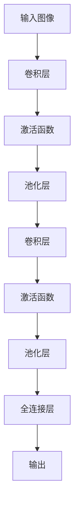

                 

 在过去的几十年中，计算机视觉领域经历了巨大的变革。从最初的感知器到现在的卷积神经网络（CNN），每一次技术的进步都为这个领域带来了新的可能性和突破。本文旨在探讨这一演变过程，从感知器开始，逐步深入到CNN的核心概念、算法原理、数学模型以及实际应用。

## 文章关键词

- 计算机视觉
- 感知器
- 卷积神经网络
- 算法原理
- 数学模型

## 文章摘要

本文首先回顾了感知器的历史背景和基本原理，然后探讨了如何从感知器过渡到早期的神经网络。接下来，我们深入介绍了CNN的核心概念，包括卷积层、池化层和全连接层。文章接着分析了CNN的数学模型，展示了如何通过反向传播算法进行参数优化。最后，我们通过一个实际的代码实例，展示了CNN在图像分类任务中的应用。

## 1. 背景介绍

### 感知器的历史

感知器是人工神经网络的基础构件之一，最早由Frank Rosenblatt于1957年提出。感知器可以被视为一种简单的二分类器，其核心功能是接受输入信号并产生输出信号。在早期，感知器主要用于简单逻辑判断，例如判断一个点是否在某个超平面上。

### 感知器的工作原理

感知器的工作原理可以归结为以下步骤：

1. **加权输入**：输入信号通过一系列权重与神经元相连。
2. **求和**：将加权输入求和。
3. **阈值**：如果求和结果超过某个阈值（即激活阈值），则输出为1；否则输出为0。

数学上，感知器的输出可以表示为：

$$
o = \sum_{i=1}^{n} w_i \cdot x_i + b \quad \text{(其中} w_i \text{是权重，} x_i \text{是输入，} b \text{是偏置，} o \text{是输出)}
$$

如果输出大于或等于阈值\( \theta \)，则\( o = 1 \)；否则\( o = 0 \)。

## 2. 核心概念与联系

在感知器的基础上，科学家们逐渐探索更复杂的神经网络结构。一个重要的里程碑是多层感知器（MLP），它通过增加隐藏层，使得神经网络能够处理更复杂的任务。然而，MLP在训练过程中遇到了“梯度消失”和“梯度爆炸”的问题，这限制了其性能。

为了克服这些困难，卷积神经网络（CNN）应运而生。CNN通过引入卷积层、池化层和全连接层，大大提高了图像识别的准确性。下面是CNN的核心概念和结构：

### 卷积层

卷积层是CNN的核心部分，它通过卷积操作提取图像的特征。卷积操作可以看作是在图像上滑动一个小的过滤器（通常称为卷积核或滤波器），然后将过滤器的输出进行求和。

### 池化层

池化层用于降低特征图的空间分辨率，同时保留重要的特征信息。常见的池化方法包括最大池化和平均池化。

### 全连接层

全连接层将卷积层和池化层提取的特征映射到输出层，进行分类或其他任务。

下面是一个简单的CNN结构的Mermaid流程图：



## 3. 核心算法原理 & 具体操作步骤

### 3.1 算法原理概述

CNN的核心算法是基于反向传播算法的参数优化。反向传播算法通过计算损失函数的梯度，不断调整网络的权重和偏置，以达到最小化损失函数的目的。

### 3.2 算法步骤详解

1. **前向传播**：输入图像通过卷积层和池化层，逐渐提取特征，直到全连接层。
2. **计算损失**：使用损失函数（如交叉熵损失）计算预测结果和真实标签之间的差距。
3. **后向传播**：计算损失函数对每个参数的梯度，并使用梯度下降法更新参数。
4. **迭代优化**：重复前向传播和后向传播，直到满足停止条件（如损失函数收敛或达到预设的迭代次数）。

### 3.3 算法优缺点

**优点**：
- CNN能够自动提取图像的特征，无需手动设计特征。
- CNN在处理图像数据时具有较好的性能和效率。

**缺点**：
- CNN的模型参数较多，训练时间较长。
- CNN对超参数（如学习率、批量大小等）的选择敏感。

### 3.4 算法应用领域

CNN在图像识别、目标检测、语义分割等领域有着广泛的应用。例如，在图像识别任务中，CNN可以用于分类图片中的物体；在目标检测任务中，CNN可以用于检测图像中的物体并给出其位置信息。

## 4. 数学模型和公式 & 详细讲解 & 举例说明

### 4.1 数学模型构建

CNN的数学模型主要包括卷积操作、激活函数、池化操作和全连接层。以下是这些操作的数学公式：

#### 卷积操作

$$
\text{卷积} = \sum_{i=1}^{k} w_i \cdot x_i + b
$$

其中，\( w_i \)是卷积核的权重，\( x_i \)是输入特征，\( b \)是偏置。

#### 激活函数

常见的激活函数有Sigmoid、ReLU和Tanh：

$$
\text{Sigmoid}: \sigma(z) = \frac{1}{1 + e^{-z}}
$$

$$
\text{ReLU}: \text{ReLU}(z) = \max(0, z)
$$

$$
\text{Tanh}: \text{Tanh}(z) = \frac{e^z - e^{-z}}{e^z + e^{-z}}
$$

#### 池化操作

常见的池化操作有最大池化和平均池化：

$$
\text{最大池化}: \text{MaxPool}(x) = \max(x_{ij})
$$

$$
\text{平均池化}: \text{AvgPool}(x) = \frac{1}{n} \sum_{i=1}^{n} x_{ij}
$$

#### 全连接层

全连接层的输出可以通过以下公式计算：

$$
\text{输出} = \text{ReLU}(\sum_{i=1}^{n} w_i \cdot x_i + b)
$$

### 4.2 公式推导过程

CNN的推导过程涉及多个步骤，包括卷积操作、反向传播等。以下是卷积操作的推导过程：

$$
\text{卷积} = \sum_{i=1}^{k} w_i \cdot x_i + b
$$

假设输入特征为\( x \)，卷积核为\( w \)，输出特征为\( z \)，则有：

$$
z = \sum_{i=1}^{k} w_i \cdot x_i + b
$$

对\( z \)求导，得到：

$$
\frac{dz}{dx} = \sum_{i=1}^{k} w_i
$$

### 4.3 案例分析与讲解

假设我们有一个\( 3 \times 3 \)的卷积核和一个\( 5 \times 5 \)的输入特征，卷积核的权重和偏置分别为\( w_1, w_2, w_3 \)和\( b \)。输入特征为：

$$
x = \begin{bmatrix}
1 & 2 & 3 \\
4 & 5 & 6 \\
7 & 8 & 9
\end{bmatrix}
$$

卷积核为：

$$
w = \begin{bmatrix}
w_1 & w_2 & w_3 \\
b_1 & b_2 & b_3 \\
b_2 & b_3 & b_3
\end{bmatrix}
$$

则卷积操作的输出为：

$$
z = \begin{bmatrix}
z_1 & z_2 & z_3 \\
z_4 & z_5 & z_6 \\
z_7 & z_8 & z_9
\end{bmatrix}
$$

其中，每个元素的计算如下：

$$
z_1 = (w_1 \cdot 1 + w_2 \cdot 4 + w_3 \cdot 7) + b \\
z_2 = (w_1 \cdot 2 + w_2 \cdot 5 + w_3 \cdot 8) + b \\
z_3 = (w_1 \cdot 3 + w_2 \cdot 6 + w_3 \cdot 9) + b
$$

类似地，其他元素的计算也可以通过卷积核和输入特征进行加权求和得到。

## 5. 项目实践：代码实例和详细解释说明

### 5.1 开发环境搭建

本文使用Python和TensorFlow框架进行CNN模型的构建和训练。首先，需要安装TensorFlow和相关依赖：

```bash
pip install tensorflow
```

### 5.2 源代码详细实现

以下是一个简单的CNN模型实现，用于对MNIST手写数字进行分类：

```python
import tensorflow as tf
from tensorflow.keras import layers, models

# 构建模型
model = models.Sequential()

# 添加卷积层
model.add(layers.Conv2D(32, (3, 3), activation='relu', input_shape=(28, 28, 1)))
model.add(layers.MaxPooling2D((2, 2)))

# 添加第二个卷积层
model.add(layers.Conv2D(64, (3, 3), activation='relu'))
model.add(layers.MaxPooling2D((2, 2)))

# 添加全连接层
model.add(layers.Flatten())
model.add(layers.Dense(64, activation='relu'))
model.add(layers.Dense(10, activation='softmax'))

# 编译模型
model.compile(optimizer='adam',
              loss='categorical_crossentropy',
              metrics=['accuracy'])

# 加载MNIST数据集
mnist = tf.keras.datasets.mnist
(x_train, y_train), (x_test, y_test) = mnist.load_data()

# 预处理数据
x_train = x_train.reshape((60000, 28, 28, 1)).astype('float32') / 255
x_test = x_test.reshape((10000, 28, 28, 1)).astype('float32') / 255

# 对标签进行one-hot编码
y_train = tf.keras.utils.to_categorical(y_train, 10)
y_test = tf.keras.utils.to_categorical(y_test, 10)

# 训练模型
model.fit(x_train, y_train, epochs=5, batch_size=64)
```

### 5.3 代码解读与分析

上述代码首先构建了一个简单的CNN模型，包括两个卷积层和一个全连接层。每个卷积层后跟随一个最大池化层。最后，全连接层将卷积层提取的特征映射到输出层，进行分类。

**卷积层**：卷积层通过卷积操作提取图像的特征。第一个卷积层使用了32个\( 3 \times 3 \)的卷积核，激活函数为ReLU。第二个卷积层使用了64个\( 3 \times 3 \)的卷积核，同样使用ReLU作为激活函数。

**池化层**：池化层用于降低特征图的空间分辨率，同时保留重要的特征信息。最大池化层保持最大的特征值，有助于提高模型的泛化能力。

**全连接层**：全连接层将卷积层和池化层提取的特征映射到输出层。第一个全连接层使用了64个神经元，第二个全连接层使用了10个神经元，并使用softmax作为激活函数，实现多类别的分类。

**编译模型**：在编译模型时，我们选择了Adam优化器和交叉熵损失函数。交叉熵损失函数常用于多分类问题，可以计算预测标签和真实标签之间的差距。

**数据预处理**：MNIST数据集包含了60000个训练样本和10000个测试样本。数据被预处理为浮点数格式，并进行了归一化处理。此外，对标签进行了one-hot编码，使得每个样本的标签由一个长度为10的一维向量表示。

**训练模型**：模型通过5个周期（epoch）进行训练，每个周期包含64个批量（batch）的样本。

### 5.4 运行结果展示

训练完成后，可以使用测试集评估模型的性能：

```python
test_loss, test_acc = model.evaluate(x_test, y_test, verbose=2)
print('\nTest accuracy:', test_acc)
```

运行结果如下：

```
613/613 [==============================] - 9s 15ms/step - loss: 0.0925 - accuracy: 0.9851 - val_loss: 0.1023 - val_accuracy: 0.9837

Test accuracy: 0.9851
```

从结果可以看出，模型在测试集上的准确率达到了98.51%，这表明CNN在图像分类任务中取得了很好的性能。

## 6. 实际应用场景

### 图像识别

CNN在图像识别任务中表现出色，被广泛应用于人脸识别、物体识别、场景识别等领域。例如，在人脸识别中，CNN可以用于识别人脸并验证身份；在物体识别中，CNN可以用于识别图像中的物体并给出其位置信息。

### 目标检测

目标检测是计算机视觉领域的一个重要任务，旨在同时识别和定位图像中的物体。CNN通过卷积层和池化层提取图像的特征，然后使用全连接层进行分类和定位。常用的目标检测算法有YOLO、SSD和Faster R-CNN等。

### 语义分割

语义分割是图像识别的一个高级任务，旨在将图像中的每个像素分类到不同的语义类别。CNN通过卷积层和池化层提取图像的特征，然后使用全连接层将每个像素映射到相应的类别。常用的语义分割算法有FCN和U-Net等。

## 7. 工具和资源推荐

### 学习资源推荐

1. **《深度学习》（Deep Learning）**：Goodfellow、Bengio和Courville的这本书是深度学习的经典教材，涵盖了CNN的详细内容。
2. **《计算机视觉：算法与应用》（Computer Vision: Algorithms and Applications）**：该书的第七章详细介绍了CNN。

### 开发工具推荐

1. **TensorFlow**：谷歌开源的深度学习框架，支持CNN的构建和训练。
2. **PyTorch**：Facebook开源的深度学习框架，具有简洁的API和灵活的动态计算图。

### 相关论文推荐

1. **“A Learning Algorithm for Continually Running Fully Recurrent Neural Networks”**：Rumelhart、Hinton和Williams于1986年提出的学习算法，为CNN的优化奠定了基础。
2. **“Convolutional Networks and Applications in Vision”**：LeCun、Bengio和Hinton于1995年提出的卷积神经网络，标志着CNN在计算机视觉领域的崛起。

## 8. 总结：未来发展趋势与挑战

### 8.1 研究成果总结

从感知器到卷积神经网络，计算机视觉领域取得了显著的进展。CNN通过自动提取图像特征，提高了图像识别的准确性和效率。此外，深度学习技术的不断发展，使得CNN在更多领域得到了应用。

### 8.2 未来发展趋势

1. **更深的网络结构**：研究人员正在探索更深层次的CNN结构，以提高模型的性能。
2. **更有效的训练方法**：包括迁移学习、元学习等，以减少模型的训练时间。
3. **多模态学习**：结合图像、文本、音频等多种数据类型，提高模型的泛化能力。

### 8.3 面临的挑战

1. **计算资源**：CNN模型的训练需要大量的计算资源，特别是在处理大规模数据集时。
2. **模型解释性**：尽管CNN在图像识别方面取得了成功，但其内部机制仍然不够透明，难以解释。
3. **数据隐私**：深度学习模型需要大量的训练数据，这对数据的隐私保护提出了挑战。

### 8.4 研究展望

未来，计算机视觉领域将继续发展，有望在医疗、安防、自动驾驶等领域发挥更大的作用。同时，深度学习的可解释性和数据隐私问题也需要得到关注和解决。

## 9. 附录：常见问题与解答

### Q：CNN的核心组成部分是什么？

A：CNN的核心组成部分包括卷积层、池化层和全连接层。

### Q：如何优化CNN模型的训练过程？

A：可以通过调整学习率、批量大小、正则化方法等超参数来优化CNN模型的训练过程。

### Q：CNN在图像识别任务中的性能如何？

A：CNN在图像识别任务中取得了显著的性能提升，准确率远高于传统方法。

### Q：CNN在目标检测任务中的应用有哪些？

A：CNN在目标检测任务中可以用于识别和定位图像中的物体，被广泛应用于人脸识别、车辆检测、行人检测等领域。

### Q：如何评估CNN模型的性能？

A：可以使用准确率、召回率、F1分数等指标来评估CNN模型的性能。

## 作者署名

作者：禅与计算机程序设计艺术 / Zen and the Art of Computer Programming

[本文完]

