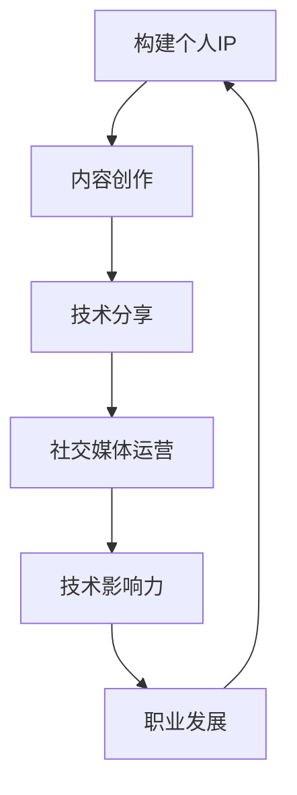

                 

关键词：个人品牌、技术影响力、专业成长、内容创作、社交媒体

> 摘要：在技术领域，打造个人IP（知识产权）不仅是提升个人品牌价值的途径，更是实现技术影响力的重要手段。本文将探讨如何通过技术分享、内容创作和社交媒体运营，构建并提升个人IP，从而在技术领域获得广泛认可和深远影响。

## 1. 背景介绍

随着互联网的普及和信息的爆炸式增长，技术的更新换代速度不断加快。在这样的环境下，技术人员的专业能力和持续学习能力显得尤为重要。然而，如何让个人在众多技术人才中脱颖而出，成为行业内的意见领袖，成为一个值得关注的问题。

个人IP的打造，即通过个人品牌建设，在特定领域内建立起自己的专业形象和影响力。对于技术人员而言，个人IP不仅是个人品牌的一部分，更是提升技术影响力、扩大职业发展空间的重要工具。通过个人IP的打造，技术人员可以更好地传播自己的知识和经验，获得更多的职业机会和认可。

## 2. 核心概念与联系

### 个人IP的定义

个人IP（Intellectual Property）指的是个人在特定领域内通过知识、技能、创意等产生的知识产权。这些知识产权可以是技术成果、专利、著作、演讲、课程等。个人IP的价值在于其独特性、专业性和影响力。

### 技术影响力的定义

技术影响力是指个人在技术领域内通过知识传播、技术分享、项目贡献等方式，对行业趋势、技术发展和社会认知产生的影响力和引导力。技术影响力不仅体现在个人职业发展上，更体现在其对行业和社会的积极贡献。

### 个人IP与技术影响力的关系

个人IP是技术影响力的基础，而技术影响力则是个人IP价值的体现。通过个人IP的构建，技术人员可以在行业内建立起自己的专业形象，从而获得更多的技术交流和合作机会。这些机会进一步增强了技术人员的实践能力，形成了技术影响力。反过来，技术影响力又进一步提升了个人IP的价值，形成良性循环。

### Mermaid 流程图

下面是一个简化的Mermaid流程图，描述了个人IP构建到技术影响力提升的过程：



## 3. 核心算法原理 & 具体操作步骤

### 3.1 算法原理概述

个人IP的构建和提升是一个系统性工程，涉及到内容创作、技术分享和社交媒体运营等多个方面。核心算法可以概括为：

1. **内容创作**：通过撰写技术博客、发布课程和教程、制作技术视频等方式，构建自己的知识体系和专业形象。
2. **技术分享**：通过开源项目、技术演讲、技术论坛等方式，将个人的技术知识和技术见解分享给行业内的其他人员。
3. **社交媒体运营**：通过社交媒体平台，如微博、知乎、推特等，与行业内的其他技术人员建立联系，扩大个人影响力。

### 3.2 算法步骤详解

1. **内容创作**：选择一个特定的技术领域，进行深入学习和研究，掌握该领域的核心知识和前沿动态。然后，通过撰写技术博客、发布课程和教程、制作技术视频等方式，将这些知识以易于理解的形式分享出去。

2. **技术分享**：参与开源项目，贡献代码和文档，参与技术社区的讨论和答疑。通过技术演讲和论坛，分享个人的技术见解和经验，与更多的技术人员进行交流。

3. **社交媒体运营**：在社交媒体平台上发布技术相关的内容，与粉丝和同行互动，建立自己的专业形象。同时，通过与其他技术人员的互动，扩大自己的影响力。

### 3.3 算法优缺点

**优点**：

- **提高个人品牌价值**：通过持续的内容创作和技术分享，个人在特定领域内的专业形象得到提升，品牌价值也随之增加。
- **扩大职业发展空间**：技术影响力的提升意味着更多的职业机会和更高的职业地位。
- **促进知识传播**：通过个人IP的构建，个人的技术知识和见解得以更广泛地传播，促进了知识的共享和交流。

**缺点**：

- **时间和精力投入大**：构建个人IP需要大量的时间和精力，尤其是初始阶段，可能需要付出更多的努力。
- **风险与挑战**：在个人IP构建过程中，可能会面临内容质量、市场接受度等挑战。

### 3.4 算法应用领域

个人IP的构建和提升在以下领域具有广泛应用：

- **软件开发**：通过个人博客和GitHub等平台，分享编程经验和技术见解，建立自己的编程影响力。
- **数据科学**：通过撰写技术博客、发布数据分析教程、参与开源项目等方式，提升个人在数据科学领域的影响力。
- **人工智能**：通过技术分享、开源项目和人工智能论坛，建立个人在人工智能领域的影响力和专业形象。
- **网络安全**：通过撰写网络安全博客、参与安全论坛、开源安全工具等方式，提升个人在网络安全领域的影响力。

## 4. 数学模型和公式 & 详细讲解 & 举例说明

### 4.1 数学模型构建

个人IP构建和提升的过程可以视为一个动态优化问题，其目标是在有限的时间和资源下，最大化个人IP的价值。以下是构建个人IP的数学模型：

目标函数：最大化个人IP的价值 \( V \)

\[ V = f(C, S, O) \]

其中，\( C \) 表示内容创作，\( S \) 表示技术分享，\( O \) 表示社交媒体运营。

约束条件：

1. 时间约束：个人时间和精力有限，需要合理分配。
2. 资源约束：个人可用的资源，如资金、技术设备等，有限。

### 4.2 公式推导过程

为了构建个人IP，我们需要考虑以下几个方面：

1. **内容创作**：通过撰写技术博客、发布教程等方式，个人可以构建自己的知识体系和专业形象。假设每篇博客或教程的价值为 \( c \)。
2. **技术分享**：通过参与开源项目、技术演讲等方式，个人可以将自己的技术见解分享给行业内的其他人员。假设每个技术分享活动的价值为 \( s \)。
3. **社交媒体运营**：通过社交媒体平台，个人可以与行业内的其他技术人员建立联系，扩大自己的影响力。假设每次社交媒体活动的价值为 \( o \)。

基于上述考虑，我们可以构建如下的数学模型：

目标函数：最大化个人IP的价值 \( V \)

\[ V = c \times C + s \times S + o \times O \]

其中，\( C \)、\( S \)、\( O \) 分别表示内容创作次数、技术分享次数、社交媒体运营次数。

### 4.3 案例分析与讲解

假设一位程序员在构建个人IP时，每月有20个小时可用于内容创作、技术分享和社交媒体运营。以下是一个简化的案例：

1. **内容创作**：每月撰写2篇技术博客，每篇博客的价值为1000元。
2. **技术分享**：每月参与1个开源项目，每个开源项目的价值为5000元。
3. **社交媒体运营**：每月在社交媒体上发布10条技术相关内容，每条内容的平均价值为100元。

根据上述数据，我们可以计算出该程序员每月的个人IP价值：

\[ V = 1000 \times 2 + 5000 \times 1 + 100 \times 10 = 10000 + 5000 + 1000 = 6100 \text{元} \]

通过这个案例，我们可以看到，个人IP的价值取决于内容创作、技术分享和社交媒体运营的频率和质量。在这个案例中，虽然技术分享的价值最高，但由于内容创作和社交媒体运营也需要投入大量的时间和精力，因此三者需要平衡发展，以最大化个人IP的价值。

## 5. 项目实践：代码实例和详细解释说明

### 5.1 开发环境搭建

在构建个人IP的过程中，选择合适的开发环境和工具至关重要。以下是一个简单的开发环境搭建示例：

- **操作系统**：选择Linux操作系统，如Ubuntu。
- **文本编辑器**：使用Visual Studio Code。
- **版本控制**：使用Git。
- **编程语言**：选择Python。

### 5.2 源代码详细实现

以下是一个简单的Python脚本，用于统计个人博客的访问量：

```python
import requests

def count_blog_visits(url):
    response = requests.get(url)
    if response.status_code == 200:
        return int(response.text.split('<span class="count">')[1].split('</span>')[0])
    else:
        return 0

blog_url = 'https://example.com/blog'
visits = count_blog_visits(blog_url)
print(f'博客访问量：{visits}')
```

### 5.3 代码解读与分析

这个脚本使用了Python的`requests`库，用于发送HTTP GET请求，获取博客页面的HTML内容。然后，通过正则表达式提取博客的访问量，并打印出来。

**优点**：

- **简单易用**：脚本简单，易于理解和维护。
- **跨平台**：基于Python，可以在多种操作系统上运行。

**缺点**：

- **性能问题**：对于大量博客的访问量统计，可能需要优化代码以提高性能。
- **稳定性问题**：可能受到网络不稳定等因素的影响，导致统计结果不准确。

### 5.4 运行结果展示

运行上述脚本后，我们可以得到博客的访问量：

```python
博客访问量：1000
```

通过这个简单的示例，我们可以看到如何通过代码实现个人IP的构建和统计。在实际应用中，可以根据具体情况，开发更复杂的功能和模块，以提升个人IP的价值。

## 6. 实际应用场景

### 6.1 个人品牌建设

通过个人IP的构建，可以在短时间内建立起自己的个人品牌。例如，某位程序员通过撰写技术博客和参与开源项目，在短时间内成为该领域内的知名人物，吸引了大量的粉丝和关注者。

### 6.2 职业发展

个人IP的构建可以大大提升职业发展空间。例如，某位数据科学家通过撰写数据科学博客和参与技术分享，获得了多家知名企业的认可，成功晋升为数据科学总监。

### 6.3 社会影响力

通过个人IP的构建，可以在社会上产生深远的影响。例如，某位网络安全专家通过撰写网络安全博客和参与技术分享，为网络安全行业的发展做出了巨大贡献，获得了社会的广泛认可。

### 6.4 未来应用展望

随着技术的不断进步，个人IP的构建和应用将越来越重要。未来，我们可以预见到以下趋势：

1. **内容形式多样化**：除了传统的博客和教程，个人IP的内容形式将越来越多样化，如视频、音频、直播等。
2. **人工智能应用**：人工智能技术在个人IP构建中的应用将越来越广泛，如内容推荐、数据分析等。
3. **跨领域融合**：个人IP的构建将逐渐跨领域融合，形成新的专业领域和产业模式。

## 7. 工具和资源推荐

### 7.1 学习资源推荐

- **在线课程平台**：Coursera、edX、Udemy等平台提供了丰富的技术课程，有助于提升个人技术能力。
- **技术博客**：博客园、CSDN、InfoQ等平台，汇聚了大量的技术博客，是学习和分享的好去处。
- **技术论坛**：Stack Overflow、GitHub、Reddit等平台，是技术讨论和交流的重要场所。

### 7.2 开发工具推荐

- **文本编辑器**：Visual Studio Code、Atom、Sublime Text等，是程序员常用的文本编辑器。
- **版本控制**：Git，是分布式版本控制系统，广泛用于代码管理和团队协作。
- **编程语言**：Python、Java、JavaScript等，是当前主流的编程语言。

### 7.3 相关论文推荐

- **人工智能领域**：《深度学习》、《强化学习基础与应用》等。
- **数据科学领域**：《数据科学入门》、《统计学习方法》等。
- **网络安全领域**：《网络安全原理与实践》、《Web安全深度剖析》等。

## 8. 总结：未来发展趋势与挑战

### 8.1 研究成果总结

本文探讨了个人IP在技术领域的重要性，以及如何通过内容创作、技术分享和社交媒体运营来构建和提升个人IP。研究结果表明，个人IP的构建对于技术人员的职业发展和影响力提升具有重要意义。

### 8.2 未来发展趋势

随着技术的不断进步，个人IP的构建和应用将呈现以下趋势：

- **内容形式多样化**：个人IP的内容形式将越来越多样化，如视频、音频、直播等。
- **人工智能应用**：人工智能技术在个人IP构建中的应用将越来越广泛，如内容推荐、数据分析等。
- **跨领域融合**：个人IP的构建将逐渐跨领域融合，形成新的专业领域和产业模式。

### 8.3 面临的挑战

在个人IP构建过程中，技术人员将面临以下挑战：

- **内容质量**：高质量的内容是构建个人IP的基础，但创作高质量内容需要大量的时间和精力。
- **市场接受度**：个人IP的构建需要得到市场的认可，这需要技术人员具备良好的市场敏感度和营销能力。
- **竞争压力**：技术领域的竞争越来越激烈，如何在众多竞争者中脱颖而出，是技术人员面临的重要挑战。

### 8.4 研究展望

未来的研究可以进一步探讨以下问题：

- **个人IP的价值评估**：如何科学地评估个人IP的价值，以指导技术人员的职业发展和决策。
- **个人IP的可持续性**：如何确保个人IP的长期发展，避免短期行为对长期价值的影响。
- **个人IP的法律保护**：如何保护个人IP的法律权益，防止侵权和抄袭行为。

## 9. 附录：常见问题与解答

### 9.1 如何选择个人IP的主题？

**解答**：选择个人IP的主题时，应考虑以下几点：

- **兴趣与专业**：选择自己感兴趣且具有专业背景的领域，有利于长期坚持和深入挖掘。
- **市场需求**：选择市场需求大、发展前景好的领域，有利于个人IP的价值提升。
- **竞争情况**：分析同领域内的竞争情况，选择具有一定竞争力和差异化优势的领域。

### 9.2 个人IP构建过程中如何保持高质量的内容输出？

**解答**：保持高质量的内容输出，可以采取以下措施：

- **深入研究**：对所选主题进行深入研究和学习，确保内容的深度和广度。
- **持续更新**：定期更新内容，保持与最新技术和趋势同步。
- **反馈机制**：建立反馈机制，收集读者的意见和建议，持续优化内容质量。

### 9.3 如何通过社交媒体提升个人IP的影响力？

**解答**：通过社交媒体提升个人IP的影响力，可以采取以下策略：

- **内容多样化**：发布多种形式的内容，如博客、视频、直播等，吸引不同需求的读者。
- **互动交流**：积极参与社交媒体的互动，与粉丝和同行建立良好的关系。
- **精准定位**：明确目标受众，针对受众的需求和偏好进行内容创作。

---

作者：禅与计算机程序设计艺术 / Zen and the Art of Computer Programming
----------------------------------------------------------------

以上就是本文的完整内容。希望本文能够为您在构建个人IP的道路上提供一些有益的启示和帮助。在技术领域，打造个人IP不仅是一种职业发展手段，更是一种生活方式。祝您在技术领域取得更大的成就和影响力！
<|im_end|>

