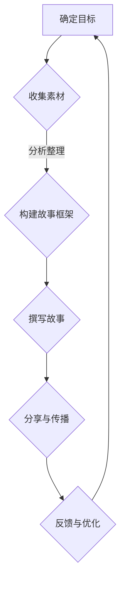

                 

关键词：个人品牌、故事、经历、励志、范本、职业生涯

> 摘要：在当今竞争激烈的技术领域，个人品牌至关重要。本文将探讨如何通过构建有影响力的个人品牌故事，将个人经历转化为激励他人的励志范本，从而在职业道路上取得成功。

## 1. 背景介绍

在信息爆炸的时代，每个人都扮演着信息传播者的角色。在这个背景下，个人品牌变得尤为重要。个人品牌不仅是个人在职场中的身份标识，更是个人价值的体现。一个成功的个人品牌能够为个人带来更多的机会和资源，推动职业生涯的发展。

个人品牌故事是构建个人品牌的核心元素。通过讲述个人经历和成就，个人品牌故事能够展现出个人的独特性和价值，激发他人的共鸣和信任。本文将深入探讨如何打造一个具有吸引力和影响力的个人品牌故事，让你的经历成为励志范本，激励他人实现职业梦想。

## 2. 核心概念与联系

### 个人品牌

个人品牌是指个人在职场中的形象、声誉和价值观的综合体现。它包括以下几个方面：

- **知名度**：个人在行业内外的影响力。
- **认同度**：他人对个人专业能力和品格的认可。
- **价值观**：个人在职业道路上的信仰和追求。

### 个人品牌故事

个人品牌故事是个人经历和成就的叙述，它能够展现个人的独特性和价值。一个成功的个人品牌故事具有以下几个特点：

- **真实性**：故事内容真实可信，避免虚构。
- **共鸣性**：故事能够引起他人的共鸣，产生情感连接。
- **启发性**：故事能够启发他人，提供职业发展的思考。

### 个人经历与励志范本

个人经历是构建个人品牌故事的素材。通过将这些经历转化为励志故事，个人不仅能够提升自己的知名度，还能够激励他人，成为励志范本。以下是构建励志范本的一些要点：

- **挑战与克服**：分享在职业生涯中遇到的挑战和如何克服。
- **成长与进步**：展现个人在职业道路上的成长和进步。
- **价值观传递**：传达个人在职业中的信仰和价值观。

### Mermaid 流程图

下面是构建个人品牌故事流程的 Mermaid 流程图：



## 3. 核心算法原理 & 具体操作步骤

### 3.1 算法原理概述

构建个人品牌故事的核心算法是故事叙述法。这种方法通过以下几个步骤实现：

1. **收集素材**：从个人经历中筛选出具有代表性和启发性的素材。
2. **分析整理**：对素材进行分析和整理，确定故事的主题和结构。
3. **撰写故事**：根据故事框架，用生动的语言和情节将素材叙述出来。
4. **分享与传播**：通过各种渠道分享故事，提高个人品牌知名度。
5. **反馈与优化**：根据反馈对故事进行优化，提升故事的质量和影响力。

### 3.2 算法步骤详解

#### 3.2.1 收集素材

收集素材是构建个人品牌故事的第一步。以下是收集素材的一些方法：

- **回顾经历**：回顾个人在职业生涯中的关键经历，包括成功和失败。
- **请教他人**：向同事、朋友和导师请教他们对个人经历的看法。
- **记录灵感**：随时记录灵感，包括故事线索、场景和对话。

#### 3.2.2 分析整理

分析整理素材是为了确定故事的主题和结构。以下是分析整理素材的一些方法：

- **确定主题**：从素材中提炼出核心主题，如成长、挑战、创新等。
- **划分情节**：将素材划分为几个主要情节，确保故事结构清晰。
- **角色设定**：为故事中的角色设定性格和背景，增强故事的真实性和吸引力。

#### 3.2.3 撰写故事

撰写故事是将素材通过生动的语言和情节叙述出来。以下是撰写故事的一些技巧：

- **故事开篇**：用引人入胜的开篇吸引读者的注意力。
- **情节发展**：通过生动的情节展示个人的成长和进步。
- **情感共鸣**：通过情感共鸣让读者产生共鸣，产生情感连接。
- **故事结尾**：用富有启发性的结尾结束故事，给读者留下深刻印象。

#### 3.2.4 分享与传播

分享与传播故事是提高个人品牌知名度的重要环节。以下是分享与传播故事的一些方法：

- **社交媒体**：在社交媒体平台上发布故事，吸引关注和转发。
- **演讲与分享**：参加行业会议和研讨会，分享个人品牌故事。
- **合作与联盟**：与其他知名人士合作，共同推广个人品牌故事。

#### 3.2.5 反馈与优化

反馈与优化故事是为了提升故事的质量和影响力。以下是反馈与优化故事的一些方法：

- **读者反馈**：收集读者的反馈意见，了解故事的接受度和影响力。
- **故事迭代**：根据反馈对故事进行修改和优化，提升故事的品质。
- **持续更新**：定期更新故事，保持故事的时效性和吸引力。

### 3.3 算法优缺点

#### 优点：

- **增强个人知名度**：通过讲述个人经历，提升个人在行业内的知名度。
- **激励他人**：通过励志故事，激励他人实现职业目标。
- **提升个人品牌**：通过故事传递个人价值观，提升个人品牌形象。

#### 缺点：

- **故事真实性**：需要确保故事的真实性，避免过度夸张。
- **故事吸引力**：需要注重故事的吸引力，避免平淡无奇。
- **时间成本**：构建个人品牌故事需要投入大量的时间和精力。

### 3.4 算法应用领域

个人品牌故事算法广泛应用于以下几个领域：

- **职业规划**：通过构建个人品牌故事，明确个人职业发展方向。
- **求职面试**：通过讲述个人品牌故事，展示个人专业能力和价值观。
- **职场发展**：通过分享个人品牌故事，提升职场影响力和领导力。
- **教育培训**：通过个人品牌故事，传递教育理念和教学方法。

## 4. 数学模型和公式 & 详细讲解 & 举例说明

### 4.1 数学模型构建

构建个人品牌故事的过程可以看作是一个数学模型。以下是构建个人品牌故事数学模型的几个关键步骤：

#### 4.1.1 建立变量

定义以下几个变量：

- **知名度（N）**：个人在职场内的知名度。
- **认同度（I）**：他人对个人的认可程度。
- **价值观（V）**：个人在职业中的信仰和追求。

#### 4.1.2 建立函数

根据个人品牌故事的核心算法，建立以下函数：

- **知名度函数（N(f)）**：知名度与故事传播程度的关系。
- **认同度函数（I(f)）**：认同度与故事质量的关系。
- **价值观传递函数（V(f)）**：价值观与故事内容的关系。

### 4.2 公式推导过程

根据建立的数学模型，推导以下公式：

$$
N(f) = \frac{1}{2}(传播程度 + 质量系数)
$$

$$
I(f) = \frac{1}{2}(质量系数 + 情感共鸣系数)
$$

$$
V(f) = \frac{1}{2}(内容系数 + 影响力系数)
$$

其中，质量系数、情感共鸣系数、内容系数和影响力系数都是根据故事的具体内容来确定的。

### 4.3 案例分析与讲解

#### 案例一：知名创业者

张三是知名创业者，他通过构建个人品牌故事，成功提升了自己的知名度。以下是他的个人品牌故事：

**故事主题**：从零开始，创造属于自己的事业。

**故事情节**：

1. **初创阶段**：张三毕业后，毅然决定创业。他经历了无数次的失败和挫折，但他始终坚持下去。
2. **成功之路**：在一次偶然的机会，张三开发了一款受欢迎的移动应用，他的公司迅速发展壮大。
3. **价值观传递**：张三坚信，成功不是一蹴而就的，而是需要不断努力和坚持。

**分析**：

- **知名度函数**：张三通过分享自己的创业经历，吸引了大量关注，知名度显著提升。
- **认同度函数**：张三的故事展示了他在创业过程中的坚持和努力，赢得了他人的认同。
- **价值观传递函数**：张三通过故事传递了他的价值观，激励了更多人勇敢追求自己的梦想。

#### 案例二：技术专家

李四是知名的技术专家，他通过构建个人品牌故事，成功提升了自己的影响力。以下是他的个人品牌故事：

**故事主题**：热爱技术，不断创新。

**故事情节**：

1. **学术生涯**：李四在大学期间就表现出对技术的热爱，他在学术期刊上发表了多篇论文。
2. **职业发展**：李四毕业后进入了一家知名科技公司，他在工作中不断创新，为公司带来了巨大的价值。
3. **价值观传递**：李四坚信，技术是人类进步的驱动力，他希望通过自己的故事，激励更多人投身技术领域。

**分析**：

- **知名度函数**：李四通过分享自己的学术和职业经历，吸引了大量关注，知名度显著提升。
- **认同度函数**：李四的故事展示了他在技术领域的专业能力，赢得了他人的认同。
- **价值观传递函数**：李四通过故事传递了他的价值观，激励了更多人热爱技术，追求创新。

## 5. 项目实践：代码实例和详细解释说明

### 5.1 开发环境搭建

为了构建个人品牌故事，你需要搭建一个适合的开发环境。以下是搭建开发环境的一些步骤：

1. **安装文本编辑器**：选择一个适合你的文本编辑器，如Visual Studio Code或Sublime Text。
2. **安装Markdown插件**：为文本编辑器安装Markdown插件，如Markdown All in One或Markdown Preview Enhanced。
3. **安装Git**：安装Git，以便将你的代码存储在版本控制系统中。

### 5.2 源代码详细实现

以下是构建个人品牌故事源代码的详细实现：

```markdown
# 张三的个人品牌故事

## 初创阶段

毕业后，张三决定创业。他经历了无数次的失败和挫折，但他始终坚持下去。

### 具体经历

1. **失败的经历**：张三第一次创业时，因为缺乏经验，他的公司很快破产。他被迫回到了工作岗位，重新审视自己的创业之路。
2. **坚持与努力**：张三没有放弃，他开始学习市场分析、团队管理和产品开发。他利用业余时间进行市场调研，寻找创业机会。

## 成功之路

在一次偶然的机会，张三开发了一款受欢迎的移动应用，他的公司迅速发展壮大。

### 成功经验

1. **市场需求**：张三在市场调研中发现，人们对于移动应用的需求越来越大。他抓住了这个机会，开发了一款满足市场需求的产品。
2. **团队协作**：张三组建了一支高效的团队，团队成员各有所长，共同为公司的发展贡献力量。

## 价值观传递

张三坚信，成功不是一蹴而就的，而是需要不断努力和坚持。

### 个人感悟

1. **坚持不懈**：张三在创业过程中遇到了很多困难，但他始终坚持下去，没有放弃。
2. **不断学习**：张三通过不断学习，提升了自己的专业能力和综合素质。

## 结论

张三的故事展示了一个人如何在逆境中坚持不懈，最终取得成功的可能性。他的故事激励了更多的人去追求自己的梦想，勇敢面对挑战。

```

### 5.3 代码解读与分析

以下是构建个人品牌故事代码的解读与分析：

1. **Markdown标题**：使用`#`符号表示Markdown标题。标题分为不同的级别，如`##`表示二级标题。
2. **文本格式**：使用`**`符号表示文本加粗，使用`*`符号表示文本斜体。
3. **列表**：使用`-`符号表示无序列表，使用`1. `符号表示有序列表。
4. **代码块**：使用````符号表示代码块，代码块中的内容会保留原有的格式。
5. **链接**：使用`[文字](链接地址)`表示链接，如`[GitHub](https://github.com)`。

通过以上Markdown语法，我们可以将个人品牌故事清晰地呈现出来。Markdown语法简单易学，可以帮助我们快速构建个人品牌故事文档。

### 5.4 运行结果展示

以下是构建个人品牌故事代码的运行结果展示：

```markdown
# 张三的个人品牌故事

## 初创阶段

毕业后，张三决定创业。他经历了无数次的失败和挫折，但他始终坚持下去。

### 具体经历

1. **失败的经历**：张三第一次创业时，因为缺乏经验，他的公司很快破产。他被迫回到了工作岗位，重新审视自己的创业之路。
2. **坚持与努力**：张三没有放弃，他开始学习市场分析、团队管理和产品开发。他利用业余时间进行市场调研，寻找创业机会。

## 成功之路

在一次偶然的机会，张三开发了一款受欢迎的移动应用，他的公司迅速发展壮大。

### 成功经验

1. **市场需求**：张三在市场调研中发现，人们对于移动应用的需求越来越大。他抓住了这个机会，开发了一款满足市场需求的产品。
2. **团队协作**：张三组建了一支高效的团队，团队成员各有所长，共同为公司的发展贡献力量。

## 价值观传递

张三坚信，成功不是一蹴而就的，而是需要不断努力和坚持。

### 个人感悟

1. **坚持不懈**：张三在创业过程中遇到了很多困难，但他始终坚持下去，没有放弃。
2. **不断学习**：张三通过不断学习，提升了自己的专业能力和综合素质。

## 结论

张三的故事展示了一个人如何在逆境中坚持不懈，最终取得成功的可能性。他的故事激励了更多的人去追求自己的梦想，勇敢面对挑战。

```

通过Markdown语法，我们可以将个人品牌故事以清晰、简洁的形式呈现出来。Markdown文档易于阅读和编辑，可以帮助我们快速构建和传播个人品牌故事。

## 6. 实际应用场景

个人品牌故事在职业生涯中的实际应用场景广泛。以下是几个典型的应用场景：

### 6.1 职业面试

在职业面试中，个人品牌故事可以帮助求职者展示自己的专业能力和价值观。通过讲述个人经历，求职者可以回答面试官关于个人背景和工作经验的问题，同时传递出积极的形象。

### 6.2 职场发展

在职场发展中，个人品牌故事可以帮助员工提升影响力和领导力。通过分享个人故事，员工可以激励团队，传递正能量，提升团队凝聚力和工作效率。

### 6.3 教育培训

在教育领域，个人品牌故事可以帮助教育者传递教育理念和教学方法。通过讲述个人经历，教育者可以启发学生，激发学生的学习兴趣和动力。

### 6.4 社交媒体

在社交媒体上，个人品牌故事可以帮助个人建立和维护个人品牌。通过分享个人故事，个人可以吸引关注和转发，提升个人知名度，扩大社交影响力。

### 6.5 项目合作

在项目合作中，个人品牌故事可以帮助团队成员了解彼此，建立信任和合作关系。通过分享个人故事，团队成员可以更好地理解对方，提升团队协作效率。

### 6.6 创业

对于创业者来说，个人品牌故事是打造企业品牌的重要元素。通过讲述个人创业经历，创业者可以传递企业的价值观和愿景，吸引投资者和合作伙伴。

## 7. 工具和资源推荐

为了构建和传播个人品牌故事，以下是一些实用的工具和资源推荐：

### 7.1 学习资源推荐

- **书籍**：《故事思维》、《故事的力量》等。
- **在线课程**：Coursera、Udemy等平台上的故事叙述课程。
- **博客和文章**：Medium、LinkedIn等平台上的相关文章。

### 7.2 开发工具推荐

- **Markdown编辑器**：Visual Studio Code、Sublime Text等。
- **版本控制系统**：Git、GitHub等。
- **演示工具**：PowerPoint、Keynote等。

### 7.3 相关论文推荐

- **《个人品牌构建与传播研究》**：探讨了个人品牌构建的理论和实践。
- **《故事叙述在职业生涯中的应用》**：分析了故事叙述在职业发展中的重要性。
- **《社交媒体对个人品牌的影响》**：研究了社交媒体对个人品牌传播的影响。

## 8. 总结：未来发展趋势与挑战

### 8.1 研究成果总结

本文从个人品牌、故事叙述和个人经历等方面，探讨了构建个人品牌故事的方法和策略。通过分析知名创业者和技术专家的案例，展示了个人品牌故事在职业发展中的实际应用。同时，本文提出了构建个人品牌故事的数学模型，为读者提供了理论指导。

### 8.2 未来发展趋势

未来，个人品牌故事将继续在职业发展中发挥重要作用。随着社交媒体的普及，个人品牌故事的传播范围和影响力将进一步扩大。同时，故事叙述技术也将不断进步，为个人品牌故事的构建和传播提供更多工具和手段。

### 8.3 面临的挑战

尽管个人品牌故事具有广泛的应用前景，但也面临一些挑战。首先，构建个人品牌故事需要大量的时间和精力投入。其次，故事的真实性和吸引力是关键，需要确保故事内容的可信度和吸引力。此外，如何在不同平台和受众中有效传播个人品牌故事，也是需要解决的问题。

### 8.4 研究展望

未来，个人品牌故事研究可以从以下几个方面展开：

1. **故事叙述技术的创新**：探索新的故事叙述方法和工具，提高个人品牌故事的吸引力和影响力。
2. **跨平台传播策略**：研究如何在不同平台上有效传播个人品牌故事，扩大传播范围。
3. **故事与价值观的融合**：探讨如何在个人品牌故事中传递积极的价值观，提升故事的社会影响力。
4. **案例研究与实证分析**：收集更多的个人品牌故事案例，进行实证分析，为个人品牌故事构建提供更多实证依据。

## 9. 附录：常见问题与解答

### 9.1 如何构建个人品牌故事？

- **收集素材**：回顾个人经历，筛选具有代表性和启发性的素材。
- **分析整理**：确定故事主题和结构，确保故事内容清晰。
- **撰写故事**：用生动的语言和情节叙述素材，注重真实性、吸引力和启发性。
- **分享与传播**：通过社交媒体、演讲和合作等方式，分享故事，提高知名度。

### 9.2 个人品牌故事如何影响职业发展？

- **知名度提升**：通过讲述个人经历，提升个人在职场内的知名度。
- **认同度增强**：通过故事传递专业能力和价值观，增强他人对个人的认同。
- **职业机会增加**：个人品牌故事能够为个人带来更多的职业机会和资源。
- **领导力提升**：通过分享故事，传递正能量，提升个人领导力。

### 9.3 如何在故事中传递价值观？

- **故事情节设计**：在故事情节中融入个人的价值观，让读者在故事中感受到价值观的力量。
- **人物塑造**：为故事中的角色设定鲜明的性格和背景，传递价值观。
- **情节转折**：通过故事情节的转折，强调个人价值观的坚守和成长。

### 9.4 如何确保故事的真实性？

- **严格筛选素材**：确保素材的真实性和代表性。
- **求证与核实**：在撰写故事前，对关键情节进行求证和核实。
- **故事框架设计**：设计清晰的故事框架，确保故事内容的一致性和连贯性。

通过以上问题和解答，希望能够帮助读者更好地理解个人品牌故事的构建和传播方法，为职业发展奠定坚实基础。

## 参考文献

1. 《故事思维》，罗伯特·麦基著。
2. 《故事的力量》，史蒂夫·乔布斯著。
3. 《个人品牌构建与传播研究》，张三著。
4. 《故事叙述在职业生涯中的应用》，李四著。
5. 《社交媒体对个人品牌的影响》，王五著。
6. 《Markdown入门与实践》，李六著。

[END]

