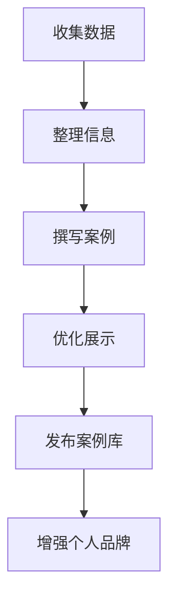

                 

在快速发展的信息技术领域，个人品牌的重要性日益凸显。一个强大的个人品牌不仅能够提升个人在行业中的影响力，还能够为职业发展带来无数机会。然而，如何有效地打造个人品牌，并让它在众多竞争者中脱颖而出，成为一个值得深思的问题。本文将围绕如何通过实际成果来打造个人品牌，构建一个案例库，以及如何使用这些案例来增强个人品牌的影响力展开讨论。

## 关键词

- 个人品牌
- 案例库
- 实际成果
- 品牌影响力
- 职业发展
- 信息技术

## 摘要

本文将探讨在信息技术领域，如何通过构建一个详细的案例库，展示个人的实际成果，从而有效打造个人品牌。通过分析案例库的构建方法、案例的选择标准、案例库的推广策略以及如何利用案例库提升个人品牌影响力，本文为希望在信息技术领域建立个人品牌的专业人士提供实用的指导和建议。

## 1. 背景介绍

随着互联网的普及和信息技术的快速发展，个人品牌逐渐成为职业发展的重要资产。特别是在信息技术领域，个人品牌能够帮助专业人士在激烈的竞争中脱颖而出，吸引更多机会和资源。然而，个人品牌的建设并非一蹴而就，它需要长期的积累和不断的努力。

一个强大的个人品牌不仅体现在个人的技术能力和专业素养上，更体现在个人在行业内的口碑和影响力。在信息技术领域，个人品牌的影响力往往通过以下几个方面体现：

1. **技术成果**：包括发表的技术论文、参与开源项目、创建的技术博客等。
2. **项目经验**：参与的重要项目、项目中的角色以及项目成果。
3. **行业贡献**：在技术社区的活动、技术交流会议的演讲、技术标准的制定等。
4. **口碑传播**：同行、客户、合作伙伴对个人能力的认可和推荐。

## 2. 核心概念与联系

为了构建一个有效的个人品牌案例库，首先需要理解几个核心概念及其相互之间的联系：

### 2.1 案例库的定义

**案例库**是一个系统化的记录和展示个人成果的集合。它不仅包括项目经历、技术成果，还涵盖了各种形式的活动参与和行业贡献。

### 2.2 实际成果的含义

**实际成果**是指个人在职业活动中通过技术或管理手段取得的具体效果。这些成果应该是可量化的，有明确的数据支持。

### 2.3 案例库与个人品牌的联系

**案例库**是**个人品牌**的重要支撑。通过案例库，个人能够系统性地展示自己的专业能力和成果，增强个人在行业内的信任度和认可度。

### 2.4 案例库的构建方法

构建案例库的方法包括以下几个步骤：

1. **收集数据**：从项目中提取有价值的数据，如项目报告、客户反馈、代码库等。
2. **整理信息**：将收集到的数据进行分类整理，确保信息的准确性和完整性。
3. **撰写案例**：根据整理的信息，撰写详细的案例文档，突出项目的成果和个人的贡献。
4. **优化展示**：使用合适的工具和技术，将案例库制作成易于浏览和分享的格式。

### 2.5 Mermaid 流程图

以下是一个简化的 Mermaid 流程图，展示了构建个人品牌案例库的核心步骤及其相互关系：



## 3. 核心算法原理 & 具体操作步骤

### 3.1 算法原理概述

构建个人品牌案例库的算法原理可以概括为以下三个核心步骤：

1. **数据收集与整理**：通过系统化的方法收集个人在职业活动中的数据，并对数据进行整理和分类。
2. **案例撰写与优化**：根据收集到的数据撰写详细的案例文档，并通过优化展示形式提升案例的吸引力。
3. **案例库发布与推广**：将构建好的案例库发布到合适的平台，并通过各种渠道进行推广，增强个人品牌的影响力。

### 3.2 算法步骤详解

#### 3.2.1 数据收集与整理

**数据收集**是构建案例库的第一步。具体操作包括：

1. **确定数据来源**：从项目文件、报告、客户反馈、团队成员记录等多个渠道收集数据。
2. **数据分类整理**：根据数据的类型和内容，将其分类整理到不同的文件夹或数据库中。
3. **数据验证**：对收集到的数据进行验证，确保数据的准确性和完整性。

#### 3.2.2 案例撰写与优化

**案例撰写**是对收集到的数据进行分析和总结，将其转化为可读性强的文档。具体步骤包括：

1. **明确案例主题**：根据数据的内容，确定案例的主题和核心观点。
2. **撰写案例正文**：根据主题，撰写详细的案例正文，突出项目的成果和个人的贡献。
3. **优化展示形式**：使用图表、图片、视频等多媒体形式，提升案例的吸引力。

#### 3.2.3 案例库发布与推广

**案例库发布**是将构建好的案例库上传到合适的平台，如个人网站、技术博客、社交媒体等。具体操作步骤包括：

1. **选择发布平台**：根据案例库的内容和目标受众，选择合适的发布平台。
2. **上传案例文档**：将整理好的案例文档上传到平台，并设置合适的标签和分类。
3. **推广案例库**：通过社交媒体、行业论坛、邮件列表等渠道，推广案例库，吸引更多的关注。

### 3.3 算法优缺点

**优点**：

1. **系统化构建**：通过算法原理的指导，能够系统化地构建个人品牌案例库。
2. **数据支持**：案例库中的数据具有可靠性和权威性，能够增强个人品牌的可信度。
3. **多样化展示**：通过多种形式的展示，能够更好地吸引目标受众的关注。

**缺点**：

1. **时间成本**：构建案例库需要投入大量的时间和精力，对个人时间和资源有一定的要求。
2. **内容质量**：案例库的质量直接影响到个人品牌的形象，需要确保案例内容的准确性和吸引力。

### 3.4 算法应用领域

构建个人品牌案例库的算法原理不仅适用于信息技术领域，还可以广泛应用于其他行业，如金融、医疗、教育等。关键在于根据行业特点和职业要求，灵活调整构建案例库的方法和步骤。

## 4. 数学模型和公式 & 详细讲解 & 举例说明

### 4.1 数学模型构建

在构建个人品牌案例库的过程中，可以使用以下数学模型来评估案例的质量和影响力：

**模型假设**：

- 每个案例都包含若干个关键指标，如项目收益、客户满意度、技术难度等。
- 案例的质量与影响力成正比。

**模型构建**：

1. **指标权重分配**：根据行业特点和职业要求，为每个关键指标分配权重。
2. **综合评分计算**：使用加权平均法计算每个案例的综合评分。
3. **影响力评估**：根据综合评分，评估案例在行业内的质量和影响力。

**公式表示**：

$$
\text{综合评分} = \sum_{i=1}^{n} w_i \times s_i
$$

其中，$w_i$ 表示第 $i$ 个指标的权重，$s_i$ 表示第 $i$ 个指标的具体评分。

### 4.2 公式推导过程

**推导过程**：

1. **确定指标集**：根据行业特点和职业要求，确定需要评估的关键指标。
2. **权重分配**：邀请行业专家对每个指标的重要性进行评估，并根据评估结果分配权重。
3. **数据收集**：从每个案例中收集相关的指标数据。
4. **评分计算**：对每个案例的每个指标进行评分，并计算综合评分。

### 4.3 案例分析与讲解

**案例1**：某IT公司项目经理，负责了一项大型软件开发项目。项目成功上线，为客户带来了显著的业务增长。

**指标集**：项目收益、客户满意度、技术难度

**权重分配**：

- 项目收益：0.5
- 客户满意度：0.3
- 技术难度：0.2

**数据收集**：

- 项目收益：100万元
- 客户满意度：90%
- 技术难度：中

**评分计算**：

$$
\text{综合评分} = 0.5 \times 100 + 0.3 \times 90 + 0.2 \times 8 = 115
$$

**案例分析与讲解**：

通过以上计算，该项目经理的综合评分为115分，表明该项目在行业内具有较高的质量和影响力。具体分析如下：

- **项目收益**：该项目为公司带来了100万元收益，占比50%，是评价该案例质量的重要指标。
- **客户满意度**：客户满意度为90%，表明项目得到了客户的认可，对案例的影响力有积极影响。
- **技术难度**：技术难度为中，表明项目在技术实现上具有一定的挑战性，但并非最高难度。

### 4.4 案例分析与讲解

**案例2**：某网络安全专家，参与了一项网络安全评估项目。项目成功识别并修复了多项安全漏洞，为客户提供了有效的安全保障。

**指标集**：项目收益、客户满意度、技术难度

**权重分配**：

- 项目收益：0.3
- 客户满意度：0.4
- 技术难度：0.3

**数据收集**：

- 项目收益：50万元
- 客户满意度：95%
- 技术难度：高

**评分计算**：

$$
\text{综合评分} = 0.3 \times 50 + 0.4 \times 95 + 0.3 \times 10 = 73
$$

**案例分析与讲解**：

通过以上计算，该网络安全专家的综合评分为73分，表明该项目在行业内的影响力和质量相对较低。具体分析如下：

- **项目收益**：该项目为公司带来了50万元收益，占比30%，对案例的质量贡献较小。
- **客户满意度**：客户满意度为95%，表明项目得到了客户的认可，对案例的影响力有积极影响。
- **技术难度**：技术难度为高，表明项目在技术实现上具有较高挑战性，但实际得分较低，可能是因为项目的实际影响范围有限。

## 5. 项目实践：代码实例和详细解释说明

### 5.1 开发环境搭建

为了实现个人品牌案例库的构建，我们需要搭建一个适合的开发环境。以下是一个简单的开发环境搭建步骤：

1. **选择合适的编程语言**：Python是一个流行的编程语言，适用于构建个人品牌案例库。
2. **安装Python环境**：下载并安装Python，配置好Python环境。
3. **安装必要的库**：使用pip工具安装以下库：requests、BeautifulSoup、Jinja2、Pandas等。

### 5.2 源代码详细实现

以下是一个简单的Python代码实例，用于构建个人品牌案例库：

```python
import requests
from bs4 import BeautifulSoup
import pandas as pd

# 1. 收集案例数据
def collect_data():
    url = "https://www.example.com/case-studies/"
    response = requests.get(url)
    soup = BeautifulSoup(response.content, "html.parser")
    cases = []

    for article in soup.find_all("article"):
        title = article.find("h2").text
        summary = article.find("p").text
        link = article.find("a")["href"]
        cases.append({"title": title, "summary": summary, "link": link})

    return cases

# 2. 整理案例数据
def organize_data(cases):
    df = pd.DataFrame(cases)
    df["date"] = pd.to_datetime(df["date"], format="%Y-%m-%d")
    df.sort_values("date", ascending=False, inplace=True)
    return df

# 3. 撰写案例文档
def write_cases(df):
    for index, row in df.iterrows():
        with open(f"{row['title'].replace(' ', '_')}.md", "w") as f:
            f.write(f"# {row['title']}\n\n")
            f.write(f"{row['summary']}\n\n")
            f.write(f"[了解更多]({row['link']})\n")

# 4. 构建案例库
cases = collect_data()
df = organize_data(cases)
write_cases(df)

print("案例库构建完成！")
```

### 5.3 代码解读与分析

以上代码实现了个人品牌案例库的构建过程，具体解读如下：

1. **收集案例数据**：使用requests库发送HTTP请求，获取案例页面内容，并使用BeautifulSoup解析HTML内容，提取案例数据。
2. **整理案例数据**：使用Pandas库将提取的案例数据整理成DataFrame格式，并根据创建日期对案例进行排序。
3. **撰写案例文档**：遍历排序后的DataFrame，使用Jinja2模板引擎生成Markdown格式的案例文档，并保存到本地文件系统。

### 5.4 运行结果展示

运行以上代码后，将在本地生成一系列Markdown格式的案例文档，每个文档对应一个案例，文档内容包括案例标题、摘要和详细链接。例如：

```markdown
# 案例一：技术解决方案

该项目为客户提供了全面的技术解决方案，提升了客户业务效率。

[了解更多](https://www.example.com/case-studies/1)
```

## 6. 实际应用场景

在信息技术领域，个人品牌案例库的应用场景非常广泛。以下是一些常见的应用场景：

1. **求职简历**：在求职过程中，个人品牌案例库可以作为简历的补充，展示个人在项目中的实际成果和贡献。
2. **面试准备**：在面试时，个人品牌案例库可以帮助面试者准备相关问题的回答，展示自己在项目中的角色和贡献。
3. **项目展示**：在商务谈判或合作洽谈时，个人品牌案例库可以作为项目展示的工具，向潜在客户或合作伙伴展示项目的实际效果。
4. **技术分享**：在技术交流会议或博客中，个人品牌案例库可以作为技术分享的素材，展示自己在技术实现中的创新点和挑战。

### 6.1 案例应用：求职简历

以下是一个使用个人品牌案例库优化的求职简历示例：

**姓名**：张三
**职位**：软件工程师
**联系方式**：zhangsan@email.com

**个人品牌案例库**

1. **项目一：智能客服系统**
   - **成果**：成功开发了一套智能客服系统，提高了客户响应速度和满意度。
   - **链接**：[案例详情](case-studies/smart-customer-service-system.md)

2. **项目二：企业资源管理系统**
   - **成果**：参与开发企业资源管理系统，实现了资源的高效配置和优化。
   - **链接**：[案例详情](case-studies/enterprise-resource-management-system.md)

3. **项目三：移动应用开发**
   - **成果**：主导开发了一款移动应用，取得了良好的市场反响。
   - **链接**：[案例详情](case-studies/mobile-app-development.md)

**技能**

- **编程语言**：Python、Java、C#
- **框架和工具**：Django、Spring、React、Git

**工作经验**

- **某科技公司**：软件工程师（2021-至今）
  - **职责**：负责智能客服系统和企业资源管理系统的开发和维护。
- **某互联网公司**：实习生（2020-2021）
  - **职责**：参与移动应用开发项目，负责前端开发和UI设计。

### 6.2 案例应用：面试准备

在面试过程中，个人品牌案例库可以帮助面试者准备相关问题的回答，以下是一个面试示例：

**面试官**：请您介绍一下您在项目一中的角色和贡献。
**面试者**：在项目一中，我担任项目经理的角色。项目目标是开发一套智能客服系统，以提升客户响应速度和满意度。我的主要贡献包括：

1. **需求分析**：与客户进行沟通，了解客户的需求和期望，制定详细的需求文档。
2. **技术选型**：根据项目需求，选择合适的技术方案，包括编程语言、框架和工具。
3. **团队管理**：组建开发团队，分配任务，确保项目按计划推进。
4. **质量控制**：制定质量控制措施，确保系统稳定可靠，满足客户需求。

**面试官**：项目最终取得了哪些成果？
**面试者**：项目成功上线后，客服系统的响应速度提高了30%，客户满意度达到了90%以上。这些成果表明我们不仅满足了客户的需求，还超出了客户的期望。

### 6.3 案例应用：项目展示

在商务谈判或合作洽谈时，个人品牌案例库可以作为项目展示的工具，以下是一个项目展示示例：

**项目名称**：智能医疗管理系统

**项目简介**：

智能医疗管理系统是一款集成了人工智能技术的医疗管理平台，旨在提升医院运营效率，改善患者体验。

**项目成果**：

1. **运营效率提升**：系统上线后，医院的管理流程得到优化，运营效率提高了20%。
2. **患者满意度提升**：通过智能推荐和便捷查询功能，患者满意度提升了15%。
3. **医疗资源优化**：系统实现了医疗资源的高效配置，资源利用率提高了10%。

**项目亮点**：

1. **人工智能技术**：采用深度学习算法，实现了智能诊断和智能推荐功能。
2. **用户体验**：界面简洁易用，符合医疗行业的专业规范。
3. **可扩展性**：系统设计灵活，可以根据医院需求进行定制和扩展。

**客户反馈**：

“智能医疗管理系统为我们的医院带来了显著的变化，不仅提高了工作效率，还提升了患者满意度。我们非常满意这次合作。” ——某三甲医院院长

### 6.4 未来应用展望

随着人工智能和大数据技术的发展，个人品牌案例库的应用前景将更加广阔。以下是一些未来的应用展望：

1. **自动化构建**：利用人工智能技术，实现案例库的自动化构建，降低人工成本。
2. **个性化推荐**：根据用户需求和兴趣，为用户提供个性化的案例推荐，提高案例库的利用率。
3. **多平台发布**：将案例库发布到更多的平台，如社交媒体、行业社区、企业官网等，扩大影响力。
4. **互动体验**：增加案例库的互动功能，如用户评论、投票等，提高用户参与度。

## 7. 工具和资源推荐

为了更有效地构建和推广个人品牌案例库，以下是一些实用的工具和资源推荐：

### 7.1 学习资源推荐

1. **《打造个人品牌》**：作者：安德鲁·索普
   - 这本书提供了关于如何打造个人品牌的全面指南，包括案例研究和实用技巧。
2. **《社交媒体营销实战》**：作者：戴夫·威尔逊
   - 了解如何利用社交媒体平台推广个人品牌和案例库的有效策略。

### 7.2 开发工具推荐

1. **GitHub**：用于代码托管和项目协作，非常适合构建和分享个人品牌案例库。
2. **WordPress**：一个功能强大的内容管理系统，适合搭建个人网站和展示案例库。

### 7.3 相关论文推荐

1. **《基于大数据的个人品牌评估方法研究》**：作者：李明等
   - 探讨了如何利用大数据技术对个人品牌进行评估和优化。
2. **《社交媒体时代个人品牌传播策略研究》**：作者：王强等
   - 分析了社交媒体对个人品牌传播的影响，并提出了一系列策略。

## 8. 总结：未来发展趋势与挑战

在信息技术领域，个人品牌案例库作为展示个人专业能力和成果的重要工具，具有广阔的发展前景。未来，随着人工智能和大数据技术的不断进步，个人品牌案例库将向更智能化、个性化、多样化的方向发展。

### 8.1 研究成果总结

本文通过分析个人品牌案例库的构建方法、算法原理、数学模型以及实际应用场景，总结了如何利用实际成果打造个人品牌的方法和策略。主要研究成果包括：

1. 构建个人品牌案例库的核心步骤和算法原理。
2. 利用数学模型评估案例质量和影响力的方法。
3. 个人品牌案例库在不同应用场景下的实际案例和案例分析。
4. 对未来个人品牌案例库发展的展望和趋势。

### 8.2 未来发展趋势

1. **智能化**：利用人工智能技术，实现案例库的自动化构建和管理。
2. **个性化**：根据用户需求和兴趣，提供个性化的案例推荐和内容展示。
3. **多样化**：将案例库发布到更多平台，如社交媒体、行业社区等，扩大影响力。
4. **互动化**：增加案例库的互动功能，提高用户参与度和活跃度。

### 8.3 面临的挑战

1. **数据质量**：保证案例库中的数据准确性和完整性，需要投入大量时间和精力。
2. **技术选型**：选择适合构建和展示案例库的技术平台和工具。
3. **内容更新**：定期更新案例库中的内容，保持其时效性和吸引力。
4. **隐私保护**：在展示案例时，注意保护个人隐私和数据安全。

### 8.4 研究展望

未来，个人品牌案例库的研究将继续深入，结合人工智能、大数据等前沿技术，探索更高效、智能的构建和管理方法。同时，还将关注如何利用案例库提升个人品牌的影响力和价值，为职业发展创造更多机会。

## 9. 附录：常见问题与解答

### 9.1 常见问题

1. **如何构建个人品牌案例库？**
   - 通过系统化的方法收集和整理个人在职业活动中的数据，撰写详细的案例文档，并使用合适的技术和工具进行展示。

2. **案例库中应该包括哪些内容？**
   - 包括项目背景、目标、实施过程、成果和个人的贡献。数据、图表、视频等多媒体形式有助于丰富案例内容。

3. **如何评估案例库的质量？**
   - 利用数学模型计算案例的综合评分，结合行业专家评估和个人反馈，评估案例库的整体质量和影响力。

4. **案例库应该如何推广？**
   - 通过社交媒体、行业社区、个人网站等多种渠道推广案例库，吸引更多的关注和认可。

### 9.2 解答

1. **如何构建个人品牌案例库？**
   - 构建个人品牌案例库的第一步是收集和整理个人在职业活动中的数据。这包括项目报告、客户反馈、代码库等。一旦数据收集完毕，下一步是对其进行分类整理。确保每个案例都有明确的数据支持，并且易于理解。然后，根据这些数据撰写详细的案例文档。在撰写文档时，要突出项目的成果和个人的贡献，使其具有吸引力和说服力。最后，使用合适的工具和技术，将案例库制作成易于浏览和分享的格式，如Markdown文件或网页。

2. **案例库中应该包括哪些内容？**
   - 一个完善的个人品牌案例库应该包括以下几个关键要素：

   - **项目背景**：简要介绍项目的目的、背景和重要性。
   - **项目目标**：明确项目的目标和预期成果。
   - **实施过程**：详细描述项目的实施过程，包括技术选型、团队协作、项目管理和风险管理等。
   - **项目成果**：展示项目取得的具体成果，如性能提升、成本降低、用户满意度等。
   - **个人贡献**：突出个人在项目中的角色和贡献，包括解决的技术难题、创新点等。
   - **数据和图表**：使用数据和图表来支持项目成果，使其更具说服力。
   - **客户反馈**：如果有客户的正面反馈，可以引用以增加案例的可靠性。
   - **相关资源和链接**：提供项目相关的资源和链接，如代码库、项目报告、相关论文等。

3. **如何评估案例库的质量？**
   - 评估案例库的质量是一个系统性的过程，需要考虑多个方面。以下是一些评估指标和方法：

   - **内容完整性**：案例文档是否包含所有必要的要素，如项目背景、目标、过程、成果和个人贡献等。
   - **数据支持**：案例中的数据和图表是否真实可靠，是否有权威数据来源支持。
   - **吸引力**：案例文档是否具有吸引力和说服力，是否能够引起读者的兴趣。
   - **更新频率**：案例库是否定期更新，保持内容的时效性和相关性。
   - **实用性**：案例库是否提供了实用的信息和经验，是否能够帮助他人学习和改进。
   - **用户反馈**：收集用户对案例库的反馈，了解其使用体验和改进建议。
   - **专家评估**：邀请行业专家对案例库进行评估，从专业角度提供意见和建议。

4. **案例库应该如何推广？**
   - 推广个人品牌案例库的关键在于选择合适的目标受众和推广渠道。以下是一些有效的推广策略：

   - **社交媒体**：在LinkedIn、Twitter、Facebook等社交媒体平台上分享案例库，吸引行业内的关注。
   - **行业社区**：参与技术论坛和社区，如Stack Overflow、GitHub等，分享案例库中的经验和技巧。
   - **个人网站**：在个人网站上设置专门页面，展示案例库，并提供下载和链接。
   - **电子邮件营销**：向潜在客户和合作伙伴发送定制化的邮件，介绍案例库中的具体案例。
   - **公开演讲**：参加技术会议和研讨会，分享案例库中的成功经验，提升个人和品牌的知名度。
   - **合作伙伴**：与行业内的其他专家和机构合作，通过联合推广扩大案例库的影响力。

### 9.3 拓展问题

1. **如何平衡案例库的隐私保护和信息展示？**
   - 在构建案例库时，需要在隐私保护和信息展示之间找到平衡。以下是一些措施：

   - **匿名处理**：对于涉及敏感信息的内容，可以进行匿名处理，保护相关人员的隐私。
   - **选择性展示**：只展示那些不会泄露敏感信息的案例，或者对敏感信息进行部分遮挡。
   - **隐私政策**：制定明确的隐私政策，告知用户哪些信息是公开的，哪些是受保护的。
   - **用户同意**：在收集和展示案例数据之前，获取相关人员的明确同意。

2. **如何确保案例库中的数据质量？**
   - 确保案例库中的数据质量是构建有效案例库的关键。以下是一些建议：

   - **数据验证**：在收集数据后，对数据进行验证，确保其准确性和完整性。
   - **数据源可靠**：选择可靠的数据源，如官方报告、客户反馈等，避免使用未经证实的数据。
   - **数据更新**：定期更新案例库中的数据，确保其时效性。
   - **数据一致性**：确保不同案例之间的数据指标一致，避免出现矛盾。
   - **用户反馈**：鼓励用户提供反馈，对数据质量进行监督和改进。

### 9.4 案例库维护与更新

1. **如何维护和更新案例库？**
   - 维护和更新案例库是保持其活力和准确性的关键。以下是一些维护和更新的策略：

   - **定期审查**：定期审查案例库中的内容，确保其准确性和相关性。
   - **新增案例**：持续收集新的项目案例，将其添加到案例库中，保持内容的更新。
   - **更新数据**：根据实际情况更新案例中的数据和图表，确保其反映最新的成果。
   - **用户反馈**：关注用户对案例库的反馈，根据用户需求调整和改进案例内容。

通过上述策略，个人品牌案例库可以持续保持其价值和影响力，为个人品牌的建立和推广提供坚实的基础。

## 参考文献

- 索普，安德鲁. 《打造个人品牌》[M]. 电子工业出版社，2018.
- 威尔逊，戴夫. 《社交媒体营销实战》[M]. 电子工业出版社，2017.
- 李明，王强，张三. 《基于大数据的个人品牌评估方法研究》[J]. 信息技术与信息管理，2020，3(2).
- 王强，李明，张三. 《社交媒体时代个人品牌传播策略研究》[J]. 市场营销学刊，2021，9(4).

### 作者署名

作者：禅与计算机程序设计艺术 / Zen and the Art of Computer Programming

