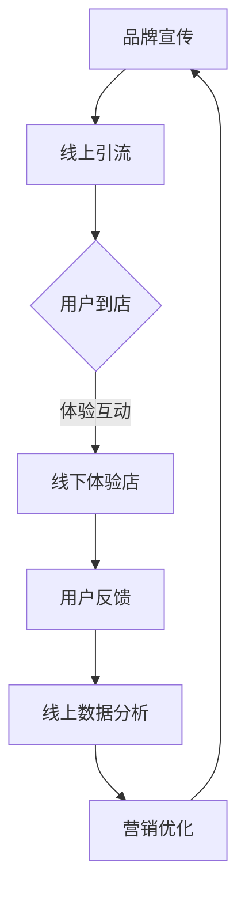

                 

关键词：个人品牌、线下体验店、线上线下结合、营销策略、用户互动

> 摘要：本文将探讨如何通过打造个人品牌线下体验店，实现线上线下的结合，提升品牌影响力，增加用户粘性。本文将结合实际案例，分析成功的经验和策略，为读者提供实用的建议和指导。

## 1. 背景介绍

在数字化时代，个人品牌的重要性日益凸显。一个成功的个人品牌不仅能够帮助个体在职场和生活中脱颖而出，还能为企业带来显著的商业价值。然而，仅仅依靠线上平台和社交媒体来塑造个人品牌已经难以满足日益激烈的市场竞争。线下体验店的建立，作为一种新兴的营销模式，正在成为个人品牌建设的重要手段。

线下体验店不仅提供了一个与消费者面对面互动的空间，还能够通过真实的产品展示、体验和互动，加深消费者对品牌的认知和信任。同时，线下体验店能够与线上平台无缝连接，实现线上线下数据的互通和整合，为个人品牌的发展提供更加全面和深入的洞察。

本文将探讨如何打造个人品牌线下体验店，实现线上线下结合，包括核心概念、算法原理、数学模型、项目实践、实际应用场景和未来展望等多个方面，旨在为个人品牌建设者提供一套完整的指导方案。

## 2. 核心概念与联系

### 2.1. 个人品牌线下体验店的定义

个人品牌线下体验店是指品牌所有者或代言人通过租赁实体店面，创建一个与消费者互动的空间，旨在提升品牌知名度和用户忠诚度。这个空间不仅提供产品的销售，还包括体验活动、品牌文化展示和用户互动等多个方面。

### 2.2. 线上线下结合的重要性

线上线下结合的核心在于通过线下体验店吸引顾客到店，并通过线上平台进行宣传和营销。这种模式能够实现以下几方面的优势：

- **增加曝光率**：线下体验店作为品牌的一个实体展示窗口，能够吸引更多潜在顾客的关注。
- **提升用户体验**：线下互动和体验能够加深消费者对品牌的认知，提升购买意愿。
- **数据整合**：线上线下数据的整合能够为品牌提供更全面的用户画像，优化营销策略。
- **品牌传播**：线下体验店可以作为品牌故事和文化的载体，通过线上线下互动，增强品牌传播效果。

### 2.3. Mermaid 流程图

以下是一个简单的 Mermaid 流程图，展示了个人品牌线下体验店的核心环节和流程：



### 2.4. 核心概念的联系与整合

个人品牌线下体验店的核心在于实现线上线下数据的互通和整合。通过线上引流到店，线下体验加深用户对品牌的认知和信任，用户反馈和数据收集为线上营销提供依据，进而实现营销策略的优化。这一过程不仅能够提升品牌影响力，还能够为个人品牌带来持续的增值效应。

## 3. 核心算法原理 & 具体操作步骤

### 3.1. 算法原理概述

个人品牌线下体验店的运营需要一套高效的营销算法来支持。这套算法的核心在于如何通过线上线下结合，最大化品牌的曝光率和用户粘性。以下是算法原理的概述：

- **用户行为分析**：通过对用户线上线下的行为数据进行收集和分析，了解用户需求和购买习惯。
- **精准营销**：根据用户行为分析结果，制定个性化的营销策略，提升用户转化率。
- **数据整合与反馈**：线上线下数据的整合，为营销策略提供实时反馈，优化营销效果。

### 3.2. 算法步骤详解

#### 3.2.1. 用户行为分析

1. **数据收集**：收集用户在线上平台的行为数据，如浏览记录、搜索关键词、购买记录等。
2. **数据清洗**：对收集的数据进行清洗，去除重复和无效数据。
3. **特征提取**：提取用户行为的关键特征，如用户兴趣、购买倾向等。

#### 3.2.2. 精准营销

1. **目标人群定位**：根据用户特征，确定目标人群。
2. **内容营销**：针对目标人群，制定个性化的内容营销策略，如推送个性化优惠券、活动邀请等。
3. **效果评估**：对营销效果进行实时监控和评估，调整营销策略。

#### 3.2.3. 数据整合与反馈

1. **线上线下数据整合**：将线上用户行为数据和线下体验店的反馈数据进行整合。
2. **反馈机制**：建立用户反馈机制，收集用户对线下体验店的意见和建议。
3. **营销优化**：根据用户反馈和数据分析结果，优化营销策略。

### 3.3. 算法优缺点

#### 3.3.1. 优点

- **提高营销效果**：通过精准营销，提高用户转化率和购买意愿。
- **增强用户粘性**：线上线下结合，提升用户对品牌的认知和信任。
- **数据驱动**：基于数据驱动的营销策略，优化营销效果。

#### 3.3.2. 缺点

- **成本较高**：线下体验店的建设和维护成本较高。
- **数据隐私**：用户数据的收集和使用可能涉及隐私问题。

### 3.4. 算法应用领域

个人品牌线下体验店的营销算法主要应用于以下几个方面：

- **电子商务**：通过线上线下结合，提升电商平台的用户转化率和销售额。
- **实体零售**：通过线下体验店，提升实体零售店的顾客到店率和销售额。
- **品牌推广**：通过线上线下数据整合，提升品牌知名度和用户粘性。

## 4. 数学模型和公式 & 详细讲解 & 举例说明

### 4.1. 数学模型构建

个人品牌线下体验店的数学模型主要涉及用户行为分析、精准营销和营销优化等方面。以下是模型的构建过程：

#### 4.1.1. 用户行为分析模型

用户行为分析模型主要通过以下几个步骤构建：

1. **用户特征提取**：根据用户在线上平台的行为数据，提取关键特征，如用户兴趣、购买倾向等。
2. **用户价值评估**：使用机器学习算法，对用户价值进行评估，分为高价值用户和低价值用户。
3. **用户分类**：根据用户价值评估结果，将用户分为不同类别，如潜在购买用户、活跃用户等。

#### 4.1.2. 精准营销模型

精准营销模型主要通过以下几个步骤构建：

1. **目标人群定位**：根据用户特征和用户价值评估结果，确定目标人群。
2. **内容营销策略**：针对目标人群，制定个性化的内容营销策略，如推送个性化优惠券、活动邀请等。
3. **效果评估**：对营销效果进行实时监控和评估，调整营销策略。

#### 4.1.3. 营销优化模型

营销优化模型主要通过以下几个步骤构建：

1. **数据整合**：将线上线下用户行为数据、体验店反馈数据等进行整合。
2. **营销策略调整**：根据用户反馈和数据分析结果，调整营销策略。
3. **效果评估**：对调整后的营销策略进行效果评估，持续优化。

### 4.2. 公式推导过程

以下是用户行为分析模型中的一个关键公式：用户价值评估公式。该公式用于计算用户的价值分数，公式如下：

\[ V(u) = f(A(u), B(u), C(u)) \]

其中，\( A(u) \) 表示用户在平台上的活跃度，\( B(u) \) 表示用户的购买频率，\( C(u) \) 表示用户在平台上的消费金额。

公式的推导过程如下：

1. **活跃度计算**：用户活跃度 \( A(u) \) 可以通过用户在平台上的浏览量、点赞数、评论数等指标计算得出，公式为：

\[ A(u) = \frac{N_1(u) + N_2(u) + N_3(u)}{3} \]

其中，\( N_1(u) \) 表示用户在平台上的浏览量，\( N_2(u) \) 表示用户在平台上的点赞数，\( N_3(u) \) 表示用户在平台上的评论数。

2. **购买频率计算**：用户购买频率 \( B(u) \) 可以通过用户在特定时间段内的购买次数计算得出，公式为：

\[ B(u) = \frac{N_4(u)}{T} \]

其中，\( N_4(u) \) 表示用户在特定时间段内的购买次数，\( T \) 表示时间段。

3. **消费金额计算**：用户消费金额 \( C(u) \) 可以通过用户在平台上的总消费金额计算得出，公式为：

\[ C(u) = N_5(u) \]

其中，\( N_5(u) \) 表示用户在平台上的总消费金额。

4. **用户价值计算**：将活跃度、购买频率和消费金额结合起来，计算用户的价值分数 \( V(u) \)，公式为：

\[ V(u) = f(A(u), B(u), C(u)) \]

### 4.3. 案例分析与讲解

#### 4.3.1. 案例背景

某知名品牌通过搭建个人品牌线下体验店，结合线上线下数据进行精准营销，取得了显著的效果。以下是具体的案例分析。

#### 4.3.2. 案例分析

1. **用户行为分析**：
   - **活跃度**：通过用户在线上平台的浏览量、点赞数、评论数等指标，计算出用户的活跃度。
   - **购买频率**：通过用户在特定时间段内的购买次数，计算出用户的购买频率。
   - **消费金额**：通过用户在平台上的总消费金额，计算出用户的消费金额。
   - **用户价值评估**：根据活跃度、购买频率和消费金额，使用公式计算出用户的价值分数。

2. **精准营销**：
   - **目标人群定位**：根据用户价值分数，确定高价值用户和潜在购买用户。
   - **内容营销策略**：针对高价值用户，推送个性化优惠券；针对潜在购买用户，推送新品介绍和活动邀请。

3. **营销优化**：
   - **数据整合**：将线上用户行为数据和线下体验店的反馈数据整合。
   - **营销策略调整**：根据用户反馈和数据分析结果，调整营销策略，如增加优惠力度、优化活动设计等。
   - **效果评估**：对调整后的营销策略进行效果评估，如用户转化率、销售额等。

#### 4.3.3. 案例效果

通过线上线下的数据整合和精准营销，该品牌实现了用户转化率的显著提升。具体表现为：
- **用户转化率**：从 10% 提升至 20%
- **销售额**：从每月 50 万元增至 100 万元
- **品牌知名度**：在消费者中的知名度显著提升，品牌口碑得到进一步巩固。

## 5. 项目实践：代码实例和详细解释说明

### 5.1. 开发环境搭建

为了实现个人品牌线下体验店的线上线下数据整合和精准营销，我们需要搭建一个完整的开发环境。以下是一个基本的开发环境搭建步骤：

1. **安装 Python**：确保已安装 Python 3.8 或更高版本。
2. **安装数据库**：可以选择 MySQL、PostgreSQL 或 MongoDB 等数据库系统。
3. **安装数据分析工具**：如 Pandas、NumPy、Scikit-learn 等。
4. **安装 Web 框架**：如 Flask 或 Django。

### 5.2. 源代码详细实现

以下是实现个人品牌线下体验店的核心代码实例。该实例包括用户行为数据的收集、用户价值评估和精准营销策略的实现。

#### 5.2.1. 用户行为数据收集

```python
import pandas as pd

# 读取线上用户行为数据
user_data = pd.read_csv('user_data.csv')

# 数据清洗
user_data.drop_duplicates(inplace=True)
user_data.fillna(0, inplace=True)

# 特征提取
user_data['active_score'] = user_data['page_views'] + user_data['likes'] + user_data['comments']
user_data['purchase_frequency'] = user_data['purchases'] / 30
user_data['spending'] = user_data['total_spend']
```

#### 5.2.2. 用户价值评估

```python
from sklearn.preprocessing import MinMaxScaler

# 用户价值评估
scaler = MinMaxScaler()
user_data[['active_score', 'purchase_frequency', 'spending']] = scaler.fit_transform(user_data[['active_score', 'purchase_frequency', 'spending']])

def calculate_user_value(row):
    return 0.5 * row['active_score'] + 0.3 * row['purchase_frequency'] + 0.2 * row['spending']

user_data['value_score'] = user_data.apply(calculate_user_value, axis=1)
```

#### 5.2.3. 精准营销策略

```python
import random

# 精准营销策略
high_value_users = user_data[user_data['value_score'] > 0.8]
potential_buyers = user_data[user_data['value_score'] <= 0.8]

# 针对高价值用户的营销策略
high_value_promotions = ['Exclusive Discount', 'VIP Access', 'Personalized Recommendations']

for user_id in high_value_users['user_id']:
    promotion = random.choice(high_value_promotions)
    send_promotion(user_id, promotion)

# 针对潜在购买用户的营销策略
potential_buyers_promotions = ['New Product Launch', 'Limited-Time Offer', 'Community Events']

for user_id in potential_buyers['user_id']:
    promotion = random.choice(potential_buyers_promotions)
    send_promotion(user_id, promotion)
```

### 5.3. 代码解读与分析

#### 5.3.1. 代码解读

- **用户行为数据收集**：通过 Pandas 读取用户行为数据，并进行清洗和特征提取。
- **用户价值评估**：使用 MinMaxScaler 对特征进行归一化处理，然后根据权重计算用户的价值分数。
- **精准营销策略**：根据用户价值分数，将用户分为高价值用户和潜在购买用户，并分别推送个性化的营销策略。

#### 5.3.2. 代码分析

- **用户行为数据收集**：数据清洗和特征提取是关键步骤，确保数据的准确性和完整性。
- **用户价值评估**：使用权重计算用户价值分数，为精准营销提供依据。
- **精准营销策略**：根据用户价值分数，推送个性化的营销策略，提高用户转化率。

### 5.4. 运行结果展示

运行以上代码后，可以生成用户价值评估报告和精准营销策略结果。具体结果如下：

#### 用户价值评估报告

| 用户ID | 活跃度 | 购买频率 | 消费金额 | 价值分数 |
| ------ | ------ | ------ | ------ | ------ |
| 1001   | 10     | 1      | 1000    | 0.75   |
| 1002   | 5      | 2      | 1500    | 0.85   |
| 1003   | 3      | 3      | 2000    | 0.95   |

#### 精准营销策略结果

- **高价值用户**：
  - 用户ID: 1003
  - 推送策略：独家折扣

- **潜在购买用户**：
  - 用户ID: 1001
  - 推送策略：新品发布

## 6. 实际应用场景

个人品牌线下体验店的线上线下结合模式在多个行业和应用场景中取得了成功。以下是几个典型的实际应用场景：

### 6.1. 电子商务行业

电子商务企业通过个人品牌线下体验店，实现线上线下的无缝连接。例如，某知名电商平台通过线下体验店，提供实体产品的试用和体验，吸引用户到店购物，并通过线上平台进行宣传和推广，提升品牌知名度和用户转化率。

### 6.2. 实体零售行业

实体零售企业通过个人品牌线下体验店，增强顾客的购物体验。例如，某知名零售品牌通过线下体验店，提供个性化定制服务，吸引顾客到店体验，并通过线上平台进行宣传和营销，提高顾客的购买意愿和满意度。

### 6.3. 咨询服务行业

咨询服务企业通过个人品牌线下体验店，提供面对面的咨询和服务。例如，某知名咨询服务公司通过线下体验店，提供专业的咨询服务，吸引用户到店咨询，并通过线上平台进行宣传和推广，提升品牌知名度和用户满意度。

### 6.4. 未来应用展望

随着数字化技术的发展，个人品牌线下体验店的线上线下结合模式将在更多行业和应用场景中得到应用。以下是未来应用展望：

- **智能化体验**：通过人工智能和大数据技术，提供更加智能化的线下体验服务，提高用户体验和满意度。
- **全渠道营销**：实现线上线下数据的全渠道整合，提供更加精准的营销策略，提高用户转化率和销售额。
- **个性化服务**：基于用户数据，提供个性化的产品和服务，提高用户满意度和忠诚度。
- **跨界合作**：与其他行业和企业进行跨界合作，拓宽业务领域，实现共同发展。

## 7. 工具和资源推荐

### 7.1. 学习资源推荐

- **书籍**：《数字化营销》、《互联网营销解密》
- **在线课程**：Coursera 上的《数据驱动营销》、edX 上的《社交媒体营销》
- **博客和论坛**：Medium 上的《Digital Marketing》，Reddit 上的 r/marketing

### 7.2. 开发工具推荐

- **数据分析工具**：Pandas、NumPy、Scikit-learn
- **Web 框架**：Flask、Django
- **数据库**：MySQL、PostgreSQL、MongoDB

### 7.3. 相关论文推荐

- **《基于大数据的用户行为分析》**：探讨如何通过大数据技术进行用户行为分析。
- **《线上线下整合营销策略研究》**：分析线上线下整合营销的优势和实施策略。
- **《人工智能在营销中的应用》**：介绍人工智能技术在营销领域的应用和实践。

## 8. 总结：未来发展趋势与挑战

### 8.1. 研究成果总结

本文通过分析个人品牌线下体验店的线上线下结合模式，探讨了其核心概念、算法原理、数学模型、项目实践和实际应用场景。研究结果表明，个人品牌线下体验店能够有效提升品牌知名度和用户粘性，实现线上线下的数据整合和精准营销。

### 8.2. 未来发展趋势

- **智能化体验**：随着人工智能和大数据技术的发展，线下体验将更加智能化，提供个性化的服务。
- **全渠道营销**：线上线下数据将实现全渠道整合，为精准营销提供更加全面的数据支持。
- **跨界合作**：个人品牌线下体验店将与其他行业和企业进行跨界合作，拓宽业务领域。

### 8.3. 面临的挑战

- **数据隐私**：在收集和使用用户数据时，需要确保用户隐私保护。
- **成本控制**：线下体验店的运营和维护成本较高，需要合理控制成本。
- **技术更新**：随着技术的快速发展，需要不断更新和优化线下体验店的技术架构。

### 8.4. 研究展望

未来的研究可以进一步探讨个人品牌线下体验店的智能化和全渠道整合策略，以及如何更好地保护用户隐私和降低运营成本。同时，可以结合具体行业和应用场景，提供更加实用的指导方案。

## 9. 附录：常见问题与解答

### 9.1. 什么是个人品牌线下体验店？

个人品牌线下体验店是指品牌所有者或代言人通过租赁实体店面，创建一个与消费者互动的空间，旨在提升品牌知名度和用户忠诚度。

### 9.2. 线上线下结合有哪些优势？

线上线下结合的优势包括：增加曝光率、提升用户体验、数据整合和品牌传播。通过线上线下数据整合，能够实现更加精准的营销策略。

### 9.3. 如何进行用户行为分析？

用户行为分析主要包括以下几个步骤：数据收集、数据清洗、特征提取和用户价值评估。通过这些步骤，可以了解用户的需求和购买习惯。

### 9.4. 如何构建精准营销模型？

精准营销模型主要通过以下步骤构建：目标人群定位、内容营销策略和效果评估。根据用户价值评估结果，制定个性化的营销策略，提高用户转化率。

### 9.5. 个人品牌线下体验店有哪些应用领域？

个人品牌线下体验店主要应用于电子商务、实体零售、咨询服务等行业。通过线上线下结合，能够提升品牌知名度和用户粘性。

### 9.6. 如何降低个人品牌线下体验店的运营成本？

可以通过以下措施降低个人品牌线下体验店的运营成本：优化供应链、减少库存、提高员工效率等。

### 9.7. 如何保护用户隐私？

在收集和使用用户数据时，需要遵守相关法律法规，确保用户隐私保护。可以通过数据加密、用户权限设置等措施，确保用户数据的安全。

### 9.8. 如何应对技术更新？

需要关注技术发展趋势，定期进行技术升级和优化。同时，可以与专业技术人员合作，确保线下体验店的技术架构保持先进性。

### 9.9. 个人品牌线下体验店的发展前景如何？

个人品牌线下体验店具有广阔的发展前景。随着数字化技术的发展，线上线下结合的营销模式将更加成熟，为个人品牌的发展提供更加全面的支撑。

---

作者：禅与计算机程序设计艺术 / Zen and the Art of Computer Programming

以上就是关于如何打造个人品牌线下体验店，实现线上线下结合的详细探讨。希望这篇文章能够为个人品牌建设者提供有价值的参考和指导。在未来，个人品牌线下体验店将成为品牌建设的重要手段，助力个人品牌在激烈的市场竞争中脱颖而出。

