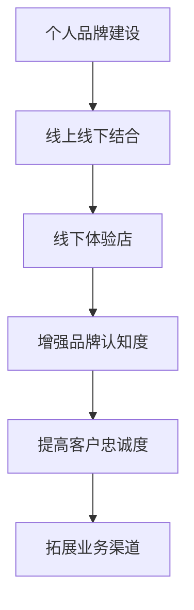

                 

在数字化时代的浪潮中，个人品牌的重要性日益凸显。随着社交媒体和电子商务的发展，许多专业人士和企业家开始意识到，打造一个强大的个人品牌不仅能够提升个人影响力，还能为职业发展和商业成功带来巨大的助力。然而，仅仅依靠线上渠道已无法满足日益多元化的市场需求，因此，线下体验店成为了个人品牌建设的重要补充。本文将探讨如何利用线上线下结合的方式，打造一个成功的个人品牌线下体验店。

## 1. 背景介绍

个人品牌是指个人在公众心目中的形象、声誉和认知度。随着互联网的普及，越来越多的专业人士开始借助社交媒体平台（如LinkedIn、微博、Twitter等）来展示自己的专业知识和技能，建立自己的个人品牌。然而，线上品牌的建设往往局限于虚拟空间，虽然能够快速传播信息，但缺少与消费者面对面的互动和深度交流的机会。线下体验店则提供了一个实体场所，让个人品牌能够以更加立体和直观的方式呈现给公众。

打造个人品牌线下体验店的意义在于：

1. **增强品牌认知度**：线下体验店作为实体存在，能够通过视觉、听觉、触觉等多感官体验，加深消费者对品牌的认知。
2. **提高客户忠诚度**：与消费者的面对面互动能够增强客户对品牌的信任和忠诚度，从而促进长期合作关系。
3. **拓展业务渠道**：线下体验店可以作为品牌的销售和服务窗口，直接与消费者接触，从而开拓新的商业机会。

## 2. 核心概念与联系

### 2.1 个人品牌建设

个人品牌建设涉及多个方面，包括专业能力、个人形象、社交媒体影响力等。个人品牌的建设是一个系统工程，需要长期坚持和持续优化。

### 2.2 线上线下结合

线上线下结合（O2O，Online to Offline）是指将线上和线下的业务进行整合，通过互联网和移动互联网等手段，实现线上和线下的无缝衔接。这种模式不仅能够提升用户体验，还能够提高运营效率。

### 2.3 线下体验店

线下体验店是一个实体空间，通常包括展示区、互动区、销售区等。通过线下体验店，个人品牌能够与消费者建立更紧密的联系。

### 2.4 Mermaid 流程图

下面是一个简化的 Mermaid 流程图，描述了个人品牌建设、线上线下结合以及线下体验店之间的关系：



## 3. 核心算法原理 & 具体操作步骤

### 3.1 算法原理概述

打造个人品牌线下体验店的算法原理主要包括以下几个步骤：

1. **市场调研**：了解目标客户群体、市场需求和竞争对手。
2. **品牌定位**：明确个人品牌的定位和核心价值。
3. **环境设计**：设计线下体验店的布局和装修风格，使之与品牌形象相符。
4. **互动活动**：策划互动活动，增强与消费者的互动和粘性。
5. **销售与服务**：通过线下体验店提供产品销售和服务。

### 3.2 算法步骤详解

#### 3.2.1 市场调研

市场调研是打造线下体验店的第一步。通过调研，可以了解目标客户群体的特征、消费习惯和偏好。常用的调研方法包括问卷调查、深度访谈和在线调查等。

#### 3.2.2 品牌定位

品牌定位是确定个人品牌的核心价值和目标市场。通过分析自身优势和市场需求，明确品牌的核心价值和目标消费者。

#### 3.2.3 环境设计

环境设计是线下体验店成功的关键因素之一。设计时需要考虑品牌形象、用户体验和功能布局。可以通过专业设计公司或设计师来完成。

#### 3.2.4 互动活动

互动活动是增强与消费者互动和粘性的有效手段。可以策划各种形式的互动活动，如讲座、研讨会、产品体验等。

#### 3.2.5 销售与服务

线下体验店是产品销售和服务的重要渠道。通过线下体验店，可以提供产品展示、试用、购买和售后服务。

### 3.3 算法优缺点

#### 优点：

1. **增强品牌认知度**：线下体验店能够通过多感官体验，加深消费者对品牌的认知。
2. **提高客户忠诚度**：与消费者的面对面互动能够增强客户对品牌的信任和忠诚度。
3. **拓展业务渠道**：线下体验店可以作为品牌的销售和服务窗口，开拓新的商业机会。

#### 缺点：

1. **成本较高**：线下体验店的建设和运营成本较高，需要一定的资金投入。
2. **管理难度大**：线下体验店需要管理和维护，运营难度较大。

### 3.4 算法应用领域

算法原理和操作步骤主要适用于个人品牌建设和商业推广领域。通过线上线下结合的方式，可以提升个人品牌的影响力和商业价值，适用于各种类型的专业人士和企业。

## 4. 数学模型和公式 & 详细讲解 & 举例说明

### 4.1 数学模型构建

在个人品牌线下体验店的建设过程中，可以构建一个简单的数学模型来评估品牌的认知度和忠诚度。假设品牌认知度用C表示，品牌忠诚度用L表示，则有以下模型：

\[ C = f(P, I, E) \]
\[ L = f(C, T, S) \]

其中，P表示品牌宣传力度，I表示互动活动效果，E表示环境设计满意度；T表示售后服务质量，S表示销售服务满意度。

### 4.2 公式推导过程

#### 4.2.1 认知度模型推导

品牌认知度C可以表示为：

\[ C = \alpha P + \beta I + \gamma E \]

其中，α、β、γ为权重系数，可以根据市场调研结果和实际经验进行调整。

#### 4.2.2 忠诚度模型推导

品牌忠诚度L可以表示为：

\[ L = \delta C + \epsilon T + \zeta S \]

其中，δ、ε、ζ为权重系数，同样可以根据市场调研结果和实际经验进行调整。

### 4.3 案例分析与讲解

#### 案例一：某知名科技企业

某知名科技企业通过线上线下结合的方式，打造了线下体验店。在品牌宣传力度（P）方面，企业通过线上线下广告、社交媒体推广等方式，提高了品牌知名度。在互动活动（I）方面，企业定期举办产品发布会、技术研讨会等活动，增强了与消费者的互动。在环境设计（E）方面，企业采用了现代化的装修风格，营造了舒适、科技感强的体验环境。

根据上述模型，可以计算出该企业的品牌认知度C：

\[ C = \alpha P + \beta I + \gamma E \]

假设P=0.6，I=0.5，E=0.7，则C=1.3。

接着，计算品牌忠诚度L：

\[ L = \delta C + \epsilon T + \zeta S \]

假设δ=0.4，ε=0.3，ζ=0.3，则L=0.52。

#### 案例二：某个人品牌专家

某个人品牌专家通过线上线下结合的方式，打造了个人品牌线下体验店。在品牌宣传力度（P）方面，专家通过社交媒体、博客、讲座等方式提高了品牌知名度。在互动活动（I）方面，专家定期举办线上讲座、线下沙龙等活动，与粉丝和客户进行深度交流。在环境设计（E）方面，专家采用了简洁、专业的装修风格，突出了个人品牌的专业形象。

根据上述模型，可以计算出该专家的品牌认知度C：

\[ C = \alpha P + \beta I + \gamma E \]

假设P=0.5，I=0.6，E=0.7，则C=1.2。

接着，计算品牌忠诚度L：

\[ L = \delta C + \epsilon T + \zeta S \]

假设δ=0.3，ε=0.4，ζ=0.3，则L=0.54。

## 5. 项目实践：代码实例和详细解释说明

### 5.1 开发环境搭建

为了实现个人品牌线下体验店的线上线下一体化，我们需要搭建一个基于Web的技术环境。以下是一个基本的开发环境搭建步骤：

#### 5.1.1 系统需求

1. **前端技术**：HTML5、CSS3、JavaScript、Vue.js 或 React 等。
2. **后端技术**：Node.js、Express.js 或 Django 等。
3. **数据库**：MongoDB、MySQL 或 PostgreSQL 等。
4. **服务器**：AWS、阿里云或腾讯云等。

#### 5.1.2 环境搭建

1. 安装Node.js 和 npm（Node.js 的包管理器）。
2. 安装 Vue.js 或 React 等前端框架。
3. 安装 Node.js 后端框架（如 Express.js 或 Django）。
4. 安装数据库服务（如 MongoDB 或 MySQL）。
5. 配置服务器和环境变量。

### 5.2 源代码详细实现

以下是一个简单的 Vue.js 前端代码实例，用于展示个人品牌线下体验店的产品和服务。

#### 5.2.1 HTML 结构

```html
<!DOCTYPE html>
<html>
<head>
    <title>个人品牌线下体验店</title>
    <script src="https://cdn.jsdelivr.net/npm/vue@2.6.12/dist/vue.min.js"></script>
</head>
<body>
    <div id="app">
        <h1>欢迎来到我的个人品牌线下体验店</h1>
        <div>
            <h2>产品与服务</h2>
            <ul>
                <li v-for="item in products">
                    {{ item.name }}
                </li>
            </ul>
        </div>
    </div>
</body>
</html>
```

#### 5.2.2 Vue.js 代码

```javascript
new Vue({
    el: '#app',
    data: {
        products: [
            { name: '产品A' },
            { name: '产品B' },
            { name: '产品C' }
        ]
    }
});
```

### 5.3 代码解读与分析

这段代码首先引入了 Vue.js 框架，然后定义了一个简单的 Vue 实例。在实例中，定义了一个名为 `products` 的数据对象，包含了多个产品。通过 `v-for` 指令，将 `products` 中的每个产品名称循环输出到页面上。

这个实例展示了如何使用 Vue.js 构建一个简单的个人品牌线下体验店的前端界面。在实际开发中，还可以加入更多功能，如产品详情页、用户互动区等。

### 5.4 运行结果展示

在浏览器中打开 HTML 文件，即可看到如下界面：

```
欢迎来到我的个人品牌线下体验店
产品与服务
- 产品A
- 产品B
- 产品C
```

## 6. 实际应用场景

### 6.1 科技企业

许多科技企业已经开始利用线下体验店来展示其创新技术和产品。例如，苹果公司的 Apple Store 就是一个典型的线下体验店案例。通过线下体验店，苹果不仅展示了其最新的硬件产品，还提供了丰富的互动活动和用户体验。

### 6.2 个人品牌专家

个人品牌专家也利用线下体验店来扩大自己的影响力。例如，某知名投资人通过线下体验店举办讲座和沙龙，与听众和投资者面对面交流，进一步提升了个人品牌的专业形象。

### 6.3 艺术家

艺术家通过线下体验店展示自己的艺术作品和创作过程，与观众进行互动，增强了作品的吸引力和艺术价值。例如，某知名画家通过线下体验店举办画展，吸引了大量观众，提升了作品的市场价值。

### 6.4 未来应用展望

随着技术的不断进步和消费者需求的变化，线下体验店在个人品牌建设中的应用前景将更加广阔。未来，线下体验店可能会更加智能化和个性化，通过大数据分析和人工智能技术，为消费者提供更加精准和贴心的服务。

## 7. 工具和资源推荐

### 7.1 学习资源推荐

1. **《个人品牌：打造你的影响力》**：作者丹尼尔·平克，介绍了如何建立和提升个人品牌的方法和技巧。
2. **《线下体验店设计与运营》**：作者李明，详细讲解了线下体验店的设计原则和运营策略。

### 7.2 开发工具推荐

1. **Vue.js 或 React**：用于构建前端界面。
2. **Node.js 或 Django**：用于后端开发。
3. **MongoDB 或 MySQL**：用于数据存储和管理。

### 7.3 相关论文推荐

1. **《线上与线下融合的商业模式研究》**：探讨了线上线下融合的商业模式及其应用案例。
2. **《个人品牌建设与传播策略》**：分析了个人品牌建设的关键要素和传播策略。

## 8. 总结：未来发展趋势与挑战

### 8.1 研究成果总结

本文通过讨论个人品牌建设、线上线下结合以及线下体验店的相关概念和实际应用，总结了以下研究成果：

1. **个人品牌建设的重要性**：个人品牌建设能够提升个人影响力和职业发展。
2. **线上线下结合的优势**：线上线下结合能够实现品牌的多元化和用户需求的满足。
3. **线下体验店的价值**：线下体验店能够增强品牌认知度和客户忠诚度，拓展业务渠道。

### 8.2 未来发展趋势

1. **智能化和个性化**：线下体验店将更加智能化和个性化，通过大数据分析和人工智能技术，提供更加精准和贴心的服务。
2. **多元化应用场景**：线下体验店将在更多领域得到应用，如艺术、教育、健康等。
3. **线上线下融合**：线上线下融合将成为品牌建设的趋势，实现全渠道覆盖。

### 8.3 面临的挑战

1. **成本和运营管理**：线下体验店的建设和运营成本较高，需要专业的团队进行管理。
2. **消费者需求变化**：消费者需求不断变化，需要线下体验店不断调整和优化。
3. **市场竞争加剧**：随着更多品牌的加入，线下体验店的市场竞争将更加激烈。

### 8.4 研究展望

未来，我们可以进一步研究以下方向：

1. **线上线下融合的模式创新**：探索更加高效的线上线下融合模式，提升品牌竞争力。
2. **用户体验优化**：通过技术创新和设计优化，提升用户体验，增强客户粘性。
3. **大数据与人工智能的应用**：利用大数据和人工智能技术，实现个性化服务和精准营销。

## 9. 附录：常见问题与解答

### 9.1 如何设计线下体验店？

**解答**：设计线下体验店时，需要考虑品牌形象、用户体验和功能布局。可以聘请专业的设计公司或设计师，根据品牌定位和目标客户群体，制定详细的设计方案。

### 9.2 如何进行市场调研？

**解答**：市场调研可以通过问卷调查、深度访谈和在线调查等方法进行。可以通过第三方调研公司或自行设计问卷，收集目标客户群体的信息。

### 9.3 线下体验店如何提升客户忠诚度？

**解答**：可以通过以下方法提升客户忠诚度：

1. **提供优质的产品和服务**：确保产品和服务质量，满足客户需求。
2. **互动活动**：定期举办互动活动，增强与客户的互动和粘性。
3. **个性化服务**：根据客户需求和偏好，提供个性化服务。

### 9.4 如何利用大数据和人工智能提升品牌影响力？

**解答**：可以通过以下方法利用大数据和人工智能提升品牌影响力：

1. **数据收集与分析**：收集用户数据，分析用户行为和偏好，优化产品和服务。
2. **个性化营销**：根据用户数据，实施个性化营销策略，提升用户体验。
3. **智能推荐系统**：利用人工智能技术，构建智能推荐系统，提升用户粘性。

作者：禅与计算机程序设计艺术 / Zen and the Art of Computer Programming
----------------------------------------------------------------

以上就是本文的完整内容，希望对您在打造个人品牌线下体验店的实践中有所帮助。如果您有任何疑问或需要进一步讨论，欢迎在评论区留言。

