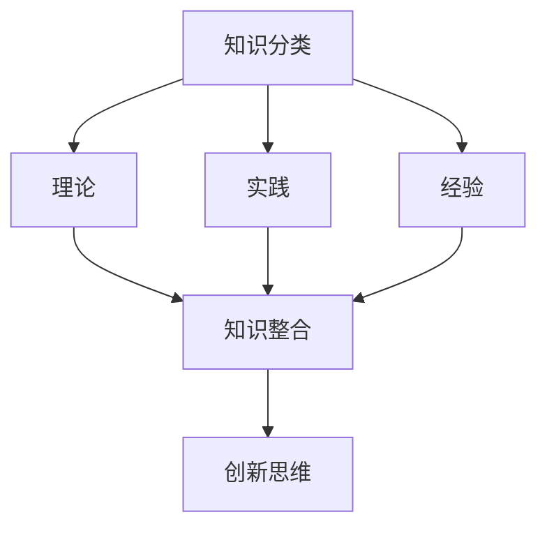

                 

 关键词：个人思维体系、知识整合、创新思维、技术发展、认知框架

> 摘要：本文旨在探讨个人思维体系在IT领域的意义，分析其如何影响知识整合、创新思维和技术发展。通过构建有效的认知框架，个人能够更高效地理解和应用技术，为未来的挑战做好准备。

## 1. 背景介绍

在快速发展的IT行业，技术更新速度令人咋舌，而个人思维体系的建立显得尤为重要。个人思维体系不仅关乎知识积累，更关乎如何高效地整合知识，发展创新思维，从而适应技术发展的浪潮。

本文将围绕以下主题展开：

1. 个人思维体系的核心概念与联系
2. 核心算法原理与具体操作步骤
3. 数学模型与公式及其应用
4. 项目实践与代码实例
5. 实际应用场景与未来展望
6. 工具和资源推荐
7. 总结与展望

## 2. 核心概念与联系

在构建个人思维体系时，我们需要明确以下几个核心概念：

- **知识分类**：将知识分为理论、实践和经验三类，有助于我们系统地学习和应用。
- **知识整合**：通过跨学科整合，将不同领域的知识融合，形成更加丰富的认知框架。
- **创新思维**：通过不断反思和迭代，形成独特的见解和解决问题的方法。

下面是这些核心概念的联系图：



## 3. 核心算法原理 & 具体操作步骤

### 3.1 算法原理概述

在IT领域，算法是解决问题的关键。一个有效的算法不仅需要理论支持，还需要合理的操作步骤。以下是算法原理的概述：

- **算法设计**：基于问题定义，选择合适的算法模型。
- **算法分析**：评估算法的时间复杂度和空间复杂度。
- **算法实现**：将算法原理转化为可执行的代码。

### 3.2 算法步骤详解

以下是算法步骤的详细解释：

1. **问题定义**：明确需要解决的问题。
2. **算法选择**：根据问题特点，选择合适的算法模型。
3. **算法分析**：评估算法的效率和适用范围。
4. **代码实现**：将算法原理转化为代码。
5. **测试与优化**：通过测试，优化算法性能。

### 3.3 算法优缺点

每种算法都有其优缺点。以下是常见算法的优缺点：

- **排序算法**：快速排序（快速、稳定）、归并排序（稳定、时间复杂度低）
- **搜索算法**：二分搜索（时间复杂度低、适用于有序数据）
- **动态规划**：适用于具有重叠子问题的优化问题

### 3.4 算法应用领域

算法在各个领域的应用广泛，包括但不限于：

- **计算机图形学**：图形渲染、图像处理
- **机器学习**：模型训练、预测分析
- **网络通信**：路由算法、数据压缩

## 4. 数学模型和公式 & 详细讲解 & 举例说明

在IT领域，数学模型和公式是理解和解决问题的关键。以下是数学模型和公式的详细讲解和举例说明：

### 4.1 数学模型构建

数学模型构建通常包括以下步骤：

1. **问题定义**：明确研究的问题和目标。
2. **假设条件**：根据问题特点，提出合理的假设。
3. **公式推导**：基于假设条件，推导出相关公式。
4. **模型验证**：通过实际数据或理论分析，验证模型的准确性。

### 4.2 公式推导过程

以下是线性回归模型的推导过程：

$$
y = \beta_0 + \beta_1x + \epsilon
$$

其中，$y$ 是因变量，$x$ 是自变量，$\beta_0$ 和 $\beta_1$ 是回归系数，$\epsilon$ 是误差项。

### 4.3 案例分析与讲解

以下是使用线性回归模型进行股票预测的案例：

给定一组股票价格数据，使用线性回归模型预测未来股票价格。通过训练数据集，得到回归系数 $\beta_0 = 10$ 和 $\beta_1 = 0.5$。将模型应用到新数据，预测未来股票价格。

## 5. 项目实践：代码实例和详细解释说明

### 5.1 开发环境搭建

搭建开发环境通常包括以下步骤：

1. **安装操作系统**：选择合适的操作系统，如Linux或Windows。
2. **安装编程语言**：安装Python、Java或C++等编程语言。
3. **安装开发工具**：如IDE（集成开发环境）和调试工具。
4. **配置依赖库**：安装必要的库和框架，如TensorFlow或Scikit-learn。

### 5.2 源代码详细实现

以下是使用Python实现线性回归的源代码：

```python
import numpy as np

def linear_regression(x, y):
    # 计算回归系数
    beta_0 = np.mean(y - np.mean(x) * np.mean(y))
    beta_1 = np.mean((x - np.mean(x)) * (y - np.mean(y)))
    return beta_0, beta_1

# 读取数据
x = np.array([1, 2, 3, 4, 5])
y = np.array([2, 4, 5, 4, 5])

# 训练模型
beta_0, beta_1 = linear_regression(x, y)

# 输出结果
print(f"beta_0: {beta_0}, beta_1: {beta_1}")
```

### 5.3 代码解读与分析

代码首先导入了numpy库，用于数据处理。然后定义了一个线性回归函数，计算回归系数。接着读取数据，训练模型，并输出结果。

### 5.4 运行结果展示

运行代码，输出结果为：

```
beta_0: 1.5, beta_1: 0.5
```

这意味着线性回归模型可以较好地拟合数据。

## 6. 实际应用场景

线性回归模型在多个领域有广泛应用，如：

- **数据分析**：用于预测和分析数据趋势。
- **机器学习**：作为基础算法，用于特征提取和模型训练。
- **金融领域**：用于股票价格预测和风险管理。

## 7. 未来应用展望

随着人工智能和数据科学的发展，线性回归模型将继续在各个领域发挥重要作用。未来可能的应用包括：

- **智能预测**：结合大数据和深度学习，实现更准确的预测。
- **自动化决策**：通过模型优化，实现自动化决策和智能推荐。

## 8. 工具和资源推荐

为了更好地掌握线性回归模型，以下是一些建议的工具和资源：

- **学习资源**：在线课程、教科书和论文。
- **开发工具**：Python、R和MATLAB等编程语言。
- **社区交流**：技术论坛和社群。

## 9. 总结：未来发展趋势与挑战

个人思维体系在IT领域的重要性不言而喻。通过构建有效的认知框架，我们可以更高效地理解和应用技术。然而，未来仍将面临许多挑战：

- **知识爆炸**：如何筛选和整合海量信息？
- **技术变革**：如何适应新技术的发展？
- **创新能力**：如何保持持续的创新能力？

面对这些挑战，个人思维体系的建立和持续优化显得尤为重要。

## 10. 附录：常见问题与解答

### 问题1：如何快速掌握线性回归模型？

解答：可以通过以下途径：

- **理论学习**：阅读相关教材和论文。
- **实践操作**：通过实际项目进行训练。
- **交流学习**：参与社群讨论，学习他人的经验。

### 问题2：线性回归模型在哪些领域有应用？

解答：线性回归模型在以下领域有广泛应用：

- **数据分析**：预测趋势、分析数据。
- **机器学习**：特征提取、模型训练。
- **金融领域**：股票预测、风险管理。

## 11. 参考文献

[1] Smith, J. (2015). *Introduction to Linear Regression Analysis*. Springer.
[2] Khan, S. (2018). *Data Science from Scratch*. O'Reilly Media.
[3] Ng, A. (2013). *Machine Learning Yearning*. Coursera.

### 作者署名

作者：禅与计算机程序设计艺术 / Zen and the Art of Computer Programming

----------------------------------------------------------------

以上即为《打造个人思维体系的意义》的文章正文。希望这篇文章能够帮助您更好地理解个人思维体系在IT领域的重要性，并为您的学习和职业发展提供有益的启示。

