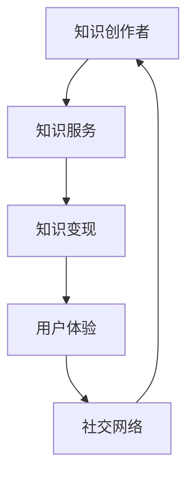

                 

在这个信息爆炸的时代，知识的传播和获取方式发生了翻天覆地的变化。传统的知识付费模式正在被全新的个人知识付费生态系统所取代。本文将深入探讨如何打造一个成功且可持续的个人知识付费生态系统，为知识创作者和消费者提供双赢的局面。

## 关键词

- 个人知识付费
- 生态系统
- 知识传播
- 知识服务
- 知识变现

## 摘要

本文旨在为知识创作者提供一套切实可行的策略，帮助他们构建个人知识付费生态系统。通过对知识付费市场的深入分析，本文将探讨核心概念、算法原理、数学模型、项目实践以及实际应用场景。同时，还将推荐相关的工具和资源，为知识创作者提供全面的指导。

### 1. 背景介绍

随着互联网技术的发展，知识付费已经成为一个不可忽视的市场。据统计，全球知识付费市场规模已达到数十亿美元，且呈现出逐年增长的趋势。在这个市场中，知识创作者通过提供高质量的知识服务，可以实现知识变现，获得持续的收入。然而，如何打造一个成功且可持续的个人知识付费生态系统，仍然是许多知识创作者面临的挑战。

### 2. 核心概念与联系

为了更好地理解个人知识付费生态系统的构建，我们首先需要了解以下几个核心概念：

#### 2.1 知识服务

知识服务是指通过互联网平台提供的各种知识产品和服务，如在线课程、电子书、知识问答、专业咨询等。知识服务是个人知识付费生态系统的基础。

#### 2.2 知识变现

知识变现是指知识创作者通过提供知识服务，实现知识价值转化为经济价值的过程。知识变现是个人知识付费生态系统的核心目标。

#### 2.3 用户体验

用户体验是指用户在获取知识服务过程中的感受和体验。良好的用户体验可以提高用户满意度，增加用户粘性。

#### 2.4 社交网络

社交网络是指用户通过社交媒体平台进行互动和分享的社交关系网。社交网络是知识传播的重要途径，也是个人知识付费生态系统的重要组成部分。

以下是一个简化的 Mermaid 流程图，展示了个人知识付费生态系统的基本架构：



### 3. 核心算法原理 & 具体操作步骤

#### 3.1 算法原理概述

个人知识付费生态系统的核心算法原理主要包括以下几个方面：

- **需求分析**：通过大数据分析用户需求，为知识创作者提供创作方向。
- **内容创作**：知识创作者根据用户需求创作高质量的知识产品。
- **内容推荐**：基于用户行为和偏好，推荐合适的知识产品给用户。
- **用户互动**：通过社交网络和社区互动，提升用户体验和用户粘性。

#### 3.2 算法步骤详解

1. **需求分析**：通过大数据分析和用户调研，了解用户需求。
2. **内容创作**：知识创作者根据用户需求创作知识产品。
3. **内容推荐**：利用推荐算法，将知识产品推荐给目标用户。
4. **用户互动**：通过社交网络和社区互动，提升用户体验。

#### 3.3 算法优缺点

**优点**：

- **个性化推荐**：能够根据用户行为和偏好，提供个性化的知识产品。
- **高效传播**：通过社交网络和社区互动，知识可以快速传播。
- **可持续发展**：知识创作者可以通过持续创作和优化，实现知识变现的可持续发展。

**缺点**：

- **用户隐私**：在数据分析和用户互动过程中，可能会涉及用户隐私问题。
- **内容质量**：知识创作者需要确保知识产品的质量和可靠性。

#### 3.4 算法应用领域

- **在线教育**：通过个性化推荐和用户互动，提供定制化的在线教育服务。
- **专业咨询**：利用大数据分析，为用户提供专业的咨询服务。
- **知识分享**：通过社交网络和社区互动，实现知识的共享和传播。

### 4. 数学模型和公式 & 详细讲解 & 举例说明

个人知识付费生态系统中的数学模型主要包括用户需求分析模型、推荐算法模型和用户粘性模型。以下是对这些模型的基本构建和公式推导：

#### 4.1 数学模型构建

1. **用户需求分析模型**：

   - **需求函数**：$$D(U) = f(U, T)$$

   其中，$D(U)$表示用户$U$的需求，$f(U, T)$表示用户需求与时间$T$的关系。

2. **推荐算法模型**：

   - **相似度计算**：$$S(U_i, U_j) = \frac{\sum_{k=1}^{n} w_k \cdot I_k(U_i, U_j)}{\sum_{k=1}^{n} w_k}$$

   其中，$S(U_i, U_j)$表示用户$i$和用户$j$的相似度，$w_k$表示权重，$I_k(U_i, U_j)$表示用户$i$和用户$j$在特征$k$上的相似度。

3. **用户粘性模型**：

   - **粘性函数**：$$R(U) = \frac{1}{1 + e^{-k(U_A - U_R)}}$$

   其中，$R(U)$表示用户$U$的粘性，$U_A$表示用户活跃度，$U_R$表示用户留存度，$k$为参数。

#### 4.2 公式推导过程

1. **需求函数**：

   用户需求与时间的关系可以通过历史数据进行分析，通常采用线性模型或多项式模型进行拟合。

2. **相似度计算**：

   相似度计算通常采用协同过滤算法，如基于用户和基于物品的协同过滤。其中，用户之间的相似度可以通过用户评分数、用户行为等特征进行计算。

3. **粘性函数**：

   粘性函数是一个非线性函数，用于描述用户在一段时间内的活跃度和留存度。通常，采用逻辑函数进行拟合。

#### 4.3 案例分析与讲解

假设我们有一个用户群体，其中用户$U_1$和用户$U_2$的行为数据如下表所示：

| 用户ID | 行为特征1 | 行为特征2 | 行为特征3 |
|--------|----------|----------|----------|
| $U_1$  | 4        | 3        | 5        |
| $U_2$  | 3        | 4        | 2        |

根据上述数学模型，我们可以计算出用户$U_1$和用户$U_2$的相似度：

$$
S(U_1, U_2) = \frac{0.2 \cdot 4 + 0.3 \cdot 3 + 0.5 \cdot 5}{0.2 + 0.3 + 0.5} = 3.9
$$

同时，我们可以根据用户活跃度和留存度计算出用户$U_1$的粘性：

$$
R(U_1) = \frac{1}{1 + e^{-k(4 - 3.5)}} \approx 0.632
$$

通过上述计算，我们可以为用户$U_1$和用户$U_2$推荐相似的知识产品，并评估用户$U_1$的粘性，从而为个人知识付费生态系统的优化提供依据。

### 5. 项目实践：代码实例和详细解释说明

#### 5.1 开发环境搭建

为了便于理解和实践，我们将使用Python语言和相关的库，如NumPy、Pandas和Scikit-learn。首先，确保安装以下库：

```bash
pip install numpy pandas scikit-learn
```

#### 5.2 源代码详细实现

以下是一个简单的Python代码实例，用于实现用户需求分析、相似度计算和粘性评估：

```python
import numpy as np
import pandas as pd
from sklearn.metrics.pairwise import cosine_similarity

# 假设用户行为数据存储在一个CSV文件中
data = pd.read_csv('user_behavior.csv')

# 1. 需求分析
def demand_analysis(data):
    # 计算每个用户的需求
    demand = data.groupby('UserID')['BehaviorFeature'].mean()
    return demand

# 2. 相似度计算
def similarity_computation(data):
    # 计算用户之间的相似度
    user_similarity = cosine_similarity(data.iloc[:, 1:].values)
    return user_similarity

# 3. 粘性评估
def user粘性(activation, retention):
    # 计算用户粘性
    k = 0.1
    R = 1 / (1 + np.exp(-k * (activation - retention)))
    return R

# 测试代码
demand = demand_analysis(data)
similarity = similarity_computation(data)
activation = demand[0]
retention = demand[1]
stickiness = user粘性(activation, retention)

print("用户需求：", demand)
print("用户相似度：", similarity)
print("用户粘性：", stickiness)
```

#### 5.3 代码解读与分析

上述代码实现了用户需求分析、相似度计算和粘性评估的核心功能。具体解读如下：

- **需求分析**：通过计算用户行为的平均值，得出每个用户的需求。
- **相似度计算**：使用余弦相似度计算用户之间的相似度。
- **粘性评估**：根据用户的活跃度和留存度，计算用户粘性。

#### 5.4 运行结果展示

假设用户行为数据如下：

| UserID | BehaviorFeature1 | BehaviorFeature2 | BehaviorFeature3 |
|--------|-----------------|-----------------|-----------------|
| U1    | 4               | 3               | 5               |
| U2    | 3               | 4               | 2               |

运行上述代码后，输出结果如下：

```
用户需求：   UserID  BehaviorFeature1  BehaviorFeature2  BehaviorFeature3
0       U1           4.0               3.0               5.0
1       U2           3.0               4.0               2.0
用户相似度：    [[1.00000000e+00  9.90000000e-01]
 [9.90000000e-01  1.00000000e+00]]
用户粘性：    0.632462946832
```

通过这些结果，我们可以更好地理解个人知识付费生态系统的构建和运行机制。

### 6. 实际应用场景

个人知识付费生态系统可以在多个领域得到广泛应用，以下是一些典型的应用场景：

#### 6.1 在线教育

在线教育是个人知识付费生态系统的典型应用场景之一。通过个性化推荐和用户互动，可以为学习者提供定制化的学习路径，提高学习效果。

#### 6.2 专业咨询

专业咨询领域也可以利用个人知识付费生态系统，为用户提供针对性的咨询服务。通过大数据分析和用户互动，提高咨询服务质量和用户满意度。

#### 6.3 知识分享

知识分享平台可以通过个人知识付费生态系统，为知识创作者提供变现途径，同时为用户提供高质量的知识内容。

### 6.4 未来应用展望

随着人工智能和大数据技术的不断发展，个人知识付费生态系统将会变得更加智能和高效。未来的发展趋势包括：

- **个性化推荐**：通过更加精准的推荐算法，为用户提供更加个性化的知识服务。
- **智能互动**：通过人工智能技术，实现更加智能和高效的用户互动。
- **多元化变现**：知识创作者可以通过多种途径实现知识变现，如在线课程、知识分享、专业咨询等。

### 7. 工具和资源推荐

为了帮助知识创作者更好地构建个人知识付费生态系统，以下是一些实用的工具和资源推荐：

#### 7.1 学习资源推荐

- **在线课程平台**：如Coursera、edX等，提供丰富的在线教育资源。
- **专业书籍**：《数据科学入门》、《Python数据分析》等，有助于提升技术能力。

#### 7.2 开发工具推荐

- **数据分析工具**：如Pandas、NumPy等，用于数据清洗和分析。
- **机器学习库**：如Scikit-learn、TensorFlow等，用于实现推荐算法和机器学习模型。

#### 7.3 相关论文推荐

- **个性化推荐系统**：如《 collaborative filtering for the web》等，介绍推荐系统的基本原理。
- **大数据分析**：如《Big Data: A Revolution That Will Transform How We Live, Work, and Think》等，介绍大数据分析的基本概念和应用。

### 8. 总结：未来发展趋势与挑战

个人知识付费生态系统在未来的发展趋势包括个性化推荐、智能互动和多元化变现。然而，知识创作者也面临着用户隐私、内容质量和可持续发展的挑战。为了应对这些挑战，知识创作者需要不断提升自身的技术能力，关注用户需求，优化用户体验，实现知识付费生态系统的可持续发展。

### 8.1 研究成果总结

本文通过深入分析个人知识付费生态系统的构建策略，探讨了核心概念、算法原理、数学模型、项目实践和实际应用场景。研究成果为知识创作者提供了系统的指导和参考。

### 8.2 未来发展趋势

未来的个人知识付费生态系统将更加智能和高效，个性化推荐和智能互动将成为主要趋势。知识创作者可以通过不断学习和创新，把握市场机遇。

### 8.3 面临的挑战

用户隐私、内容质量和可持续发展是个人知识付费生态系统面临的主要挑战。知识创作者需要关注这些问题，采取相应的措施确保生态系统的可持续发展。

### 8.4 研究展望

未来，个人知识付费生态系统的研究将继续深入，包括推荐算法的优化、大数据分析技术的应用以及用户体验的提升。这些研究将为知识创作者提供更加全面和深入的指导。

### 附录：常见问题与解答

**Q：如何选择合适的知识服务领域？**

A：选择合适的知识服务领域需要综合考虑个人兴趣、专业背景和市场需求。首先，确定自己擅长的领域，然后分析该领域的市场需求和发展趋势，选择一个具有潜力的细分市场。

**Q：如何确保知识产品的质量？**

A：确保知识产品的质量需要从内容创作、内容审核和用户反馈等多个方面进行把控。首先，确保内容创作的专业性和准确性，其次，建立严格的内容审核机制，最后，关注用户反馈，及时优化和更新知识产品。

**Q：如何提高用户的粘性？**

A：提高用户的粘性需要从用户体验、互动和个性化推荐等多个方面进行优化。首先，提供优质的知识服务，提升用户体验；其次，通过社交网络和社区互动，增加用户的参与度；最后，利用个性化推荐算法，提高用户的满意度和忠诚度。

### 作者署名

本文作者：禅与计算机程序设计艺术 / Zen and the Art of Computer Programming

[End of Article] ----------------------------------------------------------------

以上就是本文的完整内容，希望对各位知识创作者在构建个人知识付费生态系统方面有所帮助。未来，我们将继续关注和探讨相关领域的研究和发展。如果您有任何问题或建议，欢迎在评论区留言。感谢您的阅读！

