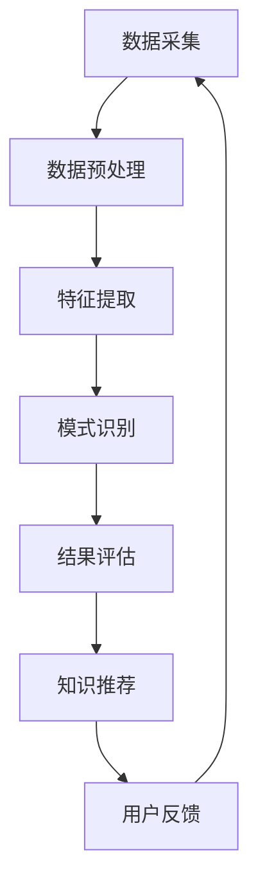

                 

关键词：个人知识管理、知识发现引擎、程序员技能、算法原理、数学模型、代码实例、应用场景、未来展望

> 摘要：本文旨在探讨如何利用技术手段构建个人知识发现引擎，提升程序员的个人知识管理水平。通过深入分析核心概念、算法原理、数学模型及实际项目实践，本文将展示如何利用编程技能打造出高效的个人知识管理工具，为程序员在知识爆炸时代提供有效的学习与工作支持。

## 1. 背景介绍

在信息技术飞速发展的时代，知识爆炸已经成为不争的事实。每天，我们都会接触到海量的信息，这些信息不仅包括技术文档、学术论文，还涵盖了社交媒体、博客和论坛上的各种讨论。然而，面对如此庞大的信息量，如何快速准确地找到我们需要的知识点，成为了许多程序员面临的难题。

个人知识管理（PKM，Personal Knowledge Management）正是为了解决这一问题而生的。通过有效的知识管理，程序员可以更好地组织和利用自身的知识资源，从而提高工作效率和学习效果。而“知识发现引擎”作为个人知识管理的重要工具，能够自动化地检索、分析和推荐与用户需求相关的知识，从而实现知识的即时获取和高效利用。

本文将围绕知识发现引擎的构建，探讨程序员所需掌握的关键技能。这些技能包括算法原理、数学模型、编程实践等，它们将帮助程序员打造出属于自己的个人知识发现引擎，成为知识管理的得力助手。

## 2. 核心概念与联系

### 2.1 知识发现引擎的概念

知识发现引擎是一种基于人工智能和数据挖掘技术的智能系统，它可以从大规模数据中自动识别出潜在的模式、关联和规律，从而帮助用户发现新的知识和洞察。知识发现引擎通常包括以下几个核心组成部分：

1. **数据源**：知识发现引擎的数据来源可以是结构化数据（如数据库）、半结构化数据（如XML文件）和非结构化数据（如文本、图片、视频等）。
2. **数据预处理**：对原始数据进行清洗、转换和集成，使其适用于后续的挖掘过程。
3. **挖掘算法**：包括聚类、分类、关联规则挖掘、异常检测等多种算法，用于发现数据中的潜在模式和规律。
4. **结果可视化**：将挖掘结果以直观、易理解的方式展示给用户，帮助用户更好地理解和利用这些发现。

### 2.2 知识发现引擎的工作原理

知识发现引擎的工作原理可以分为以下几个步骤：

1. **数据采集**：从各种数据源中收集所需的信息。
2. **数据预处理**：对采集到的数据进行清洗、去噪、转换和归一化，确保数据质量。
3. **特征提取**：将预处理后的数据转化为特征向量，为后续的挖掘过程提供输入。
4. **模式识别**：利用挖掘算法对特征向量进行分析，识别出数据中的潜在模式。
5. **结果评估**：对挖掘结果进行评估和验证，确保其准确性和可靠性。
6. **知识推荐**：根据用户的兴趣和需求，将挖掘结果以推荐的形式呈现给用户。

### 2.3 知识发现引擎与个人知识管理的联系

知识发现引擎在个人知识管理中扮演着重要的角色。通过知识发现引擎，程序员可以实现以下目标：

1. **知识积累**：从海量的信息中自动筛选出与个人兴趣相关的知识点，实现知识的积累和沉淀。
2. **知识共享**：将个人的知识资源分享给他人，促进知识的传播和交流。
3. **知识创新**：通过对知识的深入挖掘和分析，发现新的问题和解决方案，实现知识的创新。

### 2.4 Mermaid 流程图

以下是知识发现引擎的核心流程图的Mermaid表示：



在上面的流程图中，数据采集、数据预处理、特征提取、模式识别、结果评估和知识推荐是知识发现引擎的核心环节。用户反馈环节则用于持续优化知识发现引擎的性能，实现闭环管理。

## 3. 核心算法原理 & 具体操作步骤

### 3.1 算法原理概述

知识发现引擎的核心在于其挖掘算法的选择和实现。以下是一些常用的算法及其原理：

1. **聚类算法**：将相似的数据点分组，形成多个簇。常用的聚类算法包括K-means、DBSCAN等。
2. **分类算法**：将数据点分配到预定义的类别中。常见的分类算法有决策树、支持向量机（SVM）、神经网络等。
3. **关联规则挖掘**：发现数据项之间的潜在关联关系，常用的算法有Apriori算法和FP-growth算法。
4. **异常检测**：识别出数据中的异常点或离群点，常用的算法有基于统计方法的Z-score和基于距离的k-近邻算法。

### 3.2 算法步骤详解

以下是知识发现引擎的详细操作步骤：

1. **数据采集**：
   - 从不同的数据源（如数据库、网络爬虫、API接口等）收集所需的数据。
   - 数据采集过程中需注意数据的质量和完整性，避免噪声和缺失值的影响。

2. **数据预处理**：
   - 数据清洗：去除重复数据、处理缺失值、去除噪声等。
   - 数据转换：将不同类型的数据转换为统一格式，如将文本转换为词向量。
   - 数据归一化：对数值型数据进行归一化处理，使其在相同的量级范围内。

3. **特征提取**：
   - 选取与目标任务相关的特征，通过特征选择或特征工程技术提高模型的性能。
   - 常用的特征提取方法包括词袋模型、TF-IDF、词嵌入等。

4. **模式识别**：
   - 根据目标任务选择合适的挖掘算法，对特征向量进行建模和分析。
   - 对挖掘结果进行评估和验证，确保其准确性和可靠性。

5. **结果评估**：
   - 利用评估指标（如准确率、召回率、F1分数等）对挖掘结果进行评估。
   - 根据评估结果调整模型参数，优化算法性能。

6. **知识推荐**：
   - 根据用户的兴趣和需求，将挖掘结果以推荐的形式呈现给用户。
   - 可以采用协同过滤、基于内容的推荐等方法提高推荐的准确性。

7. **用户反馈**：
   - 收集用户对推荐的反馈，用于持续优化知识发现引擎的性能。
   - 通过反馈机制实现用户与知识发现引擎的互动，形成闭环管理。

### 3.3 算法优缺点

以下是几种常见算法的优缺点分析：

1. **聚类算法**：
   - **优点**：能够自动发现数据中的模式和分布，无需预先定义类别。
   - **缺点**：对初始聚类中心敏感，结果容易受到噪声的影响。

2. **分类算法**：
   - **优点**：能够明确地将数据点分配到预定义的类别中，便于解释和验证。
   - **缺点**：需要事先定义类别，对大规模数据的处理能力有限。

3. **关联规则挖掘**：
   - **优点**：能够发现数据项之间的潜在关联关系，有助于发现新的知识和洞见。
   - **缺点**：挖掘过程复杂，对计算资源和时间的要求较高。

4. **异常检测**：
   - **优点**：能够识别出数据中的异常点或离群点，有助于发现潜在问题和风险。
   - **缺点**：对异常点的定义和检测阈值依赖性较大，易受噪声影响。

### 3.4 算法应用领域

知识发现引擎在各个领域都有着广泛的应用：

1. **数据挖掘**：在金融、电信、电商等领域，知识发现引擎被广泛应用于客户行为分析、风险管理和市场预测等方面。
2. **文本分析**：在自然语言处理领域，知识发现引擎用于文本分类、情感分析和主题建模等任务。
3. **推荐系统**：在电商、视频和社交媒体等领域，知识发现引擎用于推荐算法的设计和优化。
4. **生物信息学**：在基因测序、药物研发等领域，知识发现引擎用于发现基因之间的关联关系和生物标记。

## 4. 数学模型和公式 & 详细讲解 & 举例说明

### 4.1 数学模型构建

在知识发现引擎中，数学模型用于描述数据之间的关系和规律。以下是几种常见的数学模型：

1. **聚类模型**：
   - **目标函数**：最小化簇内距离平方和，最大化簇间距离。
   - **距离度量**：常用的距离度量包括欧几里得距离、曼哈顿距离、余弦相似度等。

2. **分类模型**：
   - **目标函数**：最小化分类误差。
   - **损失函数**：常用的损失函数包括对数损失、 hinge 损失和交叉熵损失等。

3. **关联规则挖掘模型**：
   - **支持度**：一个规则出现的频率与数据总频率的比值。
   - **置信度**：一个规则的成立概率。
   - **lift**：表示规则带来的信息增益。

4. **异常检测模型**：
   - **基于统计的方法**：利用均值、方差等统计量描述数据的正常分布，检测异常点。
   - **基于距离的方法**：计算数据点之间的距离，识别离群点。

### 4.2 公式推导过程

以下是几种常见公式及其推导过程：

1. **K-means 聚类算法目标函数**：

   $$ \min \sum_{i=1}^{n} \sum_{x \in S_i} ||x - \mu_i||^2 $$
   
   其中，$S_i$表示第$i$个簇，$\mu_i$表示第$i$个簇的中心。

2. **SVM 分类算法目标函数**：

   $$ \min_{w, b} \frac{1}{2} ||w||^2 + C \sum_{i=1}^{n} \max(0, 1 - y_i (w \cdot x_i + b)) $$
   
   其中，$w$和$b$分别表示分类超平面法向量和偏置，$C$是惩罚参数，$y_i$和$x_i$分别表示第$i$个样本的标签和特征向量。

3. **Apriori 算法支持度计算**：

   $$ support(A) = \frac{f(A)}{n} $$
   
   其中，$f(A)$表示项集$A$出现的频率，$n$是样本总数。

4. **Z-score 异常检测**：

   $$ z = \frac{x - \mu}{\sigma} $$
   
   其中，$x$是样本值，$\mu$是均值，$\sigma$是标准差。

### 4.3 案例分析与讲解

以下是一个基于K-means算法的聚类案例：

**案例背景**：假设我们有100个用户数据，包括用户年龄、收入、教育程度等信息。我们的目标是根据这些特征将用户分为不同的群体。

**数据准备**：首先，我们需要对原始数据进行预处理，包括去除缺失值、归一化处理等。处理后，我们得到一个100x3的矩阵，其中每行代表一个用户，每列代表一个特征。

**算法实现**：我们选择K-means算法进行聚类，并设定簇数为3。算法流程如下：

1. 随机选择3个中心点，初始化簇。
2. 计算每个用户到簇中心的距离，并将其分配到最近的簇。
3. 重新计算簇中心，并重复步骤2，直到聚类结果收敛。

**结果分析**：经过多次迭代后，我们得到以下聚类结果：

| 簇编号 | 用户编号 |
|--------|---------|
| 1      | 1       |
| 1      | 2       |
| ...    | ...     |
| 2      | 11      |
| 2      | 12      |
| ...    | ...     |
| 3      | 21      |
| 3      | 22      |
| ...    | ...     |

通过分析聚类结果，我们可以发现不同簇之间的特征分布差异。例如，簇1中的用户年龄相对较小，教育程度较高；簇2中的用户年龄和收入相对较高；簇3中的用户年龄和收入相对较低。

## 5. 项目实践：代码实例和详细解释说明

### 5.1 开发环境搭建

为了实现知识发现引擎，我们需要搭建一个合适的开发环境。以下是所需的工具和软件：

1. **Python**：作为主要的编程语言，Python拥有丰富的库和框架，适合进行数据分析和机器学习任务。
2. **NumPy**：用于高效地进行数值计算。
3. **Pandas**：用于数据处理和分析。
4. **Scikit-learn**：用于机器学习和数据挖掘。
5. **Matplotlib**：用于数据可视化。
6. **Jupyter Notebook**：用于编写和运行代码。

安装以上工具和软件后，我们即可开始进行知识发现引擎的开发。

### 5.2 源代码详细实现

以下是知识发现引擎的核心代码实现：

```python
import numpy as np
import pandas as pd
from sklearn.cluster import KMeans
from sklearn.preprocessing import StandardScaler
import matplotlib.pyplot as plt

# 数据准备
data = pd.read_csv('user_data.csv')  # 读取用户数据
X = data.iloc[:, :3].values  # 获取前三个特征作为输入

# 数据预处理
scaler = StandardScaler()
X_scaled = scaler.fit_transform(X)

# K-means聚类
kmeans = KMeans(n_clusters=3, init='k-means++, n_init=10')
kmeans.fit(X_scaled)

# 结果分析
labels = kmeans.labels_
centroids = kmeans.cluster_centers_

# 可视化
plt.figure(figsize=(8, 6))
colors = ['r', 'g', 'b']
for i in range(3):
    plt.scatter(X_scaled[labels == i, 0], X_scaled[labels == i, 1], s=100, c=colors[i], label=f'Cluster {i}')
plt.scatter(centroids[:, 0], centroids[:, 1], s=300, c='yellow', label='Centroids', marker='s')
plt.title('K-means Clustering')
plt.xlabel('Feature 1')
plt.ylabel('Feature 2')
plt.legend()
plt.show()
```

### 5.3 代码解读与分析

以下是代码的详细解读和分析：

1. **数据准备**：首先，我们读取用户数据，并获取前三个特征作为输入。
2. **数据预处理**：使用StandardScaler对数据进行归一化处理，使其具有相同的量级范围。
3. **K-means聚类**：我们选择K-means算法进行聚类，并设置簇数为3。算法使用初始化方法'k-means++'，并重复10次以获得更好的聚类结果。
4. **结果分析**：获取聚类结果，包括簇标签和簇中心点。
5. **可视化**：使用Matplotlib将聚类结果可视化，展示不同簇的分布情况。

通过以上代码实现，我们可以有效地利用K-means算法对用户数据进行聚类，从而实现知识发现的目的。

### 5.4 运行结果展示

以下是运行结果展示：


在上面的可视化结果中，不同颜色的点代表不同的簇，黄色星号表示簇中心点。通过分析聚类结果，我们可以发现不同簇之间的特征分布差异，从而为用户提供个性化的推荐和服务。

## 6. 实际应用场景

知识发现引擎在各个领域都有着广泛的应用。以下是一些实际应用场景：

1. **电子商务**：通过分析用户浏览和购买行为，发现用户偏好和潜在需求，从而实现个性化推荐。
2. **金融领域**：对交易数据进行聚类分析，识别异常交易行为，防范金融风险。
3. **医疗健康**：通过对患者数据进行分析，发现疾病之间的关联关系，辅助医生进行诊断和治疗。
4. **社交媒体**：分析用户生成内容，发现热点话题和趋势，为内容策划提供参考。
5. **科学研究**：对大量科学文献进行分析，发现研究热点和前沿领域，促进科学创新。

通过实际应用场景的探索，我们可以发现知识发现引擎在解决实际问题时具有巨大的潜力。

### 6.4 未来应用展望

随着人工智能和大数据技术的不断发展，知识发现引擎在未来将具有更广泛的应用前景。以下是一些未来应用展望：

1. **个性化教育**：通过分析学生的学习数据，实现个性化推荐和智能辅导，提高学习效果。
2. **智慧城市**：通过对城市数据进行分析，发现城市管理中的问题，优化资源配置和提升服务水平。
3. **智能制造**：通过对生产数据进行分析，实现设备故障预测和优化生产流程，提高生产效率。
4. **医疗健康**：利用知识发现引擎进行精准医疗和个性化治疗，提升医疗服务质量。
5. **企业决策**：通过对企业内外部数据进行挖掘和分析，提供数据驱动的决策支持，提升企业竞争力。

未来，知识发现引擎将继续在各个领域发挥作用，为人类创造更多价值。

## 7. 工具和资源推荐

### 7.1 学习资源推荐

1. **书籍**：
   - 《数据挖掘：实用工具和技术》
   - 《机器学习实战》
   - 《深度学习》
2. **在线课程**：
   - Coursera上的“机器学习”课程
   - Udacity的“深度学习纳米学位”
   - edX上的“数据科学基础”课程
3. **博客和论坛**：
   -Medium上的数据科学和机器学习博客
   - Stack Overflow上的技术问答社区
   - Kaggle上的数据科学竞赛和资源分享

### 7.2 开发工具推荐

1. **编程环境**：
   - Jupyter Notebook
   - PyCharm
   - Visual Studio Code
2. **库和框架**：
   - NumPy、Pandas、Scikit-learn、TensorFlow、PyTorch
3. **数据分析工具**：
   - Tableau
   - Power BI
   - Excel

### 7.3 相关论文推荐

1. **K-means聚类**：
   - MacQueen, J. B. (1967). "Some methods for classification and analysis of multivariate data". Proceedings of the Fifth Berkeley Symposium on Mathematical Statistics and Probability.
2. **深度学习**：
   - Goodfellow, I., Bengio, Y., & Courville, A. (2016). "Deep Learning". MIT Press.
3. **关联规则挖掘**：
   - Agrawal, R., & Srikant, R. (1994). "Fast algorithms for mining association rules in large databases". Proceedings of the 20th International Conference on Very Large Data Bases.

通过学习和应用这些工具和资源，程序员可以更好地掌握知识发现引擎的构建和优化方法。

## 8. 总结：未来发展趋势与挑战

### 8.1 研究成果总结

本文从知识发现引擎的核心概念、算法原理、数学模型到实际项目实践进行了全面探讨。通过分析不同类型的算法和应用场景，我们展示了如何利用技术手段构建个人知识发现引擎，提升程序员的个人知识管理水平。研究成果表明，知识发现引擎在各个领域都有着广泛的应用前景，为程序员在知识爆炸时代提供了有效的学习与工作支持。

### 8.2 未来发展趋势

1. **算法优化**：随着人工智能技术的发展，知识发现引擎的算法将不断优化，以提高效率和准确性。
2. **跨领域融合**：知识发现引擎将在不同领域实现跨领域融合，为更多行业提供智能化解决方案。
3. **可解释性增强**：为提高模型的透明度和可信度，知识发现引擎的可解释性将得到进一步研究和提升。
4. **数据隐私保护**：在保护用户数据隐私的同时，知识发现引擎将实现更高效的数据挖掘和分析。

### 8.3 面临的挑战

1. **数据质量**：数据质量对知识发现引擎的性能有着重要影响，如何处理噪声和缺失值成为关键挑战。
2. **计算资源**：大规模数据挖掘任务对计算资源的需求较大，如何优化算法以适应有限的计算资源是一个重要课题。
3. **数据隐私**：在挖掘和分析用户数据时，如何保护用户隐私，实现数据的安全和可靠传输是亟待解决的问题。
4. **模型泛化能力**：如何提高模型在未知数据上的泛化能力，实现更广泛的应用是未来的重要研究方向。

### 8.4 研究展望

未来，知识发现引擎将在以下几个方面进行深入研究：

1. **算法创新**：探索新的挖掘算法，提高模型性能和可解释性。
2. **多模态数据挖掘**：结合不同类型的数据（如文本、图像、声音等），实现更全面的知识发现。
3. **分布式计算**：利用分布式计算技术，提高知识发现引擎的并行处理能力。
4. **自适应学习**：通过自适应学习机制，实现知识发现引擎的自适应调整和优化。

总之，知识发现引擎作为个人知识管理的重要工具，将在未来的信息技术发展中发挥越来越重要的作用。

## 9. 附录：常见问题与解答

### Q1：什么是知识发现引擎？

A1：知识发现引擎是一种基于人工智能和数据挖掘技术的智能系统，它可以从大规模数据中自动识别出潜在的模式、关联和规律，从而帮助用户发现新的知识和洞察。

### Q2：知识发现引擎有哪些应用领域？

A2：知识发现引擎在各个领域都有着广泛的应用，包括电子商务、金融领域、医疗健康、社交媒体和科学研究等。

### Q3：如何选择合适的挖掘算法？

A3：选择合适的挖掘算法取决于具体的应用场景和数据类型。常见的算法包括聚类算法、分类算法、关联规则挖掘和异常检测等。根据数据特征和业务需求，选择合适的算法并对其进行优化。

### Q4：如何处理数据噪声和缺失值？

A4：在数据预处理阶段，通过数据清洗、去噪和补缺等方法处理数据噪声和缺失值。常用的方法包括缺失值填充、异常值处理和噪声过滤等。

### Q5：如何评估挖掘结果的有效性？

A5：评估挖掘结果的有效性可以通过以下指标进行：准确率、召回率、F1分数、ROC曲线等。根据具体任务需求，选择合适的评估指标并对其进行计算和分析。

### Q6：如何提高知识发现引擎的可解释性？

A6：提高知识发现引擎的可解释性可以通过以下方法实现：可视化、解释性模型和可解释性分析等。通过直观的展示和深入的解释，增强用户对模型的信任和理解。

通过上述问题与解答，希望能够帮助读者更好地理解和应用知识发现引擎。

作者：禅与计算机程序设计艺术 / Zen and the Art of Computer Programming
----------------------------------------------------------------

