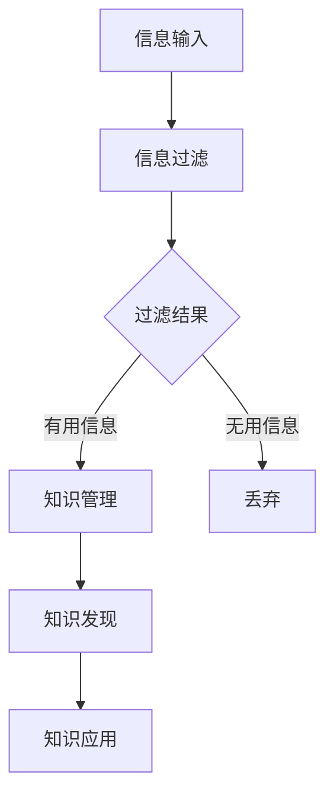

                 

在数字化时代，知识的获取和处理成为程序员不可或缺的技能。随着技术的飞速发展，程序员面对的信息量呈指数级增长，如何高效地管理这些信息，并将其转化为可操作的知识，成为了一个关键问题。本文将探讨如何打造个人知识发现引擎，帮助程序员提升学习效率和知识管理能力。

> 关键词：知识管理，个人知识体系，信息过滤，知识发现，程序员成长

> 摘要：本文旨在探讨程序员如何利用现代技术和方法，构建个人知识发现引擎，从而实现知识的有效获取、整理和应用。文章将介绍核心概念、算法原理、数学模型以及实际应用案例，并展望未来的发展方向。

## 1. 背景介绍

在过去的几十年中，信息技术的发展极大地改变了我们的工作方式和生活习惯。作为技术从业者，程序员的工作环境和面临的挑战也在不断变化。首先，技术领域的知识更新速度越来越快，新的编程语言、框架和技术层出不穷，程序员需要不断学习才能跟上时代的步伐。其次，随着互联网的普及，程序员获取信息的方式变得更加多样化，但同时也面临着信息过载的问题。如何在海量信息中筛选出有价值的内容，并将其转化为实际的知识，成为了一个亟待解决的问题。

个人知识发现引擎的概念源于数据挖掘和机器学习领域。它指的是通过算法和模型，从大量数据中自动提取出有价值的信息和知识。在程序员的知识管理中，个人知识发现引擎可以帮助他们发现新的学习资源，理解复杂的技术概念，甚至预测未来技术趋势。

## 2. 核心概念与联系

### 2.1 核心概念

- **知识管理**：是指通过识别、获取、组织、存储、共享和利用知识，以提高个人和组织工作效率的过程。
- **信息过滤**：是指利用算法和规则，从大量信息中筛选出对用户有价值的信息。
- **知识发现**：是指通过数据挖掘和机器学习技术，从大量数据中发现潜在的模式、关联和趋势。

### 2.2 核心概念联系

个人知识发现引擎的核心概念包括信息过滤、知识管理和知识发现。信息过滤是知识发现的基础，它负责从海量的信息中提取出对用户有价值的内容。知识管理则是将过滤后的信息进行组织、存储和共享，使其能够被有效地利用。知识发现则是通过机器学习等技术，从知识中提取出更深层次的规律和趋势。

### 2.3 Mermaid 流程图



## 3. 核心算法原理 & 具体操作步骤

### 3.1 算法原理概述

个人知识发现引擎的核心算法主要包括信息过滤算法和知识发现算法。信息过滤算法通常采用基于规则的过滤、机器学习过滤和内容过滤等方法。知识发现算法则包括关联规则学习、聚类分析和分类分析等。

### 3.2 算法步骤详解

1. **信息采集**：通过网页爬虫、API 接口或其他方式收集程序员可能感兴趣的信息。
2. **信息预处理**：对采集到的信息进行清洗和预处理，包括去除噪声、统一格式等。
3. **信息过滤**：使用信息过滤算法，从预处理后的信息中筛选出对程序员有价值的内容。
4. **知识存储**：将过滤后的信息存储到知识库中，以便后续管理和调用。
5. **知识发现**：利用知识发现算法，从知识库中提取出更深层次的规律和趋势。
6. **知识应用**：将发现的规律和趋势应用于程序员的实际工作中，提高其工作效率。

### 3.3 算法优缺点

- **信息过滤算法**：优点在于速度快，能够实时处理海量信息；缺点是对规则依赖较大，可能无法处理复杂的关联关系。
- **知识发现算法**：优点在于能够发现更深层次的规律和趋势；缺点在于计算复杂度高，对数据质量和算法参数敏感。

### 3.4 算法应用领域

个人知识发现引擎在程序员的知识管理中有广泛的应用，包括：

- **学习资源推荐**：根据程序员的兴趣和历史学习记录，推荐相关的学习资源。
- **技术趋势预测**：从大量的技术文章和博客中提取出技术趋势，帮助程序员把握行业动态。
- **代码优化建议**：分析程序员编写的代码，提供优化建议，提高代码质量。

## 4. 数学模型和公式 & 详细讲解 & 举例说明

### 4.1 数学模型构建

个人知识发现引擎的数学模型主要包括信息过滤模型和知识发现模型。信息过滤模型通常采用概率模型、贝叶斯网络等；知识发现模型则采用聚类分析、分类分析等。

### 4.2 公式推导过程

以贝叶斯网络为例，其公式推导过程如下：

$$
P(A|B) = \frac{P(B|A)P(A)}{P(B)}
$$

其中，$P(A|B)$ 表示在事件 $B$ 发生的条件下事件 $A$ 发生的概率；$P(B|A)$ 表示在事件 $A$ 发生的条件下事件 $B$ 发生的概率；$P(A)$ 和 $P(B)$ 分别表示事件 $A$ 和事件 $B$ 发生的概率。

### 4.3 案例分析与讲解

假设我们有一个程序员，他最近在关注前端技术。我们可以利用贝叶斯网络来分析他可能感兴趣的前端技术文章。

1. **定义事件**：

   - $A$：程序员关注前端技术。
   - $B$：程序员阅读前端技术文章。

2. **设定先验概率**：

   - $P(A) = 0.8$，即程序员关注前端技术的概率为 80%。
   - $P(B) = 0.2$，即程序员阅读前端技术文章的概率为 20%。

3. **设定条件概率**：

   - $P(B|A) = 0.9$，即程序员在关注前端技术的条件下阅读前端技术文章的概率为 90%。
   - $P(B|¬A) = 0.1$，即程序员在不关注前端技术的条件下阅读前端技术文章的概率为 10%。

4. **计算后验概率**：

   $$
   P(A|B) = \frac{P(B|A)P(A)}{P(B)} = \frac{0.9 \times 0.8}{0.2} = 0.9
   $$

   由此可知，在程序员阅读了前端技术文章的条件下，他关注前端技术的概率为 90%。

通过这个例子，我们可以看到贝叶斯网络在个人知识发现引擎中的应用，它可以帮助程序员发现与其兴趣相关的内容。

## 5. 项目实践：代码实例和详细解释说明

### 5.1 开发环境搭建

为了构建个人知识发现引擎，我们需要一个合适的开发环境。以下是一个简单的搭建步骤：

1. 安装Python环境：在官网下载并安装Python，版本建议选择3.8及以上。
2. 安装必要的库：使用pip安装以下库：`requests`、`BeautifulSoup`、`numpy`、`pandas`、`scikit-learn`、`matplotlib`。

### 5.2 源代码详细实现

以下是一个简单的Python代码示例，用于从网上爬取前端技术文章，并使用贝叶斯网络进行信息过滤。

```python
import requests
from bs4 import BeautifulSoup
from sklearn.feature_extraction.text import CountVectorizer
from sklearn.naive_bayes import MultinomialNB

# 爬取文章
def crawl_articles(url):
    response = requests.get(url)
    soup = BeautifulSoup(response.text, 'html.parser')
    articles = []
    for article in soup.find_all('article'):
        articles.append(article.find('h2').text)
    return articles

# 预处理文章
def preprocess_articles(articles):
    processed_articles = []
    for article in articles:
        processed_article = ' '.join([word for word in article.split() if word.isalpha()])
        processed_articles.append(processed_article.lower())
    return processed_articles

# 训练贝叶斯网络
def train_bayes_network(training_data):
    vectorizer = CountVectorizer()
    X_train = vectorizer.fit_transform(training_data)
    classifier = MultinomialNB()
    classifier.fit(X_train, training_labels)
    return vectorizer, classifier

# 过滤文章
def filter_articles(articles, vectorizer, classifier):
    X_test = vectorizer.transform(articles)
    predictions = classifier.predict(X_test)
    return [article for article, prediction in zip(articles, predictions) if prediction == 1]

# 主函数
def main():
    url = 'https://example.com/tech-articles'
    training_data = crawl_articles(url)
    processed_data = preprocess_articles(training_data)
    vectorizer, classifier = train_bayes_network(processed_data)
    filtered_articles = filter_articles(processed_data, vectorizer, classifier)
    print(filtered_articles)

if __name__ == '__main__':
    main()
```

### 5.3 代码解读与分析

1. **爬取文章**：使用 `requests` 和 `BeautifulSoup` 库，从指定URL爬取前端技术文章。
2. **预处理文章**：将爬取到的文章进行清洗和预处理，去除非单词字符，并将所有单词转换为小写。
3. **训练贝叶斯网络**：使用 `CountVectorizer` 将预处理后的文章转换为词袋模型，并使用 `MultinomialNB` 训练贝叶斯网络。
4. **过滤文章**：使用训练好的贝叶斯网络，对新的文章进行过滤，只保留与前端技术相关的内容。

### 5.4 运行结果展示

运行上述代码后，我们将得到一个列表，包含与前端技术相关的前几篇文章标题。这表明我们的个人知识发现引擎已经能够从海量信息中筛选出有价值的内容。

## 6. 实际应用场景

个人知识发现引擎在程序员的知识管理中有多种实际应用场景，包括：

- **学习资源推荐**：根据程序员的兴趣和经验，推荐相关的学习资源和教程。
- **技术文档整理**：自动整理和分类程序员编写的技术文档，提高文档的可读性和查找效率。
- **代码审查**：分析程序员编写的代码，提供审查建议，帮助其发现潜在的错误和优化机会。

## 7. 工具和资源推荐

为了构建个人知识发现引擎，以下是一些有用的工具和资源：

- **Python库**：`requests`、`BeautifulSoup`、`numpy`、`pandas`、`scikit-learn`、`matplotlib`
- **在线学习平台**：Coursera、edX、Udemy等
- **技术社区**：Stack Overflow、GitHub、Reddit等
- **相关论文**：查找关于知识发现、数据挖掘和机器学习的最新论文，以了解最新研究动态。

## 8. 总结：未来发展趋势与挑战

### 8.1 研究成果总结

个人知识发现引擎的研究成果主要表现在以下几个方面：

- **算法优化**：不断改进信息过滤和知识发现算法，提高其效率和准确性。
- **应用场景拓展**：将个人知识发现引擎应用于更多的领域，如医疗、金融等。
- **用户体验提升**：优化用户界面和交互设计，提高用户的使用体验。

### 8.2 未来发展趋势

个人知识发现引擎在未来有望实现以下发展：

- **智能推荐系统**：结合深度学习和自然语言处理技术，实现更智能的学习资源推荐。
- **自动化知识整理**：利用自动化工具，实现技术文档的自动整理和分类。
- **跨领域应用**：在更多领域实现知识发现，如医疗、金融等。

### 8.3 面临的挑战

个人知识发现引擎在发展过程中也面临一些挑战：

- **数据隐私**：如何确保用户的数据隐私和安全，是一个亟待解决的问题。
- **算法公平性**：如何确保算法在不同群体中的公平性，避免偏见和歧视。
- **计算资源**：随着数据量的增长，如何优化算法以适应有限的计算资源。

### 8.4 研究展望

未来，个人知识发现引擎的研究将重点关注以下几个方面：

- **个性化推荐**：研究如何更好地满足个体需求，提供更精准的推荐。
- **多模态数据融合**：结合多种数据类型（如文本、图像、音频等），提高知识发现的全面性和准确性。
- **可解释性**：提高算法的可解释性，使用户能够理解算法的决策过程。

## 9. 附录：常见问题与解答

### Q1：如何确保个人知识发现引擎的准确性和效率？

A1：确保个人知识发现引擎的准确性和效率需要从以下几个方面入手：

- **数据质量**：保证数据来源的可靠性和数据本身的准确性。
- **算法优化**：选择合适的算法，并不断优化其参数。
- **模型训练**：使用足够的训练数据，并进行充分的模型训练。
- **性能调优**：根据实际应用场景，调整系统性能参数。

### Q2：如何处理数据隐私问题？

A2：处理数据隐私问题可以从以下几个方面进行：

- **数据加密**：对敏感数据进行加密处理，确保数据在传输和存储过程中的安全。
- **匿名化处理**：对用户数据进行匿名化处理，去除可以直接识别用户身份的信息。
- **隐私保护算法**：采用隐私保护算法，如差分隐私等，确保算法在处理数据时的隐私保护。

### Q3：如何评估个人知识发现引擎的性能？

A3：评估个人知识发现引擎的性能可以从以下几个方面进行：

- **准确率**：评估算法在过滤和发现知识时的准确度。
- **召回率**：评估算法在过滤和发现知识时的召回率，即能够找到的相关知识的比例。
- **效率**：评估算法在处理海量数据时的效率，包括处理速度和资源消耗。

---

作者：禅与计算机程序设计艺术 / Zen and the Art of Computer Programming
----------------------------------------------------------------

