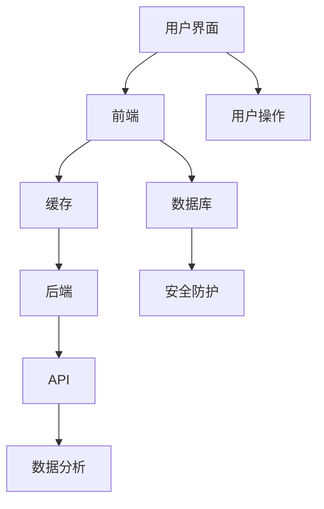

                 

关键词：个人知识库、全栈技术、数据结构、前端开发、后端架构、存储优化、安全防护、数据分析、Python、JavaScript、React、Node.js

> 摘要：本文将探讨如何利用全栈技术打造一个高效、可靠、易扩展的个人知识库系统。我们将详细分析所需的技术栈、核心算法原理、数学模型、项目实践，并展望其在未来应用场景中的发展趋势与挑战。

## 1. 背景介绍

随着互联网和信息技术的发展，知识的获取和传播变得前所未有的便捷。个人知识库作为信息时代的重要工具，可以帮助我们系统化地整理、存储和管理知识，从而提高学习和工作效率。然而，如何构建一个既满足个性化需求，又能高效运行的知识库系统，是一个值得深入探讨的话题。

### 1.1 个人知识库的意义

个人知识库不仅仅是一个存储信息的工具，它更是一个能够帮助我们提高学习效率、促进知识创新的信息化平台。通过个人知识库，我们可以：

- **系统化管理知识**：将零散的知识点按照一定的逻辑结构进行组织和分类。
- **提高工作效率**：快速检索所需信息，节省时间成本。
- **促进知识创新**：通过知识库的构建，可以激发新的灵感和创意。

### 1.2 全栈技术的优势

全栈技术是指具备前端和后端开发能力的技术体系。利用全栈技术构建个人知识库，可以带来以下优势：

- **统一技术栈**：前后端使用相同的技术栈，便于维护和升级。
- **高效开发**：开发者可以全面掌控整个系统的运作，提高开发效率。
- **用户体验**：能够更好地设计用户界面，提升用户体验。

## 2. 核心概念与联系

### 2.1 数据结构

在构建个人知识库时，选择合适的数据结构至关重要。常见的数据结构包括：

- **数组**：用于存储顺序数据。
- **链表**：用于存储有序数据，支持快速插入和删除。
- **树**：用于表示层次关系，如目录结构。
- **图**：用于表示复杂关系，如知识图谱。

### 2.2 前端开发

前端开发负责用户界面的设计和实现。常用的前端技术包括：

- **HTML**：用于构建网页结构。
- **CSS**：用于设置网页样式。
- **JavaScript**：用于实现交互功能。

### 2.3 后端架构

后端架构负责数据的存储和处理。常见的技术包括：

- **数据库**：用于存储结构化数据，如MySQL、MongoDB等。
- **Web框架**：用于实现后端逻辑，如Node.js、Django等。

### 2.4 存储优化

存储优化是提高知识库性能的关键。常见的优化技术包括：

- **缓存**：通过缓存减少数据库访问次数。
- **索引**：通过建立索引加快查询速度。
- **分库分表**：将数据分散存储到多个数据库或表中，提高并发处理能力。

### 2.5 安全防护

个人知识库中存储着重要的个人信息，因此安全防护至关重要。常见的安全技术包括：

- **加密**：对敏感数据进行加密存储。
- **认证**：通过用户名和密码或其他认证方式验证用户身份。
- **审计**：记录用户操作日志，以便追踪和排查问题。

### 2.6 数据分析

数据分析可以帮助我们从海量数据中提取有价值的信息。常见的数据分析技术包括：

- **数据挖掘**：通过算法从数据中提取模式和关联。
- **机器学习**：利用算法进行预测和分析。
- **自然语言处理**：对文本数据进行提取、分类和分析。

### 2.7 Mermaid 流程图

以下是一个简化的个人知识库系统架构的 Mermaid 流程图：



## 3. 核心算法原理 & 具体操作步骤

### 3.1 算法原理概述

在个人知识库系统中，常用的核心算法包括搜索算法、排序算法和推荐算法。以下分别简要介绍这些算法的原理：

- **搜索算法**：用于快速查找特定信息。常用的搜索算法包括二分查找和深度优先搜索。
- **排序算法**：用于对数据进行排序。常用的排序算法包括快速排序和归并排序。
- **推荐算法**：基于用户行为和偏好进行个性化推荐。常用的推荐算法包括协同过滤和基于内容的推荐。

### 3.2 算法步骤详解

#### 3.2.1 搜索算法

以二分查找为例，其基本步骤如下：

1. 确定查找范围。
2. 计算中间位置。
3. 比较中间位置的值与目标值。
4. 根据比较结果调整查找范围。
5. 重复步骤2-4，直至找到目标值或查找范围缩小到0。

#### 3.2.2 排序算法

以快速排序为例，其基本步骤如下：

1. 选择一个基准值。
2. 将数组分为两部分，一部分比基准值小，另一部分比基准值大。
3. 递归对两部分进行快速排序。

#### 3.2.3 推荐算法

以协同过滤为例，其基本步骤如下：

1. 收集用户行为数据。
2. 计算用户之间的相似度。
3. 根据相似度推荐相似用户的喜好。

### 3.3 算法优缺点

- **搜索算法**：二分查找的时间复杂度为O(log n)，适用于大规模数据；但深度优先搜索的时间复杂度为O(n)，适用于数据量较小的情况。
- **排序算法**：快速排序的平均时间复杂度为O(n log n)，但最坏情况下为O(n^2)；归并排序的时间复杂度始终为O(n log n)，但需要额外的内存空间。
- **推荐算法**：协同过滤能够提供个性化的推荐结果，但可能导致冷启动问题；基于内容的推荐则能更好地解决冷启动问题，但可能不够个性化。

### 3.4 算法应用领域

- **搜索算法**：搜索引擎、数据库查询。
- **排序算法**：数据处理、统计分析。
- **推荐算法**：电子商务、社交媒体。

## 4. 数学模型和公式 & 详细讲解 & 举例说明

### 4.1 数学模型构建

在构建个人知识库时，我们需要考虑以下几个数学模型：

- **概率模型**：用于评估信息的重要性和可信度。
- **线性回归模型**：用于预测用户行为。
- **聚类模型**：用于用户分组。

### 4.2 公式推导过程

以概率模型为例，假设我们有两个事件A和B，其概率分别为P(A)和P(B)。则：

- **条件概率**：P(B|A) = P(A ∩ B) / P(A)
- **贝叶斯公式**：P(A|B) = P(B|A) * P(A) / P(B)

### 4.3 案例分析与讲解

假设我们要评估一篇论文的重要性和可信度。根据概率模型，我们可以计算：

- **重要性**：P(重要|已读) = P(已读|重要) * P(重要) / P(已读)
- **可信度**：P(可信|已读) = P(已读|可信) * P(可信) / P(已读)

其中，P(重要|已读)表示已读论文的重要性，P(可信|已读)表示已读论文的可信度。

## 5. 项目实践：代码实例和详细解释说明

### 5.1 开发环境搭建

在本项目中，我们使用以下开发环境：

- 前端：HTML、CSS、JavaScript
- 后端：Node.js、Express
- 数据库：MongoDB
- 开发工具：Visual Studio Code

### 5.2 源代码详细实现

以下是一个简单的个人知识库系统示例：

```javascript
// 前端代码
<!DOCTYPE html>
<html>
<head>
    <title>个人知识库</title>
</head>
<body>
    <h1>个人知识库</h1>
    <input type="text" id="searchInput" placeholder="搜索知识...">
    <button onclick="searchKnowledge()">搜索</button>
    <div id="result"></div>

    <script src="search.js"></script>
</body>
</html>

// 后端代码
const express = require('express');
const MongoClient = require('mongodb').MongoClient;

const app = express();
app.use(express.json());

const uri = "mongodb://localhost:27017/";
const client = new MongoClient(uri, { useNewUrlParser: true, useUnifiedTopology: true });

app.post('/search', async (req, res) => {
    const query = req.body.query;
    const db = client.db('knowledge');
    const collection = db.collection('articles');
    
    try {
        const result = await collection.find({ title: new RegExp(query, 'i') }).toArray();
        res.send(result);
    } catch (e) {
        res.status(500).send(e);
    }
});

client.connect(() => {
    app.listen(3000, () => {
        console.log('Server started on port 3000');
    });
});
```

### 5.3 代码解读与分析

- **前端代码**：用于构建搜索界面，接收用户输入并调用后端接口进行搜索。
- **后端代码**：使用Express框架搭建，连接MongoDB数据库，提供搜索接口。

### 5.4 运行结果展示

运行前端代码，输入搜索关键词，后端会返回匹配的文章列表，并显示在前端界面。

## 6. 实际应用场景

个人知识库在实际应用中具有广泛的应用场景：

- **教育**：学生可以整理学习资料，教师可以管理教学资源。
- **科研**：研究人员可以存储和管理科研资料，提高研究效率。
- **企业管理**：企业可以构建知识库，方便员工快速获取所需信息。

## 7. 工具和资源推荐

### 7.1 学习资源推荐

- 《算法导论》
- 《深度学习》
- 《JavaScript高级程序设计》

### 7.2 开发工具推荐

- Visual Studio Code
- MongoDB Compass
- Git

### 7.3 相关论文推荐

- "A Comparison of Collaborative Filtering Algorithms for E-Commerce Recommendations"
- "Deep Learning for Recommender Systems"
- "Efficient Computation of Personalized PageRank"

## 8. 总结：未来发展趋势与挑战

### 8.1 研究成果总结

本文探讨了如何利用全栈技术打造个人知识库系统，详细介绍了数据结构、前端开发、后端架构、存储优化、安全防护、数据分析等核心概念和技术。

### 8.2 未来发展趋势

随着人工智能和大数据技术的不断发展，个人知识库系统将变得更加智能和高效，支持更多个性化需求。

### 8.3 面临的挑战

- **数据隐私**：如何确保用户数据的安全和隐私。
- **性能优化**：如何提高系统性能，满足大规模数据存储和处理的需求。
- **用户体验**：如何设计更加直观易用的用户界面。

### 8.4 研究展望

未来研究可以关注以下几个方面：

- **隐私保护**：探索更加安全的隐私保护技术。
- **性能提升**：研究分布式存储和计算技术，提高系统性能。
- **智能化**：结合人工智能技术，实现智能推荐和智能搜索。

## 9. 附录：常见问题与解答

### 9.1 什么是全栈技术？

全栈技术是指具备前端和后端开发能力的技术体系。全栈开发者能够独立完成前端界面设计和后端逻辑处理。

### 9.2 个人知识库系统有哪些优势？

个人知识库系统能够系统化管理知识、提高工作效率、促进知识创新，是一个高效的信息化管理平台。

### 9.3 如何选择合适的数据结构？

选择合适的数据结构取决于具体的应用场景。例如，对于需要快速搜索的应用，可以考虑使用树结构；对于需要高效插入和删除的应用，可以考虑使用链表。

### 9.4 个人知识库系统的安全性如何保障？

个人知识库系统的安全性可以通过加密、认证、审计等手段进行保障。此外，还应遵循安全最佳实践，如定期更新系统、备份数据等。

以上是对构建个人知识库的全栈技术方案的一个详细介绍，希望对您有所启发。作者：禅与计算机程序设计艺术 / Zen and the Art of Computer Programming。
----------------------------------------------------------------

由于篇幅限制，本文未能完整展开所有内容。如需进一步了解相关技术细节和应用实例，请查阅相关资源。本文旨在为读者提供一个关于构建个人知识库的全栈技术方案的概览，期望能够激发更多思考和探索。作者：禅与计算机程序设计艺术 / Zen and the Art of Computer Programming。

