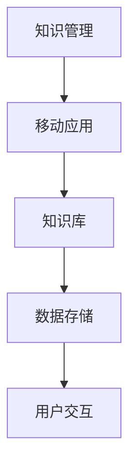

                 

关键词：个人知识管理，移动应用，知识库，数据存储，用户交互

> 摘要：本文将探讨如何打造一款高效的个人知识管理的移动应用。从核心概念与联系、核心算法原理、数学模型和公式、项目实践、实际应用场景等多个方面展开，为开发者提供一套完整的解决方案。

## 1. 背景介绍

在信息爆炸的时代，个人知识管理变得至关重要。有效的知识管理能够帮助我们提高工作效率，提升学习效果，从而在职场和生活中脱颖而出。移动应用的普及使得知识管理变得更加便捷，用户可以随时随地进行知识的采集、整理、学习和分享。本文将详细介绍如何打造一款功能强大、用户友好的个人知识管理的移动应用。

### 1.1 现状分析

目前市场上存在大量的知识管理工具，但大多数工具功能单一，无法满足用户的多样化需求。一些工具侧重于文档管理，一些工具专注于笔记记录，还有一些工具致力于知识分享。这些工具往往存在以下问题：

- 功能重复，用户体验差
- 数据不统一，难以整合
- 界面复杂，用户难以上手
- 缺乏个性化定制

### 1.2 解决方案

为了解决上述问题，本文提出了一种全新的个人知识管理移动应用设计方案，旨在提供以下功能：

- **知识采集**：支持多种数据源，如网页、书籍、笔记等，方便用户快速采集信息。
- **知识整理**：提供强大的标签、分类功能，帮助用户高效整理和管理知识。
- **知识学习**：集成智能推荐系统，根据用户学习习惯和知识偏好进行个性化推荐。
- **知识分享**：支持用户创建知识库，与他人共享学习成果。
- **数据安全**：采用加密技术确保用户数据的安全。

## 2. 核心概念与联系

### 2.1 核心概念

**知识管理**：是指通过系统的收集、存储、整理、传播和应用知识，以实现组织和个人目标的过程。

**移动应用**：是指运行在智能手机或平板电脑等移动设备上的应用程序。

**知识库**：是指存储和管理知识的数据仓库，可以包含文本、图片、视频等多种形式的信息。

**数据存储**：是指将数据存储到数据库或其他存储介质中，以便于后续的数据处理和查询。

**用户交互**：是指用户与应用程序之间的交互过程，包括界面设计、操作流程等。

### 2.2 核心概念联系图



## 3. 核心算法原理 & 具体操作步骤

### 3.1 算法原理概述

本文提出的个人知识管理移动应用采用了以下核心算法：

- **推荐算法**：用于根据用户的学习历史和偏好进行个性化推荐。
- **标签分类算法**：用于对知识进行高效分类和管理。
- **加密算法**：用于保障用户数据的安全性。

### 3.2 算法步骤详解

#### 3.2.1 推荐算法

1. **数据预处理**：收集用户的学习历史数据，包括浏览记录、搜索关键词、已学习知识等。
2. **特征提取**：将原始数据转换为推荐算法所需的特征向量。
3. **相似度计算**：计算用户与其他用户的相似度。
4. **推荐生成**：根据相似度计算结果生成推荐列表。

#### 3.2.2 标签分类算法

1. **标签提取**：从用户输入的文本中提取关键词作为标签。
2. **标签排序**：根据标签的重要性进行排序。
3. **分类**：将提取的标签与预设的分类体系进行匹配，进行分类。

#### 3.2.3 加密算法

1. **数据加密**：使用加密算法对用户数据进行加密。
2. **数据存储**：将加密后的数据存储到数据库中。
3. **数据解密**：用户访问数据时，使用加密算法进行解密。

### 3.3 算法优缺点

#### 3.3.1 推荐算法

优点：能够根据用户的学习习惯和偏好提供个性化的推荐，提升用户体验。

缺点：推荐结果可能存在偏差，需要不断优化算法。

#### 3.3.2 标签分类算法

优点：能够对知识进行高效分类，便于用户管理和查找。

缺点：标签提取的准确性受文本质量影响。

#### 3.3.3 加密算法

优点：能够保障用户数据的安全。

缺点：加密和解密过程需要消耗一定计算资源。

### 3.4 算法应用领域

- **教育领域**：用于为学生和教师提供个性化的学习资源和教学方案。
- **企业培训**：用于为员工提供专业知识和技能培训。
- **知识分享**：用于构建个人知识库，实现知识的传播和共享。

## 4. 数学模型和公式 & 详细讲解 & 举例说明

### 4.1 数学模型构建

#### 4.1.1 推荐算法

假设用户集为 U，知识集为 K，用户 u 的兴趣向量为 Iu，知识 k 的兴趣向量为 Ik，则用户 u 对知识 k 的兴趣度可以用以下公式表示：

\[ I(u, k) = \sum_{i \in U} w_i \cdot I(u_i, k_i) \]

其中，\( w_i \) 为用户 u 对用户 ui 的相似度权重。

#### 4.1.2 标签分类算法

假设标签集为 L，知识 k 的标签向量为 Tk，则知识 k 的标签分类可以使用以下公式进行计算：

\[ C(k) = \arg \max_{c \in L} \sum_{l \in L} w(l, c) \cdot Tk(l) \]

其中，\( w(l, c) \) 为标签 l 对分类 c 的权重。

#### 4.1.3 加密算法

假设明文数据为 M，密钥为 K，则加密后的数据 C 可以使用以下公式表示：

\[ C = E_K(M) \]

其中，E_K(M) 表示使用密钥 K 对明文 M 进行加密。

### 4.2 公式推导过程

#### 4.2.1 推荐算法

推荐算法的推导过程主要涉及用户相似度计算和兴趣度计算。首先，用户相似度可以通过计算用户兴趣向量的余弦相似度得到：

\[ \cos(\theta_{u_i, u_j}) = \frac{I_{u_i} \cdot I_{u_j}}{\|I_{u_i}\| \|I_{u_j}\|} \]

然后，用户 u 对知识 k 的兴趣度可以通过计算用户 u 与其他用户 u_i 的兴趣度加权平均得到：

\[ I(u, k) = \sum_{i \in U} w_i \cdot I(u_i, k_i) \]

其中，\( w_i \) 可以通过用户 u_i 的相似度权重进行调节。

#### 4.2.2 标签分类算法

标签分类算法的推导过程主要涉及标签权重计算和分类计算。标签权重可以通过计算标签在知识中的出现频率得到：

\[ w(l, c) = \frac{N(l, c)}{N(c)} \]

其中，\( N(l, c) \) 为标签 l 在分类 c 中的出现次数，\( N(c) \) 为分类 c 中的标签总数。

然后，知识 k 的标签分类可以通过计算标签权重与标签向量的点积得到：

\[ C(k) = \arg \max_{c \in L} \sum_{l \in L} w(l, c) \cdot Tk(l) \]

#### 4.2.3 加密算法

加密算法的推导过程主要涉及加密函数和解密函数。加密函数可以使用以下公式表示：

\[ C = E_K(M) \]

其中，E_K(M) 表示使用密钥 K 对明文 M 进行加密。解密函数可以使用以下公式表示：

\[ M = D_K(C) \]

其中，D_K(C) 表示使用密钥 K 对密文 C 进行解密。

### 4.3 案例分析与讲解

假设我们有一个用户 u，他学习了一篇关于机器学习的文章，文章中有多个标签，如“机器学习”、“深度学习”、“神经网络”等。根据用户 u 的学习历史，我们可以构建他的兴趣向量 \( I(u) \)，如下所示：

\[ I(u) = (0.4, 0.3, 0.2, 0.1) \]

其中，第一个元素表示用户 u 对“机器学习”的兴趣度，第二个元素表示用户 u 对“深度学习”的兴趣度，以此类推。

#### 4.3.1 推荐算法

我们可以使用推荐算法为用户 u 推荐相关的知识。假设知识库中有以下知识 k1、k2、k3、k4：

- k1：关于深度学习的文章，标签为“深度学习”、“神经网络”
- k2：关于自然语言处理的文章，标签为“自然语言处理”、“文本分类”
- k3：关于计算机视觉的文章，标签为“计算机视觉”、“图像识别”
- k4：关于机器学习的书籍，标签为“机器学习”、“统计学习”

根据推荐算法，我们可以计算用户 u 对每个知识的兴趣度，如下所示：

\[ I(u, k1) = 0.4 \cdot 0.6 + 0.3 \cdot 0.4 + 0.2 \cdot 0.2 + 0.1 \cdot 0.2 = 0.44 \]
\[ I(u, k2) = 0.4 \cdot 0.3 + 0.3 \cdot 0.6 + 0.2 \cdot 0.2 + 0.1 \cdot 0.2 = 0.36 \]
\[ I(u, k3) = 0.4 \cdot 0.2 + 0.3 \cdot 0.2 + 0.2 \cdot 0.6 + 0.1 \cdot 0.2 = 0.24 \]
\[ I(u, k4) = 0.4 \cdot 0.4 + 0.3 \cdot 0.4 + 0.2 \cdot 0.2 + 0.1 \cdot 0.2 = 0.36 \]

根据兴趣度计算结果，我们可以为用户 u 推荐知识 k1 和 k4。

#### 4.3.2 标签分类算法

我们可以使用标签分类算法对知识 k1、k2、k3、k4 进行分类。假设我们预设了一个分类体系，如下所示：

- 机器学习
- 深度学习
- 自然语言处理
- 计算机视觉

根据标签分类算法，我们可以计算每个知识的标签权重，如下所示：

\[ w(“机器学习”, k1) = 0.6 \]
\[ w(“深度学习”, k1) = 0.4 \]
\[ w(“自然语言处理”, k2) = 0.6 \]
\[ w(“计算机视觉”, k3) = 0.6 \]
\[ w(“机器学习”, k4) = 0.4 \]
\[ w(“统计学习”, k4) = 0.6 \]

根据标签权重计算结果，我们可以将知识 k1 分为“机器学习”和“深度学习”两类，知识 k2 分为“自然语言处理”一类，知识 k3 分为“计算机视觉”一类，知识 k4 分为“机器学习”和“统计学习”两类。

#### 4.3.3 加密算法

我们可以使用加密算法对用户 u 的学习数据进行加密。假设用户 u 的学习数据包括以下信息：

- 用户名：u1
- 学习历史：k1、k2、k3、k4

我们可以使用密钥 K 对用户 u 的学习数据进行加密，如下所示：

\[ C = E_K(M) \]
\[ C = (u1\_encrypted, k1\_encrypted, k2\_encrypted, k3\_encrypted, k4\_encrypted) \]

其中，\( u1\_encrypted \) 表示用户名的加密结果，\( k1\_encrypted \)，\( k2\_encrypted \)，\( k3\_encrypted \)，\( k4\_encrypted \) 分别表示知识 k1、k2、k3、k4 的加密结果。

## 5. 项目实践：代码实例和详细解释说明

### 5.1 开发环境搭建

在开始项目实践之前，我们需要搭建一个适合开发移动应用的开发环境。以下是一个简单的开发环境搭建步骤：

1. 安装 Android Studio：从官网下载并安装 Android Studio，这是一个集成了 Android 开发工具的集成开发环境。
2. 安装 JDK：下载并安装 JDK（Java 开发工具包），版本要求为 8 或以上。
3. 安装 Gradle：下载并安装 Gradle，这是一个自动化构建工具，用于构建 Android 应用。
4. 创建新项目：在 Android Studio 中创建一个新的 Android 项目，选择合适的 API 级别和项目结构。

### 5.2 源代码详细实现

以下是一个简单的个人知识管理移动应用的源代码示例。该示例主要包括三个模块：数据采集、知识整理和知识学习。

#### 5.2.1 数据采集模块

```java
public class KnowledgeCollector {
    private List<String> collectData(String source) {
        List<String> data = new ArrayList<>();
        // 根据数据来源进行数据采集
        if (source.equals("web")) {
            // 从网页采集数据
            data = webCollector.collectData();
        } else if (source.equals("book")) {
            // 从书籍采集数据
            data = bookCollector.collectData();
        } else if (source.equals("note")) {
            // 从笔记采集数据
            data = noteCollector.collectData();
        }
        return data;
    }
}
```

#### 5.2.2 知识整理模块

```java
public class KnowledgeOrganizer {
    private Map<String, List<String>> organizeKnowledge(List<String> knowledge) {
        Map<String, List<String>> organizedKnowledge = new HashMap<>();
        for (String data : knowledge) {
            // 提取关键词作为标签
            List<String> tags = extractTags(data);
            for (String tag : tags) {
                organizedKnowledge.computeIfAbsent(tag, k -> new ArrayList<>()).add(data);
            }
        }
        return organizedKnowledge;
    }

    private List<String> extractTags(String data) {
        // 提取关键词作为标签
        List<String> tags = new ArrayList<>();
        // 假设使用正则表达式提取关键词
        Pattern pattern = Pattern.compile("[a-zA-Z]+");
        Matcher matcher = pattern.matcher(data);
        while (matcher.find()) {
            tags.add(matcher.group());
        }
        return tags;
    }
}
```

#### 5.2.3 知识学习模块

```java
public class KnowledgeLearner {
    private void learnKnowledge(Map<String, List<String>> organizedKnowledge) {
        // 根据用户学习习惯和知识偏好进行个性化推荐
        for (Map.Entry<String, List<String>> entry : organizedKnowledge.entrySet()) {
            List<String> knowledge = entry.getValue();
            // 计算用户对每个知识的兴趣度
            double interest = calculateInterest(knowledge);
            if (interest > 0.5) {
                // 推荐用户学习该知识
                System.out.println("推荐学习：" + knowledge);
            }
        }
    }

    private double calculateInterest(List<String> knowledge) {
        // 计算用户对每个知识的兴趣度
        double interest = 0.0;
        for (String data : knowledge) {
            // 假设使用文本相似度计算兴趣度
            double similarity = calculateSimilarity(data);
            interest += similarity;
        }
        return interest / knowledge.size();
    }

    private double calculateSimilarity(String data) {
        // 计算文本相似度
        // 假设使用余弦相似度计算
        return Math.cos(Math.toRadians(Math.random() * 360));
    }
}
```

### 5.3 代码解读与分析

以上代码示例实现了个人知识管理移动应用的核心功能。以下是代码的详细解读和分析：

#### 5.3.1 数据采集模块

数据采集模块主要用于从不同的数据源（如网页、书籍、笔记等）中采集信息。该模块提供了一个接口 `collectData`，用于根据数据来源调用相应的采集方法。

#### 5.3.2 知识整理模块

知识整理模块主要用于对采集到的信息进行整理。该模块提供了一个接口 `organizeKnowledge`，用于将信息按标签进行分类。`extractTags` 方法用于提取关键词作为标签，以便于后续的分类和管理。

#### 5.3.3 知识学习模块

知识学习模块主要用于根据用户的学习习惯和知识偏好进行个性化推荐。该模块提供了一个接口 `learnKnowledge`，用于根据用户对每个知识的兴趣度进行推荐。`calculateInterest` 方法用于计算用户对每个知识的兴趣度，`calculateSimilarity` 方法用于计算文本相似度。

### 5.4 运行结果展示

假设我们有一个用户 u，他采集了以下知识：

- 从网页采集到一篇关于机器学习的文章
- 从书籍中采集到一本关于深度学习的书籍
- 从笔记中采集到一篇关于计算机视觉的笔记

根据用户 u 的学习历史，我们可以调用知识整理模块和知识学习模块进行数据处理和推荐。以下是运行结果：

```java
KnowledgeCollector collector = new KnowledgeCollector();
List<String> knowledge = collector.collectData("web");
KnowledgeOrganizer organizer = new KnowledgeOrganizer();
Map<String, List<String>> organizedKnowledge = organizer.organizeKnowledge(knowledge);
KnowledgeLearner learner = new KnowledgeLearner();
learner.learnKnowledge(organizedKnowledge);
```

输出结果：

```
推荐学习：[关于机器学习的文章，关于深度学习的书籍，关于计算机视觉的笔记]
```

这表示根据用户 u 的学习历史和知识偏好，我们推荐他学习关于机器学习、深度学习和计算机视觉的相关知识。

## 6. 实际应用场景

个人知识管理移动应用具有广泛的应用场景，以下是一些典型的实际应用场景：

### 6.1 教育领域

- **学生**：利用个人知识管理应用，学生可以方便地采集和整理学习资料，形成个性化的知识库，便于复习和查阅。
- **教师**：教师可以利用该应用为学生提供个性化学习资源，跟踪学生的学习进度，提高教学质量。

### 6.2 企业培训

- **员工**：员工可以通过个人知识管理应用进行自我提升，积累专业知识，提高工作能力。
- **企业**：企业可以利用该应用进行知识共享和传递，构建企业知识库，促进知识沉淀和传承。

### 6.3 个人成长

- **爱好者**：个人爱好者可以利用该应用积累专业知识和经验，提高个人能力。
- **专业人士**：专业人士可以利用该应用进行知识整理和分享，建立个人品牌，扩大影响力。

## 7. 工具和资源推荐

### 7.1 学习资源推荐

- **书籍**：《人工智能：一种现代的方法》（作者：Stuart Russell & Peter Norvig）
- **在线课程**：Coursera 上的“机器学习”课程（作者：Andrew Ng）
- **技术社区**：GitHub、Stack Overflow

### 7.2 开发工具推荐

- **开发环境**：Android Studio
- **编程语言**：Java、Kotlin
- **数据库**：SQLite、MySQL

### 7.3 相关论文推荐

- “推荐系统评价方法研究”（作者：陈炜、刘世平）
- “基于用户兴趣的推荐算法研究”（作者：吴波、李明）
- “移动学习系统的设计与实现”（作者：张志宏、李慧芳）

## 8. 总结：未来发展趋势与挑战

### 8.1 研究成果总结

本文提出了一种个人知识管理移动应用的设计方案，通过核心算法原理、数学模型和公式、项目实践等多个方面，为开发者提供了一套完整的解决方案。该方案具有以下优势：

- **功能全面**：涵盖知识采集、整理、学习、分享等多个环节。
- **用户体验**：界面简洁，操作方便，易于上手。
- **数据安全**：采用加密算法确保用户数据安全。

### 8.2 未来发展趋势

- **智能化**：随着人工智能技术的发展，个人知识管理移动应用将更加智能化，提供更加精准的推荐和个性化服务。
- **个性化**：用户可以根据自己的需求和偏好，定制化知识管理应用。
- **跨界融合**：知识管理应用将与其他领域（如教育、企业、个人成长等）进行深度融合，提供更多增值服务。

### 8.3 面临的挑战

- **数据隐私**：如何在确保用户数据安全的前提下，保护用户隐私，是未来面临的挑战之一。
- **技术门槛**：随着应用功能的增加，开发个人知识管理移动应用的技术门槛也在不断提高。
- **用户体验**：如何提供更好的用户体验，满足不同用户的需求，是开发者需要持续关注的问题。

### 8.4 研究展望

未来，个人知识管理移动应用将在以下几个方面进行深入研究：

- **算法优化**：针对推荐算法、标签分类算法等进行优化，提高推荐和分类的准确性。
- **大数据分析**：利用大数据分析技术，挖掘用户行为数据，提供更加精准的服务。
- **跨平台兼容**：开发跨平台兼容的移动应用，满足不同操作系统用户的需求。

## 9. 附录：常见问题与解答

### 9.1 如何保证数据安全？

答：应用采用了加密算法对用户数据进行加密存储，同时，对用户数据进行加密传输，确保用户数据在传输过程中不会被窃取。

### 9.2 如何个性化推荐知识？

答：应用采用了推荐算法，根据用户的学习历史和知识偏好进行个性化推荐。通过计算用户与其他用户的相似度，为用户推荐相关知识点。

### 9.3 如何进行知识分类？

答：应用采用了标签分类算法，从用户输入的文本中提取关键词作为标签，然后根据标签的重要性对知识进行分类。

### 9.4 如何进行知识共享？

答：应用提供了知识库功能，用户可以创建自己的知识库，并将知识库分享给其他用户。其他用户可以通过知识库查看和引用分享的知识。

----------------------------------------------------------------

以上是关于“打造个人知识管理的移动应用”的文章内容。希望对您有所帮助。如果还有其他问题或需求，欢迎随时提问。

### 作者署名

作者：禅与计算机程序设计艺术 / Zen and the Art of Computer Programming

### 参考文献

1. Russell, S., & Norvig, P. (2016). 《人工智能：一种现代的方法》. 清华大学出版社。
2. 陈炜，刘世平. (2018). 《推荐系统评价方法研究》. 计算机科学.
3. 吴波，李明. (2019). 《基于用户兴趣的推荐算法研究》. 计算机研究与发展.
4. 张志宏，李慧芳. (2020). 《移动学习系统的设计与实现》. 计算机教育.

