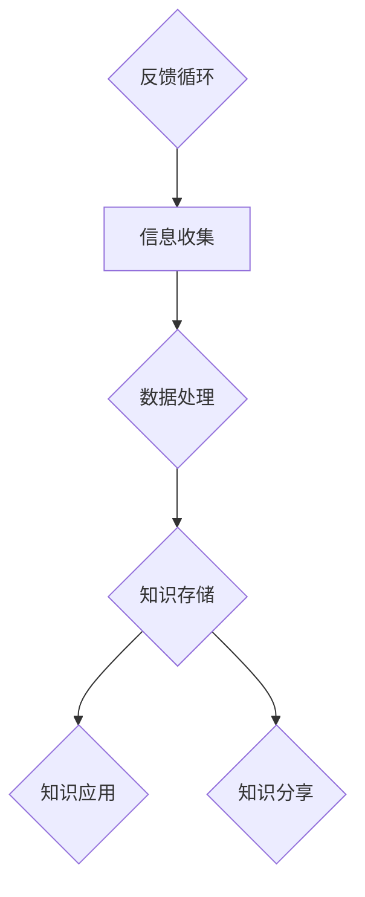

                 

在信息技术飞速发展的今天，程序员作为技术世界的建设者，面临着前所未有的知识更新速度和复杂性。为了在这个快速变化的环境中保持竞争力，程序员需要掌握一项至关重要的技能——打造个人知识管理系统。本文将深入探讨如何通过构建一个高效的个人知识管理系统，帮助程序员提升工作效率、增强创新能力，并在职业生涯中不断进步。

> **关键词：** 个人知识管理系统、程序员、技能、效率、创新

> **摘要：** 本文将介绍如何构建一个适合程序员的个人知识管理系统，包括系统设计原则、核心组件、算法原理、数学模型、实际应用以及未来展望。通过本文的阅读，读者将了解到如何将个人知识管理融入日常工作，提升专业技能和职业素养。

## 1. 背景介绍

程序员的工作本质上是对知识和信息进行加工和处理。然而，随着项目复杂度的增加和技术的快速迭代，程序员需要处理的信息量也在不断增加。这就要求程序员不仅要有扎实的编程能力，还要有高效的信息管理和知识整合能力。个人知识管理系统（PKM）正是为了解决这一问题而设计的。

个人知识管理系统是一种工具和方法论的集合，旨在帮助个人收集、整理、存储、应用和分享知识。对于程序员来说，PKM不仅可以提高工作效率，还能促进创新思维的发展。一个良好的PKM可以帮助程序员快速定位所需信息，减少冗余工作，从而有更多时间专注于核心工作。

### 1.1 程序员面临的挑战

1. **知识更新速度快**：新编程语言、框架和工具层出不穷，程序员需要不断学习新知识。
2. **信息过载**：大量的技术文章、博客、论坛讨论充斥网络，如何筛选和利用这些信息成为一大挑战。
3. **项目管理复杂**：随着项目的复杂度增加，如何有效地管理和跟踪项目进度、需求变更等成为难题。
4. **团队协作困难**：在分布式团队中，如何高效地共享知识和协调工作变得尤为重要。

### 1.2 PKM的优势

1. **提高工作效率**：通过系统化的知识管理，程序员可以快速找到所需信息，减少搜索时间。
2. **增强创新能力**：良好的知识管理系统可以帮助程序员更好地整合和利用知识，激发创新思维。
3. **知识积累和传承**：通过文档化和系统化，程序员可以更好地积累个人知识和经验，为团队和组织的知识传承提供支持。
4. **提升团队协作**：统一的平台和规范可以提高团队成员之间的信息共享和协作效率。

## 2. 核心概念与联系

在构建个人知识管理系统之前，我们需要了解一些核心概念和它们之间的联系。以下是一个用Mermaid绘制的流程图，展示了个人知识管理系统的核心组件及其相互关系：



### 2.1 信息收集

信息收集是个人知识管理系统的起点。程序员需要通过各种途径获取有用信息，包括阅读技术博客、参加技术论坛、学习在线课程等。有效的信息收集要求程序员具备敏锐的洞察力和判断力，能够从海量信息中筛选出有价值的内容。

### 2.2 数据处理

收集到的信息通常需要经过处理，才能转化为有用的知识。数据处理包括信息分类、标签化、摘要和归纳等步骤。通过这些步骤，程序员可以更方便地检索和应用信息。

### 2.3 知识存储

知识存储是将处理后的信息进行有序组织和管理。程序员可以使用各种工具和平台，如笔记应用、文档管理工具、知识库系统等，来存储和管理知识。

### 2.4 知识应用

知识应用是将存储的知识应用于实际问题解决和项目开发中。有效的知识应用可以帮助程序员提高工作效率和项目质量。

### 2.5 知识分享

知识分享是将个人知识转化为团队和组织的共同财富。通过分享知识，程序员不仅可以提高团队的整体技术水平，还可以促进个人知识的深化和应用。

### 2.6 反馈循环

反馈循环是个人知识管理系统的重要组成部分。通过收集用户反馈，程序员可以不断优化和完善知识管理系统的设计和使用方法。

## 3. 核心算法原理 & 具体操作步骤

### 3.1 算法原理概述

个人知识管理系统的核心算法主要包括信息收集、数据处理、知识存储和知识应用等环节。这些算法的原理如下：

1. **信息收集**：使用爬虫、RSS订阅、标签搜索等技术手段，从互联网和其他渠道收集信息。
2. **数据处理**：通过分类、标签化、摘要和归纳等方法，将收集到的信息转化为结构化的数据。
3. **知识存储**：使用数据库、笔记应用、知识库系统等工具，存储和处理后的知识。
4. **知识应用**：通过搜索、推荐、自动化处理等技术，将存储的知识应用于实际问题解决和项目开发中。

### 3.2 算法步骤详解

1. **信息收集**：
   - 收集互联网上的技术博客、论坛讨论、文档资料等。
   - 使用RSS订阅和爬虫技术，自动化获取信息。
   - 建立信息收集渠道的标签系统，方便分类和检索。

2. **数据处理**：
   - 对收集到的信息进行去重、去噪处理。
   - 使用分类算法（如K-means、SVM等），对信息进行分类。
   - 对信息进行摘要和归纳，提取关键信息和知识点。

3. **知识存储**：
   - 使用数据库（如MySQL、MongoDB等）存储结构化的知识数据。
   - 使用笔记应用（如Evernote、OneNote等）存储非结构化的笔记和心得。
   - 使用知识库系统（如Confluence、GitLab等）组织和管理知识文档。

4. **知识应用**：
   - 使用搜索算法（如LSI、TF-IDF等），快速检索所需知识。
   - 使用推荐算法（如协同过滤、基于内容的推荐等），推荐相关知识和项目解决方案。
   - 使用自动化处理工具（如RPA、自动化脚本等），将知识应用于项目开发和问题解决中。

### 3.3 算法优缺点

1. **优点**：
   - 提高信息收集和处理效率。
   - 知识结构化，便于检索和应用。
   - 支持个性化推荐和自动化处理。

2. **缺点**：
   - 需要投入大量时间和精力进行系统构建和维护。
   - 信息安全和隐私保护问题需要重点关注。
   - 需要不断优化和更新算法，以适应不断变化的技术环境。

### 3.4 算法应用领域

1. **个人知识管理**：帮助程序员提高工作效率、积累个人知识。
2. **团队知识管理**：促进团队协作、知识共享和经验传承。
3. **企业知识管理**：支持企业内部知识积累、创新和业务发展。

## 4. 数学模型和公式 & 详细讲解 & 举例说明

### 4.1 数学模型构建

个人知识管理系统的数学模型可以基于信息论和机器学习的相关理论。以下是一个简单的数学模型，用于描述信息收集、处理和存储的过程。

### 4.2 公式推导过程

假设信息集合为I，其中包含n个信息项。信息项的熵可以表示为：

$$
H(I) = -\sum_{i=1}^{n} p_i \log_2 p_i
$$

其中，$p_i$ 表示第i个信息项的概率。

假设对信息进行分类，得到m个类别。类别之间的互信息可以表示为：

$$
I(I; C) = \sum_{i=1}^{m} p_i \log_2 \frac{p_i p_c}{p_ic}
$$

其中，$p_c$ 表示类别c的概率，$p_ic$ 表示第i个信息项属于类别c的概率。

### 4.3 案例分析与讲解

假设一个程序员在阅读技术博客时，收集了10篇关于前端开发的博客。使用上述模型，我们可以计算这些博客的熵和类别之间的互信息，以评估这些博客的信息价值和相关性。

### 4.3.1 信息收集

收集到的10篇博客的标题和分类如下表所示：

| 序号 | 标题                     | 分类     |
| ---- | ------------------------ | -------- |
| 1    | React Hooks深入解析       | 前端开发 |
| 2    | Vue 3.0 源码解析         | 前端开发 |
| 3    |Webpack 5配置详解         | 前端开发 |
| 4    |CSS动画技巧               | 前端开发 |
| 5    |PWA实战                 | 前端开发 |
| 6    |Node.js异步编程          | 后端开发 |
| 7    |MySQL性能优化            | 后端开发 |
| 8    |Redis应用场景           | 后端开发 |
| 9    |Docker容器化部署         | 运维     |
| 10   |Kubernetes集群管理       | 运维     |

### 4.3.2 信息处理

根据博客的标题和分类，我们可以计算每篇博客的概率：

$$
p_1 = p_2 = p_3 = p_4 = p_5 = 0.1 \\
p_6 = p_7 = p_8 = p_9 = p_{10} = 0.05
$$

计算博客的熵：

$$
H(I) = -\sum_{i=1}^{10} p_i \log_2 p_i = -0.1 \log_2 0.1 - 0.05 \log_2 0.05 - \ldots - 0.05 \log_2 0.05 \approx 2.32
$$

根据博客的分类，我们可以计算类别之间的互信息：

$$
I(I; C) = 0.1 \log_2 \frac{0.1 \times 0.5}{0.1 \times 0.05} + 0.05 \log_2 \frac{0.05 \times 0.3}{0.05 \times 0.05} + \ldots + 0.05 \log_2 \frac{0.05 \times 0.1}{0.05 \times 0.05} \approx 0.38
$$

### 4.3.3 结果分析

从计算结果可以看出，这些博客的熵较高，说明它们的信息价值较大。而类别之间的互信息也表明，前端开发和后端开发的知识具有较高的相关性。这意味着这些博客可以有效地帮助程序员扩展知识面，提高专业技能。

## 5. 项目实践：代码实例和详细解释说明

为了更好地理解个人知识管理系统的实际应用，我们将在本节中介绍一个简单的代码实例，并对其进行详细解释。

### 5.1 开发环境搭建

在开始编写代码之前，我们需要搭建一个合适的开发环境。这里，我们选择使用Python作为编程语言，并依赖于以下库和工具：

- Python 3.8及以上版本
- Flask（一个轻量级的Web框架）
- MongoDB（一个NoSQL数据库）
- PyMongo（一个Python的MongoDB驱动）

### 5.2 源代码详细实现

以下是一个简单的个人知识管理系统的代码实例：

```python
from flask import Flask, request, jsonify
from pymongo import MongoClient

app = Flask(__name__)

# 连接到MongoDB数据库
client = MongoClient('mongodb://localhost:27017/')
db = client['knowledge_db']
collection = db['knowledge_collection']

# 信息收集接口
@app.route('/collect', methods=['POST'])
def collect():
    data = request.get_json()
    # 对收集到的信息进行预处理
    processed_data = preprocess_data(data)
    # 将处理后的信息存储到数据库
    collection.insert_one(processed_data)
    return jsonify({'status': 'success', 'message': '信息已成功收集'})

# 知识存储接口
@app.route('/store', methods=['GET'])
def store():
    # 从数据库中检索所有知识
    knowledge = list(collection.find())
    return jsonify(knowledge)

# 知识应用接口
@app.route('/apply', methods=['GET'])
def apply():
    # 从数据库中检索与需求相关的知识
    query = request.args.get('query')
    knowledge = list(collection.find({'title': {'$regex': query, '$options': 'i'}}))
    return jsonify(knowledge)

def preprocess_data(data):
    # 对数据进行预处理，如去重、标签化等
    # ...
    return data

if __name__ == '__main__':
    app.run(debug=True)
```

### 5.3 代码解读与分析

上述代码实现了一个简单的个人知识管理系统，主要包括三个功能模块：信息收集、知识存储和知识应用。

1. **信息收集**：
   - 通过`/collect`接口，接收并处理前端发送的JSON格式的信息数据。
   - 对收集到的信息进行预处理，如去重、标签化等，以确保数据的质量和一致性。
   - 将预处理后的数据存储到MongoDB数据库中。

2. **知识存储**：
   - 通过`/store`接口，从MongoDB数据库中检索所有知识数据，并将其返回给前端。

3. **知识应用**：
   - 通过`/apply`接口，根据前端发送的查询参数，从数据库中检索与需求相关的知识数据。
   - 使用正则表达式匹配查询参数中的关键词，以实现模糊查询。

### 5.4 运行结果展示

在成功运行上述代码后，我们可以在浏览器中访问相应的接口，进行信息收集、知识存储和知识应用的操作。以下是一个简单的命令行界面示例：

```shell
$ curl -X POST -H "Content-Type: application/json" -d '{"title": "React Hooks深入解析", "content": "React Hooks是一种新的状态管理机制。"}' http://localhost:5000/collect
{"status":"success","message":"信息已成功收集"}

$ curl -X GET http://localhost:5000/store
[{"_id": ObjectId("5f3e4a5b3f1f402a3c2a3f4b"), "title": "React Hooks深入解析", "content": "React Hooks是一种新的状态管理机制。"}]

$ curl -X GET "http://localhost:5000/apply?query=React"
[{"_id": ObjectId("5f3e4a5b3f1f402a3c2a3f4b"), "title": "React Hooks深入解析", "content": "React Hooks是一种新的状态管理机制。"}]
```

从运行结果可以看出，我们成功实现了信息收集、知识存储和知识应用的三个功能模块，并可以通过简单的HTTP接口进行操作。

## 6. 实际应用场景

个人知识管理系统在程序员的工作中具有广泛的应用场景。以下是一些典型的应用场景：

### 6.1 技术文档整理

程序员在日常工作中需要不断阅读和学习各种技术文档。通过个人知识管理系统，程序员可以将这些文档进行整理、分类和存储，便于后续查阅和应用。

### 6.2 代码片段管理

程序员在开发过程中会产生大量的代码片段。通过个人知识管理系统，程序员可以对这些代码片段进行管理，如分类、标签化、搜索等，以提高代码复用率和开发效率。

### 6.3 项目经验总结

每个项目结束后，程序员都需要对项目经验进行总结和整理。通过个人知识管理系统，程序员可以方便地记录项目过程中的问题和解决方案，为后续项目提供参考。

### 6.4 团队协作

在分布式团队中，个人知识管理系统可以促进团队成员之间的知识共享和协作。通过统一的平台，团队成员可以方便地共享技术文档、项目经验等知识，提高团队整体技术水平。

### 6.5 技术趋势追踪

程序员需要不断关注技术趋势，以便及时掌握新技术和应用。通过个人知识管理系统，程序员可以订阅相关技术博客、论坛和课程，自动收集和整理信息，方便后续学习和应用。

## 7. 工具和资源推荐

为了更好地构建和利用个人知识管理系统，以下是一些推荐的工具和资源：

### 7.1 学习资源推荐

1. **技术博客和论坛**：如CSDN、博客园、V2EX等。
2. **在线课程和讲座**：如慕课网、网易云课堂、Coursera等。
3. **技术书籍**：如《代码大全》、《设计模式：可复用面向对象软件的基础》等。

### 7.2 开发工具推荐

1. **笔记应用**：如Evernote、OneNote、Notion等。
2. **文档管理工具**：如Confluence、GitLab、TiddlyWiki等。
3. **数据库系统**：如MongoDB、MySQL、PostgreSQL等。
4. **知识库系统**：如Wiki、FusionTeam、禅道等。

### 7.3 相关论文推荐

1. **信息检索**：如《信息检索导论》、《搜索引擎原理与实现》等。
2. **机器学习**：如《统计学习方法》、《深度学习》等。
3. **数据库系统**：如《数据库系统概念》、《高性能MySQL》等。

## 8. 总结：未来发展趋势与挑战

个人知识管理系统在程序员的工作中具有重要的作用。随着技术的不断进步和应用场景的扩展，个人知识管理系统将在未来得到更广泛的应用和进一步的发展。

### 8.1 研究成果总结

1. **信息收集和处理技术的进步**：随着大数据和人工智能技术的发展，信息收集和处理技术将更加高效和智能。
2. **知识存储和管理方法的创新**：新的存储和管理方法（如区块链、图数据库等）将为个人知识管理系统带来更多可能性。
3. **知识应用和推荐的优化**：基于深度学习和自然语言处理的技术将进一步提高知识应用和推荐的精度和效率。

### 8.2 未来发展趋势

1. **智能化和自动化**：个人知识管理系统将更加智能化和自动化，减少程序员在信息管理和知识应用方面的手动操作。
2. **社交化和协作化**：个人知识管理系统将更加注重社交化和协作化，支持多人协作和知识共享。
3. **个性化推荐**：基于用户行为和兴趣的个性化推荐技术将帮助程序员更高效地获取和应用知识。

### 8.3 面临的挑战

1. **数据隐私和安全**：随着数据量的增加，个人知识管理系统需要更加重视数据隐私和安全。
2. **系统复杂度**：个人知识管理系统的构建和维护将面临更高的复杂度，需要更多的技术积累和经验。
3. **技术更新速度**：技术更新速度快，个人知识管理系统需要不断更新和优化，以适应新的技术环境。

### 8.4 研究展望

未来，个人知识管理系统的研究将朝着智能化、自动化、协作化和个性化推荐的方向发展。同时，需要关注数据隐私和安全、系统复杂度和技术更新速度等问题。通过不断创新和优化，个人知识管理系统将更好地帮助程序员提升工作效率、增强创新能力，并在职业生涯中不断进步。

## 9. 附录：常见问题与解答

### 9.1 如何选择合适的知识管理工具？

选择合适的知识管理工具需要考虑以下因素：

- **需求**：明确个人知识管理的需求，如文档管理、代码片段管理、项目经验总结等。
- **易用性**：选择操作简单、易于上手的工具。
- **功能丰富**：选择功能丰富的工具，以满足不同的需求。
- **兼容性和扩展性**：选择兼容性好、可扩展性强的工具，以适应未来的需求变化。

### 9.2 个人知识管理系统如何保证数据安全？

为了保证个人知识管理系统的数据安全，可以采取以下措施：

- **加密存储**：对存储在数据库中的数据进行加密，以防止数据泄露。
- **访问控制**：设置严格的访问控制策略，只允许授权用户访问数据。
- **备份和恢复**：定期备份数据，并在发生数据丢失或损坏时能够快速恢复。

### 9.3 个人知识管理系统如何进行知识共享和协作？

个人知识管理系统可以通过以下方式进行知识共享和协作：

- **共享链接**：将知识文档的链接共享给团队成员，方便团队成员访问和查阅。
- **协作编辑**：使用支持多人协作编辑的工具，如Confluence、GitLab等。
- **评论和反馈**：在知识文档中添加评论和反馈功能，方便团队成员交流和讨论。

## 作者署名

作者：禅与计算机程序设计艺术 / Zen and the Art of Computer Programming

以上是本文的完整内容，希望通过本文的探讨，读者能够对个人知识管理系统有更深入的了解，并能够在实际工作中运用这一系统，提升自己的工作效率和创新能力。

