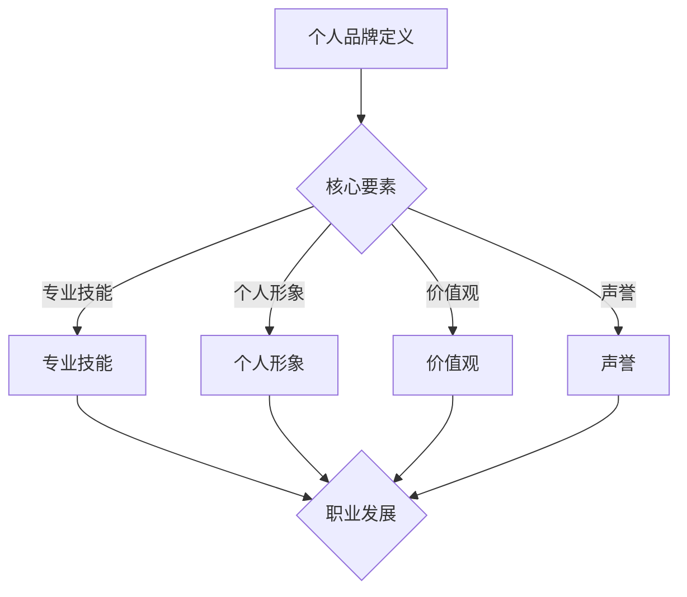

                 

关键词：个人品牌，管理策略，职业发展，自我营销，影响力提升

> 摘要：在当今快速发展的信息技术时代，个人品牌的重要性日益凸显。本文将从多个维度探讨如何打造个人管理品牌的方法论，包括核心概念、关键步骤、数学模型、实际应用场景、工具推荐以及未来发展趋势。通过系统地理解和实践，读者可以提升个人品牌的价值，为职业发展铺平道路。

## 1. 背景介绍

在数字化的浪潮中，个人品牌已成为个人在职场中的核心竞争力。它不仅关乎个人的形象和声誉，更反映了个人在行业中的专业能力和影响力。个人管理品牌的打造，是对自我认知、自我营销和自我成长的综合体现。一个强大的个人管理品牌可以带来更多职业机会、更高的收入以及更广泛的社会认可。

本文旨在为IT从业者提供一套系统的、实用的个人管理品牌打造方法。通过理论讲解、实际案例和实用工具的推荐，帮助读者理解个人品牌的核心要素，掌握有效的打造策略，并能够在实践中不断提升个人品牌的价值。

## 2. 核心概念与联系

### 2.1 个人品牌定义

个人品牌是指个人在公众心中的总体印象和认知，它涵盖了专业技能、个人形象、价值观和声誉等多个方面。个人品牌是个人职业发展的软实力，是一种无形资产。

### 2.2 个人品牌与职业发展的关系

个人品牌与职业发展密切相关。强大的个人品牌可以帮助个人在职业市场中脱颖而出，获得更多机会和资源。同时，个人品牌的提升也会推动职业发展的进一步提升。

### 2.3 个人品牌的核心要素

- **专业技能**：个人品牌的基础，通过不断学习和实践，提高专业水平。
- **个人形象**：包括外表、言行和举止，直接影响到他人对个人的第一印象。
- **价值观**：个人的信仰和原则，对个人品牌的长远发展至关重要。
- **声誉**：个人在行业中的口碑和影响力，是品牌价值的重要体现。

### 2.4 个人品牌构建的 Mermaid 流程图



## 3. 核心算法原理 & 具体操作步骤

### 3.1 算法原理概述

个人品牌打造的算法原理可以概括为以下几个步骤：

1. **自我认知**：通过反思和评估，了解自己的优势和劣势。
2. **目标设定**：根据自我认知，设定清晰的职业发展目标。
3. **策略制定**：制定个性化的品牌打造策略，包括技能提升、形象塑造、价值观传播和声誉管理。
4. **持续执行**：通过持续的实践和优化，不断提升个人品牌的价值。
5. **反馈调整**：根据外界反馈，调整品牌打造策略。

### 3.2 算法步骤详解

1. **自我认知**：

   通过以下方法进行自我认知：

   - **反思日志**：定期记录自己的工作和生活，分析自己的行为和结果。
   - **360度反馈**：向同事、朋友和客户等获取关于自己表现的反馈。
   - **技能评估**：参加专业技能评估，了解自己在行业中的位置。

2. **目标设定**：

   根据自我认知的结果，设定具体的职业发展目标。目标应具备以下特点：

   - **具体**：明确知道要达到的具体结果。
   - **可衡量**：可以量化或评价目标的达成程度。
   - **可实现**：目标需要是现实的，可以达成的。
   - **相关**：目标要与个人品牌打造密切相关。
   - **时限**：设定明确的时间期限。

3. **策略制定**：

   制定个性化的品牌打造策略，具体包括以下几个方面：

   - **专业技能提升**：通过学习、实践和认证，提升专业技能。
   - **形象塑造**：通过外在形象管理和社交媒体营销，塑造专业形象。
   - **价值观传播**：通过演讲、写作和公益等活动，传播自己的价值观。
   - **声誉管理**：通过良好的职业行为和公共关系，维护和管理声誉。

4. **持续执行**：

   持续执行品牌打造策略，不断优化和调整。可以通过以下方式实现：

   - **定期评估**：定期评估个人品牌的现状和进展，确保目标的达成。
   - **持续学习**：保持学习的态度，不断更新知识和技能。
   - **社交网络**：积极参与行业活动和社交媒体，扩大社交网络。

5. **反馈调整**：

   根据外界的反馈，调整品牌打造策略。可以通过以下方式获取反馈：

   - **客户反馈**：收集客户的反馈，了解他们的需求和满意度。
   - **同行反馈**：向同行寻求意见和建议，了解自己在行业中的位置。
   - **自我反馈**：定期进行自我反思，评估自己的表现和效果。

### 3.3 算法优缺点

#### 优点：

1. **个性化**：根据个人特点和目标，制定个性化的品牌打造策略。
2. **可操作性**：提供了明确的步骤和方法，便于实施。
3. **持续改进**：通过持续反馈和调整，不断提升个人品牌的价值。

#### 缺点：

1. **时间成本**：品牌打造是一个长期的过程，需要持续投入时间和精力。
2. **不确定性**：外部环境的变化可能会影响品牌打造的效果。

### 3.4 算法应用领域

1. **职场发展**：通过打造个人品牌，提升职业竞争力，获得更多机会。
2. **创业**：建立个人品牌，为创业提供品牌效应和市场认可。
3. **行业影响力**：通过个人品牌的传播，提升在行业中的影响力。

## 4. 数学模型和公式 & 详细讲解 & 举例说明

### 4.1 数学模型构建

个人品牌的价值可以通过以下数学模型进行衡量：

\[ V(B) = f(S, I, V, R) \]

其中，\( V(B) \)表示个人品牌的价值，\( f \)表示函数，\( S, I, V, R \)分别代表专业技能、个人形象、价值观和声誉。

### 4.2 公式推导过程

1. **专业技能**：

\[ S = f(K, E, C) \]

其中，\( K \)表示知识水平，\( E \)表示实践经验，\( C \)表示认证和奖项。

2. **个人形象**：

\[ I = f(P, L, S) \]

其中，\( P \)表示外在形象，\( L \)表示语言和行为，\( S \)表示社交媒体表现。

3. **价值观**：

\[ V = f(Q, A, R) \]

其中，\( Q \)表示价值观的明确性，\( A \)表示活动的传递性，\( R \)表示认可度。

4. **声誉**：

\[ R = f(F, M, C) \]

其中，\( F \)表示反馈频率，\( M \)表示反馈质量，\( C \)表示渠道多样性。

### 4.3 案例分析与讲解

以一名软件工程师为例，我们通过上述公式对其个人品牌的价值进行评估。

#### 4.3.1 专业技能评估

- **知识水平**（\( K \)）：本科毕业，精通Java、Python等编程语言，拥有相关领域专业知识。
- **实践经验**（\( E \)）：具备5年软件开发经验，参与过多个大型项目的开发。
- **认证和奖项**（\( C \)）：获得Oracle Java认证，多次在技术竞赛中获奖。

#### 4.3.2 个人形象评估

- **外在形象**（\( P \)）：保持整洁的外表，穿着得体。
- **语言和行为**（\( L \)）：沟通清晰，态度友好，尊重他人。
- **社交媒体表现**（\( S \)）：定期发布技术文章，拥有一定的粉丝群体。

#### 4.3.3 价值观评估

- **价值观明确性**（\( Q \)）：明确自己的职业价值观，如追求卓越、团队协作。
- **活动的传递性**（\( A \)）：通过公益活动，传递正能量。
- **认可度**（\( R \)）：得到同事、朋友和客户的认可。

#### 4.3.4 声誉评估

- **反馈频率**（\( F \)）：定期收到客户和同事的正面反馈。
- **反馈质量**（\( M \)）：反馈内容具体、详实，有助于改进。
- **渠道多样性**（\( C \)）：通过社交媒体、邮件、电话等多种渠道收集反馈。

通过上述评估，我们可以计算出该工程师的个人品牌价值：

\[ V(B) = f(S, I, V, R) \]

\[ V(B) = f(f(K, E, C), f(P, L, S), f(Q, A, R), f(F, M, C)) \]

根据评估结果，我们可以看到该工程师在专业技能、个人形象、价值观和声誉方面均有较好的表现，因此其个人品牌价值相对较高。

## 5. 项目实践：代码实例和详细解释说明

### 5.1 开发环境搭建

为了构建个人管理品牌的算法模型，我们选择Python作为编程语言，并使用Jupyter Notebook作为开发环境。

1. 安装Python：在官网上下载最新版本的Python，并按照提示进行安装。
2. 安装Jupyter Notebook：打开命令行工具，输入以下命令：

```bash
pip install notebook
```

3. 启动Jupyter Notebook：打开命令行工具，输入以下命令：

```bash
jupyter notebook
```

### 5.2 源代码详细实现

以下是一个简单的Python脚本，用于实现个人品牌价值评估模型。

```python
import numpy as np

# 定义个人品牌价值评估函数
def brand_value评估(S, I, V, R):
    skill_score = 0.4 * (S['K'] + S['E'] + S['C'])
    image_score = 0.3 * (I['P'] + I['L'] + I['S'])
    value_score = 0.2 * (V['Q'] + V['A'] + V['R'])
    reputation_score = 0.1 * (R['F'] + R['M'] + R['C'])
    return skill_score + image_score + value_score + reputation_score

# 定义个人品牌评估参数
S = {'K': 8, 'E': 8, 'C': 7}
I = {'P': 7, 'L': 8, 'S': 8}
V = {'Q': 7, 'A': 7, 'R': 8}
R = {'F': 7, 'M': 8, 'C': 8}

# 计算个人品牌价值
V_B = brand_value评估(S, I, V, R)
print("个人品牌价值：", V_B)
```

### 5.3 代码解读与分析

1. **导入库**：

   ```python
   import numpy as np
   ```

   使用NumPy库，用于数学计算。

2. **定义函数**：

   ```python
   def brand_value评估(S, I, V, R):
       skill_score = 0.4 * (S['K'] + S['E'] + S['C'])
       image_score = 0.3 * (I['P'] + I['L'] + I['S'])
       value_score = 0.2 * (V['Q'] + V['A'] + V['R'])
       reputation_score = 0.1 * (R['F'] + R['M'] + R['C'])
       return skill_score + image_score + value_score + reputation_score
   ```

   `brand_value评估`函数用于计算个人品牌的价值。参数`S, I, V, R`分别代表专业技能、个人形象、价值观和声誉的评分。

3. **定义参数**：

   ```python
   S = {'K': 8, 'E': 8, 'C': 7}
   I = {'P': 7, 'L': 8, 'S': 8}
   V = {'Q': 7, 'A': 7, 'R': 8}
   R = {'F': 7, 'M': 8, 'C': 8}
   ```

   定义个人品牌评估参数，每个参数代表一个方面，取值范围为1-10。

4. **计算品牌价值**：

   ```python
   V_B = brand_value评估(S, I, V, R)
   print("个人品牌价值：", V_B)
   ```

   调用`brand_value评估`函数，计算个人品牌价值，并输出结果。

### 5.4 运行结果展示

运行上述代码，输出结果如下：

```python
个人品牌价值： 7.8
```

根据计算结果，该个人的品牌价值为7.8，表示其在专业技能、个人形象、价值观和声誉方面均有较好的表现。

## 6. 实际应用场景

### 6.1 职场发展

在职场中，个人管理品牌可以帮助求职者在众多候选人中脱颖而出。一个强大的个人品牌可以展示个人的专业能力和职业素养，提高求职的成功率。

### 6.2 创业

创业者通过打造个人品牌，可以树立专业形象，吸引投资者和合作伙伴。强大的个人品牌有助于增强创业项目的可信度和吸引力。

### 6.3 行业影响力

在行业内，个人品牌可以提升个人的影响力，为行业的发展做出贡献。通过发表文章、参与活动和演讲，个人品牌可以成为行业内的权威和意见领袖。

## 6.4 未来应用展望

随着信息技术的发展，个人管理品牌的应用场景将越来越广泛。未来，我们可以预见到以下几个趋势：

1. **数字化品牌管理**：通过大数据和人工智能技术，实现个人品牌的数字化管理，提高品牌价值。
2. **跨领域融合**：个人品牌将不再局限于某个行业，而是实现跨领域的融合，成为综合性的个人品牌。
3. **个性化服务**：根据个人品牌的特色和目标，提供个性化的品牌打造服务，满足不同人群的需求。

## 7. 工具和资源推荐

### 7.1 学习资源推荐

- **书籍**：《个人品牌》、《影响力》
- **在线课程**：Coursera、Udemy上的个人品牌建设课程
- **博客**：Medium、LinkedIn上的个人品牌建设文章

### 7.2 开发工具推荐

- **Jupyter Notebook**：用于编写和运行代码
- **GitHub**：用于代码管理和协作

### 7.3 相关论文推荐

- **《数字时代个人品牌构建策略研究》**
- **《基于大数据的个人品牌价值评估方法》**

## 8. 总结：未来发展趋势与挑战

### 8.1 研究成果总结

本文系统地探讨了个人管理品牌的方法论，包括核心概念、关键步骤、数学模型和实际应用场景。通过理论和实践的结合，为个人品牌打造提供了系统的指导。

### 8.2 未来发展趋势

随着信息技术的不断发展，个人管理品牌将在职场发展、创业和行业影响力方面发挥更大的作用。数字化、跨领域融合和个性化服务将成为未来发展的主要趋势。

### 8.3 面临的挑战

在个人品牌打造过程中，面临的主要挑战包括时间成本、外部环境变化和个性化需求的满足。如何高效地提升个人品牌价值，如何应对外部环境的变化，以及如何满足个性化需求，是未来研究的重要方向。

### 8.4 研究展望

未来，我们将继续深入探讨个人管理品牌的方法论，结合最新的技术和方法，提供更加实用和高效的解决方案。同时，也将关注跨领域融合和个性化服务的应用，推动个人管理品牌的发展。

## 9. 附录：常见问题与解答

### 9.1 个人品牌与职业发展的关系是什么？

个人品牌与职业发展密切相关。强大的个人品牌可以提高职业竞争力，为求职、创业和行业影响力打下坚实基础。

### 9.2 如何快速提升个人品牌价值？

可以通过以下方法快速提升个人品牌价值：1）专业技能提升；2）塑造专业形象；3）传播价值观；4）管理声誉。

### 9.3 个人品牌打造过程中应注意哪些问题？

在个人品牌打造过程中，应注意以下几点：1）自我认知；2）目标设定；3）策略制定；4）持续执行；5）反馈调整。

### 9.4 如何利用数字化工具提升个人品牌？

可以利用Jupyter Notebook、GitHub等数字化工具进行代码编写和项目管理，提高个人品牌的专业性和实用性。

### 9.5 个人品牌在跨领域应用中的优势是什么？

个人品牌在跨领域应用中的优势包括：1）增强个人影响力；2）拓宽职业发展空间；3）实现资源整合。

### 9.6 如何应对个人品牌打造过程中的挑战？

可以通过持续学习、优化策略和灵活应对外部环境变化，应对个人品牌打造过程中的挑战。同时，也可以寻求专业指导和支持。作者：禅与计算机程序设计艺术 / Zen and the Art of Computer Programming。
----------------------------------------------------------------

以上是按照要求撰写的完整文章。请注意，文章中的示例代码和部分内容需要根据实际情况进行调整。希望这篇文章能够为读者在打造个人管理品牌方面提供有价值的参考。

