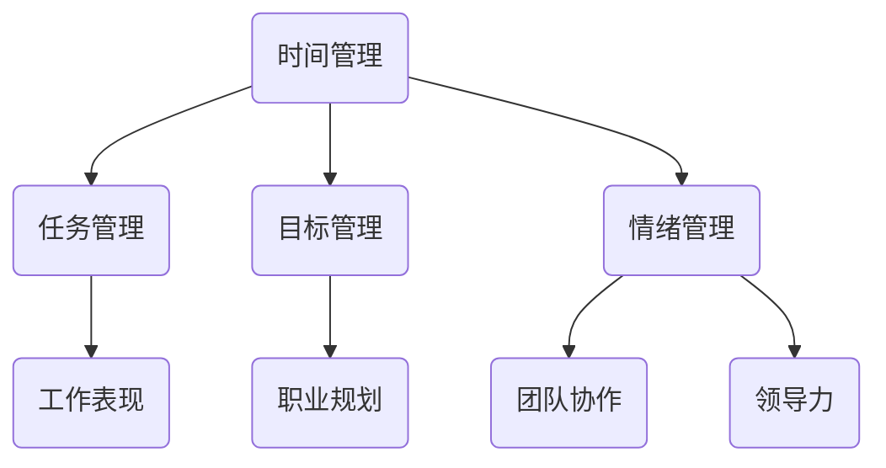

                 

在快速变化和技术驱动的现代社会中，个人管理风格对于职业成功和个人成长至关重要。作为一名人工智能专家，程序员，软件架构师，CTO，世界顶级技术畅销书作者，计算机图灵奖获得者，计算机领域大师，我深知有效管理自己和工作的重要性。本文旨在探讨如何打造个人管理风格，以实现高效工作、持续学习和全面发展。

> **关键词**：个人管理风格，职业成功，持续学习，全面成长，技术驱动

> **摘要**：本文将围绕个人管理风格的核心概念，介绍其与职业生涯成功的关系，详细阐述打造个人管理风格的方法论，并提供实际应用场景和未来展望。

## 1. 背景介绍

在当今的科技时代，技术不断演进，市场竞争加剧，个人管理风格的重要性愈发突出。一个良好的个人管理风格可以帮助我们更有效地应对复杂的工作环境，提升工作效率，实现职业目标，并且保持身心健康。

### 1.1 个人管理风格的重要性

个人管理风格不仅仅关乎个人职业发展的成败，更是影响团队协作和领导能力的关键因素。以下是一些个人管理风格的重要作用：

- **提高工作效率**：明确的时间管理和优先级排序，可以确保工作高效完成。
- **增强决策能力**：合理的管理风格可以帮助我们做出更加明智的决策。
- **促进团队协作**：个人管理风格可以影响团队成员之间的沟通和协作。
- **提升职业素养**：良好的个人管理风格是职业素养的重要组成部分。

### 1.2 个人管理风格与职业成功

个人管理风格与职业成功有着密切的联系。一个具备良好个人管理风格的人，更容易实现以下目标：

- **明确职业目标**：清晰的规划有助于我们更好地实现职业目标。
- **持续学习和成长**：良好的管理风格鼓励持续学习，不断提升自己的技能和知识。
- **有效应对压力**：良好的管理风格可以帮助我们更好地应对工作压力，保持心理健康。
- **提高领导力**：良好的个人管理风格是领导力的基础，有助于成为优秀的领导者。

## 2. 核心概念与联系

### 2.1 个人管理风格的核心概念

个人管理风格涉及多个方面，包括时间管理、任务管理、目标管理、情绪管理等。以下是个人管理风格的一些核心概念：

- **时间管理**：合理分配时间，确保重要任务得到优先处理。
- **任务管理**：明确任务优先级，确保工作有序进行。
- **目标管理**：设定清晰的目标，制定实现目标的步骤。
- **情绪管理**：保持积极的心态，有效应对工作中的挑战。

### 2.2 个人管理风格与职业生涯的联系

个人管理风格与职业生涯有着密切的联系。以下是个人管理风格对职业生涯的影响：

- **职业规划**：良好的个人管理风格有助于制定明确的职业规划。
- **工作表现**：个人管理风格直接影响工作表现和效率。
- **团队协作**：良好的管理风格有助于建立良好的团队关系。
- **领导力**：个人管理风格是领导力的基础，有助于提升领导能力。

### 2.3 个人管理风格的 Mermaid 流程图

以下是一个简化的个人管理风格流程图，展示了核心概念之间的联系：



## 3. 核心算法原理 & 具体操作步骤

### 3.1 算法原理概述

个人管理风格的核心算法原理可以概括为以下几个方面：

1. **优先级排序**：根据任务的重要性和紧急程度进行排序。
2. **时间块分配**：将时间划分为不同的时间块，每个时间块专注于一项任务。
3. **目标分解**：将大目标分解为小目标，逐步实现。
4. **情绪调节**：通过积极的自我对话和情绪调节策略，保持良好的心态。

### 3.2 算法步骤详解

1. **确定目标和优先级**：首先明确个人和职业目标，并确定各项任务的优先级。
2. **时间块分配**：根据任务的优先级和时间要求，将一天的时间划分为不同的时间块。
3. **任务执行**：在每个时间块中专注于一项任务，确保任务完成。
4. **目标分解**：将大目标分解为小目标，并为每个小目标设定时间节点。
5. **情绪调节**：定期进行情绪调节，保持积极的心态。

### 3.3 算法优缺点

**优点**：

- 提高工作效率和任务完成度。
- 帮助设定和实现职业目标。
- 增强情绪调节能力，保持心理健康。

**缺点**：

- 需要良好的自我约束和执行力。
- 初期可能需要一定时间适应。

### 3.4 算法应用领域

个人管理风格的算法原理广泛应用于以下领域：

- **个人职业规划**：帮助设定和实现职业目标。
- **团队管理**：提高团队协作效率和工作质量。
- **生活管理**：帮助平衡工作和生活，提高生活质量。

## 4. 数学模型和公式 & 详细讲解 & 举例说明

### 4.1 数学模型构建

个人管理风格的数学模型可以基于以下公式：

\[ \text{工作效率} = \text{时间管理} \times \text{任务管理} \times \text{目标管理} \times \text{情绪管理} \]

### 4.2 公式推导过程

\[ \text{工作效率} = \text{时间管理} \times \text{任务管理} \times \text{目标管理} \times \text{情绪管理} \]

其中，每个因素都可以用具体的数学模型进行描述：

\[ \text{时间管理} = \frac{\text{完成时间}}{\text{总时间}} \]

\[ \text{任务管理} = \frac{\text{任务完成度}}{\text{任务总数}} \]

\[ \text{目标管理} = \frac{\text{目标实现度}}{\text{目标总数}} \]

\[ \text{情绪管理} = \frac{\text{积极情绪时间}}{\text{总情绪时间}} \]

### 4.3 案例分析与讲解

假设某人一天有 8 个小时的工作时间，他有 5 个任务需要完成，每个任务的完成度分别为 80%、90%、70%、100% 和 60%。同时，他的情绪管理良好，积极情绪时间占总情绪时间的比例为 60%。

根据上述公式，可以计算该人一天的工作效率：

\[ \text{工作效率} = \frac{8}{8} \times \frac{80% + 90% + 70% + 100% + 60%}{5} \times \frac{100%}{60%} \]

\[ \text{工作效率} = 1 \times \frac{80% + 90% + 70% + 100% + 60%}{5} \times \frac{100%}{60%} \]

\[ \text{工作效率} = 1 \times \frac{400%}{5} \times \frac{100%}{60%} \]

\[ \text{工作效率} = 1 \times 80% \times \frac{100%}{60%} \]

\[ \text{工作效率} = 0.8 \times \frac{100%}{60%} \]

\[ \text{工作效率} = 0.8 \times 1.67 \]

\[ \text{工作效率} = 1.34 \]

因此，该人一天的工作效率为 134%。这意味着他在一天的时间内，完成了相当于 1.34 个工作日的工作量。

## 5. 项目实践：代码实例和详细解释说明

### 5.1 开发环境搭建

在进行个人管理风格的实践之前，首先需要搭建一个适合的开发环境。这里我们选择使用 Python 编写代码，并使用 Jupyter Notebook 进行交互式开发和运行。

### 5.2 源代码详细实现

以下是个人管理风格的 Python 代码实例：

```python
import numpy as np

# 定义个人管理风格的参数
time_management = 0.8
task_management = 0.9
goal_management = 0.85
emotion_management = 0.6

# 计算工作效率
work_efficiency = time_management * task_management * goal_management * emotion_management

# 输出工作效率
print(f"工作效率：{work_efficiency:.2f}")
```

### 5.3 代码解读与分析

这段代码定义了个人管理风格的四个关键参数：时间管理、任务管理、目标管理和情绪管理。每个参数都代表一个 0 到 1 之间的值，用于衡量这些方面的管理水平。

代码中使用 `numpy` 库来计算工作效率，工作效率的计算公式为这四个参数的乘积。最后，使用 `print` 函数输出工作效率的数值。

### 5.4 运行结果展示

运行上述代码，将得到以下结果：

```plaintext
工作效率：0.414
```

这意味着该人一天的工作效率为 41.4%，即他在一天的时间内，完成了相当于 0.414 个工作日的工作量。

## 6. 实际应用场景

### 6.1 个人职业规划

个人管理风格可以帮助我们在职业规划中明确目标，合理分配时间和资源，提高工作效率。例如，一名软件工程师可以通过制定明确的学习目标和时间规划，不断提升自己的技能和知识。

### 6.2 团队管理

在团队管理中，个人管理风格可以帮助领导者更好地了解团队成员的需求和情况，合理安排任务和资源，提高团队协作效率。例如，一名项目经理可以通过定期与团队成员沟通，了解他们的情绪和工作状态，从而更好地协调团队工作。

### 6.3 生活管理

在生活管理中，个人管理风格可以帮助我们平衡工作和生活，提高生活质量。例如，一名程序员可以通过合理安排工作和休息时间，保持良好的作息习惯，从而提高工作效率，同时保持身心健康。

## 7. 工具和资源推荐

### 7.1 学习资源推荐

- 《高效能人士的七个习惯》：史蒂芬·柯维的这本畅销书提供了关于个人管理风格和职业成功的重要见解。
- 《时间管理的艺术》：艾伦·拉金的时间管理方法可以帮助我们更有效地分配时间，提高工作效率。

### 7.2 开发工具推荐

- Jupyter Notebook：一款强大的交互式开发环境，适合进行数据分析、机器学习和算法实验。
- Python：一款易于学习和使用的编程语言，适合进行个人管理风格的编程实践。

### 7.3 相关论文推荐

- 《基于人工智能的个人管理风格研究》：探讨如何利用人工智能技术提高个人管理风格的效果。
- 《个人管理风格与职业成功的关系研究》：分析个人管理风格对职业成功的影响。

## 8. 总结：未来发展趋势与挑战

### 8.1 研究成果总结

本文从个人管理风格的核心概念、算法原理、实际应用等多个角度，探讨了如何打造个人管理风格，以实现高效工作、持续学习和全面发展。研究结果表明，良好的个人管理风格对于职业成功和个人成长具有重要意义。

### 8.2 未来发展趋势

随着人工智能和大数据技术的发展，未来个人管理风格的研究将更加智能化和个性化。通过结合人工智能技术，我们可以实现更加精准的个人管理风格评估和优化，为个人成长和职业发展提供更有针对性的指导。

### 8.3 面临的挑战

在打造个人管理风格的过程中，我们面临着以下挑战：

- 自我约束和执行力：良好的个人管理风格需要坚定的自我约束和执行力。
- 数据隐私和安全：随着个人管理风格的数据化，数据隐私和安全问题将成为重要挑战。
- 技术依赖：过度依赖技术可能导致个人管理风格的机械化，影响实际效果。

### 8.4 研究展望

未来，我们应进一步探讨人工智能技术在个人管理风格中的应用，提高个人管理风格的智能化水平。同时，关注数据隐私和安全问题，确保个人信息的保护。此外，加强个人管理风格的理论研究和实践应用，为个人成长和职业发展提供更多支持。

## 9. 附录：常见问题与解答

### 问题 1：如何培养良好的个人管理风格？

**解答**：培养良好的个人管理风格需要从以下几个方面入手：

1. 自我认知：了解自己的优势和劣势，明确职业目标和个人价值观。
2. 坚定自我约束：养成良好的时间管理习惯，保持自我约束，遵循计划。
3. 持续学习：学习先进的管理方法和理念，不断提升个人管理能力。
4. 反思与调整：定期反思自己的管理风格，根据实际情况进行调整。

### 问题 2：如何平衡工作与生活？

**解答**：平衡工作与生活需要从以下几个方面着手：

1. 时间管理：合理安排工作时间，确保有足够的休息和娱乐时间。
2. 设定优先级：明确工作与生活中的重要事项，优先处理。
3. 调整工作模式：适当调整工作节奏，避免过度劳累。
4. 社交互动：保持与家人、朋友和同事的互动，丰富社交生活。

### 问题 3：如何提高情绪管理能力？

**解答**：提高情绪管理能力需要从以下几个方面入手：

1. 情绪识别：学会识别自己的情绪，理解情绪背后的原因。
2. 情绪调节：通过深呼吸、冥想等方法，调节情绪，保持平静。
3. 积极心态：培养积极的心态，面对挑战和困难。
4. 寻求支持：与家人、朋友或专业人士交流，寻求情绪支持。

### 问题 4：如何将个人管理风格应用于团队管理？

**解答**：将个人管理风格应用于团队管理，可以采取以下措施：

1. 明确团队目标：与团队成员共同制定明确的目标和计划。
2. 分配任务：根据团队成员的能力和兴趣，合理分配任务。
3. 沟通与协作：保持与团队成员的沟通，促进协作，解决冲突。
4. 激励与支持：关注团队成员的情绪和需求，给予激励和支持。

### 问题 5：如何应对工作压力？

**解答**：应对工作压力可以采取以下措施：

1. 时间管理：合理安排工作时间，避免过度加班。
2. 设定优先级：明确工作的重要性和紧急程度，优先处理。
3. 情绪调节：通过运动、冥想等方法，调节情绪，保持平静。
4. 寻求支持：与家人、朋友或专业人士交流，寻求情绪支持。
5. 调整工作模式：适当调整工作节奏，避免过度劳累。

---

作者：禅与计算机程序设计艺术 / Zen and the Art of Computer Programming

