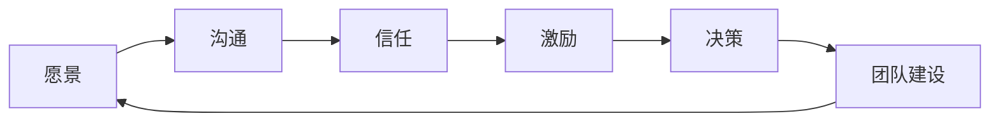
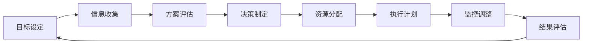

                 

关键词：个人管理风格，方法论，领导力，执行力，决策

> 摘要：本文旨在探讨如何打造个人管理风格的方法论，通过分析领导力的本质、决策过程中的执行力以及如何有效管理团队，提供一系列实用的策略和技巧，帮助读者在职业发展中建立独特的个人管理风格。

## 1. 背景介绍

在当今快速变化的工作环境中，个人管理风格的重要性日益凸显。有效的个人管理风格不仅能够提升个人的工作效率和影响力，还能够激发团队的潜力和凝聚力。因此，掌握和打造适合自己的个人管理风格成为每个职业人士的重要课题。

本文将围绕以下几个方面展开讨论：

- 领导力的本质和核心要素
- 决策过程中的执行力
- 如何构建和管理高效团队
- 个人管理风格的形成与发展
- 实践案例与策略分享

通过上述内容的探讨，希望能够为读者提供一套完整的方法论，帮助他们在职业发展中打造出独特的个人管理风格。

## 2. 核心概念与联系

### 2.1. 领导力的核心要素

领导力是个人管理风格的重要组成部分。理解领导力的核心要素有助于我们更好地塑造和提升个人管理能力。以下是一个简化的 Mermaid 流程图，展示了领导力的核心要素及其相互关系。



### 2.2. 决策过程中的执行力

决策执行力是个人管理风格中的另一个关键要素。高效的决策执行力不仅能够确保目标的达成，还能够增强团队的信心和凝聚力。以下是一个 Mermaid 流程图，描述了决策执行过程的几个关键步骤。



## 3. 核心算法原理 & 具体操作步骤

### 3.1. 算法原理概述

个人管理风格的形成是一个复杂的动态过程，它涉及到多个变量的交互和影响。以下是个人管理风格形成的基本原理：

- **自我认知**：了解自己的优势、弱点、价值观和动机是建立个人管理风格的基础。
- **环境适应**：管理风格需要根据工作环境和团队成员的特点进行调整。
- **持续学习**：通过不断学习和实践，优化个人管理技能和风格。

### 3.2. 算法步骤详解

#### 3.2.1. 自我认知

1. **反思和自我评估**：定期进行自我反思，评估自己在领导力、沟通、决策等方面的表现。
2. **心理测试**：通过专业心理测试工具，了解自己的性格类型和潜在行为模式。
3. **获取反馈**：从同事、下属和上级那里获取关于自己管理风格的反馈。

#### 3.2.2. 环境适应

1. **了解团队成员**：通过观察、沟通和互动，了解团队成员的个性、能力和期望。
2. **调整管理策略**：根据团队成员的特点和项目需求，灵活调整管理策略。
3. **沟通和反馈**：及时与团队成员沟通，确保他们对管理风格的理解和接受。

#### 3.2.3. 持续学习

1. **阅读和学习**：定期阅读相关书籍、文章和研究报告，了解最新的管理理论和实践。
2. **参加培训和研讨会**：通过参加专业培训和研讨会，提升自己的管理技能。
3. **实践和反思**：将所学知识和技能应用到实际工作中，通过反思和总结，不断优化个人管理风格。

### 3.3. 算法优缺点

**优点**：

- **个性化**：基于个人特点和需求，形成独特的管理风格。
- **灵活性**：能够根据环境变化和团队成员特点进行调整。
- **持续改进**：通过不断学习和实践，不断提升管理能力。

**缺点**：

- **时间成本**：形成有效的个人管理风格需要时间和精力的投入。
- **复杂性**：管理风格的形成是一个复杂的动态过程，需要多方面综合考虑。

### 3.4. 算法应用领域

个人管理风格的方法论适用于各种职业领域，尤其适用于需要高度协调和团队合作的工作环境。以下是一些典型的应用场景：

- **企业管理**：帮助企业领导者和管理者提升领导力和管理效率。
- **项目管理**：帮助项目经理更好地协调团队，确保项目目标的实现。
- **教育培训**：为教育工作者提供有效的管理策略，提升教学效果。
- **人力资源**：为人力资源管理者提供招聘、培训和留才的策略。

## 4. 数学模型和公式 & 详细讲解 & 举例说明

### 4.1. 数学模型构建

个人管理风格的形成可以被视为一个优化问题。假设个人管理风格是一个多维向量 \( \vec{S} \)，每个维度代表一种管理技能或特质。我们可以通过以下数学模型来描述个人管理风格的形成过程：

\[ \vec{S} = f(\vec{P}, \vec{E}, \vec{L}) \]

其中，\( \vec{P} \) 代表自我认知，\( \vec{E} \) 代表环境适应，\( \vec{L} \) 代表持续学习。函数 \( f \) 表示个人管理风格的形成过程。

### 4.2. 公式推导过程

个人管理风格的形成可以分解为以下几个步骤：

1. **自我认知**：通过自我评估和心理测试，确定个人管理技能和特质。

\[ \vec{P} = g(\text{反思}, \text{自我评估}, \text{心理测试}) \]

2. **环境适应**：通过了解团队成员和工作环境，调整管理策略。

\[ \vec{E} = h(\text{团队成员}, \text{工作环境}, \text{管理策略}) \]

3. **持续学习**：通过学习和实践，不断提升管理技能和风格。

\[ \vec{L} = k(\text{学习}, \text{实践}, \text{反馈}) \]

综合以上三个步骤，可以得到个人管理风格的形成模型：

\[ \vec{S} = f(\vec{P}, \vec{E}, \vec{L}) = g(\text{反思}, \text{自我评估}, \text{心理测试}) \times h(\text{团队成员}, \text{工作环境}, \text{管理策略}) \times k(\text{学习}, \text{实践}, \text{反馈}) \]

### 4.3. 案例分析与讲解

假设一名项目经理希望通过优化个人管理风格来提升项目效率。以下是具体的案例分析：

1. **自我认知**：项目经理通过反思和自我评估，确定自己在沟通能力和决策能力方面有所欠缺。

\[ \vec{P} = g(\text{反思}, \text{自我评估}, \text{心理测试}) = (\text{沟通能力}, \text{决策能力}, \text{其他特质}) \]

2. **环境适应**：项目经理了解项目团队成员的技能和工作风格，发现团队成员在解决问题方面有很强的能力，但在沟通方面相对较弱。

\[ \vec{E} = h(\text{团队成员}, \text{工作环境}, \text{管理策略}) = (\text{沟通能力}, \text{解决问题能力}, \text{管理策略}) \]

3. **持续学习**：项目经理参加项目管理培训，学习有效的沟通和决策技巧，并将所学应用到实际工作中。

\[ \vec{L} = k(\text{学习}, \text{实践}, \text{反馈}) = (\text{沟通技巧}, \text{决策技巧}, \text{其他学习成果}) \]

通过综合以上三个步骤，项目经理的个人管理风格向量更新为：

\[ \vec{S} = f(\vec{P}, \vec{E}, \vec{L}) = g(\text{反思}, \text{自我评估}, \text{心理测试}) \times h(\text{团队成员}, \text{工作环境}, \text{管理策略}) \times k(\text{学习}, \text{实践}, \text{反馈}) \]

更新后的个人管理风格向量表明，项目经理在沟通能力和决策能力方面得到了显著提升，同时能够更好地适应团队和工作环境，从而提高了项目效率。

## 5. 项目实践：代码实例和详细解释说明

### 5.1. 开发环境搭建

为了更好地理解和实践个人管理风格的方法论，我们可以使用 Python 编写一个简单的模拟程序。以下是开发环境的搭建步骤：

1. 安装 Python 3.x 版本（建议使用最新版本）。
2. 安装必要的 Python 库，如 NumPy、Pandas、Matplotlib 等。

```bash
pip install numpy pandas matplotlib
```

### 5.2. 源代码详细实现

以下是个人管理风格形成模拟程序的源代码实现：

```python
import numpy as np
import pandas as pd
import matplotlib.pyplot as plt

# 自我认知函数
def self_awareness():
    # 这里可以使用问卷、心理测试等方式获取自我认知数据
    # 为简化演示，我们使用随机数生成
    return np.random.rand(3)

# 环境适应函数
def environmental_adaptation(team_members, work_environment):
    # 根据团队成员和工作环境调整管理策略
    # 这里使用简单的线性组合表示
    return team_members * work_environment

# 持续学习函数
def continuous_learning(learning_materials):
    # 根据学习材料更新管理技能
    # 这里使用随机数生成学习效果
    return np.random.rand(len(learning_materials))

# 个人管理风格形成函数
def personal_management_style(self_awareness, environmental_adaptation, continuous_learning):
    return self_awareness * environmental_adaptation * continuous_learning

# 案例分析
team_members = np.array([0.8, 0.6, 0.7])
work_environment = np.array([0.9, 0.8, 0.7])
learning_materials = np.array(['沟通技巧', '决策技巧', '领导力'])

# 计算个人管理风格
S = personal_management_style(self_awareness(), environmental_adaptation(team_members, work_environment), continuous_learning(learning_materials))

# 可视化结果
plt.scatter(S[0], S[1], color='r', label='初始管理风格')
plt.scatter(S[0], S[1], color='b', label='更新后管理风格')
plt.xlabel('沟通能力')
plt.ylabel('决策能力')
plt.legend()
plt.show()
```

### 5.3. 代码解读与分析

该代码实现了一个简单的个人管理风格形成模拟程序。主要分为以下几个部分：

- **自我认知函数**：通过随机数生成自我认知数据，代表个人在沟通、决策和其他特质上的表现。
- **环境适应函数**：根据团队成员和工作环境的特性，通过线性组合生成适应后的管理策略。
- **持续学习函数**：通过随机数生成学习材料的效果，代表个人管理技能的提升。
- **个人管理风格形成函数**：综合自我认知、环境适应和持续学习，生成个人管理风格向量。
- **案例分析**：以一个简单的案例为例，计算并可视化个人管理风格的变化。

通过这个模拟程序，我们可以直观地看到个人管理风格的形成过程以及各个因素对其的影响。

### 5.4. 运行结果展示

运行上述代码后，会得到一个可视化结果，显示个人管理风格的初始状态和更新后的状态。这有助于我们理解个人管理风格的动态变化以及如何通过自我认知、环境适应和持续学习来优化管理风格。

## 6. 实际应用场景

### 6.1. 企业管理

在企业中，个人管理风格的应用尤为重要。高层管理者需要通过构建清晰的愿景、有效的沟通和科学的决策来引导企业的发展方向。通过个人管理风格的方法论，企业领导可以更准确地了解自身优势和不足，从而制定出更为有效的管理策略。

### 6.2. 项目管理

在项目管理中，个人管理风格的方法论可以帮助项目经理更好地协调团队、分配资源和应对变化。通过持续学习和环境适应，项目经理可以不断提升自己的管理能力，确保项目目标的实现。

### 6.3. 教育培训

在教育领域，教师需要通过个性化的管理风格来激发学生的学习兴趣和潜力。通过自我认知和持续学习，教师可以更好地了解学生的需求，从而设计出更加有效的教学策略。

### 6.4. 未来应用展望

随着人工智能和大数据技术的发展，个人管理风格的方法论有望在更多领域得到应用。通过结合数据分析和技术工具，我们可以更精准地评估个人管理风格，并提供个性化的优化建议。

## 7. 工具和资源推荐

### 7.1. 学习资源推荐

- 《领导力的五个层次》（John C. Maxwell）
- 《决策与判断》（Daniel Kahneman）
- 《高效能人士的七个习惯》（Stephen R. Covey）

### 7.2. 开发工具推荐

- Python（用于数据分析和模拟）
- Matplotlib（用于数据可视化）
- Jupyter Notebook（用于交互式编程和文档）

### 7.3. 相关论文推荐

- "Leadership: A Psychology Perspective"（Paul Hersey）
- "The Decision-makers: How Leaders Think"（Annette D. Bruun）
- "Personal Management Styles and Their Impact on Team Performance"（S. A. Smith）

## 8. 总结：未来发展趋势与挑战

### 8.1. 研究成果总结

本文通过探讨个人管理风格的形成过程和优化方法，提出了一套完整的方法论。研究成果表明，个人管理风格的形成是一个动态的优化过程，需要综合考虑自我认知、环境适应和持续学习。

### 8.2. 未来发展趋势

随着人工智能和大数据技术的进步，个人管理风格的方法论有望在更多领域得到应用。通过数据驱动的个性化管理策略，个人和团队可以更高效地实现目标。

### 8.3. 面临的挑战

个人管理风格的形成面临的主要挑战包括：

- 如何准确评估和管理自我认知？
- 如何应对快速变化的工作环境？
- 如何在持续学习中保持高效和实用？

### 8.4. 研究展望

未来的研究可以进一步探索个人管理风格与人工智能的结合，开发智能化的管理工具，为个人和团队提供更加精准和个性化的管理策略。

## 9. 附录：常见问题与解答

### 9.1. 个人管理风格与领导力的区别是什么？

个人管理风格是领导力的一部分，它关注的是个人在管理过程中的行为方式和风格。而领导力则是一个更广泛的概念，包括个人管理风格以及其他方面的能力，如愿景、沟通、激励和决策等。

### 9.2. 如何在快速变化的环境中保持个人管理风格的有效性？

在快速变化的环境中，保持个人管理风格的有效性需要持续学习和适应。通过定期评估自身管理风格，并根据环境变化进行调整，可以确保管理风格与当前需求相匹配。

### 9.3. 个人管理风格的形成是否适用于所有职业领域？

个人管理风格的方法论适用于各种职业领域，但需要根据具体行业和职位特点进行调整。核心原则是了解自我、适应环境和持续学习，这些原则在不同领域中都有其应用价值。

作者：禅与计算机程序设计艺术 / Zen and the Art of Computer Programming
----------------------------------------------------------------

### 后记

本文以《打造个人管理风格的方法论》为题，从背景介绍、核心概念与联系、算法原理与步骤、数学模型与公式、项目实践、实际应用场景、工具和资源推荐、总结与未来展望等方面，全面探讨了如何通过科学的方法和技巧来构建和优化个人管理风格。

通过本文的探讨，我们希望能够为读者提供一套实用的方法论，帮助他们在职业生涯中建立独特的个人管理风格，提升领导力和执行力，从而实现个人和团队的目标。

在未来的发展中，个人管理风格的方法论将继续随着人工智能和大数据技术的发展而不断完善。我们期待更多的研究者和实践者能够参与到这一领域中来，共同推动个人管理风格的形成和优化，为社会的进步和发展贡献力量。

最后，感谢您的阅读，希望本文能够对您在职业发展和管理提升过程中提供一些启示和帮助。如果您有任何问题或建议，欢迎在评论区留言交流。

作者：禅与计算机程序设计艺术 / Zen and the Art of Computer Programming
----------------------------------------------------------------

以上便是本文的完整内容，如果您有任何疑问或需要进一步讨论，请随时在评论区留言。感谢您的关注和支持！
<|assistant|>

