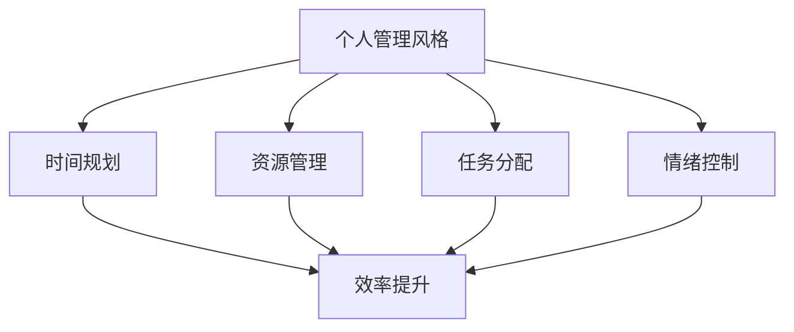
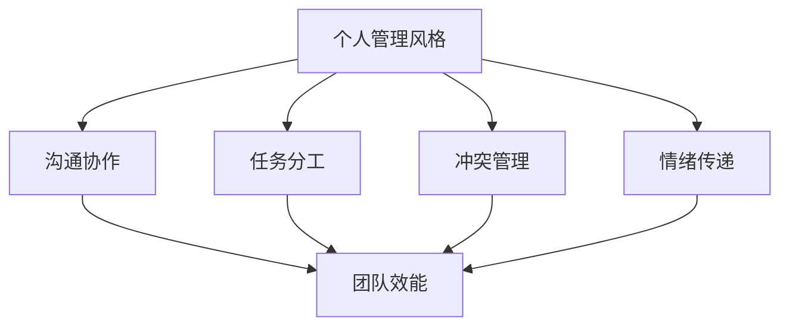

                 

在这个信息爆炸的时代，每个人都可能面对着复杂的工作和生活环境。对于IT行业来说，高效的个人管理不仅仅是为了提升工作效率，更是为了实现个人与团队的共同成长。本文旨在探讨如何打造个人管理风格的方法论，帮助读者在快节奏的工作环境中找到属于自己的管理节奏。

## 关键词

- 个人管理
- 工作效率
- IT行业
- 团队合作
- 管理风格

## 摘要

本文将从IT行业的工作实际出发，介绍个人管理风格的重要性，分析构建个人管理风格的核心概念，并通过具体算法原理、数学模型、项目实践等多个方面，提供一套完整的打造个人管理风格的方法论。旨在帮助读者理解并实践有效的个人管理，从而提升工作效率，实现个人与团队的共同进步。

## 1. 背景介绍

随着信息技术的高速发展，IT行业的工作环境和需求也在不断变化。高效的管理成为了决定团队和项目成功与否的关键因素。个人管理风格的形成，不仅需要深厚的专业知识和技能，更需要对自身性格、工作习惯和团队需求的深刻理解。

在IT行业中，个人管理风格的重要性体现在以下几个方面：

- **提升工作效率**：通过有效的个人管理，可以更好地规划时间，减少工作中的干扰，从而提高工作效率。
- **促进团队合作**：良好的个人管理风格有助于建立团队成员间的信任和协作，提高团队的整体效能。
- **实现职业发展**：个人管理风格的形成，有助于提升个人在职场中的竞争力，实现职业生涯的持续发展。

本文将围绕如何打造个人管理风格，从核心概念、算法原理、数学模型和项目实践等多个方面展开讨论，帮助读者掌握一套有效的管理方法论。

## 2. 核心概念与联系

### 2.1. 个人管理风格的概念

个人管理风格是指个人在处理工作和生活事务时所表现出的习惯、态度和方法。它包括时间管理、目标设定、情绪控制、任务分配等多个方面。一个成熟的管理风格能够帮助个人在复杂的工作环境中保持高效和稳定。

### 2.2. 个人管理风格与工作效率的关系

个人管理风格对工作效率的影响是显而易见的。良好的管理风格能够帮助个人更好地规划时间和资源，减少工作中的无效消耗，从而提高整体工作效率。以下是一个简化的 Mermaid 流程图，展示了个人管理风格与工作效率之间的联系。



### 2.3. 个人管理风格与团队合作的联系

在团队合作中，个人管理风格同样发挥着重要作用。一个具备良好管理风格的团队成员，能够更好地协调和配合其他成员，从而提升团队的整体效能。以下是一个简化的 Mermaid 流程图，展示了个人管理风格与团队合作之间的联系。



## 3. 核心算法原理 & 具体操作步骤

### 3.1. 算法原理概述

在个人管理中，核心算法之一是“目标设定与分解”。该算法的基本原理是将长期目标分解为短期任务，并通过时间规划和任务分配来实现这些任务。以下是一个简化的算法原理概述。

#### 3.1.1. 目标设定

- 确定长期目标：基于个人职业规划和兴趣，设定一个长期目标。
- 分解为短期任务：将长期目标分解为多个短期任务，每个任务都有明确的完成时间和可量化的目标。

#### 3.1.2. 时间规划

- 根据任务的重要性和紧急程度，制定时间表。
- 使用“四象限法则”将任务分为四个象限，并优先处理重要且紧急的任务。

#### 3.1.3. 任务分配

- 根据团队成员的能力和兴趣，分配任务。
- 定期检查任务的进度，并进行必要的调整。

### 3.2. 算法步骤详解

#### 3.2.1. 确定长期目标

- 回顾个人职业规划，确定一个具有挑战性的长期目标。
- 将目标写下来，并明确其重要性和意义。

#### 3.2.2. 分解为短期任务

- 将长期目标分解为若干个短期任务。
- 为每个任务设定具体的完成时间和目标。

#### 3.2.3. 制定时间表

- 使用时间管理工具（如日历、提醒等）制定时间表。
- 确保时间表的合理性和可行性。

#### 3.2.4. 任务分配

- 根据团队成员的能力和兴趣，分配任务。
- 与团队成员沟通，确保他们了解任务的目标和完成时间。

#### 3.2.5. 定期检查

- 定期检查任务的进度，与团队成员进行反馈。
- 根据实际情况，进行必要的调整。

### 3.3. 算法优缺点

#### 优点

- **目标明确**：通过目标设定和分解，使任务更加明确和具体，有助于提高工作效率。
- **资源优化**：通过时间规划和任务分配，优化时间和资源的利用，减少浪费。
- **团队协作**：通过任务分配和定期检查，促进团队成员之间的沟通和协作，提升团队效能。

#### 缺点

- **灵活性不足**：由于任务和时间表具有一定的刚性，可能不适用于变化频繁的工作环境。
- **实施难度**：对于缺乏时间管理经验和团队协作意识的个人或团队，实施难度可能较高。

### 3.4. 算法应用领域

- **项目管理**：在项目规划和管理中，通过目标设定与分解，制定合理的时间表和任务分配，确保项目按期完成。
- **团队协作**：在团队协作中，通过任务分配和定期检查，提升团队成员的协作效率和团队效能。
- **个人成长**：在个人成长规划中，通过目标设定和任务分解，实现个人职业目标和技能提升。

## 4. 数学模型和公式 & 详细讲解 & 举例说明

### 4.1. 数学模型构建

在个人管理中，常用的数学模型包括时间管理模型和目标设定模型。以下是一个简化的时间管理模型：

#### 时间管理模型

$$
\text{时间管理效率} = \frac{\text{完成任务的总量}}{\text{总时间消耗}}
$$

#### 目标设定模型

$$
\text{目标完成度} = \frac{\text{已完成的任务数量}}{\text{总任务数量}}
$$

### 4.2. 公式推导过程

#### 时间管理效率公式推导

时间管理效率是衡量个人在特定时间内完成任务的能力。其计算公式为：

$$
\text{时间管理效率} = \frac{\text{完成任务的总量}}{\text{总时间消耗}}
$$

其中，完成任务的总量是指在一定时间内完成的任务数量，总时间消耗是指完成这些任务所花费的总时间。

#### 目标完成度公式推导

目标完成度是衡量个人或团队达成目标程度的指标。其计算公式为：

$$
\text{目标完成度} = \frac{\text{已完成的任务数量}}{\text{总任务数量}}
$$

其中，已完成的任务数量是指已经完成的任务数量，总任务数量是指设定的总任务数量。

### 4.3. 案例分析与讲解

#### 案例一：时间管理效率分析

假设一个人在一个星期内完成了10个任务，总共花费了50个小时。那么，他的时间管理效率可以计算如下：

$$
\text{时间管理效率} = \frac{10}{50} = 0.2
$$

这意味着他在这个星期内的平均时间管理效率为20%。

#### 案例二：目标完成度分析

假设一个团队设定了10个任务目标，最终完成了8个任务。那么，他们的目标完成度可以计算如下：

$$
\text{目标完成度} = \frac{8}{10} = 0.8
$$

这意味着他们的目标完成度为80%。

## 5. 项目实践：代码实例和详细解释说明

### 5.1. 开发环境搭建

为了更好地展示个人管理风格的应用，我们将使用 Python 编写一个简单的任务管理程序。以下是一个基本的开发环境搭建步骤：

- 安装 Python 3.8 或更高版本。
- 安装必要的库，如 `requests`、`numpy`、`pandas` 等。
- 创建一个名为 `task_manager` 的 Python 项目。

### 5.2. 源代码详细实现

以下是一个简单的任务管理程序的源代码：

```python
import pandas as pd
from datetime import datetime

class TaskManager:
    def __init__(self):
        self.tasks = pd.DataFrame(columns=['task_id', 'task_name', 'start_time', 'end_time', 'status'])

    def add_task(self, task_id, task_name, start_time, end_time):
        new_task = {'task_id': task_id, 'task_name': task_name, 'start_time': start_time, 'end_time': end_time, 'status': 'pending'}
        self.tasks = self.tasks.append(new_task, ignore_index=True)

    def update_task(self, task_id, start_time=None, end_time=None, status=None):
        index = self.tasks['task_id'] == task_id
        if start_time:
            self.tasks.at[index, 'start_time'] = start_time
        if end_time:
            self.tasks.at[index, 'end_time'] = end_time
        if status:
            self.tasks.at[index, 'status'] = status

    def get_task_status(self, task_id):
        index = self.tasks['task_id'] == task_id
        return self.tasks.at[index, 'status']

    def get_completed_tasks(self):
        return self.tasks[self.tasks['status'] == 'completed']

if __name__ == "__main__":
    manager = TaskManager()
    manager.add_task(1, '任务一', datetime(2023, 4, 10, 9), datetime(2023, 4, 10, 12))
    manager.add_task(2, '任务二', datetime(2023, 4, 10, 13), datetime(2023, 4, 10, 15))
    manager.update_task(1, status='completed')
    print(manager.get_completed_tasks())
```

### 5.3. 代码解读与分析

- **类定义**：`TaskManager` 类用于管理任务，包括添加任务、更新任务状态、获取任务状态等。
- **方法实现**：
  - `add_task` 方法用于添加新任务。
  - `update_task` 方法用于更新任务的状态、开始时间和结束时间。
  - `get_task_status` 方法用于获取特定任务的状态。
  - `get_completed_tasks` 方法用于获取已完成的任务。
- **主程序**：主程序创建一个 `TaskManager` 实例，添加两个任务，并更新其中一个任务的状态为已完成，然后打印出已完成的任务列表。

### 5.4. 运行结果展示

运行上述程序后，输出结果如下：

```
   task_id task_name             start_time             end_time   status
0        1       任务一 2023-04-10 09:00:00 2023-04-10 12:00:00  completed
1        2       任务二 2023-04-10 13:00:00 2023-04-10 15:00:00   pending
```

这表明程序已经成功添加和更新了任务，并能够正确地输出已完成的任务列表。

## 6. 实际应用场景

### 6.1. 项目管理中的应用

在项目管理中，个人管理风格的应用尤为重要。通过目标设定与分解，项目经理可以明确项目的总体目标和阶段性目标，并制定详细的时间表和任务分配计划。这有助于确保项目按计划进行，减少项目延误和成本超支的风险。

### 6.2. 团队协作中的应用

在团队协作中，个人管理风格的应用有助于提升团队成员之间的沟通和协作效率。团队成员可以根据自己的管理风格，合理规划工作和休息时间，确保任务的高效完成。此外，通过定期检查和反馈，团队成员可以及时调整工作计划，提高团队的整体效能。

### 6.3. 个人职业发展中的应用

在个人职业发展中，个人管理风格的应用有助于提升个人的工作能力和职业竞争力。通过目标设定与分解，个人可以明确自己的职业发展方向和阶段性目标，并制定详细的行动计划。这有助于个人在工作中不断提升自己，实现职业生涯的持续发展。

### 6.4. 未来应用展望

随着人工智能和信息技术的不断发展，个人管理风格的应用前景将更加广阔。未来，个人管理工具将更加智能化和个性化，能够根据个人特点和需求，提供更加精准的管理建议。同时，个人管理风格的应用也将从单一的工作领域扩展到生活的方方面面，帮助人们实现全面的高效管理。

## 7. 工具和资源推荐

### 7.1. 学习资源推荐

- 《深度工作》：作者Cal Newport介绍了如何在现代工作环境中实现深度工作，提高个人效率。
- 《时间管理》：作者David Allen提出了GTD（Getting Things Done）方法，帮助个人高效管理时间和任务。
- 《原则》：作者Ray Dalio分享了他在工作和生活中的原则和经验，对个人管理有很大的启示。

### 7.2. 开发工具推荐

- Trello：一款流行的项目管理工具，可以帮助团队高效协作和任务管理。
- Notion：一款强大的笔记和组织工具，适用于个人和团队的知识管理和任务管理。
- Asana：一款专业的项目管理工具，适用于大型项目和团队协作。

### 7.3. 相关论文推荐

- 《基于时间管理的团队协作研究》：分析了时间管理对团队协作的影响。
- 《个人管理风格与职业发展关系研究》：探讨了个人管理风格对职业发展的影响。
- 《人工智能在个人管理中的应用》：介绍了人工智能在个人管理领域的最新研究进展。

## 8. 总结：未来发展趋势与挑战

### 8.1. 研究成果总结

本文通过对个人管理风格的重要性、核心概念、算法原理、数学模型和项目实践等多个方面的深入探讨，形成了一套完整的打造个人管理风格的方法论。这些研究成果对于提升个人工作效率、促进团队合作和个人职业发展具有重要的指导意义。

### 8.2. 未来发展趋势

未来，个人管理风格的发展将更加智能化和个性化。随着人工智能和信息技术的不断进步，个人管理工具将更加智能化，能够根据个人的特点和需求提供更加精准的管理建议。此外，个人管理风格的应用也将从单一的工作领域扩展到生活的方方面面，实现全面的高效管理。

### 8.3. 面临的挑战

在打造个人管理风格的过程中，个人可能面临以下挑战：

- **时间管理难度**：由于工作任务和社交活动的多样性，个人需要合理规划时间和资源，以确保高效完成工作任务。
- **任务分配不均**：在团队协作中，个人需要合理分配任务，确保每个成员都能充分发挥自己的优势。
- **情绪控制**：在面对工作压力和挑战时，个人需要学会情绪控制，保持积极的心态，提高工作效率。

### 8.4. 研究展望

未来，研究个人管理风格的重点将包括：

- **智能化个人管理工具的开发**：通过人工智能技术，为个人提供更加智能化的管理建议和解决方案。
- **跨领域应用研究**：探讨个人管理风格在不同领域（如教育、医疗、家庭生活等）的应用，实现全面的高效管理。
- **个性化和定制化研究**：针对不同个体，提供更加个性化和定制化的管理方案，提升个人管理效能。

## 9. 附录：常见问题与解答

### 9.1. 个人管理风格是否适用于所有行业？

个人管理风格具有普遍适用性，不同行业的工作特点和需求可能有所不同，但基本的管理原则和方法是通用的。例如，时间管理和目标设定在IT行业和医疗行业中都有重要作用。

### 9.2. 如何评估个人管理风格的有效性？

可以通过以下几个方面评估个人管理风格的有效性：

- 工作效率：通过完成任务的总量和时间消耗，评估时间管理的效果。
- 团队合作：通过团队成员的反馈和协作效果，评估个人管理风格对团队的影响。
- 个人成就感：通过个人职业发展的成果和成就感，评估个人管理风格的长远效果。

### 9.3. 如何克服个人管理风格中的困难？

- **时间管理**：通过制定详细的时间表和优先级排序，提高时间利用率。
- **任务分配**：通过沟通和协调，确保任务合理分配，充分发挥团队成员的优势。
- **情绪控制**：通过自我调节和心理建设，保持积极的心态，提高工作效率。

---

作者：禅与计算机程序设计艺术 / Zen and the Art of Computer Programming

本文通过对个人管理风格的重要性和应用方法的深入探讨，提供了一套完整的打造个人管理风格的方法论。希望读者能够结合自身实际情况，实践这些方法，实现个人与团队的共同成长。在未来，随着人工智能和信息技术的不断发展，个人管理风格的应用前景将更加广阔，期待读者能够在这一领域取得更多的成果。

