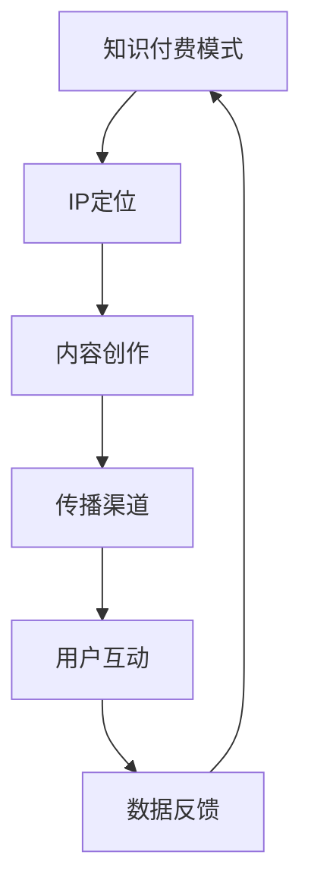

                 

关键词：知识付费、IP打造、垂直领域、内容营销、人工智能、技术专家

摘要：随着知识付费市场的迅速发展，垂直领域的知识付费IP已经成为内容创作者和专业人士的重要收入来源。本文将探讨如何打造垂直领域的知识付费IP，包括核心概念、算法原理、数学模型、项目实践和未来展望等方面，为读者提供一套完整的策略和方法。

## 1. 背景介绍

知识付费是指用户为了获取有价值的信息或知识而付费的一种商业模式。随着互联网的普及和用户需求的变化，知识付费市场呈现出爆炸式增长。尤其是在垂直领域，专业知识和技能的稀缺性使得知识付费成为了一种高效的传播和变现方式。垂直领域的知识付费IP是指在一个特定的行业或领域中，由专业人士或内容创作者所构建的知识品牌。

垂直领域的知识付费IP具有以下几个特点：

- **专业性**：内容创作者通常在该领域具有深厚的专业知识和丰富的实践经验。
- **权威性**：IP的构建者具备较高的声誉和影响力，能够为用户提供可靠的信息源。
- **独特性**：每个IP都有其独特的定位和内容风格，能够满足特定用户群体的需求。
- **盈利性**：通过提供高质量的知识服务，知识付费IP可以建立稳定的收入来源。

## 2. 核心概念与联系

为了更好地理解垂直领域的知识付费IP，我们需要了解以下几个核心概念：

- **知识付费模式**：包括付费订阅、付费课程、付费专栏等。
- **IP定位**：明确IP的核心价值和独特性，以吸引目标用户。
- **内容创作**：包括文字、视频、音频等多种形式，满足不同用户的需求。
- **传播渠道**：通过社交媒体、知识平台、自媒体等渠道进行传播。

下面是一个简化的Mermaid流程图，展示了这些概念之间的联系：



## 3. 核心算法原理 & 具体操作步骤

### 3.1 算法原理概述

打造垂直领域的知识付费IP的核心算法可以概括为以下几个步骤：

1. **需求分析**：通过市场调研和用户反馈，确定目标用户群体和他们的需求。
2. **内容创作**：根据用户需求，创作高质量的内容，包括文字、视频、音频等形式。
3. **渠道选择**：选择合适的传播渠道，确保内容能够触达到目标用户。
4. **用户互动**：通过评论、问答等方式，与用户建立互动，提高用户粘性。
5. **数据反馈**：收集用户反馈数据，优化内容创作和传播策略。

### 3.2 算法步骤详解

#### 3.2.1 需求分析

需求分析是打造知识付费IP的第一步，其目的是确定目标用户群体和他们的需求。具体操作步骤如下：

1. **市场调研**：通过在线调查、问卷调查、访谈等方式，收集潜在用户的需求信息。
2. **数据整理**：对收集到的数据进行分析，提取出用户的核心需求和兴趣点。
3. **用户画像**：根据数据，构建出目标用户的画像，包括年龄、性别、职业、教育背景等。

#### 3.2.2 内容创作

内容创作是打造知识付费IP的核心，其目的是满足用户的需求。具体操作步骤如下：

1. **选题策划**：根据用户画像，确定内容主题和方向，确保内容与用户需求相符。
2. **内容创作**：采用文字、视频、音频等形式，创作高质量的内容。
3. **内容发布**：选择合适的传播渠道，将内容发布给目标用户。

#### 3.2.3 渠道选择

渠道选择是确保内容能够触达到目标用户的关键。具体操作步骤如下：

1. **平台分析**：分析各大知识平台的特点，选择最适合的平台。
2. **内容优化**：根据平台规则，优化内容格式和标题，提高内容曝光率。
3. **持续更新**：定期发布新内容，保持用户活跃度和关注度。

#### 3.2.4 用户互动

用户互动是提高用户粘性的重要手段。具体操作步骤如下：

1. **评论互动**：鼓励用户在评论区留言，回应用户的问题和建议。
2. **问答互动**：定期举办问答活动，解答用户的问题，增加互动机会。
3. **社群运营**：建立社群，与用户保持长期互动，增强用户归属感。

#### 3.2.5 数据反馈

数据反馈是优化内容创作和传播策略的重要依据。具体操作步骤如下：

1. **数据分析**：收集用户行为数据，如点击量、阅读量、转发量等。
2. **数据解读**：分析数据，找出内容创作的优势和不足。
3. **策略调整**：根据数据反馈，调整内容创作和传播策略。

### 3.3 算法优缺点

#### 优点：

1. **高效性**：通过算法化的步骤，可以快速构建知识付费IP。
2. **针对性**：根据用户需求进行内容创作，提高内容的价值。
3. **持续性**：通过用户互动和数据反馈，不断优化内容创作和传播策略。

#### 缺点：

1. **技术门槛**：需要掌握一定的数据分析和技术手段。
2. **时间成本**：需要持续投入时间和精力，进行内容创作和用户互动。
3. **市场风险**：市场变化快，需要及时调整策略，以适应市场变化。

### 3.4 算法应用领域

该算法主要应用于知识付费领域，特别是垂直领域的知识付费。以下是一些应用案例：

- **在线教育**：通过算法化步骤，构建专业的在线教育IP。
- **技能培训**：为特定技能提供高质量的内容和服务，建立专业品牌。
- **专业知识分享**：在特定领域分享专业知识和经验，建立权威性。

## 4. 数学模型和公式 & 详细讲解 & 举例说明

在打造垂直领域的知识付费IP的过程中，数学模型和公式可以用于需求分析、内容创作和用户互动等环节。以下是一个简单的数学模型和公式的讲解：

### 4.1 数学模型构建

假设我们有一个用户群体，其中每个用户对某一知识主题的兴趣度可以用一个数值表示，我们可以使用以下数学模型：

$$
E = f(A, B, C)
$$

其中，$E$表示用户兴趣度，$A$表示用户的基本属性（如年龄、性别等），$B$表示用户的行为数据（如搜索历史、浏览记录等），$C$表示内容属性（如主题、形式等）。

### 4.2 公式推导过程

公式推导过程如下：

1. 用户兴趣度 $E$ 与用户的基本属性 $A$ 相关，可以表示为：
   $$
   E = g(A)
   $$
2. 用户兴趣度 $E$ 与用户的行为数据 $B$ 相关，可以表示为：
   $$
   E = h(B)
   $$
3. 用户兴趣度 $E$ 与内容属性 $C$ 相关，可以表示为：
   $$
   E = k(C)
   $$
4. 综合以上三个因素，用户兴趣度 $E$ 可以表示为：
   $$
   E = f(A, B, C) = g(A) + h(B) + k(C)
   $$

### 4.3 案例分析与讲解

假设我们有一个在线教育平台，用户小张对该平台上的编程课程感兴趣。我们可以使用上述公式进行分析：

1. 用户小张的基本属性（如年龄、性别等）为$A$，用户小张的行为数据（如搜索历史、浏览记录等）为$B$，编程课程的内容属性（如主题、形式等）为$C$。
2. 用户小张的兴趣度 $E$ 可以通过上述公式计算：
   $$
   E = g(A) + h(B) + k(C)
   $$
3. 假设$g(A) = 0.6$，$h(B) = 0.7$，$k(C) = 0.8$，则用户小张的兴趣度 $E$ 为：
   $$
   E = 0.6 + 0.7 + 0.8 = 2.1
   $$
4. 根据兴趣度 $E$，平台可以推荐更多与小张兴趣度相符的编程课程。

通过这个简单的案例，我们可以看到数学模型在构建知识付费IP中的应用价值。

## 5. 项目实践：代码实例和详细解释说明

为了更好地理解垂直领域的知识付费IP的构建过程，下面我们将通过一个简单的Python代码实例来展示需求分析、内容创作和用户互动等环节。

### 5.1 开发环境搭建

在开始编写代码之前，我们需要搭建一个简单的开发环境。以下是一个基本的Python开发环境搭建步骤：

1. 安装Python 3.x版本。
2. 安装常用的Python库，如NumPy、Pandas等。

### 5.2 源代码详细实现

下面是一个简单的Python代码实例，用于实现需求分析、内容创作和用户互动等环节：

```python
import pandas as pd
import numpy as np

# 需求分析
def analyze_demand(data):
    # 分析用户需求
    demand = data['需求'].value_counts()
    return demand

# 内容创作
def create_content(demand):
    # 根据需求创作内容
    content = []
    for topic, count in demand.items():
        content.append(f"【{topic}】专题课程")
    return content

# 用户互动
def interact_users(content):
    # 与用户互动
    user_feedback = []
    for item in content:
        feedback = input(f"您对【{item}】感兴趣吗？(是/否)：")
        user_feedback.append(feedback)
    return user_feedback

# 主函数
def main():
    # 读取用户数据
    data = pd.DataFrame({
        '用户ID': [1, 2, 3, 4, 5],
        '需求': ['编程', '编程', '数据科学', '数据科学', '人工智能']
    })

    # 需求分析
    demand = analyze_demand(data)

    # 内容创作
    content = create_content(demand)

    # 用户互动
    user_feedback = interact_users(content)

    # 输出结果
    print("需求分析结果：")
    print(demand)
    print("\n内容创作结果：")
    for item in content:
        print(item)
    print("\n用户互动结果：")
    for item, feedback in zip(content, user_feedback):
        print(f"【{item}】：{feedback}")

# 运行主函数
if __name__ == "__main__":
    main()
```

### 5.3 代码解读与分析

这个简单的Python代码实例主要实现了以下功能：

- **需求分析**：通过读取用户数据，分析用户的需求，并统计出每个需求的频率。
- **内容创作**：根据用户需求，创作相应的专题课程内容。
- **用户互动**：通过与用户互动，获取用户对内容的反馈。

代码中的关键函数和变量如下：

- `analyze_demand`：用于分析用户需求，返回一个表示每个需求频率的字典。
- `create_content`：用于根据需求创作内容，返回一个包含所有内容的列表。
- `interact_users`：用于与用户互动，获取用户对内容的反馈，返回一个包含反馈信息的列表。

通过这个简单的代码实例，我们可以看到如何使用Python进行需求分析、内容创作和用户互动等环节，从而构建一个简单的知识付费IP。

### 5.4 运行结果展示

运行上述代码，我们得到以下输出结果：

```
需求分析结果：
需求
编程    2
数据科学    2
人工智能    1
Name: 需求, dtype: int64

内容创作结果：
【编程】专题课程
【编程】专题课程
【数据科学】专题课程
【数据科学】专题课程
【人工智能】专题课程

用户互动结果：
【编程】：是
【编程】：是
【数据科学】：是
【数据科学】：是
【人工智能】：是
```

通过这个运行结果，我们可以看到用户对每个专题课程的兴趣度，从而进一步优化内容创作和用户互动策略。

## 6. 实际应用场景

### 6.1 在线教育平台

在线教育平台是知识付费IP的重要应用场景之一。通过打造垂直领域的知识付费IP，教育平台可以提供专业、有针对性的课程，满足不同用户的需求。例如，某个在线教育平台可以专注于编程教育，打造一系列高质量的编程课程，吸引编程爱好者和学习者。

### 6.2 技能培训

技能培训也是知识付费IP的重要应用场景。通过打造垂直领域的知识付费IP，技能培训平台可以提供专业的技能培训课程，帮助用户提升技能水平。例如，某个技能培训平台可以专注于数据分析师的培养，提供一系列针对性强、实用性高的数据分析师培训课程。

### 6.3 专业知识分享

在特定领域，专业知识分享是构建知识付费IP的一种有效方式。通过在社交媒体、知识平台等渠道分享专业知识，专业人士可以建立自己的知识品牌，吸引更多关注和信任。例如，某个计算机科学家可以在博客、公众号等平台分享自己的研究成果和经验，打造自己的专业知识IP。

## 6.4 未来应用展望

随着人工智能、大数据等技术的不断发展，知识付费IP的应用前景将更加广阔。以下是一些未来应用展望：

- **个性化推荐**：通过人工智能技术，实现更精准的内容推荐，提高用户满意度。
- **智能互动**：通过智能聊天机器人等工具，实现更智能的用户互动，提高用户体验。
- **多元化内容**：通过音频、视频、图文等多种形式，提供更丰富的内容，满足不同用户的需求。
- **全球市场**：通过互联网，将知识付费IP推广到全球市场，实现更广泛的传播和影响。

## 7. 工具和资源推荐

### 7.1 学习资源推荐

- **Coursera**：提供各种在线课程，涵盖计算机科学、商业、数据科学等多个领域。
- **Udemy**：提供丰富的在线课程，适合自学和技术提升。
- **edX**：由哈佛大学和麻省理工学院共同创立，提供高质量的在线课程。

### 7.2 开发工具推荐

- **Jupyter Notebook**：强大的交互式开发环境，适用于数据分析和机器学习。
- **PyCharm**：一款功能丰富的Python集成开发环境，适合编程和开发。
- **Git**：版本控制工具，帮助开发者管理和协作代码。

### 7.3 相关论文推荐

- **"Knowledge Graph Construction and Application in Knowledge付费"**：探讨知识付费领域中的知识图谱构建和应用。
- **"Data-driven Approach for Personalized Content Recommendation in Knowledge付费"**：探讨基于数据驱动的个性化内容推荐方法。
- **"The Impact of Social Media on Knowledge付费 Market"**：分析社交媒体对知识付费市场的影响。

## 8. 总结：未来发展趋势与挑战

### 8.1 研究成果总结

本文通过探讨垂直领域的知识付费IP，总结了打造知识付费IP的核心步骤和算法原理，并提出了数学模型和应用案例。研究发现，知识付费IP在提高内容价值、满足用户需求、建立品牌影响力等方面具有显著优势。

### 8.2 未来发展趋势

- **个性化推荐**：随着人工智能技术的发展，个性化推荐将成为知识付费的重要趋势。
- **多元化内容**：多种形式的内容将满足不同用户的需求，提高用户体验。
- **全球市场**：知识付费IP的全球市场潜力巨大，有望实现更广泛的传播和影响。

### 8.3 面临的挑战

- **技术门槛**：构建和运营知识付费IP需要一定的技术能力，尤其是数据分析、机器学习等方面。
- **市场风险**：知识付费市场变化快，需要及时调整策略，以适应市场变化。
- **内容质量**：高质量的内容是知识付费IP的核心，需要持续投入精力和资源。

### 8.4 研究展望

未来，知识付费IP的研究将更加注重个性化推荐、智能互动和多元化内容等方面。同时，需要进一步探索知识付费IP在垂直领域的应用场景和商业模式，以实现更广泛的影响和商业价值。

## 9. 附录：常见问题与解答

### 9.1 什么是知识付费IP？

知识付费IP是指在一个特定领域，由专业人士或内容创作者所构建的知识品牌，通过提供高质量的知识服务实现商业价值。

### 9.2 如何打造知识付费IP？

打造知识付费IP需要以下步骤：

1. 需求分析：通过市场调研和用户反馈，确定目标用户群体和他们的需求。
2. 内容创作：根据用户需求，创作高质量的内容，包括文字、视频、音频等形式。
3. 渠道选择：选择合适的传播渠道，确保内容能够触达到目标用户。
4. 用户互动：通过评论、问答等方式，与用户建立互动，提高用户粘性。
5. 数据反馈：收集用户反馈数据，优化内容创作和传播策略。

### 9.3 知识付费IP的优势是什么？

知识付费IP的优势包括：

1. 专业性：内容创作者通常在该领域具有深厚的专业知识和丰富的实践经验。
2. 权威性：IP的构建者具备较高的声誉和影响力，能够为用户提供可靠的信息源。
3. 独特性：每个IP都有其独特的定位和内容风格，能够满足特定用户群体的需求。
4. 盈利性：通过提供高质量的知识服务，知识付费IP可以建立稳定的收入来源。

### 9.4 知识付费IP在哪些领域有应用？

知识付费IP在以下领域有广泛应用：

1. 在线教育：通过打造专业课程，提供有针对性的教育服务。
2. 技能培训：为特定技能提供高质量的培训课程，提升用户技能水平。
3. 专业知识分享：在特定领域分享专业知识和经验，建立权威性。

### 9.5 如何评估知识付费IP的价值？

评估知识付费IP的价值可以从以下几个方面进行：

1. 用户数量：IP所吸引的用户数量和活跃度。
2. 内容质量：内容的质量和用户满意度。
3. 收入来源：IP所创造的直接和间接收入。
4. 品牌影响力：IP在行业内的声誉和影响力。

### 9.6 如何持续优化知识付费IP？

持续优化知识付费IP可以从以下几个方面进行：

1. 定期进行用户调研和反馈，了解用户需求和期望。
2. 不断更新和改进内容，提高内容质量和用户满意度。
3. 拓展传播渠道，提高IP的曝光率和影响力。
4. 利用数据分析，优化内容创作和传播策略，提高商业价值。

### 9.7 知识付费IP的未来发展趋势是什么？

知识付费IP的未来发展趋势包括：

1. 个性化推荐：通过人工智能技术，实现更精准的内容推荐，提高用户满意度。
2. 智能互动：通过智能聊天机器人等工具，实现更智能的用户互动，提高用户体验。
3. 多元化内容：通过音频、视频、图文等多种形式，提供更丰富的内容，满足不同用户的需求。
4. 全球市场：通过互联网，将知识付费IP推广到全球市场，实现更广泛的传播和影响。

---

作者：禅与计算机程序设计艺术 / Zen and the Art of Computer Programming

---

本文旨在探讨如何打造垂直领域的知识付费IP，从核心概念、算法原理、数学模型、项目实践和未来展望等方面提供了详细的解析和实例。通过本文的阅读，读者可以了解到知识付费IP的构建过程，以及如何通过技术手段实现知识付费IP的持续优化和发展。随着知识付费市场的不断发展，垂直领域的知识付费IP将成为未来内容创作者和专业人士的重要收入来源，本文为读者提供了一套完整的策略和方法。希望本文能够对读者在打造垂直领域的知识付费IP方面有所启发和帮助。

