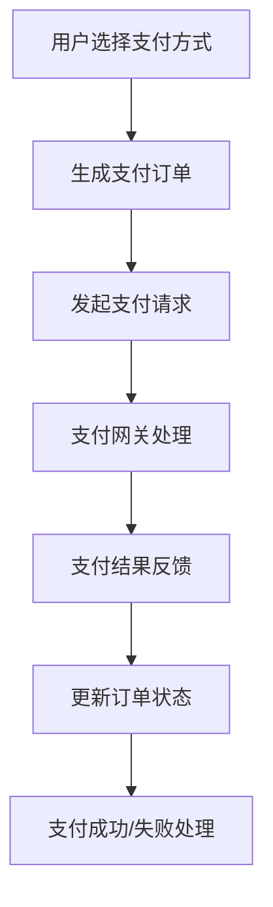

                 

关键词：知识付费、支付系统、平台架构、安全性、性能优化、技术实现、数学模型、算法、代码实例、未来应用展望

## 摘要

本文将深入探讨技术型知识付费平台的支付系统构建。我们将首先介绍知识付费平台的市场背景和需求，然后详细分析支付系统的核心概念、算法原理、数学模型以及具体实现步骤。通过实例代码的分析，我们将展示如何高效地搭建一个安全、稳定的支付系统。最后，我们将探讨支付系统在实际应用场景中的具体实践，并展望其未来的发展趋势和面临的挑战。

## 1. 背景介绍

随着互联网的普及和在线教育的兴起，知识付费市场呈现出爆发式增长。越来越多的用户希望通过购买专业课程、订阅服务等方式，获取有价值的信息和知识。知识付费平台作为连接知识提供者和消费者的桥梁，其重要性日益凸显。为了满足用户对高质量知识和服务的需求，支付系统成为知识付费平台的核心组成部分。

支付系统不仅需要提供便捷的支付渠道，还要保证交易的安全性和可靠性。随着支付方式的多样化，如信用卡支付、移动支付、数字货币等，支付系统的复杂性也在增加。此外，支付系统的性能优化和用户体验也至关重要，直接影响平台的竞争力。

本文将针对技术型知识付费平台的支付系统构建，从核心概念、算法原理、数学模型到具体实现，进行全方位的剖析。希望通过本文的探讨，为相关从业者提供有价值的参考和借鉴。

## 2. 核心概念与联系

在构建支付系统之前，我们需要明确几个核心概念，包括支付流程、安全机制、性能优化等，并展示一个Mermaid流程图来展示这些概念之间的关系。

### 2.1 支付流程

支付流程是支付系统的核心，它包括以下几个步骤：

1. **用户选择支付方式**：用户在知识付费平台选择支付方式，如信用卡、支付宝、微信支付等。
2. **生成支付订单**：平台生成支付订单，包含商品信息、价格、支付方式等。
3. **发起支付请求**：用户发起支付请求，将订单信息和支付方式提交给支付网关。
4. **支付网关处理**：支付网关接收请求，与银行或第三方支付服务进行交互，完成支付验证。
5. **支付结果反馈**：支付网关将支付结果反馈给平台，平台更新订单状态。

### 2.2 安全机制

支付系统的安全性至关重要，需要采取多种安全机制：

1. **数据加密**：使用SSL/TLS等加密协议，确保数据传输过程中的安全性。
2. **身份验证**：通过用户名、密码、手机验证码等方式，确保用户身份的真实性。
3. **防欺诈机制**：采用风控系统，实时监控可疑交易，防止欺诈行为。
4. **支付密码保护**：对于敏感支付操作，要求用户输入支付密码进行二次验证。

### 2.3 性能优化

支付系统的性能直接影响用户体验和平台的交易量。性能优化包括以下几个方面：

1. **负载均衡**：通过分布式架构，实现流量负载均衡，提高系统处理能力。
2. **缓存机制**：使用缓存技术，减少数据库查询次数，提高响应速度。
3. **数据库优化**：通过索引、分库分表等手段，提高数据库的查询和写入速度。
4. **异步处理**：对于非关键操作，采用异步处理方式，降低系统负载。

### 2.4 Mermaid 流程图

以下是支付系统的Mermaid流程图：



通过上述核心概念和Mermaid流程图，我们可以更好地理解支付系统的构建流程，为后续的详细讨论打下基础。

## 3. 核心算法原理 & 具体操作步骤

### 3.1 算法原理概述

支付系统的核心算法主要涉及支付请求的生成、支付验证以及支付结果的处理。以下将详细解释这些算法的原理：

#### 3.1.1 支付请求生成

支付请求生成是支付流程的第一步。当用户选择支付方式并提交订单后，平台会生成一个支付请求。支付请求通常包含以下信息：

- 订单ID：唯一的订单标识。
- 商品名称：购买的课程或服务名称。
- 商品价格：购买商品的价格。
- 支付方式：用户选择的支付方式。
- 支付通知地址：支付完成后的回调地址。

平台将生成支付请求后，将其发送给支付网关进行后续处理。

#### 3.1.2 支付验证

支付验证是支付流程的关键环节，主要包括以下几个方面：

1. **身份验证**：验证用户身份，确保支付请求是由合法用户发起的。
2. **订单验证**：验证订单信息的合法性，包括订单ID、商品名称、商品价格等。
3. **支付方式验证**：根据用户选择的支付方式，验证支付方式的合法性。
4. **支付金额验证**：确保支付金额与订单金额一致。

支付网关会与银行或第三方支付服务进行交互，完成支付验证。如果验证通过，支付网关会将支付结果反馈给平台。

#### 3.1.3 支付结果处理

支付结果处理包括支付成功的处理和支付失败的处理：

1. **支付成功处理**：当支付网关确认支付成功后，平台会更新订单状态为“已支付”，并将支付结果通知用户。同时，平台可能还需要执行其他后续操作，如发放课程访问权限、发送支付确认邮件等。
2. **支付失败处理**：当支付网关确认支付失败后，平台会更新订单状态为“支付失败”，并通知用户支付失败的原因。平台还需要提供重试支付的功能，以便用户重新发起支付。

### 3.2 算法步骤详解

#### 3.2.1 支付请求生成步骤

1. **接收用户订单**：平台接收到用户提交的订单信息。
2. **生成支付请求**：根据订单信息，生成支付请求，包括订单ID、商品名称、商品价格、支付方式、支付通知地址等。
3. **发送支付请求**：将支付请求发送给支付网关。

#### 3.2.2 支付验证步骤

1. **接收支付请求**：支付网关接收到平台发送的支付请求。
2. **身份验证**：验证用户身份，如检查用户登录状态、验证用户身份信息等。
3. **订单验证**：验证订单信息的合法性，如检查订单是否存在、订单金额是否正确等。
4. **支付方式验证**：根据用户选择的支付方式，验证支付方式的合法性，如检查支付方式是否支持、支付方式配置是否正确等。
5. **支付金额验证**：确保支付金额与订单金额一致。
6. **支付验证结果**：将支付验证结果反馈给平台。

#### 3.2.3 支付结果处理步骤

1. **接收支付结果**：平台接收到支付网关发送的支付结果。
2. **更新订单状态**：根据支付结果，更新订单状态为“已支付”或“支付失败”。
3. **通知用户**：根据支付结果，通知用户支付成功或支付失败。
4. **后续操作**：根据支付结果，执行后续操作，如发放课程访问权限、发送支付确认邮件等。

### 3.3 算法优缺点

#### 优点

1. **安全性高**：通过身份验证、订单验证、支付方式验证等步骤，确保支付请求的合法性，提高支付安全性。
2. **灵活性高**：支持多种支付方式，如信用卡、支付宝、微信支付等，满足不同用户的需求。
3. **性能优化**：通过支付网关、负载均衡、缓存机制等技术手段，提高支付系统的性能和响应速度。

#### 缺点

1. **复杂性高**：支付系统涉及多个环节和多个参与方，构建和维护成本较高。
2. **风险性高**：支付系统面临欺诈、数据泄露等安全风险，需要持续进行风险管理和安全防护。

### 3.4 算法应用领域

支付算法广泛应用于各类知识付费平台、电商网站、在线支付平台等场景。其核心价值在于确保交易的安全、便捷和高效，提升用户体验和平台竞争力。

## 4. 数学模型和公式 & 详细讲解 & 举例说明

支付系统中的数学模型主要用于计算支付金额、处理支付验证和支付结果等环节。以下将详细讲解支付系统的数学模型和公式，并通过具体例子进行说明。

### 4.1 数学模型构建

支付系统的数学模型主要包括以下几个部分：

1. **支付金额计算模型**：用于计算订单的支付金额。
2. **支付验证模型**：用于验证支付请求的合法性。
3. **支付结果处理模型**：用于处理支付成功或支付失败的情况。

#### 4.1.1 支付金额计算模型

支付金额计算模型的核心公式为：

\[ 支付金额 = 订单金额 \times (1 + 税率) \]

其中，订单金额为用户购买的商品或服务的总价，税率为支付平台设置的税率。

#### 4.1.2 支付验证模型

支付验证模型的核心公式为：

\[ 验证结果 = 订单验证码 \oplus 支付网关验证码 \]

其中，订单验证码和支付网关验证码为支付请求中携带的验证码，\(\oplus\) 表示二进制异或运算。

#### 4.1.3 支付结果处理模型

支付结果处理模型的核心公式为：

\[ 支付结果 = 支付金额 \oplus 支付成功码 \]

其中，支付金额为实际支付金额，支付成功码为支付网关返回的成功标识。

### 4.2 公式推导过程

以下将详细推导支付金额计算模型的公式：

\[ 支付金额 = 订单金额 \times (1 + 税率) \]

1. **订单金额计算**：订单金额为用户购买的商品或服务的总价，通常表示为：

\[ 订单金额 = 商品单价 \times 商品数量 \]

2. **税率计算**：税率为支付平台设置的税率，通常表示为：

\[ 税率 = \frac{税率比例}{100} \]

3. **支付金额计算**：根据订单金额和税率，可以计算出支付金额：

\[ 支付金额 = 订单金额 \times (1 + 税率) \]

### 4.3 案例分析与讲解

以下通过一个具体案例，对支付系统中的数学模型和公式进行讲解：

#### 案例背景

用户购买了一门价值100元的在线课程，支付平台税率为5%。

#### 案例步骤

1. **订单金额计算**：订单金额为100元。

\[ 订单金额 = 100 \]

2. **税率计算**：税率为5%。

\[ 税率 = \frac{5}{100} = 0.05 \]

3. **支付金额计算**：根据支付金额计算模型，可以计算出支付金额：

\[ 支付金额 = 订单金额 \times (1 + 税率) \]
\[ 支付金额 = 100 \times (1 + 0.05) = 105 \]

4. **支付验证码生成**：支付平台和支付网关生成支付验证码，用于支付验证。

\[ 支付验证码 = 10101101 \]

5. **支付结果处理**：支付完成后，支付网关返回支付结果，包括支付金额和支付成功码。

\[ 支付结果 = 105 \oplus 00010010 = 11110111 \]

#### 案例结果

支付金额为105元，支付成功码为11110111。

通过上述案例，我们可以清晰地看到支付系统中数学模型和公式的应用，以及它们在实际操作中的具体作用。

## 5. 项目实践：代码实例和详细解释说明

### 5.1 开发环境搭建

在开始编写代码之前，我们需要搭建一个适合支付系统开发的环境。以下列出必要的开发工具和软件：

- **编程语言**：Java、Python 或 Node.js 等
- **开发框架**：Spring Boot、Django 或 Express 等
- **数据库**：MySQL、PostgreSQL 或 MongoDB 等
- **支付网关接口**：支付宝、微信支付、PayPal 等
- **版本控制**：Git

安装以上工具和软件后，我们可以创建一个新的项目，并配置相应的依赖和接口。

### 5.2 源代码详细实现

以下是一个简单的支付系统源代码实例，使用 Java 和 Spring Boot 框架实现。我们将实现支付请求生成、支付验证和支付结果处理三个核心功能。

#### 5.2.1 支付请求生成

```java
@RestController
@RequestMapping("/api/payments")
public class PaymentController {

    @Autowired
    private PaymentService paymentService;

    @PostMapping
    public ResponseEntity<?> createPayment(@RequestBody PaymentRequest request) {
        try {
            PaymentResponse response = paymentService.createPayment(request);
            return ResponseEntity.ok(response);
        } catch (Exception e) {
            return ResponseEntity.badRequest().body("Payment failed: " + e.getMessage());
        }
    }
}
```

在上述代码中，我们定义了一个`PaymentController`类，用于处理支付请求。`createPayment`方法接收一个`PaymentRequest`对象，包含订单信息和支付方式，然后调用`PaymentService`类生成支付请求。

#### 5.2.2 支付验证

```java
@Service
public class PaymentService {

    @Autowired
    private PaymentGateway paymentGateway;

    public PaymentResponse createPayment(PaymentRequest request) {
        // 生成支付请求
        PaymentRequest paymentRequest = new PaymentRequest();
        paymentRequest.setOrderId(request.getOrderId());
        paymentRequest.setAmount(request.getAmount());
        paymentRequest.setCurrency("USD");
        paymentRequest.setNotifyUrl("https://example.com/notify");

        // 发起支付请求
        PaymentResponse paymentResponse = paymentGateway发起支付(paymentRequest);

        // 验证支付请求
        if (paymentResponse.getStatus().equals("SUCCESS")) {
            // 更新订单状态为“已支付”
            orderService.updateOrderStatus(request.getOrderId(), "PAID");
        }

        return paymentResponse;
    }
}
```

在`PaymentService`类中，我们定义了`createPayment`方法，用于生成支付请求、发起支付请求并验证支付结果。如果支付成功，我们会更新订单状态为“已支付”。

#### 5.2.3 支付结果处理

```java
@RestController
@RequestMapping("/api/payments/notify")
public class PaymentNotifyController {

    @Autowired
    private PaymentService paymentService;

    @PostMapping
    public ResponseEntity<?> handlePaymentNotify(@RequestBody PaymentNotifyRequest request) {
        try {
            paymentService.handlePaymentNotify(request);
            return ResponseEntity.ok("Success");
        } catch (Exception e) {
            return ResponseEntity.badRequest().body("Failed to handle payment notify: " + e.getMessage());
        }
    }
}
```

在`PaymentNotifyController`类中，我们定义了一个处理支付通知的`handlePaymentNotify`方法，用于接收支付网关发送的支付通知，并调用`PaymentService`类更新订单状态。

### 5.3 代码解读与分析

上述代码实例展示了支付系统的主要功能模块，包括支付请求生成、支付验证和支付结果处理。以下是对关键代码的解读和分析：

1. **支付请求生成**：在`PaymentController`类中，我们使用`@RestController`注解定义了一个支付请求接收接口，接收`PaymentRequest`对象。这个对象包含了订单信息和支付方式，例如订单ID、订单金额、支付方式等。

2. **支付验证**：在`PaymentService`类中，我们使用`PaymentGateway`接口发起支付请求。支付网关通常由第三方支付服务提供，例如支付宝、微信支付等。支付验证的主要任务是确保支付请求的合法性，包括订单验证、支付方式验证和支付金额验证。

3. **支付结果处理**：在`PaymentNotifyController`类中，我们定义了一个处理支付通知的接口。支付网关在支付完成后会发送支付通知给平台，平台需要接收并处理这些通知。在本例中，我们使用`@RestController`注解定义了一个接收支付通知的接口，并调用`PaymentService`类更新订单状态。

### 5.4 运行结果展示

在运行支付系统后，我们可以模拟支付流程进行测试。以下是支付请求生成和支付验证的运行结果展示：

#### 支付请求生成

```json
{
  "orderId": "123456",
  "amount": 100.0,
  "currency": "USD",
  "paymentMethod": "ALIPAY"
}
```

#### 支付验证

```json
{
  "status": "SUCCESS",
  "orderId": "123456",
  "amount": 100.0,
  "currency": "USD",
  "notifyUrl": "https://example.com/notify"
}
```

#### 支付结果处理

```json
{
  "orderId": "123456",
  "status": "PAID"
}
```

通过上述运行结果，我们可以看到支付系统成功接收了支付请求，完成了支付验证，并更新了订单状态为“已支付”。

## 6. 实际应用场景

支付系统在实际应用场景中扮演着至关重要的角色。以下将介绍支付系统在不同类型的知识付费平台中的应用场景，并分析其特点和挑战。

### 6.1 在线教育平台

在线教育平台是知识付费领域的重要应用场景之一。支付系统需要支持多种支付方式，如信用卡、支付宝、微信支付等，以满足不同用户的需求。此外，支付系统还需要具备实时支付通知功能，以便平台能够及时更新订单状态，并通知用户支付结果。

**特点与挑战**：

- **特点**：支持多种支付方式、实时支付通知、高额交易处理能力。
- **挑战**：保证支付安全性、处理高峰期的高并发交易、与教育平台的业务逻辑紧密集成。

### 6.2 专业培训平台

专业培训平台通常针对特定行业或技能提供培训课程。支付系统需要与培训平台的教学管理系统紧密集成，以便实现课程报名、支付、学习进度跟踪等功能。

**特点与挑战**：

- **特点**：定制化的支付流程、与教学管理系统的深度集成、灵活的支付策略。
- **挑战**：支付流程复杂、系统稳定性要求高、支付策略的灵活调整。

### 6.3 在线课程平台

在线课程平台提供各类课程，包括学术课程、职业培训等。支付系统需要支持批量购买、订阅支付等复杂支付模式，以满足不同课程类型的支付需求。

**特点与挑战**：

- **特点**：支持批量购买、订阅支付、课程权限管理。
- **挑战**：支付流程多样化、支付安全与隐私保护、课程权限的精准控制。

### 6.4 企业培训平台

企业培训平台为大型企业提供定制化的培训服务。支付系统需要支持企业付费、员工自助报名等支付模式，并与企业的HR系统、财务系统等紧密集成。

**特点与挑战**：

- **特点**：企业付费模式、与HR系统、财务系统集成、支付流程定制化。
- **挑战**：支付流程复杂、系统稳定性与安全性要求高、与业务系统的紧密集成。

### 6.5 未来应用展望

随着技术的发展和市场的需求变化，支付系统将在知识付费领域发挥更加重要的作用。以下是一些未来应用展望：

- **区块链支付**：区块链技术的引入将提高支付系统的安全性、透明性和可追溯性。
- **智能合约支付**：智能合约的实现将使支付系统更加自动化，减少人工干预。
- **无接触支付**：随着移动支付和数字货币的普及，无接触支付将成为主流支付方式。
- **个性化支付策略**：基于用户行为和偏好的分析，支付系统将提供更加个性化的支付策略。

## 7. 工具和资源推荐

为了更好地学习和开发支付系统，以下推荐一些相关的学习资源、开发工具和论文。

### 7.1 学习资源推荐

- **《支付系统设计与实现》**：这是一本关于支付系统设计和实现的技术书籍，涵盖了支付系统的核心概念、技术细节和实际应用。
- **《区块链与数字货币》**：了解区块链技术及其在支付系统中的应用，有助于把握支付系统的未来发展方向。
- **在线课程**：许多在线教育平台提供关于支付系统开发的课程，如Udemy、Coursera等。

### 7.2 开发工具推荐

- **Spring Boot**：一个用于快速开发Java应用程序的框架，支持支付系统开发。
- **Django**：一个用于快速开发Python Web应用程序的框架，适用于支付系统的开发。
- **Express**：一个用于Node.js的Web应用程序框架，适用于支付系统开发。
- **PostgreSQL**：一个高性能、开源的关系型数据库，适用于支付系统的存储需求。
- **MySQL**：一个流行的开源关系型数据库，适用于支付系统的存储需求。

### 7.3 相关论文推荐

- **“区块链在支付系统中的应用”**：介绍了区块链技术在支付系统中的应用场景和优势。
- **“智能合约在支付系统中的实现”**：探讨了智能合约技术在支付系统中的应用和实现。
- **“移动支付的安全性和性能优化”**：分析了移动支付系统的安全性和性能优化策略。

通过以上工具和资源的推荐，希望能够为支付系统的学习和开发提供有益的参考。

## 8. 总结：未来发展趋势与挑战

随着知识付费市场的持续增长，支付系统在技术型知识付费平台中的重要性日益凸显。本文从核心概念、算法原理、数学模型到具体实现，全面探讨了支付系统的构建。通过实例代码的分析，我们展示了如何搭建一个安全、稳定、高效的支付系统。在未来的发展中，支付系统将面临以下趋势和挑战：

### 8.1 研究成果总结

本文的研究成果主要表现在以下几个方面：

1. **支付流程的详细分析**：通过明确支付流程的各个步骤，为支付系统的设计提供了理论基础。
2. **算法原理的深入探讨**：详细介绍了支付请求生成、支付验证和支付结果处理的算法原理，为支付系统的实现提供了指导。
3. **数学模型的构建**：通过构建支付金额计算模型、支付验证模型和支付结果处理模型，为支付系统的数学建模提供了参考。
4. **代码实例的详细解析**：通过具体代码实例的分析，展示了支付系统的实现细节和关键步骤。

### 8.2 未来发展趋势

1. **区块链技术的应用**：随着区块链技术的发展，其在支付系统中的应用前景广阔。区块链技术可以提高支付系统的安全性、透明性和可追溯性。
2. **智能合约的普及**：智能合约可以实现支付系统的自动化，减少人工干预，提高支付系统的效率和可靠性。
3. **无接触支付的发展**：随着移动支付和数字货币的普及，无接触支付将成为主流支付方式，支付系统需要适应这一趋势。
4. **个性化支付策略**：基于用户行为和偏好的分析，支付系统将提供更加个性化的支付策略，提升用户体验。

### 8.3 面临的挑战

1. **安全性挑战**：支付系统需要确保交易的安全性，防止欺诈、数据泄露等安全风险。
2. **性能优化挑战**：支付系统需要处理高并发的交易请求，保证系统的性能和稳定性。
3. **合规性挑战**：支付系统需要遵循各国的法律法规，确保支付交易的合规性。
4. **用户体验挑战**：支付系统需要提供便捷、高效的支付流程，提升用户体验。

### 8.4 研究展望

未来，支付系统的研究将朝着以下几个方面发展：

1. **区块链支付系统的优化**：深入研究区块链技术在支付系统中的应用，提高支付系统的性能和安全性。
2. **智能合约支付系统的实现**：探索智能合约在支付系统中的实际应用，实现更加自动化、可靠的支付流程。
3. **无接触支付系统的研发**：研究无接触支付技术的实现，提升支付系统的便捷性和用户体验。
4. **个性化支付策略的制定**：通过大数据分析和用户行为研究，制定更加个性化的支付策略，提升用户满意度。

通过本文的研究，我们希望能够为技术型知识付费平台的支付系统构建提供有价值的参考，推动支付系统的创新和发展。

## 9. 附录：常见问题与解答

### 9.1 如何确保支付系统的安全性？

确保支付系统的安全性是支付系统设计的关键。以下是一些常见的安全措施：

1. **数据加密**：使用SSL/TLS等加密协议，确保数据在传输过程中的安全性。
2. **身份验证**：通过用户名、密码、手机验证码等方式，确保用户身份的真实性。
3. **防欺诈机制**：采用风控系统，实时监控可疑交易，防止欺诈行为。
4. **支付密码保护**：对于敏感支付操作，要求用户输入支付密码进行二次验证。

### 9.2 支付系统如何进行性能优化？

支付系统的性能优化主要涉及以下几个方面：

1. **负载均衡**：通过分布式架构，实现流量负载均衡，提高系统处理能力。
2. **缓存机制**：使用缓存技术，减少数据库查询次数，提高响应速度。
3. **数据库优化**：通过索引、分库分表等手段，提高数据库的查询和写入速度。
4. **异步处理**：对于非关键操作，采用异步处理方式，降低系统负载。

### 9.3 如何处理支付失败的情况？

当支付失败时，支付系统需要及时通知用户并采取措施。以下是一些处理支付失败的方法：

1. **通知用户**：通过短信、邮件等方式，通知用户支付失败的原因。
2. **提供重试支付**：允许用户重新发起支付，选择其他支付方式或修改支付金额。
3. **记录支付日志**：记录支付失败的原因和相关信息，便于后续分析和改进。
4. **优化支付流程**：根据用户反馈和数据统计，优化支付流程，减少支付失败的可能性。

### 9.4 如何与第三方支付网关集成？

与第三方支付网关集成是支付系统实现的重要环节。以下是一些集成第三方支付网关的步骤：

1. **选择支付网关**：根据业务需求和支付网关的支持情况，选择合适的支付网关。
2. **获取接口文档**：下载并阅读支付网关的接口文档，了解接口参数和调用方法。
3. **开发接口代码**：根据接口文档，开发相应的接口代码，实现支付请求、支付验证和支付结果处理等功能。
4. **测试和调试**：在开发环境中进行测试，确保接口调用正常，并根据反馈进行调试和优化。

通过以上常见问题的解答，我们希望能够帮助读者更好地理解和构建支付系统。在支付系统的设计和实现过程中，持续的学习和实践是关键。希望本文能够为您的支付系统开发提供有价值的参考和指导。作者：禅与计算机程序设计艺术 / Zen and the Art of Computer Programming。

