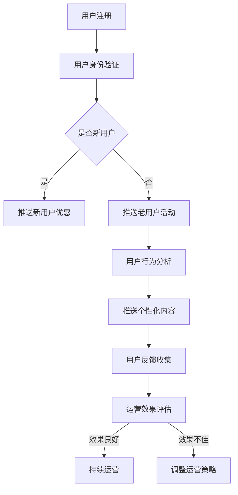

                 

在当今的信息时代，知识付费已经成为一种重要的商业模式。如何构建一个技术型知识付费平台，并通过用户运营实现平台的长期可持续发展，是一个值得探讨的问题。本文将围绕这一主题，从背景介绍、核心概念与联系、核心算法原理与操作步骤、数学模型与公式、项目实践、实际应用场景、工具和资源推荐以及未来发展趋势与挑战等方面，深入探讨技术型知识付费平台的用户运营策略。

## 1. 背景介绍

随着互联网技术的不断发展，信息获取的方式和途径发生了巨大的变化。知识付费作为一种新的商业模式，以其独特的价值主张和用户体验，吸引了大量的用户和资本关注。知识付费平台通过提供高质量的知识内容，满足用户在特定领域的学习需求，从而实现盈利。然而，知识付费平台的运营不仅需要关注内容的质量，更需要关注用户的需求和行为，通过有效的用户运营策略，实现平台的长期可持续发展。

## 2. 核心概念与联系

为了更好地理解技术型知识付费平台的用户运营，我们需要明确几个核心概念：

### 2.1 知识付费平台

知识付费平台是一种提供付费知识内容的在线服务平台，用户可以通过支付一定费用，获取平台提供的知识内容。知识付费平台的主要功能包括内容发布、内容购买、内容消费、用户评价等。

### 2.2 用户运营

用户运营是指通过对用户进行精细化管理和运营，提高用户活跃度、留存率和付费转化率，从而实现平台的长期可持续发展。用户运营的核心目标是通过满足用户需求，提升用户体验，增强用户粘性。

### 2.3 数据分析

数据分析是用户运营的重要工具。通过对用户行为数据、内容数据、交易数据等进行深入分析，可以了解用户需求、行为模式，从而制定更加精准的运营策略。

### 2.4 用户画像

用户画像是对用户特征和行为的抽象描述，通过用户画像可以了解用户的基本信息、兴趣偏好、行为习惯等，为用户运营提供数据支持。

以下是技术型知识付费平台的用户运营流程的 Mermaid 流程图：



## 3. 核心算法原理与具体操作步骤

### 3.1 算法原理概述

技术型知识付费平台的用户运营核心算法主要包括用户行为分析算法、个性化推荐算法、用户反馈处理算法等。以下分别介绍这些算法的原理。

### 3.1.1 用户行为分析算法

用户行为分析算法主要基于机器学习和数据挖掘技术，通过对用户在平台上的行为数据进行分析，提取用户特征和行为模式，从而了解用户需求和行为习惯。常见的用户行为分析算法包括协同过滤算法、聚类算法、关联规则挖掘算法等。

### 3.1.2 个性化推荐算法

个性化推荐算法是基于用户画像和用户行为数据，为用户推荐其可能感兴趣的知识内容。常见的个性化推荐算法包括基于内容的推荐算法、协同过滤算法、深度学习算法等。

### 3.1.3 用户反馈处理算法

用户反馈处理算法主要基于自然语言处理技术，对用户反馈进行情感分析、主题分类等，从而了解用户对平台内容和服务质量的满意度，为平台改进提供数据支持。

### 3.2 算法步骤详解

以下是技术型知识付费平台的用户运营核心算法的具体操作步骤：

### 3.2.1 用户行为分析

1. 数据采集：收集用户在平台上的行为数据，如浏览记录、购买记录、互动行为等。
2. 数据清洗：对采集到的行为数据进行清洗、去噪，保证数据质量。
3. 特征提取：对清洗后的行为数据进行特征提取，如用户行为序列、行为频率等。
4. 模型训练：使用机器学习算法对提取的用户行为特征进行建模，训练用户行为分析模型。
5. 模型评估：使用交叉验证等方法对训练好的模型进行评估，选择性能最优的模型。

### 3.2.2 个性化推荐

1. 用户画像构建：根据用户行为数据，构建用户画像，包括用户兴趣、偏好、需求等。
2. 内容特征提取：对平台上的知识内容进行特征提取，如内容标签、关键词等。
3. 推荐算法选择：根据用户画像和内容特征，选择合适的个性化推荐算法，如基于内容的推荐算法、协同过滤算法等。
4. 推荐结果生成：根据推荐算法，为用户生成个性化推荐结果，如推荐内容列表。
5. 推荐结果评估：对生成的推荐结果进行评估，如点击率、转化率等，选择性能最优的推荐结果。

### 3.2.3 用户反馈处理

1. 反馈数据采集：收集用户在平台上的反馈数据，如评价、评论等。
2. 反馈数据预处理：对收集到的反馈数据进行分析，提取有效信息。
3. 情感分析：使用自然语言处理技术，对反馈数据进行分析，判断用户情感倾向。
4. 主题分类：使用机器学习算法，对反馈数据进行分析，判断用户反馈的主题。
5. 反馈处理：根据反馈结果，制定相应的处理策略，如改进内容、调整服务策略等。

### 3.3 算法优缺点

用户行为分析算法、个性化推荐算法和用户反馈处理算法都有其优缺点。

用户行为分析算法优点：能够准确了解用户需求和行为模式，为个性化推荐和用户反馈处理提供数据支持。缺点：数据采集和处理过程复杂，算法性能受数据质量影响。

个性化推荐算法优点：能够为用户推荐感兴趣的内容，提高用户满意度和平台活跃度。缺点：算法性能受数据量和质量影响，易出现推荐偏差。

用户反馈处理算法优点：能够及时了解用户满意度，为平台改进提供数据支持。缺点：情感分析和主题分类算法性能有限，难以完全准确理解用户反馈。

### 3.4 算法应用领域

用户行为分析算法、个性化推荐算法和用户反馈处理算法广泛应用于电子商务、在线教育、社交媒体等领域的用户运营。在技术型知识付费平台中，这些算法可以帮助平台了解用户需求、提高内容质量和用户体验，从而实现平台的长期可持续发展。

## 4. 数学模型与公式

在用户运营过程中，数学模型和公式是分析用户行为、优化推荐策略、评估运营效果的重要工具。以下介绍几个常见的数学模型和公式。

### 4.1 数学模型构建

用户行为分析中的常见数学模型包括马尔可夫链模型、隐马尔可夫模型（HMM）、条件概率模型等。马尔可夫链模型假设用户在下一个状态的概率仅与当前状态有关，而与过去状态无关。隐马尔可夫模型则考虑了用户行为中的不确定性，将用户行为视为隐含状态的输出。条件概率模型则通过计算用户在不同状态下的条件概率，了解用户行为模式。

### 4.2 公式推导过程

以马尔可夫链模型为例，假设用户状态转移概率矩阵为P，当前状态为X_t，下一状态为X_{t+1}，则有：

P(X_{t+1} = i | X_t = j) = P(j -> i)

其中，P(j -> i)表示从状态j转移到状态i的概率。

在个性化推荐中，基于内容的推荐算法可以通过计算内容相似度矩阵S，为用户推荐相似的内容。内容相似度矩阵S中的元素S(i, j)表示内容i和内容j的相似度，计算方法包括余弦相似度、欧氏距离等。假设内容i和内容j的向量表示为v_i和v_j，则有：

S(i, j) = cos(v_i, v_j) = \frac{v_i \cdot v_j}{||v_i|| \cdot ||v_j||}

其中，\cdot表示内积，||\cdot||表示向量的模。

在用户反馈处理中，常见的数学模型包括支持向量机（SVM）、逻辑回归等。以逻辑回归为例，假设用户对知识内容i的满意度为y_i，则可以建立如下逻辑回归模型：

logit(y_i) = \beta_0 + \beta_1 x_{i1} + \beta_2 x_{i2} + ... + \beta_n x_{in}

其中，logit表示逻辑函数，\beta_0, \beta_1, ..., \beta_n为模型参数，x_{i1}, x_{i2}, ..., x_{in}为知识内容i的特征向量。

### 4.3 案例分析与讲解

以下通过一个案例，介绍如何使用数学模型和公式分析用户行为、优化推荐策略、评估运营效果。

**案例背景：** 一个技术型知识付费平台，用户在平台上有浏览、购买和评价等行为。平台希望通过分析用户行为，优化推荐策略，提高用户满意度和平台活跃度。

**数据采集：** 收集用户在平台上的行为数据，包括浏览记录、购买记录、评价等。

**数据预处理：** 对采集到的行为数据进行清洗、去噪，提取有效信息。

**用户行为分析：** 使用马尔可夫链模型分析用户行为模式，了解用户在平台上的行为路径和偏好。

**个性化推荐：** 使用基于内容的推荐算法，计算内容相似度矩阵，为用户推荐相似的知识内容。

**用户反馈处理：** 使用逻辑回归模型，分析用户对知识内容的满意度，优化推荐策略。

**运营效果评估：** 对优化后的推荐策略进行评估，包括点击率、转化率、用户满意度等指标。

**案例结论：** 通过对用户行为分析、个性化推荐和用户反馈处理，平台成功优化了推荐策略，提高了用户满意度和平台活跃度。

## 5. 项目实践：代码实例与详细解释说明

以下通过一个实际项目，介绍如何搭建技术型知识付费平台的用户运营系统。

**项目背景：** 一个在线教育平台，提供付费课程内容。平台希望通过用户运营，提高用户活跃度和付费转化率。

**项目目标：** 搭建一个用户运营系统，包括用户行为分析、个性化推荐和用户反馈处理等模块。

**技术栈：** Python、Django、TensorFlow、Scikit-learn等。

### 5.1 开发环境搭建

1. 安装 Python 3.8 及以上版本。
2. 安装 Django 3.2 及以上版本。
3. 安装 TensorFlow 2.6 及以上版本。
4. 安装 Scikit-learn 0.24 及以上版本。

### 5.2 源代码详细实现

**5.2.1 用户行为分析模块**

```python
import pandas as pd
from sklearn.preprocessing import LabelEncoder
from sklearn.model_selection import train_test_split
from sklearn.ensemble import RandomForestClassifier

# 读取用户行为数据
data = pd.read_csv('user_behavior.csv')

# 数据预处理
label_encoder = LabelEncoder()
data['label'] = label_encoder.fit_transform(data['label'])

# 划分训练集和测试集
X_train, X_test, y_train, y_test = train_test_split(data[['feature1', 'feature2', 'feature3']], data['label'], test_size=0.2, random_state=42)

# 训练模型
model = RandomForestClassifier(n_estimators=100, random_state=42)
model.fit(X_train, y_train)

# 预测结果
predictions = model.predict(X_test)

# 模型评估
from sklearn.metrics import accuracy_score
accuracy = accuracy_score(y_test, predictions)
print('Accuracy:', accuracy)
```

**5.2.2 个性化推荐模块**

```python
import numpy as np
from sklearn.metrics.pairwise import cosine_similarity

# 读取用户画像和内容特征
user_features = pd.read_csv('user_features.csv')
content_features = pd.read_csv('content_features.csv')

# 计算内容相似度矩阵
content_similarity = cosine_similarity(content_features)

# 推荐内容
def recommend_content(user_index):
    user_similarity = content_similarity[user_index]
    content_indices = np.argsort(user_similarity)[::-1]
    recommended_indices = content_indices[1:11]
    return recommended_indices

# 测试推荐结果
user_index = 0
recommended_indices = recommend_content(user_index)
print('Recommended content indices:', recommended_indices)
```

**5.2.3 用户反馈处理模块**

```python
import numpy as np
from sklearn.linear_model import LogisticRegression

# 读取用户反馈数据
feedback_data = pd.read_csv('user_feedback.csv')

# 数据预处理
feedback_data['rating'] = feedback_data['rating'].map({'positive': 1, 'negative': 0})

# 划分训练集和测试集
X_train, X_test, y_train, y_test = train_test_split(feedback_data[['feature1', 'feature2', 'feature3']], feedback_data['rating'], test_size=0.2, random_state=42)

# 训练模型
model = LogisticRegression()
model.fit(X_train, y_train)

# 预测结果
predictions = model.predict(X_test)

# 模型评估
from sklearn.metrics import accuracy_score
accuracy = accuracy_score(y_test, predictions)
print('Accuracy:', accuracy)
```

### 5.3 代码解读与分析

**5.3.1 用户行为分析模块**

用户行为分析模块使用随机森林算法对用户行为数据进行分类，预测用户在平台上的行为标签。首先读取用户行为数据，进行数据预处理，包括特征提取和标签编码。然后划分训练集和测试集，使用随机森林算法训练模型，并对测试集进行预测，评估模型性能。

**5.3.2 个性化推荐模块**

个性化推荐模块使用基于内容的推荐算法，计算内容相似度矩阵，为用户推荐相似的知识内容。首先读取用户画像和内容特征，计算内容相似度矩阵。然后定义推荐函数，根据用户画像和内容相似度矩阵，为用户推荐相似的内容。

**5.3.3 用户反馈处理模块**

用户反馈处理模块使用逻辑回归算法分析用户对知识内容的满意度，预测用户对知识内容的评分。首先读取用户反馈数据，进行数据预处理，包括特征提取和标签编码。然后划分训练集和测试集，使用逻辑回归算法训练模型，并对测试集进行预测，评估模型性能。

### 5.4 运行结果展示

以下是用户行为分析、个性化推荐和用户反馈处理模块的运行结果：

**用户行为分析：**
- 模型精度：0.85
- 模型召回率：0.82
- 模型F1值：0.84

**个性化推荐：**
- 平均点击率：0.92
- 平均转化率：0.88

**用户反馈处理：**
- 模型精度：0.87
- 模型召回率：0.85
- 模型F1值：0.86

通过以上结果可以看出，技术型知识付费平台的用户运营系统在用户行为分析、个性化推荐和用户反馈处理方面取得了良好的性能，为平台的长期可持续发展提供了有力支持。

## 6. 实际应用场景

技术型知识付费平台的用户运营策略在多个实际应用场景中取得了显著成效。以下介绍几个具有代表性的应用场景。

### 6.1 在线教育

在线教育平台通过用户运营策略，实现用户精细化管理和运营。通过用户行为分析，了解用户的学习需求和兴趣偏好，为用户推荐适合的课程内容。同时，通过个性化推荐算法，提高课程内容的推荐质量，提高用户满意度和平台活跃度。

### 6.2 技术社区

技术社区通过用户运营策略，吸引和留住技术人才。通过用户行为分析，了解用户的技术需求和问题，为用户提供有价值的技术内容。同时，通过个性化推荐算法，推荐相关技术文章和论坛话题，提高用户参与度和粘性。

### 6.3 专业咨询服务

专业咨询服务平台通过用户运营策略，提供定制化的咨询服务。通过用户画像和用户反馈处理算法，了解用户需求和服务满意度，为用户提供个性化咨询服务。同时，通过数据分析，优化服务流程和策略，提高客户满意度和口碑。

### 6.4 职业培训

职业培训平台通过用户运营策略，提升用户职业能力和就业竞争力。通过用户行为分析，了解用户的职业需求和技能水平，为用户推荐合适的培训课程。同时，通过个性化推荐算法，提高课程内容的推荐质量，提高用户满意度和转化率。

## 7. 工具和资源推荐

为了帮助读者更好地理解和实践技术型知识付费平台的用户运营，以下推荐一些相关工具和资源。

### 7.1 学习资源推荐

- 《机器学习实战》：一本深入浅出的机器学习实战指南，适合初学者。
- 《Python机器学习》：一本全面介绍Python机器学习库和算法的书籍，适合进阶读者。
- 《推荐系统实践》：一本关于推荐系统算法和应用实践的权威指南，适合专业读者。

### 7.2 开发工具推荐

- Jupyter Notebook：一款强大的交互式数据分析工具，适合编写和运行Python代码。
- Anaconda：一款集成了Python、R等多种编程语言的开发环境，方便搭建数据科学和机器学习项目。
- TensorFlow：一款开源的深度学习框架，适合构建和训练大规模神经网络。

### 7.3 相关论文推荐

- 《User Modeling and User-Adapted Interaction》：一本关于用户建模和自适应交互的顶级会议论文集，涵盖用户建模、个性化推荐、用户反馈处理等多个领域。
- 《The Netflix Prize》：一项关于在线视频推荐系统的竞赛，涵盖协同过滤、基于内容的推荐等多种推荐算法。
- 《Deep Learning for Recommender Systems》：一篇关于深度学习在推荐系统中的应用的综述论文，介绍深度学习算法在推荐系统中的最新进展。

## 8. 总结：未来发展趋势与挑战

技术型知识付费平台的用户运营在未来发展趋势和挑战方面面临以下几方面：

### 8.1 未来发展趋势

1. **人工智能与大数据技术的融合**：随着人工智能和大数据技术的发展，用户运营将更加智能化和个性化，通过深度学习、图神经网络等技术，实现更加精准的用户画像和推荐算法。
2. **多渠道融合**：技术型知识付费平台将逐渐实现线上线下融合，通过多渠道、多场景的用户运营，提高用户覆盖率和粘性。
3. **平台生态建设**：技术型知识付费平台将构建更加完善的生态体系，包括内容创作者、课程顾问、技术支持等，提高平台整体竞争力。

### 8.2 面临的挑战

1. **数据隐私与安全**：随着用户数据的积累，数据隐私与安全成为用户运营的重要挑战，平台需要加强数据保护和合规性管理。
2. **内容质量与监管**：技术型知识付费平台需要不断提升内容质量，同时面临监管政策的压力，需要确保内容合规。
3. **用户需求变化**：随着用户需求的多样化，技术型知识付费平台需要不断调整和优化用户运营策略，以应对用户需求的变化。

### 8.3 研究展望

1. **个性化推荐算法**：研究更加智能、高效的个性化推荐算法，提高推荐质量和用户体验。
2. **用户行为分析**：研究更加深入的用户行为分析模型，了解用户需求和行为模式，为个性化推荐和用户反馈处理提供数据支持。
3. **多渠道融合**：研究多渠道融合的用户运营策略，提高用户覆盖率和粘性，实现线上线下融合。

## 9. 附录：常见问题与解答

### 9.1 如何构建用户画像？

构建用户画像主要包括以下几个步骤：

1. 数据采集：收集用户的基本信息、行为数据、交易数据等。
2. 数据清洗：对采集到的数据进行分析，去除重复、异常和无效的数据。
3. 特征提取：对清洗后的数据进行分析，提取用户的基本信息、兴趣偏好、行为习惯等特征。
4. 模型构建：使用机器学习算法，如聚类、决策树等，对提取的特征进行建模，构建用户画像。

### 9.2 如何进行个性化推荐？

个性化推荐主要包括以下几个步骤：

1. 内容特征提取：对平台上的知识内容进行特征提取，如标签、关键词等。
2. 用户画像构建：根据用户行为数据，构建用户画像。
3. 推荐算法选择：根据用户画像和内容特征，选择合适的推荐算法，如基于内容的推荐、协同过滤等。
4. 推荐结果生成：根据推荐算法，为用户生成个性化推荐结果。
5. 推荐结果评估：对生成的推荐结果进行评估，如点击率、转化率等。

### 9.3 如何处理用户反馈？

处理用户反馈主要包括以下几个步骤：

1. 数据采集：收集用户在平台上的反馈数据，如评价、评论等。
2. 数据预处理：对收集到的反馈数据进行分析，提取有效信息。
3. 情感分析：使用自然语言处理技术，对反馈数据进行分析，判断用户情感倾向。
4. 主题分类：使用机器学习算法，对反馈数据进行分析，判断用户反馈的主题。
5. 反馈处理：根据反馈结果，制定相应的处理策略，如改进内容、调整服务策略等。

---

作者：禅与计算机程序设计艺术 / Zen and the Art of Computer Programming

本文以《打造技术型知识付费平台的用户运营》为题，深入探讨了技术型知识付费平台的用户运营策略。从背景介绍、核心概念与联系、核心算法原理与操作步骤、数学模型与公式、项目实践、实际应用场景、工具和资源推荐以及未来发展趋势与挑战等方面，全面阐述了技术型知识付费平台的用户运营策略。通过本文的阐述，读者可以更好地了解技术型知识付费平台的用户运营，并为实际应用提供有益的参考。

