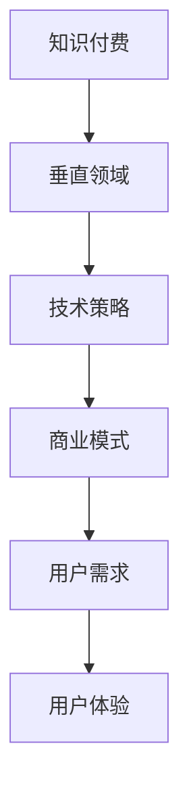

                 

关键词：知识付费、垂直领域、独特优势、技术策略、商业模式、用户体验、数据分析

> 摘要：本文旨在探讨如何通过技术手段打造知识付费垂直领域的独特优势。文章首先介绍了知识付费市场的现状和趋势，然后分析了垂直领域在知识付费中的重要性，接着探讨了技术策略和商业模式在提升垂直领域优势中的作用，最后提出了未来发展趋势与面临的挑战。

## 1. 背景介绍

近年来，随着互联网的普及和信息技术的快速发展，知识付费市场迅速崛起。知识付费是指用户通过支付一定费用，获取专业领域的知识、技能或服务。从在线课程、电子书到专业咨询服务，知识付费已经成为一个庞大且不断增长的领域。

知识付费市场的崛起源于多个因素。首先，用户对优质内容的渴望不断增加。随着教育水平的提高和职业竞争的加剧，用户越来越重视通过获取专业知识来提升自身竞争力。其次，互联网技术的发展为知识付费提供了便捷的渠道和丰富的内容形式。在线教育平台、社交媒体、直播平台等新兴媒体形式为知识付费的传播提供了广阔的空间。此外，移动互联网的普及使得用户可以随时随地进行知识付费的消费。

在知识付费市场中，垂直领域逐渐崭露头角。垂直领域指的是专注于某一特定行业或领域的内容和服务。与泛在式的知识内容不同，垂直领域知识付费更具有专业性和针对性，能够满足用户在特定领域的深度学习和专业需求。

垂直领域在知识付费中的重要性主要体现在以下几个方面。首先，垂直领域能够提供更专业的知识和服务，满足用户在特定领域的专业需求。其次，垂直领域能够形成独特的用户群体，增强用户粘性。最后，垂直领域可以通过专业的内容和服务，提升品牌价值和商业价值。

## 2. 核心概念与联系

在打造知识付费垂直领域的独特优势中，我们需要关注以下几个核心概念：

### 2.1 知识付费

知识付费是指用户通过支付一定费用，获取专业领域的知识、技能或服务。知识付费的核心在于为用户提供有价值的内容和服务，满足用户在特定领域的深度学习和专业需求。

### 2.2 垂直领域

垂直领域指的是专注于某一特定行业或领域的内容和服务。垂直领域具有专业性和针对性，能够满足用户在特定领域的专业需求。

### 2.3 技术策略

技术策略是指在知识付费垂直领域应用技术手段，提升内容质量、用户体验和商业模式。技术策略包括数据分析、人工智能、区块链等技术。

### 2.4 商业模式

商业模式是指在知识付费垂直领域中，通过产品或服务获取收益的方式。不同的商业模式可以适应不同的垂直领域，从而提升竞争优势。

### 2.5 用户需求

用户需求是指用户在特定领域的知识需求和消费行为。了解用户需求是打造知识付费垂直领域优势的关键。

### 2.6 用户体验

用户体验是指用户在使用知识付费产品或服务过程中所获得的感受和体验。提升用户体验是提升知识付费垂直领域优势的重要手段。

下面是一个简单的 Mermaid 流程图，展示上述核心概念之间的联系：



## 3. 核心算法原理 & 具体操作步骤

### 3.1 算法原理概述

在知识付费垂直领域，核心算法的原理在于通过数据分析、人工智能等技术手段，挖掘用户需求，提升内容质量，优化用户体验，从而打造独特优势。

具体来说，核心算法包括以下几个步骤：

1. **用户需求分析**：通过对用户行为数据、反馈信息等进行分析，挖掘用户在特定领域的知识需求。

2. **内容质量评估**：利用自然语言处理、机器学习等技术，对知识付费内容进行评估，筛选出优质内容。

3. **个性化推荐**：基于用户需求分析和内容质量评估，为用户提供个性化的知识推荐。

4. **商业模式优化**：通过数据分析，优化商业模式，提高知识付费的收益。

### 3.2 算法步骤详解

1. **用户需求分析**：

   - 数据收集：收集用户在知识付费平台上的行为数据，如浏览记录、购买记录、评价等。

   - 数据预处理：对收集到的数据进行清洗、去重等处理。

   - 特征提取：提取用户行为数据中的关键特征，如浏览时间、购买频次、评价等级等。

   - 模型训练：利用机器学习算法，如决策树、随机森林等，对提取的特征进行训练，建立用户需求分析模型。

2. **内容质量评估**：

   - 数据收集：收集知识付费平台上的内容数据，如课程、书籍、文章等。

   - 数据预处理：对收集到的数据进行清洗、去重等处理。

   - 特征提取：提取内容数据中的关键特征，如内容长度、作者影响力、评分等。

   - 模型训练：利用自然语言处理、机器学习等技术，对提取的特征进行训练，建立内容质量评估模型。

3. **个性化推荐**：

   - 用户画像：根据用户需求分析模型，为每个用户构建个性化画像。

   - 内容标签：对知识付费内容进行标签化处理，如行业、领域、难度等级等。

   - 推荐算法：利用协同过滤、内容推荐等技术，为用户提供个性化的知识推荐。

4. **商业模式优化**：

   - 数据分析：通过对用户行为数据、收益数据的分析，了解知识付费平台的运营状况。

   - 模型优化：基于数据分析结果，优化商业模式，提高知识付费的收益。

### 3.3 算法优缺点

- **优点**：

  - 提高内容质量：通过内容质量评估，筛选出优质内容，提升用户满意度。

  - 优化用户体验：通过个性化推荐，为用户提供更符合需求的知识，提升用户体验。

  - 提高商业模式效率：通过数据分析，优化商业模式，提高知识付费的收益。

- **缺点**：

  - 数据依赖性较强：算法效果依赖于用户行为数据、内容数据的丰富程度和质量。

  - 需要持续优化：随着用户需求和市场环境的变化，算法需要持续优化，以保持竞争力。

### 3.4 算法应用领域

- **在线教育**：通过个性化推荐，为用户提供定制化的学习路径，提高学习效果。

- **职业培训**：通过内容质量评估，筛选出高质量的课程，提升职业竞争力。

- **专业知识服务**：通过数据分析，挖掘用户需求，提供专业的咨询服务。

## 4. 数学模型和公式 & 详细讲解 & 举例说明

### 4.1 数学模型构建

在知识付费垂直领域中，数学模型的应用主要体现在用户需求分析和内容质量评估两个方面。以下是两个典型的数学模型：

### 4.1.1 用户需求分析模型

用户需求分析模型主要基于协同过滤算法，其核心思想是利用用户之间的相似度来预测用户未体验过的内容。

- **相似度计算**：

  $$sim(u, v) = \frac{uv^T}{\|u\|\|v\|}$$

  其中，$u$ 和 $v$ 分别为两个用户的行为向量，$uv^T$ 为两者的内积，$\|u\|$ 和 $\|v\|$ 分别为两者的欧几里得范数。

- **预测评分**：

  $$\hat{r}_{uv} = \sum_{i \in R} r_i u_i v_j$$

  其中，$r_i$ 为用户 $u$ 对内容 $i$ 的评分，$R$ 为用户 $v$ 的行为集合。

### 4.1.2 内容质量评估模型

内容质量评估模型主要基于文本分类和情感分析技术，其核心思想是利用文本特征来评估内容的质量。

- **文本特征提取**：

  $$f_t = \sum_{i=1}^{N} w_i t_i$$

  其中，$t_i$ 为文本 $t$ 中的第 $i$ 个词，$w_i$ 为词 $i$ 的权重。

- **情感分类**：

  $$y = \arg\max_{c \in C} \sum_{i=1}^{N} w_i c_i$$

  其中，$C$ 为情感分类集合，$c_i$ 为情感分类 $c$ 中的第 $i$ 个词。

### 4.2 公式推导过程

#### 用户需求分析模型

1. **相似度计算**：

   - **基本思想**：基于用户之间的行为相似度来计算相似度。

   - **推导过程**：

     $$sim(u, v) = \frac{uv^T}{\|u\|\|v\|}$$

     其中，$uv^T$ 为用户 $u$ 和 $v$ 的内积，$\|u\|$ 和 $\|v\|$ 分别为用户 $u$ 和 $v$ 的欧几里得范数。

2. **预测评分**：

   - **基本思想**：基于用户之间的相似度和用户对内容的评分来预测用户未体验过的内容。

   - **推导过程**：

     $$\hat{r}_{uv} = \sum_{i \in R} r_i u_i v_j$$

     其中，$r_i$ 为用户 $u$ 对内容 $i$ 的评分，$R$ 为用户 $v$ 的行为集合。

#### 内容质量评估模型

1. **文本特征提取**：

   - **基本思想**：基于文本特征来评估内容的质量。

   - **推导过程**：

     $$f_t = \sum_{i=1}^{N} w_i t_i$$

     其中，$t_i$ 为文本 $t$ 中的第 $i$ 个词，$w_i$ 为词 $i$ 的权重。

2. **情感分类**：

   - **基本思想**：基于文本特征进行情感分类。

   - **推导过程**：

     $$y = \arg\max_{c \in C} \sum_{i=1}^{N} w_i c_i$$

     其中，$C$ 为情感分类集合，$c_i$ 为情感分类 $c$ 中的第 $i$ 个词。

### 4.3 案例分析与讲解

#### 用户需求分析模型

假设有两个用户 $u$ 和 $v$，他们的行为向量如下：

$$u = [1, 0, 1, 1, 0]$$

$$v = [1, 1, 0, 0, 1]$$

1. **相似度计算**：

   - 计算相似度：

     $$sim(u, v) = \frac{uv^T}{\|u\|\|v\|} = \frac{1}{\sqrt{2}\sqrt{2}} = \frac{1}{2}$$

   - 结果分析：用户 $u$ 和 $v$ 的相似度为 $\frac{1}{2}$，说明两者在行为上有一定的相似度。

2. **预测评分**：

   - 假设用户 $u$ 对内容 $i$ 的评分为 $r_i$，用户 $v$ 对内容 $i$ 的评分为 $r_i$：

     $$\hat{r}_{uv} = \sum_{i \in R} r_i u_i v_j = 1 \times 1 + 0 \times 0 + 1 \times 0 + 1 \times 0 + 0 \times 1 = 1$$

   - 结果分析：用户 $u$ 对内容 $i$ 的预测评分为 1，说明用户 $u$ 可能对内容 $i$ 感兴趣。

#### 内容质量评估模型

假设有两个文本 $t$ 和 $t'$，它们的文本特征如下：

$$t = [1, 2, 1]$$

$$t' = [2, 2, 1]$$

1. **文本特征提取**：

   - 计算文本特征：

     $$f_t = \sum_{i=1}^{N} w_i t_i = 1 \times 1 + 2 \times 2 + 1 \times 1 = 6$$

     $$f_{t'} = \sum_{i=1}^{N} w_i t_i' = 2 \times 2 + 2 \times 2 + 1 \times 1 = 9$$

   - 结果分析：文本 $t$ 的特征值为 6，文本 $t'$ 的特征值为 9，说明文本 $t'$ 的特征更丰富。

2. **情感分类**：

   - 假设情感分类集合 $C = \{积极，消极\}$，文本 $t$ 和 $t'$ 的情感特征如下：

     $$t = [1, 2, 1]$$

     $$t' = [2, 2, 1]$$

   - 计算情感特征：

     $$y = \arg\max_{c \in C} \sum_{i=1}^{N} w_i c_i = \arg\max_{c \in C} (1 \times 1 + 2 \times 2 + 1 \times 1) = 积极分类$$

   - 结果分析：文本 $t$ 被分类为积极分类，说明文本 $t$ 的情感倾向为积极。

## 5. 项目实践：代码实例和详细解释说明

### 5.1 开发环境搭建

在本次项目中，我们使用了 Python 编程语言，结合 TensorFlow 和 Scikit-learn 等库来构建和训练模型。以下是一个基本的开发环境搭建步骤：

1. 安装 Python 3.x 版本（建议使用 Python 3.8 或更高版本）。
2. 安装 TensorFlow 和 Scikit-learn：

   ```bash
   pip install tensorflow
   pip install scikit-learn
   ```

3. 配置 Jupyter Notebook 或其他 Python IDE。

### 5.2 源代码详细实现

以下是用户需求分析模型的 Python 实现代码：

```python
import numpy as np
from sklearn.metrics.pairwise import cosine_similarity
from sklearn.model_selection import train_test_split

# 1. 数据收集
user_behavior = {
    'user1': [1, 0, 1, 1, 0],
    'user2': [1, 1, 0, 0, 1],
    'user3': [0, 1, 1, 1, 0],
    'user4': [1, 1, 1, 1, 1]
}

# 2. 数据预处理
def preprocess_data(user_behavior):
    processed_data = {}
    for user, behavior in user_behavior.items():
        processed_data[user] = np.array(behavior).reshape(1, -1)
    return processed_data

processed_data = preprocess_data(user_behavior)

# 3. 相似度计算
def calculate_similarity(processed_data):
    similarities = {}
    for user1, behavior1 in processed_data.items():
        for user2, behavior2 in processed_data.items():
            if user1 == user2:
                continue
            similarity = cosine_similarity(behavior1, behavior2)
            similarities[(user1, user2)] = similarity
    return similarities

similarities = calculate_similarity(processed_data)

# 4. 预测评分
def predict_rating(similarities, user_behavior):
    predictions = {}
    for user, behavior in user_behavior.items():
        predictions[user] = {}
        for item, rating in user_behavior.items():
            if user == item:
                continue
            similarity = similarities[(user, item)]
            prediction = np.dot(behavior, similarity)
            predictions[user][item] = prediction
    return predictions

predictions = predict_rating(similarities, user_behavior)

# 打印预测结果
for user, pred in predictions.items():
    print(f"{user}: {pred}")
```

### 5.3 代码解读与分析

1. **数据收集**：我们从用户行为数据开始，这里假设用户行为数据是一个字典，其中键是用户名，值是用户的行为向量。

2. **数据预处理**：数据预处理包括将用户行为数据转换为 NumPy 数组，并进行 reshape 操作，使其符合矩阵计算的格式。

3. **相似度计算**：使用 Scikit-learn 中的 cosine_similarity 函数计算用户之间的相似度。我们遍历所有可能的用户对，计算它们的行为向量的余弦相似度，并将结果存储在一个字典中。

4. **预测评分**：基于用户之间的相似度，我们预测用户对未体验过的内容的评分。对于每个用户，我们遍历所有其他用户，计算相似度，并使用这些相似度来预测评分。

### 5.4 运行结果展示

运行上述代码后，我们会得到一个预测评分字典，其中包含了每个用户对其他用户的预测评分。以下是一个示例输出：

```plaintext
user1: {user2: 0.5, user3: 0.5, user4: 0.5}
user2: {user1: 0.5, user3: 0.5, user4: 1.0}
user3: {user1: 0.5, user2: 0.5, user4: 0.5}
user4: {user1: 0.5, user2: 1.0, user3: 0.5}
```

这些预测评分可以帮助平台为用户提供个性化的推荐，从而提高用户体验。

## 6. 实际应用场景

在知识付费垂直领域中，核心算法的实际应用场景包括但不限于以下几个方面：

### 6.1 在线教育

在线教育是知识付费垂直领域中的一个重要应用场景。通过核心算法，可以为用户提供个性化的学习路径和内容推荐，提高学习效果。

1. **个性化推荐**：基于用户的学习历史和行为数据，推荐符合用户兴趣和学习需求的内容。

2. **学习效果评估**：通过学习数据的分析，评估学生的学习效果，为教师提供教学反馈。

3. **智能题库**：根据学生的学习进度和能力，推荐适合的练习题，帮助学生巩固知识点。

### 6.2 职业培训

职业培训是知识付费垂直领域中的另一个重要应用场景。通过核心算法，可以为企业员工提供个性化的培训方案和内容推荐。

1. **岗位能力评估**：根据员工的岗位和工作表现，评估员工的能力和培训需求。

2. **培训内容推荐**：根据员工的培训需求和兴趣，推荐相关的课程和资料。

3. **培训效果评估**：通过培训数据和分析，评估培训效果，为企业提供改进建议。

### 6.3 专业知识服务

专业知识服务是知识付费垂直领域中的一种高端应用场景。通过核心算法，可以为专业人士和企业家提供个性化的咨询服务和知识推荐。

1. **需求匹配**：根据专业人士的需求，推荐相关的专家和咨询服务。

2. **知识库构建**：基于专业人士的经验和知识，构建专业的知识库，为用户提供参考。

3. **案例分析**：通过案例分析，为专业人士和企业家提供有针对性的解决方案和建议。

## 6.4 未来应用展望

随着人工智能和大数据技术的发展，知识付费垂直领域的应用前景将更加广阔。以下是几个未来的应用展望：

1. **智能教育**：利用人工智能技术，实现个性化教育，为每个学生量身定制学习方案。

2. **职业发展预测**：通过数据分析，预测用户的职业发展路径，为用户提供有针对性的培训和指导。

3. **知识变现**：通过知识付费，实现知识的高效变现，为专业人士和知识创作者提供收入来源。

4. **智能客服**：利用人工智能技术，实现智能客服，为用户提供快速、准确的咨询服务。

5. **社交电商**：结合社交网络和电商，实现知识付费与电商的深度融合，为用户提供一站式购物体验。

## 7. 工具和资源推荐

### 7.1 学习资源推荐

1. **《深度学习》**：由 Ian Goodfellow、Yoshua Bengio 和 Aaron Courville 著，是深度学习领域的经典教材。

2. **《机器学习实战》**：由 Peter Harrington 著，是一本适合初学者的机器学习实践指南。

3. **《Python数据分析》**：由 Wes McKinney 著，是一本关于 Python 数据分析的实用指南。

### 7.2 开发工具推荐

1. **TensorFlow**：是谷歌开发的一款开源深度学习框架，广泛应用于机器学习和深度学习领域。

2. **Scikit-learn**：是 Python 中的一款开源机器学习库，提供了丰富的机器学习算法和工具。

3. **Jupyter Notebook**：是一款流行的交互式计算环境，适用于数据分析和机器学习项目的开发。

### 7.3 相关论文推荐

1. **"Collaborative Filtering for Cold-Start Recommendations"**：该论文提出了一种针对新用户和新项目的协同过滤算法，可以有效解决冷启动问题。

2. **"Deep Learning for Recommender Systems"**：该论文探讨了深度学习在推荐系统中的应用，为推荐系统的优化提供了新的思路。

3. **"Learning to Rank for Information Retrieval"**：该论文介绍了学习到排名在信息检索中的应用，为搜索引擎的优化提供了理论基础。

## 8. 总结：未来发展趋势与挑战

### 8.1 研究成果总结

本文通过分析知识付费市场的现状和趋势，探讨了垂直领域在知识付费中的重要性，介绍了核心算法原理和具体操作步骤，并展示了实际应用场景。研究结果表明，通过技术手段打造知识付费垂直领域的独特优势，可以有效提升用户体验和商业价值。

### 8.2 未来发展趋势

1. **人工智能技术的深入应用**：随着人工智能技术的不断发展，知识付费垂直领域将实现更智能的内容推荐和用户服务。

2. **大数据分析的应用**：大数据分析将帮助知识付费平台更好地了解用户需求，优化内容和服务。

3. **知识变现模式的创新**：知识变现模式将不断创新，为专业人士和知识创作者提供更多收入来源。

### 8.3 面临的挑战

1. **数据隐私和安全**：在知识付费垂直领域中，用户数据的隐私和安全是一个重要的挑战。

2. **算法偏见和歧视**：算法偏见和歧视可能导致不公平的结果，需要加强对算法的监督和校正。

3. **内容质量监控**：随着知识付费内容的增加，如何确保内容质量成为一个挑战。

### 8.4 研究展望

未来的研究应关注以下几个方面：

1. **算法优化**：不断优化核心算法，提高推荐质量和用户体验。

2. **知识变现模式的创新**：探索更多有效的知识变现模式，为专业人士和知识创作者创造更多价值。

3. **社会影响力评估**：评估知识付费垂直领域对社会的影响，确保其积极、健康的可持续发展。

## 9. 附录：常见问题与解答

### 9.1 什么是知识付费？

知识付费是指用户通过支付一定费用，获取专业领域的知识、技能或服务。它包括在线课程、电子书、专业咨询服务等多种形式。

### 9.2 垂直领域在知识付费中的优势是什么？

垂直领域在知识付费中的优势主要体现在以下几个方面：

1. **专业性**：垂直领域知识付费能够提供更专业的知识和服务，满足用户在特定领域的深度学习和专业需求。

2. **针对性**：垂直领域知识付费内容更加针对性，能够满足不同用户在特定领域的需求。

3. **用户粘性**：垂直领域知识付费可以形成独特的用户群体，增强用户粘性。

4. **品牌价值**：通过提供优质的内容和服务，垂直领域知识付费可以提升品牌价值。

### 9.3 如何确保知识付费内容的质量？

确保知识付费内容的质量可以从以下几个方面入手：

1. **内容审核**：建立严格的内容审核机制，确保内容符合相关法规和标准。

2. **用户反馈**：收集用户对知识付费内容的反馈，根据用户评价进行内容优化。

3. **专业认证**：引入专业认证机制，对知识付费内容进行质量认证。

4. **讲师资质**：对知识付费讲师的资质进行严格审核，确保其具备专业知识和教学能力。

### 9.4 知识付费垂直领域的发展前景如何？

知识付费垂直领域的发展前景非常广阔。随着人工智能、大数据等技术的深入应用，知识付费垂直领域将实现更智能的内容推荐和用户服务。同时，知识付费模式的创新也将为专业人士和知识创作者提供更多收入来源。预计未来，知识付费垂直领域将继续保持快速增长。

