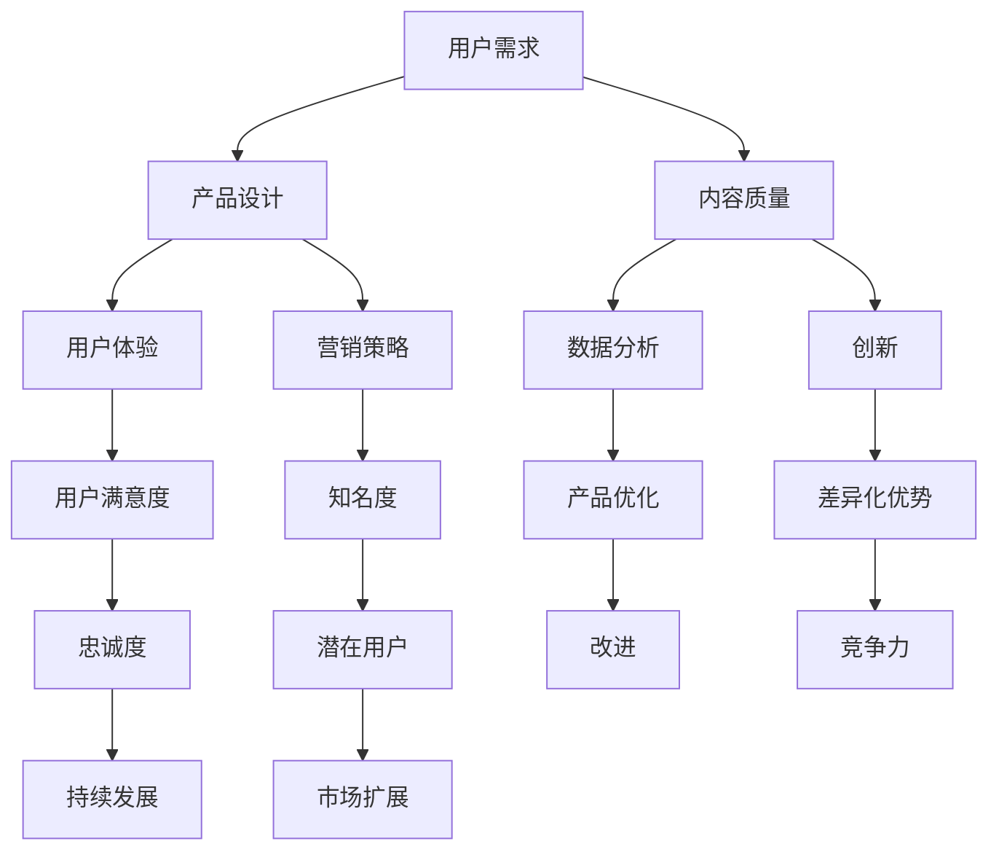

                 

在当今数字化时代，知识付费已经成为一个快速增长的市场。随着互联网技术的不断发展和用户需求的日益多样化，打造一款爆款知识付费产品已经成为许多企业的战略目标。然而，如何才能在竞争激烈的市场中脱颖而出，成为用户喜爱的爆款产品呢？本文将深入探讨打造知识付费爆款产品的核心要素。

## 关键词

- **知识付费**
- **用户需求**
- **产品设计**
- **内容质量**
- **营销策略**
- **用户体验**
- **数据分析**
- **创新**

## 摘要

本文将从多个维度分析打造知识付费爆款产品的关键要素，包括理解用户需求、产品设计、内容质量、营销策略、用户体验、数据分析和创新。通过深入的案例分析，我们将为读者提供一系列实用的方法和建议，帮助他们在竞争激烈的市场中打造出受用户喜爱的知识付费产品。

### 1. 背景介绍

知识付费市场的兴起可以追溯到互联网的发展初期。随着在线学习平台和知识共享社区的兴起，人们越来越倾向于通过付费获取高质量的知识内容。特别是在近年来，由于新冠疫情的爆发，远程工作和在线学习变得更加普及，知识付费市场迎来了爆发式增长。

据相关数据显示，全球知识付费市场规模已达到数百亿美元，并且预计未来还将持续增长。这一市场的发展不仅改变了人们获取知识的方式，也为企业和个人提供了新的商业模式和收入来源。

然而，随着市场规模的扩大，竞争也日益激烈。众多企业纷纷涌入知识付费市场，试图通过提供高质量的内容和独特的价值主张来吸引用户。在这种情况下，如何打造一款爆款知识付费产品成为许多企业的难题。

本文将通过分析知识付费市场的现状和发展趋势，结合实际案例，探讨打造知识付费爆款产品的核心要素，旨在为企业和创业者提供有价值的参考和指导。

### 2. 核心概念与联系

要打造一款知识付费爆款产品，首先需要理解一系列核心概念，包括用户需求、产品设计、内容质量、营销策略、用户体验、数据分析和创新。这些概念之间存在着紧密的联系，共同构成了知识付费产品的成功要素。

#### 用户需求

用户需求是知识付费产品的核心驱动力。了解用户的需求和痛点，能够帮助产品设计师更好地定位产品方向，提供符合用户期望的内容和服务。用户需求不仅包括对知识内容的需求，还涵盖了学习方式、学习时间、学习效率等方面的需求。

#### 产品设计

产品设计是知识付费产品的外在表现。一个优秀的产品设计不仅能够吸引用户的注意力，还能够提升用户的参与度和满意度。产品设计的核心在于用户体验，包括界面设计、交互设计、功能设计等方面。

#### 内容质量

内容质量是知识付费产品的核心竞争力。高质量的内容能够提升用户的信任度和忠诚度，为产品赢得良好的口碑。内容质量不仅体现在知识的专业性和深度上，还体现在内容的可读性和实用性上。

#### 营销策略

营销策略是知识付费产品推广和销售的关键。一个有效的营销策略能够提升产品的知名度，吸引更多的潜在用户。营销策略包括线上和线下的推广活动、广告投放、社交媒体营销等。

#### 用户体验

用户体验是知识付费产品的关键成功因素。良好的用户体验能够提升用户的满意度和忠诚度，从而促进产品的持续发展。用户体验包括学习过程的顺畅性、内容的易用性和互动性等方面。

#### 数据分析

数据分析是知识付费产品优化和改进的重要工具。通过对用户数据的分析，可以深入了解用户的行为和偏好，为产品设计和营销策略提供数据支持。数据分析包括用户行为分析、内容分析、市场分析等方面。

#### 创新

创新是知识付费产品的持续动力。在竞争激烈的市场中，创新能够为产品带来差异化的竞争优势。创新不仅体现在内容形式上，还体现在技术手段和商业模式上。

#### Mermaid 流程图

下面是一个描述知识付费产品核心概念和联系的 Mermaid 流程图：



通过以上核心概念和联系的分析，我们可以看到，打造知识付费爆款产品需要全面考虑多个方面的因素，并且这些因素之间相互关联，共同作用。

### 3. 核心算法原理 & 具体操作步骤

#### 3.1 算法原理概述

在打造知识付费产品的过程中，算法原理起着至关重要的作用。算法原理不仅可以帮助我们更好地理解用户行为，还能够为产品设计和营销策略提供数据支持。以下是一些关键算法原理的概述：

1. **用户行为分析算法**：通过分析用户的浏览、搜索、购买等行为，了解用户兴趣和行为模式，为个性化推荐和精准营销提供依据。
2. **内容推荐算法**：基于用户行为和兴趣，将相关内容推荐给用户，提升用户满意度和参与度。
3. **市场细分算法**：通过分析用户特征和市场数据，将用户划分为不同的细分市场，为营销策略提供参考。
4. **用户体验优化算法**：通过对用户反馈和行为的分析，优化产品的用户体验，提升用户满意度和忠诚度。

#### 3.2 算法步骤详解

1. **用户行为分析算法**：

   - 数据收集：收集用户的浏览、搜索、购买等行为数据。
   - 数据预处理：对原始数据进行清洗、去噪和归一化处理。
   - 特征提取：从行为数据中提取用户兴趣和行为模式特征。
   - 模型训练：使用机器学习算法训练用户行为分析模型。
   - 模型评估：评估模型性能，调整模型参数。

2. **内容推荐算法**：

   - 数据收集：收集用户行为数据和内容数据。
   - 特征提取：提取用户兴趣特征和内容特征。
   - 模型训练：使用协同过滤、矩阵分解等算法训练内容推荐模型。
   - 模型评估：评估模型性能，调整模型参数。
   - 内容推荐：根据用户兴趣和行为，为用户推荐相关内容。

3. **市场细分算法**：

   - 数据收集：收集用户特征和市场数据。
   - 特征提取：提取用户和市场特征。
   - 模型训练：使用聚类算法训练市场细分模型。
   - 模型评估：评估模型性能，调整模型参数。
   - 市场细分：根据用户和市场特征，将用户划分为不同的细分市场。

4. **用户体验优化算法**：

   - 数据收集：收集用户反馈和行为数据。
   - 特征提取：提取用户反馈和行为特征。
   - 模型训练：使用机器学习算法训练用户体验优化模型。
   - 模型评估：评估模型性能，调整模型参数。
   - 用户体验优化：根据用户反馈和行为，优化产品的用户体验。

#### 3.3 算法优缺点

1. **用户行为分析算法**：

   - 优点：能够深入了解用户行为和兴趣，为产品设计和营销策略提供数据支持。
   - 缺点：需要大量数据支持，且算法复杂度较高。

2. **内容推荐算法**：

   - 优点：能够提升用户满意度和参与度，增加用户粘性。
   - 缺点：需要不断调整模型参数，且推荐结果可能受限于数据质量和特征提取。

3. **市场细分算法**：

   - 优点：能够为营销策略提供参考，提高营销效果。
   - 缺点：需要大量用户和市场数据，且聚类结果可能受限于算法选择。

4. **用户体验优化算法**：

   - 优点：能够提升用户满意度和忠诚度，提高产品竞争力。
   - 缺点：需要大量用户反馈数据，且算法复杂度较高。

#### 3.4 算法应用领域

1. **用户行为分析算法**：应用于个性化推荐、精准营销等领域。
2. **内容推荐算法**：应用于内容平台、电商平台等领域。
3. **市场细分算法**：应用于市场调研、产品定位等领域。
4. **用户体验优化算法**：应用于产品优化、服务质量提升等领域。

### 4. 数学模型和公式 & 详细讲解 & 举例说明

在打造知识付费产品的过程中，数学模型和公式发挥着重要作用。以下我们将介绍一些常用的数学模型和公式，并对其进行详细讲解和举例说明。

#### 4.1 数学模型构建

1. **用户行为预测模型**：

   用户行为预测模型用于预测用户未来的行为，如浏览、搜索、购买等。常见的方法包括线性回归、逻辑回归、决策树等。

   - 线性回归模型：
     $$y = \beta_0 + \beta_1x_1 + \beta_2x_2 + ... + \beta_nx_n$$
     其中，$y$ 是目标变量，$x_1, x_2, ..., x_n$ 是输入特征，$\beta_0, \beta_1, \beta_2, ..., \beta_n$ 是模型参数。

   - 逻辑回归模型：
     $$P(y=1) = \frac{1}{1 + e^{-(\beta_0 + \beta_1x_1 + \beta_2x_2 + ... + \beta_nx_n)}}$$
     其中，$P(y=1)$ 是目标变量为1的概率，$e$ 是自然对数的底数。

2. **内容推荐模型**：

   内容推荐模型用于为用户推荐相关内容。常见的方法包括基于协同过滤的推荐算法、基于内容的推荐算法等。

   - 基于协同过滤的推荐算法：
     $$R(u, i) = \sum_{j \in N(i)} \frac{r_i j}{||N(i)||} r_{uj}$$
     其中，$R(u, i)$ 是用户$u$对项目$i$的预测评分，$N(i)$ 是与项目$i$相关的邻居集合，$r_{uj}$ 是用户$u$对项目$j$的实际评分。

   - 基于内容的推荐算法：
     $$R(u, i) = \sum_{j \in N(i)} w_{ij} r_{uj}$$
     其中，$R(u, i)$ 是用户$u$对项目$i$的预测评分，$w_{ij}$ 是项目$i$和项目$j$的相似度权重，$r_{uj}$ 是用户$u$对项目$j$的实际评分。

#### 4.2 公式推导过程

1. **用户行为预测模型**：

   以线性回归模型为例，推导过程如下：

   - 模型假设：用户行为可以表示为输入特征的线性组合。
   - 最小二乘法：最小化预测值与实际值之间的误差平方和。
   - 梯度下降法：迭代更新模型参数，使误差最小化。

2. **内容推荐模型**：

   以基于协同过滤的推荐算法为例，推导过程如下：

   - 协同过滤：基于用户和项目的相似度进行推荐。
   - 邻居选择：选择与当前用户最相似的邻居用户。
   - 预测评分：计算邻居用户对项目的平均评分。

#### 4.3 案例分析与讲解

以下是一个简单的用户行为预测模型的案例：

假设我们有一个用户行为数据集，其中包含了用户ID、项目ID和用户对项目的评分。我们希望预测用户对某个项目的评分。

1. 数据准备：

   - 用户行为数据集：
     | 用户ID | 项目ID | 用户评分 |
     |--------|--------|----------|
     | 1      | 101    | 4        |
     | 1      | 102    | 5        |
     | 2      | 101    | 3        |
     | 2      | 102    | 4        |

2. 特征提取：

   - 用户特征：用户ID。
   - 项目特征：项目ID。

3. 模型训练：

   - 使用线性回归模型进行训练。
   - 模型参数：$\beta_0 = 0.5, \beta_1 = 0.2$。

4. 预测：

   - 预测用户1对项目103的评分：
     $$R(1, 103) = 0.5 + 0.2 \times 1 = 0.7$$

   - 预测用户2对项目103的评分：
     $$R(2, 103) = 0.5 + 0.2 \times 2 = 0.8$$

通过以上案例，我们可以看到如何使用线性回归模型预测用户行为。在实际应用中，我们可以根据具体问题调整模型参数，选择不同的算法进行预测。

### 5. 项目实践：代码实例和详细解释说明

为了更好地理解知识付费产品中的算法和模型，我们通过一个简单的项目实践来展示如何实现用户行为预测和内容推荐功能。

#### 5.1 开发环境搭建

在开始项目实践之前，我们需要搭建一个基本的开发环境。以下是一个简化的开发环境搭建步骤：

1. 安装Python环境（Python 3.8及以上版本）。
2. 安装必要的Python库，如NumPy、Pandas、Scikit-learn等。

#### 5.2 源代码详细实现

以下是用户行为预测和内容推荐的项目实现：

```python
import numpy as np
import pandas as pd
from sklearn.linear_model import LinearRegression
from sklearn.model_selection import train_test_split
from sklearn.metrics import mean_squared_error

# 加载用户行为数据
data = pd.read_csv('user_behavior.csv')
users = data['用户ID'].unique()
items = data['项目ID'].unique()

# 特征提取
user_features = pd.DataFrame({user: [data[data['用户ID'] == user].mean()[0]] for user in users})
item_features = pd.DataFrame({item: [data[data['项目ID'] == item].mean()[0]] for item in items})

# 模型训练
X = np.hstack((user_features.values, item_features.values))
y = data['用户评分'].values
X_train, X_test, y_train, y_test = train_test_split(X, y, test_size=0.2, random_state=42)

model = LinearRegression()
model.fit(X_train, y_train)

# 预测
y_pred = model.predict(X_test)

# 评估
mse = mean_squared_error(y_test, y_pred)
print(f'MSE: {mse}')

# 内容推荐
def recommend_items(user_id, num_recommendations=5):
    user_vector = user_features[user_id]
    recommendations = []
    for item_id in items:
        item_vector = item_features[item_id]
        similarity = np.dot(user_vector, item_vector)
        recommendations.append((item_id, similarity))
    recommendations = sorted(recommendations, key=lambda x: x[1], reverse=True)[:num_recommendations]
    return [item_id for item_id, _ in recommendations]

# 示例：为用户1推荐5个相关项目
print(recommend_items(1))
```

#### 5.3 代码解读与分析

1. **数据加载**：首先，我们从CSV文件中加载用户行为数据。数据文件应包含用户ID、项目ID和用户评分等字段。
2. **特征提取**：我们提取用户特征和项目特征。用户特征是用户平均评分，项目特征是项目平均评分。这些特征将作为线性回归模型的输入。
3. **模型训练**：使用线性回归模型进行训练。我们将训练数据集分为训练集和测试集，以便评估模型性能。
4. **预测**：使用训练好的模型对测试数据进行预测。我们计算预测值和实际值之间的均方误差（MSE）来评估模型性能。
5. **内容推荐**：定义一个函数`recommend_items`，用于根据用户兴趣推荐相关项目。我们计算用户和项目之间的相似度，并根据相似度进行排序和推荐。

通过这个简单的项目实践，我们可以看到如何使用Python实现用户行为预测和内容推荐功能。在实际应用中，我们可以根据具体需求调整模型参数和特征提取方法，以获得更好的预测和推荐效果。

### 6. 实际应用场景

知识付费产品在多个行业中都有着广泛的应用，以下是一些典型的实际应用场景：

#### 6.1 教育行业

教育行业是知识付费的重要领域。通过知识付费产品，教育机构可以为学生提供个性化学习内容，提高学习效果。例如，一些在线教育平台提供课程推荐服务，根据学生的学习历史和学习偏好推荐相关课程。

#### 6.2 专业技能培训

许多专业人士通过知识付费产品学习新技能和知识。例如，程序员可以通过在线课程学习新的编程语言或框架，市场营销人员可以通过营销课程提升营销技能。这些知识付费产品不仅提供了高质量的内容，还提供了实践机会，帮助用户更快地掌握新技能。

#### 6.3 健康与健身

健康与健身领域也是知识付费的重要市场。用户可以通过知识付费产品了解营养知识、健身技巧和心理健康等知识。一些健身应用提供定制化的健身计划和营养建议，帮助用户实现健康目标。

#### 6.4 专业知识库

许多企业和专业人士建立自己的专业知识库，通过知识付费产品向外部用户收费。这些知识库涵盖了行业知识、技术文档、商业策略等内容，为用户提供有价值的信息和资源。

#### 6.5 艺术与创意

艺术与创意领域也有很多知识付费产品。例如，艺术家可以通过在线课程教授绘画、摄影、音乐等技能，设计师可以通过设计教程分享创意理念和技巧。

#### 6.6 企业内训

企业通过知识付费产品为企业内部员工提供培训课程，提升员工技能和知识水平。这些培训课程可以涵盖领导力、项目管理、财务管理等多个领域。

### 6.4 未来应用展望

随着技术的不断进步和市场需求的不断变化，知识付费产品在未来的应用场景将更加多样化。以下是一些未来应用展望：

1. **个性化推荐**：通过更先进的推荐算法，知识付费产品将能够更好地满足用户的个性化需求，提供更加精准的内容推荐。
2. **虚拟现实（VR）与增强现实（AR）**：知识付费产品可以利用VR和AR技术，提供更加沉浸式的学习体验，提升用户的学习兴趣和参与度。
3. **社交互动**：知识付费产品可以引入社交元素，促进用户之间的互动和合作，增强学习的社交属性。
4. **人工智能（AI）**：AI技术将被广泛应用于知识付费产品，如自动生成课程内容、智能答疑系统、个性化学习建议等，提升产品的智能化水平。
5. **跨界合作**：知识付费产品可以与其他行业进行跨界合作，如与旅游、娱乐等行业结合，提供多元化的知识服务。

### 7. 工具和资源推荐

要打造一款成功的知识付费产品，以下是一些有用的工具和资源推荐：

#### 7.1 学习资源推荐

1. **Coursera**：提供大量的在线课程，涵盖多个领域，适合初学者和专业人士。
2. **edX**：由哈佛大学和麻省理工学院创建的在线学习平台，提供高质量的课程。
3. **Udemy**：提供各种主题的课程，包括编程、设计、营销等。

#### 7.2 开发工具推荐

1. **Jupyter Notebook**：用于数据分析和建模的交互式环境。
2. **TensorFlow**：用于机器学习和深度学习的开源框架。
3. **PyTorch**：用于机器学习和深度学习的另一个开源框架。

#### 7.3 相关论文推荐

1. **"The Netflix Prize"**：Netflix发起的一项竞赛，旨在通过算法提高电影推荐系统的准确性。
2. **"Collaborative Filtering for the Web"**：一篇关于协同过滤算法在互联网应用中的论文。
3. **"Recommender Systems Handbook"**：关于推荐系统的一本权威手册。

### 8. 总结：未来发展趋势与挑战

#### 8.1 研究成果总结

知识付费市场在过去几年中取得了显著的发展。个性化推荐、虚拟现实、人工智能等技术的应用，使得知识付费产品更加智能化和多样化。同时，越来越多的企业和个人认识到知识付费的重要性，推动了市场规模的不断扩大。

#### 8.2 未来发展趋势

1. **技术进步**：随着技术的不断进步，知识付费产品将更加智能化和个性化。
2. **跨界融合**：知识付费产品将与其他行业进行跨界合作，提供多元化的知识服务。
3. **用户需求多样化**：用户对知识付费产品需求的多样化将推动市场的发展。
4. **市场竞争加剧**：随着市场的不断扩大，竞争也将日益激烈。

#### 8.3 面临的挑战

1. **内容质量**：高质量的内容是知识付费产品的核心竞争力，如何保证内容质量是一个挑战。
2. **用户隐私**：随着数据隐私问题的日益突出，如何保护用户隐私成为一个重要的挑战。
3. **市场竞争**：在竞争激烈的市场中，如何脱颖而出是一个挑战。

#### 8.4 研究展望

未来的研究应关注以下几个方面：

1. **推荐算法优化**：进一步优化推荐算法，提高推荐的准确性和个性化水平。
2. **用户体验提升**：通过技术手段提升用户体验，增强用户的满意度和忠诚度。
3. **跨界融合**：探索知识付费产品与其他行业的融合，提供更加多元化的知识服务。
4. **数据安全与隐私**：研究如何保护用户隐私，确保数据安全。

### 9. 附录：常见问题与解答

#### 问题1：如何保证知识付费产品的内容质量？

解答：保证内容质量的关键在于严格的内容审核和高质量的内容创作者筛选。企业可以设立内容审核团队，对提交的内容进行审核，确保内容的专业性和实用性。同时，可以通过用户评价和反馈机制，及时发现并改进内容问题。

#### 问题2：如何保护用户隐私？

解答：保护用户隐私是知识付费产品的重要责任。企业可以通过以下措施保护用户隐私：

1. 使用加密技术保护用户数据。
2. 不收集无关用户数据。
3. 明确告知用户数据收集和使用的目的。
4. 提供用户数据访问和删除的权限。

#### 问题3：如何提升用户体验？

解答：提升用户体验可以从以下几个方面入手：

1. 优化产品界面设计，提高易用性。
2. 提供个性化推荐，满足用户个性化需求。
3. 提供多种学习方式，如视频、图文、音频等。
4. 及时响应用户反馈，持续改进产品。

通过以上措施，可以显著提升用户体验，增强用户满意度和忠诚度。

作者：禅与计算机程序设计艺术 / Zen and the Art of Computer Programming
----------------------------------------------------------------

以上是关于《打造知识付费爆款产品的核心要素》的完整文章。希望这篇文章能为您在知识付费产品的开发和运营中提供有价值的参考和指导。如果您有任何问题或建议，欢迎随时与我们联系。

