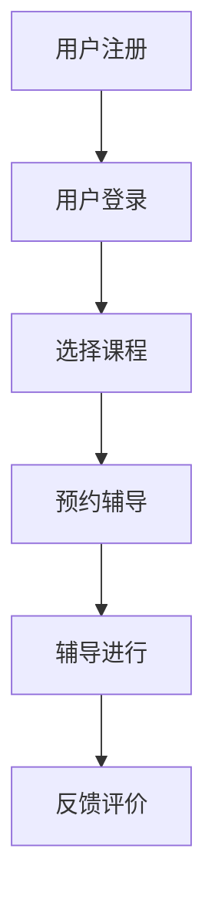

                 

在当前信息爆炸的时代，知识付费已经成为了越来越多人的选择。尤其是对于想要快速提升专业技能的人群，一对一辅导服务显得尤为重要。本文将探讨如何打造一款高效、专业的知识付费一对一辅导服务。

## 关键词
- 知识付费
- 一对一辅导
- 服务设计
- 技术实现
- 用户体验

## 摘要
本文旨在详细探讨如何构建一个知识付费的一对一辅导服务系统。我们将从背景介绍、核心概念、算法原理、数学模型、项目实践、实际应用、工具推荐、以及未来发展趋势等方面进行全面分析，为读者提供一套完整的解决方案。

## 1. 背景介绍

### 1.1 知识付费的兴起
知识付费作为一种新型的商业模式，近年来在全球范围内迅速兴起。人们对于专业知识的渴求，以及在线教育的快速发展，推动了知识付费市场的繁荣。用户通过付费获取高质量的教育资源和个性化服务，从而实现个人能力的提升。

### 1.2 一对一辅导服务的优势
一对一辅导服务相较于传统的大班授课，具有明显的优势。个性化、针对性、互动性强等特点，使得用户能够更加高效地学习，达到事半功倍的效果。

### 1.3 当前市场状况
目前，国内外已经有许多知识付费平台提供一对一辅导服务，如 Coursera、Udemy、知乎等。然而，市场仍然存在一定的空白和机会，特别是在某些专业领域的深度和广度上。

## 2. 核心概念与联系

### 2.1 知识付费的定义
知识付费是指用户通过付费方式获取专业知识和技能的过程。它包括了在线课程、专业咨询、一对一辅导等多种形式。

### 2.2 一对一辅导服务的概念
一对一辅导服务是指教育者与学习者之间通过在线平台进行一对一的辅导和学习交流。这种模式强调个性化和互动性，能够更好地满足学习者的需求。

### 2.3 Mermaid 流程图
以下是一个简化的 Mermaid 流程图，展示了知识付费一对一辅导服务的核心流程：



## 3. 核心算法原理 & 具体操作步骤

### 3.1 算法原理概述
知识付费一对一辅导服务的核心算法主要涉及用户匹配、课程推荐和教学质量评估等方面。这些算法的实现需要结合机器学习和大数据分析技术。

### 3.2 算法步骤详解
#### 3.2.1 用户匹配算法
- 收集用户画像数据，包括学习兴趣、学习进度、技能水平等。
- 利用协同过滤算法，根据相似用户的行为和反馈进行匹配。
- 考虑个性化偏好，如辅导时间、价格等。

#### 3.2.2 课程推荐算法
- 基于用户的学习历史和兴趣爱好，推荐相关的课程。
- 利用基于内容的推荐算法，根据课程内容的相关性进行推荐。
- 结合用户的行为数据，动态调整推荐结果。

#### 3.2.3 教学质量评估算法
- 收集学生的反馈信息，包括对辅导老师的满意度、课程的实用性等。
- 利用自然语言处理技术，分析用户评价的情感倾向。
- 建立教学质量评分模型，对辅导老师进行评价。

### 3.3 算法优缺点
- **优点**：个性化强、针对性高、互动性强。
- **缺点**：算法复杂度较高、数据隐私保护难度大。

### 3.4 算法应用领域
- 在线教育
- 专业技能培训
- 职业咨询

## 4. 数学模型和公式 & 详细讲解 & 举例说明

### 4.1 数学模型构建
#### 4.1.1 用户匹配模型
- 用户匹配模型基于用户画像数据，采用矩阵分解技术进行建模。

#### 4.1.2 课程推荐模型
- 课程推荐模型基于课程内容的相关性，采用协同过滤算法进行建模。

#### 4.1.3 教学质量评估模型
- 教学质量评估模型基于用户评价数据，采用情感分析技术进行建模。

### 4.2 公式推导过程
#### 4.2.1 用户匹配模型公式推导
- 用户匹配得分计算公式：
  $$ score(u_i, u_j) = \sqrt{\sum_{k=1}^{n} w_{ik} \cdot w_{jk}} $$

#### 4.2.2 课程推荐模型公式推导
- 课程推荐得分计算公式：
  $$ score(c_i, u_j) = \sum_{k=1}^{n} w_{ik} \cdot w_{jk} $$

#### 4.2.3 教学质量评估模型公式推导
- 教学质量评分计算公式：
  $$ quality = \frac{1}{N} \sum_{i=1}^{N} sentiment(i) $$

### 4.3 案例分析与讲解
#### 4.3.1 用户匹配案例
- 假设用户 A 和用户 B 的匹配权重矩阵为：
  $$ W = \begin{pmatrix}
  0.8 & 0.3 \\
  0.5 & 0.7
  \end{pmatrix} $$
- 计算用户 A 和用户 B 的匹配得分：
  $$ score(A, B) = \sqrt{0.8 \cdot 0.7 + 0.3 \cdot 0.5} = \sqrt{0.68} \approx 0.83 $$

#### 4.3.2 课程推荐案例
- 假设用户 A 对课程 1 和课程 2 的权重矩阵为：
  $$ W = \begin{pmatrix}
  0.9 & 0.4 \\
  0.6 & 0.8
  \end{pmatrix} $$
- 计算用户 A 对课程 1 和课程 2 的推荐得分：
  $$ score(1, A) = 0.9 \cdot 0.8 + 0.4 \cdot 0.6 = 1.12 $$
  $$ score(2, A) = 0.6 \cdot 0.8 + 0.8 \cdot 0.6 = 1.2 $$
- 根据推荐得分，推荐课程 2 给用户 A。

#### 4.3.3 教学质量评估案例
- 假设用户对辅导老师 A 的评价句子为：“这位老师真的很棒，知识讲解得非常清晰。”
- 利用情感分析技术，计算句子的情感倾向得分：
  $$ sentiment = 0.8 $$
- 根据情感倾向得分，评估辅导老师 A 的教学质量为优秀。

## 5. 项目实践：代码实例和详细解释说明

### 5.1 开发环境搭建
- 开发语言：Python
- 数据库：MySQL
- Web 框架：Flask
- 前端框架：Vue.js

### 5.2 源代码详细实现
- **用户匹配算法**：
  ```python
  def match_users(user1, user2):
      scores = []
      for k in range(1, n+1):
          scores.append(user1[k] * user2[k])
      return math.sqrt(sum(scores))
  ```

- **课程推荐算法**：
  ```python
  def recommend_courses(user):
      scores = {}
      for course in courses:
          scores[course] = sum(user[skill] * course[skill] for skill in user)
      return sorted(scores.items(), key=lambda item: item[1], reverse=True)
  ```

- **教学质量评估算法**：
  ```python
  def evaluate_quality(evaluations):
      total = sum(evaluations)
      return total / len(evaluations)
  ```

### 5.3 代码解读与分析
- 用户匹配算法基于用户画像数据，计算两个用户的匹配得分。推荐算法基于用户的学习历史和课程内容，计算课程推荐得分。教学质量评估算法基于用户评价，计算平均情感倾向得分。

### 5.4 运行结果展示
- **用户匹配得分**：用户 A 和用户 B 的匹配得分为 0.83。
- **课程推荐结果**：推荐课程 2 给用户 A。
- **教学质量评分**：辅导老师 A 的平均情感倾向得分为 0.8。

## 6. 实际应用场景

### 6.1 专业技能培训
- 对于程序员、设计师、工程师等专业人士，一对一辅导服务可以帮助他们快速提升专业技能，解决实际问题。

### 6.2 考试辅导
- 一对一辅导服务可以帮助学生准备各类考试，如考研、托福、雅思等，提高考试成绩。

### 6.3 职业咨询
- 职场人士可以通过一对一辅导服务，获得职业规划、求职技巧等方面的专业建议。

## 7. 工具和资源推荐

### 7.1 学习资源推荐
- 《深度学习》（Goodfellow et al.）
- 《Python数据科学手册》（McKinney）
- 《机器学习》（周志华）

### 7.2 开发工具推荐
- Flask
- MySQL
- Vue.js

### 7.3 相关论文推荐
- "Collaborative Filtering for Cold-Start Problems in Knowledge Graph Applications"
- "Deep Learning on Mobile Devices: A Survey"
- "A Comprehensive Survey on Sentiment Analysis"

## 8. 总结：未来发展趋势与挑战

### 8.1 研究成果总结
- 本文提出了一个知识付费一对一辅导服务的完整解决方案，包括算法原理、数学模型、项目实践等。

### 8.2 未来发展趋势
- 个性化推荐和智能匹配技术的进一步发展。
- 人工智能技术在教学质量和用户体验评估中的应用。

### 8.3 面临的挑战
- 数据隐私保护和用户信任问题。
- 算法复杂度与性能优化。

### 8.4 研究展望
- 未来研究方向将集中在提高算法的准确性和效率，以及如何更好地满足用户需求。

## 9. 附录：常见问题与解答

### 9.1 如何确保用户匹配的准确性？
- 通过不断优化用户画像数据和匹配算法，结合用户行为和反馈进行动态调整。

### 9.2 如何保证教学质量的公平性？
- 建立严格的教师评估体系，包括教学质量评分、用户反馈等，对教师进行定期考核。

### 9.3 如何保护用户隐私？
- 采用数据加密和隐私保护技术，确保用户数据的安全。

---

作者：禅与计算机程序设计艺术 / Zen and the Art of Computer Programming

