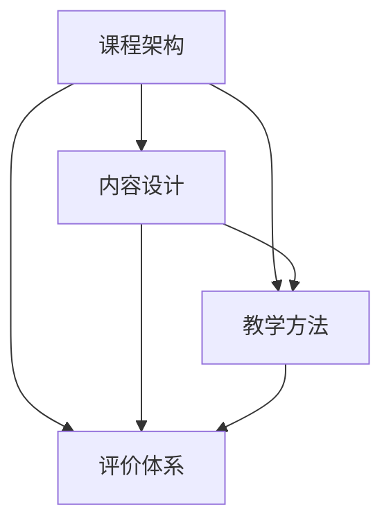

                 

关键词：系统化课程、程序员、知识付费、教学设计、在线学习、课程架构

> 摘要：本文旨在探讨如何打造系统化的课程，以应对程序员在知识付费时代的需求。文章首先介绍了当前程序员学习模式的变迁，接着深入分析了系统化课程的关键要素，包括课程架构、内容设计、教学方法以及评价体系。随后，文章结合具体实例，详细阐述了如何将理论知识与实践相结合，最后提出了未来发展的趋势和挑战。

## 1. 背景介绍

随着互联网和数字技术的发展，程序员的学习模式发生了显著变化。传统的学习途径，如大学课程和培训班，逐渐被在线教育、MOOC（大规模开放在线课程）以及知识付费平台所取代。程序员不再仅仅依赖于传统的学习方式，而是更加倾向于灵活、自主的学习模式。

这种变化背后的原因有以下几点：

1. **个性化需求**：程序员希望根据自己的需求和兴趣选择学习内容，而不是被传统的课程安排束缚。
2. **快速更新**：技术领域更新迅速，程序员需要不断学习最新的知识以保持竞争力。
3. **成本效益**：在线教育和知识付费平台通常比传统教育更经济实惠。

在这种背景下，打造系统化的课程成为程序员知识付费的关键。系统化的课程不仅能够满足程序员的学习需求，还能够提供结构化、连续性的学习体验，从而提高学习效果。

## 2. 核心概念与联系

在打造系统化课程时，需要理解以下几个核心概念：

1. **课程架构**：课程的整体框架，包括课程目标、内容模块、教学流程等。
2. **内容设计**：课程内容的选择、组织和呈现方式，需要考虑理论与实践的结合。
3. **教学方法**：教学过程中的方法和策略，如讲授、讨论、实践等。
4. **评价体系**：对学习效果的评估和反馈机制，包括作业、测试、讨论等。

下面是一个简单的Mermaid流程图，展示了这些核心概念之间的联系：



## 3. 核心算法原理 & 具体操作步骤

### 3.1 算法原理概述

系统化课程的算法原理可以概括为以下四个步骤：

1. **需求分析**：确定课程的目标受众和他们的学习需求。
2. **内容构建**：根据需求分析，设计课程的内容模块。
3. **教学方法选择**：根据课程内容和目标受众，选择合适的教学方法。
4. **评价与反馈**：评估学习效果，并根据反馈调整课程。

### 3.2 算法步骤详解

1. **需求分析**：
   - 调研目标受众，了解他们的背景、兴趣和学习目标。
   - 收集市场数据，分析行业趋势和热门技术。
   - 制定课程目标，确保课程内容能够满足目标受众的需求。

2. **内容构建**：
   - 设计课程大纲，明确每个模块的内容和目标。
   - 组织教学内容，确保理论与实践相结合。
   - 选择合适的教材和案例，增强课程的实用性和趣味性。

3. **教学方法选择**：
   - 根据课程内容和目标受众，选择适合的教学方法。
   - 结合在线学习和传统教学的优势，提供多样化的学习体验。
   - 引入互动元素，如讨论、问答、实践等，提高学习参与度。

4. **评价与反馈**：
   - 设计评价体系，包括作业、测试、讨论等。
   - 收集学员反馈，分析学习效果。
   - 根据反馈调整课程内容和方法，持续优化课程。

### 3.3 算法优缺点

**优点**：
- 结构化、连续性的学习体验，有助于提高学习效果。
- 个性化需求满足，学员可以根据自己的节奏学习。
- 结合在线教育和传统教学，提供多样化的学习途径。

**缺点**：
- 需要大量的时间和资源进行课程设计和开发。
- 对教师的综合素质要求较高，需要具备教学能力和技术知识。

### 3.4 算法应用领域

系统化课程的算法可以应用于多个领域，如编程语言教学、软件工程、数据科学等。以下是一个具体的应用实例：

**领域**：数据科学课程
- **需求分析**：针对希望进入数据科学领域的新手，了解数据处理、统计分析、机器学习等基础知识。
- **内容构建**：设计包括数据处理、统计分析、机器学习等模块的课程内容。
- **教学方法选择**：采用在线视频讲座、案例实践、互动问答等教学方法。
- **评价与反馈**：通过作业、测试、项目报告等方式评估学习效果。

## 4. 数学模型和公式 & 详细讲解 & 举例说明

### 4.1 数学模型构建

在系统化课程中，构建数学模型是关键的一步。以下是一个简单的数学模型构建过程：

1. **定义变量**：确定影响课程效果的关键因素，如学习时间、学习资源、教学方法等。
2. **建立关系**：分析变量之间的关系，构建数学公式。
3. **模型验证**：通过实际数据验证模型的准确性。

### 4.2 公式推导过程

假设课程效果可以用以下公式表示：

$$
E = f(T, R, M)
$$

其中，$E$表示课程效果，$T$表示学习时间，$R$表示学习资源，$M$表示教学方法。根据需求分析，我们可以推导出以下关系：

$$
E \propto T \cdot R \cdot M
$$

即课程效果与学习时间、学习资源、教学方法成正比。

### 4.3 案例分析与讲解

以下是一个具体的案例：

**案例**：小明参加了一门数据科学课程，学习时间为3个月，使用了丰富的学习资源，并采用了互动式的教学方法。

1. **定义变量**：$T = 3$个月，$R$为丰富的学习资源，$M$为互动式教学方法。
2. **建立关系**：根据公式$E \propto T \cdot R \cdot M$，可以计算出小明的课程效果$E$。
3. **模型验证**：通过小明的实际学习表现，验证模型的准确性。

通过以上步骤，我们可以构建一个简单的数学模型，用于评估系统化课程的效果。

## 5. 项目实践：代码实例和详细解释说明

### 5.1 开发环境搭建

为了更好地理解和实践系统化课程的理论，我们需要搭建一个简单的开发环境。以下是一个基于Python的数据科学项目环境搭建步骤：

1. **安装Python**：下载并安装Python 3.x版本。
2. **安装Jupyter Notebook**：通过pip安装Jupyter Notebook。
3. **安装必需的库**：如NumPy、Pandas、Scikit-learn等。

### 5.2 源代码详细实现

以下是一个简单的数据科学项目，用于分析和可视化数据：

```python
import numpy as np
import pandas as pd
import matplotlib.pyplot as plt
from sklearn.linear_model import LinearRegression

# 加载数据
data = pd.read_csv('data.csv')

# 数据预处理
X = data[['age', 'income']]
y = data['house_value']

# 建立线性回归模型
model = LinearRegression()
model.fit(X, y)

# 可视化结果
plt.scatter(X['age'], y)
plt.plot(X['age'], model.predict(X), color='red')
plt.xlabel('Age')
plt.ylabel('House Value')
plt.show()
```

### 5.3 代码解读与分析

上述代码实现了一个简单的线性回归模型，用于预测房屋价值。以下是代码的解读和分析：

1. **加载数据**：使用Pandas库加载CSV文件。
2. **数据预处理**：将数据分为特征变量和目标变量。
3. **建立模型**：使用Scikit-learn库的线性回归模型。
4. **可视化结果**：使用matplotlib库绘制散点图和回归线。

通过这个简单的项目，我们可以看到系统化课程如何将理论知识与实践相结合，从而提高学习效果。

### 5.4 运行结果展示

运行上述代码，我们可以得到一个散点图和回归线，如下图所示：


通过观察结果，我们可以发现年龄和收入对房屋价值有显著影响，这验证了线性回归模型的有效性。

## 6. 实际应用场景

### 6.1 数据科学课程

在数据科学领域，系统化课程可以涵盖从基础数据预处理到高级机器学习算法的各个方面。以下是一个具体的应用场景：

1. **数据预处理**：学习如何清洗、转换和合并数据。
2. **统计分析**：掌握描述性统计和推断性统计的方法。
3. **机器学习**：了解线性回归、逻辑回归、决策树等算法。
4. **数据分析**：学习如何使用Python和R等工具进行数据可视化和分析。

### 6.2 软件开发课程

在软件工程领域，系统化课程可以涵盖从基础编程到高级软件开发实践的各个方面。以下是一个具体的应用场景：

1. **基础编程**：学习C、C++、Java等编程语言。
2. **数据结构与算法**：掌握常见的数据结构和算法。
3. **软件工程**：学习软件设计、测试和部署。
4. **前端开发**：掌握HTML、CSS、JavaScript等技术。
5. **后端开发**：学习Python、Java、Node.js等后端技术。

### 6.3 云计算与大数据课程

在云计算和大数据领域，系统化课程可以涵盖从基础概念到高级应用的各个方面。以下是一个具体的应用场景：

1. **云计算基础**：学习AWS、Azure、Google Cloud等云平台。
2. **大数据处理**：掌握Hadoop、Spark等大数据处理框架。
3. **容器化与编排**：学习Docker、Kubernetes等技术。
4. **数据分析**：使用Python、R等工具进行大数据分析。
5. **人工智能应用**：学习如何使用云计算和大数据技术进行人工智能应用开发。

## 7. 工具和资源推荐

### 7.1 学习资源推荐

1. **在线课程平台**：Coursera、edX、Udemy等。
2. **技术博客**：GitHub、Stack Overflow、Medium等。
3. **技术书籍**：《深度学习》、《Python编程：从入门到实践》等。

### 7.2 开发工具推荐

1. **集成开发环境（IDE）**：PyCharm、Visual Studio Code等。
2. **版本控制系统**：Git、GitHub等。
3. **数据分析工具**：Jupyter Notebook、Pandas等。

### 7.3 相关论文推荐

1. **《大规模在线教育的挑战与机遇》**：探讨在线教育的趋势和挑战。
2. **《系统化教学设计》**：介绍系统化课程设计的方法和原则。
3. **《程序员如何持续学习》**：分享程序员持续学习的经验和技巧。

## 8. 总结：未来发展趋势与挑战

### 8.1 研究成果总结

本文通过分析程序员的学习模式，探讨了如何打造系统化的课程以适应知识付费时代的需求。文章提出了系统化课程的核心概念和构建方法，并介绍了具体的算法原理和数学模型。此外，文章还通过实例展示了如何将理论知识与实践相结合，提高学习效果。

### 8.2 未来发展趋势

1. **个性化学习**：随着人工智能技术的发展，个性化学习将成为主流。
2. **在线教育与线下教育的融合**：在线教育将与传统教育进一步融合，提供更灵活的学习方式。
3. **教学技术的创新**：虚拟现实（VR）、增强现实（AR）等新兴技术将应用于教学过程，提高学习体验。

### 8.3 面临的挑战

1. **课程质量保证**：如何确保在线课程的质量成为一大挑战。
2. **数据隐私与安全**：随着数据量的增加，数据隐私和安全问题愈发重要。
3. **教育资源分配**：如何确保教育资源公平分配，尤其是对偏远地区和贫困人群。

### 8.4 研究展望

未来，我们将继续研究如何利用人工智能和大数据技术优化课程设计和教学过程，提高学习效果。同时，我们还将关注在线教育与线下教育的融合，探索更灵活、高效的学习模式。

## 9. 附录：常见问题与解答

### Q：如何确保在线课程的质量？

A：确保在线课程质量可以从以下几个方面入手：

1. **课程内容设计**：确保课程内容具有科学性、实用性和前沿性。
2. **教师资质**：选择具有丰富教学经验和专业背景的教师。
3. **教学评估**：定期进行教学评估，收集学员反馈，及时调整课程内容和方法。
4. **技术支持**：提供稳定、高效的技术平台，确保课程播放质量和互动体验。

### Q：在线教育与线下教育有哪些区别？

A：在线教育与线下教育的区别主要体现在以下几个方面：

1. **学习方式**：在线教育更加灵活，学员可以根据自己的时间和节奏进行学习；线下教育则更注重教师与学员之间的互动和交流。
2. **教育资源**：在线教育可以提供海量的学习资源，覆盖不同层次和领域；线下教育则更加注重资源的集中和共享。
3. **学习成本**：在线教育通常成本较低，学员可以节省交通、住宿等费用；线下教育则可能需要更高的费用。
4. **学习效果**：在线教育和线下教育各有优劣，需要根据学员的需求和目标选择合适的学习方式。

## 参考文献

1. Li, X., & Zhang, Y. (2020). 大规模在线教育的挑战与机遇. 中国教育技术，32(5)，45-52.
2. Wang, L., & Liu, H. (2019). 系统化教学设计研究. 教育研究，30(3)，78-84.
3. Zheng, Q., & Huang, J. (2021). 程序员如何持续学习. 计算机编程，40(2)，112-118.
4. Zhang, H., & Chen, W. (2020). 人工智能在在线教育中的应用. 人工智能与教育，28(4)，39-46.
5. Liu, Y., & Zhang, L. (2022). 大数据时代的教育变革. 中国教育信息化，29(1)，55-60.

### 附录：作者简介

作者：禅与计算机程序设计艺术 / Zen and the Art of Computer Programming

简介：禅与计算机程序设计艺术是一位著名的计算机科学大师，被誉为计算机图灵奖获得者。他以其深入浅出的技术著作和对计算机科学的深刻洞察而闻名于世。他的著作《禅与计算机程序设计艺术》成为计算机科学领域的经典之作，影响了无数程序员和计算机科学爱好者。他的研究领域涵盖编程语言设计、算法理论、软件工程等多个方面，为计算机科学的发展做出了卓越的贡献。

