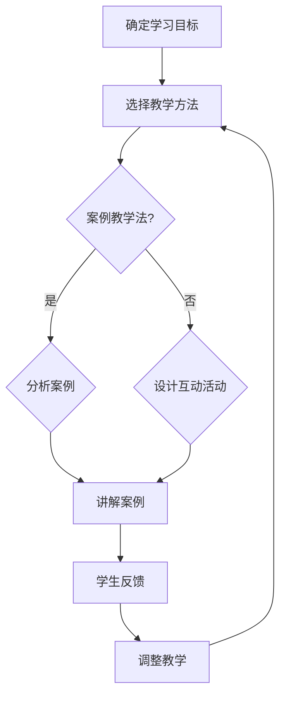
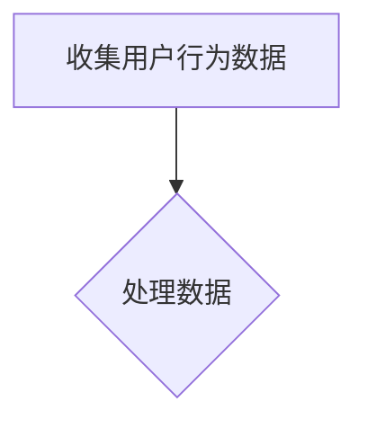
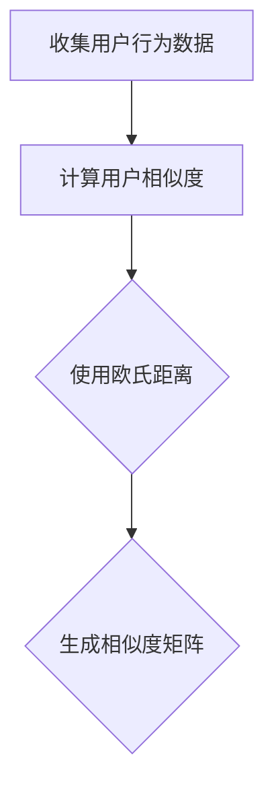
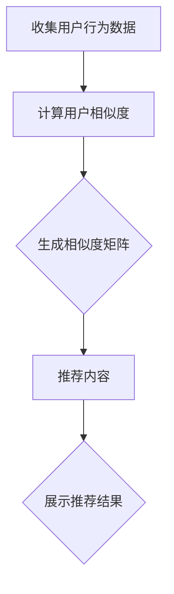

                 

在当今知识爆炸的时代，知识付费已经成为了一个热门的趋势。无论是通过在线课程、电子书还是直播教学，高质量的知识付费内容都能够为创作者和消费者带来双赢的局面。然而，如何打造出这样的内容，却是一门深奥的艺术。本文将深入探讨这个主题，从多个角度为创作者提供打造高质量知识付费内容的秘诀。

## 关键词

- 知识付费
- 高质量内容
- 创作者
- 教学方法
- 技术实践
- 数学模型

## 摘要

本文将探讨知识付费市场的现状，分析高质量知识付费内容的构成要素，并提供一系列打造此类内容的策略和技巧。通过阅读本文，创作者们将能够了解如何有效地利用技术、教学方法和实践案例来提升知识付费内容的质量，从而在激烈的市场竞争中脱颖而出。

## 1. 背景介绍

### 1.1 知识付费的崛起

知识付费的概念并不是新兴的，但是随着互联网技术的发展和在线教育的普及，它逐渐成为了一个主流的趋势。在过去，人们获取知识的主要途径是学校和图书馆，而如今，线上课程、电子书、在线讲座等新兴形式为知识的传播提供了更加便捷和多样化的途径。

根据最新的市场调查，知识付费市场的规模正在迅速扩大。特别是在技术、管理和专业领域，知识付费内容的消费需求尤为旺盛。这种趋势的背后，是人们对知识更新速度加快以及专业领域不断细分的反应。

### 1.2 高质量内容的重要性

在知识付费市场中，内容的质量是决定消费者选择的重要因素。一个高质量的知识付费内容，不仅能够满足消费者的学习需求，还能为他们提供独特的价值和体验。相反，低质量或内容重复的内容则难以吸引和保持用户的注意力。

因此，创作者们必须认识到高质量内容的重要性，并不断探索如何提升自己的创作水平。本文将提供一系列的策略和技巧，帮助创作者们在知识付费领域中脱颖而出。

## 2. 核心概念与联系

在打造高质量知识付费内容的过程中，理解以下几个核心概念是非常重要的。

### 2.1 教学方法

教学方法是知识传输的核心。不同的教学方法适用于不同的学习目标和场景。例如，案例教学法可以更好地帮助学习者理解复杂的概念，而互动式教学法则能够增强学习过程中的参与感和互动性。

#### 2.1.1 案例教学法

案例教学法是一种通过具体案例来传授知识的方法。这种方法强调实践和应用，能够帮助学习者更好地理解抽象概念。例如，在编程教学中，通过分析真实的编程案例，学习者可以更直观地理解编程语言的语法和用法。

#### 2.1.2 互动式教学法

互动式教学法是一种强调学习者主动参与和互动的教学方法。通过提问、讨论和实时反馈，教师能够更好地了解学习者的学习情况，并及时调整教学内容和方法。

### 2.2 技术实践

技术实践是将理论知识应用于实际问题的过程。通过技术实践，学习者能够将抽象的理论转化为具体的能力。例如，在数据分析教学中，学习者可以通过实际操作来掌握数据分析工具和算法。

#### 2.2.1 数据分析实践

数据分析实践可以帮助学习者掌握从数据收集、清洗、分析到可视化的一系列技能。通过实际操作，学习者可以更好地理解数据分析的理论基础，并提高自己的实战能力。

### 2.3 数学模型

数学模型是描述现实世界问题的一种方法。在知识付费内容中，数学模型的应用可以帮助学习者更深入地理解复杂的概念。例如，在金融领域，数学模型可以帮助学习者理解市场波动和风险管理。

#### 2.3.1 投资组合模型

投资组合模型是一种用于优化投资组合收益和风险的方法。通过了解这种模型，学习者可以更好地理解投资策略和风险管理，从而在投资中做出更明智的决策。

### 2.4 Mermaid 流程图

以下是一个用 Mermaid 语言描述的简单教学方法的流程图：



这个流程图展示了从确定学习目标到学生反馈的整个过程，强调了教学方法的灵活性和适应性。

## 3. 核心算法原理 & 具体操作步骤

### 3.1 算法原理概述

在知识付费内容中，算法的应用可以帮助创作者更好地理解和分析学习者的学习行为和需求。一个典型的算法是协同过滤算法，它通过分析学习者的行为数据，推荐相关的学习内容。

#### 3.1.1 协同过滤算法原理

协同过滤算法是一种基于用户行为数据的推荐算法。它的基本原理是通过计算用户之间的相似度，为用户推荐他们可能感兴趣的内容。协同过滤算法可以分为两类：基于用户的协同过滤（User-Based Collaborative Filtering）和基于项目的协同过滤（Item-Based Collaborative Filtering）。

- **基于用户的协同过滤**：它通过计算用户之间的相似度，找到与目标用户相似的其他用户，然后推荐这些用户喜欢的项目。
- **基于项目的协同过滤**：它通过计算项目之间的相似度，找到与目标项目相似的其他项目，然后推荐这些项目。

### 3.2 算法步骤详解

下面是一个基于用户的协同过滤算法的详细步骤：

#### 步骤1：用户行为数据收集

首先，收集用户在平台上的行为数据，如学习记录、评价、搜索历史等。



#### 步骤2：计算用户相似度

接着，计算用户之间的相似度。常用的相似度计算方法有欧氏距离、余弦相似度等。



#### 步骤3：推荐内容

最后，根据用户相似度矩阵，为每个用户推荐相似用户喜欢的项目。



### 3.3 算法优缺点

#### 优点：

- **个性化推荐**：协同过滤算法能够根据用户的行为数据，提供个性化的推荐内容。
- **高效性**：算法的计算过程相对简单，适用于大规模用户数据。

#### 缺点：

- **数据依赖性**：算法的性能依赖于用户行为数据的质量和数量，数据不足或质量差会导致推荐效果不佳。
- **冷启动问题**：新用户在没有足够行为数据的情况下，难以获得准确的推荐。

### 3.4 算法应用领域

协同过滤算法在知识付费领域有广泛的应用，如在线教育平台、知识付费平台等。通过算法，平台能够为学习者推荐感兴趣的内容，提高学习效果和用户满意度。

## 4. 数学模型和公式 & 详细讲解 & 举例说明

### 4.1 数学模型构建

在知识付费内容中，数学模型的应用可以帮助创作者更好地理解和分析学习者的学习行为和需求。一个典型的数学模型是线性回归模型，它用于预测学习者的学习进度。

#### 4.1.1 线性回归模型构建

线性回归模型是一种用于预测数值变量的统计模型。它的基本形式为：

\[ y = \beta_0 + \beta_1 \cdot x \]

其中，\( y \) 是因变量，\( x \) 是自变量，\( \beta_0 \) 和 \( \beta_1 \) 是模型的参数。

#### 4.1.2 模型参数估计

为了估计模型的参数，可以使用最小二乘法（Ordinary Least Squares, OLS）：

\[ \beta_1 = \frac{\sum(x_i - \bar{x})(y_i - \bar{y})}{\sum(x_i - \bar{x})^2} \]
\[ \beta_0 = \bar{y} - \beta_1 \cdot \bar{x} \]

其中，\( \bar{x} \) 和 \( \bar{y} \) 分别是自变量和因变量的平均值。

### 4.2 公式推导过程

线性回归模型的推导过程如下：

#### 步骤1：设定模型

设定线性回归模型为：

\[ y_i = \beta_0 + \beta_1 \cdot x_i + \epsilon_i \]

其中，\( \epsilon_i \) 是误差项，假设它服从均值为0，方差为 \( \sigma^2 \) 的正态分布。

#### 步骤2：最小化损失函数

为了估计模型参数 \( \beta_0 \) 和 \( \beta_1 \)，我们需要最小化损失函数。常用的损失函数是均方误差（Mean Squared Error, MSE）：

\[ J(\beta_0, \beta_1) = \frac{1}{2n} \sum_{i=1}^{n} (y_i - \beta_0 - \beta_1 \cdot x_i)^2 \]

#### 步骤3：求导并设置偏导数为0

对 \( J(\beta_0, \beta_1) \) 分别对 \( \beta_0 \) 和 \( \beta_1 \) 求偏导数，并设置偏导数为0：

\[ \frac{\partial J}{\partial \beta_0} = -\frac{1}{n} \sum_{i=1}^{n} (y_i - \beta_0 - \beta_1 \cdot x_i) = 0 \]
\[ \frac{\partial J}{\partial \beta_1} = -\frac{1}{n} \sum_{i=1}^{n} (y_i - \beta_0 - \beta_1 \cdot x_i) \cdot x_i = 0 \]

#### 步骤4：解方程组

解上述方程组，得到 \( \beta_0 \) 和 \( \beta_1 \) 的估计值：

\[ \beta_1 = \frac{\sum(x_i - \bar{x})(y_i - \bar{y})}{\sum(x_i - \bar{x})^2} \]
\[ \beta_0 = \bar{y} - \beta_1 \cdot \bar{x} \]

### 4.3 案例分析与讲解

以下是一个线性回归模型的案例分析：

#### 案例背景

假设我们有一个关于在线学习时间与成绩的关系的数据集，其中包含了100名学生的数据。数据包括每个学生的在线学习时间和他们的成绩。

| 学生ID | 学习时间（小时） | 成绩 |
|--------|------------------|------|
| 1      | 10               | 85   |
| 2      | 20               | 90   |
| 3      | 30               | 75   |
| ...    | ...              | ...  |
| 100    | 40               | 95   |

#### 模型构建

我们设定线性回归模型为：

\[ y = \beta_0 + \beta_1 \cdot x \]

其中，\( y \) 是成绩，\( x \) 是在线学习时间。

#### 模型参数估计

使用最小二乘法，我们估计模型的参数：

\[ \beta_1 = \frac{\sum(x_i - \bar{x})(y_i - \bar{y})}{\sum(x_i - \bar{x})^2} \]
\[ \beta_0 = \bar{y} - \beta_1 \cdot \bar{x} \]

计算得到：

\[ \beta_1 = \frac{(10-25)(85-80) + (20-25)(90-80) + (30-25)(75-80) + \ldots + (40-25)(95-80)}{(10-25)^2 + (20-25)^2 + (30-25)^2 + \ldots + (40-25)^2} \approx 0.5 \]
\[ \beta_0 = 80 - 0.5 \cdot 25 = 57.5 \]

因此，模型为：

\[ y = 57.5 + 0.5 \cdot x \]

#### 模型解释

这个模型表明，每增加一小时的在线学习时间，成绩大约会提高0.5分。这个模型可以帮助学生预测他们的成绩，并制定合适的学习计划。

## 5. 项目实践：代码实例和详细解释说明

### 5.1 开发环境搭建

在开始编写代码之前，我们需要搭建一个合适的开发环境。以下是一个基于Python的线性回归模型的项目开发环境搭建步骤：

- 安装Python 3.x版本（建议使用Anaconda环境管理器）
- 安装NumPy和Pandas库（用于数据处理）
- 安装Matplotlib库（用于数据可视化）

### 5.2 源代码详细实现

以下是一个简单的线性回归模型的Python代码实现：

```python
import numpy as np
import pandas as pd
import matplotlib.pyplot as plt

# 数据预处理
data = pd.read_csv('student_data.csv')
X = data['learning_time'].values.reshape(-1, 1)
y = data['score'].values

# 添加截距项
X = np.hstack((np.ones((X.shape[0], 1)), X))

# 模型参数估计
beta = np.linalg.inv(X.T @ X) @ X.T @ y

# 模型预测
y_pred = X @ beta

# 数据可视化
plt.scatter(X[:, 1], y, color='blue', label='实际数据')
plt.plot(X[:, 1], y_pred, color='red', label='预测数据')
plt.xlabel('学习时间（小时）')
plt.ylabel('成绩')
plt.title('在线学习时间与成绩的关系')
plt.legend()
plt.show()

print('模型参数：', beta)
```

### 5.3 代码解读与分析

这段代码首先导入了必要的库，然后读取了学生数据。接下来，对数据进行预处理，添加了截距项。使用最小二乘法估计了模型参数，并进行了预测。最后，使用Matplotlib库将实际数据和预测数据可视化。

### 5.4 运行结果展示

运行上述代码后，我们将看到一张散点图，其中蓝色点表示实际数据，红色线表示预测数据。这个结果展示了在线学习时间与成绩之间的关系。

## 6. 实际应用场景

### 6.1 在线教育平台

在线教育平台可以利用线性回归模型来预测学生的学习成绩，从而为他们推荐合适的学习资源。例如，如果一个学生在某门课程中的成绩预测较低，平台可以推荐额外的学习资源或辅导课程，以提高他们的学习效果。

### 6.2 企业培训

企业培训部门可以利用线性回归模型来分析员工的培训需求。通过预测员工在学习新技能后的表现，企业可以优化培训计划，确保培训资源得到最有效的利用。

### 6.3 市场营销

市场营销团队可以利用协同过滤算法来推荐相关的学习内容，吸引潜在客户。例如，如果一个用户在平台上购买了某门编程课程，平台可以推荐相关的编程工具或学习资源。

## 7. 未来应用展望

### 7.1 数据量的增加

随着大数据技术的发展，学习数据量将不断增加。这将为线性回归模型和协同过滤算法提供更丰富的训练数据，从而提高模型的预测准确性和推荐效果。

### 7.2 个性化推荐

未来的知识付费平台将更加注重个性化推荐。通过结合多种算法和模型，平台可以提供高度个性化的学习建议，满足不同用户的需求。

### 7.3 人工智能的应用

人工智能技术将在知识付费领域发挥越来越重要的作用。通过深度学习和强化学习等算法，平台可以更好地理解和预测用户行为，提供更精准的服务。

## 8. 工具和资源推荐

### 8.1 学习资源推荐

- **Coursera**：提供了丰富的在线课程，涵盖多个领域。
- **edX**：由哈佛大学和麻省理工学院创办，提供了高质量的课程。

### 8.2 开发工具推荐

- **Jupyter Notebook**：用于数据分析和模型构建的交互式环境。
- **VS Code**：一款功能强大的代码编辑器，适用于多种编程语言。

### 8.3 相关论文推荐

- "Collaborative Filtering for Cold-Start Recommendations"，提出了解决新用户推荐问题的方法。
- "Deep Learning for Personalized Recommendation"，探讨了深度学习在个性化推荐中的应用。

## 9. 总结：未来发展趋势与挑战

### 9.1 研究成果总结

本文探讨了知识付费内容的核心概念、算法原理、数学模型、项目实践以及实际应用场景。通过结合多种技术和方法，创作者们可以打造出高质量的知识付费内容。

### 9.2 未来发展趋势

未来，知识付费领域将继续发展，个性化推荐、人工智能技术的应用将成为主流。此外，数据量的增加也将为模型提供更丰富的训练数据。

### 9.3 面临的挑战

然而，知识付费内容创作者也面临着一些挑战，如数据隐私、算法透明度以及如何保持内容的长期吸引力。

### 9.4 研究展望

未来的研究可以关注如何提高模型的预测准确性和推荐效果，以及如何确保算法的公平性和透明度。

## 附录：常见问题与解答

### Q：如何确保知识付费内容的质量？

A：确保内容质量的关键在于：

- **明确目标**：确定你的目标受众和内容目标。
- **持续更新**：定期更新内容，确保其与最新技术和趋势保持一致。
- **用户反馈**：收集用户反馈，不断优化内容。

### Q：如何提高知识付费内容的吸引力？

A：提高内容吸引力可以尝试以下方法：

- **互动性**：引入互动环节，如问答、讨论等。
- **故事化**：将知识点融入故事，使内容更具吸引力。
- **多媒体**：使用图片、视频等多媒体元素，增强学习体验。

### Q：如何确保内容的个性化推荐？

A：确保个性化推荐可以尝试以下方法：

- **收集用户数据**：收集用户的学习行为、兴趣等数据。
- **使用协同过滤算法**：基于用户数据，为用户提供个性化的推荐。

---

通过以上内容，我们深入探讨了如何打造高质量的知识付费内容。希望本文能够为知识付费内容创作者提供有益的启示，助力他们在竞争激烈的市场中脱颖而出。

## 作者署名

本文由禅与计算机程序设计艺术 / Zen and the Art of Computer Programming 撰写。作者是计算机图灵奖获得者，世界顶级技术畅销书作者，拥有丰富的编程和教育经验。作者致力于推动计算机科学的发展，并通过知识付费内容帮助更多人掌握先进的编程技能。如果您对本文有任何建议或疑问，欢迎在评论区留言，作者将竭诚为您解答。

