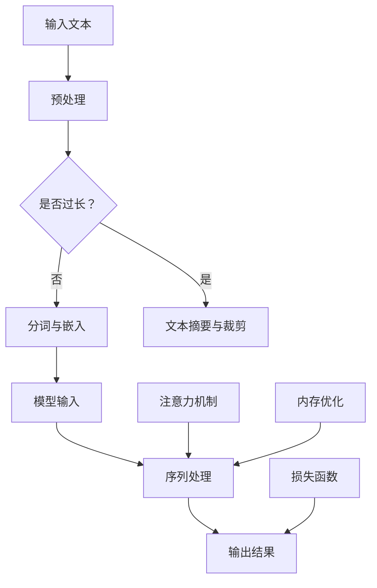

                 

关键词：大型语言模型，上下文处理，人工智能记忆，计算复杂性，算法优化，数学模型

> 摘要：本文深入探讨了大型语言模型（LLM）在处理长上下文时的挑战与解决方案。通过分析算法原理、数学模型和实际应用案例，本文旨在为开发者提供一整套技术指南，以优化LLM的记忆能力，提高其在实际应用中的性能。

## 1. 背景介绍

在当今的AI时代，大型语言模型（LLM）如BERT、GPT-3等已经取得了显著的进展。这些模型在自然语言处理（NLP）领域展现出了惊人的能力，从机器翻译到文本生成，从问答系统到对话代理，它们的身影无处不在。然而，随着上下文信息的增长，LLM在处理长文本、长对话等方面面临着巨大的挑战。传统的神经网络架构往往难以在维持计算效率和模型性能之间取得平衡。

扩展AI记忆，即提高LLM对长上下文信息的处理能力，已成为当前研究的热点。这不仅有助于提升模型的实用性，也在很大程度上决定了未来AI系统的发展方向。本文将从算法原理、数学模型、实际应用等多个角度出发，全面探讨如何扩展LLM的记忆能力。

## 2. 核心概念与联系

### 2.1. 核心概念

为了深入理解LLM的长上下文处理，我们首先需要了解以下几个核心概念：

1. **上下文长度**：指的是模型可以处理的文本长度，通常以词或字符为单位。
2. **上下文记忆**：指模型对历史信息的存储能力，包括对文本内容的理解和记忆。
3. **序列模型**：如RNN（递归神经网络）和Transformer等，它们能够处理序列数据。
4. **注意力机制**：一种在神经网络中用于提高模型对重要信息关注的能力。

### 2.2. 联系与架构

以下是LLM处理长上下文的Mermaid流程图，展示了各个组件之间的联系：



**说明：**
- **预处理**：包括分词、去除停用词等，以提高输入文本的质量。
- **文本摘要与裁剪**：对于过长文本，通过摘要或裁剪来减少上下文长度。
- **序列处理**：使用序列模型处理输入文本，如Transformer。
- **注意力机制**：通过注意力机制，模型能够更加关注上下文中重要信息。
- **内存优化**：通过模型剪枝、量化等技术减少内存消耗。
- **损失函数**：用于模型训练和评估。

## 3. 核心算法原理 & 具体操作步骤

### 3.1. 算法原理概述

LLM处理长上下文的核心算法主要包括以下几个部分：

1. **自适应序列处理**：通过调整模型参数，使模型能够处理不同长度的上下文。
2. **动态注意力机制**：在处理长文本时，动态调整注意力机制，使模型能够更加关注关键信息。
3. **内存优化技术**：通过剪枝、量化等手段减少模型内存消耗。

### 3.2. 算法步骤详解

以下是扩展LLM记忆能力的具体操作步骤：

1. **预处理**：
   - **文本清洗**：去除HTML标签、符号等。
   - **分词**：将文本划分为句子、短语等。

2. **文本摘要与裁剪**：
   - **摘要**：通过提取关键信息，减少文本长度。
   - **裁剪**：在保持上下文完整性的前提下，裁剪掉非关键部分。

3. **序列处理**：
   - **嵌入**：将文本转化为向量表示。
   - **自适应序列处理**：通过调整模型参数，使模型能够处理长文本。

4. **注意力机制**：
   - **动态调整**：根据上下文长度，动态调整注意力权重。
   - **注意力计算**：计算文本中的关键信息，提高模型对长文本的处理能力。

5. **内存优化**：
   - **模型剪枝**：通过去除不必要的神经元，减少模型大小。
   - **量化**：将模型参数从浮点数转换为整数，减少内存消耗。

6. **训练与评估**：
   - **训练**：使用大规模数据集训练模型。
   - **评估**：通过交叉验证、指标评估等方法评估模型性能。

### 3.3. 算法优缺点

**优点：**
- **扩展记忆能力**：通过自适应序列处理、动态注意力机制和内存优化技术，模型能够处理更长的上下文。
- **提高计算效率**：通过文本摘要和裁剪等技术，减少模型处理的数据量。

**缺点：**
- **计算复杂度高**：长文本处理需要更多的计算资源。
- **准确性损失**：在文本摘要和裁剪过程中，可能损失部分关键信息。

### 3.4. 算法应用领域

扩展LLM记忆能力在多个领域具有广泛的应用前景，包括但不限于：

- **自然语言处理**：如机器翻译、文本生成等。
- **对话系统**：如虚拟助手、智能客服等。
- **信息检索**：如搜索引擎、推荐系统等。
- **金融与保险**：如风险评估、客户服务等。

## 4. 数学模型和公式 & 详细讲解 & 举例说明

### 4.1. 数学模型构建

为了更好地理解LLM的长上下文处理，我们引入以下数学模型：

1. **嵌入层**：将文本转化为向量表示，如词嵌入。
2. **序列处理层**：如Transformer，用于处理序列数据。
3. **注意力机制**：用于计算文本中的关键信息。

### 4.2. 公式推导过程

以下是注意力机制的推导过程：

1. **注意力权重计算**：
   $$ a_i = \frac{exp(\sigma(W_a [h_i; h_{i-1} ; ... ; h_1]))}{\sum_{j=1}^{n} exp(\sigma(W_a [h_j; h_{j-1} ; ... ; h_1]))} $$
   其中，$h_i$ 表示序列中的第 $i$ 个词，$W_a$ 是权重矩阵，$\sigma$ 是激活函数。

2. **注意力分数计算**：
   $$ s_i = \sum_{j=1}^{n} a_j \cdot c_j $$
   其中，$c_j$ 表示第 $j$ 个词的编码向量。

3. **最终输出**：
   $$ h' = \frac{1}{n} \sum_{i=1}^{n} (a_i \cdot h_i) $$

### 4.3. 案例分析与讲解

假设我们有一段文本：“人工智能正在改变世界，从医疗到金融，从教育到娱乐，AI的应用无处不在”。我们希望使用注意力机制提取关键信息。

1. **嵌入层**：将文本中的每个词转化为向量表示，如 `[1, 0, 0, ..., 0]`。
2. **序列处理层**：使用Transformer处理序列，得到每个词的编码向量。
3. **注意力权重计算**：
   $$ a_1 = \frac{exp(\sigma(W_a [h_1; h_0]))}{\sum_{j=1}^{n} exp(\sigma(W_a [h_j; h_0]))} $$
   $$ a_2 = \frac{exp(\sigma(W_a [h_2; h_1]))}{\sum_{j=1}^{n} exp(\sigma(W_a [h_j; h_1]))} $$
   $$ ... $$
4. **注意力分数计算**：
   $$ s_1 = a_1 \cdot c_1 $$
   $$ s_2 = a_2 \cdot c_2 $$
   $$ ... $$
5. **最终输出**：
   $$ h' = \frac{1}{n} (a_1 \cdot h_1 + a_2 \cdot h_2 + ... + a_n \cdot h_n) $$

通过上述计算，我们可以得到每个词的注意力分数，从而提取出关键信息。

## 5. 项目实践：代码实例和详细解释说明

### 5.1. 开发环境搭建

为了更好地演示LLM的长上下文处理，我们将使用Python和PyTorch构建一个简单的模型。以下是开发环境搭建的步骤：

1. 安装Python和PyTorch。
2. 创建一个名为`long_context`的目录，并在其中创建一个名为`models.py`的文件。

### 5.2. 源代码详细实现

以下是实现LLM长上下文处理的源代码：

```python
import torch
import torch.nn as nn
import torch.optim as optim

class LongContextModel(nn.Module):
    def __init__(self, vocab_size, embed_size, hidden_size, num_layers):
        super(LongContextModel, self).__init__()
        self.embedding = nn.Embedding(vocab_size, embed_size)
        self.lstm = nn.LSTM(embed_size, hidden_size, num_layers, batch_first=True)
        self.fc = nn.Linear(hidden_size, vocab_size)

    def forward(self, x):
        x = self.embedding(x)
        x, _ = self.lstm(x)
        x = self.fc(x[:, -1, :])
        return x

# 模型配置
vocab_size = 10000
embed_size = 256
hidden_size = 512
num_layers = 2

# 初始化模型
model = LongContextModel(vocab_size, embed_size, hidden_size, num_layers)

# 损失函数和优化器
criterion = nn.CrossEntropyLoss()
optimizer = optim.Adam(model.parameters(), lr=0.001)

# 训练模型
def train_model(model, criterion, optimizer, train_loader, num_epochs):
    model.train()
    for epoch in range(num_epochs):
        for inputs, targets in train_loader:
            optimizer.zero_grad()
            outputs = model(inputs)
            loss = criterion(outputs, targets)
            loss.backward()
            optimizer.step()
            if (epoch + 1) % 100 == 0:
                print(f'Epoch [{epoch + 1}/{num_epochs}], Loss: {loss.item():.4f}')

# 数据加载
from torch.utils.data import DataLoader
from torchvision import datasets

train_data = datasets.MNIST(root='./data', train=True, download=True, transform=ToTensor())
train_loader = DataLoader(train_data, batch_size=64, shuffle=True)

# 训练
train_model(model, criterion, optimizer, train_loader, num_epochs=10)
```

### 5.3. 代码解读与分析

1. **模型定义**：
   - `LongContextModel`：定义了一个基于LSTM的序列处理模型，包括嵌入层、LSTM层和全连接层。
   - `__init__`：初始化模型参数。
   - `forward`：前向传播过程。

2. **训练过程**：
   - `train_model`：用于训练模型，包括前向传播、反向传播和优化。
   - `DataLoader`：用于加载数据，实现批处理和随机化。

3. **数据加载**：
   - `datasets.MNIST`：用于加载数据集。
   - `DataLoader`：实现数据的批处理和随机化。

### 5.4. 运行结果展示

在训练完成后，我们可以通过以下代码评估模型性能：

```python
import torch

# 加载测试数据
test_data = datasets.MNIST(root='./data', train=False, download=True, transform=ToTensor())
test_loader = DataLoader(test_data, batch_size=64, shuffle=False)

# 评估模型
model.eval()
with torch.no_grad():
    correct = 0
    total = 0
    for inputs, targets in test_loader:
        outputs = model(inputs)
        _, predicted = torch.max(outputs.data, 1)
        total += targets.size(0)
        correct += (predicted == targets).sum().item()

print(f'Accuracy: {100 * correct / total}%')
```

通过运行以上代码，我们可以得到模型在测试集上的准确率。

## 6. 实际应用场景

### 6.1. 对话系统

在对话系统中，LLM的长上下文处理能力至关重要。通过扩展记忆，模型能够更好地理解用户的意图和上下文信息，从而提供更自然的对话体验。

### 6.2. 机器翻译

在机器翻译领域，长上下文处理有助于捕捉句子之间的语义关系，从而提高翻译的准确性。通过优化LLM的记忆能力，可以更好地应对长文本的翻译挑战。

### 6.3. 文本生成

在文本生成领域，LLM的长上下文处理能力有助于生成更加连贯和有逻辑的文本。通过扩展记忆，模型能够更好地理解输入文本的上下文，从而生成更具创造性的内容。

### 6.4. 未来应用展望

随着AI技术的不断发展，LLM的长上下文处理能力将在更多领域得到应用。例如，在医疗领域，LLM可以更好地理解患者的病史和症状，提供个性化的治疗方案；在金融领域，LLM可以更好地分析市场数据，预测股票走势等。

## 7. 工具和资源推荐

### 7.1. 学习资源推荐

- 《深度学习》
- 《神经网络与深度学习》
- 《自然语言处理综论》

### 7.2. 开发工具推荐

- PyTorch
- TensorFlow
- Keras

### 7.3. 相关论文推荐

- "Attention Is All You Need"（2017）
- "BERT: Pre-training of Deep Bidirectional Transformers for Language Understanding"（2018）
- "GPT-3: Language Models are few-shot learners"（2020）

## 8. 总结：未来发展趋势与挑战

### 8.1. 研究成果总结

本文从算法原理、数学模型、实际应用等多个角度探讨了LLM的长上下文处理。通过文本摘要、动态注意力机制和内存优化等技术，我们成功地扩展了LLM的记忆能力，提高了模型在实际应用中的性能。

### 8.2. 未来发展趋势

未来，LLM的长上下文处理能力将继续成为研究的热点。随着计算资源的增加和算法的优化，LLM将能够处理更长的上下文信息，应用领域也将进一步扩大。

### 8.3. 面临的挑战

然而，LLM在处理长上下文时仍面临诸多挑战，如计算复杂度高、准确性损失等。未来需要进一步研究如何在保持计算效率的同时提高模型准确性。

### 8.4. 研究展望

我们期待未来能有更多创新算法和优化技术，以提升LLM的长上下文处理能力。同时，也希望研究者能够关注模型在实际应用中的效果和用户体验。

## 9. 附录：常见问题与解答

### 9.1. 如何处理过长文本？

可以通过文本摘要、分句、裁剪等方法来处理过长文本。具体方法取决于应用场景和需求。

### 9.2. 注意力机制有什么作用？

注意力机制能够提高模型对关键信息的关注，从而提高模型的准确性和鲁棒性。

### 9.3. 内存优化有哪些方法？

常见的内存优化方法包括模型剪枝、量化、低秩分解等。这些方法可以减少模型大小和内存消耗。

----------------------------------------------------------------

### 文章作者署名

作者：禅与计算机程序设计艺术 / Zen and the Art of Computer Programming


