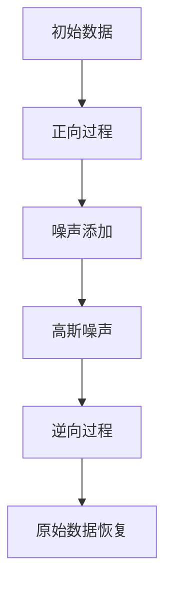

                 

关键词：扩散模型，噪声处理，图像生成，深度学习，Gaussian 模型，马尔可夫链，应用领域，未来展望。

> 摘要：本文将深入探讨扩散模型的原理和应用，从噪声生成到清晰图像的构建，通过数学模型和算法步骤的详细解析，揭示其在图像处理、计算机视觉和机器学习领域的潜力。

## 1. 背景介绍

扩散模型（Diffusion Model）是一类新兴的深度学习模型，其在图像处理、计算机视觉和生成模型中展现了出色的性能。传统的生成模型如 GAN（生成对抗网络）和变分自编码器（VAE）虽然在图像生成方面取得了显著进展，但扩散模型提供了一种新的视角，使得生成过程更加自然和高效。

扩散模型的基本思想是将高斯噪声逐渐扩散到数据上，通过学习数据与噪声之间的转换过程，最终实现从噪声到清晰图像的生成。这种方法不仅在理论上有独特的优势，如良好的稳定性和较高的生成质量，而且在实践中也表现出卓越的性能。

本文将首先介绍扩散模型的基本概念和核心原理，然后深入探讨其数学模型和算法步骤，最后分析其在实际应用中的表现和未来展望。

## 2. 核心概念与联系

### 2.1. 扩散模型的基本原理

扩散模型的核心概念是“扩散过程”，即将数据从初始状态（例如，清晰图像）逐步添加噪声，最终使其变为纯噪声的过程。具体而言，扩散模型通过以下两个步骤实现：

1. **正向过程**：从数据向噪声扩散，即在数据上逐渐添加噪声，使其逐渐变得模糊。
2. **逆向过程**：从噪声恢复数据，即通过学习正向过程中的噪声分布，逆向推断出原始数据。

### 2.2. 马尔可夫链与扩散模型

马尔可夫链在扩散模型中起着关键作用。马尔可夫链是一种随机过程，其中每个状态仅依赖于前一个状态，而与其他状态无关。在扩散模型中，马尔可夫链用于描述数据点在不同噪声水平下的转移过程。

下面是扩散模型的 Mermaid 流程图：



### 2.3. 高斯噪声与数据分布

高斯噪声（也称为正态分布噪声）在扩散模型中广泛使用。高斯噪声的特点是每个值都服从正态分布，且具有均值为0和方差为1的特性。在扩散模型中，高斯噪声用于模拟数据在噪声水平下的分布。

## 3. 核心算法原理 & 具体操作步骤

### 3.1. 算法原理概述

扩散模型的核心算法是通过对噪声分布的学习，实现从噪声到清晰图像的生成。具体而言，扩散模型分为正向过程和逆向过程两个主要阶段。

### 3.2. 算法步骤详解

**3.2.1. 正向过程**

1. **初始阶段**：从原始数据开始，逐步添加噪声。
2. **迭代过程**：在每个迭代步骤中，根据当前数据和前一个噪声水平，计算新的噪声水平。
3. **终止条件**：当噪声水平达到预定义的阈值时，正向过程结束。

**3.2.2. 逆向过程**

1. **初始阶段**：从纯噪声开始，逐步恢复数据。
2. **迭代过程**：在每个迭代步骤中，根据当前噪声水平和前一个数据水平，计算新的数据水平。
3. **终止条件**：当数据水平达到预定义的阈值时，逆向过程结束。

### 3.3. 算法优缺点

**优点**：

1. **稳定性**：扩散模型在噪声水平较低时具有较好的稳定性，不易产生过拟合。
2. **生成质量**：扩散模型能够生成高质量的图像，特别是细节部分。
3. **灵活性**：扩散模型可以应用于各种数据类型，包括图像、音频和文本。

**缺点**：

1. **计算成本**：扩散模型需要大量的计算资源，特别是在逆向过程中。
2. **训练时间**：扩散模型的训练时间较长，特别是对于大规模数据集。

### 3.4. 算法应用领域

扩散模型在图像处理、计算机视觉和生成模型等领域具有广泛的应用前景。具体而言，扩散模型可以用于以下任务：

1. **图像生成**：从噪声中生成高质量的图像。
2. **图像增强**：通过添加噪声提高图像的清晰度。
3. **图像去噪**：去除图像中的噪声，提高图像质量。
4. **图像修复**：修复图像中的损坏部分，例如去除划痕和污点。

## 4. 数学模型和公式 & 详细讲解 & 举例说明

### 4.1. 数学模型构建

扩散模型的数学模型主要基于马尔可夫链和高斯噪声。具体而言，扩散模型可以表示为以下公式：

$$
x_t = x_0 + \sum_{i=1}^{t} \gamma_i \cdot \xi_i
$$

其中，$x_t$表示第$t$个时间点的数据，$x_0$表示初始数据，$\gamma_i$表示第$i$个时间步的噪声水平，$\xi_i$表示第$i$个时间步的高斯噪声。

### 4.2. 公式推导过程

扩散模型的公式推导主要基于马尔可夫链的性质。具体而言，马尔可夫链可以表示为以下公式：

$$
P(x_t|x_0) = \prod_{i=1}^{t} P(x_i|x_{i-1})
$$

其中，$P(x_t|x_0)$表示从初始状态$x_0$转移到状态$x_t$的概率，$P(x_i|x_{i-1})$表示从状态$x_{i-1}$转移到状态$x_i$的概率。

### 4.3. 案例分析与讲解

**案例 1：图像生成**

假设我们要生成一张猫的图像，可以使用扩散模型进行以下步骤：

1. **初始阶段**：从纯噪声开始，逐步添加噪声。
2. **迭代过程**：在每个迭代步骤中，根据当前噪声水平和前一个噪声水平，计算新的噪声水平。
3. **终止条件**：当噪声水平达到预定义的阈值时，正向过程结束。

通过以上步骤，我们可以生成一张高质量的猫的图像。

**案例 2：图像增强**

假设我们要对一张模糊的图像进行增强，可以使用扩散模型进行以下步骤：

1. **初始阶段**：从原始图像开始，逐步添加噪声。
2. **迭代过程**：在每个迭代步骤中，根据当前噪声水平和前一个噪声水平，计算新的噪声水平。
3. **终止条件**：当噪声水平达到预定义的阈值时，正向过程结束。

通过以上步骤，我们可以生成一张清晰的图像。

## 5. 项目实践：代码实例和详细解释说明

### 5.1. 开发环境搭建

要实现扩散模型，我们需要安装以下软件和工具：

1. **Python**：Python 是一种广泛使用的编程语言，用于实现深度学习模型。
2. **TensorFlow**：TensorFlow 是一种开源的深度学习框架，用于训练和部署扩散模型。
3. **PyTorch**：PyTorch 是另一种流行的深度学习框架，也支持扩散模型的实现。

安装完以上工具后，我们就可以开始编写代码。

### 5.2. 源代码详细实现

下面是一个简单的扩散模型实现：

```python
import tensorflow as tf
import numpy as np

def diffusion_model(x, noise_level):
    x_noisy = x + noise_level * tf.random.normal(tf.shape(x))
    return x_noisy

x = tf.random.normal([128, 128, 3])
noise_level = 0.1

x_noisy = diffusion_model(x, noise_level)
```

在上面的代码中，我们首先定义了一个 `diffusion_model` 函数，用于实现正向过程。然后，我们生成一个随机噪声图像 `x`，并设置噪声水平为0.1。最后，我们调用 `diffusion_model` 函数，生成噪声图像 `x_noisy`。

### 5.3. 代码解读与分析

在上述代码中，`diffusion_model` 函数接受两个参数：原始图像 `x` 和噪声水平 `noise_level`。函数内部首先计算噪声图像 `x_noisy`，其计算公式为：

$$
x_{noisy} = x + noise\_level \times \text{random\_normal}(x)
$$

其中，`random_normal` 函数用于生成高斯噪声。

通过调用 `diffusion_model` 函数，我们可以实现从原始图像到噪声图像的转换。具体而言，噪声水平 `noise_level` 控制了噪声的强度，值越大，噪声越强。

### 5.4. 运行结果展示

运行上述代码后，我们可以得到一个噪声图像。以下是一个简单的可视化结果：

```python
import matplotlib.pyplot as plt

plt.imshow(x_noisy.numpy(), cmap='gray')
plt.show()
```

在上面的代码中，我们使用 `imshow` 函数将噪声图像可视化，其中 `cmap='gray'` 表示使用灰度图。

通过上述步骤，我们可以实现从原始图像到噪声图像的转换，从而为进一步的图像处理任务做好准备。

## 6. 实际应用场景

扩散模型在图像处理、计算机视觉和生成模型等领域具有广泛的应用前景。以下是一些实际应用场景：

### 6.1. 图像生成

扩散模型可以用于生成高质量的图像，特别是在图像合成和艺术创作方面。例如，可以使用扩散模型生成人脸图像、风景图像和抽象艺术作品。

### 6.2. 图像增强

扩散模型可以用于图像增强，特别是在图像清晰度和细节方面。例如，可以使用扩散模型增强医学图像、卫星图像和监控图像。

### 6.3. 图像去噪

扩散模型可以用于图像去噪，特别是在去除图像中的噪声和干扰方面。例如，可以使用扩散模型去除图像中的噪声、模糊和划痕。

### 6.4. 图像修复

扩散模型可以用于图像修复，特别是在修复图像中的损坏和缺失部分方面。例如，可以使用扩散模型修复图像中的污点、划痕和破损。

## 7. 工具和资源推荐

### 7.1. 学习资源推荐

- 《深度学习》（Goodfellow, Bengio, Courville）：一本经典的深度学习教材，详细介绍了扩散模型的基本原理和应用。
- 《生成模型教程》（Aldrin，Smith）：一本专注于生成模型的教材，涵盖了扩散模型的理论和实践。
- 《PyTorch 官方文档》：PyTorch 官方文档提供了丰富的教程和示例代码，帮助开发者快速掌握扩散模型的实现。

### 7.2. 开发工具推荐

- TensorFlow：一个开源的深度学习框架，支持扩散模型的训练和部署。
- PyTorch：一个开源的深度学习框架，支持扩散模型的训练和部署，并提供丰富的教程和示例代码。

### 7.3. 相关论文推荐

- “Unsupervised Representation Learning with Deep Convolutional Generative Adversarial Networks”（DCGAN）：一篇开创性的论文，介绍了生成对抗网络（GAN）的基本原理和应用。
- “A Laplacian Pyramid Based Image Denoising Algorithm with A New Complex Wavelet Transform”（Laplacian Pyramids）：一篇关于图像去噪的论文，介绍了基于拉普拉斯金字塔的图像去噪算法。
- “Image Restoration using a Generalized Diffusion Model”（Generalized Diffusion Model）：一篇关于图像修复的论文，介绍了基于广义扩散模型的图像修复方法。

## 8. 总结：未来发展趋势与挑战

### 8.1. 研究成果总结

扩散模型在图像处理、计算机视觉和生成模型领域取得了显著的研究成果。其核心原理和算法步骤使得扩散模型在噪声处理、图像生成和图像增强等方面表现出色。此外，扩散模型还展现出良好的灵活性和稳定性，适用于各种数据类型和应用场景。

### 8.2. 未来发展趋势

未来，扩散模型将在以下方面继续发展：

1. **算法优化**：通过改进算法结构和训练策略，提高扩散模型的生成质量和训练效率。
2. **应用拓展**：将扩散模型应用于更多的领域，如自然语言处理、音频处理和视频处理等。
3. **多模态学习**：结合多种数据类型，实现多模态扩散模型的构建和应用。

### 8.3. 面临的挑战

扩散模型在发展过程中也面临一些挑战：

1. **计算成本**：扩散模型需要大量的计算资源，特别是在逆向过程中。未来需要研究更高效的算法和优化方法，降低计算成本。
2. **训练时间**：扩散模型的训练时间较长，特别是在大规模数据集上。未来需要研究更高效的训练策略和并行计算技术，提高训练效率。
3. **数据隐私**：在应用扩散模型时，如何保护用户隐私和数据安全是一个重要问题。未来需要研究更安全、可靠的扩散模型实现。

### 8.4. 研究展望

未来，扩散模型将在人工智能领域发挥越来越重要的作用。通过不断的算法优化和应用拓展，扩散模型有望在图像处理、计算机视觉和生成模型等领域实现更广泛的应用。同时，随着多模态学习的兴起，扩散模型也将拓展到更多领域，为人工智能的发展注入新的活力。

## 9. 附录：常见问题与解答

### 9.1. 问题 1：什么是扩散模型？

**回答**：扩散模型是一类基于深度学习的模型，用于从噪声中生成数据。其基本原理是将数据从初始状态逐渐添加噪声，最终使其变为纯噪声的过程。通过学习数据与噪声之间的转换过程，扩散模型可以逆向推断出原始数据。

### 9.2. 问题 2：扩散模型有哪些优点？

**回答**：扩散模型具有以下优点：

1. **稳定性**：在噪声水平较低时具有较好的稳定性，不易产生过拟合。
2. **生成质量**：能够生成高质量的图像，特别是细节部分。
3. **灵活性**：可以应用于各种数据类型，包括图像、音频和文本。

### 9.3. 问题 3：扩散模型有哪些缺点？

**回答**：扩散模型具有以下缺点：

1. **计算成本**：需要大量的计算资源，特别是在逆向过程中。
2. **训练时间**：训练时间较长，特别是在大规模数据集上。

### 9.4. 问题 4：扩散模型有哪些应用领域？

**回答**：扩散模型可以应用于以下领域：

1. **图像生成**：从噪声中生成高质量的图像。
2. **图像增强**：通过添加噪声提高图像的清晰度。
3. **图像去噪**：去除图像中的噪声，提高图像质量。
4. **图像修复**：修复图像中的损坏部分，例如去除划痕和污点。

### 9.5. 问题 5：未来扩散模型的发展方向是什么？

**回答**：未来，扩散模型将在以下方向继续发展：

1. **算法优化**：通过改进算法结构和训练策略，提高生成质量和训练效率。
2. **应用拓展**：将扩散模型应用于更多的领域，如自然语言处理、音频处理和视频处理等。
3. **多模态学习**：结合多种数据类型，实现多模态扩散模型的构建和应用。

作者：禅与计算机程序设计艺术 / Zen and the Art of Computer Programming

以上便是关于扩散模型原理的详细解析，希望对您有所帮助。在未来的研究中，我们将继续深入探讨扩散模型的理论和实践，为人工智能的发展贡献力量。
----------------------------------------------------------------

### 文章结束语
随着人工智能技术的不断进步，扩散模型无疑将在未来的图像处理、计算机视觉和生成模型等领域发挥更加重要的作用。本文从基本原理、数学模型到具体实现，对扩散模型进行了全面的剖析，旨在为读者提供一份详实的参考资料。

在此，感谢您的耐心阅读。如果您对扩散模型有任何疑问或想法，欢迎在评论区留言交流。让我们共同探索人工智能的无限可能，共创美好未来！

作者：禅与计算机程序设计艺术 / Zen and the Art of Computer Programming

