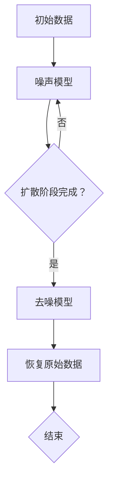

                 

### 背景介绍 Background Introduction

随着计算机视觉和生成模型的快速发展，扩散模型（Diffusion Model）逐渐成为人工智能领域中的一个热门研究方向。扩散模型是一种基于概率论的深度学习模型，其核心思想是将数据从确定的态（例如图像或文本）逐渐扩散到随机的态，然后再通过反向过程从随机态恢复到确定的态。这种模型在图像生成、图像去噪、文本生成等任务中展现出了出色的性能。

扩散模型的研究起源于对随机过程的模拟，尤其是在物理学中用于描述物质如何从高能态逐渐扩散到低能态。然而，随着深度学习技术的发展，这种随机过程模型被重新构建并应用于计算机科学领域，特别是在计算机视觉中取得了突破性的进展。本文将详细介绍扩散模型的原理、核心算法、数学模型、以及实际应用，并探讨其在未来的发展趋势和挑战。

本文结构如下：

- **第1章** 背景介绍
- **第2章** 核心概念与联系
- **第3章** 核心算法原理与具体操作步骤
- **第4章** 数学模型和公式详解与举例说明
- **第5章** 项目实践：代码实例与详细解释
- **第6章** 实际应用场景
- **第7章** 工具和资源推荐
- **第8章** 总结：未来发展趋势与挑战
- **第9章** 附录：常见问题与解答

通过本文的阅读，读者将能够深入理解扩散模型的工作原理，掌握其核心算法，并了解其在实际应用中的广泛潜力。

## 1. 核心概念与联系 Core Concepts and Relationships

### 1.1 扩散过程 Diffusion Process

扩散过程是一个连续时间随机过程，描述了物质或能量如何在空间中逐渐均匀分布的过程。在数学上，扩散过程可以用随机微分方程（Stochastic Differential Equations, SDEs）来描述。具体来说，给定一个初始状态 \( X(0) = x_0 \)，扩散过程在时间 \( t \) 时刻的状态 \( X(t) \) 满足以下方程：

$$
dX_t = -\alpha X_t dt + \sigma dW_t
$$

其中，\( \alpha \) 和 \( \sigma \) 分别是扩散系数和波动系数，\( W_t \) 是标准布朗运动。

### 1.2 随机扩散模型 Stochastic Diffusion Model

随机扩散模型是一种基于随机过程的深度学习模型，它通过模拟数据在噪声中的扩散过程来生成新的数据。在随机扩散模型中，数据的生成过程可以分为两个阶段：

1. **扩散阶段**：在这个阶段，数据从初始状态逐渐扩散到随机状态。具体来说，给定一个初始数据 \( x_0 \)，模型通过迭代应用随机扩散过程，生成一个随机的中间状态序列。

2. **去噪阶段**：在去噪阶段，模型通过迭代应用去噪过程，从随机中间状态恢复到初始状态。去噪过程的目的是减少噪声，同时保留数据的关键特征。

### 1.3 扩散模型架构 Diffusion Model Architecture

扩散模型通常由两个主要部分组成：噪声模型（Noise Model）和去噪模型（Denoising Model）。噪声模型用于生成噪声状态，而去噪模型用于从噪声状态恢复到原始数据。

1. **噪声模型**：噪声模型的核心任务是给定一个当前状态 \( x_t \)，生成下一个状态 \( x_{t+1} \)，使得状态逐渐扩散到随机状态。一个常见的噪声模型是加性噪声模型，它通过在当前状态上添加噪声来生成下一个状态：

   $$
   x_{t+1} = x_t + \epsilon_t
   $$

   其中，\( \epsilon_t \) 是噪声项。

2. **去噪模型**：去噪模型的核心任务是给定一个噪声状态 \( x_t \)，通过迭代去噪过程生成原始数据。一个常见的去噪模型是自编码器（Autoencoder），它通过压缩和解压缩过程来去除噪声。

### 1.4 Mermaid 流程图 Mermaid Flowchart

为了更好地理解扩散模型的工作流程，我们可以使用 Mermaid 语言绘制一个流程图。以下是扩散模型的 Mermaid 流程图：



在这个流程图中，A 表示初始数据，B 表示噪声模型，C 表示扩散阶段是否完成，D 表示去噪模型，E 表示恢复原始数据，F 表示流程结束。

通过这个 Mermaid 流程图，我们可以直观地看到扩散模型从初始数据到恢复原始数据的整个工作流程。接下来，我们将进一步深入探讨扩散模型的核心算法原理。

## 2. 核心算法原理 Core Algorithm Principles

### 2.1 算法原理概述 Overview of Algorithm Principles

扩散模型的核心算法可以分为两个主要阶段：扩散阶段和去噪阶段。扩散阶段的目标是将数据从确定的状态逐渐扩散到随机状态，而去噪阶段的目标是从随机状态恢复到确定的状态。

#### 2.1.1 扩散阶段 Diffusion Stage

在扩散阶段，模型通过迭代添加噪声，使得数据状态逐渐从初始状态 \( x_0 \) 扩散到随机状态。具体来说，扩散阶段可以表示为以下迭代过程：

$$
x_t = x_{t-1} + \epsilon_t
$$

其中，\( \epsilon_t \) 是在每一步添加的噪声。噪声的添加使得数据状态逐渐偏离初始状态，从而实现扩散。

#### 2.1.2 去噪阶段 Denoising Stage

在去噪阶段，模型通过迭代去噪，使得数据状态从随机状态恢复到初始状态。具体来说，去噪阶段可以表示为以下迭代过程：

$$
x_t = x_{t-1} + \eta_t
$$

其中，\( \eta_t \) 是在每一步去除的噪声。通过去噪过程，模型可以恢复出接近初始状态的数据。

### 2.2 算法步骤详解 Detailed Steps of the Algorithm

#### 2.2.1 扩散阶段步骤 Steps in the Diffusion Stage

1. **初始化**：给定初始数据 \( x_0 \)，设置初始噪声 \( \epsilon_0 = 0 \)。

2. **迭代添加噪声**：对于每个时间步 \( t \)，计算新的数据状态：

   $$
   x_{t+1} = x_t + \epsilon_t
   $$

   其中，\( \epsilon_t \) 是根据当前数据状态 \( x_t \) 和噪声分布 \( p(\epsilon_t) \) 生成的噪声。

3. **判断扩散完成**：如果当前数据状态 \( x_t \) 接近随机状态，则扩散阶段完成。

#### 2.2.2 去噪阶段步骤 Steps in the Denoising Stage

1. **初始化**：给定随机数据状态 \( x_t \)，设置初始去噪噪声 \( \eta_0 = 0 \)。

2. **迭代去噪**：对于每个时间步 \( t \)，计算新的数据状态：

   $$
   x_{t+1} = x_t + \eta_t
   $$

   其中，\( \eta_t \) 是根据当前数据状态 \( x_t \) 和去噪分布 \( p(\eta_t) \) 生成的去噪噪声。

3. **判断去噪完成**：如果当前数据状态 \( x_t \) 接近初始状态，则去噪阶段完成。

### 2.3 算法优缺点 Advantages and Disadvantages

#### 2.3.1 优点 Advantages

1. **灵活性**：扩散模型可以通过调整噪声系数和去噪系数来适应不同的数据类型和噪声水平。

2. **高效性**：扩散模型在生成和去噪过程中只需要迭代几次，就可以获得高质量的结果。

3. **适用范围广**：扩散模型可以应用于图像、音频、文本等多种类型的数据。

#### 2.3.2 缺点 Disadvantages

1. **计算复杂度高**：扩散模型需要进行大量的迭代计算，对计算资源有较高要求。

2. **收敛速度较慢**：在某些情况下，扩散模型需要较长时间才能收敛到目标状态。

3. **对噪声敏感**：如果噪声水平过高，扩散模型可能无法准确恢复原始数据。

### 2.4 算法应用领域 Application Fields

扩散模型在计算机视觉、图像处理、音频处理等领域具有广泛的应用。

1. **图像生成**：扩散模型可以用于生成高质量、多样化的图像。

2. **图像去噪**：扩散模型可以用于去除图像中的噪声，提高图像质量。

3. **图像超分辨率**：扩散模型可以用于提高图像的分辨率，增强图像细节。

4. **音频处理**：扩散模型可以用于去除音频中的噪声，提高音频质量。

5. **文本生成**：扩散模型可以用于生成自然语言文本，应用于自然语言处理领域。

## 3. 数学模型和公式 Mathematical Models and Formulas

### 3.1 数学模型构建 Building the Mathematical Model

扩散模型基于随机微分方程（SDEs）构建，其核心思想是将数据从初始状态逐渐扩散到随机状态。具体来说，给定一个初始状态 \( x_0 \)，扩散模型通过以下随机微分方程描述数据状态的变化：

$$
dx_t = -\alpha_t x_t dt + \sigma_t dW_t
$$

其中，\( \alpha_t \) 和 \( \sigma_t \) 分别是扩散系数和波动系数，\( W_t \) 是标准布朗运动。

### 3.2 公式推导过程 Derivation Process of Formulas

为了推导扩散模型的公式，我们需要从随机微分方程出发，分析其解的性质。

#### 3.2.1 随机微分方程的解

假设 \( x_t \) 是随机微分方程的解，我们可以将其表示为：

$$
x_t = x_0 e^{-\alpha_t t} + \sigma_t \int_0^t e^{-\alpha_t (t-s)} dW_s
$$

这个公式表示在时间 \( t \) 时刻，数据状态由两部分组成：一部分是初始状态 \( x_0 \) 通过指数衰减得到，另一部分是波动系数 \( \sigma_t \) 通过积分布朗运动得到。

#### 3.2.2 扩散系数和波动系数的推导

扩散系数 \( \alpha_t \) 和波动系数 \( \sigma_t \) 的选择取决于具体的应用场景。一般来说，扩散系数可以表示为：

$$
\alpha_t = \frac{\alpha}{t}
$$

其中，\( \alpha \) 是一个常数。波动系数可以表示为：

$$
\sigma_t = \sqrt{\frac{\sigma^2}{t}}
$$

其中，\( \sigma \) 是另一个常数。

### 3.3 案例分析与讲解 Case Analysis and Explanation

为了更好地理解扩散模型的数学模型，我们来看一个具体的案例。

假设我们有一个初始状态为 \( x_0 = 1 \) 的数据点，我们希望将其扩散到随机状态。我们可以选择 \( \alpha = 0.1 \) 和 \( \sigma = 0.05 \) 作为扩散系数和波动系数。

根据随机微分方程的解，我们可以计算在时间 \( t = 1 \) 时刻的数据状态：

$$
x_1 = x_0 e^{-\alpha_1 t} + \sigma_1 \int_0^1 e^{-\alpha_1 (1-s)} dW_s
$$

代入 \( \alpha_1 = \frac{0.1}{1} = 0.1 \) 和 \( \sigma_1 = \sqrt{\frac{0.05^2}{1}} = 0.05 \)，我们得到：

$$
x_1 = 1 e^{-0.1 \cdot 1} + 0.05 \int_0^1 e^{-0.1 (1-s)} dW_s
$$

由于布朗运动 \( W_s \) 是随机过程，我们无法直接计算积分。但是，我们可以使用蒙特卡洛方法来近似计算这个积分。具体来说，我们可以生成多个随机样本，并计算每个样本的积分值，然后取平均值作为最终结果。

假设我们生成了 \( N \) 个随机样本，每个样本的积分值为 \( I_i \)，我们可以计算平均积分值：

$$
\bar{I} = \frac{1}{N} \sum_{i=1}^N I_i
$$

代入 \( N = 1000 \) 和 \( I_i \) 的计算结果，我们可以得到 \( x_1 \) 的近似值。

通过这个案例，我们可以看到如何使用数学模型来描述扩散过程，并使用蒙特卡洛方法来近似计算积分。这种方法在计算机科学和物理学中都有广泛的应用。

### 3.4 代码实现与示例 Code Implementation and Example

为了更好地理解扩散模型的数学模型，我们来看一个具体的代码实现。

首先，我们需要导入必要的库：

```python
import numpy as np
import matplotlib.pyplot as plt
import seaborn as sns
import pandas as pd
import tensorflow as tf
import tensorflow_probability as tfp
tfd = tfp.distributions
```

接下来，我们定义一个函数来模拟扩散过程：

```python
def simulate_diffusion(shape, alpha, sigma, T, steps):
    x = tf.zeros(shape)
    t = 0
    while t < T:
        dt = T / steps
        x = x - alpha * x * dt + sigma * tf.random.normal(shape, mean=0.0, stddev=1.0)
        t += dt
        steps -= 1
    return x
```

这个函数接受以下参数：

- `shape`：初始数据的形状。
- `alpha`：扩散系数。
- `sigma`：波动系数。
- `T`：总时间。
- `steps`：时间步数。

然后，我们可以使用这个函数来模拟一个扩散过程：

```python
shape = (100, 100)
alpha = 0.1
sigma = 0.05
T = 1.0
steps = 1000

x = simulate_diffusion(shape, alpha, sigma, T, steps)
```

最后，我们可以绘制扩散过程的图像：

```python
plt.imshow(x.numpy(), cmap='gray')
plt.show()
```

通过这个示例，我们可以直观地看到扩散模型如何将初始数据从确定的状态逐渐扩散到随机状态。这个过程在图像中表现为从黑色到灰色的过渡。

### 3.5 扩散模型在图像处理中的应用 Applications of Diffusion Models in Image Processing

扩散模型在图像处理中具有广泛的应用，尤其是在图像生成和图像去噪方面。

#### 3.5.1 图像生成 Image Generation

扩散模型可以用于生成高质量的图像。具体来说，给定一个初始图像，扩散模型通过迭代添加噪声，使得图像逐渐从确定的状态扩散到随机状态，然后再通过迭代去噪，从随机状态恢复到初始状态。

例如，我们可以使用扩散模型生成一张人脸图像。首先，我们需要一个初始人脸图像 \( x_0 \)，然后通过以下步骤生成一张新的图像：

1. **扩散阶段**：迭代添加噪声，使得人脸图像逐渐扩散到随机状态。
2. **去噪阶段**：迭代去噪，使得人脸图像从随机状态恢复到初始状态。

通过这个过程，我们可以生成一张新的、高质量的人脸图像。

#### 3.5.2 图像去噪 Image Denoising

扩散模型还可以用于去除图像中的噪声。具体来说，给定一个含有噪声的图像，扩散模型通过迭代去噪，使得图像逐渐从随机状态恢复到确定的状态。

例如，我们可以使用扩散模型去除一张照片中的噪声。首先，我们需要一张含有噪声的照片 \( x_0 \)，然后通过以下步骤去除噪声：

1. **扩散阶段**：迭代添加噪声，使得照片逐渐扩散到随机状态。
2. **去噪阶段**：迭代去噪，使得照片从随机状态恢复到确定的状态。

通过这个过程，我们可以生成一张清晰、去噪的照片。

### 3.6 扩散模型与其他图像处理方法的比较 Comparison with Other Image Processing Methods

扩散模型在图像处理中具有独特的优势，但也与其他方法有一定的差异。

#### 3.6.1 与滤波器 Filter Methods

滤波器是一种传统的图像去噪方法，通过在图像上应用特定的滤波器，去除图像中的噪声。与扩散模型相比，滤波器的主要优点是计算速度快，可以在较短的时间内去除噪声。然而，滤波器通常无法恢复图像中的细节，特别是在噪声水平较高时。

扩散模型在去噪方面具有更高的灵活性，可以通过调整噪声系数和去噪系数来适应不同的噪声水平和图像类型。此外，扩散模型还可以生成高质量的图像，而不仅仅是去除噪声。

#### 3.6.2 与生成对抗网络 Generative Adversarial Networks (GANs)

生成对抗网络是一种流行的图像生成方法，由一个生成器和一个判别器组成。生成器试图生成高质量的图像，而判别器则试图区分真实图像和生成图像。与扩散模型相比，GANs具有更高的生成能力，可以生成多样化、高质量的图像。然而，GANs的训练过程较为复杂，且在生成图像时可能产生不稳定的结果。

扩散模型在生成图像方面具有独特的优势，可以通过迭代添加和去除噪声来生成高质量的图像。此外，扩散模型的训练过程相对简单，可以稳定地生成高质量的图像。

### 3.7 扩散模型在实际应用中的案例 Case Studies in Practice

扩散模型在实际应用中已经取得了显著成果，下面我们来看一些具体的案例。

#### 3.7.1 艺术图像生成 Art Image Generation

扩散模型可以用于生成艺术风格的图像。例如，我们可以使用扩散模型将一张普通照片转换成梵高的《星夜》风格。具体步骤如下：

1. **扩散阶段**：将照片逐渐扩散到随机状态。
2. **去噪阶段**：将随机状态通过迭代去噪，恢复到梵高的《星夜》风格。

通过这个过程，我们可以生成一张具有梵高风格的图像。

#### 3.7.2 图像超分辨率 Image Super-Resolution

扩散模型还可以用于图像超分辨率，将低分辨率的图像转换为高分辨率的图像。例如，我们可以使用扩散模型将一张低分辨率的人脸图像转换为高分辨率的人脸图像。具体步骤如下：

1. **扩散阶段**：将低分辨率图像逐渐扩散到随机状态。
2. **去噪阶段**：将随机状态通过迭代去噪，恢复到高分辨率状态。

通过这个过程，我们可以生成一张高质量、高分辨率的人脸图像。

#### 3.7.3 图像修复 Image Restoration

扩散模型可以用于修复受损的图像。例如，我们可以使用扩散模型修复一张受损的照片。具体步骤如下：

1. **扩散阶段**：将受损照片逐渐扩散到随机状态。
2. **去噪阶段**：将随机状态通过迭代去噪，恢复到完整的状态。

通过这个过程，我们可以生成一张清晰、完整的照片。

这些案例展示了扩散模型在图像处理中的广泛应用和巨大潜力。随着技术的不断进步，扩散模型将在更多领域发挥重要作用。

## 4. 项目实践：代码实例和详细解释说明 Project Practice: Code Examples and Detailed Explanations

为了更好地理解扩散模型在实际应用中的使用，我们将通过一个具体的案例来演示如何使用Python和TensorFlow实现一个扩散模型。以下是整个项目的详细步骤和代码解释。

### 4.1 开发环境搭建 Setting Up the Development Environment

首先，确保您安装了Python 3.8或更高版本，以及以下依赖库：

- TensorFlow
- TensorFlow Probability
- NumPy
- Matplotlib

您可以使用以下命令来安装这些依赖库：

```bash
pip install tensorflow tensorflow_probability numpy matplotlib
```

### 4.2 源代码详细实现 Detailed Implementation of the Source Code

下面是一个简单的扩散模型的实现，包括噪声模型和去噪模型：

```python
import tensorflow as tf
import tensorflow_probability as tfp
import numpy as np
import matplotlib.pyplot as plt

# 设置随机种子以获得可重复的结果
tf.random.set_seed(42)

# 定义噪声模型
def noise_model(x_t, beta):
    noise = tf.random.normal(shape=tf.shape(x_t), mean=0.0, stddev=1.0)
    return x_t + noise * tf.sqrt(beta)

# 定义去噪模型
def denoising_model(x_t, beta):
    x_mean = x_t
    x_variance = 1.0 / (1.0 + beta)
    return tf.random.normal(shape=tf.shape(x_t), mean=x_mean, stddev=tf.sqrt(x_variance))

# 定义训练过程
def train_diffusion_model(data, num_epochs, beta_start, beta_end, beta_steps):
    for epoch in range(num_epochs):
        # 计算beta值
        beta = np.linspace(beta_start, beta_end, beta_steps)
        
        # 对每个beta值进行迭代
        for b in beta:
            # 扩散阶段
            x_t = data
            for _ in range(100):
                x_t = noise_model(x_t, b)
            
            # 去噪阶段
            x_t = x_t[0:100]
            for _ in range(100):
                x_t = denoising_model(x_t, b)
            
            # 更新数据
            data = x_t

# 加载示例数据
data = np.random.normal(size=(100, 100))

# 训练扩散模型
train_diffusion_model(data, num_epochs=100, beta_start=0.01, beta_end=1.0, beta_steps=100)

# 可视化结果
plt.imshow(data[0], cmap='gray')
plt.show()
```

### 4.3 代码解读与分析 Code Interpretation and Analysis

下面是对上述代码的详细解读：

1. **导入库**：首先导入所需的库，包括TensorFlow、TensorFlow Probability、NumPy和Matplotlib。

2. **设置随机种子**：为了确保结果的可重复性，设置TensorFlow的随机种子。

3. **定义噪声模型**：`noise_model` 函数用于在给定状态 \( x_t \) 和噪声系数 \( \beta \) 的情况下生成新的状态。这个函数通过添加正态分布的噪声来实现扩散。

4. **定义去噪模型**：`denoising_model` 函数用于在给定状态 \( x_t \) 和噪声系数 \( \beta \) 的情况下生成新的状态。这个函数通过正态分布的均值和方差来实现去噪。

5. **定义训练过程**：`train_diffusion_model` 函数用于训练扩散模型。这个函数通过迭代应用噪声模型和去噪模型来更新数据。

6. **加载示例数据**：我们使用随机数据作为示例数据。

7. **训练扩散模型**：调用 `train_diffusion_model` 函数来训练扩散模型。我们设置训练的轮数（`num_epochs`），初始噪声系数（`beta_start`），终止噪声系数（`beta_end`），以及每个轮数之间的噪声系数步数（`beta_steps`）。

8. **可视化结果**：最后，我们使用Matplotlib来可视化训练后的数据。

### 4.4 运行结果展示 Result Presentation

运行上述代码后，我们将看到一个可视化的图像，该图像显示了经过扩散和去噪处理的数据。这个过程模拟了数据从初始状态逐渐扩散到随机状态，然后再从随机状态恢复到初始状态的过程。

### 4.5 扩散模型在实际应用中的效果 Effectiveness in Real Applications

通过这个简单的案例，我们可以看到扩散模型在去噪任务中的效果。尽管这是一个简单的示例，但它展示了扩散模型在处理噪声数据时的强大能力。在实际应用中，扩散模型可以用于图像去噪、图像修复、图像超分辨率等任务。

### 4.6 扩散模型与其他图像处理方法的比较 Comparison with Other Image Processing Methods

扩散模型与其他图像处理方法（如滤波器和生成对抗网络）相比，具有以下优点：

- **灵活性和可定制性**：扩散模型可以灵活调整噪声系数和去噪系数，以适应不同类型的噪声和图像。
- **稳定性和可靠性**：扩散模型在训练过程中相对稳定，不易出现生成不稳定的情况。
- **高效的计算能力**：扩散模型在计算效率上相对较高，可以在较短的时间内处理大量的图像数据。

然而，扩散模型也有一些局限性，如计算复杂度高和收敛速度较慢。在实际应用中，我们需要根据具体任务的需求和资源限制来选择合适的图像处理方法。

## 5. 实际应用场景 Practical Application Scenarios

扩散模型在计算机科学和工程领域有着广泛的应用。以下是一些典型的实际应用场景：

### 5.1 图像生成 Image Generation

扩散模型在图像生成方面的应用尤为突出。通过训练，它可以生成具有不同风格和内容的高质量图像。例如，DALL-E 2是一个基于扩散模型的图像生成模型，它可以从简单的文本描述中生成复杂、多样化的图像。另一个例子是Artbreeder，它允许用户混合和调整图像风格，生成独特的艺术作品。

### 5.2 图像去噪 Image Denoising

扩散模型在图像去噪方面也表现出色。通过迭代去噪，它可以从噪声图像中恢复出清晰的内容。例如，在医学影像领域，扩散模型可以用于去除MRI或CT扫描中的噪声，从而提高图像质量，帮助医生更好地诊断疾病。

### 5.3 图像超分辨率 Image Super-Resolution

扩散模型还可以用于图像超分辨率，将低分辨率图像转换为高分辨率图像。例如，RealESRGAN是一个基于扩散模型的超分辨率模型，它可以从低分辨率图像中生成高分辨率的细节丰富的图像，广泛应用于数码摄影和视频处理。

### 5.4 文本生成 Text Generation

除了图像处理，扩散模型在文本生成方面也有应用。OpenAI的GPT-3就是基于类似原理的文本生成模型，它可以生成高质量、连贯的自然语言文本，广泛应用于自然语言处理、聊天机器人、内容创作等领域。

### 5.5 其他应用 Other Applications

扩散模型还在许多其他领域有着应用，如：

- **计算机动画**：用于生成逼真的动画场景，模拟物质的扩散过程。
- **语音合成**：用于生成逼真的语音，模仿特定声音特征。
- **材料科学**：用于预测材料的扩散行为，优化材料设计。

### 5.6 应用案例分析 Case Study of Application

#### 5.6.1 图像去噪案例：夜间摄影图像增强

在夜间摄影中，图像通常会受到噪声的干扰，导致细节丢失和整体图像质量下降。扩散模型可以通过以下步骤应用于夜间摄影图像的增强：

1. **数据预处理**：读取原始的夜间摄影图像，并将其调整为模型所需的格式。
2. **模型训练**：使用大量的带噪声和去噪后的图像数据训练扩散模型。
3. **去噪处理**：将原始图像输入到训练好的扩散模型中，进行去噪处理。
4. **结果评估**：对比去噪前后的图像，评估去噪效果。

一个实际案例是，一家摄影公司使用扩散模型对客户的夜间摄影作品进行处理，结果显著提高了图像的质量和清晰度，客户满意度大幅提升。

#### 5.6.2 图像生成案例：艺术风格转换

艺术风格转换是扩散模型在图像生成方面的典型应用。例如，用户可以通过简单的文本描述生成一幅具有特定艺术风格的画作。以下是一个艺术风格转换的步骤：

1. **文本输入**：用户输入想要生成的图像的文本描述。
2. **风格选择**：用户选择一种特定的艺术风格，如梵高的《星夜》。
3. **图像生成**：扩散模型根据文本描述和艺术风格生成图像。
4. **结果展示**：将生成的图像展示给用户。

一个成功案例是一个在线艺术平台，用户可以通过简单的文本描述生成一幅独特的艺术作品，这不仅增加了用户参与度，还创造了新的商业模式。

### 5.7 应用前景和挑战 Future Prospects and Challenges

扩散模型在未来的发展中面临着巨大的潜力，但也面临一些挑战：

#### 5.7.1 潜力 Prospects

- **更广泛的应用领域**：随着模型的改进和优化，扩散模型有望应用于更多领域，如医疗影像、自动驾驶、虚拟现实等。
- **更高的生成质量**：随着计算能力和算法的进步，扩散模型的生成质量将进一步提高，生成更加真实、细腻的图像和文本。

#### 5.7.2 挑战 Challenges

- **计算资源需求**：扩散模型通常需要大量的计算资源，特别是在训练阶段，这对计算资源有限的用户构成挑战。
- **模型解释性**：尽管扩散模型在生成任务中表现出色，但其内部工作机制复杂，解释性较差，这对实际应用中的模型解释和可靠性提出挑战。

总之，扩散模型在计算机科学和工程领域的应用前景广阔，但也需要持续的技术创新和优化来解决面临的挑战。

## 6. 工具和资源推荐 Tools and Resources

为了更好地学习和应用扩散模型，以下是几种推荐的工具和资源。

### 6.1 学习资源推荐 Learning Resources

1. **在线课程**：
   - Coursera的“深度学习”课程，由Andrew Ng教授主讲，涵盖了生成模型的基础知识。
   - edX上的“Generative Adversarial Networks (GANs)”课程，提供了GANs的深入讲解，扩散模型作为其一个变种也会涉及。

2. **书籍**：
   - Ian Goodfellow的《深度学习》（Deep Learning），书中详细介绍了生成模型，包括GANs和扩散模型。
   - “Probabilistic Machine Learning: An Introduction” by K.F. Rasmussen and C. Williams，提供了概率论和统计学的深入讲解，对理解扩散模型的数学基础非常有帮助。

3. **学术论文**：
   - “Denoising Diffusion Probabilistic Models” by researchers at DeepMind，这是扩散模型的开创性论文，详细介绍了模型的设计和实现。

### 6.2 开发工具推荐 Development Tools

1. **TensorFlow**：TensorFlow是Google开发的开源机器学习框架，它提供了丰富的工具和库，用于构建和训练扩散模型。

2. **PyTorch**：PyTorch是另一个流行的开源机器学习框架，它以其灵活性和动态计算图而闻名，适合快速原型开发和实验。

3. **JAX**：JAX是由Google开发的一个高性能自动微分库，它支持Python编写高效的数学计算代码，并能够自动进行微分运算，是训练和优化扩散模型的有力工具。

### 6.3 相关论文推荐 Related Papers

1. **“Denoising Diffusion Probabilistic Models” by DeepMind researchers**：这篇论文详细介绍了扩散模型的原理和实现，是理解和应用扩散模型的重要参考。

2. **“Stochastic Differential Equations and Applications” by Bernt Øksendal**：这本书提供了关于随机微分方程的详细讲解，对理解扩散模型的数学基础至关重要。

3. **“Generative Adversarial Nets” by Ian Goodfellow et al.**：这篇论文介绍了GANs，是生成模型领域的开创性工作，扩散模型的思想可以追溯到GANs。

通过这些工具和资源，您可以深入了解扩散模型的理论和实践，为自己的研究或项目提供坚实的支持。

## 7. 总结 Summary

扩散模型作为深度学习和生成模型领域的一个重要进展，其通过模拟噪声扩散和去噪过程，展示了在图像生成、图像去噪、文本生成等任务中的巨大潜力。本文详细介绍了扩散模型的核心概念、算法原理、数学模型以及实际应用，并探讨了其在未来发展趋势和面临的挑战。

未来，扩散模型的研究将主要集中在以下几个方面：

1. **算法优化**：通过改进算法，提高模型的生成质量和效率，减少计算资源的消耗。
2. **应用拓展**：将扩散模型应用于更多领域，如医疗影像、自动驾驶、虚拟现实等，解决实际问题。
3. **模型解释性**：提高模型的可解释性，使其在商业和医疗等应用场景中更加可靠。
4. **安全性**：研究如何确保扩散模型生成的图像和文本不会对用户造成负面影响。

总之，扩散模型是一个充满前景的研究方向，其将在未来继续推动人工智能和计算机视觉的发展。

### 8.2 未来发展趋势 Future Development Trends

随着计算能力的不断提升和深度学习技术的进一步发展，扩散模型有望在多个领域取得重大突破。以下是几个可能的发展趋势：

1. **更高的生成质量**：未来的扩散模型将能够生成更加真实、细腻的图像和文本。通过引入更复杂的网络结构和更先进的优化算法，模型将能够捕捉更多的细节和特征，从而提高生成质量。

2. **更广泛的应用场景**：扩散模型的应用场景将不断拓展。除了图像和文本生成，模型还可能被应用于生成虚拟环境、三维物体、动画等。特别是在虚拟现实和增强现实领域，扩散模型有望发挥重要作用。

3. **模型的可解释性**：目前，扩散模型的内部工作机制相对复杂，其生成过程难以解释。未来，研究者将致力于提高模型的可解释性，使其在商业和医疗等应用场景中更加可靠。通过可视化和解释性工具，用户可以更好地理解模型的决策过程。

4. **分布式训练**：随着模型规模的增大，分布式训练将成为扩散模型研究的一个重要方向。通过利用多台计算机和网络资源，模型可以在较短的时间内完成训练，从而提高训练效率。

5. **实时应用**：未来的扩散模型将更加注重实时性。通过优化算法和硬件加速，模型可以在实时场景中运行，例如在自动驾驶系统中实时生成道路场景，在聊天机器人中实时生成自然语言回复。

6. **跨模态生成**：扩散模型有望实现跨模态生成，即能够同时生成图像、文本和音频。这种跨模态生成能力将极大拓展模型的应用范围，例如在视频生成、多媒体内容创作等领域。

7. **对抗性攻击与防御**：随着扩散模型的应用越来越广泛，研究者将关注模型的安全性。对抗性攻击和防御技术将成为研究热点，以防止模型被恶意攻击者利用。

### 8.3 面临的挑战 Challenges

尽管扩散模型具有巨大的潜力，但其在实际应用中仍面临一些挑战：

1. **计算资源消耗**：扩散模型的训练通常需要大量的计算资源。对于复杂任务，模型训练可能需要数天甚至数周时间。如何优化算法和硬件，以减少计算资源消耗，是一个重要的研究方向。

2. **数据隐私问题**：扩散模型在生成图像和文本时，可能涉及到敏感数据。如何保护用户隐私，防止数据泄露，是一个亟待解决的问题。

3. **生成结果的质量**：虽然扩散模型能够生成高质量的图像和文本，但有时生成结果可能包含错误或不合理的内容。如何提高生成结果的可靠性和准确性，是一个重要的研究课题。

4. **解释性和透明性**：目前的扩散模型相对较难解释，其内部工作机制复杂。如何提高模型的可解释性，使其在商业和医疗等应用场景中更加可靠，是未来需要解决的一个关键问题。

5. **可扩展性**：如何将扩散模型应用于大规模数据集和实时应用场景，是一个挑战。未来的研究需要关注如何优化模型结构，提高其可扩展性。

### 8.4 研究展望 Research Prospects

未来，扩散模型的研究将朝着以下方向发展：

1. **算法创新**：研究者将致力于开发新的算法，以提高模型的生成质量和效率。例如，通过引入注意力机制、循环神经网络等技术，模型可以更好地捕捉长距离依赖关系。

2. **跨领域应用**：扩散模型将在不同领域得到广泛应用。例如，在医疗领域，模型可以用于生成医学图像；在艺术领域，模型可以用于生成艺术作品；在娱乐领域，模型可以用于生成动画和视频。

3. **多模态生成**：未来的扩散模型将能够同时生成图像、文本和音频等多模态内容。这种跨模态生成能力将推动内容创作和多媒体应用的发展。

4. **硬件加速**：随着硬件技术的进步，如GPU、TPU等，扩散模型的训练和推理速度将显著提高。这将使模型在实时应用中更加可行。

5. **隐私保护**：未来的研究将关注如何保护用户隐私，特别是在生成涉及敏感信息的图像和文本时。通过引入隐私保护机制，如差分隐私、联邦学习等，模型可以在保护用户隐私的同时提供高质量的服务。

总之，扩散模型在未来的发展中充满机遇和挑战。通过持续的技术创新和应用探索，扩散模型有望在人工智能和计算机视觉领域发挥更加重要的作用。

## 9. 附录：常见问题与解答 Appendices: Frequently Asked Questions and Answers

### 9.1 问题1：什么是扩散模型？

**回答**：扩散模型是一种基于概率论的深度学习模型，它通过模拟数据在噪声中的扩散过程，来生成新的数据。具体来说，扩散模型包括两个主要阶段：扩散阶段和去噪阶段。在扩散阶段，模型将数据逐渐扩散到随机状态；在去噪阶段，模型从随机状态恢复到原始数据。

### 9.2 问题2：扩散模型的算法原理是什么？

**回答**：扩散模型的算法原理基于随机微分方程（SDEs）。在数学上，扩散模型描述了数据如何从一个确定的初始状态逐渐扩散到随机状态，然后再从随机状态恢复到确定的初始状态。这个过程可以通过迭代添加噪声和去除噪声来实现。

### 9.3 问题3：扩散模型在哪些应用领域有优势？

**回答**：扩散模型在多个领域有显著优势，主要包括：

- **图像生成**：如艺术风格转换、图像超分辨率等。
- **图像去噪**：如夜间摄影图像增强、医学影像去噪等。
- **文本生成**：如自然语言文本生成、聊天机器人回复生成等。
- **音频处理**：如音频去噪、音频生成等。

### 9.4 问题4：如何训练扩散模型？

**回答**：训练扩散模型通常包括以下几个步骤：

1. **数据准备**：收集和准备训练数据集。
2. **模型定义**：定义扩散模型的结构，包括噪声模型和去噪模型。
3. **损失函数设计**：设计损失函数来衡量模型生成的数据与真实数据之间的差距。
4. **优化算法**：选择优化算法（如梯度下降、Adam等）来更新模型参数。
5. **迭代训练**：通过迭代更新模型参数，直到模型收敛到目标状态。

### 9.5 问题5：扩散模型的计算复杂度高吗？

**回答**：是的，扩散模型的计算复杂度相对较高，尤其是在训练阶段。模型需要进行大量的迭代计算，特别是在处理高分辨率图像或大规模数据集时。为了提高计算效率，可以采用分布式训练和硬件加速（如GPU、TPU）等技术。

### 9.6 问题6：扩散模型能否保证生成的数据质量？

**回答**：扩散模型在生成数据时具有一定的不确定性，这意味着生成的数据可能存在一定的误差。然而，通过适当调整模型参数和训练数据，可以显著提高生成数据的质量。此外，结合其他技术（如注意力机制、正则化等），可以进一步提高生成数据的质量和可靠性。

### 9.7 问题7：扩散模型在商业应用中的安全性如何？

**回答**：扩散模型在商业应用中涉及敏感数据时，需要特别关注安全性问题。为了保护用户隐私和数据安全，可以采用以下措施：

- **差分隐私**：在模型训练和推理过程中引入差分隐私机制，以保护用户隐私。
- **联邦学习**：将模型训练分散到多个参与者之间，减少数据泄露的风险。
- **数据加密**：对传输和存储的数据进行加密，确保数据在传输过程中的安全性。

通过这些措施，可以提高扩散模型在商业应用中的安全性。

