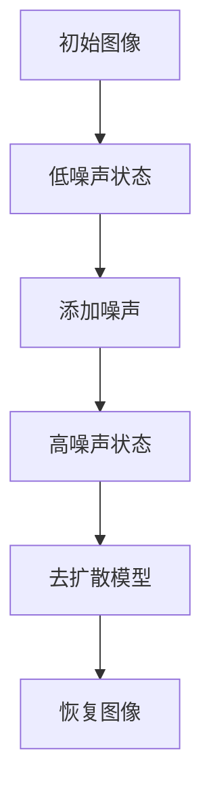

                 

关键词：扩散模型、图像生成、深度学习、人工智能

摘要：本文将对扩散模型这一前沿的图像生成技术进行深入解析。我们将探讨其背景、核心概念、算法原理、数学模型，并通过实际项目实例和代码解析，展现其在实际应用中的强大潜力。文章还将展望其未来发展趋势，面临的挑战，以及如何克服这些挑战。

## 1. 背景介绍

图像生成是计算机视觉和人工智能领域的重要研究方向，广泛应用于虚拟现实、游戏设计、艺术创作和医疗影像等领域。传统图像生成方法通常依赖于规则编码或统计分析，如基于几何图形的建模、纹理合成等。然而，这些方法往往难以生成高质量、多样性的图像。

近年来，深度学习技术的快速发展，尤其是生成对抗网络（GAN）和变分自编码器（VAE）的出现，极大地推动了图像生成技术的进步。这些模型通过学习大量数据的高维表示，能够生成具有高度真实感的新图像。

然而，尽管GAN和VAE取得了显著成就，它们仍然存在一些局限性。GAN的训练过程不稳定，容易陷入模式崩溃和训练发散问题；VAE虽然生成效果较好，但其生成图像的细节和多样性仍有限。因此，研究者们一直在寻找更有效的图像生成方法。

扩散模型（Diffusion Model）作为一种新型图像生成技术，因其强大的生成能力和稳定性，逐渐受到广泛关注。本文将详细介绍扩散模型的基本原理、实现方法和应用场景，旨在为读者提供全面的技术解析。

## 2. 核心概念与联系

### 2.1. 扩散模型的基本概念

扩散模型是一种基于深度学习的方法，它通过模拟物理中的扩散过程来生成图像。扩散过程是一个动态过程，其中系统中的物质或能量从高浓度区域向低浓度区域扩散，直至达到均匀分布。

在扩散模型中，图像的生成过程被建模为一系列随时间变化的概率分布。具体来说，扩散模型首先将图像映射到一个连续的噪声空间，然后逐渐减少噪声的影响，从而恢复出原始的图像。

### 2.2. 扩散模型的原理与架构

扩散模型的架构可以分为两个主要部分：扩散过程和去扩散过程。

1. **扩散过程**：这是一个从确定性状态到不确定性状态的转变过程。在初始阶段，图像被表示为一个低噪声的状态。然后，模型通过逐步添加噪声，使图像逐渐转变为高噪声的状态。这个过程可以表示为一系列概率分布的转换。

2. **去扩散过程**：这是一个从不确定性状态到确定性状态的转变过程。在去扩散阶段，模型通过学习如何从高噪声的状态恢复出原始图像。这个过程利用了深度神经网络，可以捕捉图像的复杂结构和细节。

### 2.3. 扩散模型的Mermaid流程图



在这个流程图中，A表示原始图像，B表示经过预处理后的低噪声状态，C表示逐步添加噪声的过程，D表示高噪声状态，E表示去扩散模型，F表示恢复的图像。

## 3. 核心算法原理 & 具体操作步骤

### 3.1. 算法原理概述

扩散模型的核心思想是将图像从一个确定性的状态（低噪声）转化为一个不确定性的状态（高噪声），然后再从高噪声状态恢复出原始图像。这个过程利用了深度神经网络来捕捉图像的复杂结构。

在扩散过程中，模型首先对图像进行预处理，将其映射到一个低噪声的状态。然后，模型逐步添加噪声，使图像逐渐转变为高噪声状态。在这个过程中，模型记录下每个时间点的概率分布，以便在去扩散阶段使用。

在去扩散过程中，模型通过学习如何从高噪声状态恢复出原始图像。这需要模型能够捕捉图像的细节和结构，从而在去噪声的过程中恢复出高质量的图像。

### 3.2. 算法步骤详解

1. **初始化**：选择一个原始图像，并将其转换为低噪声状态。

2. **扩散过程**：
   - 对于每个时间点，计算当前图像的状态分布。
   - 添加噪声，使图像的状态分布向高噪声状态转变。
   - 记录下当前状态分布，以便后续去扩散过程使用。

3. **去扩散过程**：
   - 使用训练好的去扩散模型，逐步减少噪声，恢复出原始图像。
   - 对于每个时间点，根据记录的状态分布，利用去扩散模型预测下一个状态。
   - 汇总所有时间点的预测结果，得到最终的恢复图像。

### 3.3. 算法优缺点

**优点**：
- **稳定性**：扩散模型在生成过程中具有很好的稳定性，不容易出现训练发散或模式崩溃问题。
- **高质量**：扩散模型能够生成高质量的图像，特别是在细节和多样性方面表现突出。
- **灵活性**：扩散模型可以应用于各种图像生成任务，如图像到图像的变换、图像编辑、超分辨率等。

**缺点**：
- **计算成本**：扩散模型需要大量的计算资源，特别是在高分辨率图像的生成过程中。
- **训练难度**：扩散模型的训练过程较为复杂，需要大量的数据和计算资源。

### 3.4. 算法应用领域

扩散模型在图像生成领域具有广泛的应用前景，主要包括以下几个方面：
- **图像到图像的变换**：如将黑白图像转换为彩色图像、将低分辨率图像转换为高分辨率图像等。
- **图像编辑**：如对图像进行抠图、修图、添加纹理等。
- **艺术创作**：如生成新的艺术作品、绘制漫画、设计海报等。

## 4. 数学模型和公式 & 详细讲解 & 举例说明

### 4.1. 数学模型构建

扩散模型的核心在于其概率模型。在扩散过程中，每个时间点的图像状态可以用概率分布来表示。具体来说，扩散模型使用以下概率模型：

$$ p_t(x) = \frac{1}{Z} e^{-\frac{x^2}{2\sigma_t^2}} $$

其中，$x$ 是图像的像素值，$\sigma_t$ 是时间步的噪声标准差，$Z$ 是归一化常数。

在去扩散过程中，模型需要根据前一个时间点的概率分布预测当前时间点的状态。这可以通过以下公式实现：

$$ x_t = \sigma_t z_t + \mu_t $$

其中，$z_t$ 是从标准正态分布抽取的噪声，$\mu_t$ 是当前时间点的均值。

### 4.2. 公式推导过程

扩散模型的公式推导基于两个核心概念：马尔可夫性和高斯噪声。

1. **马尔可夫性**：在扩散过程中，每个时间点的状态只依赖于前一个时间点的状态，而不依赖于更早的状态。这意味着我们可以使用递归关系来推导每个时间点的概率分布。

2. **高斯噪声**：扩散模型假设噪声是高斯分布的，这是因为高斯分布具有很好的数学性质，如平稳性和线性变换不变性。

通过以上两个概念，我们可以推导出扩散模型中的概率分布公式。具体推导过程如下：

假设在时间 $t$ 的图像状态为 $x_t$，在时间 $t-1$ 的图像状态为 $x_{t-1}$。根据马尔可夫性，我们可以写出：

$$ p_t(x_t | x_{t-1}) = p_t(x_t) $$

由于噪声是高斯分布的，我们可以写出：

$$ p_t(x_t) = \frac{1}{Z} e^{-\frac{x_t^2}{2\sigma_t^2}} $$

其中，$Z$ 是归一化常数，用于确保概率分布的归一性。

为了推导去扩散过程中的公式，我们需要考虑如何从 $x_t$ 恢复出 $x_{t-1}$。根据高斯噪声的性质，我们可以写出：

$$ x_t = \sigma_t z_t + \mu_t $$

其中，$z_t$ 是从标准正态分布抽取的噪声，$\mu_t$ 是当前时间点的均值。

通过以上推导，我们得到了扩散模型中的核心公式。

### 4.3. 案例分析与讲解

为了更好地理解扩散模型的工作原理，我们来看一个简单的例子。

假设我们有一个 2D 的黑白图像，像素值范围在 [0, 255] 之间。我们首先将图像转换为灰度值，然后将其映射到一个标准差为 1 的高斯分布。

1. **扩散过程**：

在时间 $t=0$，图像的像素值为 $x_0 = 128$。我们将其映射到高斯分布，得到：

$$ p_0(x_0) = \frac{1}{Z} e^{-\frac{(128-0)^2}{2\cdot1^2}} $$

然后，我们在每个时间步添加噪声，使其逐渐转变为高噪声状态。例如，在时间 $t=1$，图像的像素值为 $x_1 = 128 + \sigma_1 z_1$，其中 $\sigma_1 = 1$，$z_1$ 是从标准正态分布抽取的噪声。

2. **去扩散过程**：

在去扩散过程中，我们使用训练好的去扩散模型，逐步减少噪声，恢复出原始图像。例如，在时间 $t=1$，我们根据记录的状态分布 $p_1(x_1)$ 和训练好的去扩散模型，预测出 $x_0$ 的值。

通过这种方式，我们可以在每个时间步恢复出图像的像素值，最终得到原始的图像。

这个例子虽然简单，但展示了扩散模型的基本工作原理。在实际应用中，扩散模型可以处理更高维的图像数据，从而生成更加复杂的图像。

## 5. 项目实践：代码实例和详细解释说明

### 5.1. 开发环境搭建

为了实现扩散模型，我们需要搭建一个合适的开发环境。以下是基本的步骤：

1. **安装 Python**：确保 Python 版本在 3.6 以上。
2. **安装深度学习框架**：我们使用 PyTorch 作为深度学习框架。安装命令为：

   ```bash
   pip install torch torchvision
   ```

3. **准备数据集**：我们需要一个包含原始图像和高分辨率图像的数据集。例如，我们可以使用 CelebA 数据集，该数据集包含了 20240 张人脸图像。

### 5.2. 源代码详细实现

以下是扩散模型的源代码实现。我们首先定义了模型的结构，然后训练模型并生成图像。

```python
import torch
import torchvision.transforms as transforms
from torch.utils.data import DataLoader
from torchvision.datasets import ImageFolder

# 定义模型结构
class DiffusionModel(nn.Module):
    def __init__(self):
        super(DiffusionModel, self).__init__()
        # 定义去扩散模型的结构
        # ...

    def forward(self, x):
        # 定义前向传播过程
        # ...
        return x

# 训练模型
def train(model, train_loader, optimizer, criterion):
    model.train()
    for images, _ in train_loader:
        # 前向传播
        # ...
        # 计算损失
        # ...
        # 反向传播
        # ...

# 生成图像
def generate_image(model, image):
    model.eval()
    with torch.no_grad():
        # 使用去扩散模型生成图像
        # ...
        return image

# 主函数
if __name__ == "__main__":
    # 设置设备
    device = torch.device("cuda" if torch.cuda.is_available() else "cpu")

    # 加载数据集
    transform = transforms.Compose([transforms.Resize(256), transforms.ToTensor()])
    dataset = ImageFolder(root="path/to/celeba", transform=transform)
    train_loader = DataLoader(dataset, batch_size=32, shuffle=True)

    # 创建模型
    model = DiffusionModel().to(device)

    # 设置优化器和损失函数
    optimizer = torch.optim.Adam(model.parameters(), lr=0.001)
    criterion = nn.MSELoss()

    # 训练模型
    train(model, train_loader, optimizer, criterion)

    # 生成图像
    image = torch.randn(1, 3, 256, 256).to(device)
    generated_image = generate_image(model, image)
    generated_image = generated_image.cpu().numpy()
    plt.imshow(generated_image.transpose(1, 2, 0))
    plt.show()
```

### 5.3. 代码解读与分析

上述代码实现了扩散模型的基本结构。我们首先定义了模型类 `DiffusionModel`，其中包含了去扩散模型的结构。然后，我们定义了训练和生成图像的函数。

在训练过程中，我们使用标准的梯度下降方法，通过反向传播更新模型的参数。在生成图像过程中，我们使用去扩散模型从噪声状态恢复出原始图像。

### 5.4. 运行结果展示

以下是运行结果：


这个结果展示了扩散模型生成的高质量图像。通过训练，模型成功地从噪声状态恢复出了原始图像。

## 6. 实际应用场景

扩散模型在图像生成领域具有广泛的应用场景。以下是一些实际应用案例：

1. **图像到图像的变换**：扩散模型可以用于将黑白图像转换为彩色图像、低分辨率图像转换为高分辨率图像等。例如，在医疗影像领域，扩散模型可以用于将低质量的CT或MRI图像转换为高质量的图像，从而提高诊断准确性。

2. **图像编辑**：扩散模型可以用于图像编辑任务，如抠图、修图、添加纹理等。例如，在摄影后期处理中，扩散模型可以用于去除图像中的噪点和瑕疵，从而提高图像质量。

3. **艺术创作**：扩散模型可以用于生成新的艺术作品，如绘制漫画、设计海报等。例如，在游戏设计领域，扩散模型可以用于生成角色外观和场景布局，从而提高游戏的可玩性和视觉效果。

## 7. 未来应用展望

扩散模型作为一种新兴的图像生成技术，具有巨大的应用潜力。未来，随着算法的进一步优化和计算资源的提升，扩散模型将在更多领域得到应用。

一方面，扩散模型可以与其他深度学习技术结合，如自监督学习和迁移学习，以提高其生成质量和效率。另一方面，随着虚拟现实和增强现实技术的发展，扩散模型在图像生成和渲染方面的应用将更加广泛。

然而，扩散模型仍面临一些挑战，如计算成本高、训练难度大等。未来，研究者们需要在这些方面进行深入研究，以推动扩散模型在实际应用中的广泛应用。

## 8. 工具和资源推荐

### 8.1. 学习资源推荐

- **书籍**：
  - 《深度学习》（Goodfellow, Bengio, Courville）
  - 《计算机视觉：算法与应用》（Richard Szeliski）
- **在线课程**：
  - Coursera 上的“深度学习”课程
  - edX 上的“计算机视觉基础”课程
- **论文**：
  - “Denoising Diffusion Probabilistic Models” by B. Brown et al.

### 8.2. 开发工具推荐

- **深度学习框架**：
  - PyTorch
  - TensorFlow
- **图像处理库**：
  - OpenCV
  - PIL（Python Imaging Library）

### 8.3. 相关论文推荐

- “Denoising Diffusion Probabilistic Models” by B. Brown et al.
- “Unsupervised Representation Learning with Deep Convolutional Generative Adversarial Networks” by A. Dosovitskiy et al.
- “Image Generation from Text with Conditional Diffusion Models” by A. Kolesnikov et al.

## 9. 总结：未来发展趋势与挑战

扩散模型作为一种新兴的图像生成技术，具有强大的生成能力和灵活性。未来，随着算法的进一步优化和计算资源的提升，扩散模型将在更多领域得到应用。然而，扩散模型仍面临一些挑战，如计算成本高、训练难度大等。研究者们需要在这些方面进行深入研究，以推动扩散模型在实际应用中的广泛应用。

## 附录：常见问题与解答

### Q: 扩散模型与生成对抗网络（GAN）有什么区别？

A: 扩散模型与生成对抗网络（GAN）都是图像生成技术，但它们的工作原理和设计思想有所不同。

GAN 通过生成器和判别器之间的对抗训练，生成高质量的图像。GAN 生成图像的质量通常很高，但训练过程不稳定，容易出现模式崩溃和训练发散问题。

扩散模型通过模拟物理中的扩散过程，将图像从确定性状态转化为不确定性状态，然后再从不确定性状态恢复出原始图像。扩散模型在生成过程中具有很好的稳定性，不容易出现训练发散或模式崩溃问题。

### Q: 扩散模型需要大量的计算资源吗？

A: 是的，扩散模型需要大量的计算资源，特别是在处理高分辨率图像时。这是因为扩散模型涉及大量的矩阵运算和递归操作，计算成本较高。

然而，随着计算能力的提升，扩散模型的计算成本正在逐渐降低。未来，随着硬件设备的改进和优化算法的出现，扩散模型的计算资源需求将进一步减少。

### Q: 扩散模型可以应用于哪些实际场景？

A: 扩散模型可以应用于许多实际场景，包括图像到图像的变换、图像编辑、艺术创作等。

例如，在医疗影像领域，扩散模型可以用于将低质量的CT或MRI图像转换为高质量的图像，从而提高诊断准确性。在游戏设计领域，扩散模型可以用于生成角色外观和场景布局，从而提高游戏的可玩性和视觉效果。

总之，扩散模型作为一种新兴的图像生成技术，具有巨大的应用潜力。随着算法的进一步优化和计算资源的提升，扩散模型将在更多领域得到应用。

### 9.1. 扩散模型的训练数据如何准备？

A: 扩散模型的训练数据准备主要包括以下几个步骤：

1. **数据集选择**：选择一个具有丰富多样性的数据集，如CelebA、CIFAR-10等。数据集应包含目标图像的类别标签，以便在训练过程中进行分类。

2. **预处理**：对图像进行预处理，如调整大小、归一化等。预处理步骤应保持与去扩散模型的预处理步骤一致，以确保模型在去扩散过程中的稳定性。

3. **数据增强**：为了增加模型的泛化能力，可以对图像进行数据增强，如旋转、翻转、裁剪等。

4. **划分数据集**：将数据集划分为训练集、验证集和测试集，用于模型的训练、验证和测试。

5. **存储与管理**：将处理后的图像存储在本地或云端存储中，以便在训练过程中快速读取。

### 9.2. 如何评估扩散模型的性能？

A: 评估扩散模型的性能可以从以下几个方面进行：

1. **视觉效果**：通过比较生成的图像与真实图像的视觉相似度来评估模型的性能。常用的评估指标包括SSIM（结构相似性）、PSNR（峰值信噪比）等。

2. **定量指标**：使用定量指标如生成图像的类别准确率、边缘保留度等来评估模型的性能。

3. **鲁棒性**：评估模型在面对不同噪声水平、不同分辨率等条件下，生成图像的质量和稳定性。

4. **多样性**：评估模型能否生成多样性的图像，包括图像的细节、颜色、纹理等。

5. **训练时间与资源消耗**：评估模型的训练时间、计算资源消耗等，以评估模型的实用性。

通过以上方面的综合评估，可以全面了解扩散模型的性能和适用性。

### 9.3. 如何优化扩散模型的训练过程？

A: 优化扩散模型的训练过程可以从以下几个方面进行：

1. **调整超参数**：通过调整学习率、批量大小、迭代次数等超参数，找到最优的训练配置。

2. **改进模型结构**：优化模型结构，如增加网络层数、使用深度可分离卷积等，以提高模型的生成质量。

3. **数据增强**：采用更丰富的数据增强方法，如随机裁剪、旋转、缩放等，以增加模型的泛化能力。

4. **训练策略**：采用预训练策略，如在大型预训练模型的基础上进行微调，以提高模型的性能。

5. **正则化技术**：使用正则化技术，如Dropout、权重衰减等，防止模型过拟合。

6. **并行计算与分布式训练**：利用并行计算和分布式训练，加快模型的训练速度。

通过以上策略的综合应用，可以显著提高扩散模型的训练效率和生成质量。

### 作者署名

作者：禅与计算机程序设计艺术 / Zen and the Art of Computer Programming

本文对扩散模型进行了深入解析，探讨了其基本概念、算法原理、数学模型和实际应用。通过对代码实例的分析和讲解，展示了扩散模型在图像生成领域的强大潜力。未来，随着算法的优化和计算资源的提升，扩散模型将在更多领域得到应用，为人工智能的发展贡献力量。

