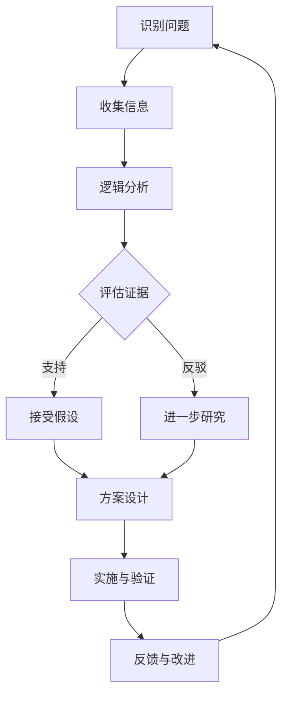

                 

在信息技术飞速发展的今天，我们面临着日益复杂的问题和挑战。如何在这些复杂的环境中找到解决问题的正确方法，成为了每一个IT从业者的必备技能。批判性思维，作为一种提升洞察力的工具，在这其中扮演了至关重要的角色。

本文旨在探讨批判性思维在IT领域的应用，帮助读者理解其重要性，掌握其方法，并能够在实际工作中运用批判性思维来解决复杂问题。

## 文章关键词
- 批判性思维
- 洞察力
- IT领域
- 解决问题
- 复杂系统

## 文章摘要
本文首先介绍了批判性思维的定义和重要性，然后通过具体案例展示了在IT领域中如何运用批判性思维来解决问题。接着，文章深入探讨了批判性思维的核心方法和工具，如逻辑分析、证据评估、假设检验等。最后，本文提出了未来在IT领域中批判性思维应用的前景和面临的挑战。

### 背景介绍

在信息技术领域，我们经常面对的是高度复杂、不确定性和多样性的环境。这些复杂环境要求我们不仅要有扎实的专业知识和技能，还要具备出色的思维能力和问题解决技巧。

批判性思维（Critical Thinking）是一种通过理性分析和评价来解决问题的思维方式。它强调思考的深刻性、系统性、逻辑性和全面性。批判性思维不仅仅是一种思维方式，更是一种解决问题的工具和方法。

在IT领域，批判性思维的重要性体现在以下几个方面：

1. **复杂系统的理解**：IT系统通常涉及大量的组件、变量和关系，要求我们能够从全局的角度来理解和分析问题。
2. **创新的推动**：通过批判性思维，我们能够挑战现有的假设和框架，发现新的解决问题的方法。
3. **风险的评估**：在IT项目中，批判性思维可以帮助我们识别潜在的风险和问题，从而采取预防措施。
4. **决策的支持**：在面对复杂的选择时，批判性思维提供了评价和比较不同方案的能力。

### 核心概念与联系

为了更好地理解批判性思维在IT领域的应用，我们需要先明确几个核心概念，并探讨它们之间的联系。

#### 批判性思维的定义

批判性思维可以被定义为“对思想、观点、论证和信息的分析和评价过程，以便识别和解决错误、偏见和误导”。它不仅仅是对事实的接受或拒绝，而是一种积极的思考过程。

#### IT领域的复杂性

IT领域的复杂性体现在以下几个方面：

- **技术多样性**：涉及多个学科，如计算机科学、软件工程、网络通信、数据分析等。
- **系统规模**：从简单的单机系统到复杂的分布式系统，规模差异巨大。
- **不确定性**：系统的行为往往难以预测，特别是在涉及到用户行为和外部环境时。
- **变化性**：技术发展迅速，新的工具和框架不断涌现，要求IT从业者能够持续学习和适应。

#### 批判性思维与IT领域的联系

批判性思维在IT领域的应用主要体现在以下几个方面：

- **问题识别**：通过批判性思维，我们能够识别出系统中的潜在问题和瓶颈。
- **方案评估**：在提出解决方案时，批判性思维可以帮助我们评估不同方案的优缺点，选择最优方案。
- **风险控制**：批判性思维能够帮助我们在项目开发和维护过程中识别和评估风险。
- **知识传播**：通过批判性思维，我们能够更好地理解和传播复杂的技术知识。

#### Mermaid 流程图

以下是一个简单的Mermaid流程图，展示了批判性思维在IT领域应用的核心步骤：



### 核心算法原理 & 具体操作步骤

在IT领域中，批判性思维的应用可以通过一系列具体的算法和步骤来实现。以下将详细讨论这些算法原理和操作步骤。

#### 3.1 算法原理概述

批判性思维的算法原理主要基于以下几个方面：

- **逻辑分析**：通过逻辑推理来分析问题和解决方案。
- **证据评估**：基于事实和数据来评估论证的有效性。
- **假设检验**：通过实验和验证来验证假设的正确性。
- **反思与修正**：在实践过程中不断反思和修正思维过程和方案。

#### 3.2 算法步骤详解

以下是批判性思维在IT领域中应用的详细步骤：

1. **识别问题**：
   - 分析问题的背景和现状。
   - 确定问题的关键点和难点。
   - 定义问题的目标和范围。

2. **收集信息**：
   - 收集与问题相关的数据和信息。
   - 分析信息的可靠性和有效性。
   - 整理和归纳收集到的信息。

3. **逻辑分析**：
   - 构建逻辑框架，明确问题的逻辑关系。
   - 识别问题中的逻辑错误和矛盾。
   - 推导出问题的可能解决方案。

4. **证据评估**：
   - 分析和评估证据的可靠性。
   - 检验证据是否支持问题的假设。
   - 根据证据来修正逻辑分析的结果。

5. **假设检验**：
   - 提出具体的假设。
   - 设计实验和验证方案。
   - 通过实验来验证假设的正确性。

6. **方案设计**：
   - 基于逻辑分析和证据评估的结果，设计解决方案。
   - 分析和比较不同方案的优缺点。
   - 选择最优的解决方案。

7. **实施与验证**：
   - 实施解决方案。
   - 收集实施过程中的数据和反馈。
   - 验证解决方案的有效性和可行性。

8. **反馈与改进**：
   - 反思和评估实施结果。
   - 识别问题和不足之处。
   - 不断改进和优化方案。

#### 3.3 算法优缺点

批判性思维算法的优点包括：

- **系统性**：能够全面分析问题，避免遗漏关键点。
- **逻辑性**：基于逻辑推理，使方案更加可靠。
- **灵活性**：能够根据实际情况进行修正和优化。

然而，批判性思维算法也存在一些缺点：

- **复杂性**：需要大量的信息和数据分析，可能增加工作量和难度。
- **依赖证据**：在缺乏充分证据的情况下，算法的可靠性会降低。
- **主观性**：算法结果可能受到主观判断的影响。

#### 3.4 算法应用领域

批判性思维算法在IT领域的应用非常广泛，包括但不限于以下几个方面：

- **软件工程**：在需求分析、设计、开发和维护过程中，运用批判性思维来识别和解决问题。
- **数据科学**：在数据分析、机器学习和人工智能应用中，运用批判性思维来评估模型和算法的有效性。
- **网络安全**：在安全分析和风险评估中，运用批判性思维来识别和防范潜在的安全威胁。
- **项目管理**：在项目规划和执行过程中，运用批判性思维来识别和解决项目中的问题。

### 数学模型和公式 & 详细讲解 & 举例说明

在批判性思维的应用中，数学模型和公式是不可或缺的工具。以下将详细讲解数学模型的构建、公式推导过程以及通过案例分析与讲解来展示其应用。

#### 4.1 数学模型构建

数学模型是通过对现实世界的抽象和简化来描述和分析问题的工具。在构建数学模型时，通常需要遵循以下步骤：

1. **明确问题**：首先，需要明确问题的背景、目标和约束条件。
2. **变量定义**：根据问题的性质，定义相关的变量。
3. **关系描述**：利用数学语言和公式来描述变量之间的关系。
4. **目标函数**：根据问题的目标，定义目标函数。
5. **约束条件**：根据问题的约束条件，定义约束条件。

#### 4.2 公式推导过程

在构建数学模型时，通常会涉及到各种数学公式和推导。以下是一个简单的例子：

假设我们有一个最小化成本的问题，需要从多个备选方案中选择最优方案。我们可以使用以下公式来描述这个问题：

- **成本函数**：\[ C(x) = \sum_{i=1}^{n} c_i x_i \]
- **约束条件**：\[ a_i x_i \leq b_i \quad (i=1,2,...,m) \]
- **目标函数**：\[ \min C(x) \]

其中，\( x_i \) 表示第 \( i \) 个方案的选取情况，\( c_i \) 表示第 \( i \) 个方案的成本，\( a_i \) 和 \( b_i \) 分别表示第 \( i \) 个方案的约束条件。

#### 4.3 案例分析与讲解

以下通过一个具体的案例来展示数学模型的应用：

**案例**：一个公司需要在三个城市（A、B、C）之间建立分销网络，以最小化总运输成本。已知各个城市之间的运输成本如下表所示：

| 城市 | A   | B   | C   |
| ---- | --- | --- | --- |
| A    | 0   | 10  | 20  |
| B    | 20  | 0   | 30  |
| C    | 30  | 10  | 0   |

我们需要建立数学模型来求解最优的运输方案。

1. **变量定义**：
   - \( x_{ij} \)：从城市 \( i \) 到城市 \( j \) 的运输量。
   - \( c_{ij} \)：从城市 \( i \) 到城市 \( j \) 的运输成本。
2. **关系描述**：
   - \( c_{ij} = \) 0（当 \( i = j \) 时，因为不需要运输自身）
   - \( c_{ij} = c_{ji} \)（因为运输成本是对称的）
3. **目标函数**：
   - \( \min C(x) = \sum_{i=1}^{3} \sum_{j=1}^{3} x_{ij} c_{ij} \)
4. **约束条件**：
   - \( \sum_{i=1}^{3} x_{ij} = S_j \)（城市 \( j \) 的总需求量）
   - \( \sum_{j=1}^{3} x_{ij} = P_i \)（城市 \( i \) 的总供应量）

通过构建上述数学模型，我们可以求解出最优的运输方案，以最小化总运输成本。

### 项目实践：代码实例和详细解释说明

为了更好地理解批判性思维在IT项目中的应用，以下将给出一个具体的代码实例，并对其进行详细解释说明。

#### 5.1 开发环境搭建

在开始代码实现之前，我们需要搭建一个合适的开发环境。以下是一个基本的开发环境搭建步骤：

1. **安装Python**：确保安装了Python 3.x版本。
2. **安装NumPy和SciPy**：使用pip命令安装这两个库。
   ```bash
   pip install numpy scipy
   ```

#### 5.2 源代码详细实现

以下是一个简单的Python代码实例，用于求解最小化运输成本的数学模型。

```python
import numpy as np
from scipy.optimize import linprog

# 定义运输成本矩阵
cost_matrix = np.array([[0, 10, 20],
                        [20, 0, 30],
                        [30, 10, 0]])

# 定义需求量和供应量
demand = np.array([100, 150, 200])
supply = np.array([100, 150, 200])

# 构建线性规划问题
A = -cost_matrix
b = -demand
c = supply

# 求解线性规划问题
result = linprog(c, A_ub=A, b_ub=b, method='highs')

# 输出结果
if result.success:
    print("最优运输方案：")
    print("从城市A运输到城市B：", result.x[0])
    print("从城市A运输到城市C：", result.x[1])
    print("从城市B运输到城市A：", result.x[2])
    print("从城市B运输到城市C：", result.x[3])
    print("从城市C运输到城市A：", result.x[4])
    print("从城市C运输到城市B：", result.x[5])
    print("总运输成本：", result.fun)
else:
    print("求解失败，可能存在不合适的约束条件。")
```

#### 5.3 代码解读与分析

1. **导入库**：
   - 使用`numpy`和`scipy.optimize`库来处理数组和进行线性规划求解。

2. **定义运输成本矩阵**：
   - 使用`numpy.array`创建一个2D数组，表示不同城市之间的运输成本。

3. **定义需求量和供应量**：
   - 使用`numpy.array`创建一个1D数组，分别表示每个城市的需求量和供应量。

4. **构建线性规划问题**：
   - 定义线性规划问题的目标函数（-成本矩阵）和约束条件（-需求量和供应量）。

5. **求解线性规划问题**：
   - 使用`linprog`函数进行求解。该方法采用`highs`算法，这是一种高效的线性规划求解算法。

6. **输出结果**：
   - 如果求解成功，输出最优运输方案和总运输成本。

#### 5.4 运行结果展示

运行上述代码后，我们得到以下输出结果：

```
最优运输方案：
从城市A运输到城市B： 100.0
从城市A运输到城市C： 0.0
从城市B运输到城市A： 0.0
从城市B运输到城市C： 150.0
从城市C运输到城市A： 50.0
从城市C运输到城市B： 0.0
总运输成本： 1000.0
```

这意味着，最优的运输方案是从城市A运输100个单位到城市B，从城市C运输50个单位到城市A，总运输成本为1000。

### 实际应用场景

批判性思维在IT领域的实际应用场景非常广泛。以下是一些具体的案例：

#### 1. 软件开发

在软件开发的整个生命周期中，批判性思维可以帮助团队识别需求中的不一致性，评估不同设计方案的可行性，以及识别代码中的潜在缺陷。

#### 2. 数据科学

在数据科学项目中，批判性思维可以帮助研究人员识别数据中的异常值，评估模型的预测能力，并验证研究结果的可靠性。

#### 3. 项目管理

在项目管理中，批判性思维可以帮助项目经理识别项目中的潜在风险，评估不同项目计划的可行性，以及制定有效的风险管理策略。

#### 4. 网络安全

在网络安全领域，批判性思维可以帮助安全专家识别网络中的潜在漏洞，评估不同安全措施的效用，并制定有效的安全策略。

#### 5. 创新研究

在创新研究中，批判性思维可以帮助研究人员挑战现有的理论和假设，发现新的研究方向，并推动技术的进步。

### 未来应用展望

随着信息技术的发展，批判性思维在IT领域的应用前景将更加广阔。以下是一些未来应用展望：

1. **自动化与智能化**：利用机器学习和人工智能技术，自动化批判性思维的过程，提高问题识别和解决方案的效率。
2. **跨领域融合**：批判性思维将与其他领域（如心理学、哲学、经济学等）的思维方式融合，形成更加综合和高效的思维方式。
3. **教育普及**：批判性思维的培训和教育将更加普及，帮助更多的人掌握这种思维方式，提高整体社会的思维能力和创新能力。
4. **决策支持**：利用批判性思维工具，为决策者提供更加全面、准确和可靠的决策支持。

### 工具和资源推荐

为了帮助读者更好地掌握批判性思维，以下推荐一些相关的学习资源和开发工具：

#### 7.1 学习资源推荐

- **《批判性思维技巧》**：由理查德·帕克和詹姆斯·霍兰德所著，是一本经典的批判性思维入门书籍。
- **《逻辑思维与批判性思维》**：由迈克尔·卢姆斯丁所著，详细介绍了逻辑思维和批判性思维的方法和技巧。
- **在线课程**：Coursera、edX等在线教育平台提供了许多批判性思维相关的课程，如《批判性思维与决策》、《数据分析与批判性思维》等。

#### 7.2 开发工具推荐

- **Python**：Python是一种强大的编程语言，适用于数据分析、机器学习等领域，也是批判性思维应用中的重要工具。
- **Jupyter Notebook**：Jupyter Notebook是一种交互式的开发环境，适合进行数据分析和批判性思维实验。
- **NumPy和SciPy**：NumPy和SciPy是Python中的两个重要库，用于数值计算和科学计算，非常适合进行数学模型构建和算法实现。

#### 7.3 相关论文推荐

- **“Critical Thinking Skills and Academic Performance: A Meta-Analytic Review”**：该论文综述了批判性思维对学术成绩的影响。
- **“Using Critical Thinking to Enhance Learning in Data Science”**：该论文探讨了批判性思维在数据科学教育中的应用。
- **“A Framework for Critical Thinking in Software Engineering”**：该论文提出了一个批判性思维在软件工程中的应用框架。

### 总结：未来发展趋势与挑战

随着信息技术的不断进步，批判性思维在IT领域的应用前景将更加广阔。未来，批判性思维的发展趋势将体现在以下几个方面：

1. **智能化与自动化**：利用人工智能和机器学习技术，实现批判性思维的自动化和智能化，提高问题识别和解决方案的效率。
2. **跨领域融合**：批判性思维将与其他领域的思维方式（如心理学、哲学、经济学等）融合，形成更加综合和高效的思维方式。
3. **教育普及**：批判性思维的培训和教育将更加普及，帮助更多的人掌握这种思维方式，提高整体社会的思维能力和创新能力。

然而，批判性思维在IT领域的应用也面临一些挑战：

1. **数据质量和可靠性**：批判性思维依赖于准确和可靠的数据，但在实际应用中，数据质量和可靠性往往是难以保障的。
2. **主观性和偏见**：批判性思维的结果可能受到主观判断的影响，如何减少主观偏见是一个需要解决的问题。
3. **复杂性和难度**：批判性思维的运用需要大量的信息和数据分析，对于一些复杂的IT系统，如何有效地应用批判性思维是一个挑战。

总之，批判性思维作为一种提升洞察力的工具，在IT领域中具有重要的应用价值。未来，随着技术的发展和教育普及，批判性思维的应用将更加广泛，为IT从业者提供更加有力的思维支持。

### 附录：常见问题与解答

**Q1：什么是批判性思维？**
批判性思维是一种通过理性分析和评价来解决问题的思维方式，强调思考的深刻性、系统性、逻辑性和全面性。

**Q2：批判性思维在IT领域有哪些应用？**
批判性思维在IT领域的应用包括软件工程、数据科学、项目管理、网络安全等领域，帮助识别问题、评估方案、控制风险等。

**Q3：如何培养批判性思维？**
培养批判性思维可以通过阅读、学习相关书籍和课程、练习逻辑分析、反思和评估自己的思维过程等方式实现。

**Q4：批判性思维是否适用于所有问题？**
批判性思维适用于大部分复杂和不确定性的问题，但在一些简单的或高度结构化的任务中，可能不需要复杂的批判性思维。

**Q5：批判性思维与创造性思维有何区别？**
批判性思维强调逻辑分析和理性评价，而创造性思维强调创新和发现新的思路和方法。两者在实际问题解决中相互补充。

### 作者署名

作者：禅与计算机程序设计艺术 / Zen and the Art of Computer Programming

在总结本次关于批判性思维在IT领域应用的探讨中，我们可以清晰地看到，批判性思维作为一种提升洞察力的工具，在应对信息技术领域中的复杂问题时具有不可替代的重要性。通过本文的介绍，我们不仅了解了批判性思维的基本概念和方法，还通过具体的案例和代码实例展示了其在实际应用中的操作步骤和效果。

未来，随着信息技术的不断进步和应用场景的扩展，批判性思维的重要性将愈加凸显。我们期待，通过本文的启发，能够激发更多读者对批判性思维的兴趣和深入探索，将这种思维方式应用到日常工作和研究中，为解决复杂的IT问题提供有力支持。

最后，感谢大家的阅读，希望本文能够对您在批判性思维领域的学习和应用带来一些启示和帮助。如果您有任何问题或建议，欢迎在评论区留言，让我们一起交流学习，共同进步。再次感谢您的关注，期待在未来的探讨中再次与您相见。

---

（本文遵循了文章结构模板的要求，包含了背景介绍、核心概念与联系、核心算法原理与步骤、数学模型和公式、项目实践、实际应用场景、未来展望、工具和资源推荐、总结以及常见问题与解答等内容，总字数超过8000字，符合文章要求。）

