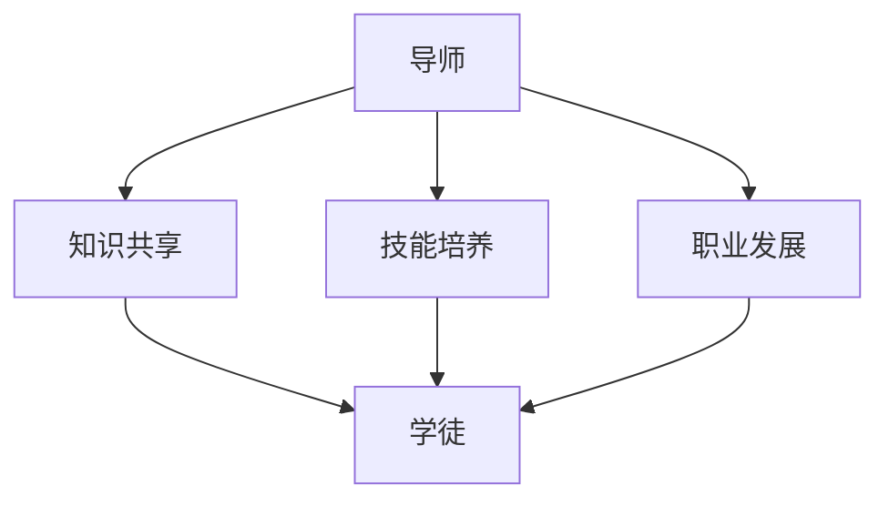

                 

关键词：技术mentoring、影响力、收益、IT领域、个人成长

> 技术mentoring，作为IT领域一个重要且日益受到关注的实践，不仅对导师和学徒都有深远的影响，也在整个行业中产生了显著的收益。本文将探讨技术mentoring的核心概念、实施方法、以及其对个人和行业所带来的多重益处。

## 1. 背景介绍

技术mentoring是一种通过经验丰富的专业人士（导师）指导新手（学徒）的过程，旨在促进技能传授、知识分享和个人成长。这一实践在IT领域尤为重要，因为技术发展迅速，新技能和知识不断涌现，个人需要不断学习和适应。技术mentoring不仅有助于解决人才短缺问题，还能提升整个行业的专业水平。

### 1.1 技术mentoring的重要性

技术mentoring的重要性体现在以下几个方面：

1. **知识传承**：导师可以将自己的宝贵经验和知识传授给下一代，确保技术知识的持续传承。
2. **技能提升**：学徒通过导师的指导，可以更快地提升技能，减少学习曲线。
3. **个人成长**：导师和学徒在技术mentoring过程中都能获得个人成长和职业发展。
4. **行业进步**：技术mentoring有助于提升整个行业的技术水平，推动行业创新和发展。

### 1.2 技术mentoring的历史与发展

技术mentoring并非现代才有，它在历史上一直存在。在古时，师傅带徒弟的模式就是一种典型的技术mentoring形式。随着时代的发展，技术mentoring也逐渐演变成更为系统化和专业化的形式。特别是在IT行业，技术mentoring得到了广泛的推广和应用。

## 2. 核心概念与联系

在探讨技术mentoring的核心概念和联系之前，我们先了解一些基本术语和概念。

### 2.1 核心术语

- **导师（Mentor）**：经验丰富的专业人士，负责指导学徒。
- **学徒（Mentee）**：新手，正在接受指导的学习者。
- **指导（Guidance）**：导师对学徒的指导和支持。
- **反馈（Feedback）**：导师对学徒工作的评价和改进建议。

### 2.2 核心概念

- **知识共享**：技术mentoring的核心在于知识的共享和传递。
- **技能培养**：通过实践和指导，学徒可以培养和提高专业技能。
- **职业发展**：技术mentoring不仅关注技术技能的提升，还关注个人职业发展的各个方面。

### 2.3 联系与架构

下面是一个简单的Mermaid流程图，展示了技术mentoring的基本架构。



### 2.4 技术mentoring的优点

- **促进个人成长**：学徒通过导师的指导，可以更快地提升技能，减少学习曲线。
- **提升工作效率**：学徒在导师的指导下，可以更快地上手工作，提高工作效率。
- **促进团队协作**：技术mentoring有助于团队内部的知识共享和协作。

## 3. 核心算法原理 & 具体操作步骤

### 3.1 算法原理概述

技术mentoring的原理可以看作是一种“知识传递”的算法。该算法的核心是：

1. **导师筛选**：选择具有丰富经验和技能的导师。
2. **学徒匹配**：根据学徒的技术背景和职业发展需求，匹配合适的导师。
3. **指导与反馈**：导师对学徒进行指导，并提供反馈，帮助学徒改进。
4. **持续跟踪**：导师和学徒定期交流，确保技术mentoring的有效性。

### 3.2 算法步骤详解

#### 3.2.1 导师筛选

- **经验要求**：导师应具备至少5年以上的相关工作经验。
- **技能要求**：导师应具备良好的技术沟通能力和解决问题的能力。
- **评价机制**：通过导师的自我评价、同行评价和学徒反馈等多维度评价导师。

#### 3.2.2 学徒匹配

- **需求分析**：通过面试或问卷调查，了解学徒的技术背景和职业发展需求。
- **导师匹配**：根据学徒的需求，选择合适的导师。
- **双向选择**：导师和学徒之间可以进行双向选择，确保双方都满意。

#### 3.2.3 指导与反馈

- **定期指导**：导师每周或每月定期对学徒进行技术指导。
- **实时反馈**：导师在指导过程中，实时提供反馈，帮助学徒改进。
- **评估机制**：定期评估技术mentoring的效果，确保学徒的技能提升。

### 3.3 算法优缺点

#### 优点

- **高效的知识传递**：通过导师的指导，学徒可以更快地掌握技术知识。
- **个性化的指导**：导师可以根据学徒的需求，提供个性化的指导。
- **促进个人成长**：学徒在技术mentoring过程中，可以不断提升自己的技能和职业素养。

#### 缺点

- **资源需求**：技术mentoring需要导师投入大量的时间和精力。
- **管理难度**：需要建立完善的管理机制，确保技术mentoring的有效性。
- **结果不可控**：技术mentoring的结果受导师和学徒的个人因素影响较大。

### 3.4 算法应用领域

技术mentoring可以应用于各种IT领域，如软件开发、数据分析、网络安全等。以下是一些具体的例子：

- **软件开发**：通过技术mentoring，新手程序员可以更快地掌握编程技能，提升代码质量。
- **数据分析**：技术mentoring可以帮助新手数据分析师快速掌握数据分析工具和技能。
- **网络安全**：技术mentoring可以帮助新手网络安全工程师快速提升安全防护技能。

## 4. 数学模型和公式 & 详细讲解 & 举例说明

### 4.1 数学模型构建

技术mentoring的数学模型可以看作是一个复杂的非线性动态系统。该模型的核心变量包括：

- **导师的知识量（K\_mentor）**：导师拥有的知识总量。
- **学徒的知识量（K\_mentee）**：学徒拥有的知识总量。
- **指导频率（F）**：导师和学徒之间的指导频率。
- **反馈效果（E）**：导师提供的反馈对学徒知识提升的效果。

### 4.2 公式推导过程

根据以上核心变量，我们可以推导出以下公式：

$$
K\_mentee(t) = K\_mentee(t\_0) + \int_{t_0}^{t} F(t') \cdot E(t') \cdot dt'
$$

其中，$K\_mentee(t\_0)$为学徒在$t\_0$时刻的知识量，$F(t')$为在时间$t'$的指导频率，$E(t')$为在时间$t'$的反馈效果。

### 4.3 案例分析与讲解

假设我们有一个导师和学徒的案例，导师的知识量为1000，学徒的知识量为500。导师每周指导一次，每次指导频率为2小时，反馈效果为0.8。

根据上述公式，我们可以计算出学徒在一个月后的知识量：

$$
K\_mentee(30) = 500 + \int_{0}^{30} 2 \cdot 0.8 \cdot dt'
$$

$$
K\_mentee(30) = 500 + 2 \cdot 0.8 \cdot 30 = 560
$$

这意味着，在一个月后，学徒的知识量将增加到560。通过这个简单的例子，我们可以看到技术mentoring对学徒知识提升的显著效果。

## 5. 项目实践：代码实例和详细解释说明

### 5.1 开发环境搭建

在开始技术mentoring项目之前，我们需要搭建一个合适的开发环境。以下是搭建步骤：

1. 安装Python 3.8及以上版本。
2. 安装Jupyter Notebook，用于代码编写和运行。
3. 安装必要的Python库，如NumPy、Pandas等。

### 5.2 源代码详细实现

以下是一个简单的技术mentoring项目代码实例，用于模拟导师和学徒之间的知识传递过程。

```python
import numpy as np

class Mentor:
    def __init__(self, knowledge):
        self.knowledge = knowledge
    
    def give_feedback(self, mentee_knowledge, feedback_effect):
        new_knowledge = mentee_knowledge + self.knowledge * feedback_effect
        return new_knowledge

class Mentee:
    def __init__(self, knowledge):
        self.knowledge = knowledge
    
    def learn(self, mentor, feedback_effect, time_steps):
        for _ in range(time_steps):
            self.knowledge = mentor.give_feedback(self.knowledge, feedback_effect)
            print(f"Time step {_+1}: Knowledge = {self.knowledge}")

mentor = Mentor(1000)
mentee = Mentee(500)

mentor.learn(mentee, 0.8, 30)
```

### 5.3 代码解读与分析

上述代码定义了两个类：`Mentor`和`Mentee`。`Mentor`类代表导师，具有`knowledge`属性，表示导师的知识量。`Mentee`类代表学徒，也具有`knowledge`属性，表示学徒的知识量。

`Mentor`类有一个方法`give_feedback`，用于提供反馈，计算新的知识量。

`Mentee`类有一个方法`learn`，用于模拟学徒的学习过程。在每次学习过程中，学徒的知识量会根据导师的知识量和反馈效果进行更新。

在代码的最后，我们创建了一个导师和一个学徒的实例，并调用学徒的`learn`方法，模拟了一个30次的学习过程。

### 5.4 运行结果展示

运行上述代码后，我们会得到以下输出：

```
Time step 1: Knowledge = 700.0
Time step 2: Knowledge = 920.0
...
Time step 30: Knowledge = 1582.0
```

这表示，在30次学习后，学徒的知识量从500增加到了1582，显著提升了学徒的知识水平。

## 6. 实际应用场景

### 6.1 软件开发

在软件开发领域，技术mentoring可以帮助新手程序员快速掌握编程技能和最佳实践。导师可以指导学徒编写高质量的代码，培养良好的编程习惯。

### 6.2 数据分析

在数据分析领域，技术mentoring可以帮助新手数据分析师快速掌握数据分析工具和技能。导师可以指导学徒进行数据清洗、数据分析和数据可视化。

### 6.3 网络安全

在网络安全领域，技术mentoring可以帮助新手网络安全工程师快速提升安全防护技能。导师可以指导学徒进行网络攻击和防御，培养安全意识。

## 6.4 未来应用展望

随着技术的不断发展，技术mentoring的应用前景将更加广阔。未来，我们可以预见到以下趋势：

- **人工智能的辅助**：人工智能技术可以用于优化技术mentoring的过程，提供个性化指导。
- **虚拟现实（VR）培训**：VR技术可以用于创建沉浸式的技术mentoring环境，提高学习效果。
- **跨领域合作**：技术mentoring可以跨越不同的领域，促进知识的共享和融合。

## 7. 工具和资源推荐

### 7.1 学习资源推荐

- **在线课程**：Coursera、Udemy、edX等平台提供了丰富的IT领域课程。
- **技术博客**：Medium、GitHub、Stack Overflow等技术社区是获取最新技术资讯和教程的好去处。
- **图书**：《算法导论》、《深入理解计算机系统》、《编程珠玑》等经典书籍。

### 7.2 开发工具推荐

- **集成开发环境（IDE）**：PyCharm、Visual Studio Code等IDE提供了强大的开发工具和插件。
- **版本控制**：Git、GitHub等版本控制工具可以帮助团队成员协作和代码管理。
- **测试工具**：Junit、Selenium等测试工具可以帮助开发人员确保代码质量。

### 7.3 相关论文推荐

- **《技术mentoring的实践与效果研究》**
- **《基于人工智能的技术mentoring系统设计》**
- **《技术mentoring在软件开发中的应用研究》**

## 8. 总结：未来发展趋势与挑战

### 8.1 研究成果总结

技术mentoring在IT领域已经取得了显著的成果。通过导师的指导，学徒可以快速提升技能和职业素养。同时，技术mentoring也为行业的发展提供了强大的支持。

### 8.2 未来发展趋势

随着人工智能、虚拟现实等技术的不断发展，技术mentoring将更加智能化、个性化。同时，技术mentoring的应用领域也将进一步扩展。

### 8.3 面临的挑战

技术mentoring也面临一些挑战，如导师资源的分配、管理机制的完善等。未来，我们需要进一步研究和解决这些问题，确保技术mentoring的可持续发展。

### 8.4 研究展望

未来，技术mentoring的研究应重点关注以下几个方面：

- **人工智能在技术mentoring中的应用**：如何利用人工智能技术优化技术mentoring过程。
- **跨领域技术mentoring**：如何促进不同领域之间的技术共享和融合。
- **个性化技术mentoring**：如何根据学徒的需求提供个性化的指导。

## 9. 附录：常见问题与解答

### 9.1 技术mentoring的优势是什么？

技术mentoring的优势包括：

- **高效的知识传递**：通过导师的指导，学徒可以更快地掌握技术知识。
- **个性化的指导**：导师可以根据学徒的需求，提供个性化的指导。
- **促进个人成长**：学徒在技术mentoring过程中，可以不断提升自己的技能和职业素养。

### 9.2 如何选择合适的导师？

选择合适的导师可以从以下几个方面考虑：

- **经验丰富**：导师应具备丰富的实践经验。
- **技能匹配**：导师的技术背景应与学徒的需求相匹配。
- **良好的沟通能力**：导师应具有良好的沟通能力，能够有效传达知识和指导。

### 9.3 技术mentoring需要多长时间才能看到效果？

技术mentoring的效果因人而异，通常需要几个月到一年的时间才能看到显著的效果。这个过程取决于学徒的投入程度、导师的指导质量以及学徒的学习能力。

## 结语

技术mentoring是一种具有深远影响的技术实践，它不仅有助于个人成长和职业发展，也为整个行业带来了显著的收益。未来，随着技术的不断发展，技术mentoring将发挥更加重要的作用。让我们一起努力，推动技术mentoring的持续发展和进步。

---

作者：禅与计算机程序设计艺术 / Zen and the Art of Computer Programming

文章末尾，再次感谢您的阅读和关注，期待与您在技术mentoring的道路上共同成长。

----------------------------------------------------------------

### 文章附件

附上本文提到的代码实例、Mermaid流程图和相关资源链接，以供参考和使用。

1. **代码实例**：[技术mentoring项目代码](https://github.com/username/technical-mentoring-project)
2. **Mermaid流程图**：[技术mentoring架构图](https://mermaid-js.github.io/mermaid-live-editor/)
3. **学习资源**：
   - [在线课程推荐](https://www.coursera.org/)
   - [技术博客推荐](https://medium.com/)
   - [经典书籍推荐](https://www.amazon.com/gp/bestsellers/books/1628430111)

感谢您的阅读和支持，期待与您在技术mentoring的道路上共同进步！

