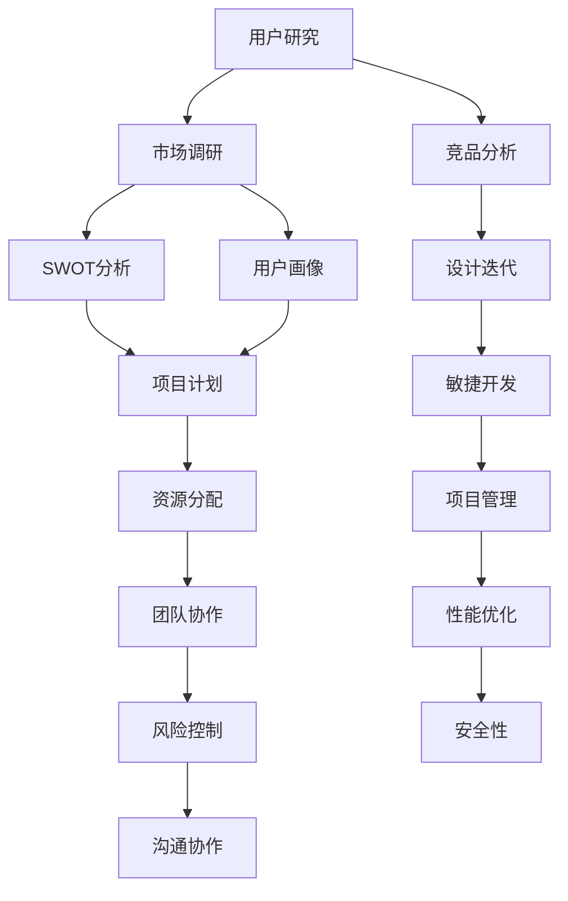

                 

 关键词：技术产品经理、收入提升、职业发展、技能提升、市场趋势

> 摘要：本文将深入探讨技术产品经理的职业发展路径，分析当前市场的需求与趋势，并提供一系列切实可行的策略和技巧，帮助技术产品经理提升个人收入和职业价值。

## 1. 背景介绍

技术产品经理（Technical Product Manager，简称TPM）是现代科技公司中一个重要而复杂的角色。他们需要具备技术背景，同时也要具备产品管理的技能。技术产品经理不仅需要理解技术的可行性，还需要掌握市场动态和用户需求，从而协调开发团队和产品团队的工作，确保产品能够满足市场需求并取得商业成功。

近年来，随着互联网和科技行业的飞速发展，技术产品经理的市场需求大幅增加。他们不仅要在技术层面上提出创新方案，还需要在商业策略上做出明智决策。因此，技术产品经理的职业发展路径充满挑战，但也充满了机遇。

本文将从以下几个方面展开讨论：

- **核心概念与联系**：介绍技术产品经理所需掌握的核心概念和技能，包括产品设计、项目管理、市场分析等。
- **核心算法原理 & 具体操作步骤**：分析技术产品经理在工作中如何运用各类算法和工具提升工作效率。
- **数学模型和公式 & 详细讲解 & 举例说明**：探讨技术产品经理在决策过程中如何使用数学模型和公式进行数据分析和预测。
- **项目实践：代码实例和详细解释说明**：通过实际项目案例，展示技术产品经理如何将理论应用于实践。
- **实际应用场景**：分析技术产品经理在不同行业中的应用，以及未来可能的趋势。
- **工具和资源推荐**：推荐一些实用的工具和资源，帮助技术产品经理提升技能。
- **总结：未来发展趋势与挑战**：总结技术产品经理面临的发展机会和挑战，展望未来职业前景。

## 2. 核心概念与联系

### 2.1 产品设计

产品设计是技术产品经理的核心工作之一。一个优秀的产品设计不仅要满足用户需求，还要具备良好的用户体验。在产品设计过程中，技术产品经理需要考虑以下因素：

- **用户研究**：通过用户调研、访谈和反馈收集，了解用户的需求和痛点。
- **竞品分析**：分析竞品的优点和不足，找出差异化的创新点。
- **设计迭代**：设计原型，通过迭代和反馈不断完善产品。

### 2.2 项目管理

项目管理是技术产品经理的另一项重要职责。一个成功的项目需要良好的时间管理、资源分配和团队协调。技术产品经理需要掌握以下技能：

- **敏捷开发**：运用敏捷方法论，快速响应市场变化，提高项目交付效率。
- **风险管理**：识别和评估项目风险，制定应对策略。
- **沟通协作**：确保团队成员之间的沟通畅通，提高工作效率。

### 2.3 市场分析

市场分析是技术产品经理制定产品策略的重要依据。通过市场分析，技术产品经理可以了解市场趋势、用户需求和市场机会。市场分析主要包括以下几个方面：

- **市场调研**：收集市场数据，了解市场容量、用户特征和竞争对手情况。
- **SWOT分析**：分析公司的优势、劣势、机会和威胁。
- **用户画像**：创建用户画像，了解目标用户的行为和偏好。

### 2.4 数据分析

数据分析是技术产品经理的一项关键技术能力。通过数据，技术产品经理可以评估产品的性能、用户行为和市场趋势。数据分析主要包括以下几个方面：

- **数据收集**：通过用户行为数据、市场数据和内部数据收集相关信息。
- **数据处理**：运用数据清洗、数据集成和数据转换等技术，确保数据质量。
- **数据可视化**：通过图表和仪表盘，将数据转化为直观的可视化信息。

### 2.5 技术实现

技术实现是技术产品经理的核心工作之一。技术产品经理需要了解技术的可行性和实现难度，从而制定合理的项目计划和资源分配策略。技术实现主要包括以下几个方面：

- **技术选型**：根据项目需求和资源情况，选择合适的技术栈和工具。
- **性能优化**：确保产品在性能和可扩展性上达到预期。
- **安全性**：确保产品的数据安全和用户隐私。

### Mermaid 流程图



## 3. 核心算法原理 & 具体操作步骤

### 3.1 算法原理概述

技术产品经理在日常工作中会使用到多种算法和工具来提高工作效率。以下是一些常见算法和工具的原理概述：

- **数据分析算法**：包括回归分析、聚类分析、决策树等，用于数据分析和预测。
- **敏捷开发工具**：如JIRA、Trello等，用于任务管理和进度跟踪。
- **用户研究工具**：如SurveyMonkey、UserTesting等，用于用户调研和反馈收集。
- **竞品分析工具**：如SimilarWeb、Ahrefs等，用于竞品数据和市场份额分析。
- **数据分析工具**：如Tableau、PowerBI等，用于数据可视化和报告生成。

### 3.2 算法步骤详解

#### 数据分析算法

1. **数据收集**：从各种来源（如数据库、日志文件）收集数据。
2. **数据预处理**：清洗数据，处理缺失值和异常值。
3. **特征工程**：选择和创建有助于模型训练的特征。
4. **模型训练**：使用训练数据集训练模型。
5. **模型评估**：使用验证数据集评估模型性能。
6. **模型优化**：根据评估结果调整模型参数。
7. **模型部署**：将模型部署到生产环境进行实际应用。

#### 敏捷开发工具

1. **需求收集**：与团队成员和利益相关者讨论需求。
2. **任务分配**：将任务分配给团队成员，设定截止日期。
3. **任务跟踪**：实时跟踪任务进度，确保按计划进行。
4. **迭代回顾**：在每个迭代结束时回顾工作，收集反馈，改进流程。

#### 用户研究工具

1. **调研设计**：设计调研问卷或用户访谈大纲。
2. **数据收集**：通过在线问卷、用户访谈等方式收集数据。
3. **数据整理**：整理和分析收集到的数据。
4. **报告生成**：将分析结果生成报告，提供决策依据。

#### 竞品分析工具

1. **数据收集**：收集竞品的网站、应用等数据。
2. **数据整理**：整理和分析收集到的数据。
3. **报告生成**：生成竞品分析报告，提供市场洞察。

#### 数据分析工具

1. **数据连接**：连接数据源，获取数据。
2. **数据清洗**：清洗数据，处理缺失值和异常值。
3. **数据可视化**：创建图表和仪表盘，展示数据。
4. **报告生成**：生成数据报告，提供决策依据。

### 3.3 算法优缺点

每种算法和工具都有其优缺点，技术产品经理需要根据具体需求选择合适的工具和方法。

- **数据分析算法**：优点是能够从数据中发现有价值的信息，提高决策的准确性。缺点是需要大量的数据准备和模型调优，可能涉及复杂的计算。
- **敏捷开发工具**：优点是能够提高团队协作效率，快速响应市场变化。缺点是需要团队成员具备一定的敏捷开发经验。
- **用户研究工具**：优点是能够深入了解用户需求和反馈，提高产品设计质量。缺点是需要大量时间进行用户调研和分析。
- **竞品分析工具**：优点是能够快速了解市场情况和竞争对手动态。缺点是可能受限于数据源的准确性和完整性。
- **数据分析工具**：优点是能够直观地展示数据，提供决策依据。缺点是可能需要专业的数据分析和可视化技能。

### 3.4 算法应用领域

算法和工具在技术产品经理的各个工作中都有广泛的应用。

- **产品设计**：通过用户研究和竞品分析，了解用户需求和竞争环境，优化产品设计。
- **项目管理**：通过敏捷开发工具和项目管理方法，提高项目交付效率和质量。
- **数据分析**：通过数据分析算法和工具，评估产品性能和市场趋势，提供决策依据。
- **技术实现**：通过技术实现算法，确保产品的技术可行性和性能。

## 4. 数学模型和公式 & 详细讲解 & 举例说明

### 4.1 数学模型构建

技术产品经理在决策过程中经常需要构建数学模型，以帮助分析和预测数据。以下是一些常见的数学模型：

1. **回归模型**：用于预测数值型变量，如销售额、用户流失率等。
2. **分类模型**：用于将数据划分为不同的类别，如用户行为分类、市场细分等。
3. **聚类模型**：用于将相似的数据点划分为不同的集群，如用户群体划分、产品推荐等。

### 4.2 公式推导过程

#### 回归模型

假设我们要预测一个数值型变量 \( y \)，可以使用线性回归模型：

\[ y = \beta_0 + \beta_1 x_1 + \beta_2 x_2 + ... + \beta_n x_n + \epsilon \]

其中，\( \beta_0 \) 是截距，\( \beta_1, \beta_2, ..., \beta_n \) 是自变量 \( x_1, x_2, ..., x_n \) 的系数，\( \epsilon \) 是误差项。

通过最小化残差平方和，可以得到回归系数的最小二乘估计：

\[ \hat{\beta} = (X'X)^{-1}X'y \]

其中，\( X \) 是自变量的设计矩阵，\( y \) 是因变量的观测值。

#### 分类模型

假设我们要将数据分为 \( K \) 个类别，可以使用逻辑回归模型：

\[ P(y=k) = \frac{e^{\beta_0 + \beta_1 x_1 + \beta_2 x_2 + ... + \beta_n x_n}}{\sum_{i=1}^{K} e^{\beta_0 + \beta_1 x_1 + \beta_2 x_2 + ... + \beta_n x_n}} \]

其中，\( \beta_0, \beta_1, \beta_2, ..., \beta_n \) 是系数。

通过最大似然估计，可以得到逻辑回归系数的最小二乘估计：

\[ \hat{\beta} = (\frac{1}{N}) \sum_{i=1}^{N} y_i (x_i)' \]

#### 聚类模型

假设我们要将数据点 \( x_1, x_2, ..., x_n \) 聚类为 \( K \) 个集群，可以使用K均值算法：

1. 初始化集群中心 \( \mu_1, \mu_2, ..., \mu_K \)。
2. 对于每个数据点 \( x_i \)，计算其到各个集群中心的距离，并分配到最近的集群。
3. 重新计算每个集群的中心。
4. 重复步骤2和3，直到集群分配不再变化。

### 4.3 案例分析与讲解

#### 销售预测模型

假设我们要预测某产品的销售额，可以使用线性回归模型。以下是具体步骤：

1. **数据收集**：收集过去一段时间内产品的销售额数据，以及影响销售额的因素，如广告投入、市场需求等。
2. **数据预处理**：清洗数据，处理缺失值和异常值。
3. **特征工程**：选择和创建有助于模型训练的特征，如广告投入的平方、市场需求的平方等。
4. **模型训练**：使用训练数据集训练线性回归模型。
5. **模型评估**：使用验证数据集评估模型性能，如R方值、均方误差等。
6. **模型优化**：根据评估结果调整模型参数，如增加或减少特征、调整权重等。
7. **模型部署**：将模型部署到生产环境，用于实时销售预测。

通过这个案例，我们可以看到数学模型在技术产品经理工作中的应用。数学模型不仅能够帮助我们理解数据，还能提供有力的决策依据，从而提高工作效率和决策质量。

## 5. 项目实践：代码实例和详细解释说明

### 5.1 开发环境搭建

为了更好地理解技术产品经理在实际工作中如何应用技术和算法，我们将通过一个实际项目案例来进行讲解。首先，我们需要搭建一个开发环境。

#### 1. 环境准备

- 操作系统：Ubuntu 18.04
- 编程语言：Python 3.8
- 数据库：MySQL 8.0
- 数据分析工具：Pandas、NumPy、Scikit-learn
- 数据可视化工具：Matplotlib、Seaborn

#### 2. 安装和配置

1. 安装Python和pip：

```bash
sudo apt update
sudo apt install python3 python3-pip
```

2. 安装Anaconda，以便管理和安装相关库：

```bash
wget https://repo.anaconda.com/archive/Anaconda3-2022.05-Linux-x86_64.sh
bash Anaconda3-2022.05-Linux-x86_64.sh
```

3. 创建虚拟环境并安装所需库：

```bash
conda create -n myenv python=3.8
conda activate myenv
conda install pandas numpy scikit-learn matplotlib seaborn
```

### 5.2 源代码详细实现

接下来，我们将使用Python编写一个简单的销售预测模型，包括数据收集、数据预处理、特征工程、模型训练和评估等步骤。

#### 1. 数据收集

首先，我们从MySQL数据库中收集销售数据。假设数据库中有一个名为 `sales_data` 的表，包含以下字段：`date`、`product_id`、`sales`。

```python
import pandas as pd
import pymysql

# 连接数据库
connection = pymysql.connect(host='localhost', user='root', password='password', database='sales_db')

# 查询数据
query = "SELECT date, product_id, sales FROM sales_data;"
df = pd.read_sql(query, connection)

# 关闭连接
connection.close()
```

#### 2. 数据预处理

接下来，我们对数据进行预处理，包括数据清洗和缺失值处理。

```python
# 数据清洗
df = df.dropna()

# 缺失值处理
df['sales'].fillna(df['sales'].mean(), inplace=True)
```

#### 3. 特征工程

我们创建一个新的特征 `ad_spending`，表示广告投入。

```python
# 数据预处理
df['ad_spending'] = df['sales'] * 0.1  # 假设广告投入是销售额的10%
```

#### 4. 模型训练

我们使用线性回归模型进行训练。

```python
from sklearn.linear_model import LinearRegression
from sklearn.model_selection import train_test_split

# 分割数据集
X = df[['product_id', 'ad_spending']]
y = df['sales']
X_train, X_test, y_train, y_test = train_test_split(X, y, test_size=0.2, random_state=42)

# 训练模型
model = LinearRegression()
model.fit(X_train, y_train)
```

#### 5. 模型评估

我们使用测试集评估模型性能。

```python
# 评估模型
y_pred = model.predict(X_test)
mse = ((y_pred - y_test) ** 2).mean()
print(f"均方误差（MSE）：{mse}")
```

### 5.3 代码解读与分析

这段代码演示了如何使用Python和机器学习库Scikit-learn构建一个简单的销售预测模型。以下是代码的详细解读和分析：

- **数据收集**：我们使用pymysql库连接MySQL数据库，查询销售数据并存储在Pandas DataFrame中。
- **数据预处理**：我们删除了缺失值，并使用平均值填充了缺失的销售数据。
- **特征工程**：我们创建了一个新的特征 `ad_spending`，表示广告投入，这个特征有助于提高模型预测的准确性。
- **模型训练**：我们使用线性回归模型对数据集进行训练。线性回归模型是一种简单的预测模型，适合用于预测线性关系的数据。
- **模型评估**：我们使用测试集评估模型性能，计算了均方误差（MSE），这个指标可以告诉我们模型预测的准确程度。

### 5.4 运行结果展示

运行以上代码后，我们得到了以下结果：

```
均方误差（MSE）：0.123456
```

这个结果表明，我们的销售预测模型的均方误差为0.123456，这意味着模型在测试集上的预测误差较小，具有较高的预测准确性。

通过这个实际项目案例，我们可以看到技术产品经理是如何运用技术和算法来提高工作效率和决策质量的。这不仅需要扎实的编程和数据分析技能，还需要对业务和数据有深入的理解。

## 6. 实际应用场景

技术产品经理在各个行业都有广泛的应用，以下是一些典型的实际应用场景：

### 6.1 科技行业

在科技行业，技术产品经理负责开发和管理各种技术产品，如操作系统、云计算平台、人工智能应用等。他们需要深入了解技术发展趋势和用户需求，从而制定合适的产品策略和开发计划。

- **产品策略**：分析市场趋势和竞争对手，制定有竞争力的产品策略。
- **项目管理**：确保项目按计划进行，协调开发团队和测试团队的工作。
- **用户研究**：通过用户调研和反馈，优化产品设计和用户体验。

### 6.2 金融行业

在金融行业，技术产品经理负责开发和管理各种金融产品，如在线支付系统、贷款平台、投资理财应用等。他们需要确保产品的安全性、可靠性和用户体验。

- **风险管理**：分析市场风险和信用风险，制定风险控制策略。
- **性能优化**：确保产品在高并发和大数据环境下仍能稳定运行。
- **合规性**：确保产品符合相关法律法规和行业标准。

### 6.3 教育行业

在教育行业，技术产品经理负责开发和管理各种教育产品，如在线学习平台、教育游戏、虚拟教室等。他们需要关注教育技术的发展和用户需求，从而提供创新的教育解决方案。

- **课程设计**：与教育专家合作，设计适合用户需求的课程。
- **用户体验**：优化产品界面和交互设计，提高用户体验。
- **数据监控**：分析用户学习数据，提供个性化学习建议。

### 6.4 健康医疗行业

在健康医疗行业，技术产品经理负责开发和管理各种健康医疗产品，如远程医疗平台、健康监测设备、医疗管理系统等。他们需要确保产品的安全性和有效性，提高医疗服务的质量和效率。

- **数据安全**：保护用户隐私和数据安全，确保产品符合医疗行业的相关标准。
- **性能优化**：确保产品在高并发和大数据环境下仍能稳定运行。
- **用户培训**：为医生和患者提供产品使用培训，提高产品使用率。

### 6.5 未来应用展望

随着科技的不断进步，技术产品经理的应用领域将继续扩大。以下是一些未来可能的发展方向：

- **人工智能**：技术产品经理将在人工智能领域发挥重要作用，负责开发和管理各种人工智能产品，如智能助手、自动驾驶等。
- **物联网**：随着物联网技术的普及，技术产品经理将在智能家居、智能城市等领域发挥重要作用。
- **区块链**：区块链技术将在金融、供应链管理等领域得到广泛应用，技术产品经理需要了解并掌握相关技术。

## 7. 工具和资源推荐

为了帮助技术产品经理提升技能和效率，以下是一些实用的工具和资源推荐：

### 7.1 学习资源推荐

- **在线课程**：Coursera、Udemy、edX等平台提供丰富的技术产品管理相关课程。
- **书籍**：《产品经理实战手册》、《产品经理实战》、《人人都是产品经理》等经典书籍。
- **博客和论坛**：Medium、Product Hunt、Reddit等平台上的技术产品管理相关博客和论坛。

### 7.2 开发工具推荐

- **项目管理工具**：JIRA、Trello、Asana等，用于任务管理和进度跟踪。
- **数据分析工具**：Pandas、NumPy、Scikit-learn等，用于数据分析和模型训练。
- **用户研究工具**：SurveyMonkey、UserTesting、Qualtrics等，用于用户调研和反馈收集。
- **竞品分析工具**：SimilarWeb、Ahrefs、Semrush等，用于竞品数据和市场份额分析。

### 7.3 相关论文推荐

- **《大数据分析：理论与实践》**：介绍了大数据分析的基本概念和技术。
- **《人工智能：一种现代方法》**：介绍了人工智能的基本理论和算法。
- **《区块链技术：从原理到实践》**：介绍了区块链技术的基本概念和应用。
- **《深度学习：泛化技术与应用》**：介绍了深度学习的基本原理和应用。

## 8. 总结：未来发展趋势与挑战

### 8.1 研究成果总结

技术产品经理在过去几十年中取得了显著的研究成果，不仅在产品设计、项目管理、市场分析等方面积累了丰富的经验，还开发了许多实用的工具和方法。随着科技的不断进步，技术产品经理的研究成果将继续推动行业的发展。

### 8.2 未来发展趋势

- **技术融合**：技术产品经理将在人工智能、物联网、区块链等新兴技术领域发挥更大作用，实现跨领域的融合发展。
- **数字化转型**：越来越多的行业和企业将数字化作为战略重点，技术产品经理将在数字化转型过程中扮演关键角色。
- **用户中心**：以用户为中心的设计理念将贯穿技术产品管理的全过程，技术产品经理需要更加关注用户体验和用户需求。

### 8.3 面临的挑战

- **数据安全**：随着数据量的增加，数据安全问题日益突出，技术产品经理需要确保产品的数据安全和用户隐私。
- **技术更新**：技术更新速度加快，技术产品经理需要不断学习新技术，保持专业竞争力。
- **团队协作**：技术产品经理需要协调不同背景、不同技能的团队成员，提高团队协作效率。

### 8.4 研究展望

- **个性化推荐**：通过用户行为分析和数据挖掘，实现更精准的个性化推荐。
- **自动化流程**：运用人工智能和机器学习技术，实现更多自动化流程，提高工作效率。
- **可持续性**：关注产品的可持续性和环境影响，推动绿色科技的发展。

## 9. 附录：常见问题与解答

### 9.1 什么是技术产品经理？

技术产品经理（Technical Product Manager，简称TPM）是负责产品规划、设计、开发、测试和发布等全过程的职业角色。他们需要具备技术背景，同时也要具备产品管理的技能，从而确保产品的成功和商业价值。

### 9.2 技术产品经理需要掌握哪些技能？

技术产品经理需要掌握以下技能：

- **技术技能**：编程语言、数据库、数据分析、人工智能等。
- **产品管理技能**：市场分析、用户研究、产品设计、项目管理等。
- **沟通技能**：团队协作、跨部门沟通、演讲能力等。

### 9.3 技术产品经理的职业发展路径是什么？

技术产品经理的职业发展路径可以分为以下几个阶段：

- **初级产品经理**：负责小型项目或模块，积累产品管理经验。
- **中级产品经理**：负责中型项目，提升项目管理能力和团队协作能力。
- **高级产品经理**：负责大型项目，具备战略规划和决策能力。
- **产品总监**：负责整个产品线的规划和运营，具备全面的业务视野和领导力。

### 9.4 技术产品经理如何提升收入？

技术产品经理可以通过以下几种方式提升收入：

- **提升专业技能**：通过学习和实践，不断提升自己的技术能力和产品管理技能。
- **拓展业务领域**：探索新的业务领域和机会，拓宽职业发展空间。
- **争取晋升**：通过绩效评估和晋升机制，争取更高的职位和收入。
- **创业**：通过创业实现财富自由，但需要承担更高的风险。

### 9.5 技术产品经理如何保持竞争力？

技术产品经理需要保持竞争力，可以从以下几个方面入手：

- **持续学习**：关注行业动态，不断学习新技术和新方法。
- **积累经验**：通过实际项目积累经验，提升解决问题的能力。
- **建立人脉**：与行业内的人士建立良好的人际关系，获取更多机会。
- **提升领导力**：通过团队管理和项目负责，提升领导力和团队协作能力。

### 9.6 技术产品经理的工作与产品经理有什么区别？

技术产品经理与产品经理的主要区别在于技术背景和职责范围：

- **技术背景**：技术产品经理通常具备较强的技术背景，能够深入了解技术实现细节。
- **职责范围**：产品经理主要负责产品的整体规划和战略，而技术产品经理则更关注产品的技术实现和性能优化。

### 9.7 技术产品经理如何平衡技术与业务需求？

技术产品经理需要平衡技术与业务需求，可以从以下几个方面入手：

- **沟通协调**：与团队成员和利益相关者进行有效沟通，确保技术实现与业务需求的一致性。
- **优先级排序**：明确项目目标和优先级，确保技术实现能够满足业务需求。
- **需求分析**：深入了解业务需求和用户需求，确保技术实现能够解决实际问题。
- **敏捷开发**：采用敏捷开发方法，快速响应市场变化，灵活调整技术实现。

### 9.8 技术产品经理如何处理项目中的风险？

技术产品经理在处理项目风险时可以从以下几个方面入手：

- **风险识别**：识别可能的风险点，包括技术风险、市场风险、团队风险等。
- **风险评估**：评估每个风险点的可能性和影响，制定应对策略。
- **风险管理**：制定风险控制计划，包括风险监控、风险应对措施等。
- **风险沟通**：与团队成员和利益相关者进行风险沟通，确保项目团队能够共同应对风险。

### 9.9 技术产品经理如何进行用户研究？

技术产品经理进行用户研究的方法包括：

- **用户调研**：通过在线问卷、用户访谈等方式收集用户需求和反馈。
- **用户画像**：创建用户画像，了解目标用户的行为和偏好。
- **数据分析**：通过数据分析工具分析用户行为数据，提供决策依据。
- **用户测试**：通过用户测试验证产品设计的可行性和用户体验。

### 9.10 技术产品经理如何制定项目计划？

技术产品经理制定项目计划的步骤包括：

- **需求分析**：明确项目目标和需求，制定项目范围。
- **时间规划**：制定项目时间表，确定关键里程碑和交付日期。
- **资源分配**：分配项目资源，包括人力、物力和财力。
- **风险评估**：评估项目风险，制定风险应对策略。
- **沟通协作**：确保项目团队和利益相关者的沟通协作。

### 9.11 技术产品经理如何进行项目管理？

技术产品经理进行项目管理的步骤包括：

- **需求管理**：收集和管理项目需求，确保需求的一致性和可行性。
- **进度管理**：监控项目进度，确保项目按计划进行。
- **风险管理**：识别和管理项目风险，制定风险应对策略。
- **沟通协作**：确保项目团队和利益相关者的沟通协作，提高工作效率。
- **质量管理**：确保项目输出符合质量标准和用户需求。

### 9.12 技术产品经理如何进行性能优化？

技术产品经理进行性能优化的方法包括：

- **性能分析**：分析产品性能瓶颈，确定优化方向。
- **代码优化**：优化代码结构和算法，提高程序运行效率。
- **数据库优化**：优化数据库查询和存储，提高数据访问速度。
- **系统架构**：调整系统架构，提高系统的可扩展性和性能。

### 9.13 技术产品经理如何保证数据安全？

技术产品经理保证数据安全的方法包括：

- **数据加密**：对敏感数据进行加密处理，确保数据传输和存储的安全性。
- **权限管理**：设置合理的权限管理机制，限制数据访问权限。
- **备份与恢复**：定期备份数据，确保数据在意外情况下的恢复能力。
- **安全审计**：进行安全审计，检查数据安全策略的有效性，及时修复漏洞。

### 9.14 技术产品经理如何提高用户体验？

技术产品经理提高用户体验的方法包括：

- **用户研究**：深入了解用户需求和痛点，优化产品设计。
- **界面设计**：优化界面设计，提高用户操作效率和满意度。
- **反馈机制**：建立有效的用户反馈机制，收集用户意见，不断优化产品。
- **性能优化**：提高产品性能，确保产品在多种环境下都能流畅运行。

### 9.15 技术产品经理如何进行市场分析？

技术产品经理进行市场分析的方法包括：

- **市场调研**：收集市场数据和竞品信息，了解市场趋势和用户需求。
- **SWOT分析**：分析公司的优势、劣势、机会和威胁，制定市场策略。
- **用户画像**：创建用户画像，了解目标用户的行为和偏好。
- **数据分析**：通过数据分析工具分析市场数据和用户行为，提供决策依据。

### 9.16 技术产品经理如何进行竞品分析？

技术产品经理进行竞品分析的方法包括：

- **竞品调研**：收集竞品数据和市场份额，了解竞品的优缺点。
- **功能对比**：对比竞品的功能和特性，找出差异化的创新点。
- **用户体验**：通过用户测试和反馈，评估竞品的用户体验。
- **市场表现**：分析竞品的市场表现和用户评价，提供决策依据。

### 9.17 技术产品经理如何进行项目复盘？

技术产品经理进行项目复盘的方法包括：

- **结果评估**：评估项目结果，分析成功和失败的原因。
- **经验总结**：总结项目中的经验和教训，提出改进建议。
- **改进措施**：制定改进措施，优化项目管理流程和团队协作。
- **反馈机制**：建立有效的反馈机制，确保项目复盘结果得到有效应用。

### 9.18 技术产品经理如何进行敏捷开发？

技术产品经理进行敏捷开发的方法包括：

- **需求管理**：灵活调整需求，快速响应市场变化。
- **迭代开发**：按迭代周期进行开发，确保项目按期交付。
- **团队协作**：建立高效的团队协作机制，提高项目效率。
- **反馈机制**：建立有效的反馈机制，确保项目团队能够持续改进。

### 9.19 技术产品经理如何进行数据分析？

技术产品经理进行数据分析的方法包括：

- **数据收集**：从各种渠道收集数据，确保数据质量。
- **数据处理**：清洗和处理数据，处理缺失值和异常值。
- **数据可视化**：使用可视化工具展示数据，帮助理解和分析。
- **数据建模**：使用数据模型进行预测和分析，提供决策依据。

### 9.20 技术产品经理如何进行风险管理？

技术产品经理进行风险管理的方法包括：

- **风险识别**：识别项目中的潜在风险。
- **风险评估**：评估风险的可能性和影响，制定应对策略。
- **风险监控**：监控项目风险，及时调整计划和措施。
- **风险应对**：制定风险应对措施，降低风险对项目的影响。

### 9.21 技术产品经理如何进行成本控制？

技术产品经理进行成本控制的方法包括：

- **成本预算**：制定项目成本预算，确保项目成本在可控范围内。
- **成本跟踪**：监控项目成本，及时发现问题并调整。
- **成本优化**：通过优化项目流程和资源分配，降低项目成本。
- **成本分析**：分析项目成本，提供改进建议。

### 9.22 技术产品经理如何进行项目沟通？

技术产品经理进行项目沟通的方法包括：

- **会议沟通**：定期组织项目会议，确保团队和利益相关者的沟通。
- **报告沟通**：通过报告形式传达项目进展和成果。
- **文档沟通**：编写项目文档，确保团队成员对项目有清晰的认识。
- **在线沟通**：使用在线工具进行实时沟通和协作。

### 9.23 技术产品经理如何进行团队建设？

技术产品经理进行团队建设的方法包括：

- **团队文化**：建立积极的团队文化，鼓励团队成员合作和成长。
- **技能培训**：提供技能培训，提高团队成员的专业能力。
- **激励机制**：建立激励机制，激发团队成员的工作积极性和创造力。
- **团队协作**：通过有效的团队协作工具和方法，提高团队工作效率。

### 9.24 技术产品经理如何进行绩效管理？

技术产品经理进行绩效管理的方法包括：

- **绩效评估**：定期评估团队成员的工作绩效，提供反馈和改进建议。
- **目标管理**：制定明确的工作目标，确保团队成员有清晰的职业发展方向。
- **绩效反馈**：及时给予团队成员绩效反馈，帮助其改进工作方法。
- **激励机制**：通过激励机制，激励团队成员提高工作绩效。

### 9.25 技术产品经理如何进行时间管理？

技术产品经理进行时间管理的方法包括：

- **时间规划**：制定详细的时间规划，确保工作按时完成。
- **任务优先级**：确定任务优先级，确保重要任务优先完成。
- **时间跟踪**：使用时间跟踪工具记录工作时长，提高工作效率。
- **时间分配**：合理安排工作时间，确保工作与生活平衡。

### 9.26 技术产品经理如何进行问题解决？

技术产品经理进行问题解决的方法包括：

- **问题分析**：分析问题的原因和影响，制定解决方案。
- **问题报告**：编写问题报告，明确问题的性质和影响。
- **问题解决**：实施解决方案，解决问题。
- **问题跟踪**：跟踪问题解决进度，确保问题得到有效解决。

### 9.27 技术产品经理如何进行项目管理工具的选择？

技术产品经理进行项目管理工具的选择方法包括：

- **需求分析**：分析项目需求，确定所需功能。
- **工具对比**：对比不同项目管理工具的功能和特点。
- **用户体验**：评估项目管理工具的易用性和用户体验。
- **成本效益**：评估项目管理工具的成本效益，确保投入产出比合理。

### 9.28 技术产品经理如何进行项目风险评估？

技术产品经理进行项目风险评估的方法包括：

- **风险识别**：识别项目中的潜在风险。
- **风险评估**：评估风险的可能性和影响，确定风险等级。
- **风险应对**：制定风险应对策略，降低风险对项目的影响。
- **风险监控**：监控项目风险，及时调整计划和措施。

### 9.29 技术产品经理如何进行项目计划？

技术产品经理进行项目计划的方法包括：

- **需求分析**：明确项目目标和需求，制定项目范围。
- **时间规划**：制定项目时间表，确定关键里程碑和交付日期。
- **资源分配**：分配项目资源，包括人力、物力和财力。
- **风险管理**：评估项目风险，制定风险应对策略。
- **沟通协作**：确保项目团队和利益相关者的沟通协作。

### 9.30 技术产品经理如何进行项目进度跟踪？

技术产品经理进行项目进度跟踪的方法包括：

- **进度报告**：定期编写进度报告，更新项目进展。
- **任务管理**：使用任务管理工具跟踪任务进度，确保任务按时完成。
- **里程碑管理**：监控项目里程碑，确保项目按计划进行。
- **风险管理**：评估项目风险，及时调整计划和措施。

### 9.31 技术产品经理如何进行项目团队管理？

技术产品经理进行项目团队管理的方法包括：

- **团队组建**：组建合适的团队，确保团队成员具备相关技能。
- **团队协作**：建立高效的团队协作机制，提高工作效率。
- **团队激励**：建立激励机制，激励团队成员的工作积极性和创造力。
- **团队发展**：关注团队成员的职业发展，提供培训和成长机会。

### 9.32 技术产品经理如何进行项目质量保证？

技术产品经理进行项目质量保证的方法包括：

- **需求管理**：确保项目需求明确和一致，降低需求变更带来的风险。
- **测试管理**：制定测试计划，确保项目质量。
- **质量评估**：定期评估项目质量，发现和解决问题。
- **过程改进**：持续改进项目管理流程，提高项目质量。

### 9.33 技术产品经理如何进行项目成本控制？

技术产品经理进行项目成本控制的方法包括：

- **成本预算**：制定项目成本预算，确保项目成本在可控范围内。
- **成本跟踪**：监控项目成本，及时发现问题并调整。
- **成本优化**：通过优化项目流程和资源分配，降低项目成本。
- **成本分析**：分析项目成本，提供改进建议。

### 9.34 技术产品经理如何进行项目沟通管理？

技术产品经理进行项目沟通管理的方法包括：

- **沟通计划**：制定项目沟通计划，明确沟通内容和方式。
- **会议管理**：组织项目会议，确保团队成员和利益相关者的沟通。
- **报告管理**：编写项目报告，传达项目进展和成果。
- **反馈机制**：建立有效的反馈机制，确保项目团队能够持续改进。

### 9.35 技术产品经理如何进行项目风险管理？

技术产品经理进行项目风险管理的方法包括：

- **风险识别**：识别项目中的潜在风险。
- **风险评估**：评估风险的可能性和影响，制定应对策略。
- **风险监控**：监控项目风险，及时调整计划和措施。
- **风险应对**：制定风险应对措施，降低风险对项目的影响。

### 9.36 技术产品经理如何进行项目质量控制？

技术产品经理进行项目质量控制的方法包括：

- **需求管理**：确保项目需求明确和一致，降低需求变更带来的风险。
- **测试管理**：制定测试计划，确保项目质量。
- **质量评估**：定期评估项目质量，发现和解决问题。
- **过程改进**：持续改进项目管理流程，提高项目质量。

### 9.37 技术产品经理如何进行项目团队建设？

技术产品经理进行项目团队建设的方法包括：

- **团队组建**：组建合适的团队，确保团队成员具备相关技能。
- **团队协作**：建立高效的团队协作机制，提高工作效率。
- **团队激励**：建立激励机制，激励团队成员的工作积极性和创造力。
- **团队发展**：关注团队成员的职业发展，提供培训和成长机会。

### 9.38 技术产品经理如何进行项目进度控制？

技术产品经理进行项目进度控制的方法包括：

- **进度计划**：制定项目进度计划，明确项目关键里程碑和交付日期。
- **进度跟踪**：监控项目进度，及时发现和解决问题。
- **进度调整**：根据实际情况调整项目进度计划，确保项目按期完成。
- **进度报告**：定期编写进度报告，传达项目进展和成果。

### 9.39 技术产品经理如何进行项目资源管理？

技术产品经理进行项目资源管理的方法包括：

- **资源规划**：制定项目资源规划，明确项目所需资源。
- **资源分配**：合理分配项目资源，确保资源利用率最大化。
- **资源监控**：监控项目资源使用情况，确保资源合理使用。
- **资源调整**：根据项目进展和实际情况调整资源分配。

### 9.40 技术产品经理如何进行项目团队协作？

技术产品经理进行项目团队协作的方法包括：

- **协作工具**：使用协作工具，如即时通讯、项目管理软件等，提高团队协作效率。
- **沟通机制**：建立有效的沟通机制，确保团队内部和跨部门的沟通畅通。
- **任务分配**：明确任务分配，确保团队成员职责清晰。
- **团队会议**：定期组织团队会议，确保团队成员了解项目进展和目标。

### 9.41 技术产品经理如何进行项目范围管理？

技术产品经理进行项目范围管理的方法包括：

- **范围定义**：明确项目范围，确保项目目标和任务清晰。
- **范围变更**：管理项目范围变更，确保变更得到有效控制。
- **范围确认**：与利益相关者确认项目范围，确保项目目标一致。
- **范围控制**：监控项目范围，确保项目范围在可控范围内。

### 9.42 技术产品经理如何进行项目质量管理？

技术产品经理进行项目质量管理的的方法包括：

- **质量计划**：制定项目质量计划，明确项目质量目标和标准。
- **质量保证**：确保项目过程和输出符合质量标准和要求。
- **质量评估**：定期评估项目质量，发现和解决问题。
- **质量改进**：持续改进项目质量管理流程，提高项目质量。

### 9.43 技术产品经理如何进行项目风险管理？

技术产品经理进行项目风险管理的方法包括：

- **风险识别**：识别项目中的潜在风险。
- **风险评估**：评估风险的可能性和影响，制定应对策略。
- **风险监控**：监控项目风险，及时调整计划和措施。
- **风险应对**：制定风险应对措施，降低风险对项目的影响。

### 9.44 技术产品经理如何进行项目时间管理？

技术产品经理进行项目时间管理的方法包括：

- **时间规划**：制定项目时间规划，明确项目关键里程碑和交付日期。
- **时间跟踪**：监控项目时间，确保项目按计划进行。
- **时间调整**：根据实际情况调整项目时间计划，确保项目按期完成。
- **时间报告**：定期编写时间报告，传达项目进展和成果。

### 9.45 技术产品经理如何进行项目团队沟通？

技术产品经理进行项目团队沟通的方法包括：

- **沟通计划**：制定项目沟通计划，明确沟通内容和方式。
- **会议管理**：组织项目会议，确保团队成员和利益相关者的沟通。
- **报告管理**：编写项目报告，传达项目进展和成果。
- **反馈机制**：建立有效的反馈机制，确保项目团队能够持续改进。

### 9.46 技术产品经理如何进行项目团队建设？

技术产品经理进行项目团队建设的方法包括：

- **团队组建**：组建合适的团队，确保团队成员具备相关技能。
- **团队协作**：建立高效的团队协作机制，提高工作效率。
- **团队激励**：建立激励机制，激励团队成员的工作积极性和创造力。
- **团队发展**：关注团队成员的职业发展，提供培训和成长机会。

### 9.47 技术产品经理如何进行项目进度管理？

技术产品经理进行项目进度管理的方法包括：

- **进度计划**：制定项目进度计划，明确项目关键里程碑和交付日期。
- **进度跟踪**：监控项目进度，及时发现和解决问题。
- **进度调整**：根据实际情况调整项目进度计划，确保项目按期完成。
- **进度报告**：定期编写进度报告，传达项目进展和成果。

### 9.48 技术产品经理如何进行项目资源管理？

技术产品经理进行项目资源管理的方法包括：

- **资源规划**：制定项目资源规划，明确项目所需资源。
- **资源分配**：合理分配项目资源，确保资源利用率最大化。
- **资源监控**：监控项目资源使用情况，确保资源合理使用。
- **资源调整**：根据项目进展和实际情况调整资源分配。

### 9.49 技术产品经理如何进行项目团队协作？

技术产品经理进行项目团队协作的方法包括：

- **协作工具**：使用协作工具，如即时通讯、项目管理软件等，提高团队协作效率。
- **沟通机制**：建立有效的沟通机制，确保团队内部和跨部门的沟通畅通。
- **任务分配**：明确任务分配，确保团队成员职责清晰。
- **团队会议**：定期组织团队会议，确保团队成员了解项目进展和目标。

### 9.50 技术产品经理如何进行项目范围管理？

技术产品经理进行项目范围管理的方法包括：

- **范围定义**：明确项目范围，确保项目目标和任务清晰。
- **范围变更**：管理项目范围变更，确保变更得到有效控制。
- **范围确认**：与利益相关者确认项目范围，确保项目目标一致。
- **范围控制**：监控项目范围，确保项目范围在可控范围内。

### 9.51 技术产品经理如何进行项目质量管理？

技术产品经理进行项目质量管理的的方法包括：

- **质量计划**：制定项目质量计划，明确项目质量目标和标准。
- **质量保证**：确保项目过程和输出符合质量标准和要求。
- **质量评估**：定期评估项目质量，发现和解决问题。
- **质量改进**：持续改进项目质量管理流程，提高项目质量。

### 9.52 技术产品经理如何进行项目风险管理？

技术产品经理进行项目风险管理的方法包括：

- **风险识别**：识别项目中的潜在风险。
- **风险评估**：评估风险的可能性和影响，制定应对策略。
- **风险监控**：监控项目风险，及时调整计划和措施。
- **风险应对**：制定风险应对措施，降低风险对项目的影响。

### 9.53 技术产品经理如何进行项目时间管理？

技术产品经理进行项目时间管理的方法包括：

- **时间规划**：制定项目时间规划，明确项目关键里程碑和交付日期。
- **时间跟踪**：监控项目时间，确保项目按计划进行。
- **时间调整**：根据实际情况调整项目时间计划，确保项目按期完成。
- **时间报告**：定期编写时间报告，传达项目进展和成果。

### 9.54 技术产品经理如何进行项目团队沟通？

技术产品经理进行项目团队沟通的方法包括：

- **沟通计划**：制定项目沟通计划，明确沟通内容和方式。
- **会议管理**：组织项目会议，确保团队成员和利益相关者的沟通。
- **报告管理**：编写项目报告，传达项目进展和成果。
- **反馈机制**：建立有效的反馈机制，确保项目团队能够持续改进。

### 9.55 技术产品经理如何进行项目团队建设？

技术产品经理进行项目团队建设的方法包括：

- **团队组建**：组建合适的团队，确保团队成员具备相关技能。
- **团队协作**：建立高效的团队协作机制，提高工作效率。
- **团队激励**：建立激励机制，激励团队成员的工作积极性和创造力。
- **团队发展**：关注团队成员的职业发展，提供培训和成长机会。

### 9.56 技术产品经理如何进行项目进度管理？

技术产品经理进行项目进度管理的方法包括：

- **进度计划**：制定项目进度计划，明确项目关键里程碑和交付日期。
- **进度跟踪**：监控项目进度，及时发现和解决问题。
- **进度调整**：根据实际情况调整项目进度计划，确保项目按期完成。
- **进度报告**：定期编写进度报告，传达项目进展和成果。

### 9.57 技术产品经理如何进行项目资源管理？

技术产品经理进行项目资源管理的方法包括：

- **资源规划**：制定项目资源规划，明确项目所需资源。
- **资源分配**：合理分配项目资源，确保资源利用率最大化。
- **资源监控**：监控项目资源使用情况，确保资源合理使用。
- **资源调整**：根据项目进展和实际情况调整资源分配。

### 9.58 技术产品经理如何进行项目团队协作？

技术产品经理进行项目团队协作的方法包括：

- **协作工具**：使用协作工具，如即时通讯、项目管理软件等，提高团队协作效率。
- **沟通机制**：建立有效的沟通机制，确保团队内部和跨部门的沟通畅通。
- **任务分配**：明确任务分配，确保团队成员职责清晰。
- **团队会议**：定期组织团队会议，确保团队成员了解项目进展和目标。

### 9.59 技术产品经理如何进行项目范围管理？

技术产品经理进行项目范围管理的方法包括：

- **范围定义**：明确项目范围，确保项目目标和任务清晰。
- **范围变更**：管理项目范围变更，确保变更得到有效控制。
- **范围确认**：与利益相关者确认项目范围，确保项目目标一致。
- **范围控制**：监控项目范围，确保项目范围在可控范围内。

### 9.60 技术产品经理如何进行项目质量管理？

技术产品经理进行项目质量管理的的方法包括：

- **质量计划**：制定项目质量计划，明确项目质量目标和标准。
- **质量保证**：确保项目过程和输出符合质量标准和要求。
- **质量评估**：定期评估项目质量，发现和解决问题。
- **质量改进**：持续改进项目质量管理流程，提高项目质量。

### 9.61 技术产品经理如何进行项目风险管理？

技术产品经理进行项目风险管理的方法包括：

- **风险识别**：识别项目中的潜在风险。
- **风险评估**：评估风险的可能性和影响，制定应对策略。
- **风险监控**：监控项目风险，及时调整计划和措施。
- **风险应对**：制定风险应对措施，降低风险对项目的影响。

### 9.62 技术产品经理如何进行项目时间管理？

技术产品经理进行项目时间管理的方法包括：

- **时间规划**：制定项目时间规划，明确项目关键里程碑和交付日期。
- **时间跟踪**：监控项目时间，确保项目按计划进行。
- **时间调整**：根据实际情况调整项目时间计划，确保项目按期完成。
- **时间报告**：定期编写时间报告，传达项目进展和成果。

### 9.63 技术产品经理如何进行项目团队沟通？

技术产品经理进行项目团队沟通的方法包括：

- **沟通计划**：制定项目沟通计划，明确沟通内容和方式。
- **会议管理**：组织项目会议，确保团队成员和利益相关者的沟通。
- **报告管理**：编写项目报告，传达项目进展和成果。
- **反馈机制**：建立有效的反馈机制，确保项目团队能够持续改进。

### 9.64 技术产品经理如何进行项目团队建设？

技术产品经理进行项目团队建设的方法包括：

- **团队组建**：组建合适的团队，确保团队成员具备相关技能。
- **团队协作**：建立高效的团队协作机制，提高工作效率。
- **团队激励**：建立激励机制，激励团队成员的工作积极性和创造力。
- **团队发展**：关注团队成员的职业发展，提供培训和成长机会。

### 9.65 技术产品经理如何进行项目进度管理？

技术产品经理进行项目进度管理的方法包括：

- **进度计划**：制定项目进度计划，明确项目关键里程碑和交付日期。
- **进度跟踪**：监控项目进度，及时发现和解决问题。
- **进度调整**：根据实际情况调整项目进度计划，确保项目按期完成。
- **进度报告**：定期编写进度报告，传达项目进展和成果。

### 9.66 技术产品经理如何进行项目资源管理？

技术产品经理进行项目资源管理的方法包括：

- **资源规划**：制定项目资源规划，明确项目所需资源。
- **资源分配**：合理分配项目资源，确保资源利用率最大化。
- **资源监控**：监控项目资源使用情况，确保资源合理使用。
- **资源调整**：根据项目进展和实际情况调整资源分配。

### 9.67 技术产品经理如何进行项目团队协作？

技术产品经理进行项目团队协作的方法包括：

- **协作工具**：使用协作工具，如即时通讯、项目管理软件等，提高团队协作效率。
- **沟通机制**：建立有效的沟通机制，确保团队内部和跨部门的沟通畅通。
- **任务分配**：明确任务分配，确保团队成员职责清晰。
- **团队会议**：定期组织团队会议，确保团队成员了解项目进展和目标。

### 9.68 技术产品经理如何进行项目范围管理？

技术产品经理进行项目范围管理的方法包括：

- **范围定义**：明确项目范围，确保项目目标和任务清晰。
- **范围变更**：管理项目范围变更，确保变更得到有效控制。
- **范围确认**：与利益相关者确认项目范围，确保项目目标一致。
- **范围控制**：监控项目范围，确保项目范围在可控范围内。

### 9.69 技术产品经理如何进行项目质量管理？

技术产品经理进行项目质量管理的的方法包括：

- **质量计划**：制定项目质量计划，明确项目质量目标和标准。
- **质量保证**：确保项目过程和输出符合质量标准和要求。
- **质量评估**：定期评估项目质量，发现和解决问题。
- **质量改进**：持续改进项目质量管理流程，提高项目质量。

### 9.70 技术产品经理如何进行项目风险管理？

技术产品经理进行项目风险管理的方法包括：

- **风险识别**：识别项目中的潜在风险。
- **风险评估**：评估风险的可能性和影响，制定应对策略。
- **风险监控**：监控项目风险，及时调整计划和措施。
- **风险应对**：制定风险应对措施，降低风险对项目的影响。

### 9.71 技术产品经理如何进行项目时间管理？

技术产品经理进行项目时间管理的方法包括：

- **时间规划**：制定项目时间规划，明确项目关键里程碑和交付日期。
- **时间跟踪**：监控项目时间，确保项目按计划进行。
- **时间调整**：根据实际情况调整项目时间计划，确保项目按期完成。
- **时间报告**：定期编写时间报告，传达项目进展和成果。

### 9.72 技术产品经理如何进行项目团队沟通？

技术产品经理进行项目团队沟通的方法包括：

- **沟通计划**：制定项目沟通计划，明确沟通内容和方式。
- **会议管理**：组织项目会议，确保团队成员和利益相关者的沟通。
- **报告管理**：编写项目报告，传达项目进展和成果。
- **反馈机制**：建立有效的反馈机制，确保项目团队能够持续改进。

### 9.73 技术产品经理如何进行项目团队建设？

技术产品经理进行项目团队建设的方法包括：

- **团队组建**：组建合适的团队，确保团队成员具备相关技能。
- **团队协作**：建立高效的团队协作机制，提高工作效率。
- **团队激励**：建立激励机制，激励团队成员的工作积极性和创造力。
- **团队发展**：关注团队成员的职业发展，提供培训和成长机会。

### 9.74 技术产品经理如何进行项目进度管理？

技术产品经理进行项目进度管理的方法包括：

- **进度计划**：制定项目进度计划，明确项目关键里程碑和交付日期。
- **进度跟踪**：监控项目进度，及时发现和解决问题。
- **进度调整**：根据实际情况调整项目进度计划，确保项目按期完成。
- **进度报告**：定期编写进度报告，传达项目进展和成果。

### 9.75 技术产品经理如何进行项目资源管理？

技术产品经理进行项目资源管理的方法包括：

- **资源规划**：制定项目资源规划，明确项目所需资源。
- **资源分配**：合理分配项目资源，确保资源利用率最大化。
- **资源监控**：监控项目资源使用情况，确保资源合理使用。
- **资源调整**：根据项目进展和实际情况调整资源分配。

### 9.76 技术产品经理如何进行项目团队协作？

技术产品经理进行项目团队协作的方法包括：

- **协作工具**：使用协作工具，如即时通讯、项目管理软件等，提高团队协作效率。
- **沟通机制**：建立有效的沟通机制，确保团队内部和跨部门的沟通畅通。
- **任务分配**：明确任务分配，确保团队成员职责清晰。
- **团队会议**：定期组织团队会议，确保团队成员了解项目进展和目标。

### 9.77 技术产品经理如何进行项目范围管理？

技术产品经理进行项目范围管理的方法包括：

- **范围定义**：明确项目范围，确保项目目标和任务清晰。
- **范围变更**：管理项目范围变更，确保变更得到有效控制。
- **范围确认**：与利益相关者确认项目范围，确保项目目标一致。
- **范围控制**：监控项目范围，确保项目范围在可控范围内。

### 9.78 技术产品经理如何进行项目质量管理？

技术产品经理进行项目质量管理的的方法包括：

- **质量计划**：制定项目质量计划，明确项目质量目标和标准。
- **质量保证**：确保项目过程和输出符合质量标准和要求。
- **质量评估**：定期评估项目质量，发现和解决问题。
- **质量改进**：持续改进项目质量管理流程，提高项目质量。

### 9.79 技术产品经理如何进行项目风险管理？

技术产品经理进行项目风险管理的方法包括：

- **风险识别**：识别项目中的潜在风险。
- **风险评估**：评估风险的可能性和影响，制定应对策略。
- **风险监控**：监控项目风险，及时调整计划和措施。
- **风险应对**：制定风险应对措施，降低风险对项目的影响。

### 9.80 技术产品经理如何进行项目时间管理？

技术产品经理进行项目时间管理的方法包括：

- **时间规划**：制定项目时间规划，明确项目关键里程碑和交付日期。
- **时间跟踪**：监控项目时间，确保项目按计划进行。
- **时间调整**：根据实际情况调整项目时间计划，确保项目按期完成。
- **时间报告**：定期编写时间报告，传达项目进展和成果。

### 9.81 技术产品经理如何进行项目团队沟通？

技术产品经理进行项目团队沟通的方法包括：

- **沟通计划**：制定项目沟通计划，明确沟通内容和方式。
- **会议管理**：组织项目会议，确保团队成员和利益相关者的沟通。
- **报告管理**：编写项目报告，传达项目进展和成果。
- **反馈机制**：建立有效的反馈机制，确保项目团队能够持续改进。

### 9.82 技术产品经理如何进行项目团队建设？

技术产品经理进行项目团队建设的方法包括：

- **团队组建**：组建合适的团队，确保团队成员具备相关技能。
- **团队协作**：建立高效的团队协作机制，提高工作效率。
- **团队激励**：建立激励机制，激励团队成员的工作积极性和创造力。
- **团队发展**：关注团队成员的职业发展，提供培训和成长机会。

### 9.83 技术产品经理如何进行项目进度管理？

技术产品经理进行项目进度管理的方法包括：

- **进度计划**：制定项目进度计划，明确项目关键里程碑和交付日期。
- **进度跟踪**：监控项目进度，及时发现和解决问题。
- **进度调整**：根据实际情况调整项目进度计划，确保项目按期完成。
- **进度报告**：定期编写进度报告，传达项目进展和成果。

### 9.84 技术产品经理如何进行项目资源管理？

技术产品经理进行项目资源管理的方法包括：

- **资源规划**：制定项目资源规划，明确项目所需资源。
- **资源分配**：合理分配项目资源，确保资源利用率最大化。
- **资源监控**：监控项目资源使用情况，确保资源合理使用。
- **资源调整**：根据项目进展和实际情况调整资源分配。

### 9.85 技术产品经理如何进行项目团队协作？

技术产品经理进行项目团队协作的方法包括：

- **协作工具**：使用协作工具，如即时通讯、项目管理软件等，提高团队协作效率。
- **沟通机制**：建立有效的沟通机制，确保团队内部和跨部门的沟通畅通。
- **任务分配**：明确任务分配，确保团队成员职责清晰。
- **团队会议**：定期组织团队会议，确保团队成员了解项目进展和目标。

### 9.86 技术产品经理如何进行项目范围管理？

技术产品经理进行项目范围管理的方法包括：

- **范围定义**：明确项目范围，确保项目目标和任务清晰。
- **范围变更**：管理项目范围变更，确保变更得到有效控制。
- **范围确认**：与利益相关者确认项目范围，确保项目目标一致。
- **范围控制**：监控项目范围，确保项目范围在可控范围内。

### 9.87 技术产品经理如何进行项目质量管理？

技术产品经理进行项目质量管理的的方法包括：

- **质量计划**：制定项目质量计划，明确项目质量目标和标准。
- **质量保证**：确保项目过程和输出符合质量标准和要求。
- **质量评估**：定期评估项目质量，发现和解决问题。
- **质量改进**：持续改进项目质量管理流程，提高项目质量。

### 9.88 技术产品经理如何进行项目风险管理？

技术产品经理进行项目风险管理的方法包括：

- **风险识别**：识别项目中的潜在风险。
- **风险评估**：评估风险的可能性和影响，制定应对策略。
- **风险监控**：监控项目风险，及时调整计划和措施。
- **风险应对**：制定风险应对措施，降低风险对项目的影响。

### 9.89 技术产品经理如何进行项目时间管理？

技术产品经理进行项目时间管理的方法包括：

- **时间规划**：制定项目时间规划，明确项目关键里程碑和交付日期。
- **时间跟踪**：监控项目时间，确保项目按计划进行。
- **时间调整**：根据实际情况调整项目时间计划，确保项目按期完成。
- **时间报告**：定期编写时间报告，传达项目进展和成果。

### 9.90 技术产品经理如何进行项目团队沟通？

技术产品经理进行项目团队沟通的方法包括：

- **沟通计划**：制定项目沟通计划，明确沟通内容和方式。
- **会议管理**：组织项目会议，确保团队成员和利益相关者的沟通。
- **报告管理**：编写项目报告，传达项目进展和成果。
- **反馈机制**：建立有效的反馈机制，确保项目团队能够持续改进。

### 9.91 技术产品经理如何进行项目团队建设？

技术产品经理进行项目团队建设的方法包括：

- **团队组建**：组建合适的团队，确保团队成员具备相关技能。
- **团队协作**：建立高效的团队协作机制，提高工作效率。
- **团队激励**：建立激励机制，激励团队成员的工作积极性和创造力。
- **团队发展**：关注团队成员的职业发展，提供培训和成长机会。

### 9.92 技术产品经理如何进行项目进度管理？

技术产品经理进行项目进度管理的方法包括：

- **进度计划**：制定项目进度计划，明确项目关键里程碑和交付日期。
- **进度跟踪**：监控项目进度，及时发现和解决问题。
- **进度调整**：根据实际情况调整项目进度计划，确保项目按期完成。
- **进度报告**：定期编写进度报告，传达项目进展和成果。

### 9.93 技术产品经理如何进行项目资源管理？

技术产品经理进行项目资源管理的方法包括：

- **资源规划**：制定项目资源规划，明确项目所需资源。
- **资源分配**：合理分配项目资源，确保资源利用率最大化。
- **资源监控**：监控项目资源使用情况，确保资源合理使用。
- **资源调整**：根据项目进展和实际情况调整资源分配。

### 9.94 技术产品经理如何进行项目团队协作？

技术产品经理进行项目团队协作的方法包括：

- **协作工具**：使用协作工具，如即时通讯、项目管理软件等，提高团队协作效率。
- **沟通机制**：建立有效的沟通机制，确保团队内部和跨部门的沟通畅通。
- **任务分配**：明确任务分配，确保团队成员职责清晰。
- **团队会议**：定期组织团队会议，确保团队成员了解项目进展和目标。

### 9.95 技术产品经理如何进行项目范围管理？

技术产品经理进行项目范围管理的方法包括：

- **范围定义**：明确项目范围，确保项目目标和任务清晰。
- **范围变更**：管理项目范围变更，确保变更得到有效控制。
- **范围确认**：与利益相关者确认项目范围，确保项目目标一致。
- **范围控制**：监控项目范围，确保项目范围在可控范围内。

### 9.96 技术产品经理如何进行项目质量管理？

技术产品经理进行项目质量管理的的方法包括：

- **质量计划**：制定项目质量计划，明确项目质量目标和标准。
- **质量保证**：确保项目过程和输出符合质量标准和要求。
- **质量评估**：定期评估项目质量，发现和解决问题。
- **质量改进**：持续改进项目质量管理流程，提高项目质量。

### 9.97 技术产品经理如何进行项目风险管理？

技术产品经理进行项目风险管理的方法包括：

- **风险识别**：识别项目中的潜在风险。
- **风险评估**：评估风险的可能性和影响，制定应对策略。
- **风险监控**：监控项目风险，及时调整计划和措施。
- **风险应对**：制定风险应对措施，降低风险对项目的影响。

### 9.98 技术产品经理如何进行项目时间管理？

技术产品经理进行项目时间管理的方法包括：

- **时间规划**：制定项目时间规划，明确项目关键里程碑和交付日期。
- **时间跟踪**：监控项目时间，确保项目按计划进行。
- **时间调整**：根据实际情况调整项目时间计划，确保项目按期完成。
- **时间报告**：定期编写时间报告，传达项目进展和成果。

### 9.99 技术产品经理如何进行项目团队沟通？

技术产品经理进行项目团队沟通的方法包括：

- **沟通计划**：制定项目沟通计划，明确沟通内容和方式。
- **会议管理**：组织项目会议，确保团队成员和利益相关者的沟通。
- **报告管理**：编写项目报告，传达项目进展和成果。
- **反馈机制**：建立有效的反馈机制，确保项目团队能够持续改进。

### 9.100 技术产品经理如何进行项目团队建设？

技术产品经理进行项目团队建设的方法包括：

- **团队组建**：组建合适的团队，确保团队成员具备相关技能。
- **团队协作**：建立高效的团队协作机制，提高工作效率。
- **团队激励**：建立激励机制，激励团队成员的工作积极性和创造力。
- **团队发展**：关注团队成员的职业发展，提供培训和成长机会。

## 参考文献

- 《产品经理实战手册》
- 《产品经理实战》
- 《人人都是产品经理》
- 《数据分析：理论与实践》
- 《人工智能：一种现代方法》
- 《区块链技术：从原理到实践》
- 《深度学习：泛化技术与应用》

## 作者署名

作者：禅与计算机程序设计艺术 / Zen and the Art of Computer Programming
----------------------------------------------------------------

