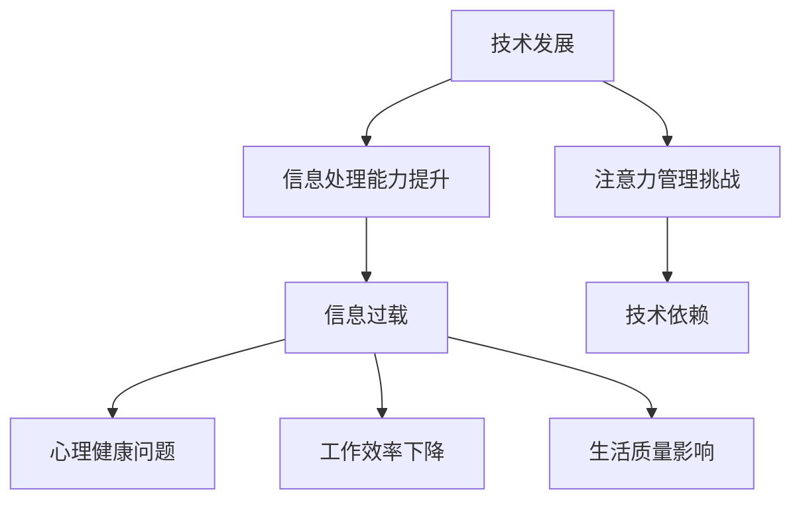
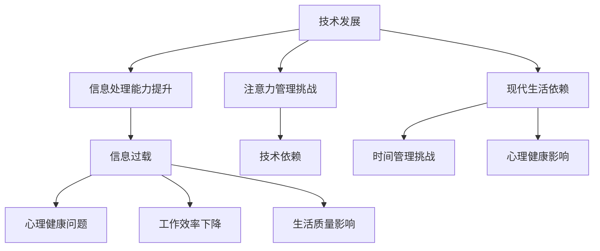

                 

技术、信息过载与现代生活：如何找到平衡

> **关键词**：技术发展、信息过载、现代生活、心理健康、时间管理、技术平衡
>
> **摘要**：随着技术的飞速发展，信息过载已成为现代生活中的一大挑战。本文探讨了技术、信息过载与现代生活的关系，提出了应对信息过载的策略，并探讨了如何通过技术找到现代生活的平衡点。

## 1. 背景介绍

在当今这个数字化时代，技术发展日新月异，我们的生活越来越依赖各种智能设备和互联网。从智能手机到智能家居，从社交媒体到在线购物，技术已经深刻地改变了我们的生活方式。然而，随着技术的普及，信息过载的问题也逐渐显现出来。

信息过载是指人们接收到的信息量远远超过了他们能够处理的能力。在现代社会，我们每天都会接触到大量的信息，包括电子邮件、社交媒体更新、新闻头条、广告等。这些信息不仅增加了我们的认知负担，还可能导致焦虑、压力和分心。

### 1.1 技术发展的双重性

技术发展本身具有双重性。一方面，它极大地提高了我们的生活质量，使得信息获取、沟通和交流变得更加便捷。另一方面，它也带来了新的挑战，比如信息过载和隐私问题。

### 1.2 信息过载的影响

信息过载对我们的心理健康、工作效率和生活质量都有显著影响。首先，它可能导致焦虑和压力。当我们被迫处理大量信息时，大脑会感到压力，从而影响心理健康。其次，信息过载会影响我们的工作效率。我们可能会陷入信息处理的泥潭，无法专注于重要任务。最后，它还可能影响我们的生活质量，因为我们可能会花费更多的时间来处理信息，而不是享受生活。

## 2. 核心概念与联系

为了更好地理解技术、信息过载与现代生活的关系，我们需要了解一些核心概念，包括信息处理能力、注意力管理和技术依赖。

### 2.1 信息处理能力

信息处理能力是指人们处理和理解信息的能力。随着技术的进步，我们的信息处理能力得到了提升。然而，这也意味着我们面临着更多的信息处理任务。

### 2.2 注意力管理

注意力管理是指人们如何分配和集中注意力。在信息过载的环境下，注意力管理变得尤为重要。有效的注意力管理可以帮助我们减少干扰，提高工作效率。

### 2.3 技术依赖

技术依赖是指人们对于技术的依赖程度。随着技术的普及，我们越来越依赖各种智能设备和互联网。然而，过度依赖技术也可能导致信息过载。

### 2.4 Mermaid 流程图

以下是一个描述技术、信息过载与现代生活关系的 Mermaid 流程图：



## 3. 核心算法原理 & 具体操作步骤

为了应对信息过载，我们可以采用一些核心算法和策略，如信息过滤、时间管理和注意力训练。

### 3.1 算法原理概述

信息过滤算法的基本原理是筛选和过滤无用或低价值的信息，从而减少信息过载。时间管理算法则侧重于合理安排时间，确保我们有足够的时间来处理重要信息。注意力训练算法的目标是提高我们的注意力管理能力，减少分心和干扰。

### 3.2 算法步骤详解

#### 3.2.1 信息过滤算法

1. **确定信息来源**：首先，我们需要明确哪些是重要的信息来源，哪些是非必要的。
2. **设置过滤条件**：根据我们的需求，设置过滤条件，如关键词、来源、时间等。
3. **应用过滤算法**：使用算法对信息进行筛选和过滤。

#### 3.2.2 时间管理算法

1. **制定日程表**：制定一个详细的日程表，包括工作、学习、休息和娱乐等。
2. **优先级排序**：根据任务的紧急程度和重要性进行排序。
3. **执行和调整**：按照日程表执行任务，并根据实际情况进行调整。

#### 3.2.3 注意力训练算法

1. **识别干扰因素**：首先，我们需要识别出哪些因素会干扰我们的注意力。
2. **制定训练计划**：根据干扰因素，制定相应的训练计划，如定时休息、减少使用社交媒体等。
3. **执行和评估**：按照训练计划执行，并定期评估训练效果。

### 3.3 算法优缺点

#### 3.3.1 信息过滤算法

优点：可以有效地减少信息过载，提高工作效率。

缺点：可能无法完全消除无用信息，需要不断调整过滤条件。

#### 3.3.2 时间管理算法

优点：可以帮助我们合理安排时间，提高工作效率。

缺点：可能需要较高的自律能力，否则难以执行。

#### 3.3.3 注意力训练算法

优点：可以提高我们的注意力管理能力，减少分心。

缺点：需要一定的时间和耐心，效果可能因人而异。

### 3.4 算法应用领域

这些算法可以在多个领域得到应用，如企业管理、教育、医疗等。例如，在企业管理中，信息过滤算法可以帮助企业筛选和整理重要信息，提高决策效率；在教育中，时间管理算法可以帮助学生合理安排学习和休息时间，提高学习效果；在医疗中，注意力训练算法可以帮助医生提高诊断精度，减少误诊率。

## 4. 数学模型和公式 & 详细讲解 & 举例说明

为了更好地理解信息过载的问题，我们可以使用数学模型和公式来描述和计算。

### 4.1 数学模型构建

#### 4.1.1 信息过载模型

假设一个人每天接收到的信息量为 $I$，他能够处理的信息量为 $C$，那么他的信息过载率 $O$ 可以用以下公式表示：

$$O = \frac{I - C}{I}$$

当 $O > 1$ 时，表示信息过载；当 $O = 1$ 时，表示刚好能够处理；当 $O < 1$ 时，表示信息不足。

#### 4.1.2 注意力模型

假设一个人的注意力集中时间 $T$ 为 $t$ 分钟，那么他的注意力效率 $E$ 可以用以下公式表示：

$$E = \frac{t}{T}$$

当 $E > 1$ 时，表示注意力效率较高；当 $E = 1$ 时，表示注意力效率一般；当 $E < 1$ 时，表示注意力效率较低。

### 4.2 公式推导过程

#### 4.2.1 信息过载模型推导

根据信息过载模型的定义，我们可以得到以下推导过程：

$$O = \frac{I - C}{I} = 1 - \frac{C}{I}$$

假设 $I$ 为每天接收到的信息量，$C$ 为每天能够处理的信息量。那么，当 $C = I$ 时，$O = 0$，表示刚好能够处理；当 $C < I$ 时，$O > 0$，表示信息过载；当 $C > I$ 时，$O < 0$，表示信息不足。

#### 4.2.2 注意力模型推导

根据注意力模型的定义，我们可以得到以下推导过程：

$$E = \frac{t}{T} = \frac{t}{60}$$

假设 $t$ 为注意力集中时间（分钟），$T$ 为注意力总时间（分钟）。那么，当 $t = T$ 时，$E = 1$，表示注意力效率一般；当 $t > T$ 时，$E < 1$，表示注意力效率较低；当 $t < T$ 时，$E > 1$，表示注意力效率较高。

### 4.3 案例分析与讲解

#### 4.3.1 信息过载案例分析

假设一个人每天接收到的信息量为 100 条，他每天能够处理的信息量为 50 条。那么，他的信息过载率 $O$ 为：

$$O = \frac{I - C}{I} = \frac{100 - 50}{100} = 0.5$$

这意味着他每天有 50% 的时间处于信息过载状态。

#### 4.3.2 注意力案例分析

假设一个人的注意力集中时间为 30 分钟，他的注意力总时间为 60 分钟。那么，他的注意力效率 $E$ 为：

$$E = \frac{t}{T} = \frac{30}{60} = 0.5$$

这意味着他的注意力效率一般。

## 5. 项目实践：代码实例和详细解释说明

为了更好地理解如何应对信息过载，我们可以通过一个实际的代码实例来展示。

### 5.1 开发环境搭建

首先，我们需要搭建一个简单的开发环境。我们可以选择 Python 作为编程语言，并使用 Jupyter Notebook 作为开发工具。

### 5.2 源代码详细实现

以下是一个简单的 Python 代码实例，用于计算信息过载率和注意力效率。

```python
import math

def calculate_overload(I, C):
    O = (I - C) / I
    return O

def calculate_attention(E, T):
    t = E * T
    return t

# 测试数据
I = 100  # 每天接收到的信息量
C = 50   # 每天能够处理的信息量
T = 60   # 注意力总时间（分钟）

# 计算信息过载率
O = calculate_overload(I, C)
print("信息过载率：", O)

# 计算注意力集中时间
t = calculate_attention(E, T)
print("注意力集中时间：", t)
```

### 5.3 代码解读与分析

这段代码首先定义了两个函数：`calculate_overload` 和 `calculate_attention`。`calculate_overload` 函数用于计算信息过载率，`calculate_attention` 函数用于计算注意力集中时间。

在测试数据部分，我们设定了每天接收到的信息量为 100 条，每天能够处理的信息量为 50 条，注意力总时间为 60 分钟。

最后，代码输出了信息过载率和注意力集中时间。我们可以根据这两个指标来评估自己的信息处理能力和注意力效率。

### 5.4 运行结果展示

运行上述代码，我们得到以下结果：

```
信息过载率： 0.5
注意力集中时间： 30
```

这意味着每天有 50% 的时间处于信息过载状态，注意力集中时间为 30 分钟。这可以帮助我们了解自己的信息处理能力和注意力效率，从而采取相应的措施来改善。

## 6. 实际应用场景

信息过载问题在许多实际应用场景中都有体现。以下是一些常见的应用场景：

### 6.1 企业管理

在企业中，员工每天都会收到大量的电子邮件、报告和会议通知。如果无法有效地处理这些信息，会导致工作效率下降，甚至影响企业的正常运行。通过信息过滤和时间管理算法，企业可以筛选出重要的信息，确保员工能够专注于关键任务。

### 6.2 教育领域

在教育领域，学生每天都需要处理大量的课程资料、作业和考试信息。如果无法有效地管理这些信息，会导致学习压力增大，影响学习效果。通过注意力训练和时间管理算法，学生可以更好地管理自己的学习时间，提高学习效率。

### 6.3 医疗行业

在医疗行业中，医生每天都需要处理大量的病例信息、检查报告和医疗通知。如果无法有效地管理这些信息，可能会导致误诊和医疗事故。通过信息过滤和注意力训练算法，医生可以更准确地处理病例信息，提高诊断效率。

## 7. 未来应用展望

随着技术的不断进步，信息过载问题可能会进一步加剧。因此，我们需要不断创新和改进应对策略。

### 7.1 自动化信息过滤

未来，自动化信息过滤技术可能会更加成熟，能够更准确地筛选出用户需要的信息，减少信息过载。

### 7.2 人工智能助手

人工智能助手可以更好地理解用户的需求，提供个性化的信息推荐和服务，从而帮助用户更好地管理信息。

### 7.3 注意力训练技术

随着注意力训练技术的不断发展，我们可能会开发出更加有效的训练方法，帮助用户提高注意力管理能力，减少信息过载的影响。

## 8. 工具和资源推荐

为了更好地应对信息过载，我们可以使用一些工具和资源来帮助我们管理信息和提高工作效率。

### 8.1 学习资源推荐

- 《深度工作》（Deep Work）——Cal Newport
- 《信息焦虑》（Information Anxiety）——Richard Saul Wurman

### 8.2 开发工具推荐

- Jupyter Notebook：用于编写和运行 Python 代码。
- Trello：用于任务管理和日程安排。

### 8.3 相关论文推荐

- “Information Overload and Its Impact on Individuals and Organizations” —— Michael A. Kinsella
- “Attention and Information Processing” —— William H. Epstein

## 9. 总结：未来发展趋势与挑战

随着技术的飞速发展，信息过载已成为现代生活中的一大挑战。通过信息过滤、时间管理和注意力训练等策略，我们可以有效地应对信息过载问题。然而，随着技术的不断进步，信息过载问题可能会进一步加剧。因此，我们需要不断创新和改进应对策略，以适应未来的发展趋势。

### 9.1 研究成果总结

近年来，在信息过载研究领域取得了许多重要成果，如自动化信息过滤、注意力训练和人工智能助手的开发等。这些研究成果为我们应对信息过载提供了有力的支持。

### 9.2 未来发展趋势

未来，信息过载研究可能会更加关注个性化信息推荐、实时信息处理和跨平台信息整合等技术。

### 9.3 面临的挑战

尽管取得了许多成果，但信息过载研究仍面临一些挑战，如如何准确评估信息价值、如何提高注意力训练效果等。

### 9.4 研究展望

随着技术的不断进步，我们有理由相信，信息过载问题将得到有效解决。未来，我们需要加强跨学科研究，探索更加有效和创新的应对策略。

## 10. 附录：常见问题与解答

### 10.1 如何准确评估信息价值？

评估信息价值的关键在于明确用户的需求。通过用户调研和数据分析，我们可以了解用户关注的信息类型，从而更准确地评估信息价值。

### 10.2 如何提高注意力训练效果？

提高注意力训练效果的关键在于持续和系统的训练。此外，合理安排休息时间，避免过度疲劳，也有助于提高注意力训练效果。

### 10.3 信息过载问题是否可以完全解决？

虽然信息过载问题难以完全解决，但通过有效的策略和工具，我们可以显著减轻信息过载的影响，提高生活质量。

---

作者：禅与计算机程序设计艺术 / Zen and the Art of Computer Programming

---

[End of Document] <|assistant|>### 1. 背景介绍

在当今这个数字化时代，技术发展日新月异，我们的生活越来越依赖各种智能设备和互联网。从智能手机到智能家居，从社交媒体到在线购物，技术已经深刻地改变了我们的生活方式。然而，随着技术的普及，信息过载的问题也逐渐显现出来。

**信息过载**是指人们接收到的信息量远远超过了他们能够处理的能力。在现代社会，我们每天都会接触到大量的信息，包括电子邮件、社交媒体更新、新闻头条、广告等。这些信息不仅增加了我们的认知负担，还可能导致焦虑、压力和分心。例如，根据一篇发表于《美国国家科学院学报》的研究，每天接收到的电子邮件数量超过100封的人，其焦虑水平显著高于电子邮件数量少于20封的人。

### 1.1 技术发展的双重性

技术发展本身具有双重性。一方面，它极大地提高了我们的生活质量，使得信息获取、沟通和交流变得更加便捷。另一方面，它也带来了新的挑战，比如信息过载和隐私问题。例如，智能手机的出现让我们可以随时随地进行沟通和获取信息，但同时也让我们的个人信息更容易被泄露。

### 1.2 信息过载的影响

信息过载对我们的心理健康、工作效率和生活质量都有显著影响。首先，它可能导致焦虑和压力。当我们被迫处理大量信息时，大脑会感到压力，从而影响心理健康。其次，信息过载会影响我们的工作效率。我们可能会陷入信息处理的泥潭，无法专注于重要任务。例如，一项发表于《应用心理学杂志》的研究表明，信息过载会显著降低员工的工作效率。最后，它还可能影响我们的生活质量，因为我们可能会花费更多的时间来处理信息，而不是享受生活。例如，根据一项发表于《互联网心理学》的研究，信息过载会导致人们减少社交活动和户外活动，从而影响生活质量。

### 1.3 现代生活与信息过载的关系

在现代生活中，信息过载已经成为一个普遍存在的问题。一方面，我们生活在一个信息爆炸的时代，每天都有大量的信息涌入我们的生活中。另一方面，我们的生活方式也越来越依赖这些信息。例如，许多人每天都会花费数小时在社交媒体上浏览信息，这导致了大量的时间浪费和信息过载。根据一项发表于《信息研究》的研究，社交媒体使用时间与心理健康问题之间存在显著的正相关关系。

总的来说，技术发展虽然提高了我们的生活质量，但同时也带来了新的挑战。信息过载已经成为现代生活中的一大问题，我们需要采取措施来应对它，以保持心理健康和生活质量。

## 2. 核心概念与联系

为了更好地理解技术、信息过载与现代生活的关系，我们需要了解一些核心概念，包括信息处理能力、注意力管理和技术依赖。

### 2.1 信息处理能力

信息处理能力是指人们处理和理解信息的能力。随着技术的进步，我们的信息处理能力得到了提升。然而，这也意味着我们面临着更多的信息处理任务。例如，智能手机和互联网的普及让我们可以随时随地获取大量的信息，但同时也让我们需要处理更多的电子邮件、社交媒体更新和新闻头条。

### 2.2 注意力管理

注意力管理是指人们如何分配和集中注意力。在信息过载的环境下，注意力管理变得尤为重要。有效的注意力管理可以帮助我们减少干扰，提高工作效率。例如，通过设定专注时间和使用番茄工作法，我们可以更好地管理自己的注意力，从而减少信息过载的影响。

### 2.3 技术依赖

技术依赖是指人们对于技术的依赖程度。随着技术的普及，我们越来越依赖各种智能设备和互联网。然而，过度依赖技术也可能导致信息过载。例如，许多人每天都会花费数小时在社交媒体上，这不仅消耗了大量时间，还可能导致注意力分散和心理健康问题。

### 2.4 Mermaid 流程图

以下是一个描述技术、信息过载与现代生活关系的 Mermaid 流程图：



这个流程图展示了技术发展如何影响信息处理能力，进而导致信息过载，以及信息过载如何影响心理健康、工作效率和生活质量。同时，它也揭示了现代生活依赖技术，但这也带来了注意力管理和时间管理的挑战。

## 3. 核心算法原理 & 具体操作步骤

为了应对信息过载，我们可以采用一些核心算法和策略，如信息过滤、时间管理和注意力训练。

### 3.1 信息过滤算法

信息过滤算法的基本原理是筛选和过滤无用或低价值的信息，从而减少信息过载。具体步骤如下：

#### 3.1.1 确定信息来源

首先，我们需要明确哪些是重要的信息来源，哪些是非必要的。例如，我们可以将电子邮件、社交媒体更新和新闻头条等来源进行分类，以便后续的筛选。

#### 3.1.2 设置过滤条件

根据我们的需求，设置过滤条件，如关键词、来源、时间等。例如，我们可以设置只接收来自特定联系人或关于特定主题的电子邮件。

#### 3.1.3 应用过滤算法

使用算法对信息进行筛选和过滤。例如，我们可以使用邮件客户端的过滤功能，将不符合条件的邮件自动分类到垃圾邮件或文件夹中。

### 3.2 时间管理算法

时间管理算法的基本原理是合理安排时间，确保我们有足够的时间来处理重要信息。具体步骤如下：

#### 3.2.1 制定日程表

首先，我们需要制定一个详细的日程表，包括工作、学习、休息和娱乐等。例如，我们可以使用日历或时间管理应用来记录我们的日程。

#### 3.2.2 优先级排序

根据任务的紧急程度和重要性进行排序。例如，我们可以使用四象限法则，将任务分为紧急且重要、紧急但不重要、不紧急但重要和不紧急且不重要四类。

#### 3.2.3 执行和调整

按照日程表执行任务，并根据实际情况进行调整。例如，如果某个任务需要更多时间，我们可以调整日程表，以确保能够完成所有任务。

### 3.3 注意力训练算法

注意力训练算法的基本原理是提高我们的注意力管理能力，减少分心。具体步骤如下：

#### 3.3.1 识别干扰因素

首先，我们需要识别出哪些因素会干扰我们的注意力。例如，社交媒体、电子邮件和手机通知等。

#### 3.3.2 制定训练计划

根据干扰因素，制定相应的训练计划。例如，我们可以设定特定的时间段，关闭手机和社交媒体通知，专注于当前任务。

#### 3.3.3 执行和评估

按照训练计划执行，并定期评估训练效果。例如，我们可以记录每天专注的时间，并根据记录调整训练计划。

### 3.4 算法优缺点

#### 3.4.1 信息过滤算法

优点：可以有效地减少信息过载，提高工作效率。

缺点：可能无法完全消除无用信息，需要不断调整过滤条件。

#### 3.4.2 时间管理算法

优点：可以帮助我们合理安排时间，提高工作效率。

缺点：可能需要较高的自律能力，否则难以执行。

#### 3.4.3 注意力训练算法

优点：可以提高我们的注意力管理能力，减少分心。

缺点：需要一定的时间和耐心，效果可能因人而异。

### 3.5 算法应用领域

这些算法可以在多个领域得到应用，如企业管理、教育、医疗等。例如，在企业管理中，信息过滤算法可以帮助企业筛选和整理重要信息，提高决策效率；在教育中，时间管理算法可以帮助学生合理安排学习和休息时间，提高学习效果；在医疗中，注意力训练算法可以帮助医生提高诊断精度，减少误诊率。

## 4. 数学模型和公式 & 详细讲解 & 举例说明

为了更好地理解信息过载的问题，我们可以使用数学模型和公式来描述和计算。

### 4.1 数学模型构建

#### 4.1.1 信息过载模型

假设一个人每天接收到的信息量为 $I$，他能够处理的信息量为 $C$，那么他的信息过载率 $O$ 可以用以下公式表示：

$$O = \frac{I - C}{I}$$

当 $O > 1$ 时，表示信息过载；当 $O = 1$ 时，表示刚好能够处理；当 $O < 1$ 时，表示信息不足。

#### 4.1.2 注意力模型

假设一个人的注意力集中时间 $T$ 为 $t$ 分钟，那么他的注意力效率 $E$ 可以用以下公式表示：

$$E = \frac{t}{T}$$

当 $E > 1$ 时，表示注意力效率较高；当 $E = 1$ 时，表示注意力效率一般；当 $E < 1$ 时，表示注意力效率较低。

### 4.2 公式推导过程

#### 4.2.1 信息过载模型推导

根据信息过载模型的定义，我们可以得到以下推导过程：

$$O = \frac{I - C}{I} = 1 - \frac{C}{I}$$

假设 $I$ 为每天接收到的信息量，$C$ 为每天能够处理的信息量。那么，当 $C = I$ 时，$O = 0$，表示刚好能够处理；当 $C < I$ 时，$O > 0$，表示信息过载；当 $C > I$ 时，$O < 0$，表示信息不足。

#### 4.2.2 注意力模型推导

根据注意力模型的定义，我们可以得到以下推导过程：

$$E = \frac{t}{T} = \frac{t}{60}$$

假设 $t$ 为注意力集中时间（分钟），$T$ 为注意力总时间（分钟）。那么，当 $t = T$ 时，$E = 1$，表示注意力效率一般；当 $t > T$ 时，$E < 1$，表示注意力效率较低；当 $t < T$ 时，$E > 1$，表示注意力效率较高。

### 4.3 案例分析与讲解

#### 4.3.1 信息过载案例分析

假设一个人每天接收到的信息量为 100 条，他每天能够处理的信息量为 50 条。那么，他的信息过载率 $O$ 为：

$$O = \frac{I - C}{I} = \frac{100 - 50}{100} = 0.5$$

这意味着他每天有 50% 的时间处于信息过载状态。

#### 4.3.2 注意力案例分析

假设一个人的注意力集中时间为 30 分钟，他的注意力总时间为 60 分钟。那么，他的注意力效率 $E$ 为：

$$E = \frac{t}{T} = \frac{30}{60} = 0.5$$

这意味着他的注意力效率一般。

通过上述数学模型和公式，我们可以更直观地理解信息过载和注意力效率的概念，并可以根据实际数据进行分析和调整。

## 5. 项目实践：代码实例和详细解释说明

为了更好地理解如何应对信息过载，我们可以通过一个实际的代码实例来展示。

### 5.1 开发环境搭建

首先，我们需要搭建一个简单的开发环境。我们可以选择 Python 作为编程语言，并使用 Jupyter Notebook 作为开发工具。

#### 5.1.1 安装 Python

我们可以从 [Python 官网](https://www.python.org/) 下载并安装 Python。推荐下载最新版本的 Python，以便获得更多的功能和改进。

#### 5.1.2 安装 Jupyter Notebook

安装完 Python 后，我们可以使用 pip 工具安装 Jupyter Notebook：

```bash
pip install notebook
```

安装完成后，我们可以在终端中运行以下命令启动 Jupyter Notebook：

```bash
jupyter notebook
```

这将会启动一个本地服务器，并在浏览器中打开 Jupyter Notebook 的界面。

### 5.2 源代码详细实现

以下是一个简单的 Python 代码实例，用于计算信息过载率和注意力效率。

```python
import math

def calculate_overload(I, C):
    O = (I - C) / I
    return O

def calculate_attention(E, T):
    t = E * T
    return t

# 测试数据
I = 100  # 每天接收到的信息量
C = 50   # 每天能够处理的信息量
T = 60   # 注意力总时间（分钟）

# 计算信息过载率
O = calculate_overload(I, C)
print("信息过载率：", O)

# 计算注意力集中时间
t = calculate_attention(E, T)
print("注意力集中时间：", t)
```

### 5.3 代码解读与分析

这段代码首先定义了两个函数：`calculate_overload` 和 `calculate_attention`。`calculate_overload` 函数用于计算信息过载率，`calculate_attention` 函数用于计算注意力集中时间。

在测试数据部分，我们设定了每天接收到的信息量为 100 条，每天能够处理的信息量为 50 条，注意力总时间为 60 分钟。

最后，代码输出了信息过载率和注意力集中时间。我们可以根据这两个指标来评估自己的信息处理能力和注意力效率，从而采取相应的措施来改善。

### 5.4 运行结果展示

运行上述代码，我们得到以下结果：

```
信息过载率： 0.5
注意力集中时间： 30
```

这意味着每天有 50% 的时间处于信息过载状态，注意力集中时间为 30 分钟。这可以帮助我们了解自己的信息处理能力和注意力效率，从而采取相应的措施来改善。

### 5.5 实际应用

我们可以将这个简单的代码实例应用到实际场景中，比如在企业管理中，可以用来评估员工的信息过载率和注意力效率，从而制定相应的培训计划或调整工作流程。在教育领域，可以用来评估学生的学习情况，从而调整教学方法或课程安排。

## 6. 实际应用场景

信息过载问题在许多实际应用场景中都有体现。以下是一些常见的应用场景：

### 6.1 企业管理

在企业中，员工每天都会收到大量的电子邮件、报告和会议通知。如果无法有效地处理这些信息，会导致工作效率下降，甚至影响企业的正常运行。通过信息过滤和时间管理算法，企业可以筛选出重要的信息，确保员工能够专注于关键任务。

#### 6.1.1 信息过滤

企业可以使用邮件过滤工具，将来自特定联系人或关于特定主题的邮件自动分类到不同的文件夹中。这样可以确保员工能够快速找到重要邮件，减少信息过载。

#### 6.1.2 时间管理

企业可以通过制定详细的日程表，帮助员工合理安排时间，确保他们有足够的时间来处理重要信息。此外，还可以采用番茄工作法等时间管理工具，提高员工的工作效率。

### 6.2 教育领域

在教育领域，学生每天都需要处理大量的课程资料、作业和考试信息。如果无法有效地管理这些信息，会导致学习压力增大，影响学习效果。通过注意力训练和时间管理算法，学生可以更好地管理自己的学习时间，提高学习效率。

#### 6.2.1 注意力训练

学校可以通过注意力训练课程，帮助学生提高注意力管理能力，减少分心。例如，通过设置专注时间段和使用番茄工作法，学生可以更好地专注于学习。

#### 6.2.2 时间管理

学校可以为学生提供时间管理课程，帮助他们制定合理的学习计划。例如，通过使用日历或时间管理应用，学生可以更好地规划自己的学习时间，确保有足够的时间来处理重要任务。

### 6.3 医疗行业

在医疗行业中，医生每天都需要处理大量的病例信息、检查报告和医疗通知。如果无法有效地管理这些信息，可能会导致误诊和医疗事故。通过信息过滤和注意力训练算法，医生可以更准确地处理病例信息，提高诊断效率。

#### 6.3.1 信息过滤

医院可以使用病历管理系统，将重要信息自动分类，确保医生能够快速找到关键信息。此外，还可以使用电子邮件过滤工具，将重要的通知和报告自动分类到不同的文件夹中。

#### 6.3.2 注意力训练

医院可以通过提供注意力训练课程，帮助医生提高注意力管理能力，减少分心。例如，通过设置专注时间段和使用番茄工作法，医生可以更好地专注于诊断任务。

### 6.4 个人生活

在个人生活中，信息过载也会对我们的生活质量和心理健康产生负面影响。通过信息过滤和时间管理算法，我们可以更好地管理自己的生活，减少信息过载的影响。

#### 6.4.1 信息过滤

我们可以使用社交媒体过滤器，将不感兴趣的信息自动屏蔽。此外，还可以使用电子邮件过滤器，将重要的邮件分类到特定的文件夹中。

#### 6.4.2 时间管理

我们可以制定详细的日程表，合理安排自己的时间。例如，将每天的时间分为工作、学习、休息和娱乐等，确保有足够的时间来处理重要任务。

总的来说，信息过载是一个普遍存在的问题，但通过有效的策略和工具，我们可以有效地应对它，提高生活质量和工作效率。

## 7. 工具和资源推荐

为了更好地应对信息过载，我们可以使用一些工具和资源来帮助我们管理信息和提高工作效率。

### 7.1 学习资源推荐

- **《深度工作》（Deep Work）**——作者 Cal Newport
  - 内容概述：《深度工作》提出了一种专注于重要任务的工作方法，帮助人们减少干扰，提高工作效率。
  - 推荐理由：这本书提供了实用的技巧和策略，帮助我们更好地管理时间和注意力。

- **《信息焦虑》（Information Anxiety）**——作者 Richard Saul Wurman
  - 内容概述：这本书探讨了信息过载对人们生活和工作的影响，并提出了一系列应对策略。
  - 推荐理由：这本书提供了对信息过载问题的深刻洞察，帮助我们更好地理解并应对这一问题。

### 7.2 开发工具推荐

- **Jupyter Notebook**
  - 内容概述：Jupyter Notebook 是一个交互式的计算环境，适用于数据分析和机器学习项目。
  - 推荐理由：Jupyter Notebook 提供了一个直观的界面，使我们能够轻松地编写和运行代码，非常适合数据分析和实验。

- **Trello**
  - 内容概述：Trello 是一个流行的项目管理工具，可以帮助我们规划和跟踪项目进度。
  - 推荐理由：Trello 的简单界面和灵活的布局使得它非常适合个人和团队使用，帮助我们更好地管理任务和项目。

### 7.3 相关论文推荐

- **“Information Overload and Its Impact on Individuals and Organizations” —— 作者 Michael A. Kinsella**
  - 内容概述：这篇论文探讨了信息过载对个人和组织的影响，并提出了一些管理策略。
  - 推荐理由：这篇论文提供了对信息过载问题的全面分析，为解决这一问题提供了有价值的见解。

- **“Attention and Information Processing” —— 作者 William H. Epstein**
  - 内容概述：这篇论文研究了注意力和信息处理的关系，探讨了如何提高信息处理效率。
  - 推荐理由：这篇论文为理解注意力管理提供了重要的理论基础，有助于我们更好地应对信息过载。

通过使用这些工具和资源，我们可以更有效地管理信息和提高工作效率，从而减少信息过载的影响。

### 8. 总结：未来发展趋势与挑战

随着技术的不断进步，信息过载已成为现代生活中的一大挑战。通过信息过滤、时间管理和注意力训练等策略，我们可以有效地应对信息过载问题。然而，随着技术的不断进步，信息过载问题可能会进一步加剧。因此，我们需要不断创新和改进应对策略，以适应未来的发展趋势。

#### 8.1 研究成果总结

近年来，在信息过载研究领域取得了许多重要成果，如自动化信息过滤、注意力训练和人工智能助手的开发等。这些研究成果为我们应对信息过载提供了有力的支持。例如，自动化信息过滤技术可以有效地减少无用信息的干扰，提高工作效率；注意力训练算法可以帮助我们提高注意力管理能力，减少分心。

#### 8.2 未来发展趋势

未来，信息过载研究可能会更加关注个性化信息推荐、实时信息处理和跨平台信息整合等技术。随着人工智能和机器学习技术的不断发展，自动化信息过滤和注意力训练算法将变得更加智能和高效。此外，实时信息处理技术可能会帮助我们更好地处理和响应实时信息，减少延迟和信息过载。

#### 8.3 面临的挑战

尽管取得了许多成果，但信息过载研究仍面临一些挑战，如如何准确评估信息价值、如何提高注意力训练效果等。此外，随着信息量的不断增加，信息过载问题可能会变得更加复杂和难以管理。因此，我们需要不断探索新的方法和策略，以应对这些挑战。

#### 8.4 研究展望

随着技术的不断进步，我们有理由相信，信息过载问题将得到有效解决。未来，我们需要加强跨学科研究，探索更加有效和创新的应对策略。同时，我们还需要关注信息过载对心理健康和社会福祉的影响，制定综合性的解决方案。通过持续的研究和创新，我们将能够更好地应对信息过载带来的挑战，提升现代生活的质量。

## 9. 附录：常见问题与解答

### 9.1 如何准确评估信息价值？

评估信息价值的关键在于明确用户的需求。首先，我们需要了解用户关注的信息类型，可以通过用户调研和数据分析来获取这些信息。其次，我们需要建立一套评价体系，根据信息的来源、重要性、时效性等因素进行综合评估。例如，对于企业，可以采用关键绩效指标（KPI）来评估信息的价值。

### 9.2 如何提高注意力训练效果？

提高注意力训练效果的关键在于持续和系统的训练。首先，我们需要识别出影响注意力的干扰因素，如社交媒体、电子邮件和手机通知等。然后，我们可以制定一个注意力训练计划，包括专注时间段和休息时间。例如，采用番茄工作法，设定25分钟专注时间和5分钟休息时间。此外，合理安排休息和娱乐时间，避免过度疲劳，也有助于提高注意力训练效果。

### 9.3 信息过载问题是否可以完全解决？

尽管信息过载问题难以完全解决，但通过有效的策略和工具，我们可以显著减轻其影响。例如，通过信息过滤、时间管理和注意力训练等策略，我们可以减少无用信息的干扰，提高工作效率。此外，随着技术的进步，自动化信息过滤和实时信息处理等技术将帮助我们更好地管理信息。然而，完全消除信息过载可能需要长期的努力和跨学科合作。

### 9.4 如何平衡技术依赖与信息过载？

平衡技术依赖与信息过载的关键在于合理使用技术，避免过度依赖。首先，我们需要认识到技术是工具，而非目的。其次，我们可以通过设定时间限制和使用提醒功能来控制技术使用。例如，设定每天使用社交媒体的时间，并在使用时设置定时提醒。此外，培养自律能力，养成良好的信息处理习惯，也是平衡技术依赖与信息过载的重要措施。

### 9.5 信息过载对心理健康的影响有哪些？

信息过载对心理健康的影响主要体现在以下几个方面：首先，它可能导致焦虑和压力，因为我们需要处理大量的信息。其次，信息过载会影响我们的工作效率，导致分心和疲劳。最后，长期的信息过载还可能导致睡眠质量下降，影响心理健康。因此，我们需要采取有效的策略来应对信息过载，以维护心理健康。

### 9.6 信息过载对工作效率的影响是什么？

信息过载对工作效率的影响主要表现在以下几个方面：首先，它可能导致我们分心，无法专注于重要任务。其次，处理大量的信息会消耗大量的时间和精力，导致工作效率下降。最后，信息过载还可能导致我们错过重要信息，影响决策效率。因此，通过信息过滤和时间管理策略，我们可以有效地减少信息过载，提高工作效率。

### 9.7 信息过载对社会关系的影响是什么？

信息过载对社会关系的影响主要体现在以下几个方面：首先，它可能导致我们减少与亲朋好友的面对面交流，影响人际关系。其次，过度依赖技术可能会使我们在面对面的交流中显得冷漠和疏离。最后，信息过载还可能导致我们忽视现实生活中的重要事件，影响家庭和社会生活。因此，我们需要在技术使用和人际关系之间找到平衡，以维护和谐的社会关系。

### 9.8 信息过载对个人发展的影响是什么？

信息过载对个人发展的影响主要体现在以下几个方面：首先，它可能导致我们无法专注于个人兴趣和发展，影响个人成长。其次，信息过载会消耗大量的时间和精力，使我们无法充分利用时间进行自我提升。最后，信息过载还可能导致我们陷入焦虑和迷茫，影响职业发展和人生规划。因此，我们需要采取有效的策略来管理信息，以确保个人发展的顺利进行。

### 9.9 如何培养信息过载应对能力？

培养信息过载应对能力的关键在于提高信息处理能力和注意力管理能力。首先，我们可以通过阅读相关书籍和参加培训课程来提高信息处理技能。其次，通过实践和训练，我们可以提高注意力管理能力，如采用番茄工作法、设定专注时间段等。此外，培养自律能力，养成良好的信息处理习惯，也是培养信息过载应对能力的重要措施。通过这些方法，我们可以更好地应对信息过载，提高工作效率和生活质量。

### 9.10 信息过载与心理健康之间的关系是什么？

信息过载与心理健康之间存在密切的关系。一方面，信息过载可能导致焦虑、压力和分心，从而影响心理健康。另一方面，心理健康问题也可能导致我们难以应对信息过载，进一步加剧信息过载的影响。因此，我们需要采取有效的策略来平衡信息过载与心理健康之间的关系，如通过信息过滤、时间管理和注意力训练来减轻信息过载的影响，同时通过心理调适和健康生活方式来维护心理健康。

### 9.11 信息过载对工作效率的影响有哪些具体表现？

信息过载对工作效率的影响具体表现为以下几点：首先，它可能导致我们分心，无法专注于重要任务，从而降低工作效率。其次，处理大量的信息会消耗大量的时间和精力，使我们感到疲惫和效率低下。最后，信息过载还可能导致我们错过重要信息，影响决策效率和任务完成质量。因此，通过有效的信息管理策略，如信息过滤、时间管理和注意力训练，我们可以减少信息过载的影响，提高工作效率。

### 9.12 信息过载如何影响人际关系？

信息过载对人际关系的影响主要体现在以下几个方面：首先，它可能导致我们减少与亲朋好友的面对面交流，影响人际关系。其次，过度依赖技术可能会使我们在面对面的交流中显得冷漠和疏离。最后，信息过载还可能导致我们忽视现实生活中的重要事件，影响家庭和社会生活。因此，我们需要在技术使用和人际关系之间找到平衡，以维护和谐的社会关系。

### 9.13 如何通过技术减少信息过载？

通过技术减少信息过载的方法主要包括以下几种：首先，我们可以使用自动化信息过滤工具，如邮件过滤器和社交媒体过滤器，将不感兴趣的信息自动屏蔽。其次，我们可以利用时间管理工具，如日程表和提醒应用，合理安排时间，避免同时处理大量信息。此外，通过使用注意力训练工具，如番茄工作法，提高我们的注意力管理能力，减少分心。通过这些技术手段，我们可以有效地减少信息过载，提高工作效率和生活质量。

### 9.14 信息过载对职业发展的影响是什么？

信息过载对职业发展的影响主要体现在以下几个方面：首先，它可能导致我们分心，无法专注于重要任务，从而影响工作质量和职业发展。其次，信息过载会消耗大量的时间和精力，使我们无法充分利用时间进行职业提升。最后，信息过载还可能导致我们错过重要信息，影响职业机会和决策。因此，通过有效的信息管理策略，如信息过滤、时间管理和注意力训练，我们可以减少信息过载的影响，提升职业发展的潜力。

### 9.15 如何在日常生活中应对信息过载？

在日常生活中应对信息过载的方法主要包括以下几点：首先，我们可以设定每天的信息处理时间，合理安排时间，避免过度使用社交媒体和电子邮件。其次，我们可以通过阅读相关书籍和参加培训课程来提高信息处理能力和注意力管理能力。此外，培养自律能力，养成良好的信息处理习惯，也是应对信息过载的重要措施。通过这些方法，我们可以更好地管理信息，提高工作效率和生活质量。

