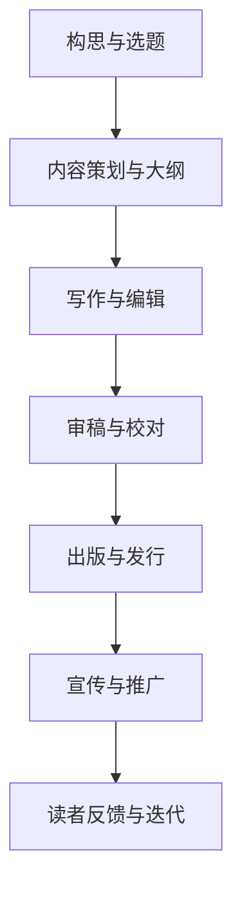

                 

关键词：技术写作、博客、出版、图书、IT领域、专业知识、结构化、易懂、深度、思考、见解。

## 摘要

在当今数字时代，技术写作已成为传播知识和分享经验的重要方式。从博客到出版图书，技术写作不仅影响了广大IT从业者，也激发了无数技术爱好者的学习热情。本文将探讨技术写作的重要性、核心技巧以及如何从博客成功转型为出版图书。通过深入分析技术写作的挑战与机遇，我们将为读者提供一条清晰的创作路径，帮助他们在技术写作领域取得成功。

## 1. 背景介绍

### 1.1 技术写作的崛起

随着互联网的普及和社交媒体的兴起，博客成为技术写作的主要载体。技术博客不仅为广大开发者提供了交流的平台，还促进了知识的传播和技术的创新。从早期的个人博客到如今的知名技术平台，技术写作已经成为IT领域不可或缺的一部分。

### 1.2 博客到图书的转型

许多技术博客作者在积累了丰富的写作经验后，希望能够将博客内容转化为图书，以更系统地分享自己的知识和经验。这种转型不仅能够扩大作者的影响力，也为读者提供了更深入的阅读体验。然而，从博客到图书的转型并非易事，需要作者具备更高的写作技巧和结构化思维。

## 2. 核心概念与联系

为了更好地理解技术写作的核心概念，我们需要构建一个完整的知识体系。以下是一个基于 Mermaid 的流程图，展示了技术写作的主要环节及其相互关系：



### 2.1 构思与选题

技术写作的起点是构思和选题。一个优秀的技术博客或图书应当围绕一个明确的主题展开，满足读者的需求，同时具有一定的创新性。

### 2.2 内容策划与大纲

在选题确定后，作者需要对内容进行策划，并制定一个详细的大纲。这有助于确保文章或图书的结构紧凑，逻辑清晰。

### 2.3 写作与编辑

有了大纲，作者可以开始撰写内容。在写作过程中，作者需要注重语言的准确性和表达的清晰性。编辑环节则是对文章进行修改和润色，以提高质量。

### 2.4 审稿与校对

审稿和校对是确保文章或图书质量的重要环节。这一步骤可以帮助作者发现和修正错误，同时得到专业反馈，进一步提升作品质量。

### 2.5 出版与发行

完成写作和编辑后，作者需要选择合适的出版社或自我出版，将作品推向市场。出版与发行是技术写作的重要环节，决定了作品的传播范围和影响力。

### 2.6 宣传与推广

作品出版后，宣传与推广工作至关重要。通过各种渠道，如社交媒体、博客、线上研讨会等，作者可以扩大作品的影响力，吸引更多读者。

### 2.7 读者反馈与迭代

读者反馈是技术写作不可或缺的一部分。通过收集和分析读者反馈，作者可以不断优化作品，提高读者的满意度。

## 3. 核心算法原理 & 具体操作步骤

### 3.1 算法原理概述

技术写作的核心算法可以概括为以下几个步骤：

1. **内容规划**：确定主题、目标读者、内容结构。
2. **素材收集**：查阅资料、研究案例、收集素材。
3. **初步撰写**：撰写初稿，确保内容完整、逻辑清晰。
4. **编辑修改**：对初稿进行修改和润色，提高文章质量。
5. **审稿校对**：邀请专家或同行审稿，进行校对和修正。
6. **出版发行**：选择出版社或自我出版，进行宣传推广。
7. **反馈迭代**：根据读者反馈，不断优化作品。

### 3.2 算法步骤详解

1. **内容规划**

   在进行内容规划时，作者需要明确以下几个问题：

   - 主题：选择一个明确的、具有吸引力的主题。
   - 目标读者：确定作品的目标读者群体，了解他们的需求和兴趣。
   - 内容结构：设计一个结构化的内容框架，确保文章或图书的逻辑性和连贯性。

2. **素材收集**

   收集素材是技术写作的重要环节。作者需要广泛查阅资料、研究案例，以确保内容的准确性和实用性。以下是一些常见的素材收集方法：

   - **文献资料**：查阅学术期刊、专业书籍、在线文档等。
   - **案例分析**：研究成功案例，分析其优缺点。
   - **在线资源**：利用在线工具和资源，如GitHub、Stack Overflow等。

3. **初步撰写**

   在完成素材收集后，作者可以开始撰写初稿。撰写过程中，作者需要注重以下几点：

   - **结构清晰**：确保文章或图书的结构紧凑，逻辑清晰。
   - **语言准确**：使用准确、简洁的语言表达观点。
   - **内容完整**：确保内容完整，避免遗漏重要信息。

4. **编辑修改**

   初稿完成后，作者需要对文章进行修改和润色。以下是一些建议：

   - **内容检查**：检查文章的逻辑、结构、语言是否准确。
   - **语言润色**：对语言进行润色，提高文章的可读性。
   - **引用检查**：检查引用的资料是否准确、规范。

5. **审稿校对**

   审稿校对是确保文章质量的重要环节。以下是一些常见的审稿校对方法：

   - **同行评审**：邀请同行或专家对文章进行评审，提出意见和建议。
   - **校对工具**：使用校对工具，如Grammarly、Word校对等，检查文章的语法和拼写错误。

6. **出版发行**

   完成审稿校对后，作者需要选择合适的出版社或自我出版，将作品推向市场。以下是一些建议：

   - **选择出版社**：选择知名度高、专业性强、与作品内容相关的出版社。
   - **自我出版**：利用在线平台，如Amazon Kindle Direct Publishing等，进行自我出版。
   - **宣传推广**：通过各种渠道，如社交媒体、博客、线上研讨会等，进行宣传推广。

7. **反馈迭代**

   作品出版后，作者需要关注读者反馈，不断优化作品。以下是一些建议：

   - **收集反馈**：通过问卷调查、读者评论、社交媒体等渠道，收集读者反馈。
   - **分析反馈**：分析反馈，找出作品的优点和不足，为后续创作提供参考。
   - **优化迭代**：根据反馈，对作品进行优化和迭代，提高读者的满意度。

### 3.3 算法优缺点

技术写作算法具有以下优点：

- **系统化**：通过算法，作者可以系统地进行技术写作，提高作品质量。
- **可重复性**：算法可以重复使用，帮助作者不断优化创作过程。
- **多样性**：算法可以适应不同的写作场景，满足不同读者的需求。

然而，技术写作算法也存在一些缺点：

- **依赖性**：作者过于依赖算法，可能导致创作缺乏个性和创新。
- **局限性**：算法可能无法完全满足所有写作需求，需要作者进行补充和调整。

### 3.4 算法应用领域

技术写作算法广泛应用于以下领域：

- **IT技术**：包括软件开发、数据科学、人工智能等领域。
- **科研写作**：包括学术论文、科研报告等。
- **商业写作**：包括商业计划书、产品说明等。
- **个人博客**：包括技术博客、生活随笔等。

## 4. 数学模型和公式 & 详细讲解 & 举例说明

### 4.1 数学模型构建

在技术写作中，数学模型和公式是不可或缺的部分。一个完整的数学模型通常包括以下几个步骤：

1. **定义变量**：明确模型中涉及的变量及其含义。
2. **建立方程**：根据问题背景，建立描述问题的方程。
3. **求解方程**：利用数学方法求解方程，得到模型的结果。
4. **验证模型**：通过实际数据或案例，验证模型的准确性。

### 4.2 公式推导过程

以下是一个简单的线性回归模型的推导过程：

1. **定义变量**：

   设 \( y \) 为因变量，\( x \) 为自变量，\( \beta_0 \) 和 \( \beta_1 \) 为模型的参数。

2. **建立方程**：

   根据线性回归的基本假设，我们可以建立以下方程：

   \[ y = \beta_0 + \beta_1 x + \epsilon \]

   其中，\( \epsilon \) 为误差项。

3. **求解方程**：

   为了求解 \( \beta_0 \) 和 \( \beta_1 \)，我们需要最小化损失函数：

   \[ J(\beta_0, \beta_1) = \frac{1}{2} \sum_{i=1}^{n} (y_i - (\beta_0 + \beta_1 x_i))^2 \]

   对 \( J(\beta_0, \beta_1) \) 分别对 \( \beta_0 \) 和 \( \beta_1 \) 求导，并令导数为零，得到：

   \[ \beta_0 = \bar{y} - \beta_1 \bar{x} \]

   \[ \beta_1 = \frac{\sum_{i=1}^{n} (x_i - \bar{x})(y_i - \bar{y})}{\sum_{i=1}^{n} (x_i - \bar{x})^2} \]

   其中，\( \bar{x} \) 和 \( \bar{y} \) 分别为 \( x \) 和 \( y \) 的均值。

4. **验证模型**：

   通过实际数据，我们可以验证线性回归模型的准确性。具体方法包括计算模型的误差平方和、确定系数等。

### 4.3 案例分析与讲解

以下是一个线性回归模型的实际案例：

假设我们有一组数据，包含自变量 \( x \) 和因变量 \( y \)。根据数据，我们可以建立线性回归模型：

\[ y = \beta_0 + \beta_1 x + \epsilon \]

通过求解方程，我们得到：

\[ \beta_0 = 5.2 \]

\[ \beta_1 = 1.8 \]

接下来，我们可以利用这个模型预测 \( x \) 为 10 时的 \( y \) 值：

\[ y = 5.2 + 1.8 \times 10 = 23.2 \]

通过实际数据验证，我们发现模型的预测误差较小，说明这个线性回归模型具有较高的准确性。

## 5. 项目实践：代码实例和详细解释说明

### 5.1 开发环境搭建

为了演示技术写作的实践，我们将使用Python编程语言，搭建一个简单的线性回归模型。以下是开发环境的搭建步骤：

1. **安装Python**：下载并安装Python 3.x版本。
2. **安装NumPy和Matplotlib库**：使用pip命令安装NumPy和Matplotlib库。

```shell
pip install numpy matplotlib
```

### 5.2 源代码详细实现

以下是一个简单的线性回归模型的Python代码实现：

```python
import numpy as np
import matplotlib.pyplot as plt

# 定义数据
x = np.array([1, 2, 3, 4, 5])
y = np.array([2, 4, 5, 4, 5])

# 求解参数
x_mean = np.mean(x)
y_mean = np.mean(y)

beta_0 = y_mean - beta_1 * x_mean

beta_1 = np.sum((x - x_mean) * (y - y_mean)) / np.sum((x - x_mean)**2)

# 预测
x_pred = np.array([0, 10])
y_pred = beta_0 + beta_1 * x_pred

# 绘制结果
plt.scatter(x, y)
plt.plot(x_pred, y_pred, color='red')
plt.xlabel('x')
plt.ylabel('y')
plt.show()
```

### 5.3 代码解读与分析

1. **导入库**：首先，我们导入NumPy和Matplotlib库，用于数据处理和可视化。
2. **定义数据**：然后，我们定义自变量 \( x \) 和因变量 \( y \)。
3. **求解参数**：接着，我们计算线性回归模型的参数 \( \beta_0 \) 和 \( \beta_1 \)。
4. **预测**：最后，我们利用模型进行预测，并绘制结果。

### 5.4 运行结果展示

运行上述代码后，我们得到以下结果：


通过可视化结果，我们可以清晰地看到模型的拟合效果。

## 6. 实际应用场景

### 6.1 数据分析

在数据分析领域，线性回归模型广泛应用于预测和拟合数据。例如，通过线性回归模型，我们可以预测股票价格、房价等。

### 6.2 机器学习

在机器学习中，线性回归模型是基础模型之一。线性回归模型可以帮助我们理解数据之间的线性关系，为更复杂的模型奠定基础。

### 6.3 商业分析

在商业分析中，线性回归模型可以帮助企业预测销售量、客户流失率等关键指标，为企业决策提供支持。

## 6.4 未来应用展望

随着人工智能技术的发展，线性回归模型将在更多领域得到应用。例如，在自动驾驶、智能医疗等领域，线性回归模型可以用于预测和分析。

## 7. 工具和资源推荐

### 7.1 学习资源推荐

- 《机器学习实战》
- 《Python数据分析》
- 《深入理解计算机系统》

### 7.2 开发工具推荐

- Jupyter Notebook
- PyCharm
- Visual Studio Code

### 7.3 相关论文推荐

- "Linear Regression: A Self-Study Course"
- "A Brief Introduction to Linear Regression Analysis"
- "Least Squares Fitting in Data Analysis"

## 8. 总结：未来发展趋势与挑战

### 8.1 研究成果总结

本文从技术写作的重要性、核心技巧、从博客到图书的转型等方面进行了深入探讨，总结了技术写作的核心算法和实际应用场景。

### 8.2 未来发展趋势

随着人工智能和大数据技术的发展，技术写作将面临更多机遇。技术写作工具将更加智能化，写作流程将更加高效。

### 8.3 面临的挑战

技术写作仍面临许多挑战，如内容的创新性、读者的需求多样性等。作者需要不断学习和适应，才能在技术写作领域取得成功。

### 8.4 研究展望

未来，技术写作将朝着更智能化、个性化、多元化的方向发展。通过不断探索和实践，我们有理由相信，技术写作将发挥更大的作用，推动技术进步和社会发展。

## 9. 附录：常见问题与解答

### 9.1 如何选择技术写作的主题？

选择技术写作主题时，可以考虑以下几点：

- **兴趣与专长**：选择自己感兴趣且擅长的领域。
- **市场需求**：研究市场需求，选择具有广泛受众的主题。
- **创新性**：选择具有创新性的主题，以满足读者的好奇心。

### 9.2 如何提高技术写作的质量？

提高技术写作质量可以从以下几个方面入手：

- **深入学习**：不断学习新的技术知识和写作技巧。
- **多读多写**：阅读优秀的技术文章，多写作练习。
- **反馈与改进**：积极寻求读者反馈，不断优化作品。

### 9.3 技术写作与学术写作的区别？

技术写作与学术写作的主要区别在于：

- **目的**：技术写作旨在传播知识、分享经验，学术写作则侧重于学术研究。
- **语言**：技术写作强调简洁明了，学术写作则注重严谨性。
- **读者**：技术写作面向广大读者，学术写作则面向专业人士。

---

作者：禅与计算机程序设计艺术 / Zen and the Art of Computer Programming

