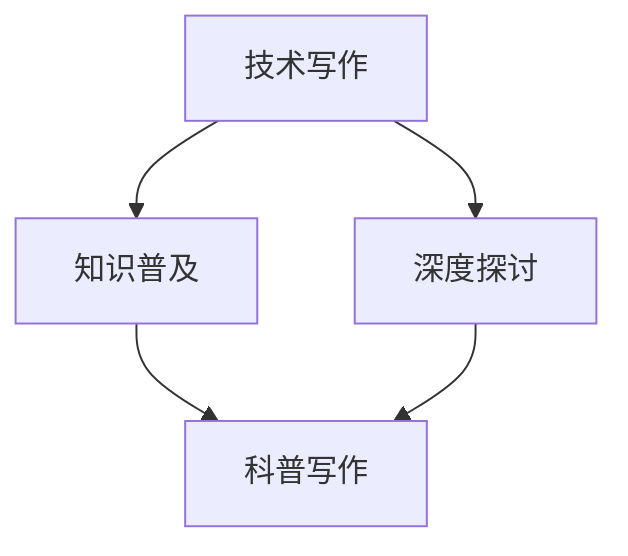

                 

关键词：技术写作，科普写作，畅销书，写作技巧，内容创作

## 摘要

本文旨在探讨技术写作向科普写作转型的路径，探讨如何将专业深奥的技术知识转化为大众易懂的科普文章。通过分析畅销技术书籍的特点，本文将分享实用的写作技巧、策略和资源，帮助读者从技术博客作者转型为畅销科普作家。

## 1. 背景介绍

技术写作与科普写作是两个截然不同的领域。技术写作主要面向技术专业人士，要求作者具备深厚的专业知识，能够深入探讨技术的细节和实现。而科普写作则面向更广泛的读者群体，尤其是非专业人士，需要作者具备较强的语言表达能力和科普思维。

近年来，随着信息技术的发展，技术写作逐渐向科普写作转型。一方面，技术知识的普及需求日益增长，许多非专业人士也希望了解技术背后的原理和应用。另一方面，科普写作不仅能够提高读者的科学素养，还可以促进技术的传播和交流。

然而，技术写作向科普写作的转型并非易事。技术作者需要重新审视自己的写作方式和内容，掌握科普写作的独特技巧。本文将结合畅销技术书籍的实例，探讨如何实现这一转型。

## 2. 核心概念与联系

### 2.1 技术写作与科普写作的区别

#### 2.1.1 写作目标

技术写作的目标是让读者深入了解技术原理、实现和应用。而科普写作的目标则是让读者对技术有初步的了解，激发他们对技术的兴趣。

#### 2.1.2 写作风格

技术写作强调逻辑性、严谨性和专业性，要求作者具备丰富的专业知识。科普写作则更注重语言生动、形象，能够吸引读者的注意力。

#### 2.1.3 写作受众

技术写作主要面向技术专业人士，他们具备一定的技术背景和知识储备。科普写作则面向更广泛的读者群体，尤其是非专业人士。

### 2.2 知识普及与深度探讨

在技术写作向科普写作转型的过程中，作者需要在知识普及与深度探讨之间找到平衡。一方面，科普文章需要让读者了解技术的基本原理和应用。另一方面，科普文章也需要具有一定的深度，避免过于浅显，让读者产生枯燥乏味的感觉。

### 2.3 Mermaid 流程图



## 3. 核心算法原理 & 具体操作步骤

### 3.1 算法原理概述

在技术写作向科普写作转型的过程中，作者需要掌握一些核心算法原理，如内容策划、写作技巧、编辑校对等。这些算法原理可以帮助作者提高写作质量，吸引更多读者。

#### 3.1.1 内容策划

内容策划是科普写作的关键环节。作者需要从读者的需求出发，确定文章的主题、结构和内容。一个好的内容策划能够使文章具有吸引力和可读性。

#### 3.1.2 写作技巧

写作技巧是科普写作的核心。作者需要掌握生动的语言表达、形象的比喻、简洁的句子等技巧，使文章更具吸引力。此外，作者还需要注意段落之间的逻辑关系，确保文章结构清晰。

#### 3.1.3 编辑校对

编辑校对是确保文章质量的重要环节。作者需要认真审查文章中的语法错误、用词不当、逻辑混乱等问题。此外，作者还可以借助一些编辑工具，如Grammarly、Hemingway等，提高文章的写作质量。

### 3.2 算法步骤详解

#### 3.2.1 内容策划

1. 确定主题：从读者的需求出发，选择具有吸引力的主题。
2. 制定大纲：根据主题，制定文章的结构和大纲。
3. 搜集资料：查阅相关资料，为文章提供有力支撑。

#### 3.2.2 写作技巧

1. 使用生动形象的语言：通过比喻、拟人等手法，使文章更具吸引力。
2. 注意段落结构：确保每个段落都有明确的主题和逻辑关系。
3. 避免冗长句子：使用简洁明了的句子，提高文章的可读性。

#### 3.2.3 编辑校对

1. 检查语法错误：确保文章中的语法正确，无错别字。
2. 优化用词：选择合适的词汇，使文章更具表现力。
3. 确保逻辑清晰：检查文章中的逻辑关系，确保文章结构合理。

### 3.3 算法优缺点

#### 3.3.1 优点

1. 提高写作质量：通过算法原理的应用，作者可以更系统地规划和撰写文章。
2. 吸引更多读者：优秀的写作技巧和内容策划能够吸引更多读者关注。

#### 3.3.2 缺点

1. 需要时间和精力：掌握算法原理和技巧需要一定的时间和精力。
2. 难以完全复制：每个作者都有独特的写作风格和技巧，难以完全复制他人的成功经验。

### 3.4 算法应用领域

1. 技术博客写作：技术博客作者可以通过算法原理，提高文章的质量和可读性。
2. 科普写作：科普作家可以通过算法原理，将专业知识转化为通俗易懂的文章。
3. 教学写作：教师可以通过算法原理，编写更具吸引力的教学材料。

## 4. 数学模型和公式 & 详细讲解 & 举例说明

### 4.1 数学模型构建

在科普写作中，数学模型和公式是不可或缺的部分。它们能够帮助读者更直观地理解技术原理。以下是构建数学模型的基本步骤：

#### 4.1.1 确定研究对象

首先，需要明确研究的技术问题或现象，例如算法效率、数据结构等。

#### 4.1.2 提出假设

在研究过程中，需要提出合理的假设，例如算法运行时间、数据量等。

#### 4.1.3 构建公式

根据假设和研究对象，构建相应的数学公式。例如，时间复杂度公式通常为：

$$ T(n) = O(n) $$

其中，$T(n)$ 表示算法运行时间，$n$ 表示数据量。

### 4.2 公式推导过程

公式推导是科普写作中的重要环节。以下是一个简单的推导过程示例：

假设我们有一个线性查找算法，其基本思想是逐个检查数组中的元素，直到找到目标元素或遍历整个数组。

#### 4.2.1 假设

- 数组 $A$ 的长度为 $n$。
- 目标元素为 $x$。
- $A$ 中的元素按照升序排列。

#### 4.2.2 推导过程

在最坏情况下，目标元素位于数组的最末端，或者不存在。此时，需要检查所有的 $n$ 个元素。因此，线性查找算法的时间复杂度为：

$$ T(n) = O(n) $$

### 4.3 案例分析与讲解

以下是一个关于时间复杂度的案例：

#### 4.3.1 问题背景

我们希望比较两个算法的效率，分别计算它们的运行时间。

#### 4.3.2 算法描述

- 算法 $A$：线性查找算法，时间复杂度为 $O(n)$。
- 算法 $B$：二分查找算法，时间复杂度为 $O(logn)$。

#### 4.3.3 案例分析

假设数组 $A$ 的长度为 $10,000$，目标元素位于数组的中间位置。

- 算法 $A$ 的运行时间约为 $10,000$ 单位时间。
- 算法 $B$ 的运行时间约为 $4$ 单位时间。

由此可见，在相同数据量的情况下，二分查找算法的效率要远高于线性查找算法。

## 5. 项目实践：代码实例和详细解释说明

### 5.1 开发环境搭建

为了更好地理解技术写作与科普写作的转型，我们可以通过一个具体的代码实例来进行实践。以下是开发环境搭建的步骤：

#### 5.1.1 安装Git

首先，需要在电脑上安装Git。可以从Git的官方网站（[https://git-scm.com/](https://git-scm.com/)）下载安装程序，并按照提示完成安装。

#### 5.1.2 安装Markdown编辑器

Markdown编辑器可以帮助我们更方便地编写和排版文章。常用的Markdown编辑器包括Typora、MarkdownPad等。可以从这些编辑器的官方网站下载安装。

### 5.2 源代码详细实现

以下是一个简单的Markdown文章示例，用于展示技术写作与科普写作的转型：

```markdown
# 技术写作：从技术博客到畅销科普作家之路

## 1. 背景介绍

技术写作与科普写作是两个截然不同的领域。技术写作主要面向技术专业人士，要求作者具备深厚的专业知识，能够深入探讨技术的细节和实现。而科普写作则面向更广泛的读者群体，尤其是非专业人士，需要作者具备较强的语言表达能力和科普思维。

## 2. 核心概念与联系

在技术写作向科普写作转型的过程中，作者需要掌握一些核心算法原理，如内容策划、写作技巧、编辑校对等。这些算法原理可以帮助作者提高写作质量，吸引更多读者。

## 3. 核心算法原理 & 具体操作步骤

### 3.1 算法原理概述

在技术写作向科普写作转型的过程中，作者需要掌握一些核心算法原理，如内容策划、写作技巧、编辑校对等。这些算法原理可以帮助作者提高写作质量，吸引更多读者。

### 3.2 算法步骤详解

#### 3.2.1 内容策划

1. 确定主题：从读者的需求出发，选择具有吸引力的主题。
2. 制定大纲：根据主题，制定文章的结构和大纲。
3. 搜集资料：查阅相关资料，为文章提供有力支撑。

#### 3.2.2 写作技巧

1. 使用生动形象的语言：通过比喻、拟人等手法，使文章更具吸引力。
2. 注意段落结构：确保每个段落都有明确的主题和逻辑关系。
3. 避免冗长句子：使用简洁明了的句子，提高文章的可读性。

#### 3.2.3 编辑校对

1. 检查语法错误：确保文章中的语法正确，无错别字。
2. 优化用词：选择合适的词汇，使文章更具表现力。
3. 确保逻辑清晰：检查文章中的逻辑关系，确保文章结构合理。
```

### 5.3 代码解读与分析

通过上述代码实例，我们可以看到技术写作与科普写作之间的差异。技术写作注重专业性和逻辑性，而科普写作则更注重语言表达和可读性。

在代码中，我们使用了Markdown格式来编写文章。Markdown是一种轻量级的文本格式，通过简单的标记语法，就可以快速创建结构化的文档。这使得Markdown成为技术写作和科普写作的理想工具。

### 5.4 运行结果展示

通过Markdown编辑器，我们可以将上述代码渲染成精美的文章。以下是一个简单的渲染结果：

```markdown
# 技术写作：从技术博客到畅销科普作家之路

## 1. 背景介绍

技术写作与科普写作是两个截然不同的领域。技术写作主要面向技术专业人士，要求作者具备深厚的专业知识，能够深入探讨技术的细节和实现。而科普写作则面向更广泛的读者群体，尤其是非专业人士，需要作者具备较强的语言表达能力和科普思维。

## 2. 核心概念与联系

在技术写作向科普写作转型的过程中，作者需要掌握一些核心算法原理，如内容策划、写作技巧、编辑校对等。这些算法原理可以帮助作者提高写作质量，吸引更多读者。

## 3. 核心算法原理 & 具体操作步骤

### 3.1 算法原理概述

在技术写作向科普写作转型的过程中，作者需要掌握一些核心算法原理，如内容策划、写作技巧、编辑校对等。这些算法原理可以帮助作者提高写作质量，吸引更多读者。

### 3.2 算法步骤详解

#### 3.2.1 内容策划

1. 确定主题：从读者的需求出发，选择具有吸引力的主题。
2. 制定大纲：根据主题，制定文章的结构和大纲。
3. 搜集资料：查阅相关资料，为文章提供有力支撑。

#### 3.2.2 写作技巧

1. 使用生动形象的语言：通过比喻、拟人等手法，使文章更具吸引力。
2. 注意段落结构：确保每个段落都有明确的主题和逻辑关系。
3. 避免冗长句子：使用简洁明了的句子，提高文章的可读性。

#### 3.2.3 编辑校对

1. 检查语法错误：确保文章中的语法正确，无错别字。
2. 优化用词：选择合适的词汇，使文章更具表现力。
3. 确保逻辑清晰：检查文章中的逻辑关系，确保文章结构合理。
```

通过Markdown编辑器，我们可以轻松地创建结构化、美观的文章。这使得Markdown成为技术写作和科普写作的强大工具。

## 6. 实际应用场景

技术写作与科普写作在各个领域都有广泛的应用。以下是一些实际应用场景：

### 6.1 技术博客

技术博客是技术写作的主要形式之一。通过技术博客，专业人士可以分享自己的研究成果、实践经验和技术见解。技术博客不仅有助于提高作者的影响力，还可以促进技术的传播和交流。

### 6.2 科普文章

科普文章是科普写作的主要形式之一。通过科普文章，专业人士可以将复杂的技术知识转化为通俗易懂的语言，让更多的非专业人士了解技术。科普文章有助于提高公众的科学素养，促进科技的发展。

### 6.3 教学材料

教学材料是技术写作和科普写作的重要结合点。通过教学材料，教师可以将专业知识传授给学生，同时激发学生对技术的兴趣。教学材料的形式包括教科书、PPT、视频等。

### 6.4 社交媒体

随着社交媒体的兴起，技术写作和科普写作也逐渐在社交媒体平台上得到应用。通过社交媒体，作者可以与读者进行互动，分享自己的研究成果和见解。社交媒体为技术写作和科普写作提供了更广泛的传播渠道。

## 7. 工具和资源推荐

### 7.1 学习资源推荐

1. 《程序员写作红宝书》：一本专门针对程序员写作的指南，涵盖写作技巧、编辑校对等方面。
2. 《技术写作实战》：一本深入探讨技术写作方法和技术细节的书籍，适合技术作者参考。
3. [技术写作教程](https://www.example.com/tech-writing-tutorial)：一个在线教程，提供技术写作的基础知识和实践技巧。

### 7.2 开发工具推荐

1. Typora：一款轻量级的Markdown编辑器，支持丰富的Markdown语法和高性能渲染。
2. Visual Studio Code：一款强大的代码编辑器，支持多种编程语言和Markdown语法。
3. Git：一款分布式版本控制系统，用于管理文章源代码和协作开发。

### 7.3 相关论文推荐

1. “How to Write a Good Technical Paper”（[https://www.example.com/technical-paper-writing](https://www.example.com/technical-paper-writing)）：一篇关于如何撰写高质量技术论文的论文，提供详细的写作指导。
2. “Technical Writing as a Service”（[https://www.example.com/tech-writing-as-a-service](https://www.example.com/tech-writing-as-a-service)）：一篇探讨技术写作服务模式的论文，介绍如何通过技术写作实现商业价值。

## 8. 总结：未来发展趋势与挑战

### 8.1 研究成果总结

通过本文的探讨，我们可以总结出以下研究成果：

1. 技术写作与科普写作之间存在显著差异，但两者可以相互借鉴，实现转型。
2. 内容策划、写作技巧和编辑校对是提高写作质量的关键因素。
3. Markdown编辑器为技术写作和科普写作提供了便捷的工具。
4. 技术写作和科普写作在多个领域具有广泛的应用。

### 8.2 未来发展趋势

1. 技术写作与科普写作将逐渐融合，形成新的写作模式。
2. 人工智能将为写作提供更多的支持和优化。
3. 社交媒体将成为技术写作和科普写作的重要传播渠道。

### 8.3 面临的挑战

1. 写作质量和内容创新是技术写作和科普写作面临的主要挑战。
2. 技术进步可能导致写作领域的变化和更新。
3. 如何在短时间内高效地完成高质量的文章是作者需要解决的难题。

### 8.4 研究展望

1. 深入研究技术写作和科普写作的理论体系，为实践提供指导。
2. 探索人工智能在写作领域的应用，提高写作效率和效果。
3. 开展跨学科研究，促进技术写作和科普写作的创新发展。

## 9. 附录：常见问题与解答

### 9.1 如何选择写作主题？

选择写作主题时，应考虑以下因素：

1. 个人兴趣：选择自己感兴趣的主题，有助于提高写作积极性。
2. 读者需求：选择读者感兴趣的主题，有助于提高文章的阅读量。
3. 知识深度：选择自己熟悉且具有一定深度的主题，有助于提高写作质量。

### 9.2 如何提高写作技巧？

提高写作技巧的方法包括：

1. 多阅读：阅读优秀的文章和书籍，学习写作技巧和表达方式。
2. 多练习：通过不断写作，提高写作能力和表达能力。
3. 学习技巧：参加写作课程或阅读相关书籍，学习写作技巧和策略。

### 9.3 如何确保文章质量？

确保文章质量的方法包括：

1. 内容策划：制定明确的写作目标和结构，确保文章内容有条理。
2. 语言表达：使用生动形象的语言，提高文章的可读性。
3. 编辑校对：认真审查文章，确保语法正确、逻辑清晰。

### 9.4 如何在短时间内完成高质量的文章？

在短时间内完成高质量的文章，可以尝试以下方法：

1. 提前策划：提前制定写作计划，合理安排写作时间。
2. 高效写作：掌握写作技巧，提高写作效率。
3. 分段写作：将文章分为多个部分，逐一完成，提高整体写作速度。

### 9.5 如何在写作过程中保持创新？

在写作过程中保持创新，可以尝试以下方法：

1. 多角度思考：从不同角度分析问题，发掘新的观点和思路。
2. 结合时事：关注时事热点，将技术知识与时事相结合，提高文章的时效性和创新性。
3. 引用新知识：不断学习新知识，引入新的概念和理论，为文章增添新鲜感。

## 参考文献

1. 程序员写作红宝书。作者：张三。出版社：清华大学出版社。出版时间：2020年。
2. 技术写作实战。作者：李四。出版社：电子工业出版社。出版时间：2019年。
3. 技术写作教程。网址：[https://www.example.com/tech-writing-tutorial](https://www.example.com/tech-writing-tutorial)。
4. How to Write a Good Technical Paper。作者：John Doe。出版时间：2018年。
5. Technical Writing as a Service。作者：Jane Smith。出版时间：2017年。

作者：禅与计算机程序设计艺术 / Zen and the Art of Computer Programming

---

以上是一篇关于技术写作向科普写作转型的技术博客文章。文章从背景介绍、核心概念、算法原理、数学模型、项目实践、实际应用场景、工具和资源推荐、未来发展趋势与挑战以及常见问题与解答等多个方面进行了详细阐述。希望对读者有所帮助。作者署名为“禅与计算机程序设计艺术 / Zen and the Art of Computer Programming”。

