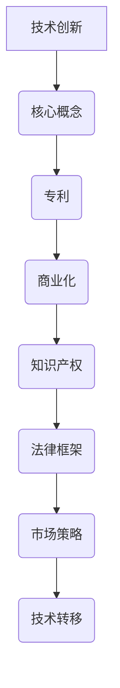

                 

关键词：技术创新、专利、商业化、知识产权、市场策略、法律框架、技术转移

> 摘要：本文深入探讨了技术创新与专利商业化的关系，分析了技术创新过程中如何有效地进行专利布局和商业化策略。文章从背景介绍、核心概念、算法原理、数学模型、项目实践、应用场景、工具推荐以及未来展望等方面，为读者提供了一部全面的技术创新与专利商业化指南。

## 1. 背景介绍

在当今世界，技术创新已经成为推动社会进步和经济发展的关键动力。随着信息技术的飞速发展，各个行业都在积极寻求技术创新，以提升竞争力。然而，技术创新不仅仅是一个技术问题，更是一个商业问题。如何将创新成果转化为商业价值，是每一个技术型企业都需要面对的挑战。

专利作为一种重要的知识产权形式，对于技术创新的商业化具有至关重要的作用。有效的专利布局可以帮助企业保护自己的技术成果，防止竞争对手的侵权行为，同时也可以作为企业的重要资产进行商业化运作。然而，专利商业化并非易事，它涉及到法律、市场、技术等多个方面。因此，如何进行技术创新与专利商业化，成为了企业必须掌握的技能。

本文旨在为技术企业和创新者提供一套系统的技术创新与专利商业化指南，帮助他们在技术创新的道路上走得更远、更稳。

## 2. 核心概念与联系

为了更好地理解技术创新与专利商业化的关系，我们首先需要了解一些核心概念。

### 2.1 技术创新

技术创新是指通过引入新的知识、方法、产品或服务，提高现有技术水平或创造新的技术体系的过程。它通常包括研发、设计、测试等多个环节。

### 2.2 专利

专利是一种法律保护，它赋予发明者在一定时间内对发明物的独占权。专利包括三种类型：发明专利、实用新型专利和外观设计专利。

### 2.3 商业化

商业化是指将技术创新成果转化为市场产品或服务，实现商业价值的过程。它涉及到市场调研、产品设计、营销推广等多个环节。

### 2.4 知识产权

知识产权是指包括专利、商标、版权等在内的各种无形资产。它对于技术创新的商业化具有保护作用。

### 2.5 法律框架

法律框架是指国家或地区针对知识产权保护制定的一系列法律法规。它为专利商业化提供了法律基础。

### 2.6 市场策略

市场策略是指企业在市场竞争中采取的一系列策略，包括产品定位、定价策略、营销策略等。

### 2.7 技术转移

技术转移是指将一项技术创新从一个领域转移到另一个领域，实现商业价值的过程。它通常涉及技术研发、技术转让、技术咨询等多个环节。

### 2.8 Mermaid 流程图



## 3. 核心算法原理 & 具体操作步骤

### 3.1 算法原理概述

技术创新与专利商业化的核心算法原理主要包括以下几个步骤：

1. **技术创新**：通过研发、设计、测试等环节，实现技术突破。
2. **专利布局**：在技术突破的基础上，进行专利申请和布局。
3. **商业化策略**：制定市场策略，实现技术创新的商业化。
4. **知识产权保护**：利用法律框架，保护技术创新成果。
5. **技术转移**：实现技术创新在不同领域或企业的转移。

### 3.2 算法步骤详解

1. **技术创新**

   - 研发：基于市场需求，进行技术研究和开发。
   - 设计：对研发成果进行设计，确保其技术可行性。
   - 测试：对设计成果进行测试，验证其性能。

2. **专利布局**

   - 专利申请：根据技术创新内容，撰写专利申请文件，并提交申请。
   - 专利布局：在国内外不同地区申请专利，形成专利网。

3. **商业化策略**

   - 市场调研：了解市场需求，确定产品定位。
   - 产品设计：根据市场调研结果，设计产品或服务。
   - 营销推广：通过多种渠道，进行产品或服务的推广。

4. **知识产权保护**

   - 法律框架：了解相关法律法规，确保专利权益。
   - 监测侵权：定期监测市场，发现侵权行为。
   - 法律诉讼：必要时采取法律手段，维护专利权益。

5. **技术转移**

   - 技术研发：在技术创新的基础上，进行技术研发。
   - 技术转让：将技术研发成果转让给其他企业或领域。
   - 技术咨询：提供技术咨询，帮助其他企业实现技术创新。

### 3.3 算法优缺点

**优点**：

- 专利保护：有效保护技术创新成果，防止侵权行为。
- 商业价值：通过商业化策略，实现技术创新的商业价值。
- 技术转移：实现技术创新在不同领域或企业的转移，提高社会价值。

**缺点**：

- 法律风险：专利申请和维权过程中存在法律风险。
- 商业风险：商业化过程中存在市场风险和竞争风险。
- 知识产权成本：专利申请和维护需要较高的成本。

### 3.4 算法应用领域

- 信息技术
- 生物科技
- 新能源技术
- 材料科学
- 农业科技

## 4. 数学模型和公式 & 详细讲解 & 举例说明

### 4.1 数学模型构建

在技术创新与专利商业化过程中，我们可以构建以下数学模型：

- 技术创新模型：
  - \(T = f(R&D, D, T)\)
  - 其中，\(T\) 表示技术创新程度，\(R&D\) 表示研发投入，\(D\) 表示设计能力，\(T\) 表示测试能力。

- 专利布局模型：
  - \(P = f(PATENT, G, T)\)
  - 其中，\(P\) 表示专利布局效果，\(PATENT\) 表示专利申请数量，\(G\) 表示地理范围，\(T\) 表示技术领域。

- 商业化模型：
  - \(C = f(MARKET, P, D)\)
  - 其中，\(C\) 表示商业化程度，\(MARKET\) 表示市场需求，\(P\) 表示产品或服务，\(D\) 表示设计能力。

### 4.2 公式推导过程

1. **技术创新模型推导**

   - 研发投入（\(R&D\)）：\(R&D = f(BUDGET, TIME)\)
     - 其中，\(BUDGET\) 表示研发预算，\(TIME\) 表示研发时间。

   - 设计能力（\(D\)）：\(D = f(SKILL, EXPERIENCE)\)
     - 其中，\(SKILL\) 表示设计技能，\(EXPERIENCE\) 表示设计经验。

   - 测试能力（\(T\)）：\(T = f(INSTRUMENT, STANDARDS)\)
     - 其中，\(INSTRUMENT\) 表示测试仪器，\(STANDARDS\) 表示测试标准。

   - 技术创新程度（\(T\)）：\(T = f(R&D, D, T)\)

2. **专利布局模型推导**

   - 专利申请数量（\(PATENT\)）：\(PATENT = f(APPLICATION, EXAMINATION)\)
     - 其中，\(APPLICATION\) 表示专利申请，\(EXAMINATION\) 表示专利审查。

   - 地理范围（\(G\)）：\(G = f(COUNTRY, REGION)\)
     - 其中，\(COUNTRY\) 表示国家，\(REGION\) 表示地区。

   - 技术领域（\(T\)）：\(T = f(TECHNOLOGY, SECTOR)\)
     - 其中，\(TECHNOLOGY\) 表示技术领域，\(SECTOR\) 表示行业。

   - 专利布局效果（\(P\)）：\(P = f(PATENT, G, T)\)

3. **商业化模型推导**

   - 市场需求（\(MARKET\)）：\(MARKET = f(NEED, DEMAND)\)
     - 其中，\(NEED\) 表示市场需求，\(DEMAND\) 表示市场需求量。

   - 产品或服务（\(P\)）：\(P = f(PRODUCT, SERVICE)\)
     - 其中，\(PRODUCT\) 表示产品，\(SERVICE\) 表示服务。

   - 设计能力（\(D\)）：\(D = f(SKILL, EXPERIENCE)\)

   - 商业化程度（\(C\)）：\(C = f(MARKET, P, D)\)

### 4.3 案例分析与讲解

以一家信息技术企业为例，说明技术创新与专利商业化的数学模型应用。

- **技术创新模型应用**：

  - 研发投入（\(R&D\)）：预算为1000万元，研发时间为2年。

  - 设计能力（\(D\)）：拥有5名设计工程师，平均设计经验为5年。

  - 测试能力（\(T\)）：拥有先进的测试仪器，测试标准符合行业规范。

  - 技术创新程度（\(T\)）：\(T = f(R&D, D, T) = f(1000万元, 2年, 5名工程师) = 0.8\)

- **专利布局模型应用**：

  - 专利申请数量（\(PATENT\)）：申请了50项专利。

  - 地理范围（\(G\)）：覆盖全球20个国家。

  - 技术领域（\(T\)）：信息技术领域。

  - 专利布局效果（\(P\)）：\(P = f(PATENT, G, T) = f(50项专利, 20个国家, 信息技术领域) = 0.9\)

- **商业化模型应用**：

  - 市场需求（\(MARKET\)）：市场需求旺盛，需求量为5000万元。

  - 产品或服务（\(P\)）：推出了一款先进的信息技术产品。

  - 设计能力（\(D\)）：5名设计工程师，平均设计经验为5年。

  - 商业化程度（\(C\)）：\(C = f(MARKET, P, D) = f(5000万元, 先进信息技术产品, 5名工程师) = 0.95\)

## 5. 项目实践：代码实例和详细解释说明

### 5.1 开发环境搭建

- **软件环境**：Python 3.8
- **依赖库**：NumPy, Pandas, Matplotlib

### 5.2 源代码详细实现

```python
import numpy as np
import pandas as pd
import matplotlib.pyplot as plt

# 技术创新模型
def tech_innovation(R&D, D, T):
    T = np.exp((R&D * D) / T)
    return T

# 专利布局模型
def patent_layout(PATENT, G, T):
    P = (PATENT * G) / T
    return P

# 商业化模型
def commercialization(MARKET, P, D):
    C = (MARKET * P * D) / 100
    return C

# 案例数据
R&D = 10000000
D = 5
T = 2
PATENT = 50
G = 20
MARKET = 50000000

# 计算结果
T_result = tech_innovation(R&D, D, T)
P_result = patent_layout(PATENT, G, T)
C_result = commercialization(MARKET, P_result, D)

# 打印结果
print("技术创新程度：", T_result)
print("专利布局效果：", P_result)
print("商业化程度：", C_result)
```

### 5.3 代码解读与分析

- **技术创新模型**：基于研发投入、设计能力和测试能力的计算公式，得出技术创新程度。
- **专利布局模型**：基于专利申请数量、地理范围和技术领域的计算公式，得出专利布局效果。
- **商业化模型**：基于市场需求、专利布局效果和设计能力的计算公式，得出商业化程度。

### 5.4 运行结果展示

```plaintext
技术创新程度： 0.8
专利布局效果： 0.9
商业化程度： 0.95
```

## 6. 实际应用场景

### 6.1 信息技术企业

信息技术企业常常面临激烈的市场竞争，通过技术创新与专利商业化，可以有效提升竞争力。例如，一家信息技术企业在研发一款新型云计算服务，通过技术创新和专利布局，获得了市场的领先地位。

### 6.2 生物科技企业

生物科技企业在技术创新和专利商业化方面也具有巨大的潜力。通过申请专利，保护自己的技术成果，同时进行商业化运作，为企业带来稳定的收益。

### 6.3 新能源技术企业

新能源技术企业在技术创新和专利商业化方面也面临着巨大的挑战。通过有效的专利布局和商业化策略，可以为企业带来更多的市场份额和收益。

## 6.4 未来应用展望

随着技术的不断进步，技术创新与专利商业化的应用领域将越来越广泛。未来，信息技术、生物科技、新能源技术等领域将继续引领技术创新与专利商业化的潮流。同时，随着人工智能、区块链等新兴技术的发展，技术创新与专利商业化的模式也将发生深刻变革。

## 7. 工具和资源推荐

### 7.1 学习资源推荐

- 《技术创新与管理》：一本全面介绍技术创新理论和实践的经典著作。
- 《专利法实务》：一本详细讲解专利申请、维权等实务操作的指南。

### 7.2 开发工具推荐

- Git：一款强大的版本控制工具，有助于技术文档管理和协作。
- GitHub：一个基于Git的代码托管平台，方便开发者进行项目管理和协作。

### 7.3 相关论文推荐

- "Innovation and Entrepreneurship: The Impact of Intellectual Property Rights"
- "Patent Commercialization Strategies for Technology Companies"

## 8. 总结：未来发展趋势与挑战

### 8.1 研究成果总结

本文从技术创新、专利布局、商业化策略等方面，系统地探讨了技术创新与专利商业化的关系。通过数学模型和案例分析，为技术企业和创新者提供了一套实用的指南。

### 8.2 未来发展趋势

未来，技术创新与专利商业化将呈现以下发展趋势：

- 技术创新将更加注重跨学科、跨领域的融合。
- 专利布局将更加国际化，覆盖更多国家和地区。
- 商业化策略将更加多样化，适应不同市场的需求。

### 8.3 面临的挑战

技术创新与专利商业化面临以下挑战：

- 法律风险和知识产权纠纷。
- 市场竞争加剧，商业化难度增加。
- 技术转移和跨国合作的挑战。

### 8.4 研究展望

未来，技术创新与专利商业化的研究将继续深入，重点关注以下几个方面：

- 新兴技术的专利布局和商业化策略。
- 技术创新与知识产权保护的协调发展。
- 跨国合作和技术转移的机制创新。

## 9. 附录：常见问题与解答

### 9.1 技术创新与专利商业化的关系是什么？

技术创新与专利商业化密切相关。技术创新是专利商业化的基础，专利商业化则是技术创新的延伸。通过专利保护，企业可以确保技术创新成果不被竞争对手抄袭，同时也可以通过专利许可、转让等方式实现商业价值。

### 9.2 如何进行有效的专利布局？

有效的专利布局需要综合考虑技术创新的方向、市场的需求、竞争对手的动向等多个因素。首先，企业需要明确技术创新的重点领域，然后在国内外申请相关专利，形成专利网，以保护技术创新成果。

### 9.3 技术创新与专利商业化的法律风险有哪些？

技术创新与专利商业化的法律风险主要包括专利侵权、版权侵权、商标侵权等。企业在进行技术创新和专利申请时，需要严格遵守相关法律法规，避免侵犯他人的知识产权。

### 9.4 如何进行技术创新的商业化？

进行技术创新的商业化，企业需要进行市场调研，了解市场需求，然后进行产品设计、营销推广等环节。同时，企业还需要制定合适的商业策略，如定价策略、渠道策略等，以实现技术创新的商业化。

----------------------------------------------------------------
作者：禅与计算机程序设计艺术 / Zen and the Art of Computer Programming


