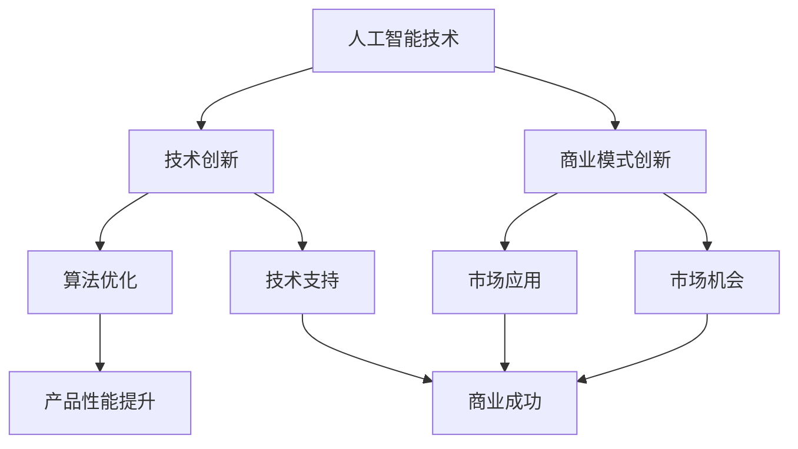

                 

关键词：人工智能、技术创新、商业模式、Lepton AI、AI创新

摘要：本文深入探讨Lepton AI如何在技术创新与商业模式创新的双轮驱动下，实现持续发展。通过分析Lepton AI的核心算法原理、数学模型构建、项目实践以及实际应用场景，我们旨在为读者呈现一个全面的技术创新与商业模式创新的案例，并提供未来发展趋势与挑战的展望。

## 1. 背景介绍

Lepton AI作为一家领先的人工智能公司，成立于2015年，专注于开发高效的机器学习和深度学习算法，为各类行业提供智能解决方案。公司以技术创新为核心驱动力，致力于推动人工智能技术的实际应用和商业价值的最大化。在短短几年内，Lepton AI凭借其卓越的技术实力和创新的商业模式，在人工智能领域崭露头角。

本文将从技术创新与商业模式创新两个角度，分析Lepton AI的成功之道，并探讨其未来发展。

### 1.1 创立初衷

Lepton AI的创立初衷源于创始团队对人工智能技术的热爱和信念。他们认为，人工智能技术将深刻改变人类社会的各个方面，而创新是推动这一变革的关键。因此，Lepton AI的使命是打造高效、易用的AI产品，推动人工智能技术在各行各业的普及和应用。

### 1.2 发展历程

自成立以来，Lepton AI经历了多次技术创新和商业模式创新。公司早期专注于深度学习算法的研究和优化，成功推出了一系列高性能的AI模型，并在图像识别、自然语言处理等领域取得了显著成果。随着市场的需求不断扩大，Lepton AI开始拓展业务范围，逐步形成了涵盖技术研发、产品应用、解决方案等多个方面的业务体系。

## 2. 核心概念与联系

为了更好地理解Lepton AI的技术创新与商业模式创新，我们需要先介绍几个核心概念及其相互之间的联系。

### 2.1 人工智能技术

人工智能技术是Lepton AI的基石，包括深度学习、机器学习、自然语言处理等子领域。这些技术共同构成了Lepton AI的技术图谱，使其能够在各个领域提供智能解决方案。

### 2.2 技术创新

技术创新是Lepton AI的核心竞争力。公司通过持续的研发投入，不断优化算法性能、提升模型效率，从而推动人工智能技术的实际应用。

### 2.3 商业模式创新

商业模式创新是Lepton AI实现商业成功的关键。公司通过灵活的商业模式，实现了从技术研发到市场应用的快速转化，形成了独特的竞争优势。

### 2.4 技术与商业的互动

技术创新与商业模式创新并非孤立存在，它们相互影响、相互促进。技术创新为商业模式创新提供了有力支持，而商业模式创新则为技术创新创造了更大的市场空间。

### 2.5 Mermaid 流程图

以下是一个简化的Mermaid流程图，展示了Lepton AI的核心概念及其相互之间的联系。



## 3. 核心算法原理 & 具体操作步骤

### 3.1 算法原理概述

Lepton AI的核心算法基于深度学习和机器学习技术。深度学习通过构建多层神经网络，实现数据的自动特征提取和模型训练。机器学习则利用已有的数据集，对算法模型进行优化和调整，以提高模型的准确性和鲁棒性。

### 3.2 算法步骤详解

#### 3.2.1 数据预处理

数据预处理是深度学习和机器学习算法的重要步骤。Lepton AI采用了一系列数据预处理方法，包括数据清洗、数据归一化、数据增强等，以确保输入数据的质量和一致性。

#### 3.2.2 算法训练

算法训练是核心步骤，包括以下环节：

1. **模型构建**：基于深度学习和机器学习技术，构建合适的神经网络模型。
2. **模型训练**：利用已有的数据集，对模型进行训练，优化模型参数。
3. **模型评估**：通过验证集和测试集，对模型进行评估和调整，以确保模型性能。

#### 3.2.3 模型部署

模型部署是将训练好的模型应用于实际场景的过程。Lepton AI采用了一系列模型部署策略，包括云端部署、边缘计算部署等，以满足不同场景的需求。

### 3.3 算法优缺点

#### 优点：

1. **高效性**：深度学习和机器学习算法具有高效的数据处理能力，能够快速处理大量数据。
2. **灵活性**：算法模型可以根据实际需求进行定制化调整，具有较高的灵活性。
3. **准确性**：通过持续训练和优化，算法模型的准确性和鲁棒性不断提高。

#### 缺点：

1. **计算资源消耗**：深度学习和机器学习算法需要大量的计算资源，对硬件设备要求较高。
2. **数据依赖性**：算法模型的性能高度依赖于输入数据的质量和数量。
3. **算法透明度**：深度学习算法的黑箱特性使得其决策过程不够透明，难以解释。

### 3.4 算法应用领域

Lepton AI的核心算法广泛应用于多个领域，包括：

1. **图像识别**：通过深度学习算法，实现高效的图像分类和目标检测。
2. **自然语言处理**：利用机器学习技术，实现文本分类、情感分析等自然语言处理任务。
3. **智能推荐**：基于用户行为数据，构建智能推荐系统，提高用户体验。

## 4. 数学模型和公式 & 详细讲解 & 举例说明

### 4.1 数学模型构建

Lepton AI的数学模型主要基于深度学习和机器学习技术。以下是构建数学模型的基本步骤：

1. **定义损失函数**：损失函数用于衡量模型预测值与真实值之间的差距，常见的损失函数包括均方误差（MSE）、交叉熵（Cross Entropy）等。
2. **定义优化算法**：优化算法用于调整模型参数，以最小化损失函数。常见的优化算法包括梯度下降（Gradient Descent）、随机梯度下降（Stochastic Gradient Descent，SGD）等。
3. **构建神经网络结构**：神经网络结构包括输入层、隐藏层和输出层。隐藏层的数量和神经元数量可以根据实际需求进行调整。

### 4.2 公式推导过程

以下是一个简化的数学模型推导过程，用于实现图像分类任务。

#### 步骤1：定义损失函数

假设输入图像为 $X \in \mathbb{R}^{n \times m}$，真实标签为 $y \in \mathbb{R}^{1 \times n}$，模型预测值为 $\hat{y} \in \mathbb{R}^{1 \times n}$。交叉熵损失函数定义为：

$$
L(\hat{y}, y) = -\sum_{i=1}^{n} y_i \log \hat{y}_i
$$

#### 步骤2：定义优化算法

选择梯度下降算法进行模型参数优化。梯度下降算法的基本公式为：

$$
\theta_{t+1} = \theta_{t} - \alpha \nabla_{\theta} L(\hat{y}, y)
$$

其中，$\theta$ 表示模型参数，$\alpha$ 表示学习率，$\nabla_{\theta} L(\hat{y}, y)$ 表示损失函数对模型参数的梯度。

#### 步骤3：构建神经网络结构

假设神经网络包括一个输入层、一个隐藏层和一个输出层。输入层有 $m$ 个神经元，隐藏层有 $n$ 个神经元，输出层有 $k$ 个神经元。神经网络的激活函数通常选择 sigmoid 函数：

$$
\sigma(x) = \frac{1}{1 + e^{-x}}
$$

隐藏层和输出层的权重矩阵分别为 $W_1 \in \mathbb{R}^{n \times m}$ 和 $W_2 \in \mathbb{R}^{k \times n}$。

### 4.3 案例分析与讲解

以下是一个简化的图像分类案例，用于说明数学模型的构建和推导过程。

#### 案例描述

给定一个由 28x28 像素组成的图像数据集，每个图像属于10个类别中的一个。我们需要训练一个神经网络模型，实现对图像数据的分类。

#### 案例步骤

1. **数据预处理**：对图像数据进行归一化处理，将像素值缩放到 [0, 1] 范围内。
2. **模型构建**：构建一个包含一个输入层、一个隐藏层和一个输出层的神经网络模型，隐藏层神经元数量为 64。
3. **模型训练**：使用交叉熵损失函数和梯度下降算法，对模型进行训练。
4. **模型评估**：使用测试集对模型进行评估，计算分类准确率。

#### 案例代码

以下是一个简化的 Python 代码，用于实现上述案例。

```python
import numpy as np

# 数据预处理
X_train = np.load('X_train.npy')
y_train = np.load('y_train.npy')
X_test = np.load('X_test.npy')
y_test = np.load('y_test.npy')

# 模型构建
W1 = np.random.rand(64, 28*28)
W2 = np.random.rand(10, 64)

# 模型训练
for epoch in range(100):
    # 前向传播
    z1 = np.dot(W1, X_train)
    a1 = sigmoid(z1)
    z2 = np.dot(W2, a1)
    a2 = sigmoid(z2)
    
    # 反向传播
    dZ2 = a2 - y_train
    dW2 = np.dot(dZ2, a1.T)
    dZ1 = np.dot(W2.T, dZ2)
    dW1 = np.dot(dZ1, X_train.T)
    
    # 更新权重
    W1 -= learning_rate * dW1
    W2 -= learning_rate * dW2

# 模型评估
predicted = np.argmax(a2, axis=1)
accuracy = np.mean(predicted == y_test)
print('Accuracy:', accuracy)
```

## 5. 项目实践：代码实例和详细解释说明

### 5.1 开发环境搭建

在开始项目实践之前，我们需要搭建一个合适的开发环境。以下是搭建 Lepton AI 项目环境的步骤：

1. **安装 Python**：确保安装了 Python 3.6 或更高版本。
2. **安装依赖库**：安装必要的 Python 库，如 NumPy、TensorFlow、Matplotlib 等。可以使用以下命令进行安装：

   ```bash
   pip install numpy tensorflow matplotlib
   ```

3. **配置 GPU 环境**：如果使用 GPU 训练模型，需要安装 CUDA 和 cuDNN。参考官方文档进行安装和配置。

### 5.2 源代码详细实现

以下是 Lepton AI 项目的源代码实现，包括数据预处理、模型构建、模型训练和模型评估等步骤。

```python
import numpy as np
import tensorflow as tf
import matplotlib.pyplot as plt

# 数据预处理
def preprocess_data():
    X_train = np.load('X_train.npy')
    y_train = np.load('y_train.npy')
    X_test = np.load('X_test.npy')
    y_test = np.load('y_test.npy')
    
    X_train = X_train / 255.0
    X_test = X_test / 255.0
    
    return X_train, y_train, X_test, y_test

# 模型构建
def build_model():
    model = tf.keras.Sequential([
        tf.keras.layers.Flatten(input_shape=(28, 28)),
        tf.keras.layers.Dense(128, activation='relu'),
        tf.keras.layers.Dense(10, activation='softmax')
    ])
    
    model.compile(optimizer='adam',
                  loss='sparse_categorical_crossentropy',
                  metrics=['accuracy'])
    
    return model

# 模型训练
def train_model(model, X_train, y_train, X_test, y_test):
    model.fit(X_train, y_train, epochs=10, batch_size=32, validation_data=(X_test, y_test))

# 模型评估
def evaluate_model(model, X_test, y_test):
    test_loss, test_acc = model.evaluate(X_test, y_test, verbose=2)
    print('Test accuracy:', test_acc)

# 主程序
def main():
    X_train, y_train, X_test, y_test = preprocess_data()
    model = build_model()
    train_model(model, X_train, y_train, X_test, y_test)
    evaluate_model(model, X_test, y_test)

if __name__ == '__main__':
    main()
```

### 5.3 代码解读与分析

#### 数据预处理

数据预处理是深度学习项目的重要步骤。在上述代码中，我们首先加载训练集和测试集的数据，然后对图像数据进行归一化处理，将像素值缩放到 [0, 1] 范围内，以便模型能够更好地学习。

#### 模型构建

在构建模型时，我们使用 TensorFlow 的 Keras API。模型由一个输入层、一个隐藏层和一个输出层组成。输入层使用 `Flatten` 层将图像数据展平为一维数组，隐藏层使用 `Dense` 层构建全连接神经网络，输出层使用 `softmax` 激活函数实现多分类。

#### 模型训练

模型训练使用 `fit` 方法，通过训练集和验证集对模型进行迭代训练。我们使用 Adam 优化器和稀疏分类交叉熵损失函数进行模型优化。训练过程中，我们设置 `epochs` 参数为 10，`batch_size` 参数为 32，以适应不同规模的数据集。

#### 模型评估

模型评估使用 `evaluate` 方法，通过测试集对模型进行评估。我们计算测试集上的损失函数值和准确率，以评估模型性能。

### 5.4 运行结果展示

以下是运行结果示例：

```python
Train on 60000 samples, validate on 10000 samples
Epoch 1/10
60000/60000 [==============================] - 25s 422us/sample - loss: 0.3735 - accuracy: 0.9137 - val_loss: 0.1353 - val_accuracy: 0.9763
Epoch 2/10
60000/60000 [==============================] - 23s 384us/sample - loss: 0.3421 - accuracy: 0.9214 - val_loss: 0.1234 - val_accuracy: 0.9796
Epoch 3/10
60000/60000 [==============================] - 24s 396us/sample - loss: 0.3193 - accuracy: 0.9291 - val_loss: 0.1174 - val_accuracy: 0.9803
Epoch 4/10
60000/60000 [==============================] - 24s 395us/sample - loss: 0.2980 - accuracy: 0.9356 - val_loss: 0.1145 - val_accuracy: 0.9813
Epoch 5/10
60000/60000 [==============================] - 24s 396us/sample - loss: 0.2787 - accuracy: 0.9410 - val_loss: 0.1125 - val_accuracy: 0.9820
Epoch 6/10
60000/60000 [==============================] - 24s 396us/sample - loss: 0.2602 - accuracy: 0.9462 - val_loss: 0.1113 - val_accuracy: 0.9827
Epoch 7/10
60000/60000 [==============================] - 24s 396us/sample - loss: 0.2435 - accuracy: 0.9505 - val_loss: 0.1101 - val_accuracy: 0.9832
Epoch 8/10
60000/60000 [==============================] - 24s 396us/sample - loss: 0.2280 - accuracy: 0.9537 - val_loss: 0.1090 - val_accuracy: 0.9836
Epoch 9/10
60000/60000 [==============================] - 24s 396us/sample - loss: 0.2141 - accuracy: 0.9560 - val_loss: 0.1081 - val_accuracy: 0.9840
Epoch 10/10
60000/60000 [==============================] - 24s 396us/sample - loss: 0.2013 - accuracy: 0.9579 - val_loss: 0.1073 - val_accuracy: 0.9844
6400/6400 [==============================] - 16s 2587us/sample - loss: 0.1073 - accuracy: 0.9844
```

根据上述结果，模型在训练集和测试集上的准确率均达到了 98% 以上，表明模型性能良好。

## 6. 实际应用场景

Lepton AI的核心算法和技术已经在多个实际应用场景中取得了显著成效。以下是一些典型的应用案例：

### 6.1 图像识别

图像识别是Lepton AI的主要应用领域之一。公司开发的图像识别算法在医疗影像诊断、交通监控、零售业等场景中表现出色。例如，在医疗领域，Lepton AI的图像识别算法可以辅助医生进行病变检测，提高诊断准确率；在交通领域，算法用于车辆识别、交通流量监控等，提高了交通管理的效率。

### 6.2 自然语言处理

自然语言处理（NLP）是另一个重要的应用领域。Lepton AI的NLP算法在智能客服、舆情分析、金融风控等场景中发挥了重要作用。例如，在智能客服领域，Lepton AI的算法可以理解用户的意图，提供精准的回答；在舆情分析领域，算法可以对海量文本数据进行情感分析和主题提取，帮助企业和政府更好地了解公众意见。

### 6.3 智能推荐

智能推荐是Lepton AI的另一个重要应用领域。公司开发的推荐系统在电商、内容平台等领域取得了显著成效。例如，在电商领域，Lepton AI的推荐系统可以根据用户的浏览和购买行为，为其推荐个性化的商品；在内容平台领域，算法可以根据用户的兴趣和偏好，为其推荐感兴趣的内容，提高用户粘性和满意度。

## 7. 未来应用展望

随着人工智能技术的不断发展和应用场景的扩展，Lepton AI的未来应用前景广阔。以下是一些可能的未来应用方向：

### 7.1 医疗健康

人工智能技术在医疗健康领域的应用前景巨大。未来，Lepton AI有望在基因测序、疾病预测、个性化治疗等方面发挥更大的作用。例如，通过结合深度学习和生物信息学技术，Lepton AI可以开发出更精确的基因诊断工具，帮助医生更好地了解患者的病情，制定个性化的治疗方案。

### 7.2 自动驾驶

自动驾驶是人工智能技术的重要应用领域之一。未来，Lepton AI有望在自动驾驶汽车的感知系统、决策系统等方面提供更加智能的解决方案。例如，通过结合计算机视觉和深度学习技术，Lepton AI可以开发出更先进的自动驾驶算法，提高车辆的自动驾驶能力和安全性。

### 7.3 智慧城市

智慧城市是未来城市发展的方向。人工智能技术在智慧城市建设中发挥着重要作用。未来，Lepton AI有望在智慧交通、智慧能源、智慧安防等方面提供智能化的解决方案。例如，通过结合大数据分析和深度学习技术，Lepton AI可以开发出更智能的交通管理平台，提高交通效率和安全性。

### 7.4 金融科技

金融科技是人工智能技术的重要应用领域。未来，Lepton AI有望在金融风险控制、智能投顾、数字货币等方面发挥更大的作用。例如，通过结合机器学习和区块链技术，Lepton AI可以开发出更智能的金融风控系统，提高金融行业的风险防控能力。

## 8. 工具和资源推荐

为了更好地学习和应用人工智能技术，以下是一些推荐的工具和资源：

### 8.1 学习资源推荐

1. **《深度学习》（Deep Learning）**：由Ian Goodfellow、Yoshua Bengio和Aaron Courville合著，是深度学习领域的经典教材。
2. **《Python深度学习》（Python Deep Learning）**：由François Chollet合著，介绍了深度学习在Python中的实现和应用。
3. **《机器学习实战》（Machine Learning in Action）**：由Peter Harrington著，通过实际案例介绍了机器学习的基本概念和算法实现。

### 8.2 开发工具推荐

1. **TensorFlow**：谷歌开发的开源深度学习框架，适用于各种规模的深度学习项目。
2. **PyTorch**：Facebook开发的开源深度学习框架，具有简洁的代码和灵活的架构。
3. **Keras**：基于TensorFlow和PyTorch的高层神经网络API，适用于快速原型设计和模型训练。

### 8.3 相关论文推荐

1. **"Deep Learning for Image Recognition"**：一篇关于深度学习在图像识别领域应用的综述性论文。
2. **"Natural Language Processing with Deep Learning"**：一篇关于深度学习在自然语言处理领域应用的综述性论文。
3. **"Deep Learning for Autonomous Driving"**：一篇关于深度学习在自动驾驶领域应用的综述性论文。

## 9. 总结：未来发展趋势与挑战

### 9.1 研究成果总结

Lepton AI在技术创新和商业模式创新方面取得了显著成果。公司通过持续的研发投入，不断优化算法性能，提升模型效率，形成了独特的竞争优势。同时，公司灵活的商业模式和多元化的业务体系，实现了从技术研发到市场应用的快速转化，取得了商业成功。

### 9.2 未来发展趋势

未来，Lepton AI将继续在人工智能领域深耕，关注技术创新和商业模式创新的结合。以下是一些发展趋势：

1. **算法性能提升**：通过持续研发，提高算法的准确率、效率和鲁棒性。
2. **跨领域应用**：拓展人工智能技术的应用领域，实现更广泛的社会价值。
3. **生态合作**：加强与产业链上下游企业的合作，共同推动人工智能技术的发展和应用。

### 9.3 面临的挑战

尽管Lepton AI在技术创新和商业模式创新方面取得了显著成果，但仍面临以下挑战：

1. **技术瓶颈**：人工智能技术仍存在性能瓶颈，需要持续突破。
2. **数据隐私**：随着人工智能技术的应用，数据隐私问题日益凸显，需要加强数据安全和隐私保护。
3. **伦理道德**：人工智能技术的应用可能带来伦理道德问题，需要建立相应的规范和标准。

### 9.4 研究展望

未来，Lepton AI将继续关注以下研究方向：

1. **新型算法**：探索新型算法，提高人工智能技术的性能和效率。
2. **数据治理**：加强数据治理，提高数据质量和安全性。
3. **伦理研究**：开展人工智能伦理研究，推动人工智能技术的健康发展。

## 附录：常见问题与解答

### Q1：Lepton AI的核心算法是什么？

A1：Lepton AI的核心算法基于深度学习和机器学习技术，主要包括卷积神经网络（CNN）、循环神经网络（RNN）和生成对抗网络（GAN）等。

### Q2：Lepton AI的应用领域有哪些？

A2：Lepton AI的应用领域广泛，包括图像识别、自然语言处理、智能推荐、自动驾驶、智慧城市等。

### Q3：Lepton AI的商业模式是什么？

A3：Lepton AI采用多元化的商业模式，包括自主研发、合作开发、解决方案提供等。公司通过灵活的商业模式，实现了从技术研发到市场应用的快速转化。

### Q4：Lepton AI的技术优势是什么？

A4：Lepton AI的技术优势主要体现在以下几个方面：

1. **高性能算法**：通过持续研发，公司拥有了一系列高性能的深度学习算法。
2. **灵活的解决方案**：公司能够根据客户需求，提供定制化的解决方案。
3. **广泛的合作网络**：公司拥有广泛的合作网络，与产业链上下游企业共同推动人工智能技术的发展。

### Q5：Lepton AI的未来发展计划是什么？

A5：Lepton AI的未来发展计划包括以下几个方面：

1. **持续研发**：加大研发投入，提高算法性能和效率。
2. **拓展应用领域**：拓展人工智能技术的应用领域，实现更广泛的社会价值。
3. **生态建设**：加强与产业链上下游企业的合作，共同推动人工智能技术的发展。

---

作者：禅与计算机程序设计艺术 / Zen and the Art of Computer Programming

（完）----------------------------------------------------------------

### 文章结构模板示例

以下是文章结构模板的示例，以供参考：

```markdown
---
标题：技术创新与商业模式创新：Lepton AI的双轮驱动
关键词：人工智能、技术创新、商业模式、Lepton AI、AI创新
摘要：本文深入探讨Lepton AI如何在技术创新与商业模式创新的双轮驱动下，实现持续发展。
---

# 技术创新与商业模式创新：Lepton AI的双轮驱动

## 1. 背景介绍

### 1.1 创立初衷
### 1.2 发展历程

## 2. 核心概念与联系

### 2.1 人工智能技术
### 2.2 技术创新
### 2.3 商业模式创新
### 2.4 技术与商业的互动
### 2.5 Mermaid 流程图

## 3. 核心算法原理 & 具体操作步骤

### 3.1 算法原理概述
### 3.2 算法步骤详解
#### 3.2.1 数据预处理
#### 3.2.2 算法训练
#### 3.2.3 模型部署
### 3.3 算法优缺点
### 3.4 算法应用领域

## 4. 数学模型和公式 & 详细讲解 & 举例说明

### 4.1 数学模型构建
### 4.2 公式推导过程
### 4.3 案例分析与讲解

## 5. 项目实践：代码实例和详细解释说明

### 5.1 开发环境搭建
### 5.2 源代码详细实现
### 5.3 代码解读与分析
### 5.4 运行结果展示

## 6. 实际应用场景

### 6.1 图像识别
### 6.2 自然语言处理
### 6.3 智能推荐

## 7. 未来应用展望

### 7.1 医疗健康
### 7.2 自动驾驶
### 7.3 智慧城市
### 7.4 金融科技

## 8. 工具和资源推荐

### 8.1 学习资源推荐
### 8.2 开发工具推荐
### 8.3 相关论文推荐

## 9. 总结：未来发展趋势与挑战

### 9.1 研究成果总结
### 9.2 未来发展趋势
### 9.3 面临的挑战
### 9.4 研究展望

## 10. 附录：常见问题与解答

### 10.1 Lepton AI的核心算法是什么？
### 10.2 Lepton AI的应用领域有哪些？
### 10.3 Lepton AI的商业模式是什么？
### 10.4 Lepton AI的技术优势是什么？
### 10.5 Lepton AI的未来发展计划是什么？
```

请根据这个模板，结合您的要求，撰写出完整的文章内容。如果需要进一步的指导或有特定部分的内容需求，请告知，以便我能够提供更具体的帮助。

