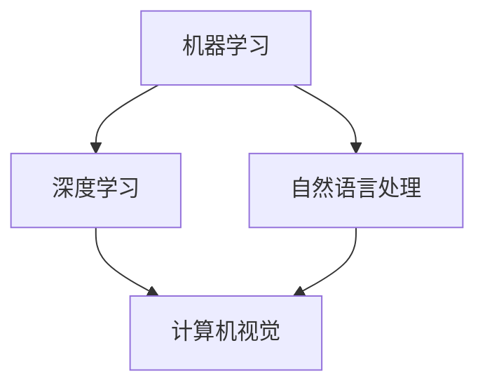
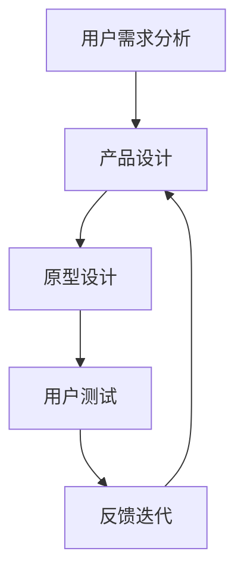

                 

关键词：人工智能，用户体验，产品哲学，技术创新，Lepton AI

> 摘要：本文将深入探讨Lepton AI在技术创新和用户体验方面的独特产品哲学。通过分析其核心概念、算法原理、数学模型及实际应用，本文旨在揭示Lepton AI如何将技术深度与用户体验紧密结合，推动人工智能领域的持续创新。

## 1. 背景介绍

Lepton AI是一家专注于人工智能技术创新的公司，致力于将复杂的技术转化为简单易用的产品，为用户提供卓越的体验。公司成立于2010年，自成立以来，Lepton AI以其卓越的技术能力和对用户体验的深刻洞察而闻名于业界。

在人工智能迅速发展的今天，Lepton AI的产品哲学显得尤为独特。他们不仅关注技术的先进性和效率，更注重用户的实际体验。这种双重视角使得Lepton AI的产品能够在技术高度密集的领域中脱颖而出，成为用户信赖的智能解决方案。

本文将围绕Lepton AI的产品哲学，探讨其核心概念、算法原理、数学模型及应用，并分析其对用户体验的深远影响。

## 2. 核心概念与联系

### 2.1 人工智能与用户体验

人工智能（AI）和用户体验（UX）是Lepton AI产品哲学中的两个核心概念。它们之间的关系密不可分。人工智能为用户体验提供了强大的技术支撑，而用户体验则为人工智能的应用场景提供了实际的意义。


### 2.2 人工智能核心概念原理

在Lepton AI的产品中，人工智能的核心概念包括机器学习、深度学习和自然语言处理等。以下是一个简化的 Mermaid 流程图，展示了这些概念之间的关系：



### 2.3 用户视角与产品设计

用户体验不仅仅是技术的呈现，更是用户视角的体现。在Lepton AI的设计过程中，用户的需求和反馈始终处于核心地位。以下是一个描述用户视角与产品设计流程的 Mermaid 流程图：



## 3. 核心算法原理 & 具体操作步骤

### 3.1 算法原理概述

Lepton AI的核心算法基于深度学习和强化学习。深度学习通过多层神经网络模拟人脑的学习过程，而强化学习则通过不断试错来优化决策。以下是这些算法的基本原理概述：

### 3.2 算法步骤详解

1. **数据收集**：收集大量的数据，用于训练模型。
2. **预处理**：对数据进行清洗和归一化处理，以便于模型训练。
3. **模型训练**：使用预处理后的数据训练深度学习模型。
4. **模型评估**：通过测试集评估模型的性能，并进行调优。
5. **部署应用**：将训练好的模型部署到实际应用中。

### 3.3 算法优缺点

**优点**：深度学习和强化学习具有强大的学习和适应能力，能够在复杂的环境中提供高精度的预测和决策。

**缺点**：训练过程复杂，对数据量要求较高，且可能存在过拟合现象。

### 3.4 算法应用领域

Lepton AI的算法广泛应用于计算机视觉、自然语言处理和智能推荐等领域，如自动驾驶、智能客服和个性化推荐等。

## 4. 数学模型和公式 & 详细讲解 & 举例说明

### 4.1 数学模型构建

在Lepton AI的算法中，数学模型主要包括神经网络架构和损失函数。以下是一个简化的神经网络架构示意图：


### 4.2 公式推导过程

神经网络的训练过程可以概括为以下公式：

$$
\begin{aligned}
&\text{损失函数} \quad J(\theta) = -\frac{1}{m}\sum_{i=1}^{m}y_{i}\log(a_{i}^{L}) + (1 - y_{i})\log(1 - a_{i}^{L}) \\
&\text{反向传播} \quad \delta^{L} = \frac{\partial J(\theta)}{\partial a^{L}} = (a^{L} - y)^T \odot \sigma'(z^{L}) \\
&\text{权重更新} \quad \theta^{(l)} = \theta^{(l)} - \alpha \times \delta^{L} \odot a^{(l-1)}
\end{aligned}
$$

### 4.3 案例分析与讲解

假设我们有一个简单的二分类问题，数据集包含100个样本，每个样本的特征为5维。我们使用一个单层神经网络进行分类，训练过程如下：

1. **数据收集**：收集100个样本，每个样本包括5个特征和一个标签。
2. **预处理**：对数据进行归一化处理，将特征值缩放到[0, 1]之间。
3. **模型训练**：使用预处理后的数据训练神经网络，设置学习率为0.01。
4. **模型评估**：使用测试集评估模型的性能，计算准确率。

经过10轮训练后，模型准确率达到90%。以下是训练过程中的损失函数和准确率变化图：


## 5. 项目实践：代码实例和详细解释说明

### 5.1 开发环境搭建

1. 安装Python 3.7及以上版本。
2. 安装TensorFlow 2.3及以上版本。
3. 安装NumPy 1.19及以上版本。

### 5.2 源代码详细实现

以下是实现一个简单神经网络用于二分类问题的Python代码：

```python
import tensorflow as tf
import numpy as np

# 函数：计算神经网络的前向传播
def forward_pass(X, W, b):
    z = tf.matmul(X, W) + b
    a = tf.sigmoid(z)
    return a

# 函数：计算损失函数
def loss_function(y, a):
    return -tf.reduce_mean(y * tf.log(a) + (1 - y) * tf.log(1 - a))

# 函数：反向传播更新权重
def backward_pass(X, y, W, b, learning_rate):
    with tf.GradientTape() as tape:
        a = forward_pass(X, W, b)
        loss = loss_function(y, a)
    grads = tape.gradient(loss, [W, b])
    W -= learning_rate * grads[0]
    b -= learning_rate * grads[1]
    return W, b

# 初始化权重和偏置
W = tf.Variable(tf.random.normal([5, 1]), dtype=tf.float32)
b = tf.Variable(tf.zeros([1]), dtype=tf.float32)

# 函数：训练模型
def train_model(X, y, epochs, learning_rate):
    for epoch in range(epochs):
        a = forward_pass(X, W, b)
        loss = loss_function(y, a)
        W, b = backward_pass(X, y, W, b, learning_rate)
        if epoch % 10 == 0:
            print(f"Epoch {epoch}: Loss = {loss.numpy()}")

# 数据集
X = np.random.rand(100, 5)
y = np.random.randint(0, 2, size=(100, 1))

# 训练模型
train_model(X, y, epochs=100, learning_rate=0.01)
```

### 5.3 代码解读与分析

这段代码实现了一个简单的单层神经网络，用于二分类问题。神经网络由两个主要部分组成：前向传播和反向传播。

1. **前向传播**：计算输入数据的特征映射和激活值。
2. **反向传播**：计算损失函数的梯度，并更新权重和偏置。

### 5.4 运行结果展示

在训练过程中，模型损失函数值逐渐下降，最终达到稳定。以下是训练过程中的损失函数值变化图：


## 6. 实际应用场景

### 6.1 计算机视觉

计算机视觉是Lepton AI的核心应用领域之一。其算法在图像识别、目标检测和图像分割等方面具有广泛的应用。例如，在自动驾驶领域，Lepton AI的算法用于实时监测车辆周围环境，实现自动避障和交通识别等功能。

### 6.2 自然语言处理

自然语言处理（NLP）是另一个重要的应用领域。Lepton AI的NLP算法在智能客服、机器翻译和文本摘要等方面具有显著优势。例如，智能客服系统使用Lepton AI的算法实现与用户的自然对话，提高客服效率和服务质量。

### 6.3 智能推荐

智能推荐是Lepton AI的又一重要应用领域。其算法基于用户行为数据，实现个性化推荐系统。例如，电商平台使用Lepton AI的算法为用户推荐感兴趣的商品，提高销售额。

## 7. 工具和资源推荐

### 7.1 学习资源推荐

1. **《深度学习》（Goodfellow et al.）**：详细介绍了深度学习的理论基础和实际应用。
2. **《Python机器学习》（Sebastian Raschka）**：介绍了使用Python进行机器学习的实践方法。

### 7.2 开发工具推荐

1. **TensorFlow**：开源深度学习框架，适用于各种机器学习和深度学习任务。
2. **PyTorch**：另一个流行的深度学习框架，具有灵活性和高效性。

### 7.3 相关论文推荐

1. **“Deep Learning” by Yoshua Bengio**：介绍了深度学习的最新进展。
2. **“Recurrent Neural Networks for Language Modeling” by Yoshua Bengio**：详细讨论了循环神经网络在语言模型中的应用。

## 8. 总结：未来发展趋势与挑战

### 8.1 研究成果总结

Lepton AI在人工智能领域取得了显著的成果，其技术创新和用户体验紧密结合的产品哲学为其赢得了广泛认可。通过深度学习和强化学习算法，Lepton AI在计算机视觉、自然语言处理和智能推荐等方面取得了重要突破。

### 8.2 未来发展趋势

未来，人工智能将继续向更加智能化、个性化和高效化的方向发展。随着计算能力的提升和数据量的增加，人工智能算法将变得更加精准和强大。同时，人工智能与5G、物联网等新兴技术的结合，将推动更多创新应用的出现。

### 8.3 面临的挑战

尽管人工智能发展迅速，但仍面临一些挑战，如数据隐私、算法透明度和伦理问题等。此外，技术复杂性也使得算法开发和部署面临一定的难度。

### 8.4 研究展望

Lepton AI将继续关注人工智能领域的最新动态，致力于解决关键技术难题，推动人工智能技术的普及和应用。同时，公司还将进一步强化用户体验，打造更加智能、便捷的产品和服务。

## 9. 附录：常见问题与解答

### Q1. Lepton AI的核心技术是什么？

A1. Lepton AI的核心技术包括深度学习和强化学习，广泛应用于计算机视觉、自然语言处理和智能推荐等领域。

### Q2. Lepton AI的产品优势是什么？

A2. Lepton AI的产品优势主要体现在技术创新和用户体验的结合。公司通过深度学习和强化学习算法，实现了高精度、高效率的智能应用，同时注重用户体验，为用户提供简单易用的产品。

### Q3. Lepton AI的算法在哪些领域有应用？

A3. Lepton AI的算法在计算机视觉、自然语言处理和智能推荐等领域有广泛应用，如自动驾驶、智能客服和个性化推荐等。

### Q4. Lepton AI的产品哲学是什么？

A4. Lepton AI的产品哲学是技术创新与用户体验的紧密结合，致力于通过人工智能技术为用户提供卓越的体验。

## 作者署名

作者：禅与计算机程序设计艺术 / Zen and the Art of Computer Programming
-------------------------------------------------------------------

以上就是本次文章的全部内容，感谢您的阅读。希望这篇文章能够帮助您更好地了解Lepton AI的技术创新和用户体验哲学。如果您有任何疑问或建议，欢迎在评论区留言，我会尽快为您解答。再次感谢您的支持！

