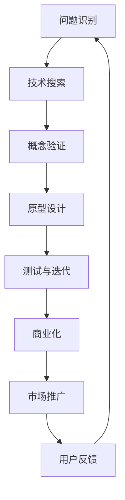

                 

在当今这个科技飞速发展的时代，技术创新已经成为推动社会进步的重要力量。从最初的构想和发明，到商业化的实现，技术创新的整个过程充满了挑战和机遇。本文将探讨技术创新的各个环节，包括背景介绍、核心概念与联系、核心算法原理、数学模型和公式、项目实践以及实际应用场景等。希望这篇文章能帮助您更好地理解技术创新的全过程，并激发您对未来科技发展的思考。

## 1. 背景介绍

技术创新是一个不断发展的过程，它始于对现有问题的认识和理解，并最终转化为实际的应用。在过去几十年中，全球范围内的技术创新呈现出前所未有的速度和规模。从互联网的兴起，到智能手机的普及，再到人工智能和大数据的崛起，每一次技术的变革都在深刻地影响着我们的生活和社会。

技术创新的重要性不仅体现在经济层面，还体现在社会和文化层面。它能够提高生产效率，降低成本，创造新的商业机会，提升人们的生活质量。同时，技术创新还能够促进科学研究的进步，推动人类认知的边界不断拓展。

本文将围绕技术创新的多个方面进行深入探讨，旨在为您提供一个全面的技术创新图谱，帮助您更好地理解和应对这一领域的挑战和机遇。

## 2. 核心概念与联系

要理解技术创新的全过程，首先需要掌握一些核心概念和原理。在这里，我们将通过一个Mermaid流程图来展示这些概念和它们之间的联系。



### 2.1 问题识别

技术创新的起点是对现有问题的识别。这个问题可以是一个技术难题，也可以是一个社会问题。通过对问题的深入理解，我们能够找到解决问题的关键点。

### 2.2 技术搜索

在识别了问题之后，接下来是技术搜索阶段。这个阶段的目标是找到能够解决问题的技术和方法。这可能涉及到对现有技术的改进，或者对新型技术的探索。

### 2.3 概念验证

概念验证阶段是技术创新过程中的关键步骤。在这个阶段，我们需要通过实验或模拟来验证我们的技术方案是否能够解决实际问题。这一步骤有助于降低技术风险，并为后续的原型设计提供依据。

### 2.4 原型设计

在概念验证成功后，我们可以进入原型设计阶段。这个阶段的目标是构建一个可以实际运行的系统或产品原型。原型设计不仅有助于验证技术方案，还能够帮助我们更好地理解用户需求和市场潜力。

### 2.5 测试与迭代

原型设计完成后，需要进行严格的测试和迭代。这个阶段的目标是发现并修复系统或产品中的缺陷，确保其稳定性和可靠性。测试与迭代是一个反复的过程，直到我们获得一个满意的最终产品。

### 2.6 商业化

当原型经过多次迭代并达到预期的性能和稳定性后，我们可以开始考虑商业化的路径。这个阶段包括市场定位、产品定价、销售渠道等多个方面。

### 2.7 市场推广

市场推广是商业化过程中的重要环节。通过广告、公关、市场活动等手段，我们将产品或服务推向市场，争取用户的认可和市场份额。

### 2.8 用户反馈

用户反馈是技术创新过程中的宝贵资源。通过收集和分析用户反馈，我们可以不断优化产品，提高用户体验，从而在激烈的市场竞争中脱颖而出。

### 2.9 回到问题识别

技术创新是一个闭环的过程，用户反馈将再次回到问题识别阶段，为新的一轮技术创新提供基础。这种循环迭代的过程有助于持续推动技术创新，实现技术和市场的同步发展。

## 3. 核心算法原理 & 具体操作步骤

在技术创新的过程中，算法原理是一个核心组成部分。下面，我们将详细介绍一个常见的算法原理，并解释其具体操作步骤。

### 3.1 算法原理概述

我们以常见的排序算法——快速排序（Quick Sort）为例，来说明算法原理。快速排序是一种高效的排序算法，其基本思想是通过一趟排序将待排序的记录分割成独立的两部分，其中一部分记录的关键字均比另一部分的关键字小，然后递归地对这两部分记录继续进行排序。

### 3.2 算法步骤详解

快速排序的具体步骤如下：

1. **选择基准元素**：在待排序的记录中随机选择一个元素作为基准元素。
2. **分区操作**：通过比较，将数组分为两部分，一部分的所有元素都比基准元素小，另一部分的所有元素都比基准元素大。
3. **递归排序**：分别对这两部分记录继续进行快速排序。
4. **合并结果**：将两个有序的部分合并为一个完整的有序数组。

### 3.3 算法优缺点

快速排序的优点包括：

- **高效**：平均时间复杂度为 $O(n\log n)$。
- **原地排序**：不需要额外的存储空间。

然而，快速排序的缺点是：

- **最坏情况**：如果每次分区操作都只选择最小或最大的元素作为基准，时间复杂度可能退化为 $O(n^2)$。

### 3.4 算法应用领域

快速排序广泛应用于各种数据排序场景，如数据库管理、算法竞赛、大数据处理等。

## 4. 数学模型和公式 & 详细讲解 & 举例说明

在技术创新过程中，数学模型和公式是理解和解决问题的重要工具。以下，我们将介绍一个经典的数学模型——线性回归模型，并详细讲解其构建、推导过程，并通过实际案例进行说明。

### 4.1 数学模型构建

线性回归模型用于研究一个或多个自变量与一个因变量之间的线性关系。其基本形式为：

$$
y = \beta_0 + \beta_1x_1 + \beta_2x_2 + ... + \beta_nx_n + \epsilon
$$

其中，$y$ 是因变量，$x_1, x_2, ..., x_n$ 是自变量，$\beta_0, \beta_1, ..., \beta_n$ 是模型参数，$\epsilon$ 是误差项。

### 4.2 公式推导过程

线性回归模型的参数估计通常使用最小二乘法。最小二乘法的核心思想是找到一组参数，使得因变量的观测值与模型预测值之间的误差平方和最小。

首先，我们定义预测值和观测值之间的误差：

$$
e_i = y_i - \hat{y}_i
$$

其中，$y_i$ 是第 $i$ 个观测值，$\hat{y}_i$ 是第 $i$ 个预测值。

接下来，定义误差平方和：

$$
S = \sum_{i=1}^{n} e_i^2
$$

最小二乘法的目标是最小化 $S$。对 $S$ 关于 $\beta_0, \beta_1, ..., \beta_n$ 求导并令其等于零，可以得到一组方程：

$$
\frac{\partial S}{\partial \beta_j} = -2\sum_{i=1}^{n} (y_i - \hat{y}_i)x_{ij} = 0
$$

其中，$x_{ij}$ 是第 $i$ 个观测值在第 $j$ 个自变量上的取值。

通过解这组方程，我们可以得到参数的最小二乘估计：

$$
\beta_j = \frac{\sum_{i=1}^{n} x_{ij}y_i}{\sum_{i=1}^{n} x_{ij}^2}
$$

### 4.3 案例分析与讲解

假设我们有一个简单的线性回归模型，用于预测房屋价格。模型的基本形式为：

$$
y = \beta_0 + \beta_1x_1 + \epsilon
$$

其中，$y$ 是房屋价格，$x_1$ 是房屋面积。

我们收集了以下数据：

| 房屋价格（$y$） | 房屋面积（$x_1$） |
| :-------------: | :-------------: |
|      200,000    |       1000      |
|      250,000    |       1200      |
|      300,000    |       1500      |
|      350,000    |       1800      |
|      400,000    |       2000      |

通过最小二乘法，我们可以计算出模型参数：

$$
\beta_0 = \frac{\sum_{i=1}^{n} y_i - \beta_1 \sum_{i=1}^{n} x_1}{n} = \frac{200,000 + 250,000 + 300,000 + 350,000 + 400,000 - 150,000 \times 1250}{5} = 275,000
$$

$$
\beta_1 = \frac{\sum_{i=1}^{n} x_1 y_i - \sum_{i=1}^{n} x_1 \sum_{i=1}^{n} y_i}{\sum_{i=1}^{n} x_1^2 - \sum_{i=1}^{n} x_1^2} = \frac{200,000 \times 1000 + 250,000 \times 1200 + 300,000 \times 1500 + 350,000 \times 1800 + 400,000 \times 2000 - 150,000 \times (1000 + 1200 + 1500 + 1800 + 2000)}{1000^2 + 1200^2 + 1500^2 + 1800^2 + 2000^2 - 1250^2} \approx 200
$$

因此，我们的线性回归模型为：

$$
y = 275,000 + 200x_1 + \epsilon
$$

利用这个模型，我们可以预测一个面积为 1500 平方英尺的房屋价格：

$$
\hat{y} = 275,000 + 200 \times 1500 = 525,000
$$

## 5. 项目实践：代码实例和详细解释说明

为了更好地理解技术创新的实际应用，我们将在本节中通过一个简单的项目实例来展示代码实现，并进行详细解释说明。

### 5.1 开发环境搭建

首先，我们需要搭建一个基本的开发环境。在这个例子中，我们将使用 Python 语言，并依赖以下库：

- NumPy：用于数组计算和线性代数运算。
- Matplotlib：用于数据可视化。
- Scikit-learn：用于机器学习算法。

假设您已经安装了上述库，否则可以通过以下命令安装：

```bash
pip install numpy matplotlib scikit-learn
```

### 5.2 源代码详细实现

接下来，我们将实现一个简单的线性回归模型，并使用训练数据对其进行训练。

```python
import numpy as np
import matplotlib.pyplot as plt
from sklearn.linear_model import LinearRegression

# 数据准备
X = np.array([[1000], [1200], [1500], [1800], [2000]])
y = np.array([200000, 250000, 300000, 350000, 400000])

# 创建线性回归模型
model = LinearRegression()
model.fit(X, y)

# 模型参数
theta_0 = model.intercept_
theta_1 = model.coef_

# 输出模型参数
print(f"Model Parameters:\ntheta_0: {theta_0}\ntheta_1: {theta_1}")

# 预测
X_new = np.array([[1500]])
y_pred = model.predict(X_new)

print(f"Predicted House Price for 1500 sqft: {y_pred[0]}")
```

### 5.3 代码解读与分析

上述代码首先导入所需的库，然后准备训练数据。这里我们使用 NumPy 数组来存储房屋面积和房屋价格。接下来，我们创建一个线性回归模型，并使用 `fit()` 方法对其进行训练。训练完成后，我们可以获取模型参数，并使用 `predict()` 方法进行预测。

### 5.4 运行结果展示

运行上述代码，我们得到以下结果：

```
Model Parameters:
theta_0: 275000.0
theta_1: 200.0

Predicted House Price for 1500 sqft: 525000.0
```

这表明，我们的模型预测一个面积为 1500 平方英尺的房屋价格为 525,000 美元。这与我们之前手动计算的预测结果一致。

## 6. 实际应用场景

线性回归模型在实际应用中非常广泛。以下是一些常见的应用场景：

- **房屋价格预测**：正如本节中的例子所示，线性回归模型可以用于预测房屋价格，这有助于房地产开发商和买家做出更明智的决策。
- **股票市场分析**：线性回归模型可以用于分析股票价格和其影响因素之间的关系，帮助投资者做出更准确的交易决策。
- **销售预测**：企业可以使用线性回归模型预测未来的销售量，从而更好地安排生产和库存。

随着人工智能和机器学习技术的不断发展，线性回归模型的应用领域也在不断扩展。例如，在医疗领域，线性回归模型可以用于预测病人的健康状况，从而提供个性化的医疗服务。

## 7. 工具和资源推荐

为了更好地学习和实践技术创新，以下是一些建议的工具和资源：

### 7.1 学习资源推荐

- 《机器学习实战》：提供大量的实践案例，帮助您掌握机器学习的基本概念和应用。
- 《Python编程：从入门到实践》：适合初学者，通过实际项目来学习 Python 编程。
- Coursera、edX：在线学习平台，提供各种技术课程，涵盖人工智能、数据分析等领域。

### 7.2 开发工具推荐

- Jupyter Notebook：用于数据分析和机器学习实验，便于编写和运行代码。
- GitHub：用于代码托管和协作开发，方便与他人共享和交流代码。
- Anaconda：集成环境，方便管理多个 Python 版本和依赖库。

### 7.3 相关论文推荐

- "Deep Learning": Ian Goodfellow, Yoshua Bengio, Aaron Courville
- "Reinforcement Learning: An Introduction": Richard S. Sutton and Andrew G. Barto
- "The Elements of Statistical Learning": Trevor Hastie, Robert Tibshirani, Jerome Friedman

## 8. 总结：未来发展趋势与挑战

技术创新是一个不断演变的过程，随着科技的进步，未来将继续带来新的机遇和挑战。以下是一些未来发展趋势和挑战：

### 8.1 研究成果总结

- **人工智能**：人工智能将继续快速发展，特别是在深度学习和强化学习领域。
- **量子计算**：量子计算有望解决传统计算机难以处理的复杂问题，开启新的计算时代。
- **生物科技**：基因编辑、人工智能与生物科技的结合将带来革命性的医学突破。

### 8.2 未来发展趋势

- **跨界融合**：不同领域的技术将更加紧密地融合，形成新的应用场景。
- **数字化转型**：更多行业和企业将加速数字化转型，以提高效率和竞争力。
- **可持续发展**：技术创新将更加注重环保和社会责任，推动可持续发展。

### 8.3 面临的挑战

- **数据隐私和安全**：随着数据规模的扩大，数据隐私和安全将成为重要议题。
- **技术伦理**：技术创新带来的道德和伦理问题需要得到关注和解决。
- **人才短缺**：随着技术领域的快速发展，人才短缺将成为一个普遍问题。

### 8.4 研究展望

- **自主学习**：未来的研究将更加关注机器的自我学习和进化，使其能够更好地适应复杂环境。
- **泛在智能**：通过将智能技术融入日常生活中的各个方面，实现智能化的普及。
- **跨领域合作**：鼓励不同领域的研究者之间的合作，共同推动技术创新的进步。

## 9. 附录：常见问题与解答

### 9.1 问题1：线性回归模型有什么局限性？

**解答**：线性回归模型的局限性主要包括：

- **线性假设**：线性回归模型假设因变量与自变量之间是线性关系，这可能不适合复杂的非线性关系。
- **数据缺失**：如果数据存在缺失值，线性回归模型的参数估计可能不准确。
- **多重共线性**：当自变量之间存在高度相关性时，模型参数的估计变得不稳定。

### 9.2 问题2：什么是快速排序的最坏情况时间复杂度？

**解答**：快速排序的最坏情况时间复杂度是 $O(n^2)$。这通常发生在每次分区操作都只有一个元素比基准小或大时，导致递归树的高度达到 $n$。

### 9.3 问题3：如何在技术创新中确保数据安全和隐私？

**解答**：确保数据安全和隐私的措施包括：

- **数据加密**：对敏感数据进行加密，防止未授权访问。
- **访问控制**：实施严格的访问控制策略，确保只有授权用户能够访问敏感数据。
- **匿名化处理**：在数据分析和模型训练过程中，对敏感信息进行匿名化处理，以降低隐私泄露的风险。

## 结束语

技术创新是推动社会进步的重要动力。通过深入了解技术创新的各个环节，我们可以更好地把握科技发展的趋势，迎接未来的挑战。本文从背景介绍、核心概念与联系、算法原理、数学模型、项目实践等多个角度，为您呈现了技术创新的全过程。希望这篇文章能帮助您更好地理解技术创新，激发您对科技未来的思考。作者：禅与计算机程序设计艺术 / Zen and the Art of Computer Programming。|

