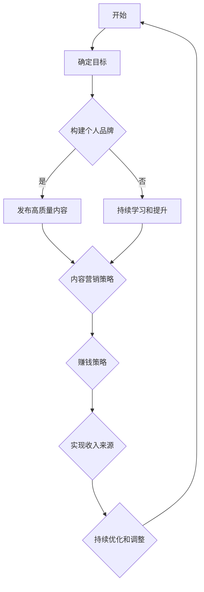

                 

关键词：技术博客、收入来源、个人品牌、技术写作、职业发展

> 摘要：本文将探讨如何将技术博客从个人爱好转变为主要的收入来源。通过案例分析、策略分享和实用技巧，为您揭示技术博客的赚钱之道，助力您的职业发展。

## 1. 背景介绍

随着互联网的普及和社交媒体的兴起，技术博客成为了一个充满机会的平台。许多技术爱好者开始分享他们的知识和经验，逐渐积累了一定的读者群体。然而，将技术博客转变为主要的收入来源并不容易，需要策略、耐心和持续的努力。本文将为您揭示这一转变的路径。

### 1.1 技术博客的兴起

近年来，技术博客的兴起与以下因素密切相关：

1. **互联网技术的发展**：互联网的快速发展为技术博客提供了广阔的舞台。
2. **知识共享的需求**：越来越多的技术爱好者希望通过分享知识来帮助他人，同时提升自己的影响力。
3. **个人品牌的塑造**：技术博客成为个人品牌建设的重要渠道，有助于在职业市场中脱颖而出。

### 1.2 赚钱的机会

技术博客不仅能帮助个人积累知识，还能创造收入。以下是技术博客赚钱的几种途径：

1. **广告收入**：通过展示广告获得收益。
2. **赞助和合作**：与企业合作，为其推广产品或服务。
3. **内容付费**：提供高质量、有价值的内容，通过订阅或付费阅读获得收入。
4. **培训与咨询服务**：利用自己的专业知识提供培训和咨询服务。

## 2. 核心概念与联系

### 2.1 个人品牌建设

个人品牌建设是技术博客成功的关键之一。通过构建个人品牌，您将提高自己的知名度和影响力，从而吸引更多的读者和合作伙伴。以下是构建个人品牌的几个要点：

1. **确定目标受众**：了解您的读者群体，为他们提供有价值的内容。
2. **保持一致性和专业性**：在内容、风格和形象上保持一致性，树立专业形象。
3. **不断学习和提升**：通过不断学习和实践，提高自己的技能和知识水平。
4. **积极参与社区活动**：加入技术社区，参与讨论和交流，扩大影响力。

### 2.2 内容营销

内容营销是技术博客的核心。以下是一些内容营销的策略：

1. **提供高质量的内容**：内容要有深度、有见解、有实际价值。
2. **定期更新**：保持博客的活跃度，定期发布新文章。
3. **优化搜索引擎**：通过SEO（搜索引擎优化）提高博客的曝光度。
4. **跨平台推广**：利用社交媒体和其他渠道宣传您的博客。

### 2.3 赚钱策略

要实现技术博客的盈利，以下策略值得尝试：

1. **广告收入**：通过展示广告获得收入。
2. **赞助和合作**：与企业合作，推广其产品或服务。
3. **内容付费**：提供高质量、有价值的内容，通过订阅或付费阅读获得收入。
4. **培训与咨询服务**：利用自己的专业知识提供培训和咨询服务。

### 2.4 Mermaid 流程图

以下是技术博客从个人爱好到主要收入来源的 Mermaid 流程图：



## 3. 核心算法原理 & 具体操作步骤

### 3.1 算法原理概述

将技术博客转变为主要收入来源的算法原理可以概括为以下几个步骤：

1. **个人品牌建设**：确定目标受众，构建个人品牌。
2. **内容营销**：提供高质量的内容，定期更新。
3. **赚钱策略**：尝试多种赚钱方式，实现收入来源。

### 3.2 算法步骤详解

1. **确定目标受众**：了解您的读者群体，为他们提供有价值的内容。
2. **构建个人品牌**：保持一致性和专业性，参与社区活动。
3. **内容营销**：提供高质量的内容，优化搜索引擎，跨平台推广。
4. **尝试多种赚钱方式**：广告收入、赞助和合作、内容付费、培训与咨询服务。
5. **持续优化和调整**：根据反馈和市场变化，不断优化和调整策略。

### 3.3 算法优缺点

**优点**：

1. **灵活性**：可以根据个人兴趣和市场需求灵活调整内容方向。
2. **多样性**：有多种赚钱方式可供选择。
3. **长期性**：只要持续提供有价值的内容，收入将保持稳定增长。

**缺点**：

1. **时间成本**：需要投入大量时间和精力。
2. **市场竞争**：技术博客市场竞争激烈，需要不断提升自己的专业水平。

### 3.4 算法应用领域

将技术博客转变为主要收入来源的算法原理适用于以下领域：

1. **技术行业**：程序员、工程师等技术专业人士。
2. **教育行业**：教师、讲师等教育工作者。
3. **咨询行业**：咨询师、顾问等专业人士。

## 4. 数学模型和公式 & 详细讲解 & 举例说明

### 4.1 数学模型构建

在技术博客的赚钱过程中，我们可以构建一个简单的数学模型来分析其收入来源。以下是一个基本的收入模型：

$$
收入 = 广告收入 + 赞助收入 + 内容付费收入 + 咨询服务收入
$$

### 4.2 公式推导过程

1. **广告收入**：假设每千次展示（CPM）收入为 $x$ 元，每月广告展示量为 $A$，则广告收入为 $A \times x$ 元。
2. **赞助收入**：假设每篇赞助文章收入为 $y$ 元，每月发布赞助文章数为 $B$，则赞助收入为 $B \times y$ 元。
3. **内容付费收入**：假设每篇付费内容收入为 $z$ 元，每月付费阅读文章数为 $C$，则内容付费收入为 $C \times z$ 元。
4. **咨询服务收入**：假设每小时咨询服务收入为 $w$ 元，每月咨询服务时间为 $D$ 小时，则咨询服务收入为 $D \times w$ 元。

将这些收入合并，我们得到上述的收入模型。

### 4.3 案例分析与讲解

假设某技术博客在一个月内的收入如下：

- 广告收入：1000 次 × 10 元 = 10000 元
- 赞助收入：2 篇 × 50 元 = 100 元
- 内容付费收入：10 篇 × 20 元 = 200 元
- 咨询服务收入：20 小时 × 50 元 = 1000 元

则该月总收入为：

$$
收入 = 10000 + 100 + 200 + 1000 = 12100 元
$$

通过这个案例，我们可以看到技术博客的收入来源是多元化的，不同的收入渠道可以相互补充，提高整体收入。

## 5. 项目实践：代码实例和详细解释说明

### 5.1 开发环境搭建

为了实现技术博客的自动化部署和更新，我们可以使用 GitHub Pages 和 Jekyll 作为开发环境。

1. **安装 Git**：从 [Git 官网](https://git-scm.com/downloads)下载并安装 Git。
2. **安装 Ruby**：由于 Jekyll 是用 Ruby 编写的，我们需要安装 Ruby。可以从 [Ruby 官网](https://www.ruby-lang.org/zh_cn/downloads/)下载并安装。
3. **安装 Jekyll**：打开命令行，运行以下命令安装 Jekyll：

   ```bash
   gem install jekyll
   ```

### 5.2 源代码详细实现

创建一个 Jekyll 博客项目的步骤如下：

1. **初始化项目**：在命令行中运行以下命令初始化 Jekyll 项目：

   ```bash
   jekyll new myblog
   ```

   这将在当前目录下创建一个名为 `myblog` 的文件夹。

2. **配置 _config.yml**：编辑 `_config.yml` 文件，配置博客的基本信息，如博客标题、作者、域名等。

   ```yaml
   title: My Blog
   author: Your Name
   baseurl: /
   url: "http://yourdomain.com"
   ```

3. **创建文章**：在 `myblog` 文件夹中的 `_posts` 目录下创建新的文章。文章的格式通常为 `YYYY-MM-DD-title.md`，例如：

   ```markdown
   ---
   layout: post
   title: 第一篇文章
   date: 2023-03-01 10:00:00 +0800
   categories:
     - Tutorial
   ---
   # 第一篇文章
   ```

4. **运行本地服务器**：在命令行中运行以下命令，启动本地服务器：

   ```bash
   jekyll serve
   ```

   这将启动一个本地服务器，您可以在浏览器中访问 `http://localhost:4000` 查看博客效果。

### 5.3 代码解读与分析

在这个简单的 Jekyll 项目中，我们主要使用了以下文件和目录：

- `_config.yml`：配置文件，用于设置博客的基本信息。
- `_posts`：存放文章的目录，每个文章文件都是一个 Markdown 文件。
- `index.html`：博客首页，通常包含导航栏和文章列表。
- `about.md`：关于作者页面。
- `contact.md`：联系方式页面。

通过编辑这些文件，我们可以自定义博客的样式和内容。Jekyll 使用 Liquid 模板语言，这使得我们可以轻松地插入变量和循环，实现动态内容展示。

### 5.4 运行结果展示

运行 Jekyll 本地服务器后，我们可以在浏览器中访问 `http://localhost:4000` 查看博客效果。以下是博客的简要展示：

- 首页：显示最新的文章列表。
- 文章页面：显示文章内容。
- 关于作者：显示关于作者的信息。
- 联系方式：显示联系方式。

通过这个简单的项目，我们可以了解到如何使用 Jekyll 搭建一个基本的技术博客。在实际开发过程中，我们可以使用更多的插件和主题来丰富博客的功能和样式。

## 6. 实际应用场景

### 6.1 技术博客在个人品牌建设中的应用

技术博客是个人品牌建设的重要工具。通过技术博客，您可以：

1. **展示专业能力**：通过分享技术文章，展示自己在某一领域的专业知识和技能。
2. **建立信任关系**：通过高质量的内容和专业的态度，赢得读者的信任。
3. **扩大影响力**：通过不断积累读者和粉丝，扩大个人在行业中的影响力。

### 6.2 技术博客在内容付费中的应用

内容付费是技术博客的重要收入来源。通过以下方式，您可以实现内容付费：

1. **高级内容订阅**：提供高级内容，如深入的技术分析、案例分析等，供订阅用户阅读。
2. **付费课程**：开发在线课程，通过平台或自建网站销售。
3. **知识付费**：提供专业咨询服务，如编程辅导、项目咨询等。

### 6.3 技术博客在营销推广中的应用

技术博客可以为企业提供以下营销推广服务：

1. **品牌推广**：通过技术博客的影响力，为企业进行品牌推广。
2. **产品宣传**：撰写技术文章，介绍和推广企业的产品或服务。
3. **合作推广**：与企业合作，进行联合营销活动，扩大品牌影响力。

## 6.4 未来应用展望

随着互联网技术的发展，技术博客的应用前景将更加广阔。以下是未来技术博客的几个发展趋势：

1. **人工智能助力**：人工智能技术将帮助技术博客实现自动化内容生成、推荐和优化。
2. **多元化收入模式**：随着技术博客市场的成熟，将出现更多创新的收入模式，如虚拟现实、增强现实等。
3. **全球化扩展**：技术博客的影响力将逐渐扩大到全球市场，为更多国家和地区的技术爱好者提供服务。

## 7. 工具和资源推荐

### 7.1 学习资源推荐

1. **《Head First 技术写作》**：这是一本非常实用的技术写作指南，适合初学者阅读。
2. **《Markdown 入门到精通》**：这本书详细介绍了 Markdown 语言的基本用法和高级技巧。
3. **Medium**：一个优秀的在线写作平台，提供了丰富的技术文章和写作资源。

### 7.2 开发工具推荐

1. **GitHub**：用于版本控制和项目管理，非常适合博客开发。
2. **Jekyll**：一款强大的静态博客生成工具，广泛应用于技术博客搭建。
3. **Visual Studio Code**：一款优秀的代码编辑器，支持多种编程语言和插件。

### 7.3 相关论文推荐

1. **“The Role of Blogs in Professional Development”**：探讨博客在职业发展中的作用。
2. **“Monetizing Your Blog: A Guide to Earning Money from Your Online Presence”**：介绍如何通过博客赚钱。
3. **“The Future of Content Creation: Blogs, Podcasts, and Beyond”**：展望内容创作的发展趋势。

## 8. 总结：未来发展趋势与挑战

### 8.1 研究成果总结

本文通过案例分析、策略分享和实用技巧，探讨了如何将技术博客从个人爱好转变为主要的收入来源。主要研究成果包括：

1. **个人品牌建设**：通过构建个人品牌，提高知名度和影响力。
2. **内容营销策略**：提供高质量的内容，实现内容付费和广告收入。
3. **赚钱模式探索**：多种赚钱途径，如赞助、广告、内容付费和咨询服务。

### 8.2 未来发展趋势

未来，技术博客将在以下几个方面得到发展：

1. **人工智能助力**：人工智能技术将帮助博客实现自动化内容生成和推荐。
2. **多元化收入模式**：博客收入模式将更加多元化，如虚拟现实、增强现实等。
3. **全球化扩展**：博客的影响力将逐渐扩大到全球市场。

### 8.3 面临的挑战

尽管技术博客前景广阔，但仍面临以下挑战：

1. **市场竞争**：技术博客市场竞争激烈，需要不断提升专业水平。
2. **内容质量**：高质量的内容是博客成功的基石，需要持续投入时间和精力。
3. **法律法规**：遵守相关法律法规，确保博客内容合法合规。

### 8.4 研究展望

未来，研究可以进一步探讨以下方向：

1. **博客与社交媒体的融合**：如何更好地利用社交媒体平台推广博客内容。
2. **博客变现模式创新**：探索更多创新的博客变现模式。
3. **博客用户体验优化**：如何提升博客的用户体验，提高用户黏性。

## 9. 附录：常见问题与解答

### 9.1 如何提高博客的访问量？

**回答**：提高博客访问量可以通过以下方式实现：

1. **内容质量**：提供高质量、有价值的内容，吸引更多读者。
2. **搜索引擎优化（SEO）**：优化博客内容，提高在搜索引擎中的排名。
3. **社交媒体推广**：利用社交媒体平台宣传博客，扩大影响力。
4. **合作与互动**：与其他博客作者合作，参与技术社区活动，提高曝光度。

### 9.2 如何构建个人品牌？

**回答**：构建个人品牌可以通过以下方式实现：

1. **确定目标受众**：了解您的读者群体，为他们提供有价值的内容。
2. **保持一致性和专业性**：在内容、风格和形象上保持一致性，树立专业形象。
3. **不断学习和提升**：通过不断学习和实践，提高自己的技能和知识水平。
4. **积极参与社区活动**：加入技术社区，参与讨论和交流，扩大影响力。

### 9.3 如何实现博客盈利？

**回答**：实现博客盈利可以通过以下方式：

1. **广告收入**：通过展示广告获得收益。
2. **赞助和合作**：与企业合作，推广其产品或服务。
3. **内容付费**：提供高质量、有价值的内容，通过订阅或付费阅读获得收入。
4. **培训与咨询服务**：利用自己的专业知识提供培训和咨询服务。

**作者：禅与计算机程序设计艺术 / Zen and the Art of Computer Programming**

