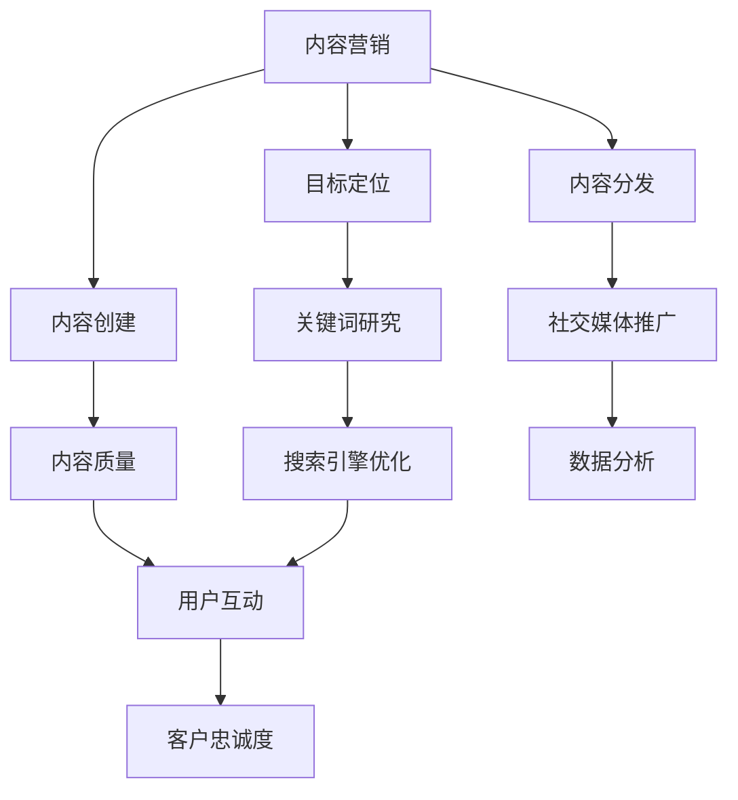
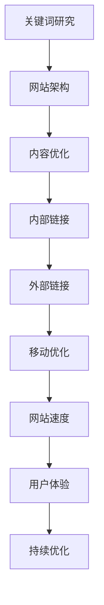

                 

关键词：被动收入、技术博客、自动收益、内容营销、持续优化、在线教育、数字产品、编程技巧。

> 摘要：本文将探讨如何通过建立技术博客，打造一种稳定的被动收入流。我们将深入分析核心概念、算法原理、数学模型、项目实践以及实际应用场景，提供实用的工具和资源推荐，并对未来发展趋势与挑战进行展望。

## 1. 背景介绍

在数字化时代，知识经济愈发重要。传统的工作模式正逐渐被在线内容生产和共享所取代。技术博客作为一种知识传播的重要方式，不仅能够帮助个人和团队建立专业形象，还可以成为获取被动收入的有效途径。

### 被动收入的优势

- **时间自由**：被动收入意味着在你付出初始努力后，收益可以持续不断地流入。
- **空间灵活**：无需受到地理位置的限制，通过网络就可以实现收益。
- **长期稳定**：一旦内容建立起来，只要维护得当，就能持续带来收益。

### 技术博客的意义

- **知识分享**：博客是分享知识、经验和技巧的绝佳平台。
- **品牌建立**：通过博客，可以塑造个人或企业的专业形象。
- **内容营销**：高质量的内容能够吸引读者，增加品牌知名度和影响力。

## 2. 核心概念与联系

为了建立一个成功的博客，需要了解几个核心概念，包括内容营销、SEO（搜索引擎优化）、以及如何创建有吸引力的内容。

### 2.1 内容营销

内容营销是一种通过创建和分发有价值的内容来吸引潜在客户并建立客户忠诚度的策略。在博客中，内容营销的重要性不言而喻。

#### Mermaid 流程图



### 2.2 SEO

SEO 是搜索引擎优化，旨在提高网站在搜索引擎中的排名，从而增加有机流量。

#### Mermaid 流程图



### 2.3 内容吸引力

吸引人的内容需要满足以下条件：

- **高质量**：内容要精确、有深度且有价值。
- **原创性**：避免抄袭，提供独特的见解和解决方案。
- **易读性**：使用简单的语言，避免复杂的术语和句子结构。
- **可视化**：使用图片、图表和视频等元素，提高内容的可读性。

## 3. 核心算法原理 & 具体操作步骤

### 3.1 算法原理概述

建立博客的核心算法可以看作是一个系统工程，包括内容创作、SEO 优化、流量获取和转化等多个环节。

#### 算法步骤详解

1. **内容创作**：确定主题，进行研究和写作。
2. **SEO 优化**：针对关键词进行优化，提高内容在搜索引擎中的排名。
3. **流量获取**：通过社交媒体和外部链接引入流量。
4. **内容推广**：利用邮件营销、广告等方式推广内容。
5. **用户互动**：与读者互动，收集反馈，不断优化内容。

### 3.2 算法优缺点

#### 优点

- **长期稳定**：一旦内容上线，可以持续带来流量和收益。
- **低成本**：相比其他营销方式，建立博客的成本较低。

#### 缺点

- **初始投入大**：需要时间和精力进行内容创作和优化。
- **竞争激烈**：技术博客领域竞争激烈，需要高质量的内容才能脱颖而出。

### 3.3 算法应用领域

- **在线教育**：通过博客分享编程技巧和教学资源。
- **数字产品**：销售在线课程、电子书和软件工具。
- **技术交流**：建立技术社群，促进知识传播。

## 4. 数学模型和公式 & 详细讲解 & 举例说明

### 4.1 数学模型构建

建立一个成功的博客可以看作是一个数学模型。我们可以使用以下公式来构建模型：

\[ R = f(P, Q, T) \]

其中，\( R \) 是收益，\( P \) 是内容质量，\( Q \) 是 SEO 优化，\( T \) 是时间投入。

### 4.2 公式推导过程

\[ R = P \times Q \times T \]

- \( P \)：内容质量，质量越高，收益越高。
- \( Q \)：SEO 优化，优化越高，流量越高。
- \( T \)：时间投入，投入越多，内容越丰富。

### 4.3 案例分析与讲解

假设一位博客作者，他的内容质量 \( P \) 为 0.8，SEO 优化 \( Q \) 为 0.7，时间投入 \( T \) 为 20 小时。根据公式：

\[ R = 0.8 \times 0.7 \times 20 = 11.2 \]

这意味着，这位作者每个月可以期望获得大约 11.2 单位的收益。

## 5. 项目实践：代码实例和详细解释说明

### 5.1 开发环境搭建

首先，我们需要搭建一个适合博客开发的平台。可以选择使用 GitHub Pages、WordPress 或 Jekyll 等工具。

### 5.2 源代码详细实现

以下是使用 Jekyll 搭建博客的基本步骤：

```bash
# 安装 Jekyll
gem install jekyll

# 创建博客文件夹
mkdir my-blog
cd my-blog

# 新建博客文件
touch index.md
```

在 `index.md` 文件中，我们可以编写如下内容：

```markdown
---
title: "我的第一个博客"
date: 2023-03-01
---

欢迎来到我的博客！
```

### 5.3 代码解读与分析

- `---` 是 Jekyll 的分隔符，用于定义元数据。
- `title` 是博客标题。
- `date` 是博客创建日期。
- `---` 后面的内容是 Markdown 格式的博客正文。

### 5.4 运行结果展示

在命令行中运行以下命令：

```bash
jekyll serve
```

然后，在浏览器中访问 `http://localhost:4000`，即可看到博客的运行结果。

## 6. 实际应用场景

### 6.1 在线教育

技术博客可以作为在线教育的一部分，分享编程教程和技术教程。

### 6.2 数字产品销售

通过博客推广自己的数字产品，如在线课程、电子书和软件工具。

### 6.3 技术交流

建立技术社群，促进技术交流与合作。

## 6.4 未来应用展望

随着人工智能和大数据技术的发展，技术博客的应用场景将进一步扩大。未来，博客将不仅是一个知识分享的平台，更将成为个性化推荐和智能服务的入口。

## 7. 工具和资源推荐

### 7.1 学习资源推荐

- 《编程珠玑》：了解编程基础和技巧。
- 《数据结构与算法分析》：学习算法原理。
- 《搜索引擎优化：理论、技术与案例》：了解 SEO 优化。

### 7.2 开发工具推荐

- GitHub：代码托管和协作。
- Jekyll：静态网站生成。
- MarkdownPad：Markdown 文本编辑器。

### 7.3 相关论文推荐

- 《基于用户兴趣的博客推荐算法研究》。
- 《搜索引擎优化算法研究综述》。

## 8. 总结：未来发展趋势与挑战

### 8.1 研究成果总结

通过本文的探讨，我们了解到技术博客在建立被动收入流方面具有巨大的潜力。结合内容营销、SEO 优化和数学模型，可以构建一个稳定的博客生态。

### 8.2 未来发展趋势

- **个性化推荐**：基于用户行为和兴趣，提供更加精准的内容推荐。
- **智能服务**：利用人工智能技术，提供智能化的内容生成和营销服务。

### 8.3 面临的挑战

- **内容质量**：如何在海量信息中提供高质量的内容。
- **用户体验**：如何提升用户的阅读体验和互动性。

### 8.4 研究展望

未来，技术博客将在个性化推荐和智能服务方面有更多突破，为知识经济贡献更大的力量。

## 9. 附录：常见问题与解答

### 9.1 如何选择博客平台？

- GitHub Pages：适合技术博客，免费且易于部署。
- WordPress：功能丰富，适合内容多样的博客。
- Jekyll：适合静态博客，轻量级且易于维护。

### 9.2 如何提高博客的访问量？

- **内容质量**：提供有价值的内容。
- **SEO 优化**：优化关键词和内容结构。
- **社交媒体推广**：利用社交媒体平台推广博客。

---

作者：禅与计算机程序设计艺术 / Zen and the Art of Computer Programming

