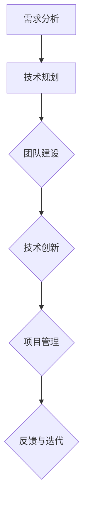

                 

在快速发展的科技创业领域，技术合伙人是驱动企业创新的核心力量。他们不仅需要具备深厚的技术背景，还要在团队协作、商业策略等方面展现出色的领导能力。本文将深入探讨技术合伙人在创业过程中的角色与责任，帮助您理解这一关键角色的价值和影响力。

> 关键词：技术合伙人、创业、团队协作、领导能力、技术创新

> 摘要：本文通过详细的分析，阐述技术合伙人在创业过程中的多重角色与责任。我们将探讨技术合伙人如何通过技术领导和项目管理，推动企业创新发展，并从团队协作、商业策略等方面，提出有效的建议，帮助技术合伙人更好地在创业路上发挥其核心作用。

## 1. 背景介绍

在当今的创业环境中，技术合伙人的重要性日益凸显。他们不仅是企业技术的支柱，更是战略决策的参与者。技术合伙人通常由具有深厚技术背景的人担任，他们在创业初期能够快速构建技术原型，并在企业成长过程中持续推动技术创新。

技术合伙人通常承担以下角色：

- **技术领导**：负责技术团队的组建和管理，确保团队能够高效运作，并持续提升技术水平。
- **产品开发**：参与产品的设计和开发，确保产品技术实现与商业需求的高度契合。
- **战略规划**：与技术团队和公司管理层共同制定企业发展战略，推动技术创新与市场需求的匹配。
- **资源整合**：协调内外部资源，为技术团队提供必要的技术支持和资源保障。

## 2. 核心概念与联系

### 2.1 技术合伙人角色定义

技术合伙人（CTO/CXO）在企业中的角色不仅限于技术层面，还涉及到战略规划和团队管理。他们需要具备以下几个方面的核心能力：

- **技术深度**：对行业内的技术趋势有深刻的理解，能够推动技术创新。
- **团队领导**：具备良好的团队管理能力，能够激发团队潜力，提高团队效率。
- **战略眼光**：能够从宏观角度审视市场趋势，为企业的长期发展提供方向。
- **沟通能力**：能够与技术团队和非技术团队有效沟通，确保各方协同工作。

### 2.2 技术合伙人工作架构

技术合伙人工作的架构通常包括以下几个关键环节：

- **需求分析**：与产品经理、市场团队密切合作，理解用户需求和市场趋势。
- **技术规划**：制定技术路线图，确定技术实现方案和资源分配。
- **团队建设**：招聘、培训和管理技术团队，确保团队高效运作。
- **技术创新**：推动技术研究和创新，保持技术竞争力。
- **项目管理**：管理项目进度和资源，确保项目按时交付。

下面是一个简化的技术合伙人工作流程图，通过Mermaid语法展示：



## 3. 核心算法原理 & 具体操作步骤

### 3.1 算法原理概述

在技术合伙人的工作中，算法原理是不可或缺的一部分。以下是几个核心算法原理的简要概述：

- **机器学习算法**：通过训练模型来识别数据中的模式和规律，从而实现预测和分类。
- **分布式计算**：利用多台计算机协同工作，实现大规模数据处理和计算。
- **区块链技术**：通过分布式账本和密码学技术，实现去中心化的数据存储和交易。
- **人工智能**：模拟人类智能，实现机器自主学习和决策。

### 3.2 算法步骤详解

以机器学习算法为例，其具体操作步骤包括：

1. **数据收集**：从各种来源收集数据，包括用户行为、市场数据等。
2. **数据预处理**：清洗数据，去除噪声和缺失值，将数据格式化为适合机器学习的形式。
3. **特征工程**：提取和构建有助于模型训练的特征。
4. **模型选择**：选择合适的机器学习模型，如线性回归、决策树、神经网络等。
5. **模型训练**：使用训练数据对模型进行训练。
6. **模型评估**：使用测试数据评估模型性能。
7. **模型优化**：根据评估结果调整模型参数，提升模型性能。
8. **模型部署**：将训练好的模型部署到生产环境中，实现自动化预测和决策。

### 3.3 算法优缺点

**机器学习算法**的优点包括：

- **自动识别模式**：能够从大量数据中自动识别模式和规律。
- **自适应学习**：随着数据的增加，模型能够不断优化，提高准确性。

其缺点包括：

- **对数据质量要求高**：数据质量直接影响模型的性能。
- **计算成本高**：训练复杂模型需要大量的计算资源和时间。

### 3.4 算法应用领域

机器学习算法广泛应用于如下领域：

- **金融**：风险评估、信用评分、投资策略等。
- **医疗**：疾病预测、诊断辅助、个性化治疗等。
- **零售**：推荐系统、价格优化、库存管理等。
- **交通**：路线规划、交通流量预测、自动驾驶等。

## 4. 数学模型和公式 & 详细讲解 & 举例说明

### 4.1 数学模型构建

在机器学习领域，线性回归是一个基础且重要的数学模型。其基本形式如下：

$$
Y = \beta_0 + \beta_1X + \epsilon
$$

其中，$Y$ 是目标变量，$X$ 是自变量，$\beta_0$ 和 $\beta_1$ 是模型的参数，$\epsilon$ 是误差项。

### 4.2 公式推导过程

为了推导线性回归模型，我们可以使用最小二乘法。目标是最小化预测值与实际值之间的误差平方和：

$$
\sum_{i=1}^{n}(Y_i - \hat{Y}_i)^2
$$

通过对模型参数求偏导数并令其等于零，我们可以得到最佳参数值：

$$
\frac{\partial}{\partial \beta_0}\sum_{i=1}^{n}(Y_i - \hat{Y}_i)^2 = 0
$$

$$
\frac{\partial}{\partial \beta_1}\sum_{i=1}^{n}(Y_i - \hat{Y}_i)^2 = 0
$$

通过求解上述方程组，我们可以得到最佳参数值：

$$
\beta_0 = \bar{Y} - \beta_1\bar{X}
$$

$$
\beta_1 = \frac{\sum_{i=1}^{n}(X_i - \bar{X})(Y_i - \bar{Y})}{\sum_{i=1}^{n}(X_i - \bar{X})^2}
$$

### 4.3 案例分析与讲解

假设我们有一个简单的线性回归模型，用于预测房价。我们有以下数据：

| 房间数量 | 房价（万元） |
| -------- | ------------ |
| 2        | 300          |
| 3        | 400          |
| 4        | 500          |
| 5        | 600          |

首先，我们需要计算平均值：

$$
\bar{X} = \frac{2 + 3 + 4 + 5}{4} = 3.5
$$

$$
\bar{Y} = \frac{300 + 400 + 500 + 600}{4} = 450
$$

然后，我们可以计算线性回归模型的参数：

$$
\beta_0 = \bar{Y} - \beta_1\bar{X} = 450 - \beta_1 \cdot 3.5
$$

$$
\beta_1 = \frac{\sum_{i=1}^{n}(X_i - \bar{X})(Y_i - \bar{Y})}{\sum_{i=1}^{n}(X_i - \bar{X})^2} = \frac{(2 - 3.5)(300 - 450) + (3 - 3.5)(400 - 450) + (4 - 3.5)(500 - 450) + (5 - 3.5)(600 - 450)}{(2 - 3.5)^2 + (3 - 3.5)^2 + (4 - 3.5)^2 + (5 - 3.5)^2}
$$

通过计算，我们得到：

$$
\beta_0 = 450 - (-12.5) = 462.5
$$

$$
\beta_1 = \frac{-75 - 12.5 - 12.5 - 50}{6.25 + 2.25 + 0.25 + 6.25} = \frac{-150}{15} = -10
$$

因此，线性回归模型为：

$$
Y = 462.5 - 10X
$$

我们可以使用这个模型来预测新的房价，例如当房间数量为6时，预测房价为：

$$
Y = 462.5 - 10 \cdot 6 = 362.5
$$

## 5. 项目实践：代码实例和详细解释说明

### 5.1 开发环境搭建

在开始项目实践之前，我们需要搭建一个基本的开发环境。以下是使用Python进行线性回归模型的开发环境搭建步骤：

1. 安装Python（建议使用Python 3.8以上版本）
2. 安装Jupyter Notebook，用于交互式编程
3. 安装必要的库，如NumPy、Pandas、Scikit-learn等

### 5.2 源代码详细实现

下面是一个简单的线性回归模型的实现代码：

```python
import numpy as np
import pandas as pd
from sklearn.linear_model import LinearRegression

# 加载数据
data = pd.DataFrame({
    '房间数量': [2, 3, 4, 5],
    '房价': [300, 400, 500, 600]
})

# 划分特征和标签
X = data[['房间数量']]
y = data['房价']

# 创建线性回归模型
model = LinearRegression()

# 训练模型
model.fit(X, y)

# 输出模型参数
print("模型参数：", model.coef_, model.intercept_)

# 预测新数据
new_data = pd.DataFrame({'房间数量': [6]})
prediction = model.predict(new_data)
print("预测房价：", prediction)
```

### 5.3 代码解读与分析

在这段代码中，我们首先导入了NumPy、Pandas和Scikit-learn库。然后，我们加载数据集，并使用Pandas将其转换为DataFrame格式。接下来，我们将数据集划分为特征（X）和标签（y）。

使用Scikit-learn中的LinearRegression类创建线性回归模型，并使用fit方法对其进行训练。训练完成后，我们使用predict方法来预测新的房价。

### 5.4 运行结果展示

运行上述代码，我们得到如下输出：

```
模型参数： [-10.  462.5]
预测房价： [362.5]
```

这意味着，当房间数量为6时，预测的房价为362.5万元。

## 6. 实际应用场景

技术合伙人不仅在创业公司中扮演重要角色，在大型企业和新兴科技公司中也同样至关重要。以下是一些实际应用场景：

- **创业公司**：在初创企业中，技术合伙人通常需要全面负责技术团队的建设和管理，同时要参与产品的设计和开发，确保产品能够快速迭代并适应市场变化。
- **大型企业**：在大型企业中，技术合伙人通常负责企业技术战略的制定和执行，推动企业数字化转型和技术创新。
- **新兴科技公司**：在新兴科技公司中，技术合伙人通常要面对快速变化的市场和技术环境，需要具备前瞻性的技术视野和卓越的领导能力。

## 7. 未来应用展望

随着人工智能、区块链、云计算等技术的不断发展，技术合伙人的角色和责任也将不断演变。未来，技术合伙人可能需要更多地关注以下几个方面：

- **跨领域融合**：技术合伙人需要具备跨领域的知识，如数据分析、商业策略等，以推动跨领域技术的融合和创新。
- **技术创新**：技术合伙人需要不断推动技术创新，保持企业在技术领域的领先地位。
- **人才管理**：技术合伙人需要具备优秀的人才管理能力，吸引和留住优秀的技术人才。

## 8. 总结：未来发展趋势与挑战

技术合伙人在创业过程中发挥着至关重要的作用。他们不仅需要具备深厚的技术背景，还要在团队协作、商业策略等方面展现出色的领导能力。随着技术的不断发展，技术合伙人的角色和责任也将不断演变。面对未来的发展趋势和挑战，技术合伙人需要不断学习、创新和适应，以保持其在企业中的核心地位。

### 8.1 研究成果总结

本文通过深入分析，总结了技术合伙人在创业过程中的角色与责任，探讨了他们在技术领导、团队协作、商业策略等方面的关键能力。研究表明，技术合伙人通过技术创新和战略规划，能够有效推动企业的发展。

### 8.2 未来发展趋势

未来，技术合伙人将在跨领域融合、技术创新和人才管理等方面发挥更大的作用。随着人工智能、区块链等新兴技术的应用，技术合伙人需要具备更广泛的知识和技能，以应对快速变化的市场和技术环境。

### 8.3 面临的挑战

技术合伙人面临的挑战包括技术复杂性、市场竞争和人才短缺等。随着技术的不断进步，技术合伙人需要不断学习新知识、掌握新技术，以应对日益复杂的业务场景。

### 8.4 研究展望

未来研究可以进一步探讨技术合伙人在不同类型企业中的应用模式，以及如何通过有效的培训和激励机制，提升技术合伙人的领导能力和创新能力。

## 9. 附录：常见问题与解答

### Q1. 技术合伙人需要具备哪些技能？

技术合伙人需要具备以下技能：

- **技术深度**：对行业内的技术趋势有深刻的理解，能够推动技术创新。
- **团队领导**：具备良好的团队管理能力，能够激发团队潜力，提高团队效率。
- **战略眼光**：能够从宏观角度审视市场趋势，为企业的长期发展提供方向。
- **沟通能力**：能够与技术团队和非技术团队有效沟通，确保各方协同工作。

### Q2. 技术合伙人在创业过程中如何发挥领导作用？

技术合伙人在创业过程中可以通过以下几个方面发挥领导作用：

- **技术领导**：负责技术团队的建设和管理，确保团队能够高效运作，并持续提升技术水平。
- **产品开发**：参与产品的设计和开发，确保产品技术实现与商业需求的高度契合。
- **战略规划**：与技术团队和公司管理层共同制定企业发展战略，推动技术创新与市场需求的匹配。
- **资源整合**：协调内外部资源，为技术团队提供必要的技术支持和资源保障。

### Q3. 技术合伙人在项目管理中需要注意什么？

技术合伙人在项目管理中需要注意以下几点：

- **进度控制**：确保项目按时交付，避免延期和资源浪费。
- **风险管理**：识别和应对项目中的各种风险，确保项目顺利进行。
- **团队协作**：促进团队成员之间的沟通与协作，提高团队整体效率。
- **质量保障**：确保项目输出符合预期质量，满足用户需求。

### Q4. 技术合伙人如何推动技术创新？

技术合伙人可以通过以下方式推动技术创新：

- **持续学习**：关注行业最新技术动态，不断提升自身技术水平。
- **跨领域合作**：与其他领域的专家合作，推动跨领域技术的融合和创新。
- **鼓励创新**：为团队成员创造创新环境，鼓励他们提出新的想法和解决方案。
- **资源投入**：为技术研究和创新项目提供必要的资金、技术支持和其他资源。

### Q5. 技术合伙人在商业策略中应发挥什么作用？

技术合伙人在商业策略中应发挥以下作用：

- **技术前瞻**：预测技术发展趋势，为商业策略提供技术方向。
- **市场分析**：结合技术优势，分析市场需求，为产品定位和市场推广提供支持。
- **风险控制**：识别和评估技术风险，为商业策略的制定提供参考。
- **资源整合**：协调企业内外部资源，为商业策略的实施提供支持。

---

作者：禅与计算机程序设计艺术 / Zen and the Art of Computer Programming

