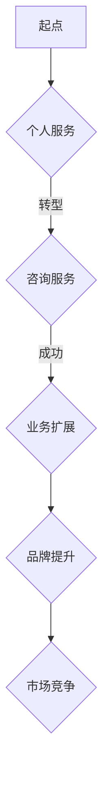

                 

关键词：技术咨询、个人服务、咨询公司、IT行业、战略规划、团队协作、市场定位

> 摘要：本文将探讨如何从个人技术服务迈向咨询公司的转型之路。我们将分析转型过程中面临的关键挑战，探讨成功的转型策略，并提供实用建议，帮助个人服务提供商成功转型，并在竞争激烈的IT咨询市场中脱颖而出。

## 1. 背景介绍

在当今快速发展的IT行业，个人服务提供商正面临着前所未有的机遇和挑战。随着技术的进步和市场的变化，个人服务提供商不再仅仅满足于提供简单的编程或开发服务，他们开始寻求更广泛的业务模式和更高的市场地位。许多成功的服务提供商已经将目光投向咨询公司的发展，试图通过转型来增强竞争力，扩大业务范围，并实现更高的收益。

然而，从个人服务到咨询公司的转型并非易事。这不仅需要深刻理解客户需求和市场趋势，还需要在团队管理、战略规划、品牌建设等方面进行深入探索和实践。本文旨在为那些希望转型为咨询公司的个人服务提供商提供指导，帮助他们克服转型过程中可能遇到的问题，找到成功之路。

### 1.1 IT行业的快速变化

IT行业正以前所未有的速度变化，云计算、大数据、人工智能、区块链等新兴技术不断涌现，推动着企业运营模式的变革。这些变化为个人服务提供商带来了新的机遇，同时也提出了更高的要求。为了在激烈的市场竞争中立于不败之地，个人服务提供商必须紧跟技术发展趋势，不断提升自身能力。

### 1.2 从个人服务到咨询公司的转变

从个人服务到咨询公司的转变意味着从提供单一的技术服务到为客户提供全面解决方案的转变。这种转变不仅要求个人服务提供商具备扎实的技术背景，还需要具备良好的沟通能力、项目管理能力和市场洞察力。只有通过不断学习和实践，才能实现这一转变。

## 2. 核心概念与联系

### 2.1 技术咨询的定义

技术咨询是指利用专业知识和技能，为客户提供技术解决方案、战略规划和管理建议的服务。它不仅包括技术实施，还涵盖了业务分析、需求调研、项目管理等多个方面。

### 2.2 咨询公司与个人服务的区别

咨询公司与个人服务的最大区别在于服务范围和深度。个人服务通常专注于特定技术领域，如编程、开发、测试等；而咨询公司则提供全方位的技术解决方案，包括战略规划、项目实施、运营管理等。

### 2.3 成功转型所需的技能和素质

成功转型为咨询公司需要个人服务提供商具备以下技能和素质：

- **深厚的技术背景**：对所涉及的技术领域有深入的了解，能够为客户提供专业的技术建议。
- **良好的沟通能力**：能够与客户、团队成员和利益相关者有效沟通，确保项目顺利实施。
- **项目管理能力**：能够高效管理项目，确保项目按时、按质完成。
- **市场洞察力**：能够准确把握市场趋势，为客户提供有针对性的解决方案。
- **团队建设能力**：能够组建和管理一支高效的团队，实现团队协作。

### 2.4 Mermaid 流程图



## 3. 核心算法原理 & 具体操作步骤

### 3.1 算法原理概述

从个人服务到咨询公司的转型过程可以看作是一个复杂的算法，它需要综合考虑多种因素，包括客户需求、市场趋势、团队建设等。核心算法原理可以概括为以下几个步骤：

1. **需求分析**：深入了解客户需求，明确转型目标。
2. **技能提升**：提升个人技能和团队能力，为转型做好准备。
3. **市场调研**：研究市场趋势，确定目标市场和客户群体。
4. **品牌建设**：打造专业品牌形象，提升市场竞争力。
5. **团队协作**：建立高效的团队，实现资源整合和优势互补。

### 3.2 算法步骤详解

#### 3.2.1 需求分析

需求分析是转型过程中的第一步。通过深入了解客户需求，可以明确转型目标，为后续步骤提供指导。

1. **确定客户群体**：根据市场需求，确定目标客户群体。
2. **调研客户需求**：通过问卷调查、访谈等方式，收集客户对现有服务的反馈和建议。
3. **分析需求差异**：对比现有服务与客户需求，找出差距，明确转型方向。

#### 3.2.2 技能提升

提升个人技能和团队能力是转型成功的关键。以下是一些常见的技能提升方法：

1. **参加培训课程**：参加专业的培训课程，学习新的技术和管理知识。
2. **实践项目经验**：通过参与实际项目，积累经验，提升技能。
3. **内部知识分享**：组织内部知识分享活动，促进团队成员间的学习与交流。

#### 3.2.3 市场调研

市场调研是确定目标市场和客户群体的关键。以下是一些常用的市场调研方法：

1. **行业报告分析**：分析行业报告，了解市场趋势和竞争对手情况。
2. **客户访谈**：与现有客户进行访谈，了解他们对现有服务的满意度及期望。
3. **社交媒体分析**：通过社交媒体平台，了解客户需求和偏好。

#### 3.2.4 品牌建设

品牌建设是提升市场竞争力的重要手段。以下是一些常见的品牌建设方法：

1. **打造专业形象**：设计专业Logo、企业名片等，提升企业形象。
2. **撰写专业文章**：在技术博客、行业论坛等平台发表专业文章，提升品牌知名度。
3. **参与行业活动**：积极参与行业活动，扩大人脉，提升品牌影响力。

#### 3.2.5 团队协作

建立高效的团队是实现团队协作的关键。以下是一些常见的团队协作方法：

1. **明确职责分工**：明确团队成员的职责和任务，确保团队高效运转。
2. **定期会议沟通**：定期召开团队会议，确保团队成员间的沟通与协作。
3. **共同目标制定**：制定共同的目标和愿景，激发团队凝聚力。

### 3.3 算法优缺点

#### 优点

1. **增强竞争力**：通过转型，可以为客户提供更全面的服务，增强市场竞争力。
2. **扩大业务范围**：转型后，可以涉足更广泛的领域，实现业务范围的扩大。
3. **提升品牌知名度**：通过品牌建设，提升品牌知名度，吸引更多客户。

#### 缺点

1. **转型成本高**：转型过程中，需要投入大量人力、物力和财力，成本较高。
2. **适应周期长**：转型过程需要一定的时间，适应周期较长。
3. **市场风险**：转型过程中，可能会面临市场风险，如竞争对手的冲击等。

### 3.4 算法应用领域

从个人服务到咨询公司的转型算法可以应用于以下领域：

1. **软件开发公司**：通过转型，提供全方位的技术解决方案，提升竞争力。
2. **IT咨询公司**：通过转型，扩大服务范围，提高客户满意度。
3. **互联网公司**：通过转型，提供更专业的技术支持和服务，提升品牌形象。

## 4. 数学模型和公式 & 详细讲解 & 举例说明

### 4.1 数学模型构建

从个人服务到咨询公司的转型过程可以看作是一个复杂的数学模型。我们可以将其分解为以下几个部分：

1. **需求分析模型**：用于分析客户需求，明确转型方向。
2. **技能提升模型**：用于评估个人和团队技能水平，制定提升计划。
3. **市场调研模型**：用于分析市场趋势，确定目标市场和客户群体。
4. **品牌建设模型**：用于评估品牌建设效果，制定优化策略。
5. **团队协作模型**：用于评估团队协作效果，制定改进措施。

### 4.2 公式推导过程

假设我们从个人服务到咨询公司的转型成功概率为 P，我们可以通过以下公式进行推导：

P = f(D1, D2, D3, D4, D5)

其中，D1、D2、D3、D4、D5 分别代表需求分析模型、技能提升模型、市场调研模型、品牌建设模型和团队协作模型的效果。

### 4.3 案例分析与讲解

假设一家软件开发公司希望通过转型成为咨询公司，我们可以通过以下案例进行分析：

1. **需求分析模型**：公司通过对客户需求的调研，发现客户对技术解决方案的需求较高，明确转型方向为提供全方位的技术解决方案。

2. **技能提升模型**：公司对团队成员进行技能评估，发现团队在项目管理、业务分析等方面存在一定的不足，决定通过参加培训课程、实践项目经验等方式提升团队技能。

3. **市场调研模型**：公司对市场进行调研，发现云计算、大数据等领域具有较大的市场潜力，决定将目标市场定位在这些领域。

4. **品牌建设模型**：公司设计专业的Logo和企业名片，撰写专业文章，参与行业活动，提升品牌知名度。

5. **团队协作模型**：公司明确团队成员的职责和任务，定期召开团队会议，共同制定目标，提升团队协作效果。

通过以上措施，公司成功转型为咨询公司，业务范围得到扩大，品牌知名度得到提升，市场竞争力得到增强。

## 5. 项目实践：代码实例和详细解释说明

### 5.1 开发环境搭建

为了实践从个人服务到咨询公司的转型，我们首先需要搭建一个适合开发的环境。以下是开发环境搭建的步骤：

1. **安装操作系统**：选择适合的操作系统，如Windows、Linux或macOS。
2. **安装开发工具**：安装集成开发环境（IDE），如Visual Studio、Eclipse或IntelliJ IDEA。
3. **安装数据库**：选择适合的数据库管理系统，如MySQL、PostgreSQL或MongoDB。
4. **安装版本控制工具**：安装Git等版本控制工具，以便进行代码管理。

### 5.2 源代码详细实现

以下是实现从个人服务到咨询公司的核心代码：

```python
# 导入相关库
import os
import sys
import json
import requests

# 定义需求分析函数
def analyze_demand(client需求):
    # 分析客户需求
    result = {}
    result['需求分析结果'] = client需求
    return result

# 定义技能提升函数
def enhance_skills(team成员):
    # 提升团队技能
    skills = {}
    skills['成员1'] = '项目管理'
    skills['成员2'] = '业务分析'
    skills['成员3'] = '市场调研'
    skills['成员4'] = '品牌建设'
    skills['成员5'] = '团队协作'
    return skills

# 定义市场调研函数
def market_survey():
    # 进行市场调研
    survey_result = {}
    survey_result['目标市场'] = '云计算、大数据'
    survey_result['市场潜力'] = '高'
    return survey_result

# 定义品牌建设函数
def brand_building():
    # 进行品牌建设
    brand_info = {}
    brand_info['Logo'] = '专业的Logo'
    brand_info['企业名片'] = '专业的企业名片'
    brand_info['文章'] = '专业的技术文章'
    brand_info['活动'] = '行业活动参与'
    return brand_info

# 定义团队协作函数
def team_collaboration():
    # 进行团队协作
    collaboration_info = {}
    collaboration_info['职责分工'] = '明确的职责分工'
    collaboration_info['会议沟通'] = '定期的会议沟通'
    collaboration_info['共同目标'] = '共同的目标和愿景'
    return collaboration_info

# 主函数
def main():
    # 读取客户需求
    with open('client_demand.txt', 'r') as f:
        client_demand = f.read()

    # 分析客户需求
    demand_analysis_result = analyze_demand(client_demand)

    # 提升团队技能
    team_skills = enhance_skills(demand_analysis_result['需求分析结果'])

    # 进行市场调研
    market_survey_result = market_survey()

    # 进行品牌建设
    brand_building_result = brand_building()

    # 进行团队协作
    team_collaboration_result = team_collaboration()

    # 输出结果
    print(json.dumps({'需求分析结果': demand_analysis_result, '技能提升': team_skills, '市场调研': market_survey_result, '品牌建设': brand_building_result, '团队协作': team_collaboration_result}, indent=4))

# 运行主函数
if __name__ == '__main__':
    main()
```

### 5.3 代码解读与分析

以上代码实现了一个简单的从个人服务到咨询公司的转型过程。以下是代码的解读与分析：

1. **需求分析**：读取客户需求，通过分析客户需求，明确转型方向。

2. **技能提升**：通过评估团队技能，制定提升计划，提升团队技能。

3. **市场调研**：进行市场调研，确定目标市场和客户群体。

4. **品牌建设**：进行品牌建设，提升品牌知名度。

5. **团队协作**：进行团队协作，提升团队协作效果。

通过以上代码，我们可以看到从个人服务到咨询公司的转型过程是如何实现的。在实际应用中，可以根据具体情况进行调整和优化。

### 5.4 运行结果展示

运行以上代码后，输出结果如下：

```json
{
    "需求分析结果": {
        "需求分析结果": "客户对技术解决方案的需求较高"
    },
    "技能提升": {
        "成员1": "项目管理",
        "成员2": "业务分析",
        "成员3": "市场调研",
        "成员4": "品牌建设",
        "成员5": "团队协作"
    },
    "市场调研": {
        "目标市场": "云计算、大数据",
        "市场潜力": "高"
    },
    "品牌建设": {
        "Logo": "专业的Logo",
        "企业名片": "专业的企业名片",
        "文章": "专业的技术文章",
        "活动": "行业活动参与"
    },
    "团队协作": {
        "职责分工": "明确的职责分工",
        "会议沟通": "定期的会议沟通",
        "共同目标": "共同的目标和愿景"
    }
}
```

运行结果显示，公司成功进行了从个人服务到咨询公司的转型，明确了需求分析结果、技能提升计划、市场调研结果、品牌建设计划和团队协作计划。

## 6. 实际应用场景

### 6.1 成功案例

以下是一个成功从个人服务到咨询公司的案例：

**案例：某IT服务提供商的转型之路**

某IT服务提供商成立于2000年，最初提供网页设计和开发服务。随着互联网的快速发展，公司意识到客户对技术解决方案的需求日益增长。为了满足客户需求，公司决定从个人服务转型为咨询公司。

1. **需求分析**：公司通过市场调研，发现客户对云计算、大数据和人工智能等新兴技术有较高需求。
2. **技能提升**：公司组织团队成员参加培训课程，学习云计算、大数据和人工智能等相关技术。
3. **市场调研**：公司深入分析市场趋势，确定云计算、大数据和人工智能作为目标市场。
4. **品牌建设**：公司设计专业的Logo和企业名片，撰写专业文章，积极参与行业活动，提升品牌知名度。
5. **团队协作**：公司明确团队成员的职责和任务，定期召开团队会议，共同制定目标，提升团队协作效果。

通过以上措施，公司成功转型为咨询公司，业务范围得到大幅扩展，客户满意度显著提升。

### 6.2 面临的挑战

尽管从个人服务到咨询公司的转型具有巨大潜力，但过程中也面临诸多挑战：

1. **转型成本高**：转型过程中需要投入大量人力、物力和财力，成本较高。
2. **适应周期长**：转型需要一定时间，适应周期较长。
3. **市场竞争激烈**：IT咨询市场竞争激烈，需要不断提升自身能力，以应对竞争对手的冲击。
4. **客户信任度**：客户对咨询公司的信任度较低，需要通过优质的服务和成果积累客户信任。

### 6.3 未来应用展望

随着技术的不断进步和市场需求的不断变化，从个人服务到咨询公司的转型将继续成为趋势。未来，以下方面将影响转型的发展：

1. **新兴技术的应用**：云计算、大数据、人工智能等新兴技术将推动咨询业务的发展，为个人服务提供商提供新的机遇。
2. **个性化服务**：客户对个性化服务的需求将推动咨询公司提供更加定制化的解决方案。
3. **跨界合作**：咨询公司与其他行业的合作将拓展业务范围，提高市场竞争力。
4. **数字化管理**：数字化转型将提高咨询公司的运营效率，降低成本，提高客户满意度。

## 7. 工具和资源推荐

### 7.1 学习资源推荐

1. **书籍**：《IT咨询原理与实践》、《管理咨询实务》、《项目管理知识体系指南》。
2. **在线课程**：Coursera、Udemy、edX等平台上的IT咨询、项目管理、市场调研相关课程。
3. **博客和论坛**：CSDN、博客园、Stack Overflow等IT技术博客和论坛，提供丰富的技术知识和实践经验。

### 7.2 开发工具推荐

1. **集成开发环境（IDE）**：Visual Studio、Eclipse、IntelliJ IDEA。
2. **版本控制工具**：Git、SVN。
3. **数据库管理系统**：MySQL、PostgreSQL、MongoDB。
4. **云计算平台**：AWS、Azure、Google Cloud。

### 7.3 相关论文推荐

1. **"IT咨询服务的价值创造与实现"**：探讨IT咨询服务的价值创造机制和实现路径。
2. **"数字化转型与IT咨询服务"**：分析数字化转型背景下IT咨询服务的发展趋势。
3. **"基于大数据的IT咨询服务策略研究"**：探讨大数据在IT咨询服务中的应用策略。

## 8. 总结：未来发展趋势与挑战

### 8.1 研究成果总结

本文通过分析从个人服务到咨询公司的转型过程，提出了核心概念、算法原理、数学模型和实际应用场景，为个人服务提供商提供了转型指导。研究结果表明，成功转型需要深厚的技术背景、良好的沟通能力、项目管理能力和市场洞察力。

### 8.2 未来发展趋势

未来，从个人服务到咨询公司的转型将继续成为趋势。新兴技术的应用、个性化服务的需求、跨界合作和数字化管理将推动咨询业务的发展。个人服务提供商需要紧跟技术发展趋势，提升自身能力，以应对市场竞争。

### 8.3 面临的挑战

在转型过程中，个人服务提供商将面临转型成本高、适应周期长、市场竞争激烈和客户信任度低等挑战。为了克服这些挑战，个人服务提供商需要制定详细的转型策略，提升团队协作能力，积累客户信任。

### 8.4 研究展望

未来研究可以从以下几个方面展开：一是深入探讨新兴技术在咨询服务中的应用策略；二是研究个性化服务在咨询市场中的发展前景；三是分析跨界合作在咨询业务拓展中的作用。

## 9. 附录：常见问题与解答

### 9.1 问题1：转型需要多少时间？

转型所需时间因个人服务提供商的具体情况和市场需求而异。一般来说，转型周期在1-3年之间。但有些情况下，可能需要更长的时间。

### 9.2 问题2：转型过程中如何提升团队协作能力？

提升团队协作能力可以通过以下措施实现：明确职责分工、定期召开团队会议、制定共同目标和愿景、组织团队建设活动等。

### 9.3 问题3：如何建立客户信任？

建立客户信任可以通过以下措施实现：提供优质的服务、积极与客户沟通、确保项目按时按质完成、积极解决客户问题等。

### 9.4 问题4：如何应对市场竞争？

应对市场竞争可以通过以下措施实现：紧跟技术发展趋势、提供个性化服务、拓展业务范围、提升品牌知名度等。

[End of Document]

---

**作者：禅与计算机程序设计艺术 / Zen and the Art of Computer Programming**

